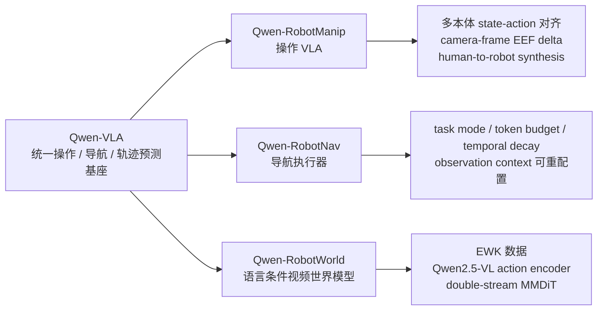

# Qwen-Robot 系列专题

2026 年 6 月,Qwen 团队连续放出三篇机器人技术报告:**Qwen-RobotManip**、**Qwen-RobotNav**、**Qwen-RobotWorld**。它们不是一个简单的"厂商专题",更像 Qwen-VLA 之后拆出来的三条工程化分支:操作、导航、世界模型。

一句话概括:

- **Qwen-RobotManip**:把 Qwen-VLA 往机械臂操作推进,重点是多本体 state-action 对齐与操作数据规模化。
- **Qwen-RobotNav**:把 Qwen3-VL 改造成可被上层 agent 调用的导航执行器,输出 waypoint trajectory。
- **Qwen-RobotWorld**:不直接控制机器人,而是用语言条件视频生成来做世界模型 / 数据引擎。

::: warning 可信度提示
三篇都是 2026 年 6 月的技术报告,极新、非同行评审。本文把 arXiv、官方博客、GitHub/项目页视为一手来源可核;但 LIBERO、RoboTwin、VLN、EWMBench 等性能数字均按作者自评处理,不做跨论文硬排名。
:::

## 1. 系列关系

从谱系上看,Qwen-VLA 是"一个模型覆盖操作、导航、轨迹预测"的总基座;Qwen-Robot 三篇则把这个总命题拆成更具体的工程系统:

| 分支 | 主要问题 | 输出形态 | 站内归类 |
|---|---|---|---|
| [Qwen-RobotManip](/vla/papers/qwen-robotmanip) | 多机器人、多坐标系、多动作格式如何统一训练 | 连续机械臂 / EEF 动作块 | VLA · 连续操作 |
| [Qwen-RobotNav](/vla/papers/qwen-robotnav) | 导航任务如何被上层 agent 动态重配置 | waypoint trajectory | VLA · 分层/导航 |
| [Qwen-RobotWorld](/wam/papers/qwen-robotworld) | 不同本体和任务的动作如何统一为可生成的未来视觉 | language-conditioned future video | WAM · 世界模型/数据引擎 |

## 2. 三篇分别讲什么

### Qwen-RobotManip:操作 VLA 的 scaling recipe

**论文**:[arXiv:2606.17846](https://arxiv.org/abs/2606.17846) · [官方博客](https://qwen.ai/blog?id=qwen-robotmanip) · [GitHub](https://github.com/QwenLM/Qwen-RobotManip) · [站内细读](/vla/papers/qwen-robotmanip)

这篇不是单纯数据集论文。它的核心观点是:机器人操作数据不能只靠"堆量",必须先把多本体、多坐标系、多动作格式对齐。

关键点:

- **Qwen3.5-4B VL backbone + flow-matching DiT action expert**。
- **80 维 canonical state-action vector**:给左右臂、EEF、夹爪、灵巧手和预留自由度固定语义槽位。
- **camera-frame EEF delta**:让动作表示贴近视觉观测坐标,减少跨本体几何冲突。
- **human-to-robot synthesis**:把第一人称人手视频重定向到多种机器人平台,与开源机器人轨迹共同构成约 **38,100 小时**操作预训练语料。

判断:它是 **"数据对齐 + 操作策略模型"** 的结合体。数据层贡献很重,但最终目标仍是 manipulation policy。

### Qwen-RobotNav:agent 可调用的导航执行器

**论文**:[arXiv:2606.18112](https://arxiv.org/abs/2606.18112) · [官方博客](https://qwen.ai/blog?id=qwen-robotnav) · [GitHub](https://github.com/QwenLM/Qwen-RobotNav) · [站内细读](/vla/papers/qwen-robotnav)

这篇把 VLN、PointNav、ObjNav、Tracking、自动驾驶等任务统一成 waypoint trajectory prediction。它的重点不是机械臂动作,而是导航任务里的"观测历史怎么喂给模型"。

关键点:

- 继承 **Qwen3-VL** 的视觉语言理解能力。
- 输出 **K=8 个 waypoint**,每个 waypoint 是 `(x, y, theta)`。
- 提供 **task-adaptive observation encoding**:task mode、视觉 token budget、时间衰减、相机权重、采样模式都能在推理时调整。
- 在 agentic navigation 系统里,上层 planner 负责拆任务,Qwen-RobotNav 负责执行局部导航段。

判断:它更像 **System-1 navigation primitive / executor**,不是通用操作 VLA。它属于模型/系统层,数据层不是唯一重点。

### Qwen-RobotWorld:世界模型与数据引擎

**论文**:[arXiv:2606.17030](https://arxiv.org/abs/2606.17030) · [官方博客](https://qwen.ai/blog?id=qwen-robotworld) · [站内细读](/wam/papers/qwen-robotworld)

这篇最接近"数据层 / 仿真层 / 世界模型层"。它不直接输出机器人动作,而是把动作写成自然语言条件,从当前观测生成未来视觉轨迹。

关键点:

- 冻结 **Qwen2.5-VL** 作为 action / semantic encoder。
- 使用 **Wan-VAE + 60 层 double-stream MMDiT** 生成未来视频 latent。
- 构建 **EWK:8.6M video-text pairs / 200M+ frames**,覆盖 manipulation、driving、indoor navigation、human-to-robot transfer。
- 下游目标是合成数据、虚拟评测和规划先验,不是直接闭环控制。

判断:它确实更偏 **世界模型 / 数据引擎**。引用其 benchmark 时要注明是视频世界模型质量,不能解释为机器人成功率。

## 3. 它们是不是"数据层面的工作"?

不完全是。更准确地说:

| 论文 | 数据层权重 | 模型/系统层权重 | 一句话判断 |
|---|---:|---:|---|
| Qwen-RobotManip | 高 | 高 | 数据对齐是关键贡献,但目标是操作策略 |
| Qwen-RobotNav | 中 | 高 | 重点是导航模型接口与 agentic execution |
| Qwen-RobotWorld | 很高 | 高 | 世界模型 + embodied video 数据引擎 |

所以不能把后三篇都简单归成"数据工作"。Manip 和 World 的数据工程很重,Nav 更偏模型接口与系统组合。

## 4. 建议阅读顺序

1. 先读 [Qwen-VLA](/vla/papers/qwen-vla):理解"统一操作 / 导航 / 轨迹预测"的总模型命题。
2. 再读 [Qwen-RobotManip](/vla/papers/qwen-robotmanip):看操作数据如何对齐到统一 action space。
3. 接着读 [Qwen-RobotNav](/vla/papers/qwen-robotnav):看导航如何从单任务模型变成可配置 executor。
4. 最后读 [Qwen-RobotWorld](/wam/papers/qwen-robotworld):看 Qwen 系列如何用世界模型扩展数据、评测和规划。
5. 如果要看关系网络,再去 [论文知识图谱](/ecosystem/paper-graph) 看 Qwen-VLA 到三条分支的桥接。

## 5. 相关动态

- [具身智能新闻](/news/):搜索 `Qwen-Robot` 可看到三条动态。
- [2026-06-18 更新日志](/vla/changelog)
