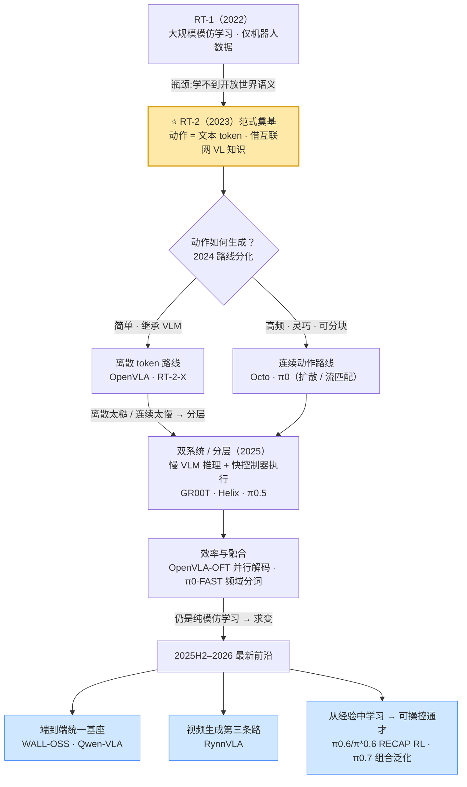

# VLA(视觉-语言-动作)模型发展深度调研报告

> **方法**:多源检索 + 对抗式事实核查工作流(deep-research),共四轮、约 428 个子代理调用。每条关键声明经 3 票对抗核查,需 2/3 反对才推翻;四轮合计核查 100 条声明,确认 97、证伪 3。
> **日期**:2026-05-30。领域演进极快(2022–2026),多数一手信源为 2024–2026 预印本/官方页面。
> **可信度标注**:凡标 ⚠️ 者为提出方/厂商自评数据,非同行评审或独立第三方复现,采信时请注意。

---

## 摘要

RT-2(2023)把"动作当文本 token"奠定了 VLA 范式。此后领域沿两条动作生成路线分化:**离散自回归 token**(RT-2、OpenVLA)与**连续扩散/流匹配**(Octo、π0、GR00T)。Open X-Embodiment(OXE)成为公共训练底座。到 2024–2026,前沿系统(Helix、π0.5、GR00T 系列)收敛到**双系统/分层架构**——慢速互联网预训练 VLM 负责推理(System 2),快速连续动作控制器负责执行(System 1)。技术天平整体倒向连续动作生成(尤其精细灵巧控制),但 π0.5 这类混合模型在高层子任务上保留离散 token、在底层动作上用流匹配,两条路正走向融合。标准化基准(SimplerEnv/LIBERO/CALVIN)上,OpenVLA-OFT 等以连续表示 + 动作分块刷新 SOTA 并把推理提速一个量级。2025H2–2026 这一波(WALL-OSS、Qwen-VLA、RynnVLA-001、π0.6/π*0.6、Gemini Robotics、π0.7)进一步把方向推向**端到端统一基座、视频生成第三条路与从真机经验中强化学习**(详见[第五部分](#五2025h22026-最新前沿))。

---

## 📄 论文细读导航

每篇核心论文配一份独立的细粒度解读(含官方框架图、逐模块拆解、关键数据表),点击跳转。本表按"路线/主题"组织以便导航;**按时间轴排序的完整里程碑(年份+阶段)以 [发展时间线](papers/timeline.md) 为准**,本表不重复维护年代序。

> 📍 **论文较多、不知从哪读起?** 见 [如何阅读本站](guide.md) 的「阅读优先级」——分 🥇 必读核心(约 7 篇)/ 🥈 推荐 / 🥉 选读 三档,不必通读。

**奠基与两条路线(2022–2025)**

| 论文 | 路线 | 一句话 | 细读 |
|---|---|---|---|
| RT-1 (2022) | 离散前史 | 35M 小模型 + 13 万真机演示,256-bin 离散动作,RT-2 前身 | [→ 细读](papers/rt1.md) |
| RT-2 (2023) | 离散 token | 动作即文本 token,奠定 VLA 范式 | [→ 细读](papers/rt2.md) |
| Diffusion Policy (2023) | 连续扩散奠基 | 条件去噪扩散 + 动作分块,连续路线思想源头(非 VLA) | [→ 细读](papers/diffusion-policy.md) |
| OpenVLA (2024) | 离散 token | 7B 开源,1/7 参数超 55B RT-2-X | [→ 细读](papers/openvla.md) |
| Octo (2024) | 连续扩散 | OXE 80 万轨迹,transformer 扩散策略 | [→ 细读](papers/octo.md) |
| π0 (2024) | 连续流匹配 | 流匹配 + 动作分块,50 Hz 灵巧控制 | [→ 细读](papers/pi0.md) |
| CogACT (2024) | 组件化:认知+扩散 | 7B VLM 出认知 token + DiT 扩散动作专家 | [→ 细读](papers/cogact.md) |
| π0-FAST (2025) | 离散 token 高效化 | DCT 频域分词,让自回归 VLA 也能高频 | [→ 细读](papers/pi0-fast.md) |
| OpenVLA-OFT (2025) | 连续 L1 回归 | 并行解码提速 26×,LIBERO 97.1% SOTA | [→ 细读](papers/openvla-oft.md) |
| GR00T N1 (2025) | 双系统/扩散 | NVIDIA 工业级双系统,数据金字塔 | [→ 细读](papers/groot-n1.md) |
| π0.5 (2025) | 混合 | 开放世界泛化,离散+连续合一 | [→ 细读](papers/pi05.md) |

**2025H2–2026 最新前沿**(详见 [第五部分](#五2025h22026-最新前沿))

| 论文 | 机构 | 一句话 | 细读 |
|---|---|---|---|
| WALL-OSS (2025.09) | 自变量 X²Robot | Qwen2.5-VL MoE 端到端基座,FAST+流匹配双分支,Wall-OSS-0.5 零样本真机 | [→ 细读](papers/wall-oss.md) |
| Wall-OSS-0.5 (2026) | 自变量 X²Robot | 梯度桥接 co-training(离散 RVQ 桥+多模态锚+流匹配部署),MoT 双专家,4B 预训练即可部署,微调超 π0.5 17.5pp | [→ 细读](papers/wall-oss-05.md) |
| Qwen-VLA (2026.05) | 阿里 Qwen | Qwen3.5-4B + 1.15B DiT,统一操作/导航/轨迹 | [→ 细读](papers/qwen-vla.md) |
| RynnVLA-001 (2025.09) | 阿里达摩院 | Chameleon 视频生成基座 + ActionVAE,第三条路 | [→ 细读](papers/rynnvla.md) |
| π0.6 / π*0.6 (2025.11) | Physical Intelligence | 知识隔离训练 + RECAP 真机强化学习,从经验中学习 | [→ 细读](papers/pi06.md) |
| Gemini Robotics (2025.03→1.5 2025.09) | Google DeepMind | 云端 backbone + 本机 decoder 延迟拆分(≈250ms/50Hz)+ embodied reasoning | [→ 细读](papers/gemini-robotics.md) |
| π0.7 (2026.04) | Physical Intelligence | 可操控通才 + 组合泛化,不微调追平 π*0.6 RL 专家,零样本跨本体叠衣 | [→ 细读](papers/pi07.md) |

**更多代表模型(扩散基座 / 潜动作 / 记忆 / 空间 / 人形)**

| 论文 | 机构 | 一句话 | 细读 |
|---|---|---|---|
| ECoT (2024.07) | 伯克利/Stanford/华沙大学 | reasoning-VLA 奠基,OpenVLA 上先生成具身推理链(plan→subtask→motion→bbox)再出动作 | [→ 细读](papers/ecot.md) |
| TinyVLA (2024.09) | 美的/华东师大 等 | VLM 初始化+扩散策略头,跳过大规模机器人预训练,高数据效率、快推理 | [→ 细读](papers/tinyvla.md) |
| RoboVLMs (2024.12) | 字节 Research/清华 等 | 系统性实证+框架家族(主干/架构/跨本体数据消融),"建 VLA 什么最重要"的系统实证+常用 baseline | [→ 细读](papers/robovlms.md) |
| SimpleVLA-RL (2025.09) | 清华/上海AI Lab/北大 | VLA 专用在线 RL(veRL/GRPO),作用于 OpenVLA-OFT,⚠️ LIBERO-Long 97.6 超 π0 | [→ 细读](papers/simplevla-rl.md) |
| GR-3 (2025.07) | 字节跳动 Seed | Qwen2.5-VL-3B + flow-matching DiT(4B),三源配方(网页VL+VR人类轨迹+真机),双臂移动本体 ByteMini,自评超 π0 | [→ 细读](papers/gr-3.md) |
| RDT-1B (2024.10) | 清华 TSAIL | 1.2B 扩散 DiT 双臂基座,物理可解释统一动作空间,纯扩散一体化(第三种架构) | [→ 细读](papers/rdt-1b.md) |
| GO-1 (2025.03) | 智元 AgiBot | ViLLA:VLM 出潜动作 token → Latent Planner → 动作专家,潜动作升为推理期架构桥接 | [→ 细读](papers/go-1.md) |
| MemoryVLA (2025.08) | 清华黄高组等 | 感知-认知双记忆库打破单步马尔可夫假设,补长程时序短板(CogACT 加记忆版) | [→ 细读](papers/memoryvla.md) |
| SpatialVLA (2025.01) | 上海 AI Lab 等 | Ego3D 位置编码 + 自适应动作网格,给 2D VLA 注入 3D(含 3D-VLA/PointVLA 对照) | [→ 细读](papers/spatialvla.md) |
| Helix (2025.02) | Figure AI | 单权重 35-DoF 人形上半身双系统(7B@7-9Hz + 80M@200Hz),隐向量窄接口(⚠️ 无论文) | [→ 细读](papers/helix.md) |
| SmolVLA (2025.06) | Hugging Face / LeRobot | 0.45B 小型高效开源:冻结 SmolVLM-2 + ~100M 流匹配动作专家,层跳过/64token/异步推理;⚠️ LIBERO 87.3 追平 π0(3.3B)、超 OpenVLA(7B),训练快 40%/省显存 6× | [→ 细读](papers/smolvla.md) |
| SteerVLA (2026.02) | Stanford / UC Berkeley | 首篇自动驾驶域:高层 VLM 出语言 meta-action「操控」低层 VLA 回归 waypoint,VLM 事后稠密标注;⚠️ 闭环 Bench2Drive 长尾 +8.04 | [→ 细读](papers/steervla.md) |

**具身基础专题(VLA × WAM 共用)**

| 专题 | 范围 | 一句话 | 细读 |
|---|---|---|---|
| 具身数据全景 | 数据来源 / 采集 / 配比 / scaling | 四层数据金字塔 + 10 个真机数据集横评 + 采集范式成本 + co-training/scaling,8 条规模数字经对抗核查确认 | [→ 细读](papers/embodied-data.md) |
| 具身数据处理 | 清洗 / 标注 / 动作&观测处理 / 伪标签 / 配比 / 格式 | 从原始采集到可训练样本的处理流水线:归一化/分词/分块、IDM/潜动作伪标签、Re-Mix/n^0.43 配比、RLDS/LeRobot 格式 | [→ 专题](papers/data-processing.md) |
| 数据集与基准 | SimplerEnv / LIBERO / CALVIN / RoboCasa | 四大评测全景 + 逐模型成绩表(含 RoboCasa 同口径排行榜) | [→ 专题](papers/benchmarks.md) |
| 实验机器人本体 | 单臂 / 双臂 / 人形 / 跨本体 | 19 个实验本体对照表(平台/厂商/形态/DoF/关联模型与数据集)+ 跨本体迁移要点 | [→ 专题](papers/robots.md) |

**横切分析专题(跨模型对照,重组本站已核查内容)**

| 专题 | 范围 | 一句话 | 链接 |
|---|---|---|---|
| 全模型规格对比 | 30 模型 × 12 维 | 主干/视觉编码器/参数/动作表示/频率/语料/单体or双系统/许可一表打尽(成绩见基准、年代见时间线) | [→ 大表](papers/models-spec.md) |
| 双系统架构原理 | System 1/2 / 分层 / 知识隔离 | 辨析"频率解耦 vs 语义分层 vs 梯度隔离"三种常被混用的解耦,含跨系统对比表与单模型反例 | [→ 专题](papers/dual-system-architecture.md) |
| 预测式 VLA | 世界模型作策略主体 | VPP/DreamVLA/WorldVLA:推理时预演未来→反推动作,区别于 RynnVLA 的"预测只当训练先验" | [→ 专题](papers/predictive-vla.md) |
| 知识隔离训练配方 | KI(arXiv:2505.23705) | stop-gradient 挡住动作专家梯度 + FAST 离散监督主干 + co-training,π0.6/π0.7 背后的训练技法 | [→ 细读](papers/knowledge-insulation.md) |
| 推理加速与部署 | 算法/表示/系统/权重四层 | 9 类加速手段按层归类 + 实测增益 + 可叠加性,对应报告 §6.2 延迟缺口 | [→ 专题](papers/inference-deployment.md) |
| 开源代码库对照 | openpi/OpenVLA/LeRobot/Isaac-GR00T/Octo | 选型索引:维护方/动作头/权重/仿真真机/支持本体(非教程) | [→ 对照表](papers/codebases.md) |
| 共性失败模式 | 6 大失败维度 | 把各细读"局限"升维聚合(分布外/复合误差/接触/跨本体/指令/延迟),RoboMIND 12 类做桥梁 | [→ 失败显微镜](papers/failure-modes.md) |

**速查与参考**

| 页面 | 用途 | 链接 |
|---|---|---|
| 术语速查表 | 流匹配/动作分块/双系统/co-training 等术语一页速查 | [→ 术语表](papers/glossary.md) |
| 发展时间线 | 2022→2026 里程碑一览(30 篇细读定位) | [→ 时间线](papers/timeline.md) |
| 参考文献 | 全站一手信源(arXiv/官网)聚合 | [→ 信源](papers/references.md) |
| 外部资源导航 | 站外高质量 Awesome 论文合集 / 综述 / 基准仿真官方站 / 数据集 / 机构博客 | [→ 资源](papers/resources.md) |

---

# 一、范式演进与奠基

## 1.1 发展主线

VLA 的演进史,本质是反复回答两个问题——**「机器人从哪获得通用知识?」**与**「如何把知识变成动作?」**。每一阶段解决上一阶段的瓶颈,又暴露新的瓶颈,推动下一阶段。先看整体流程图:

下表是这条主线的五个阶段:

| 阶段 | 时间 | 代表工作 | 解决的核心问题 | 暴露的新瓶颈 → 推动下一阶段 |
|---|---|---|---|---|
| **0. 前史:大规模模仿** | 2022 | RT-1 | 用 Transformer 做大规模机器人模仿学习,证明"架构+规模"能提升泛化 | 知识只来自机器人数据,**学不到开放世界语义**,泛化天花板低 |
| **1. 范式奠基** | 2023 | RT-2 | **把动作塞进 VLM 词表**,借互联网视觉-语言知识 → VLA 范式诞生 | 动作离散化**精度/频率低**;模型闭源、巨大、推理慢 |
| **2. 开源化 + 路线分化** | 2024 | OpenVLA、Octo、π0 | OXE 成公共数据底座,范式平民化;动作生成分裂为**离散 token vs 连续扩散/流匹配**两路 | 离散太糙、连续推理慢;**单一系统难兼顾"慢推理"与"快控制"** |
| **3. 双系统/分层 + 效率** | 2025 | GR00T、Helix、π0.5、OpenVLA-OFT、π0-FAST | **慢 VLM 推理 + 快控制器执行**分层解耦;并行解码/频域分词提速;离散+连续融合 | 仍是**纯模仿学习**,靠堆数据;真机长尾失败、鲁棒性难解 |
| **4. 基座工程化 + 从经验学习** | 2025H2–26 | WALL-OSS、Qwen-VLA、RynnVLA、π0.6/π*0.6 | 端到端统一基座(多任务/多本体);**从模仿学习迈向真机强化学习(RECAP)** | 缺独立横评、安全对齐、sim-to-real 量化(见[第六部分](#六核查与局限)) |

**关键转折点**:**RT-2(2023)** 是全场分水岭——在它之前机器人学习是"专用模型 + 机器人数据",在它之后变成"通用 VLM + 动作生成"。 〔[📄 RT-2 细读](papers/rt2.md)〕RT-1 是它的前身:EfficientNet 视觉编码器 + Transformer decoder 输出离散动作(256 bin),已验证"规模换泛化",但知识来源单一;RT-2 则把动作表达为文本 token、与自然语言 token 一样纳入 VLM 训练集,在网络规模 VQA 等任务与机器人轨迹上**联合微调**,首次证明**网络知识可迁移到机器人控制**(基于 PaLI-X 5B/55B 与 PaLM-E 12B)。

### 贯穿全程的四条暗线

把上面五个阶段竖着看,有四条始终在演进的主轴:

1. **知识来源**:机器人数据 → +互联网视觉-语言知识(RT-2)→ +人类视频/合成数据(GR00T、RynnVLA)→ **+真机部署经验**(π*0.6 的 RL)。
2. **动作生成**:离散 token → 离散 vs 连续分化 → 分层(高层离散 + 底层连续)+ 效率优化 → 多路并存/融合。
3. **系统形态**:单体大模型 → **双系统**(慢推理 System 2 + 快执行 System 1)。
4. **学习范式**:模仿学习(行为克隆)→ **模仿 + 强化**(从经验中学习,RECAP)。

```mermaid
flowchart LR
    subgraph K["① 知识来源"]
        direction LR
        K1["机器人数据"] --> K2["+互联网 VL 知识"] --> K3["+人类视频 / 合成"] --> K4["+真机 RL 经验"]
    end
    subgraph A["② 动作生成"]
        direction LR
        A1["离散 token"] --> A2["离散 vs 连续分化"] --> A3["分层:高层离散+底层连续"] --> A4["多路融合"]
    end
    subgraph S["③ 系统形态"]
        direction LR
        S1["单体大模型"] --> S2["双系统:慢推理 + 快执行"]
    end
    subgraph L["④ 学习范式"]
        direction LR
        L1["模仿学习"] --> L2["模仿 + 强化（从经验学习）"]
    end
    K ~~~ A ~~~ S ~~~ L
```

*图示:四条暗线各自从左(早期)向右(最新)演进——横看每步"为何发生",纵看"什么在持续演化"。*

## 1.2 学界的三种组织视角

均经核查,但**各为单一综述的框架,非社区统一标准**:

| 视角 | 来源 | 内容 |
|---|---|---|
| 三大研究方向 | 首篇 VLA 综述(arXiv:2405.14093, 2024.05) | ① VLA 组件 ② 控制策略(低层动作) ③ 高层任务规划器(长程分解) |
| 动作 token 分类 | "Action Tokenization" 综述(arXiv:2507.01925) | 8 类:语言描述、代码、可供性、轨迹、目标状态、隐表示、原始动作、推理 |
| 三阶段时间线 | arXiv:2505.04769 | 基础融合(2022–23)→ 专业化与具身推理(2024)→ 泛化与安全关键部署(2025) |

---

# 二、代表性模型

> 本节只展开**精选代表**以勾勒两条路线与双系统的脉络;**完整 30 篇模型细读清单见开头的 [📄 论文细读导航](#-论文细读导航)**。下文未单独展开的模型(如 RT-1 离散前史、π0-FAST 频域分词)在第三、四部分与对应细读中讨论。

## 2.1 离散 token 路线

**OpenVLA(7B,开源)** 〔[📄 细读](papers/openvla.md)〕
- **Llama 2 7B** 主干 + **DINOv2 + SigLIP 融合视觉编码器**;在 OXE 的 **97 万条真实机器人演示**上训练。
- 作为闭源 RT-2-X 的开源对标,**用 1/7 参数量,在 29 任务/多本体上以 16.5%(绝对成功率)超越 55B 的 RT-2-X**;支持 LoRA 微调与量化部署。
- ⚠️ 基准为作者自评(BridgeData V2 + Google robot),已过 CoRL 2024 评审,非独立复现。

**OpenVLA-OFT(优化微调路线)** 〔[📄 细读](papers/openvla-oft.md)〕
- **OFT 配方 = 并行解码 + 动作分块 + 连续动作表示 + L1 回归目标**,是一条独立于离散 token 与扩散的"连续回归"路线;详见第三、四部分。

## 2.2 连续动作路线(扩散/流匹配)

**Diffusion Policy(连续路线的思想源头,2023,非 VLA)** 〔[📄 细读](papers/diffusion-policy.md)〕
- 把机器人视觉运动策略表述为**条件去噪扩散过程**,配合**动作分块**(一次生成一段动作序列)——后来 Octo/π0/GR00T 的连续动作专家都建立在这一思路上。
- 本身不带语言条件、不算 VLA,但确立了"用生成式模型直接输出连续动作块"的范式,是连续路线的奠基参照。

**Octo(transformer 扩散策略)** 〔[📄 细读](papers/octo.md)〕
- 模块化开放框架,基于 **OXE 80 万条轨迹**(当时最大机器人操作数据集)训练;可在消费级 GPU 上数小时内微调到新传感器/动作空间;跨 9 个平台验证。

**π0(Physical Intelligence)** 〔[📄 细读](papers/pi0.md)〕
- PaliGemma VLM(SigLIP 400M + Gemma 2.6B)+ **独立 ~300M 流匹配动作专家**(MoE 风格)。
- **流匹配 + 动作分块 → 高达 50 Hz 高频灵巧控制**(如叠衣服);一次生成 50 步动作块,约 10 步去噪。
- 评测超越 OpenVLA(7B)与 Octo(93M);论文指出 **OpenVLA 的自回归离散化不支持动作分块**,在灵巧任务上吃亏。⚠️ 作者自评。

**CogACT(组件化:认知 + 扩散,2024)** 〔[📄 细读](papers/cogact.md)〕
- 把 VLA 显式拆成**认知与动作两个组件**:7B VLM 输出"认知 token",再由独立的 **DiT 扩散动作专家**条件生成连续动作——而非让 VLM 直接吐离散动作 token。
- 论证"VLM 负责理解、专门扩散模块负责动作"的组件化设计优于把动作硬塞进词表;SimplerEnv Google Robot 视觉匹配 74.8%(⚠️ 原表 82.7 系误传,本轮已更正,见 §4.2 与[细读](papers/cogact.md))。

**NVIDIA GR00T N1(双系统,2025.03)** 〔[📄 细读](papers/groot-n1.md)〕
- System 2:VL 模块(预训练 VLM,~10 Hz)负责理解推理;System 1:DiT(流匹配速度预测,16 步动作块)实时生成连续动作。
- 训练数据为"金字塔":**真实机器人轨迹 + 人类视频 + 合成数据**异构混合,缓解数据稀缺。

## 2.3 2024–2026 前沿:双系统/分层架构

> **趋势**:慢速互联网预训练 VLM(System 2,推理)配快速连续动作控制器(System 1,执行)。

**Figure AI Helix(2025.02)**

| 维度 | 内容 |
|---|---|
| System 2 | **7B** 互联网预训练开放权重 VLM,**7–9 Hz**,场景与语言理解 |
| System 1 | **80M** 交叉注意力 encoder-decoder Transformer,**200 Hz**,把 S2 隐语义翻译为连续动作 |
| 动作空间 | **35 自由度 @ 200 Hz**,控制整个人形上半身(手指、末端轨迹、头部注视、躯干) |
| 厂商"首创"声明 | 首个高速连续控制整个人形上半身的 VLA;首个**同时驱动两台协作机器人**的 VLA |

⚠️ 均为 Figure 新闻稿自报,非同行评审;社区对 demo 是否"挑片"存疑,但无信源反驳具体数字。

**Physical Intelligence π0.5(2025.04)** 〔[📄 细读](papers/pi05.md)〕
- **基于 π0,实现开放世界泛化**:**首次**让端到端学习的机器人在**训练中从未见过的全新住宅**完成长程灵巧操作(打扫厨房/卧室,10–15 分钟多阶段行为)。
- **协同训练数据混合**(异构):多机器人 + 多模态网络数据(QA/字幕/检测)+ π0 原始跨本体 + 多环境静态机器人 + 口头分步指令 + 带边界框的高层语义子任务。消融:去掉跨本体数据→大幅退化;网络数据影响物体泛化。
- **分层两级推理(两条路合一)**:高层用**离散 token(FAST)**生成自然语言子任务;底层用**流匹配动作专家**输出 50 步(~1 秒)连续关节动作块。
- **泛化规模化**:约 **100 个训练环境**(~400 小时,3→104 地点)后,在 3 个全新真实住宅上**逼近直接在测试环境训练的基线**。⚠️ 实验室自评。

**NVIDIA GR00T 演进(N1 → N1.5 → N1.6 → N1.7)**

> ⚠️ 不存在名为 "N2" 的发布;截至 2026.05,N1.7(3B)为当前中型主力版本。

| 版本 | 关键改进 | 关键数据(⚠️ NVIDIA 自评) |
|---|---|---|
| **N1**(2025.03) | 双系统 VLM + DiT 流匹配(16 步块);"数据金字塔" | — |
| **N1.5** | **冻结 Eagle VLM**编码图文,VL embedding 被 DiT 交叉注意力;adapter 加层归一化 | 语言跟随大涨:Language Table(仿真)93.2% vs 52.8%;真实 GR-1 93.3% vs 46.6%;RoboCasa 30 demos 47.5 vs 17.4;DreamGen 38.3% vs 13.1% |
| **N1.5 跨本体** | 后训练迁移到 **Unitree G1**(异于预训练 GR-1),1000 条遥操作 | 熟悉物体 **98.8%**(vs N1 44.0%),新物体 84.2%;250K 步 / 1K H100 / batch 16384 |
| **N1.6** | **DiT 加倍到 32 层**;移除 post-VLM adapter 改为解冻 VLM 顶 4 层;改用 **Cosmos-2B/Cosmos-Reason-2B** VLM(原生分辨率);状态相对动作块 | 动作更平滑、收敛更快(此优越性声明 2-1,定性厂商说法,无公开数值) |
| **N1.7**(当前 3B) | VL 基础模型 + DiT 去噪连续动作(RGB→SigLip2 ViT,文本→T5,流匹配 DiT + AdaLN) | 当前中型开放发布;衍生 N1.7-DROID / -SimplerEnv-Bridge |

- **跨本体泛化机制**:多样机器人数据(双臂、半人形、人形)训练 + **相对末端执行器动作空间**(动作=相对当前位姿的增量,机器人与人类共享)——跨本体性能的关键因素。

---

# 三、技术路线之争:离散 token vs 连续扩散/流匹配

## 3.1 路线全景

| 模型 | 动作生成路线 |
|---|---|
| RT-2 / 原始 OpenVLA | 离散自回归动作 token |
| FAST / π0-FAST | 离散 token 路线的高效 tokenizer(DCT 类压缩,使自回归 VLA 也能高频) |
| Octo / π0 / GR00T N1~N1.7 | 连续扩散 / 流匹配(DiT) |
| OpenVLA-OFT | 从离散 token 转向**连续 L1 回归**(称效果可比扩散且更快) |
| **π0.5 / π0.6(混合)** | 高层**离散 token(FAST)** + 底层**流匹配连续块**,一模型合二为一;π0.6 用知识隔离训练 |
| WALL-OSS(混合) | Qwen2.5-VL MoE 基座,**FAST 分支 + 流匹配分支**并存,两阶段课程 |
| Qwen-VLA | VL 主干 + **1.15B DiT 流匹配**动作解码器 |
| RynnVLA-001 | **第三条路**:视频生成自回归基座 + **ActionVAE 连续嵌入** |
| π*0.6 | π0.6 基座 + **RECAP 真机强化学习**(超出模仿学习) |

**核心权衡**:自回归离散化(简单、复用 VLM token 机制)vs 流匹配/扩散(支持动作分块与高频灵巧控制)。术语提示:π0 与 GR00T 技术上都用**流匹配**,通常归入"扩散策略"家族,各源对 "diffusion transformer / flow matching" 用词较松散。

## 3.2 定量证据(OpenVLA-OFT,arXiv:2502.19645, RSS 2025)

目前最硬的同模型对比:
- **并行解码 + 动作分块**:动作生成**快 26 倍**(108.8 Hz vs 自回归 4.2 Hz)、**延迟低 3 倍**;LIBERO 平均 **76.5% → 97.1%**(超过 π0、MDT、Seer、DiT Policy、Octo、Diffusion Policy)。
- **L1 回归 ≥ 扩散(非普遍劣势)**:勺子/脆饼插入任务上 **OpenVLA-OFT+(L1)达 100%**,而 **π0 扩散因插入过深失败**;但作者明确 hedge:L1 并非普遍更优。

**总体判断**:前沿整体偏向连续动作生成,但领先混合系统(π0.5)在高层抽象子任务上仍保留离散 token——两条路并非互斥,正走向融合。
⚠️ 缺口:π0-FAST 论文自身(arXiv:2501.09747)的 FAST 分词 vs 朴素分箱/连续 在收敛/频率上的定量数字未独立捕获;离散-vs-连续硬证据目前几乎全来自 OpenVLA-OFT 一侧。

---

# 四、数据集与基准

## 4.1 训练语料

> 📄 **数据专题**:VLA 数据从哪来、怎么采、怎么配、怎么 scale——四层数据金字塔、OXE/DROID/AgiBot World 等 10 个真机数据集横向对比、人类视频与仿真合成的动作信号"翻译"方法、co-training 消融与数据多样性 scaling law,详见 [《具身数据全景梳理》](papers/embodied-data.md)。

- **Open X-Embodiment(OXE)** 为占主导的共享语料:RT-2-X、OpenVLA(970k)、Octo(800k)均以其为基础。
- **数据稀缺的应对**:Helix/π0.5/GR00T 均通过**跨源/跨本体协同训练**(真实机器人 + 人类视频 + 合成/网络数据)缓解;跨本体迁移已有实证(GR00T N1.5→Unitree G1 熟悉物体 98.8%)。

## 4.2 标准化基准横评

> ⚠️ **读表须知**:① 多数为提出方论文自评,非独立复现;② SimplerEnv Google Robot 有 3 任务子集 vs 4 任务平均两种口径(故 RT-1-X 42.4 vs 49.4);③ LIBERO 有 4 vs 5 套件两种平均口径(故 OpenVLA 75.9 vs 76.5);④ π0-FAST 的 LIBERO 85.0% 额外用了本体感知+腕部相机,非严格同条件;⑤ "SOTA" 均以各论文发表时(2024–2025)为限。
>
> 📌 **权威源约定**:四大基准**最全的逐模型成绩与口径细节以 [《数据集与基准全景》专题](papers/benchmarks.md) 为准**(含第三方复现、扩展基准与更多口径对照)。本节是面向报告读者的**精选横评**,与专题同源;若两处数字出现不一致,以专题页为准并回报修订。

### SimplerEnv

基于 SAPIEN + ManiSkill2,两个真实机器人套件:**Google Robot/Fractal**(抓可乐罐、移近、开关/放入抽屉)、**WidowX/Bridge**(勺子放毛巾、胡萝卜放盘、叠方块、茄子入篮)。两协议:**Visual Matching**(真实图像叠加仿真、匹配前景纹理)/ **Variant Aggregation**(随机化背景/光照/干扰物/桌面后平均)。

**Google Robot — Visual Matching 成功率(%)**

| 模型 | 分数 |
|---|---|
| Octo-Base | 11.0 |
| OpenVLA | 34.3 |
| RT-1-X | 42.4(3 任务子集 49.4) |
| RT-2-X | 46.3(3 任务子集 60.5) |
| π0-Beta | 71.4 |
| SpatialVLA | 73.8 |
| VOTE | 74.4 |
| CogACT | 74.8 ✅(原表 82.7 系误传,本轮核查更正;CogACT-Base/DiT-Base，DiT-Large 消融 76.7,见 [细读](papers/cogact.md)) |
| MemoryVLA | 77.7 |
| RT-1(真实策略) | 85.7 |

**WidowX/Bridge — Visual Matching 成功率(%)**

| 模型 | 分数 |
|---|---|
| RT-1-X | 1.1 |
| OpenVLA | 1.0–4.2(近乎归零) |
| Octo-Base | 17.5(Octo-Small 30.0) |
| SpatialVLA | 42.7 |
| CogACT | 51.3 |
| VOTE | 54.2 |
| π0-Uniform | 55.7 |
| π0-Beta | 68.4 |
| MemoryVLA | 71.9 |

**Variant Aggregation 平均(0–1):** RT-1 0.897 · OpenVLA 0.530 · RT-1-X 0.490 · Octo-Base 0.006(域随机化下崩溃)。
来源:MemoryVLA(2508.19236)、VOTE(2507.05116)、2409.15250、simpler-env/SimplerEnv。

### LIBERO

4 个程序化生成套件,共 130 个语言条件任务:**Spatial/Object/Goal** 各 10 任务(分别解耦空间/物体/目标知识迁移)+ **LIBERO-100** → 拆为 **LIBERO-90**(预训练源)+ **LIBERO-Long/-10**(10 个长程下游)。⚠️ LIBERO-90 与 LIBERO-Long 是 LIBERO-100 的子拆分,非独立套件。

**平均成功率(%)**

| 模型 | 平均 | 明细(Spatial/Object/Goal/Long-10/Long-90) |
|---|---|---|
| Octo | ~75.1 | 78.9 / 85.7 / 84.6 / 51.1 / – |
| OpenVLA | 75.9(4 套件口径 76.5) | 84.7 / 88.4 / 79.2 / 53.7 / 73.5 |
| π0-FAST | 85.0 ⚠️额外输入 | 96.4 / 96.8 / 88.6 / 60.2 / 83.1 |
| **OpenVLA-OFT** | **95.3–97.1**(发表时 SOTA) | — |
| MemoryVLA | 96.5 | 98.4 / 98.4 / 96.4 / 93.4 / 95.6 |
| VOTE | 96.9 | — |

来源:MemoryVLA、VOTE、openvla-oft.github.io、arXiv:2502.19645、LIBERO NeurIPS 2023。

### CALVIN

4 个结构相关的桌面环境(A/B/C/D),各配 7-DoF Franka Panda + 平行夹爪,共 34 任务。三种划分:**D→D**(单环境)、**ABC→D**(训 ABC 测未见 D,最难)、**ABCD→D**。长程评测(LH-MTLC)把 34 任务当子目标,取 1000 条唯一 5 任务链,**仅当前成功才进入下一个**,报告连续完成 1–5 个的成功率与平均链长(avg len/5)。

**ABC→D 零样本(avg len/5)**

| 方法 | avg len | 逐任务成功率(1/2/3/4/5)% |
|---|---|---|
| MCIL | 0.31 | — |
| HULC | 0.67 | — |
| RT-1 | 0.90 | — |
| RoboFlamingo | 2.48 | — |
| SuSIE | 2.69 | — |
| GR-1 | 3.06 | 85.4/71.2/59.6/49.7/40.1 |
| **3D Diffuser Actor** | **3.27**(发表时 SOTA) | 92.2/78.7/63.9/51.2/41.2 |

**ABCD→D(avg len/5):** GR-1 **4.21**(5 连成功率 73.1%,前最佳 HULC 3.06 / 38.3%);基线 MCIL 在 D→D 上 5 连仅 0.08%(1/2/3/4 任务:48.9/12.9/2.6/0.5%)。
来源:3D Diffuser Actor(2402.10885)、GR-1(ICLR 2024)、CALVIN(2112.03227)。

**π0 家族补充(本轮)**:第三方重评(VLM4VLA,arXiv:2601.03309)报 **π0 在 ABC→D 上 avg-len ≈ 3.509**(逐任务 0.896/0.785/0.786/0.610/0.532)⚠️ 口径有改动、非官方。**重要结论:Physical Intelligence 官方的 π0(2410.24164)与 π0-FAST(2501.09747)论文均未把 CALVIN 纳入评测**(只用 LIBERO/SimplerEnv/真机),故"π0 家族官方 CALVIN 分数"本质上不存在,无官方数可填;π0-FAST 的任何 CALVIN 重评亦未见可信来源。

### RoboCasa

> ⚠️ **口径警告**:RoboCasa 有多套不可直接横比的口径——① 官方文档 **RoboCasa 1.0 multitask**(300 任务=65 atomic+235 composite,100 demos/任务)与 ② 原论文 **24 atomic-task single-task**、③ NVIDIA 自家 **30-demo 低数据点** 与 **25-task repo** 各不相同。下表只在**同一口径内**横比。

**① RoboCasa 1.0 multitask(预训练场景,300 任务,100 demos/任务)——同口径最佳横评**

| 模型 | 平均成功率 | Atomic-Seen / Composite-Seen / Composite-Unseen | 来源 |
|---|---|---|---|
| **GR00T N1.5** | **20.0%** | 43.0 / 9.6 / 4.4 | robocasa.ai 官方文档 |
| π0.5(openpi) | 16.9% | 39.6 / 7.1 / 1.2 | 同上 |
| π0(openpi) | 14.8% | 34.6 / 6.1 / 1.1 | 同上 |
| Diffusion Policy | 6.1% | 15.7 / 0.2 / 1.25 | 同上 |

> 由基准维护方统一训练评测(非各厂自评),可信度高;同口径下 **DP < π0 < π0.5 < GR00T N1.5**。

**② 其他口径(仅供版本/数据效率参考,勿与①混比)**
- **GR00T 数据效率点**(30 demos/任务):N1.5 **47.5%** vs N1 **17.4%** ⚠️ NVIDIA 自评(报告已知点)。
- **原论文 24 atomic single-task**:BC-Transformer Human-50 **28.8%** / Generated-3000 **47.6%**(CoRL 2024,同行评审)。
- **Isaac-GR00T repo 25-task**:N1.6 **66.2%** / N1.7 **70.8%** ⚠️ NVIDIA 自评。

⚠️ **仍开放**:OpenVLA / Octo 在 RoboCasa 无官方或维护方提供的可比条目;π0/π0.5/DP 在 30-demo 低数据档(与 GR00T 47.5/17.4 同口径)的对照未公开。详见 [数据集与基准专题](papers/benchmarks.md)。

---

# 五、2025H2–2026 最新前沿

> 这一波呈现三种清晰策略:**端到端具身基座**(WALL-OSS、Qwen-VLA)、**视频生成预训练→动作的第三条路**(RynnVLA-001)、**从经验中强化学习**(π*0.6 / RECAP)。⚠️ 本节性能数字几乎全为厂商/作者自评,且部分 arXiv ID 落在 2026 年,极新、社区尚未充分审视。

## 5.1 端到端具身基座:WALL-OSS(自变量 X²Robot) 〔[📄 细读](papers/wall-oss.md)〕

- **WALL-OSS**(arXiv:2509.11766,2025.09):**端到端具身基座 VLA**,基于 **Qwen2.5-VL 的 MoE 架构**(HF 类 `Qwen2_5_VLMoEForAction`,约 **4B**),**同时提供流匹配分支与 FAST 离散 token 分支**。
- **"Unified Cross-Level CoT"(统一跨层级思维链)**:在单一可微框架内统一"指令推理 → 子目标分解 → 细粒度动作合成";两阶段课程 **Inspiration(离散 FAST)→ Integration(连续流匹配)**。
- **Wall-OSS-0.5**(2026.05.28 开源):**"梯度桥接预训练"(Gradient-Bridged Pretraining**,以离散动作 token 交叉熵作梯度桥),主打**可直接部署、零样本真机**;17 任务零样本套件 task-progress >80(Block Sorting 100 等)。⚠️ 厂商自述。

## 5.2 阿里两条路线:Qwen-VLA 与 RynnVLA-001

**Qwen-VLA**(arXiv:2605.30280,2026.05,Qwen 团队) 〔[📄 细读](papers/qwen-vla.md)〕
- 统一基座,**一个架构覆盖操作 / 导航 / 轨迹预测**;**Qwen3.5-4B VL 主干 + 1.15B DiT 流匹配动作解码器**;embodiment-aware 提示条件实现跨本体。
- 报告基准(⚠️ 自评):**LIBERO 97.9%**、R2R 69.0% OSR、RoboTwin、真机 ALOHA。

**RynnVLA-001**(arXiv:2509.15212,7B,2025.09,达摩院+湖畔,ICRA 2026) 〔[📄 细读](papers/rynnvla.md)〕
- **第三条路**:基于**从 Chameleon 文生图扩展的自回归视频生成基座**(**非 Qwen2.5-VL** 主干),统一 next-frame + next-action;用 **ActionVAE** 把动作块压成单个连续嵌入再解码;**三阶段**(1200 万第一视角视频生成预训练 → 人类轨迹建模 → 机器人控制),把人类示范技能迁移到机器人。
- 报告成绩(⚠️ 自评):三项真机平均 **90.6%**,优于 π0(70.4%)与 GR00T N1.5(55.6%);权重/代码开源。

## 5.3 从经验中学习:π0.6 / π*0.6 + 知识隔离 + RECAP(Physical Intelligence) 〔[📄 细读](papers/pi06.md)〕

- **π0.6**(模型卡 2025.11.17):PI 最新**基座**,承袭 π0.5 分层设计;**Gemma3-4B + SigLIP 400M 主干 + ~860M 动作专家**;动作块同时用流匹配 + 离散 token;以**知识隔离**训练。
- **知识隔离(Knowledge Insulation,arXiv:2505.23705)**:训练时**隔离预训练 VLM 主干**——主干用 FAST 离散 token + 网络数据 co-train,**连续动作专家的梯度不回传主干**;指出"朴素加连续专家会同时损害训练速度与知识迁移","训练快、运行快、泛化更好"。
- **π*0.6(pi-star-0.6,arXiv:2511.14759,2025.11.18,"从经验中学习的 VLA")**:以 π0.6 为基座,经**真机强化学习**改进,方法 **RECAP**(优势条件策略 + 经验与纠正的 RL),融合**示范 + on-policy 数据 + 专家遥操作干预**;在最难任务(真实家庭叠衣服、组装纸箱、做意式咖啡)上**吞吐量翻倍以上、失败率约减半**。⚠️ 自评,增益集中于最难任务。
- **意义**:把 VLA 从"纯模仿学习"推进到"**从真实部署经验中强化学习**"。

## 5.4 云-端拆分与具身推理:Gemini Robotics(Google DeepMind) 〔[📄 细读](papers/gemini-robotics.md)〕

- **Gemini Robotics**(2025.03,2025.09 升级到 1.5):以 Gemini 多模态大模型为 backbone,首次把 **VLA 拆成"云端 backbone + 本机 action decoder"**,用延迟拆分兼顾大模型推理与实时控制(报告 ≈250ms 端到端 / 本机解码 50Hz)。
- **具身推理(embodied reasoning)**:强调空间理解、轨迹/抓取预测、多步规划与跨本体迁移;配套 **机器人宪法 / ASIMOV 安全基准**做语义安全对齐(安全数值口径见 §6.2 与[细读](papers/gemini-robotics.md))。⚠️ 多为 DeepMind 自报,缺独立第三方复现。

## 5.5 可操控通才与组合泛化:π0.7(Physical Intelligence) 〔[📄 细读](papers/pi07.md)〕

- **π0.7**(2026.04):PI 在 π0.6 之后的**可操控通才**模型,主打**组合泛化**——把已学技能组合到新指令/新场景,**不针对任务微调即追平经 RECAP 真机强化的 π*0.6 专家**,并展示零样本跨本体叠衣等长程灵巧任务。
- 与 §5.3 的"从经验中学习"互补:π*0.6 靠真机 RL 把单任务推到极限,π0.7 则证明强基座 + 组合泛化能以**更低的每任务成本**逼近专家水平。⚠️ 作者自评,社区尚未充分审视。

## 5.6 其他动向(证据较薄,暂未单列细读)

- **Helix-02**(Figure AI,约 2026.02,二手源):通用人形系统更新,细节待一手确认。
- *(GR00T N1.6 / N1.7 的迭代已并入 §2.3 的 GR00T 演进表,不在此重复。)*

---

# 六、核查与局限

## 6.1 被证伪的声明(对抗核查推翻)

| 被证伪声明 | 投票 | 实情 |
|---|---|---|
| RT-2 用 DCT 压缩 + BPE 做动作离散化 | 0-3 | **错误**,臆造 |
| "VLA" 一词由 RT-2 首创,且全面优于深度强化学习 | 1-2 | 过度断言,未获支持 |
| 动作 token 形式化是区分 VLA 模型的**唯一**关键设计 | 1-2 | 单一综述框架,非共识 |

## 6.2 尚存缺口与开放问题(下一轮优先级)

1. ~~**RoboCasa 逐模型排行榜**~~ ✅ **本轮已补**:RoboCasa 1.0 multitask 同口径 DP/π0/π0.5/GR00T N1.5 已入表(见上 §4 RoboCasa)。**残留**:OpenVLA/Octo 仍无可比条目;π0/π0.5/DP 在 30-demo 低数据档无公开对照。
2. **π0-FAST 论文自身**(2501.09747)的 FAST 分词 vs 朴素分箱/连续 在收敛、推理频率上的定量数字。
3. ~~**π0 / π0-FAST 在 CALVIN**~~ ⚠️ **本轮查清**:PI 官方 π0/π0-FAST 论文**根本未评测 CALVIN**(无官方数可填);仅有第三方重评 π0 ABC→D avg-len ≈3.509(口径有改动,见 §4 CALVIN)。
4. **π0/π0-Beta 的 SimplerEnv 自评数(71.4% / 68.4%)的严格独立第三方复现** —— 仍缺:现有第三方要么口径不同(WidowX-Bridge ~40.1%),要么作者主动免责(open-pi-zero),无人复现到该数值。
5. 前沿 VLA(Helix / π0.5 / GR00T N1.6/N1.7)的**实时推理延迟、安全/对齐机制、sim-to-real gap 量化**与一手信源对未来趋势的预测。(Gemini Robotics 的语义安全/机器人宪法见 [细读](papers/gemini-robotics.md)。)

---

# 附录:主要信源(论文原文 / 官方一手页面)

**奠基与代表模型**
- RT-2: arxiv.org/abs/2307.15818 · OpenVLA: arxiv.org/abs/2406.09246
- Octo: arxiv.org/abs/2405.12213 · π0: arxiv.org/abs/2410.24164
- 首篇 VLA 综述: arxiv.org/abs/2405.14093 · Action Tokenization 综述: arxiv.org/abs/2507.01925
- OXE: arxiv.org/abs/2310.08864

**2024–2026 前沿**
- Figure Helix: figure.ai/news/helix
- π0.5: arxiv.org/abs/2504.16054 + pi.website/blog/pi05
- GR00T N1: arxiv.org/abs/2503.14734 · N1.5: research.nvidia.com/labs/gear/gr00t-n1_5/ · N1.6: research.nvidia.com/labs/gear/gr00t-n1_6/ · N1.7: huggingface.co/blog/nvidia/gr00t-n1-7 · github.com/NVIDIA/Isaac-GR00T
- OpenVLA-OFT: openvla-oft.github.io · arxiv.org/abs/2502.19645
- FAST / π0-FAST: arxiv.org/abs/2501.09747 · pi.website/research/fast

**2025H2–2026 最新前沿**
- WALL-OSS: arxiv.org/abs/2509.11766 · github.com/X-Square-Robot/wall-x · huggingface.co/x-square-robot
- Qwen-VLA: arxiv.org/abs/2605.30280 · github.com/QwenLM/Qwen-VLA
- RynnVLA-001: arxiv.org/abs/2509.15212 · huggingface.co/Alibaba-DAMO-Academy/RynnVLA-001-7B-Base
- π0.6 模型卡: website.pi-asset.com/pi06star/PI06_model_card.pdf · π*0.6: arxiv.org/abs/2511.14759 + pi.website/blog/pistar06
- 知识隔离 Knowledge Insulation: arxiv.org/abs/2505.23705 · pi.website/research/knowledge_insulation

**基准**
- SimplerEnv: github.com/simpler-env/SimplerEnv · arxiv.org/abs/2405.05941
- LIBERO: NeurIPS 2023(liu_zhu) · github.com/Lifelong-Robot-Learning/LIBERO
- CALVIN: arxiv.org/abs/2112.03227 · github.com/mees/calvin
- 横评数据源: MemoryVLA(arxiv:2508.19236)、VOTE(arxiv:2507.05116)、3D Diffuser Actor(arxiv:2402.10885)、GR-1(gr1-manipulation.github.io)

---

*报告由 deep-research 工作流(四轮、约 428 个子代理调用)+ 8 篇方法细化 + 4 篇新前沿子文档生成,经对抗式事实核查。⚠️ 标记处为提出方/厂商自评数据。*
