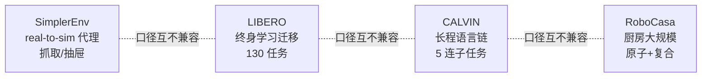
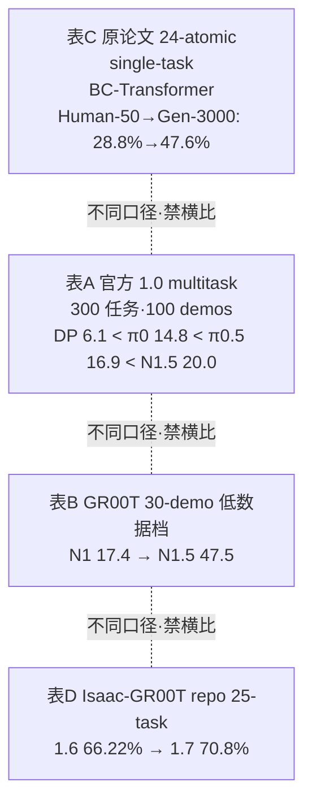

> [← 返回主报告](../index.md)

# VLA 数据集与基准:四大评测全景

> **定位**:本篇是《VLA 发展深度调研报告》的「评测」专题子文档。与姊妹篇 [《具身数据全景梳理》](embodied-data.md)互补——那篇聚焦**训练语料**(数据从哪来、怎么采、怎么配),本篇聚焦**评测**(在哪测、怎么读表、各模型成绩几何)。两者合起来构成 VLA "喂什么 / 考什么" 的完整闭环。
>
> **覆盖**:SimplerEnv / LIBERO / CALVIN / RoboCasa 四大主流基准,各自的**设计、评测协议、读表须知与逐模型成绩表**,可独立阅读。
>
> **可信度标注**:凡标 ⚠️ 者为提出方/厂商自评、未经独立第三方复现的数字;低可信或待核者标 ⚠️/「待核」。经本轮对抗核查确认的数字标「✅ 核查确认」。
>
> **日期**:2026-05-30。多数一手信源为 2024–2026 预印本/官方页面。

---

## 摘要:为什么需要四个基准

没有任何单一基准能回答"这个 VLA 好不好"。四大基准各管一段能力光谱,**口径互不兼容、不可直接横比**:

| 基准 | 引擎 | 一句话定位 | 核心考点 | 主指标 |
|---|---|---|---|---|
| **SimplerEnv** | SAPIEN + ManiSkill2 | 真机策略的**仿真代理评测**(real-to-sim) | 把真机策略放进仿真还原真机成功率 | 任务成功率 % |
| **LIBERO** | robosuite (MuJoCo) | **终身学习**下的知识迁移 | 空间/物体/目标/长程四类解耦迁移 | 平均成功率 % |
| **CALVIN** | PyBullet | **长程语言链式**操作 | 连续完成 5 个语言子任务 | 平均链长 avg-len/5 |
| **RoboCasa** | robosuite + Omniverse 渲染 | **大规模厨房**多任务 + 合成数据 | 原子/复合任务、见过/未见场景泛化 | 成功率 %(多口径) |

> ⚠️ **贯穿全篇的第一原则**:**口径(setting)决定数字含义**。同一模型在不同 split、不同任务子集、不同输入模态、不同训练协议下分数可差数十个百分点。读任何成绩表前先看 setting 列,再看分数。

---

## 一、SimplerEnv

### 1.1 设计

SimplerEnv(**Si**mulated **M**anipulation **P**olicy **E**valuation for real robots)基于 **SAPIEN + ManiSkill2**,核心思路是 **real-to-sim**:把在真机上训练好的策略**直接**放进仿真,用仿真成功率作为真机成功率的廉价代理,避免真机评测昂贵且难复现的问题。

两个真实机器人套件:

| 套件 | 机器人 | 任务 |
|---|---|---|
| **Google Robot / Fractal** | Everyday Robots 单臂 | 抓可乐罐、移近物体、开/关抽屉、把物体放入抽屉 |
| **WidowX / Bridge** | WidowX 250 | 勺子放毛巾、胡萝卜放盘、叠方块、茄子入篮 |

### 1.2 评测协议

两种协议,数字含义不同:

- **Visual Matching(视觉匹配)**:把真实背景图像叠加进仿真、并匹配前景物体纹理,最大化缩小 sim-real 视觉 gap → 用于**还原真机成功率**。
- **Variant Aggregation(变体聚合)**:随机化背景/光照/干扰物/桌面后取平均 → 用于**测视觉鲁棒性**。

### 1.3 读表须知 ⚠️

> ① **Google Robot 有两种任务口径**:3 任务子集 vs 4 任务平均——故同一模型出现两个数(如 RT-1-X 42.4 vs 49.4、RT-2-X 46.3 vs 60.5)。
> ② **WidowX/Bridge 与 Google Robot 是两套独立机器人**,分数不可混算成"SimplerEnv 总分"。
> ③ **多数为提出方/第三方评测方自评**;同一模型在不同论文的复现值有波动。
> ④ "SOTA" 以各论文发表时(2024–2025)为限。
> ⑤ **CogACT 一栏需特别注意变体**:见下表脚注的核查更正。

### 1.4 成绩表

**Google Robot — Visual Matching 成功率(%)**

| 模型 | 分数 | 备注 |
|---|---|---|
| Octo-Base | 11.0 | |
| OpenVLA | 34.3 | |
| RT-1-X | 42.4 | 3 任务子集 49.4 |
| RT-2-X | 46.3 | 3 任务子集 60.5 |
| π0-Beta | 71.4 | ⚠️ PI 口径,第三方复现见 §1.5 |
| SpatialVLA | 73.8 | |
| VOTE | 74.4 | |
| **CogACT-Base** | **74.8** | ✅ 核查确认(DiT-Base 动作模块,arXiv Table 1/7) |
| MemoryVLA | 77.7 | |
| RT-1(真实策略) | 85.7 | |

> ⚠️ **CogACT 重要更正(以本轮 verdicts 为准)**:主报告早期把 CogACT 记为 **82.7%** 系**错误**。一手论文中 CogACT-Base(DiT-Base)= **74.8%** VM;放大到 DiT-Large 动作模块的消融值为 **76.7%**(论文 Table 7),并非 82.7。独立复现(MemoryVLA、VLA-Cache)对已发布 CogACT-Large checkpoint 报 **74.8%** VM。**全网无任何来源支持 82.7% 对应任何 CogACT 变体**——该数字应作废。

**WidowX/Bridge — Visual Matching 成功率(%)**

| 模型 | 分数 | 备注 |
|---|---|---|
| RT-1-X | 1.1 | |
| OpenVLA | 1.0–4.2 | 近乎归零 |
| Octo-Base | 17.5 | Octo-Small 30.0 |
| SpatialVLA | 42.7 | |
| CogACT | 51.3 | |
| VOTE | 54.2 | |
| π0-Uniform | 55.7 | |
| π0-Beta | 68.4 | ⚠️ PI 口径 |
| MemoryVLA | 71.9 | |

**Variant Aggregation 平均(0–1):** RT-1 0.897 · OpenVLA 0.530 · RT-1-X 0.490 · Octo-Base 0.006(域随机化下崩溃)。

### 1.5 π0 自评 71.4 / 68.4 的独立复现现状(⚠️ 仍开放)

π0 的 SimplerEnv 自评(Google Robot VM 71.4% / WidowX-Bridge 68.4%,疑为 visual-matching 口径)**至今没有严格意义上的第三方独立复现**(同 split、同 visual-matching 口径、复现到该数值 ± 误差)。现有"看似相关"的第三方数据都有口径偏差:

| 第三方来源 | 报告值 | 为何不能算作对 71.4/68.4 的复现 |
|---|---|---|
| **open-pi-zero**(allenzren,π0 独立重实现) | Google Robot 逐任务:Pick Coke 88.0–97.9% / Move Near 78.4–80.5% / Close Drawer 65.4–75.0% / Open Drawer 45.2–51.7% / Drawer+Apple 46.1–53.0%;WidowX:Eggplant-in-basket 79.2–87.9% / Spoon-on-towel 61.7–84.6% / Carrot-on-plate 52.5–58.8% / Stack-cube 21.3–52.5% | 作者**明确声明"请勿将此处结果等同于 Physical Intelligence 的 π0 结果"**;10 trials/task、跨 checkpoint 波动大。属独立复现但**非对官方数的直接验证**。 |
| **Discrete Diffusion VLA**(第三方综述对照) | π0 SimplerEnv-Bridge(WidowX,4 任务)平均 **约 40.1%** | 这是 WidowX-Bridge **聚合口径**,与 PI 自评的 71.4/68.4 不是同一指标,不能算复现。 |

> 📌 **结论**:π0/π0-Beta 的 SimplerEnv 自评数仍**缺一手 PI 之外的严格复现**(目前主报告横评表中 71.4/68.4 实际来自 MemoryVLA 作者评测一栏,非 PI 原作者直接挂出)。引用时应保留 ⚠️。

**来源**:simpler-env/SimplerEnv · arXiv:2405.05941 · MemoryVLA(2508.19236)· VOTE(2507.05116)· 2409.15250 · open-pi-zero(github.com/allenzren/open-pi-zero)· Discrete Diffusion VLA(openreview.net/pdf?id=YWeNCMxdhM)

---

## 二、LIBERO

### 2.1 设计

LIBERO(NeurIPS 2023)是**终身机器人学习**基准,基于 **robosuite(MuJoCo)**,共 **130 个语言条件任务**,通过四个程序化生成的任务套件**解耦四类知识迁移**:

| 套件 | 任务数 | 解耦的知识维度 |
|---|---|---|
| **LIBERO-Spatial** | 10 | 空间布局迁移(同物体不同摆放) |
| **LIBERO-Object** | 10 | 物体迁移(同布局不同物体) |
| **LIBERO-Goal** | 10 | 目标/任务迁移(同物体布局不同目标) |
| **LIBERO-100** | 100 | 混合知识 → 拆为 **LIBERO-90**(预训练源)+ **LIBERO-Long / -10**(10 个长程下游) |

> ⚠️ **LIBERO-90 与 LIBERO-Long 是 LIBERO-100 的两个子拆分,不是独立套件**。这导致"平均"有两种口径(见下)。

### 2.2 读表须知 ⚠️

> ① **4 套件口径 vs 5 套件口径**:平均成功率取 Spatial/Object/Goal/Long(4 套件)还是再加 Long-90(5 套件),会产生不同均值——故 OpenVLA 出现 **75.9(4 套件 76.5)** 两个数。
> ② **π0-FAST 的 85.0% 非严格同条件**:额外用了**本体感知 + 腕部相机**输入,与只用单一外部相机的模型不公平横比。
> ③ **"发表时 SOTA"** 以各论文发表时间为准;LIBERO 上 95%+ 已是 2025 普遍水平。

### 2.3 成绩表

**平均成功率(%)**

| 模型 | 平均 | 明细(Spatial / Object / Goal / Long-10 / Long-90) | 备注 |
|---|---|---|---|
| Octo | ~75.1 | 78.9 / 85.7 / 84.6 / 51.1 / – | |
| OpenVLA | 75.9 | 84.7 / 88.4 / 79.2 / 53.7 / 73.5 | 4 套件口径 76.5 |
| π0-FAST | 85.0 | 96.4 / 96.8 / 88.6 / 60.2 / 83.1 | ⚠️ 额外本体感知 + 腕部相机 |
| **OpenVLA-OFT** | **95.3–97.1** | — | 发表时 SOTA |
| MemoryVLA | 96.5 | 98.4 / 98.4 / 96.4 / 93.4 / 95.6 | |
| VOTE | 96.9 | — | |
| Qwen-VLA | 97.9 | — | ⚠️ 厂商自评(主报告 §5.2) |

**来源**:MemoryVLA · VOTE · openvla-oft.github.io · arXiv:2502.19645 · LIBERO(NeurIPS 2023)· github.com/Lifelong-Robot-Learning/LIBERO

---

## 三、CALVIN

### 3.1 设计

CALVIN(**C**omposing **A**ctions from **L**anguage and **Vi**sio**N**)基于 **PyBullet**,4 个**结构相关**的桌面环境 **A/B/C/D**,各配 **7-DoF Franka Panda + 平行夹爪**,共 **34 个任务**。重点考**长程语言链式**操作。

### 3.2 评测协议:三种划分 + 长程链

**三种环境划分**(难度递增):

| 划分 | 含义 | 难度 |
|---|---|---|
| **D→D** | 单环境训练测试 | 低 |
| **ABCD→D** | 四环境训练、D 测试 | 中 |
| **ABC→D** | 训 ABC、测**未见的 D** | **最难**(零样本环境迁移) |

**长程评测(LH-MTLC)**:把 34 任务当子目标,取 **1000 条唯一的 5 任务链**,**仅当前子任务成功才进入下一个**;报告连续完成 1/2/3/4/5 个子任务的成功率,以及**平均链长 avg-len**(满分 5)。avg-len 是 CALVIN 的核心主指标,越高越好。

### 3.3 读表须知 ⚠️

> ① **avg-len 满分 5**,不是百分比;逐任务列(1/2/3/4/5)是"连续完成第 i 个子目标"的成功率,会单调递减。
> ② **标准多视角口径**:GR-1 / 3D Diffuser Actor 等用**多视角 + 本体感知**的标准设置;π0 家族的现有 CALVIN 数(见 §3.5)**口径有改动**,仅可作弱可比参考。
> ③ ABC→D 与 ABCD→D **不可直接横比**(前者零样本未见环境,后者见过 D)。

### 3.4 成绩表

**ABC→D 零样本(avg-len/5)**

| 方法 | avg-len | 逐任务成功率(1/2/3/4/5)% | 备注 |
|---|---|---|---|
| MCIL | 0.31 | — | |
| HULC | 0.67 | — | |
| RT-1 | 0.90 | — | |
| RoboFlamingo | 2.48 | — | |
| SuSIE | 2.69 | — | |
| GR-1 | 3.06 | 85.4 / 71.2 / 59.6 / 49.7 / 40.1 | 标准多视角口径 |
| **3D Diffuser Actor** | **3.27** | 92.2 / 78.7 / 63.9 / 51.2 / 41.2 | 发表时 SOTA,标准多视角口径 |
| **π0(第三方重评)** | **3.509** | T1 0.896 / T2 0.785 / T3 0.786 / T4 0.610 / T5 0.532 | ⚠️/待核 见 §3.5 |

**ABCD→D(avg-len/5)**:GR-1 **4.21**(5 连成功率 73.1%,前最佳 HULC 3.06 / 38.3%);基线 MCIL 在 D→D 上 5 连仅 0.08%(1/2/3/4 任务:48.9 / 12.9 / 2.6 / 0.5%)。

### 3.5 补齐 π0 家族缺口:本质上无官方数可填 ⚠️

主报告原标"⚠️ 缺口:π0 / π0-FAST 自身在 CALVIN 上的分数未获取"。本轮调研给出**明确结论**:

> 📌 **π0 / π0-FAST 的官方(Physical Intelligence)CALVIN 分数不存在**。PI 的 π0(arXiv:2410.24164)与 FAST / π0-FAST(arXiv:2501.09747)**两篇论文都没有把 CALVIN 纳入评测套件**,只评 LIBERO / SimplerEnv / 真机。因此报告里 π0 家族的 CALVIN 空缺**本质上无官方数可填**。

目前**唯一**可填的是一条**第三方重评(口径有改动)**:

| 模型 | split | avg-len | 逐任务(T1–T5) | 可信度 | 口径偏差 |
|---|---|---|---|---|---|
| **π0(re-evaluated)** | ABC→D | **3.509** | 0.896 / 0.785 / 0.786 / 0.610 / 0.532 | ⚠️ medium | **移除 proprio expert、仅单张图像输入** |

- 来源:**VLM4VLA**(arXiv:2601.03309),基于 **open-pi-zero** 在自家统一设置下**重训重测** π0。
- ⚠️ **为何只能作弱可比参考**:VLM4VLA 移除了本体感知专家、且仅用**单张图像**输入,与 GR-1 / 3D Diffuser Actor 的**标准多视角**口径不同。3.509 高于 3D Diffuser Actor 的 3.27,但**不能据此断言 π0 > 3D Diffuser Actor**,因为口径不同。
- ⚠️ **π0-FAST 在 CALVIN 的任何 avg-len 全网未见**(官方无、第三方亦无可信重评)。仅扩散版 π0 有这一个第三方 3.509。

**来源**:3D Diffuser Actor(2402.10885)· GR-1(ICLR 2024,gr1-manipulation.github.io)· CALVIN(2112.03227)· VLM4VLA(arXiv:2601.03309)· FAST/π0-FAST(arXiv:2501.09747,确认 CALVIN 不在其套件)

---

## 四、RoboCasa(本轮重点补齐)

### 4.1 设计

RoboCasa(CoRL 2024,UT Austin / NVIDIA)是**大规模厨房**模拟基准,基于 **robosuite(MuJoCo)+ Omniverse 渲染**。两类任务:

- **Atomic(原子)任务**:单一技能(开门、拿放、按按钮等),原 24/65 个。
- **Composite(复合)任务**:多步组合的长程任务。

并区分 **Seen(预训练见过的场景)/ Unseen(未见场景)**,考泛化。RoboCasa 也是**仿真合成数据**(MimicGen 放大)的主战场(详见 [训练数据全景](embodied-data.md) 第四节)。

### 4.2 读表须知 ⚠️(RoboCasa 最容易踩坑)

RoboCasa 的成绩表**存在至少四种互不兼容的口径**,混用会得出完全错误的排名。务必逐表区分:

| 口径 | 任务集 | 训练方式 | demos/task | 典型代表数 |
|---|---|---|---|---|
| **A. 官方 1.0 multitask** | 300 任务(65 atomic + 235 composite) | multitask | 100 | DP / π0 / π0.5 / GR00T N1.5 同口径 |
| **B. GR00T 30-demo 低数据档** | (N1 protocol) | data-limited post-training | 30 | GR00T N1.5 47.5 vs N1 17.4 |
| **C. 原论文 24-atomic** | 24 个原子任务 | **single-task** | Human-50 / Gen-300 / Gen-3000 | BC-Transformer |
| **D. Isaac-GR00T repo 25-task** | 25 任务 | repo 设置 | — | GR00T 1.6 / 1.7 |

> ⚠️ **绝对禁止跨表横比**:例如 GR00T N1.5 在口径 B(30-demo)是 **47.5%**,在口径 A(300-task multitask)只有 **20.0% avg**——同一模型、不同实验,**这两个数不可混用**。

### 4.3 成绩表 A:官方 1.0 multitask(主推可比表)✅

这是与 DP / π0 / π0.5 / GR00T N1.5 **严格同口径**的最佳可比表,由 **RoboCasa 官方文档(基准维护方训练评测,非各模型厂商自评)** 提供。**300 任务(65 atomic + 235 composite),100 demos/task,pretrain scenes。**

| 模型 | Avg | Atomic-Seen | Composite-Seen | Composite-Unseen | 训练配置 | 可信度 |
|---|---|---|---|---|---|---|
| **GR00T N1.5** | **20.0%** | 43.0% | 9.6% | 4.4% | bs128 / 120k steps | ✅ high |
| **π0.5 (openpi)** | 16.9% | 39.6% | 7.1% | 1.2% | — | ✅ high |
| **π0 (openpi)** | 14.8% | 34.6% | 6.1% | 1.1% | bs64 / 75k steps | ✅ high |
| **Diffusion Policy** | 6.1% | 15.7% | 0.2% | 1.25% | bs192 / 250k steps | ✅ high |

> 📌 **同口径排名**:GR00T N1.5 > π0.5 > π0 > Diffusion Policy。
> ⚠️ **DP 落后的已知原因**:RoboCasa 原论文指出 DP 因 **history=2**(vs BC-Transformer history=10)显著落后,非纯架构劣势。
> ⚠️ **核查注记**:π0 的 14.8% avg 似为**按任务加权平均**,而非三个 split 的简单均值(简单均值约 13.9%);此处与官方文档披露值一致。
> ⚠️ **缺口**:OpenVLA / Octo 在此表**没有官方/维护方条目**(官方 multitask 表只含 DP / π0 / π0.5 / GR00T N1.5),无法填入。

来源:robocasa.ai/docs/build/html/benchmarking/multitask_learning.html

### 4.4 成绩表 B:GR00T 30-demo 低数据档 ⚠️ 厂商自评

NVIDIA GEAR 自评,**仅给 GR00T 自家两代**,30 demos/task、data-limited post-training(N1 protocol):

| 模型 | 成功率 | 可信度 | 备注 |
|---|---|---|---|
| **GR00T N1.5** | **47.5%** | ✅ high(厂商自评) | 同页对照 N1 |
| **GR00T N1** | 17.4% | ✅ high(厂商自评) | — |

> ⚠️ **此表与表 A 完全不同实验,不可混用**(同为 N1.5,这里 47.5% / 表 A 20.0%)。
> ⚠️ **π0 / π0.5 / DP 在此 30-demo 低数据档没有对照数**——NVIDIA 未在该单点表里列出,**属未公开缺口**。
> ⚠️ **GR00T N1 原论文另有口径**:24 任务 zero-shot ~42% / post-train ~47%(arXiv:2503.14734),但口径=更多 demo / 不同协议,**勿与此 30-demo 17.4% 混用**;二者口径差异未在一手来源中显式调和,不可互证。

来源:research.nvidia.com/labs/gear/gr00t-n1_5/

### 4.5 成绩表 C:原论文 24-atomic(经典基线,single-task)

RoboCasa 原论文(CoRL 2024,同行评审)的 **BC-Transformer** 基线,**24 个原子任务平均、single-task 训练**:

| 模型 | Human-50 | Generated-300 | Generated-3000 | 可信度 |
|---|---|---|---|---|
| **BC-Transformer** | 28.8% | 35.0% | 47.6% | ✅ high(同行评审) |

> ⚠️ **single-task 训练**,与表 A 的 multitask 完全不同口径,不可直接横比。这是 24 原子任务口径的经典参照点,体现"合成数据放大(50→300→3000 demos)单调涨点"。

来源:arxiv.org/html/2406.02523v1

### 4.6 成绩表 D:Isaac-GR00T repo 25-task ⚠️/待核

| 模型 | Avg(25 tasks) | 可信度 | 备注 |
|---|---|---|---|
| **GR00T 1.6** | 66.22% | ⚠️ medium(厂商 repo 自评) | 仅供版本演进参考 |
| **GR00T 1.7** | 70.8% | ⚠️ medium(厂商 repo 自评) | 当前 3B 主力 |

> ⚠️ **25-task 口径与官方 24-atomic / 300-task multitask 表均不同**,仅供 GR00T 版本演进的纵向参考,**勿与上述任何表横比**。

来源:github.com/NVIDIA/Isaac-GR00T/blob/main/examples/robocasa/README.md

### 4.7 RoboCasa 版本演进与口径关系图

---

## 五、核查与开放缺口(以本轮 verdicts 为准)

### 5.1 本轮确认/更正的关键数字

| 声明 | 判定 | 精确值 |
|---|---|---|
| CogACT SimplerEnv Google Robot VM = 82.7% | ❌ refuted | **74.8%**(DiT-Base);DiT-Large 消融 76.7%;82.7 无任何来源支持,作废 |
| GR00T N1.5 RoboCasa 30-demo = 47.5% | ✅ confirmed | 47.5%(N1 同口径 17.4%) |
| GR00T N1 RoboCasa 30-demo = 17.4% | ✅ confirmed | 17.4% |
| GR00T N1.5 RoboCasa 1.0 multitask avg = 20.0% | ✅ confirmed | 20.0%(Atomic-Seen 43.0 / Comp-Seen 9.6 / Comp-Unseen 4.4) |
| π0 (openpi) RoboCasa multitask avg = 14.8% | ✅ confirmed | 14.8%(34.6 / 6.1 / 1.1;似为任务加权均) |
| π0.5 (openpi) RoboCasa multitask avg = 16.9% | ✅ confirmed | 16.9%(39.6 / 7.1 / 1.2) |
| Diffusion Policy RoboCasa multitask avg = 6.1% | ✅ confirmed | 6.1%(15.7 / 0.2 / 1.25) |
| π0(re-evaluated)CALVIN ABC→D avg-len = 3.509 | ✅ confirmed | 3.509(第三方 VLM4VLA 重评,口径有改动) |

### 5.2 仍开放的缺口(下一轮优先级)

1. **π0 / π0-FAST 官方 CALVIN 分数** —— **不存在**:PI 两篇论文均未把 CALVIN 纳入评测,空缺无官方数可填(仅第三方 3.509,口径有改动)。
2. **π0-FAST 在 CALVIN 的任何 avg-len** —— 全网未见(官方无、第三方亦无)。
3. **π0 / π0.5 在 RoboCasa 30-demo 低数据档**(与 GR00T N1.5 47.5 / N1 17.4 同口径) —— 未公开,NVIDIA 仅给 GR00T 自家两代。
4. **OpenVLA / Octo 在 RoboCasa** —— 未找到官方/维护方可比条目(官方 multitask 表只含 DP/π0/π0.5/N1.5;原论文只含 BC-Transformer/DP)。
5. **π0 自评 SimplerEnv 71.4 / 68.4 的严格独立第三方复现** —— 未找到(现有第三方要么口径不同 ~40.1%,要么作者主动免责)。
6. **GR00T N1 RoboCasa 24-task zero-shot ~42% / post-train ~47% 与 30-demo 17.4% 的口径差异** —— 未在一手来源中显式调和,二者不可互证。

---

## 六、主要信源(论文原文 / 官方一手页面)

**SimplerEnv**
- github.com/simpler-env/SimplerEnv · arxiv.org/abs/2405.05941
- 横评数据源:MemoryVLA(2508.19236)· VOTE(2507.05116)· 2409.15250
- 独立复现:open-pi-zero(github.com/allenzren/open-pi-zero)· Discrete Diffusion VLA(openreview.net/pdf?id=YWeNCMxdhM)

**LIBERO**
- NeurIPS 2023(liu_zhu)· github.com/Lifelong-Robot-Learning/LIBERO
- OpenVLA-OFT: openvla-oft.github.io · arxiv.org/abs/2502.19645

**CALVIN**
- arxiv.org/abs/2112.03227 · github.com/mees/calvin
- 3D Diffuser Actor(2402.10885)· GR-1(gr1-manipulation.github.io)
- π0 第三方重评:VLM4VLA(arxiv.org/html/2601.03309v1)
- FAST/π0-FAST(arxiv.org/abs/2501.09747,确认 CALVIN 不在其套件)

**RoboCasa**
- 官方 1.0 multitask 基准(主推可比表):robocasa.ai/docs/build/html/benchmarking/multitask_learning.html
- 原论文 CoRL 2024:arxiv.org/abs/2406.02523 · arxiv.org/html/2406.02523v1
- GR00T N1.5 30-demo 自评:research.nvidia.com/labs/gear/gr00t-n1_5/
- GR00T N1 原论文:arxiv.org/abs/2503.14734 · arxiv.org/html/2503.14734v1
- Isaac-GR00T 25-task:github.com/NVIDIA/Isaac-GR00T/blob/main/examples/robocasa/README.md

---

*本篇为《VLA 发展深度调研报告》「评测」专题子文档,与 [训练数据全景](embodied-data.md)(训练语料侧)互补。基于主报告「四、数据集与基准」整段 + 本轮 RoboCasa 排行榜 / CALVIN π0 缺口补齐调研 + 对抗式事实核查综合而成。⚠️ 标记处为提出方/厂商自评数据,非独立第三方复现;低可信或待核者另标 ⚠️/待核。*
