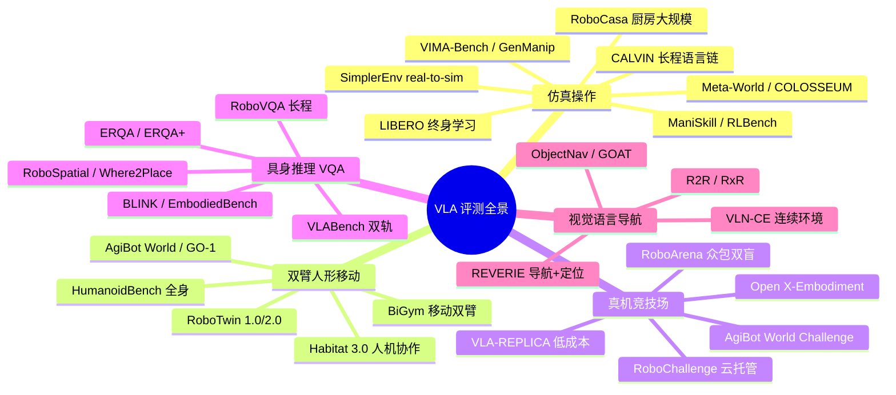
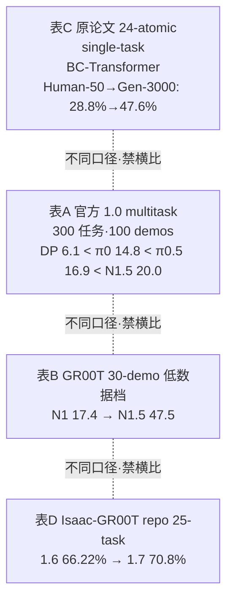
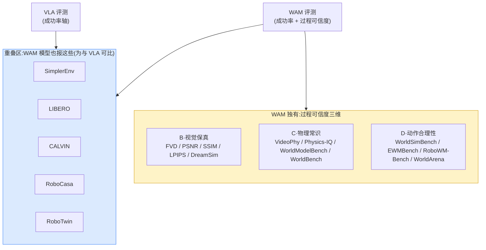

> [← 返回主报告](../index.md)

# 评测基准深度版:从四大基准到五维全景

> **定位**:本篇是 VLA 与 WAM 共用的「评测」基础专题(两条主线同样在 SimplerEnv / LIBERO / CALVIN / RoboCasa 上报成绩)。与姊妹篇 [《具身数据全景梳理》](embodied-data.md)互补——那篇聚焦**训练语料**(数据从哪来、怎么采、怎么配),本篇聚焦**评测**(在哪测、怎么读表、各模型成绩几何)。延伸阅读:[实验机器人本体](robots.md)(评测平台硬件侧)、[具身数据处理](data-processing.md)(数据清洗/对齐侧)。
>
> **覆盖**:本版在原「四大仿真操作基准」(SimplerEnv / LIBERO / CALVIN / RoboCasa,逐模型成绩表完整保留)之上,新增 **仿真操作扩展基准 → 双臂/人形/移动操作 → 真机评测与竞技场 → 具身推理/VQA → 视觉语言导航 → 评测方法论与陷阱** 六大章节,把具身评测从「四大全景」升级到「五维全景 + 读表铁律」。
>
> **可信度标注**:凡标 ⚠️ 者为提出方/厂商自评、未经独立第三方复现的数字;低可信或待核者标 ⚠️/「待核」。经本轮对抗核查确认的数字标「✅ 核查确认」。
>
> **日期**:2026-05-31。多数一手信源为 2024–2026 预印本/官方页面。

---

## 〇、评测全景:VLA 五大类 + WAM 过程可信度

没有任何单一基准能回答"这个模型好不好"。**VLA(操作策略)评测**沿五个正交维度铺开,**度量的物理量不同、口径互不兼容、绝对不可直接横比**;而 **WAM(世界-行动模型)** 因为多了「预演未来」这一环,引入了 VLA 不评的**第六维——过程可信度**(预测的世界像不像、守不守物理),详见 [§九半 WAM 评测](#九半wam-评测从成功率到过程可信度)。

| 大类 | 度量什么 | 代表基准 | 主指标 | 在本篇 |
|---|---|---|---|---|
| **仿真操作** | 策略在线动作成功率 | SimplerEnv·LIBERO·CALVIN·RoboCasa·ManiSkill·RLBench·COLOSSEUM·VIMA | 成功率% / 链长 / 退化% | §一–四、§五 |
| **双臂/人形/移动** | 双臂协调·全身控制·导航+操作耦合 | RoboTwin·BiGym·HumanoidBench·Habitat 3.0·AgiBot | 成功率% / reward / RE | §六 |
| **真机竞技场** | 真机泛化排名·鲁棒性 | RoboArena·RoboChallenge·OXE·VLA-REPLICA | 成对偏好排名 / 真机SR | §七 |
| **具身推理/VQA** | VLM 离线问答·指点准确率 | ERQA·RoboVQA·VLABench·RoboSpatial·BLINK | 多选 accuracy / 点命中% | §八 |
| **视觉语言导航** | 移动到达·路径效率 | R2R·RxR·REVERIE·VLN-CE·ObjectNav | SR / SPL / nDTW / OSR | §九 |
| **WAM 过程可信度** | 预测的未来世界像不像 / 守不守物理 / 能否落地为动作 | FVD·VideoPhy·Physics-IQ·WorldSimBench·WorldModelBench·EWMBench·WorldBench | 视觉保真 / 物理常识 / 动作合理性 | §九半 |

> ⚠️ **贯穿全篇的第一原则**:**口径(setting)决定数字含义**。同一模型在不同 split、不同任务子集、不同输入模态、不同训练协议下分数可差数十个百分点。读任何成绩表前先看 setting 列,再看分数。本篇 §十「评测方法论与陷阱」是这条原则的系统化展开,堪称本版灵魂章节。

---

# 主流仿真操作基准(四大)

> 以下 §一–四为四大主流仿真操作基准的逐模型成绩表,经本轮对抗核查(CogACT=74.8 更正、RoboCasa 同口径排行榜、π0 CALVIN 待核 等),数字与口径不变。

## 一、SimplerEnv

### 1.1 设计

SimplerEnv(**Si**mulated **M**anipulation **P**olicy **E**valuation for real robots)基于 **SAPIEN + ManiSkill2**,核心思路是 **real-to-sim**:把在真机上训练好的策略**直接**放进仿真,用仿真成功率作为真机成功率的廉价代理,避免真机评测昂贵且难复现的问题。

两个真实机器人套件:

| 套件 | 机器人 | 任务 |
|---|---|---|
| **Google Robot / Fractal** | Everyday Robots 单臂 | 抓可乐罐、移近物体、开/关抽屉、把物体放入抽屉 |
| **WidowX / Bridge** | WidowX 250 | 勺子放毛巾、胡萝卜放盘、叠方块、茄子入篮 |

### 1.2 评测协议

两种协议,数字含义不同:

- **Visual Matching(视觉匹配)**:把真实背景图像叠加进仿真、并匹配前景物体纹理,最大化缩小 sim-real 视觉 gap → 用于**还原真机成功率**。
- **Variant Aggregation(变体聚合)**:随机化背景/光照/干扰物/桌面后取平均 → 用于**测视觉鲁棒性**。

### 1.3 读表须知 ⚠️

> ① **Google Robot 有两种任务口径**:3 任务子集 vs 4 任务平均——故同一模型出现两个数(如 RT-1-X 42.4 vs 49.4、RT-2-X 46.3 vs 60.5)。
> ② **WidowX/Bridge 与 Google Robot 是两套独立机器人**,分数不可混算成"SimplerEnv 总分"。
> ③ **多数为提出方/第三方评测方自评**;同一模型在不同论文的复现值有波动。
> ④ "SOTA" 以各论文发表时(2024–2025)为限。
> ⑤ **CogACT 一栏需特别注意变体**:见下表脚注的核查更正。

### 1.4 成绩表

**Google Robot — Visual Matching 成功率(%)**

| 模型 | 分数 | 备注 |
|---|---|---|
| Octo-Base | 11.0 | |
| OpenVLA | 34.3 | |
| RT-1-X | 42.4 | 3 任务子集 49.4 |
| RT-2-X | 46.3 | 3 任务子集 60.5 |
| π0-Beta | 71.4 | ⚠️ PI 口径,第三方复现见 §1.5 |
| SpatialVLA | 73.8 | |
| VOTE | 74.4 | |
| **CogACT-Base** | **74.8** | ✅ 核查确认(DiT-Base 动作模块,arXiv Table 1/7) |
| MemoryVLA | 77.7 | |
| RT-1(真实策略) | 85.7 | |

> ⚠️ **CogACT 重要更正(以本轮 verdicts 为准)**:主报告早期把 CogACT 记为 **82.7%** 系**错误**。一手论文中 CogACT-Base(DiT-Base)= **74.8%** VM;放大到 DiT-Large 动作模块的消融值为 **76.7%**(论文 Table 7),并非 82.7。独立复现(MemoryVLA、VLA-Cache)对已发布 CogACT-Large checkpoint 报 **74.8%** VM。**全网无任何来源支持 82.7% 对应任何 CogACT 变体**——该数字应作废。

**WidowX/Bridge — Visual Matching 成功率(%)**

| 模型 | 分数 | 备注 |
|---|---|---|
| RT-1-X | 1.1 | |
| OpenVLA | 1.0–4.2 | 近乎归零 |
| Octo-Base | 17.5 | Octo-Small 30.0 |
| SpatialVLA | 42.7 | |
| CogACT | 51.3 | |
| VOTE | 54.2 | |
| π0-Uniform | 55.7 | |
| π0-Beta | 68.4 | ⚠️ PI 口径 |
| MemoryVLA | 71.9 | |

**Variant Aggregation 平均(0–1):** RT-1 0.897 · OpenVLA 0.530 · RT-1-X 0.490 · Octo-Base 0.006(域随机化下崩溃)。

### 1.5 π0 自评 71.4 / 68.4 的独立复现现状(⚠️ 仍开放)

π0 的 SimplerEnv 自评(Google Robot VM 71.4% / WidowX-Bridge 68.4%,疑为 visual-matching 口径)**至今没有严格意义上的第三方独立复现**(同 split、同 visual-matching 口径、复现到该数值 ± 误差)。现有"看似相关"的第三方数据都有口径偏差:

| 第三方来源 | 报告值 | 为何不能算作对 71.4/68.4 的复现 |
|---|---|---|
| **open-pi-zero**(allenzren,π0 独立重实现) | Google Robot 逐任务:Pick Coke 88.0–97.9% / Move Near 78.4–80.5% / Close Drawer 65.4–75.0% / Open Drawer 45.2–51.7% / Drawer+Apple 46.1–53.0%;WidowX:Eggplant-in-basket 79.2–87.9% / Spoon-on-towel 61.7–84.6% / Carrot-on-plate 52.5–58.8% / Stack-cube 21.3–52.5% | 作者**明确声明"请勿将此处结果等同于 Physical Intelligence 的 π0 结果"**;10 trials/task、跨 checkpoint 波动大。属独立复现但**非对官方数的直接验证**。 |
| **Discrete Diffusion VLA**(第三方综述对照) | π0 SimplerEnv-Bridge(WidowX,4 任务)平均 **约 40.1%** | 这是 WidowX-Bridge **聚合口径**,与 PI 自评的 71.4/68.4 不是同一指标,不能算复现。 |

> 📌 **结论**:π0/π0-Beta 的 SimplerEnv 自评数仍**缺一手 PI 之外的严格复现**(目前主报告横评表中 71.4/68.4 实际来自 MemoryVLA 作者评测一栏,非 PI 原作者直接挂出)。引用时应保留 ⚠️。

**来源**:simpler-env/SimplerEnv · arXiv:2405.05941 · MemoryVLA(2508.19236)· VOTE(2507.05116)· 2409.15250 · open-pi-zero(github.com/allenzren/open-pi-zero)· Discrete Diffusion VLA(openreview.net/pdf?id=YWeNCMxdhM)

---

## 二、LIBERO

### 2.1 设计

LIBERO(NeurIPS 2023)是**终身机器人学习**基准,基于 **robosuite(MuJoCo)**,共 **130 个语言条件任务**,通过四个程序化生成的任务套件**解耦四类知识迁移**:

| 套件 | 任务数 | 解耦的知识维度 |
|---|---|---|
| **LIBERO-Spatial** | 10 | 空间布局迁移(同物体不同摆放) |
| **LIBERO-Object** | 10 | 物体迁移(同布局不同物体) |
| **LIBERO-Goal** | 10 | 目标/任务迁移(同物体布局不同目标) |
| **LIBERO-100** | 100 | 混合知识 → 拆为 **LIBERO-90**(预训练源)+ **LIBERO-Long / -10**(10 个长程下游) |

> ⚠️ **LIBERO-90 与 LIBERO-Long 是 LIBERO-100 的两个子拆分,不是独立套件**。这导致"平均"有两种口径(见下)。

### 2.2 读表须知 ⚠️

> ① **4 套件口径 vs 5 套件口径**:平均成功率取 Spatial/Object/Goal/Long(4 套件)还是再加 Long-90(5 套件),会产生不同均值——故 OpenVLA 出现 **75.9(4 套件 76.5)** 两个数。
> ② **π0-FAST 的 85.0% 非严格同条件**:额外用了**本体感知 + 腕部相机**输入,与只用单一外部相机的模型不公平横比。
> ③ **"发表时 SOTA"** 以各论文发表时间为准;LIBERO 上 95%+ 已是 2025 普遍水平。

### 2.3 成绩表

**平均成功率(%)**

| 模型 | 平均 | 明细(Spatial / Object / Goal / Long-10 / Long-90) | 备注 |
|---|---|---|---|
| Octo | ~75.1 | 78.9 / 85.7 / 84.6 / 51.1 / – | |
| OpenVLA | 75.9 | 84.7 / 88.4 / 79.2 / 53.7 / 73.5 | 4 套件口径 76.5 |
| π0-FAST | 85.0 | 96.4 / 96.8 / 88.6 / 60.2 / 83.1 | ⚠️ 额外本体感知 + 腕部相机 |
| **OpenVLA-OFT** | **95.3–97.1** | — | 发表时 SOTA |
| MemoryVLA | 96.5 | 98.4 / 98.4 / 96.4 / 93.4 / 95.6 | |
| VOTE | 96.9 | — | |
| Qwen-VLA | 97.9 | — | ⚠️ 厂商自评(主报告 §5.2) |

**来源**:MemoryVLA · VOTE · openvla-oft.github.io · arXiv:2502.19645 · LIBERO(NeurIPS 2023)· github.com/Lifelong-Robot-Learning/LIBERO

---

## 三、CALVIN

### 3.1 设计

CALVIN(**C**omposing **A**ctions from **L**anguage and **Vi**sio**N**)基于 **PyBullet**,4 个**结构相关**的桌面环境 **A/B/C/D**,各配 **7-DoF Franka Panda + 平行夹爪**,共 **34 个任务**。重点考**长程语言链式**操作。

### 3.2 评测协议:三种划分 + 长程链

**三种环境划分**(难度递增):

| 划分 | 含义 | 难度 |
|---|---|---|
| **D→D** | 单环境训练测试 | 低 |
| **ABCD→D** | 四环境训练、D 测试 | 中 |
| **ABC→D** | 训 ABC、测**未见的 D** | **最难**(零样本环境迁移) |

**长程评测(LH-MTLC)**:把 34 任务当子目标,取 **1000 条唯一的 5 任务链**,**仅当前子任务成功才进入下一个**;报告连续完成 1/2/3/4/5 个子任务的成功率,以及**平均链长 avg-len**(满分 5)。avg-len 是 CALVIN 的核心主指标,越高越好。

### 3.3 读表须知 ⚠️

> ① **avg-len 满分 5**,不是百分比;逐任务列(1/2/3/4/5)是"连续完成第 i 个子目标"的成功率,会单调递减。
> ② **标准多视角口径**:GR-1 / 3D Diffuser Actor 等用**多视角 + 本体感知**的标准设置;π0 家族的现有 CALVIN 数(见 §3.5)**口径有改动**,仅可作弱可比参考。
> ③ ABC→D 与 ABCD→D **不可直接横比**(前者零样本未见环境,后者见过 D)。

### 3.4 成绩表

**ABC→D 零样本(avg-len/5)**

| 方法 | avg-len | 逐任务成功率(1/2/3/4/5)% | 备注 |
|---|---|---|---|
| MCIL | 0.31 | — | |
| HULC | 0.67 | — | |
| RT-1 | 0.90 | — | |
| RoboFlamingo | 2.48 | — | |
| SuSIE | 2.69 | — | |
| GR-1 | 3.06 | 85.4 / 71.2 / 59.6 / 49.7 / 40.1 | 标准多视角口径 |
| **3D Diffuser Actor** | **3.27** | 92.2 / 78.7 / 63.9 / 51.2 / 41.2 | 发表时 SOTA,标准多视角口径 |
| **π0(第三方重评)** | **3.509** | T1 0.896 / T2 0.785 / T3 0.786 / T4 0.610 / T5 0.532 | ⚠️/待核 见 §3.5 |

**ABCD→D(avg-len/5)**:GR-1 **4.21**(5 连成功率 73.1%,前最佳 HULC 3.06 / 38.3%);基线 MCIL 在 D→D 上 5 连仅 0.08%(1/2/3/4 任务:48.9 / 12.9 / 2.6 / 0.5%)。

### 3.5 补齐 π0 家族缺口:本质上无官方数可填 ⚠️

主报告原标"⚠️ 缺口:π0 / π0-FAST 自身在 CALVIN 上的分数未获取"。本轮调研给出**明确结论**:

> 📌 **π0 / π0-FAST 的官方(Physical Intelligence)CALVIN 分数不存在**。PI 的 π0(arXiv:2410.24164)与 FAST / π0-FAST(arXiv:2501.09747)**两篇论文都没有把 CALVIN 纳入评测套件**,只评 LIBERO / SimplerEnv / 真机。因此报告里 π0 家族的 CALVIN 空缺**本质上无官方数可填**。

目前**唯一**可填的是一条**第三方重评(口径有改动)**:

| 模型 | split | avg-len | 逐任务(T1–T5) | 可信度 | 口径偏差 |
|---|---|---|---|---|---|
| **π0(re-evaluated)** | ABC→D | **3.509** | 0.896 / 0.785 / 0.786 / 0.610 / 0.532 | ⚠️ medium | **移除 proprio expert、仅单张图像输入** |

- 来源:**VLM4VLA**(arXiv:2601.03309),基于 **open-pi-zero** 在自家统一设置下**重训重测** π0。
- ⚠️ **为何只能作弱可比参考**:VLM4VLA 移除了本体感知专家、且仅用**单张图像**输入,与 GR-1 / 3D Diffuser Actor 的**标准多视角**口径不同。3.509 高于 3D Diffuser Actor 的 3.27,但**不能据此断言 π0 > 3D Diffuser Actor**,因为口径不同。
- ⚠️ **π0-FAST 在 CALVIN 的任何 avg-len 全网未见**(官方无、第三方亦无可信重评)。仅扩散版 π0 有这一个第三方 3.509。

**来源**:3D Diffuser Actor(2402.10885)· GR-1(ICLR 2024,gr1-manipulation.github.io)· CALVIN(2112.03227)· VLM4VLA(arXiv:2601.03309)· FAST/π0-FAST(arXiv:2501.09747,确认 CALVIN 不在其套件)

---

## 四、RoboCasa(本轮重点补齐)

### 4.1 设计

RoboCasa(CoRL 2024,UT Austin / NVIDIA)是**大规模厨房**模拟基准,基于 **robosuite(MuJoCo)+ Omniverse 渲染**。两类任务:

- **Atomic(原子)任务**:单一技能(开门、拿放、按按钮等),原 24/65 个。
- **Composite(复合)任务**:多步组合的长程任务。

并区分 **Seen(预训练见过的场景)/ Unseen(未见场景)**,考泛化。RoboCasa 也是**仿真合成数据**(MimicGen 放大)的主战场(详见 [训练数据全景](embodied-data.md) 第四节)。

### 4.2 读表须知 ⚠️(RoboCasa 最容易踩坑)

RoboCasa 的成绩表**存在至少四种互不兼容的口径**,混用会得出完全错误的排名。务必逐表区分:

| 口径 | 任务集 | 训练方式 | demos/task | 典型代表数 |
|---|---|---|---|---|
| **A. 官方 1.0 multitask** | 300 任务(65 atomic + 235 composite) | multitask | 100 | DP / π0 / π0.5 / GR00T N1.5 同口径 |
| **B. GR00T 30-demo 低数据档** | (N1 protocol) | data-limited post-training | 30 | GR00T N1.5 47.5 vs N1 17.4 |
| **C. 原论文 24-atomic** | 24 个原子任务 | **single-task** | Human-50 / Gen-300 / Gen-3000 | BC-Transformer |
| **D. Isaac-GR00T repo 25-task** | 25 任务 | repo 设置 | — | GR00T 1.6 / 1.7 |

> ⚠️ **绝对禁止跨表横比**:例如 GR00T N1.5 在口径 B(30-demo)是 **47.5%**,在口径 A(300-task multitask)只有 **20.0% avg**——同一模型、不同实验,**这两个数不可混用**。

### 4.3 成绩表 A:官方 1.0 multitask(主推可比表)✅

这是与 DP / π0 / π0.5 / GR00T N1.5 **严格同口径**的最佳可比表,由 **RoboCasa 官方文档(基准维护方训练评测,非各模型厂商自评)** 提供。**300 任务(65 atomic + 235 composite),100 demos/task,pretrain scenes。**

| 模型 | Avg | Atomic-Seen | Composite-Seen | Composite-Unseen | 训练配置 | 可信度 |
|---|---|---|---|---|---|---|
| **GR00T N1.5** | **20.0%** | 43.0% | 9.6% | 4.4% | bs128 / 120k steps | ✅ high |
| **π0.5 (openpi)** | 16.9% | 39.6% | 7.1% | 1.2% | — | ✅ high |
| **π0 (openpi)** | 14.8% | 34.6% | 6.1% | 1.1% | bs64 / 75k steps | ✅ high |
| **Diffusion Policy** | 6.1% | 15.7% | 0.2% | 1.25% | bs192 / 250k steps | ✅ high |

> 📌 **同口径排名**:GR00T N1.5 > π0.5 > π0 > Diffusion Policy。
> ⚠️ **DP 落后的已知原因**:RoboCasa 原论文指出 DP 因 **history=2**(vs BC-Transformer history=10)显著落后,非纯架构劣势。
> ⚠️ **核查注记**:π0 的 14.8% avg 似为**按任务加权平均**,而非三个 split 的简单均值(简单均值约 13.9%);此处与官方文档披露值一致。
> ⚠️ **缺口**:OpenVLA / Octo 在此表**没有官方/维护方条目**(官方 multitask 表只含 DP / π0 / π0.5 / GR00T N1.5),无法填入。

来源:robocasa.ai/docs/build/html/benchmarking/multitask_learning.html

### 4.4 成绩表 B:GR00T 30-demo 低数据档 ⚠️ 厂商自评

NVIDIA GEAR 自评,**仅给 GR00T 自家两代**,30 demos/task、data-limited post-training(N1 protocol):

| 模型 | 成功率 | 可信度 | 备注 |
|---|---|---|---|
| **GR00T N1.5** | **47.5%** | ✅ high(厂商自评) | 同页对照 N1 |
| **GR00T N1** | 17.4% | ✅ high(厂商自评) | — |

> ⚠️ **此表与表 A 完全不同实验,不可混用**(同为 N1.5,这里 47.5% / 表 A 20.0%)。
> ⚠️ **π0 / π0.5 / DP 在此 30-demo 低数据档没有对照数**——NVIDIA 未在该单点表里列出,**属未公开缺口**。
> ⚠️ **GR00T N1 原论文另有口径**:24 任务 zero-shot ~42% / post-train ~47%(arXiv:2503.14734),但口径=更多 demo / 不同协议,**勿与此 30-demo 17.4% 混用**;二者口径差异未在一手来源中显式调和,不可互证。

来源:research.nvidia.com/labs/gear/gr00t-n1_5/

### 4.5 成绩表 C:原论文 24-atomic(经典基线,single-task)

RoboCasa 原论文(CoRL 2024,同行评审)的 **BC-Transformer** 基线,**24 个原子任务平均、single-task 训练**:

| 模型 | Human-50 | Generated-300 | Generated-3000 | 可信度 |
|---|---|---|---|---|
| **BC-Transformer** | 28.8% | 35.0% | 47.6% | ✅ high(同行评审) |

> ⚠️ **single-task 训练**,与表 A 的 multitask 完全不同口径,不可直接横比。这是 24 原子任务口径的经典参照点,体现"合成数据放大(50→300→3000 demos)单调涨点"。

来源:arxiv.org/html/2406.02523v1

### 4.6 成绩表 D:Isaac-GR00T repo 25-task ⚠️/待核

| 模型 | Avg(25 tasks) | 可信度 | 备注 |
|---|---|---|---|
| **GR00T 1.6** | 66.22% | ⚠️ medium(厂商 repo 自评) | 仅供版本演进参考 |
| **GR00T 1.7** | 70.8% | ⚠️ medium(厂商 repo 自评) | 当前 3B 主力 |

> ⚠️ **25-task 口径与官方 24-atomic / 300-task multitask 表均不同**,仅供 GR00T 版本演进的纵向参考,**勿与上述任何表横比**。

来源:github.com/NVIDIA/Isaac-GR00T/blob/main/examples/robocasa/README.md

### 4.7 RoboCasa 版本演进与口径关系图

---

# 更多仿真操作基准(四大之外)

四大基准之外,仿真操作还有一批「泛化分级 / 鲁棒性 / 多模态提示 / 高吞吐引擎」专向基准。它们大多**不是单一成功率**,而是按扰动维度、泛化等级分别报分,读表前要先确认「是哪一级 / 哪一扰动」。

## 五、仿真操作扩展基准对照

| 基准 | 引擎/机构 | 年份 | 一句话定位 | 主指标 | 关键数(⚠️=自评) | 可信度 |
|---|---|---|---|---|---|---|
| **ManiSkill2** | SAPIEN / UC San Diego (Hao Su) | 2023 ICLR | 通用可泛化操作引擎,20 任务族/2000+物体/4M+演示帧 | 成功率% | **SimplerEnv 即建于其上**;CNN 策略 ~2000 FPS | high |
| **ManiSkill3** | UC San Diego (Hao Su) | 2024 (2410.00425) | GPU 并行化仿真+渲染平台,12 领域 | 成功率%·吞吐FPS | ⚠️自评:快 10–1000×、显存少 2–3×、峰值 30,000+ FPS;128 并行环境 4.4GB(vs Isaac Lab 14.1GB) ✅核查:头对头实测仅 ~1.5–2× 显存、训练 ~5× 加速,1000× 为最佳情形上界 | high |
| **RLBench** | Imperial (Dyson) | 2019 (1909.12271) | CoppeliaSim+PyRep,**两套口径**:原始 100 任务 / 社区 18 任务·249 变体 | 成功率% | 18 任务多任务逐代:PerAct→RVT 62.9→RVT-2 77.6→SAM2Act 86.8→BridgeVLA 88.2(各发表时自评) | high |
| **Meta-World** | Stanford/Berkeley(Farama 维护) | 2019;Meta-World+ 2025 (2505.11289) | 50 个 Sawyer 任务;MT10/MT50(多任务-RL)vs ML10/ML45(元/少样本) | 成功率% | Meta-World+ 修复「大量未记录改动」恢复可复现性;**主流 VLA 极少在其报分**(常见误置) | high |
| **COLOSSEUM** | UW (RAIVN) 等 | 2024 RSS (2402.08191) | RLBench 上 20 任务 ×14 扰动因子,测泛化/鲁棒 | 成功率退化% | ⚠️自评:单扰动退化 30–50%、多扰动叠加 >75%;sim↔真机扰动相关 R²=0.614 | high |
| **VIMA-Bench** | NVIDIA/Stanford 等 | 2023 ICML (2210.03094) | **多模态提示**(文图交错),17 任务模板/650K 轨迹 | 4 级泛化成功率% | L1 Placement→L2 Combinatorial→L3 Novel-Object→L4 Novel-Task,逐级严格更难 | high |
| **GenManip** | Shanghai AI Lab | 2025 CVPR (2506.10966) | LLM 驱动场景图自动合成,GenManip-Bench 200 场景 | 多维(外观/常识/空间/长程) | 核心发现:**模块化+基础模型 比端到端 VLA 泛化更好**,数据规模化主要利好端到端 | high |
| **ALOHA 仿真套件** | Stanford (Tony Zhao) | 2023 (2304.13705) | 双臂模仿**最小验证环境**,仅 Transfer-Cube + Bimanual-Insertion 两任务 | 成功率% | LeRobot 报 transfer-cube ~87.6%(单任务自评);**常被误当大型基准** | medium |
| **BEHAVIOR-1K / OmniGibson** | Stanford (Fei-Fei Li 等) | 2023 CoRL / 2024 (2403.09227) | 以人为中心,1000 日常活动/50 场景/9000+物体,支持流体/可变形 | 谓词逻辑目标满足 | 任务极长程,端到端 VLA 较少完整报分(多作场景/资产来源) | high |
| **RoboTwin 1.0/2.0** | 上交/上海AI Lab/港大 | 2025 CVPR Highlight / 2506 | 大规模**双臂**数据生成器+基准(详见 §六) | 成功率% | ⚠️自评:某 VLA 微调后相对提升 367%;详见双臂章节 | medium |

### 5.1 读表须知:口径分裂是最大陷阱 ⚠️

> ① **RLBench 两套口径**:原始「100 任务套件」(1909.12271)vs 社区事实标准「18 任务/249 变体多任务」(PerAct 起沿用)——两者任务数、相机/视角/demo 设置完全不同,**不可横比**。3D 策略系(PerAct/RVT/SAM2Act/BridgeVLA)的逐代 SOTA 都在 18 任务口径。
> ② **Meta-World 必须标版本**:历史上「大量未记录的版本改动」导致跨论文不可比;引用旧分须注明 v1/v2/Meta-World+。且 **MT(多任务-RL,物体/目标固定,仅测技能掌握)与 ML(元/少样本,5 个保留测试任务)绝不可混算**。
> ③ **COLOSSEUM / VIMA 是「泛化分级」基准,不是单一成功率**:COLOSSEUM 按 14 个扰动因子分别报退化,VIMA 按 L1→L4 四级报分,每级严格更难。读表必须看是哪一级/哪一扰动,**不能取「总平均」**。COLOSSEUM 退化最大的因子=干扰物数量、目标物体颜色、光照;5 个被测模型=VoxPoser/R3M-MLP/MVP-MLP/PerAct/RVT(提出方自评,无独立复现)。
> ④ **ManiSkill3 性能数是「up to」峰值/最佳情形**:1000× 上界不对应单一文档化对比,真实头对头(Cartpole vs Isaac Lab v1.2.0)仅「略快」、训练加速 ~5×;显存 4.4 vs 14.1GB 是带真实相机渲染的最佳情形。
> ⑤ **Meta-World ≠ VLA 基准**:它多被 multi-task RL / 表征学习论文使用,主流 VLA(OpenVLA、π0)极少报分。VLA 真正高频使用的是 RLBench(3D 策略系)、ManiSkill(SimplerEnv 底座、RL-VLA 如 RLinf-VLA 报 ManiSkill 25-task ~97.66%)与 VIMA-Bench(多模态提示)。

**来源**:ManiSkill2(2302.04659)· ManiSkill3(2410.00425)· RLBench(1909.12271、RVT 2306.14896、RVT-2 2406.08545、SAM2Act 2501.18564、BridgeVLA 2506.07961)· Meta-World(1910.10897、Meta-World+ 2505.11289)· COLOSSEUM(2402.08191、robot-colosseum.github.io)· VIMA(2210.03094)· GenManip(2506.10966)· ALOHA(tonyzhaozh/act)· BEHAVIOR-1K(2403.09227)

---

# 双臂 / 人形 / 移动操作基准

四大基准都是**单臂桌面**口径。一旦进入双臂协调、人形全身控制、移动操作,失败模式从「抓不准」扩展到「两臂干涉/时序错配」「失去平衡」「导航失败×操作失败连乘」,成功率显著更低——即便单臂桌面任务已接近饱和。

## 六、双臂/人形/移动操作基准

### 6.1 对照总表

| 基准 | 机构/本体 | 年份 | 形态 | 引擎 | 主指标 | 关键数(⚠️=自评) | 可信度 |
|---|---|---|---|---|---|---|---|
| **RoboTwin 2.0** | 上交/上海AI Lab/港大;5 本体 | 2025 (2506.18088) | 双臂 | SAPIEN/ManiSkill | 成功率% | Easy/Hard 13 任务抽样均(⚠️自评,见 6.2) | high |
| **RoboTwin 1.0 + CVPR25 挑战赛** | 港大/上海AI Lab;COBOT-Magic | 2024–25 (2504.13059) | 双臂 | sim + 真机 | 成功率%/百分制 | sim 冠军 ~98.7% vs 真机最佳仅 26.4/100(见 6.3) | high |
| **BiGym** | Dyson/帝国理工;Unitree H1 | 2024 (2407.07788) | 移动双臂 | MuJoCo | 成功率% | ACT 46.3·DP 20.8·BC 18.0(IL>>demo-RL) | high |
| **HumanoidBench** | UC Berkeley;H1+双Shadow Hand(61 维) | 2024 (2403.10506) | 人形全身 | MuJoCo | reward/return | SOTA RL(DreamerV3/TD-MPC2/SAC/PPO)多数任务**学不动**,唯分层有起色 | high |
| **Habitat 3.0** | Meta FAIR;Spot+humanoid | 2023 (2310.13724) | 人机协作移动 | Habitat | SR / Relative Efficiency | Social Rearrange 77.79%,RE 可>100%;真人在环 RE 123–134% | high |
| **AgiBot World + GO-1** | 智元/上海AI Lab;G1 双臂移动 | 2025 (2503.06669) | 双臂移动 | 真机(sim 在建) | normalized score | ⚠️自评:GO-1 复杂长程 60%+,比 RDT 高 32%,无第三方复现 | medium |
| **RoboCasa(移动维度)** | UT Austin/NVIDIA;Franka+移动底座 | 2024–26 | 单臂移动 | robosuite+Omniverse | 成功率% | 成绩见 §四;移动+长程是主要难点 | high |

### 6.2 RoboTwin 2.0:域随机化前后的断崖(Table 6,13 任务抽样均,⚠️ 提出方自评)

50 任务 Aloha-AgileX 本体,50 demos/task 训练、100 rollouts 测试;Easy=clean,Hard=五轴域随机化(clutter/光照/背景/桌高/语言):

| 模型 | Easy(clean) | Hard(域随机化) | 绝对掉点 | 相对掉点 |
|---|---|---|---|---|
| **π0** | 64.9% | 24.6% | **−40.3 pp** | **~62%** |
| **RDT** | 47.8% | 19.6% | −28.2 pp | ~59% |
| **DP3** | 31.8% | 2.2% | −29.6 pp | ~93% |
| **DP** | 35.1% | 1.4% | −33.7 pp | ~96% |
| **ACT** | 9.4% | 2.0% | −7.4 pp | ~79% |

> ⚠️ **口径更正(以 verdicts 为准)**:论文标「π0 掉点 40.3%、RDT 28.2%」是**绝对百分点**(pp),不是相对。真实**相对掉点 π0 ~62%、RDT ~59%**。务必区分 pp 与 %。
> ⚠️ **这是 13 任务抽样均值,非全 50 任务官方排行榜**,且为提出方自评。Easy 数不可单独引用充当「模型很强」。合成数据增益:+10 真机 demo 相对提升 367%、零样本合成 228%(⚠️自评)。

### 6.3 RoboTwin CVPR 2025 双臂挑战赛:sim 高分 ≠ 真机可用 ✅

| 赛道 | 设置 | 最佳成绩 |
|---|---|---|
| **仿真赛道** | RoboTwin 1.0/2.0,域随机化 | 冠军 **AnchorDP3**(JD-TFS,显式 3D 表征)**~98.7%** |
| **真机赛道** | AgileX COBOT-Magic,5 任务 ×20 trials(15 seen+5 unseen),100 分制 | 最佳团队仅 **26.4/100**(折毛巾 0.30 ~ 叠盘 6.80 / 20) |

> ✅ **核查确认**:AnchorDP3 是**仿真**赛道冠军(域随机化下平均 98.7%);真机赛道 5 任务/100 分制最佳 26.4/100。两者标度不同(sim 成功率% vs 真机百分制聚合),差距是**定性而非算术**,但论文结论一致:**同一挑战赛 sim 与 real 差距巨大,sim 高分不等于真机可用**;冠军方案均强调 3D 表征优于纯 2D VLA。

### 6.4 读表须知:双臂/人形/移动的方法论差异 ⚠️

> ① **双臂 vs 单臂**:单臂桌面(LIBERO/CALVIN/SimplerEnv-WidowX)考单末端抓放/链式;双臂额外考两臂时空协调(handover、双手夹持、对称/非对称分工)。RoboTwin 1.0 自述预训练增益单臂 >70% vs 双臂 >40%——双臂任务系统性更难。
> ② **人形全身(HumanoidBench)≠ VLA 模仿基准**:动作 61 维(H1+双 Shadow Hand 42 DoF),需同时维持平衡与操作,**指标是 reward/normalized return 而非简单成功率**,勿与 VLA 成功率横比。SOTA RL 多数任务学不动,唯有分层(先学走/够到再学高层)有起色。
> ③ **移动操作=导航+操作连乘稀释**:RoboCasa 移动器、BiGym H1 floating-base、Habitat Spot 都要先到位再操作,长程成功率被「导航失败×操作失败」连乘拉低。**BiGym 须看动作模式**:whole-body(ℝ23,含腿)vs bi-manual(ℝ16,下身用经典控制器悬浮底座)——whole-body 难度显著更高。
> ④ **Habitat 用 Relative Efficiency 不是成功率**:Social Rearrangement 的 RE(相对单智能体的协作增益,可>100%)与一般 success% 含义完全不同。
> ⑤ **同名不同代**:RoboTwin 1.0(2409.02920 早期 Workshop 版 / 2504.13059 CVPR Highlight)vs 2.0(2506.18088,加 731 物体库+五轴域随机化+5 本体)口径不同;RoboCasa vs RoboCasa365(2500 厨房/365 任务)亦两代。引用务必标版本与 arXiv 号。
> ⑥ **自评 vs 第三方**:HumanoidBench/Habitat 3.0/BiGym 开源代码+固定 demo,可复现性较好;**AgiBot GO-1 真机数无法独立复现**,RoboTwin 真机挑战赛分数依赖特定 AgileX 硬件,迁移到其他本体不保证。

**来源**:RoboTwin 2.0(2506.18088)· RoboTwin 1.0 + 挑战赛(2504.13059、2506.23351、2409.02920)· BiGym(2407.07788)· HumanoidBench(2403.10506)· Habitat 3.0(2310.13724)· AgiBot World/GO-1(2503.06669)

---

# 真机评测与竞技场

真机评测昂贵且难标准化,催生了「众包双盲竞技场」「云端托管机队」「赛事型评测」「低成本可复现台」四条路线,以及用 sim 当真机代理的合法性边界。

## 七、真机评测与竞技场

### 7.1 真机评测为何难标准化(RoboArena 的论证)

1. 难以精确复现布景与光照;
2. 难以维护大规模集中式评测机队;
3. 机器人之间存在制造差异;
4. 为保可复现往往被迫收窄到很窄的任务/环境集合,反而牺牲了泛化覆盖。

> **解法分野**:RoboArena 放弃「标准化任务」,改用**众包成对双盲对比 + 排名聚合**;RoboChallenge 改用**云端托管统一机队**把不可复现来源(软件环境+布景)收口到单一受控点。

### 7.2 真机竞技场/评测系统对照

| 系统 | 机构 | 年份 | 范式 | 本体 | 指标 | 关键数 | 可信度 |
|---|---|---|---|---|---|---|---|
| **RoboArena** | 7 机构(Berkeley/Stanford/UW…) | 2025 (2506.18123) | 众包成对双盲对比+排名聚合 | DROID(Franka Panda) | 相对排名(Elo/BT/task-aware) | 612 次成对评测;π0-FAST-DROID 居 oracle 首位 | high |
| **RoboChallenge (Table30)** | Dexmal | 2025 (2510.17950) | 云端托管真机 API | UR5/Franka/Cobot Magic/ARX-5 | SR + progress | task-specific π0.5 43.7%/π0 28.3%/CogACT 11.7%;generalist π0.5 17.7%/π0 9.3% | high |
| **AgiBot World Challenge** | 智元/上海AI Lab | 2025 IROS / 2026 ICRA | 赛事(线上海选+真机决赛) | AgiBot 统一本体 | 任务完成度 | 2025:431 队/23 国,奖池~56 万美元 | medium |
| **Open X-Embodiment (RT-X)** | Google DeepMind + 34 实验室 | 2023 (2310.08864) | 集中式多实验室真机 | 22 种本体 | 二值成功率 | ~3600 真机 trials/6 机器人;RT-2-X 涌现技能 ~3× RT-2 | high |
| **VLA-REPLICA** | (2605.20774) | 2026 | 低成本可复现真机台(~$1050) | SO-101 | SR | 90 场景(50 ID+40 OOD),7 方法,跨站点可迁移 | medium |
| **Eva-VLA** | (2509.18953) | 2025 | 物理扰动鲁棒性 | 真机 | SR 衰减曲线 | 测 RT-1/OpenVLA/π0/UniVLA,物理变化下可测量下降 | medium |

### 7.3 RoboChallenge Table30 真机成绩(维护方统一评测,非厂商自评)

| 模型 | task-specific SR | task-specific score | generalist SR | generalist score |
|---|---|---|---|---|
| **π0.5** | **43.7%** | 62.2 | 17.7% | 31.3 |
| **π0** | 28.3% | 47.6 | 9.3% | 20.6 |
| **CogACT** | 11.7% | 21.8 | — | — |

> ⚠️ **task-specific 与 generalist 是两套实验,口径不可混比**(同模型差一倍以上)。✅核查:数字与一手报告一致(live leaderboard 可能略有快照差,如 π0.5 task-specific 42.67% vs 报告 43.7%)。
> ⚠️ **跨本体禁互推**:CogACT 真机 11.7%(桌面臂)与其 SimplerEnv Visual Matching **74.8%**(Google Robot 仿真,见 §一)是完全不同本体/介质/任务套件,**不可互推**。

### 7.4 sim 作真机代理的合法性边界:MMRV / Pearson ✅

SimplerEnv 两协议作真机代理的「可靠性」量化(Google Robot 三任务,以真机为金标):

| 协议 | MMRV(越低越好) | Pearson r(越高越好) | 适用 |
|---|---|---|---|
| **Visual Matching** | **0.056** | **0.924**(Pick-Coke 单任务最高 0.976) | **还原真机成功率** |
| **Variant Aggregation** | 0.143 | 0.778 | 测视觉鲁棒性(还原绝对值能力明显更弱) |

> 📌 这正是 §一「VM 还原真机、VarAgg 测鲁棒」口径分工的**一手量化依据**。**引用 sim 数代替真机数时,必须确认是在已验证高相关(r≈0.92)的任务/本体上**,否则代理失效。前沿延伸:RobotArena ∞(2510.23571)/ PolaRiS(2512.16881)用 real-to-sim translation 把真机评测可扩展化,⚠️ 细节自评、尚无广泛第三方采用,待核。

### 7.5 读表须知:真机评测铁律 ⚠️

> ① **成对相对评测 > 绝对成功率**:绝对 SR 严重受布景者、复位精度、本体磨损影响,跨站点不可比;成对盲评偏好对系统性偏差更鲁棒(RoboArena/RoboChallenge Comparative 协议)。RoboArena 用 task-aware Bradley-Terry,**与 oracle 排名 Pearson ≈0.98**(集中式「Regular」仅 ≈0.69,见 Figure 6;⚠️ 论文未以表格公开 per-policy Elo/BT 数值分)。
> ② **trial 数与统计严谨性**:单/双 trial 报告会掩盖可靠性;实践建议每任务 ≥10–15 次、高方差 20+ 次,报分布而非点值。OXE 早期用每技能 ~100 trials、二值判定,是较高强度协议。
> ③ **真机对初始条件高度敏感**:物体初始位姿、夹爪接触动力学、桌高、相机标定的微小差异都会显著改变 SR——「同模型不同实验室/不同天」的真机数往往**不可直接横比**。
> ④ **远程托管的代价**:RoboChallenge 把布景/复位收口到统一机队,代价是任务限定固定桌面 Table30、本体限四款。

**来源**:RoboArena(2506.18123)· RoboChallenge(2510.17950)· AgiBot World Challenge(IROS25/ICRA26 新闻稿)· OXE/RT-X(2310.08864、robotics-transformer-x.github.io)· VLA-REPLICA(2605.20774)· Eva-VLA(2509.18953)· SimplerEnv MMRV/Pearson(2405.05941)

---

# 具身推理 / VQA 评测

这一维度测的是 **VLM 的离线问答/指点准确率**(单/多图 VQA、多选 accuracy、点落入区域占比),与 §一–六的「策略在线动作成功率」是**两套正交指标**,不可换算、也不可由 ERQA 高分推断控制成功率。

## 八、具身推理 / VQA 评测

### 8.1 对照总表

| 基准 | 机构 | 年份 | 测什么 | 主指标 | 关键数(⚠️=自评) | 可信度 |
|---|---|---|---|---|---|---|
| **ERQA** | Google DeepMind | 2025 (2503.20020) | 400 多选题:空间/轨迹/动作/状态/指点/多视角推理 | 多选 accuracy | 见 8.2(⚠️流传的 81.4% 系讹传) | high |
| **ERQA+** | FlagEval/BAAI | 2026 | 800 题 egocentric,修复原 ERQA 污染 | 多选 accuracy | Gemini-3-Pro 原 ERQA 66.0% → ERQA+ 仅 57.3% | medium |
| **RoboVQA** | Google DeepMind | 2023 (2311.00899) | 长程视频**自由生成式**问答,829K 对 | BLEU + 认知干预率 | ⚠️自评:VideoCoCa 干预率比零样本 SOTA 低 46% | high |
| **VLABench** | OpenMOSS(复旦) | 2024 (2412.18194) | 100 任务,**VLM + VLA 双轨** | DSL 召回 / 在线 SR | VLA:OpenVLA seen 11.74% / RDT-1B 15.37%(实证「推理强≠控制强」) | high |
| **RoboSpatial** | Ohio State + NVIDIA | 2024 (2411.16537) | 2D/3D 空间理解;Home 评测仅 50 图/150 题 | yes-no acc / 点落凸包 | 训练模型比零样本基线高 10–30 pp | high |
| **Where2Place** | RoboPoint(UW/NVIDIA) | 2024 (2406.10721) | 100 图关系性自由空间指点 | 点落入 GT mask% | RoboPoint 46.77% vs GPT-4o 29.06%;Hard 子集 30 题 | high |
| **PointArena** | UW 等 | 2025 (2505.09990) | ~1000 指点题+网页竞技场+真机 | 点命中 acc / Elo | Molmo-72B 领先;加 CoT 不提升指点 grounding | medium |
| **BLINK** | UW/UPenn/AllenAI | 2024 (2404.12390) | 14 CV 任务重构 3807 多选 | 多选 accuracy | GPT-4V 51.26% / Gemini 45.72% vs 人类 95.7% | high |
| **SpatialVLA** | Google DeepMind | 2024 (2401.12168) | 3D 空间 VQA 合成数据范式 | 距离落入 GT 0.5–2× | ⚠️自评:37.2% 落入区间,超 GPT-4V | medium |
| **RefSpatial** | 北航/北大 | 2025 (2506.04308) | 空间指代+多步推理,Bench 200 图 >70% 多步 | 指点 SR | ⚠️自评:RoboRefer-SFT 89.6%,RFT 超 Gemini-2.5-Pro +17.4% | medium |
| **EmbodiedBench** | UIUC 等 | 2025 (2502.09560) | MLLM 作具身 agent,1128 任务/4 环境 | 在线 agent SR | 最佳 GPT-4o 仅 28.9%(再证推理强≠控制强) | high |

### 8.2 ERQA「81.4%」营销口径陷阱 ✅(高度警惕)

> ⚠️ **作废待核**:全网流传的「Gemini 2.0 在 ERQA 达 **81.4%**、GPT-4V **62.3%**」在 Gemini Robotics tech report(arXiv:2503.20020)表格中**查无此数**,应弃用。

一手 Table 1(无 CoT)/ Table 2(CoT)实测:

| 模型 | 无 CoT | CoT(majority-vote) |
|---|---|---|
| Gemini 2.0 Pro Experimental | 48.3% | 54.8% |
| GPT-4o | 47.0% | 50.5% |
| Gemini 2.0 Flash | 46.3% | 50.3% |
| Claude 3.5 Sonnet | 35.5% | 45.8% |

> ✅ **核查溯源**:论文用 GPT-4o/4o-mini,**无「GPT-4V」一项**。讹传的「GPT-4V 62.3%」实为 **GPT-4o 在 BLINK(val) 列的 62.3%**——系跨基准串读 + 型号误名。引用 ERQA 须区分:① 是否 CoT;② 是否 majority voting;③ 哪个 Gemini 版本(2.0 Flash/Pro/ER/2.5/3-Pro)。后续 ERQA+ 报 Gemini-3-Pro 原 ERQA 66.0%、ERQA+ 仅 57.3%。

### 8.3 读表须知:推理 VQA 的口径陷阱 ⚠️

> ① **口径正交性**:本维度测 VLM 离线问答/指点准确率,与控制成功率度量不同物理量,不能换算。VLABench 是少数同时给两轨(VLM DSL 召回 + VLA 在线 SR)的基准,数据显示二者强弱不一致(VLA seen 仅 11–15%)。⚠️ 但「严格正交、不可互推」过强:已有正相关(ERIQ,2026)与因果迁移(ECoT 使 OpenVLA 成功率 +28%)的反证,confidence 应从 high 下调——视为「相关但不同」的两轴,而非证明独立。
> ② **多选 VQA 有随机基线膨胀**:BLINK 等 4 选 1 随机基线 ~25%,GPT-4V 51.26% 仅略高于人类 95.7% 的一半。读 accuracy 须扣除随机基线、关注与人类 gap。
> ③ **指点指标口径差异大**:Where2Place=预测点落入 GT free-space mask% (连续覆盖度);RoboSpatial=点落入空间关系点集凸包;PointArena=点是否命中目标。不同 mask 定义、单点 vs 多点、是否含 unseen-relation 子集都改变难度,**严禁跨基准比指点 accuracy**。
> ④ **RoboVQA 是自由生成式**(非多选),主指标 BLEU + 认知干预率,与多选 accuracy 完全不同口径。
> ⑤ **训练-评测同源风险**:RoboSpatial/SpatialVLM/RefSpatial 既造大规模合成空间 VQA 数据、又在自家配套小 benchmark(150/200 题)上报 SOTA,样本量小且同源,跨方法横比应警惕过拟合与口径自洽偏差。

**来源**:ERQA(2503.20020、embodiedreasoning/ERQA)· ERQA+(flageval-baai.github.io/ERQA-Plus-page)· RoboVQA(2311.00899)· VLABench(2412.18194)· RoboSpatial(2411.16537)· Where2Place(2406.10721)· PointArena(2505.09990)· BLINK(2404.12390)· SpatialVLM(2401.12168)· RefSpatial(2506.04308)· EmbodiedBench(2502.09560)

---

# 视觉语言导航评测

导航评测比操作多一个**空间维度**:核心指标族为 SR(到达成功)/ SPL(路径效率加权)/ NE(终点误差)/ OSR(Oracle 停止口径,≥SR)/ nDTW & sDTW(轨迹与参考路径的几何贴合度)。其中 **SPL 与 nDTW 是操作评测里完全没有的概念**——它们度量「过程效率/走对路」,不只是「终点对不对」。

## 九、视觉语言导航(VLN & Navigation)

### 9.1 对照总表

| 基准 | 机构 | 年份 | 类型 | 指标 | SOTA 量级 | 可信度 |
|---|---|---|---|---|---|---|
| **R2R** | Anderson 等 (CVPR18) | 2018 | 离散图·逐步指令跟随 | SR/SPL/NE/OSR | ScaleVLN test SR ~80%(接近饱和) | high |
| **RxR** | Google Research | 2020 | 离散图·多语种·稠密对齐 | +nDTW/sDTW | Efficient-VLN RxR SR 67.0;nDTW 60+ | high |
| **REVERIE** | Qi 等 (CVPR20) | 2020 | 离散图·**导航+物体定位** | SR/OSR/SPL+**RGS/RGSPL** | SOTA RGSPL ~26.17%(复合任务远难) | high |
| **VLN-CE (R2R-CE/RxR-CE)** | Krantz 等 (ECCV20) | 2020 | **连续环境**·低层动作 | NE/OSR/SR/SPL/nDTW | R2R-CE SR 64.2/SPL 55.9(含 ScaleVLN);连续版系统性低于离散 | high |
| **ObjectNav** | AI Habitat/FAIR | 2022–23 | 目标式·只给物体类别 | SR/SPL(**无 nDTW**) | PIRLNav SR 65.0/SPL 34.1;SR 60+ 但 SPL 仅 30 量级 | high |
| **GOAT-Bench** | Khanna 等 (CVPR24) | 2024 | 多模态·终身·有记忆 | SR/SPL(按模态分) | GOAT 真机系统整体 SR 83%(仿真基线数待查) | medium |
| **Qwen-VLA 导航纳入** | 阿里 Qwen | 2026 (2605.30280) | 统一基座把导航纳入同一 DiT | OSR/SR | ⚠️自评:R2R OSR 69.0% / RxR SR 59.6%,无第三方复现 | low |

### 9.2 读表须知:导航评测铁律 ⚠️

> ① **指令跟随 vs 目标驱动,决定能否报 nDTW**:R2R/RxR/REVERIE/VLN-CE 是指令跟随式,有 ground-truth 参考路径,可报 nDTW/sDTW;ObjectNav/GOAT 是目标驱动式(只给类别/图像,无参考路径),**只报 SR/SPL、不报 nDTW**。看「有无 nDTW」即可快速判断任务类型。
> ② **离散图 vs 连续环境(CE)是同名基准最大陷阱**:R2R(离散视点图,SR~80% 接近饱和)与 R2R-CE(Habitat 连续控制,SR~60–64)是**两套数,绝不可直接横比**;连续版无视点图先验、需自己控制底盘,系统性更难。统一 VLA 报「R2R」时必须确认离散还是 CE。
> ③ **OSR ≥ SR 恒成立**:OSR 指路径上任一点曾进入目标范围即算成功(假设完美停止),SR 要求 agent 自己正确停。Qwen-VLA 报 R2R **OSR** 69.0 天然高于 SR,**不能拿别人的 SR 与之比**。
> ④ **SPL 才暴露效率短板**:ObjectNav SOTA 常见 SR 60–67% 但 SPL 仅 30% 量级,说明能找到目标却绕了大量冤枉路。只看 SR 会高估导航能力。
> ⑤ **eval server 与 split**:R2R/RxR/REVERIE 走 eval.ai、ObjectNav/GOAT 走 challenge server;val-unseen 是论文间最常横比的公开口径,test 数需提交。引用须标 split。
> ⑥ **GOAT 真机数 ≠ 仿真基线**:GOAT 真机系统在 9 个真实家庭、675 目标跑出整体 SR 83%(首目标 60%→探索后 90%),**不能等同 GOAT-Bench 仿真基准上的模型成绩**;「随探索提升」是终身/记忆设定特有现象。
> ⑦ **统一 VLA 把导航纳入多为厂商自评**:Qwen-VLA(2605.30280)用一个 DiT 解码器同时出操作动作与导航路径,但 R2R/RxR 数全为作者自报、口径(离散 vs CE、single-run vs beam-search)披露不全、社区未复现,与 ScaleVLN(R2R test SR ~80%)、Efficient-VLN(RxR-CE SR 67.0,含 ScaleVLN-150K 增强;无增强 52.1)横比时应保留 ⚠️。

**来源**:R2R(ScaleVLN scalevln.github.io、DUET CVPR22)· RxR(google-research-datasets/RxR)· REVERIE(1904.10151、yuankaiqi.github.io/REVERIE_Challenge)· VLN-CE(jacobkrantz/VLN-CE、Efficient-VLN 2512.10310)· ObjectNav(aihabitat.org/challenge/2023、PIRLNav 2301.07302)· GOAT-Bench(2404.06609)· Qwen-VLA(2605.30280,见 [Qwen-VLA 细读](qwen-vla.md))

---

# WAM 评测:从成功率到过程可信度

> 本章把 [WAM 总览](../../wam/index.md#42-评测三维从成功率到过程可信度) 提到的「三维评测协议」拍平成可读的基准表;讲清 **VLA 评测**(只问动作端结果)与 **WAM 评测**(同时审视世界想象端的过程质量)在度量哲学上的结构差,以及二者的**重叠区**(WAM 模型为与 VLA 可比仍在 LIBERO/CALVIN/RoboCasa 报成功率)和**互斥区**(WAM 独有的视觉保真/物理常识/动作合理性指标)。

## 九半、WAM 评测:从成功率到过程可信度

### 9.5.1 度量哲学的结构差:为何 VLA 表不够用

**VLA(操作策略)**输出动作,评测自然只问「任务是否完成」——这是对最终结果的**单点 0/1 判定**(成功率 / 平均链长)。**WAM(世界-行动模型)**联合建模「未来状态 + 动作」,推理时**先预演未来,再据此反推动作**(NVIDIA 称之为潜空间想象、不生成完整图像;X-WAM 则预测多视角 RGB-D 视频)。因此 WAM 评测必须**同时审视它想象出的世界与它导出的动作**。

按 [WAM 综述](https://arxiv.org/abs/2605.12090)(arXiv:2605.12090,Fig 2 / §5),WAM 评测协议是**三维**的——视觉保真、物理常识、动作合理性——加上传统的成功率轴,构成完整四轴。这与 VLA 单看成功率形成结构性区别。

| 评测轴 | 度量什么 | 谁在评 | 与 VLA 关系 |
|---|---|---|---|
| **A · 成功率(action)** | 任务是否完成 | LIBERO/CALVIN/RoboCasa/SimplerEnv 等 | **重叠**(WAM 模型为与 VLA 可比也报这一轴) |
| **B · 视觉保真(world)** | 预测帧/视频是否清晰可信 | FVD / PSNR / SSIM / LPIPS / DreamSim / DINO | **WAM 独有**(VLA 无未来预测) |
| **C · 物理常识(world)** | 预测演化是否守物理 | VideoPhy / Physics-IQ / WorldModelBench / WorldBench / VBench-2.0 | **WAM 独有** |
| **D · 动作合理性(bridging)** | 想象里能否抽出可执行动作 | WorldSimBench / EWMBench / RoboWM-Bench / WorldArena / WoWBench | **WAM 独有**(三轴的「桥接」一维) |

> 📌 **可解释性的评测落点**:NVIDIA 称 WAM 的「可视未来预测」让失败可读——纯成功率评测下根本无从谈起,因为 0/1 结果不暴露过程。这也是为什么综述把过程可信度抬到与成功率**并列**的位置(综述 §5.2 同时指出当前协议**仍缺**直接评估「世界预测↔动作生成因果对齐」的统一方法,**待核**)。

### 9.5.2 WAM 评测基准对照表(按四轴归类)

> ⚠️ 以下基准 ID 与口径全部经一手核查;具体模型在各基准上的成绩多为厂商自评、横比要看 split 与版本,与本页前九章铁律同。

#### A · 成功率轴(WAM × VLA 重叠)

WAM 旗舰模型在传统操作基准上**同台报告**以保持可比性。这不是新基准,只是**复用**前九章已表中的数字;真正可比的口径见对应章节的「读表须知」。

| 基准 | 用法 | WAM 报告样例(⚠️ 自评) | 见本页 |
|---|---|---|---|
| **SimplerEnv** | Google Robot / Bridge real-to-sim | DreamZero / X-WAM 等多在此报 SR | [§一](#一simplerenv) |
| **LIBERO** | 终身学习四套件 | UVA 0.5B 报 LIBERO-10 90%、LaDi-WM LIBERO-LONG +27.9% | [§二](#二libero) |
| **CALVIN** | 长程语言链 ABCD/ABC→D | 早期 [GR-1](../../wam/papers/gr-1.md) avg-len 4.21 在该基准奠基 | [§三](#三calvin) |
| **RoboCasa** | 厨房 multitask | [X-WAM](../../wam/papers/x-wam.md) 自评 79.2% 平均(⚠️ 见 §四 与 N1.5/π0.5 同口径) | [§四](#四robocasa本轮重点补齐) |
| **RoboTwin 2.0** | 域随机化双臂 | [X-WAM](../../wam/papers/x-wam.md) 自评 90.7%(⚠️) | [§六](#六双臂人形移动操作基准) |

> ⚠️ **关键提醒**:WAM 在这些基准上的数字**不能直接与 VLA 模型横比**。原因:① 同样适用前九章 §10 的所有「口径不可比」铁律(版本/任务子集/输入模态/演示数);② WAM 论文常报多种 inference 模式(纯模仿 vs 用世界模型作 RL 模拟器 vs 想象引导精炼),哪条数字属哪种模式需逐篇核对——例:[SimpleVLA-RL](../papers/simplevla-rl.md) 用世界模型做 RL 后训练,LIBERO 99.1 不能与裸 SFT 模型并列。

#### B · 视觉保真(WAM 独有)

借自视频生成领域的标准保真指标,被借来评 WAM 的「世界想象」清晰度。

| 指标 / 基准 | 来源 | 测什么 |
|---|---|---|
| **FVD**(Fréchet Video Distance) | NeurIPS 2018 系列 | 生成视频与真实视频在 I3D 特征空间的分布距离(越低越好) |
| **PSNR / SSIM / LPIPS** | 经典视频/图像质量指标 | 帧级保真;LPIPS 用学习特征更贴近人感 |
| **DreamSim** | Fu et al., NeurIPS 2023 | 中层语义相似度,补 LPIPS 在结构变化下的盲区 |
| **DINO 特征距离** | DINOv2 嵌入对齐 | 自监督特征空间下的视觉一致性 |

> 📌 **使用样例**:[UVA](../../wam/papers/uva.md) 在 LIBERO-10 报 8 步自回归 **FVD 51.10**(优于 [UniPi](../../wam/papers/unipi.md) 的 56.55);[LaDi-WM](../../wam/papers/ladi-wm.md) 用 DINO + SigLip 双流潜空间预测,本身就是被这一类保真指标驱动的设计。

#### C · 物理常识(WAM 独有)

**这是 WAM 评测最年轻、最分裂的一轴**——多个并行基准、口径互不兼容。

| 基准 | arXiv | 团队 | 测什么 | 备注 |
|---|---|---|---|---|
| **VideoPhy** | [2406.03520](https://arxiv.org/abs/2406.03520)(系列) | UCLA/Adobe | 文本→视频中物理规律(刚体/流体/接触)的违例 | 较早的物理评测,被 [WAM 综述](https://arxiv.org/abs/2605.12090) 列为代表 |
| **Physics-IQ** | [2504.02918](https://arxiv.org/abs/2504.02918) | Google DeepMind | 用**真实物理实验视频**反向考问视频生成模型 | 强调「真相基准」,VLM 远不如人类 |
| **WorldModelBench** | [2502.20694](https://arxiv.org/abs/2502.20694)(CVPR'25) | NVIDIA / UCSD 等 | 指令跟随 + 物理符合双维 | 覆盖机器人、自驾、人类活动 |
| **WorldBench**(physical-world bench) | [world-bench.github.io](https://world-bench.github.io/) | — | 425 场景跨运动/恒存/支撑等概念诊断 | **诊断式**,逐概念定位失败 |
| **VBench-2.0** | VBench 系列 | 北大等 | 视频生成多维评测套件中的物理子集 | 被综述借用 |

> ⚠️ **本站立场**:这类指标**各家口径不一、绝对不可拼盘**(综述措辞「待核」);且**绝大多数 WAM 论文未跨基准报这一轴**。引用具体模型的物理一致性数字时,请连同 split / 任务子集 / 评估器版本一并标注。

#### D · 动作合理性(过程→动作的桥接)

这是 WAM 独有的、最贴近「为机器人评 WAM」的一维:**预测的未来里能否抽出可执行动作**。

| 基准 | arXiv | 团队 | 测什么 | 备注 |
|---|---|---|---|---|
| **WorldSimBench** | [2410.18072](https://arxiv.org/abs/2410.18072) | OpenGVLab / 复旦 等 | 视频生成模型作世界模拟器:显式感知 + 隐式操控双轨 | 「Implicit Manipulative Evaluation」直接看动作能否驱动 |
| **EWMBench** | [2505.09694](https://arxiv.org/abs/2505.09694) | 智元 / Genie Envisioner 团队 | 场景/运动/语义三维:视觉一致性、运动正确性、语义对齐 | 与 [Genie Envisioner](../../wam/papers/genie-envisioner.md) **同源发布**;指令-动作对齐 |
| **RoboWM-Bench** | [2604.19092](https://arxiv.org/abs/2604.19092) | — | 把生成视频转**embodied action**,在物理仿真里执行 | 「视觉看似合理 ≠ 可执行」是核心论点 |
| **WorldArena** | [2602.08971](https://arxiv.org/abs/2602.08971) | — | 三维:视频感知 / 任务功能 / 平台稳定性 | 把世界模型当**数据引擎**也单列一维 |
| **WoWBench** | 随 [WoW](https://arxiv.org/abs/2509.22642) | 智元 等 | 物理一致性 + 因果推理(视频) | WoW 主张「通过具身交互获得物理直觉」 |
| **WMLab(扩展版)** | [2605.17912](https://arxiv.org/abs/2605.17912) | — | 把 EWM 评测扩到模态/功能/平台三轴 | 综述化扩展 |

> 📌 **判读指南**:这一轴在六个基准里口径最分裂——「指令-动作对齐」「感知-执行落差」「视频-动作可转换性」三套提法各有侧重。**最佳实践**:看 WAM 论文时同时核对「该模型在哪个动作合理性基准上报数」+「该基准是否独立维护方评测(✅)还是模型作者自评(⚠️)」。当前几乎全是 ⚠️。

### 9.5.3 重叠区(VLA × WAM 共用)与互斥区(WAM 独有)

把 §0 全景与上面四轴叠起来,VLA × WAM 评测的关系图:

**重叠区(共用基准)**:LIBERO / CALVIN / RoboCasa / SimplerEnv / RoboTwin。WAM 模型为与 VLA SOTA 可比,在这些基准上**也报成功率**(见上表 A 轴样例)。读表完全适用本页前九章的口径铁律,**不可绕过 §10 的「LIBERO 95%+ ≠ 泛化」「RoboCasa 版本/口径/数据档断层」等警告**。

**WAM 独有(过程可信度)**:视觉保真 / 物理常识 / 动作合理性三维(B/C/D 轴),共约 **15+ 个并行基准**,几乎全部是 2024–2026 新发布,口径互不兼容、覆盖率参差。**当前 WAM 论文很少跨基准报全 B/C/D 三轴**,多数只报其中一个、加上 A 轴成功率作业。

> ⚠️ **本页结论**:WAM 评测目前处于**「成功率仍是最硬指标、过程可信度三维处于建设期」**的阶段。综述本身也承认「仍缺直接评估世界预测↔动作生成因果对齐的统一方法」(§5.2)。引用 WAM 模型成绩时,**A 轴(成功率)用本页前九章的铁律解读 + B/C/D 轴标 ⚠️ 自评 + 标注具体基准与版本**——这与本页 §〇「口径决定数字含义」的第一原则完全一致。

### 9.5.4 一手信源

- **WAM 综述(权威源)**:World Action Models: The Next Frontier in Embodied AI. [arXiv:2605.12090](https://arxiv.org/abs/2605.12090)(Fudan/OpenMOSS,2026-05;§5 评测协议、Fig 2 三维评测手段对照)
- **本站对应**:[WAM 总览 §4.2](../../wam/index.md#42-评测三维从成功率到过程可信度) 给出综述视角的更详尽辨析
- **WAM 独有基准**:WorldSimBench [2410.18072](https://arxiv.org/abs/2410.18072)、EWMBench [2505.09694](https://arxiv.org/abs/2505.09694)、Physics-IQ [2504.02918](https://arxiv.org/abs/2504.02918)、WorldModelBench [2502.20694](https://arxiv.org/abs/2502.20694)、RoboWM-Bench [2604.19092](https://arxiv.org/abs/2604.19092)、WorldArena [2602.08971](https://arxiv.org/abs/2602.08971)、WoWBench(随 WoW [2509.22642](https://arxiv.org/abs/2509.22642))、WMLab 扩展 [2605.17912](https://arxiv.org/abs/2605.17912)
- **关联细读**:[Genie Envisioner](../../wam/papers/genie-envisioner.md)(EWMBench 同源)、[X-WAM](../../wam/papers/x-wam.md)(同时报 RoboCasa/RoboTwin 成功率与 4D 重建/生成保真)、[UVA](../../wam/papers/uva.md)(报 LIBERO SR + FVD)、[LaDi-WM](../../wam/papers/ladi-wm.md)(DINO+SigLip 潜空间双流)

---

# 评测方法论与陷阱(读表铁律)

> 本章是全版**灵魂章节**:把前九章散落的口径警告系统化为「指标层级 → 协议形式化 → 统计严谨性 → 口径不可比 → 自评 vs 复现 → 评测成本 → 过拟合风险」七条铁律。多篇 2025–2026 专文已用实证坐实:**LIBERO 95%+ 不等于泛化能力**。

## 十、读 VLA 成绩表的七条铁律

### 10.1 铁律一:指标有层级,二元成功率信息最少

| 层级 | 指标 | 给什么信息 | 代表 |
|---|---|---|---|
| ① 最粗 | 二元成功率 SR | 做没做成;掩盖「抖动成功 vs 平滑成功」 | 几乎所有基准 |
| ② | 平均链长 avg-len | 长程「最长正确前缀」偏序 | CALVIN(满分 5) |
| ③ | task progression / stage-wise(0–1) | 部分信用 | RoboEval/RoboCasa composite |
| ④ 最细 | 细粒度执行质量 | efficiency/safety/coordination/jerk/collision | RoboEval 五类、2601.18723 四维 |

> **RoboEval(2507.00435)实证**:success-best 模型在 104 个其它指标对比中**仅领先 34 个(33%)**。Pack-Box 中 π0.5(0.54)与 ACT(0.48)成功率相近,但 **ACT 的 cartesian jerk 低 4×**(6.8 vs 27.6 m/s³)、路径短 2.7×。同一成功率下两策略质量可差数倍。

### 10.2 铁律二:协议必须形式化对齐

| 基准 | 关键协议分叉 |
|---|---|
| **SimplerEnv** | Visual Matching(还原真机,MMRV 0.056/r 0.924)vs Variant Aggregation(测鲁棒,MMRV 0.143/r 0.778) |
| **LIBERO** | 4 套件 vs 5 套件均值(OpenVLA 75.9 vs 76.5);π0-FAST 85.0% 额外用本体感知+腕相机 |
| **CALVIN** | D→D(易)/ ABCD→D(见过 D)/ ABC→D(零样本未见 D,最难)三划分**绝不可横比** |
| **RoboCasa** | 官方 300-task / 30-demo / 24-atomic single-task / 25-task repo **四口径互不兼容**(见 §四) |

### 10.3 铁律三:统计严谨性系统性缺失

- VLA 论文普遍 **10–50 trials/task、单次、无种子重复、无方差/置信区间**(2503.10966)。后果:**50 trials 下 ~5% 的成功率差是测量噪声而非真实差异**。
- **推荐做法**:VLA-REPLICA / 2511.11298 用 n=50 trials/(task,model,setting) + 共享随机种子 + round-robin 顺序 + **Wilson 95% 置信区间**;SimplerEnv 对随机策略(Octo)跨 3 种子平均、Google Robot 跨 4 种夹爪配色平均;2503.10966 提出序列检验/近最优停止,固定预算下省 up-to-32% trials。

### 10.4 铁律四:口径不可比导致横比谬误(最致命)

| 同一模型 | 口径 A | 口径 B | 差距 |
|---|---|---|---|
| **GR00T N1.5** RoboCasa | 30-demo 档 47.5% | 300-task multitask 20.0% | 27.5 pp |
| **π0** SimplerEnv | 自评 71.4 | 第三方 WidowX 聚合 ~40.1 | 31 pp |
| **π0** RoboTwin 2.0 | Easy 64.9% | Hard 24.6% | 40.3 pp |

> **铁律**:先看 setting / split / 输入模态 / 训练协议四列,再看分数;**跨表数字默认不可比**。CALVIN π0 第三方重评 3.509 移除了 proprio expert 且仅单图输入,**不能据此断言 π0 > 3D Diffuser Actor(3.27)**。

### 10.5 铁律五:厂商自评 vs 独立复现——正偏并非铁律,取决于是否锁定隐藏设置 ✅

> ⚠️ **重要更正(以 verdicts 为准)**:此前「自评系统性高 10–20%」**被证伪**。lerobot Issue #2114 复现 π0 64.75%/π0.5 71.75% 的低值,**根因是评测配置**(`n_action_steps=10` vs 默认 chunk_size=50),**非厂商偏差**;LeRobot 官方在正确配置下复现 π0.5 ≈97.5%,与 OpenPI 自评 96.85% **一致**。

| 复现案例 | 结论 |
|---|---|
| **lerobot #2114**(π0/π0.5 LIBERO) | 低值(64.75/71.75)系 `n_action_steps` 配置离群;**复现 π0/π0.5 LIBERO 须设 `n_action_steps=10`**,否则得 64–72% 离群低值 |
| **vla-eval**(2603.13966,Docker+固定种子) | DB-CogACT 三基准复现全在 **±3pp 内**(LIBERO Spatial +1.4 / SimplerEnv +2.77 / CALVIN −0.012) |

> **两个被点名的隐藏设置**:① SimplerEnv 的 `terminated` 标志是「瞬时成功」而非真终止(提前停会虚高分);② CALVIN 需训练集硬编码的 15 维 robot-state + 24 维 scene-state 归一化统计(官方文档未载)。**可复现性取决于是否锁定隐藏设置**,而非「厂商一律虚高」。

### 10.6 铁律六:评测成本造就「严谨 vs 成本」的结构性张力

| 环节 | 成本 |
|---|---|
| 训练侧 | ACT ~0.17 天 · π0 ~2 天 · OpenVLA-OFT/RDT-1B 各 ~21 天(2511.11298) |
| 评测侧 | 50 rollouts/task 是底线(OpenVLA 默认 500 trials=10 task×50);大规模如 LingBot 22500 trials、RoboArena 分布式真机 |
| 低成本方案 | VLA-REPLICA 整套硬件 ~$1050、5 runs/scene |

> 多数论文为省成本牺牲 trials/种子,故**方差缺失是结构性而非疏忽**。

### 10.7 铁律七:过拟合 benchmark 风险(2025 多篇专文坐实)——LIBERO 95%+ ≠ 泛化

| 诊断基准 | 关键实证 |
|---|---|
| **LIBERO-PRO**(2510.03827) | libero-goal 位置扰动:OpenVLA 98→**0%**、π0 92→**0%**、π0.5 97→38%;物体位移>0.2 单位即 0%;任务级扰动平均 ~0%;**目标物换成无关物模型仍执行抓取动作** |
| **LIBERO-Plus**(2510.13626) | 单维扰动崩盘:OpenVLA 76.5→camera **1.1**、π0 94.2→robot-init **6.6**、UniVLA 95.2→camera **4.3**;语言扰动平均仅 −25.3(远小于视觉);all-black 消融近乎归零、**3rd-black 仍 43–67%,证明几乎只靠 wrist 视图**——模型靠**位置先验**而非物体语义/语言理解 |
| **Trustworthy Eval / AutoEval**(2601.18723) | Gap1 执行质量(二元掩盖抖动 vs 平滑)、Gap2 来源真实性(成功 demo 来自自主策略还是隐藏遥操);区分策略生成 vs 遥操 99.6% 准确;**零样本 VLM 在质量评估上近乎无相关(SRCC≈0.02)** |

> 📌 **结论**:LIBERO 默认 split「评测任务=训练任务、只换初始位姿微扰」,易记忆刷分。**95%+ 不等于泛化能力**,benchmark 饱和 + 记忆使排行榜区分度失真。这是本版最该带走的一条。

**来源**:LIBERO-Plus(2510.13626、sylvestf.github.io/LIBERO-plus)· LIBERO-PRO(2510.03827)· RoboEval(2507.00435)· Trustworthy Eval/AutoEval(2601.18723)· vla-eval(2603.13966)· lerobot #2114(github.com/huggingface/lerobot/issues/2114)+ LeRobot LIBERO 复现文档· SimplerEnv MMRV/Pearson(2405.05941)· 近最优停止(2503.10966)· VLA-REPLICA/Benchmarking-Experiences(2605.20774、2511.11298)

---

## 十一、核查与开放缺口(以本轮 verdicts 为准)

### 11.1 本轮确认/更正的关键数字

| 声明 | 判定 | 精确值 |
|---|---|---|
| CogACT SimplerEnv Google Robot VM = 82.7% | ❌ refuted | **74.8%**(DiT-Base);DiT-Large 消融 76.7%;82.7 无任何来源支持,作废 |
| GR00T N1.5 RoboCasa 30-demo = 47.5% | ✅ confirmed | 47.5%(N1 同口径 17.4%) |
| GR00T N1 RoboCasa 30-demo = 17.4% | ✅ confirmed | 17.4% |
| GR00T N1.5 RoboCasa 1.0 multitask avg = 20.0% | ✅ confirmed | 20.0%(Atomic-Seen 43.0 / Comp-Seen 9.6 / Comp-Unseen 4.4) |
| π0 (openpi) RoboCasa multitask avg = 14.8% | ✅ confirmed | 14.8%(34.6 / 6.1 / 1.1;似为任务加权均) |
| π0.5 (openpi) RoboCasa multitask avg = 16.9% | ✅ confirmed | 16.9%(39.6 / 7.1 / 1.2) |
| Diffusion Policy RoboCasa multitask avg = 6.1% | ✅ confirmed | 6.1%(15.7 / 0.2 / 1.25) |
| π0(re-evaluated)CALVIN ABC→D avg-len = 3.509 | ✅ confirmed | 3.509(第三方 VLM4VLA 重评,口径有改动) |

### 11.2 仍开放的缺口(下一轮优先级)

1. **π0 / π0-FAST 官方 CALVIN 分数** —— **不存在**:PI 两篇论文均未把 CALVIN 纳入评测,空缺无官方数可填(仅第三方 3.509,口径有改动)。
2. **π0-FAST 在 CALVIN 的任何 avg-len** —— 全网未见(官方无、第三方亦无)。
3. **π0 / π0.5 在 RoboCasa 30-demo 低数据档**(与 GR00T N1.5 47.5 / N1 17.4 同口径) —— 未公开,NVIDIA 仅给 GR00T 自家两代。
4. **OpenVLA / Octo 在 RoboCasa** —— 未找到官方/维护方可比条目(官方 multitask 表只含 DP/π0/π0.5/N1.5;原论文只含 BC-Transformer/DP)。
5. **π0 自评 SimplerEnv 71.4 / 68.4 的严格独立第三方复现** —— 未找到(现有第三方要么口径不同 ~40.1%,要么作者主动免责)。
6. **GR00T N1 RoboCasa 24-task zero-shot ~42% / post-train ~47% 与 30-demo 17.4% 的口径差异** —— 未在一手来源中显式调和,二者不可互证。

---

## 十二、主要信源(论文原文 / 官方一手页面)

> 以下为四大基准的核心一手源;扩展章节(§五–十)的一手源分列各章节末「来源」行。

**SimplerEnv**
- github.com/simpler-env/SimplerEnv · arxiv.org/abs/2405.05941
- 横评数据源:MemoryVLA(2508.19236)· VOTE(2507.05116)· 2409.15250
- 独立复现:open-pi-zero(github.com/allenzren/open-pi-zero)· Discrete Diffusion VLA(openreview.net/pdf?id=YWeNCMxdhM)

**LIBERO**
- NeurIPS 2023(liu_zhu)· github.com/Lifelong-Robot-Learning/LIBERO
- OpenVLA-OFT: openvla-oft.github.io · arxiv.org/abs/2502.19645

**CALVIN**
- arxiv.org/abs/2112.03227 · github.com/mees/calvin
- 3D Diffuser Actor(2402.10885)· GR-1(gr1-manipulation.github.io)
- π0 第三方重评:VLM4VLA(arxiv.org/html/2601.03309v1)
- FAST/π0-FAST(arxiv.org/abs/2501.09747,确认 CALVIN 不在其套件)

**RoboCasa**
- 官方 1.0 multitask 基准(主推可比表):robocasa.ai/docs/build/html/benchmarking/multitask_learning.html
- 原论文 CoRL 2024:arxiv.org/abs/2406.02523 · arxiv.org/html/2406.02523v1
- GR00T N1.5 30-demo 自评:research.nvidia.com/labs/gear/gr00t-n1_5/
- GR00T N1 原论文:arxiv.org/abs/2503.14734 · arxiv.org/html/2503.14734v1
- Isaac-GR00T 25-task:github.com/NVIDIA/Isaac-GR00T/blob/main/examples/robocasa/README.md

---

*本篇为 VLA × WAM 共用的「评测」基础专题,与 [具身数据全景](embodied-data.md)(训练语料侧)、[实验机器人本体](robots.md)(评测平台硬件侧)、[具身数据处理](data-processing.md)(数据清洗/对齐侧)互补。在原「VLA 五维全景(§一–九)」之上,新增 §九半「WAM 评测:从成功率到过程可信度」,把视觉保真 / 物理常识 / 动作合理性三维基准与 LIBERO/CALVIN/RoboCasa 等共用基准的重叠/互斥关系拍平;§十「评测方法论与陷阱(读表铁律)」对 VLA 与 WAM 同样适用。基于六维调研 + 对抗式事实核查综合而成;以 verdicts 更正值为准(CogACT=74.8、RoboTwin 掉点为绝对 pp、ERQA 81.4 作废、自评正偏被证伪等)。⚠️ 标记处为提出方/厂商自评数据,非独立第三方复现;低可信或待核者另标 ⚠️/待核。*
