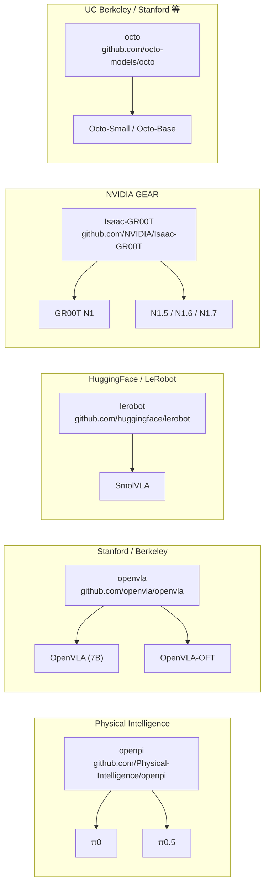
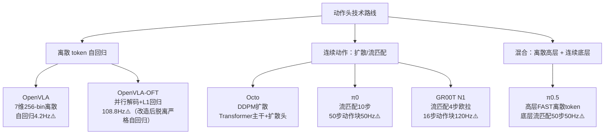

# 主流开源 VLA 代码库与权重对照表

> [← 返回主报告](../index.md)

本页是**选型索引**,横向对照 openpi(π 系列)/ OpenVLA(含 OFT)/ LeRobot(+SmolVLA)/ Isaac-GR00T / Octo 五个代码库的关键维度,帮助读者快速定位"我要复现哪个模型、用哪个库"。每一格均标明信源文件;源文件未出现的字段一律标"待核",不臆造数字、版本号或许可证细节。

---

## 0. 速览关系图

---

## 1. 主对照表

> **可信度说明**：权重链接只列源文件（references.md / 各细读页）中出现过的 URL；源文件未给的字段一律填"待核"。⚠️ = 维护方/厂商自评数据。

| 维度 | **openpi（π 系列）** | **OpenVLA（含 OFT）** | **LeRobot（+SmolVLA）** | **Isaac-GR00T** | **Octo** |
|---|---|---|---|---|---|
| **代码库 URL** | github.com/Physical-Intelligence/openpi | github.com/openvla/openvla · openvla-oft.github.io | github.com/huggingface/lerobot | github.com/NVIDIA/Isaac-GR00T | github.com/octo-models/octo |
| **维护方** | Physical Intelligence (PI) | Stanford / UC Berkeley / Google DeepMind / Toyota Research / MIT 等（OpenVLA 原班作者） | HuggingFace | NVIDIA GEAR | UC Berkeley / Stanford / CMU / Google DeepMind 等 |
| **涵盖模型** | π0、π0.5（openpi 为其共用训练/推理栈；π0-FAST 属同门但分开发布） | OpenVLA（7B）、OpenVLA-OFT（优化微调配方） | LeRobot 策略框架 + SmolVLA；兼容 ACT、Diffusion Policy 等本地训练 | GR00T N1（2B）、N1.5、N1.6、N1.7 | Octo-Small（27M）、Octo-Base（93M） |
| **动作头类型** | **流匹配（flow matching）**：π0 用 ~300M 动作专家（action expert），10 步欧拉积分输出 50 步连续动作块（50 Hz）；π0.5 高层用自回归离散 FAST token，底层用流匹配 action expert（50 步，50 Hz） | OpenVLA：**离散 token**，7 维各量化 256 bin，自回归（4.2 Hz ⚠️）；OpenVLA-OFT：**并行解码 + L1 回归**（或扩散头），一次前向出整块动作，108.8 Hz ⚠️ | 待核（LeRobot 框架支持 ACT/Diffusion Policy 等；SmolVLA 动作头类型待核） | **流匹配（flow matching，velocity prediction）**：DiT 动作头，4 步欧拉积分，16 步动作块，120 Hz ⚠️ | **扩散策略（DDPM）**：Transformer 主干 + 扩散动作头，K 步 cosine 调度去噪，预测连续动作块 |
| **可下载权重（仅列源文件出现过的 URL）** | 待核（openpi 代码库公开，π0/π0.5 权重开源状态见 openpi 官方 repo；references.md 中 π0 训练数据与权重"当时未完全开源"） | 待核（openvla.github.io 列出 HF 链接；4-bit 量化变体 HF 链接见原项目主页，references.md 未列出具体 HF model ID URL） | 待核（LeRobot 模型卡在 HuggingFace，具体路径源文件未给） | huggingface.co/nvidia/GR00T-N1-2B（GR00T-N1-2B 权重；来源：references.md 中 huggingface.co/blog/nvidia/gr00t-n1-7 与 groot-n1.md 原文） | 待核（octo-models/octo GitHub 指向 HF 权重，具体 URL 源文件未给） |
| **仿真/真机依赖** | 真机为主（叠衣服、收桌、移动操作等 7 种机器人本体）；开源数据含 OXE / Bridge v2 / DROID；π0.5 评测：全新真实住宅 ⚠️ | 真机为主（OXE 970k 条演示 + BridgeData V2 / DROID 等）；OFT 在 LIBERO 仿真与 ALOHA 真机评测 ⚠️；SimplerEnv 仿真社区复现 | 待核 | Isaac Sim / Isaac Lab（NVIDIA 仿真栈，arXiv:2511.04831）+ DexMimicGen 仿真；RoboCasa（仿真厨房）；真机集中于 GR-1 人形机器人 ⚠️ | 真机为主（OXE 约 80 万条轨迹，25 子数据集）；SimplerEnv 仿真社区复现；LIBERO 仿真基准 |
| **支持本体** | 7 种机器人配置（单臂 / 双臂灵巧手 / 移动底盘 + 双臂等）；状态/动作统一零填充到 18 维（双臂 6-DoF×2=12 + 2 夹爪 + 移动底盘 + 升降躯干）；OXE 22 种机器人（开源混合部分） | 单臂末端执行器控制为主（7 维：Δ位置 3 + Δ姿态 3 + 夹爪 1）；OXE 覆盖多种机械臂；灵巧手/双臂支持弱（论文明确提到局限） | 待核 | 单臂机械臂 → 双臂人形灵巧手（GR-1、Unitree G1 等）；相对末端执行器动作空间 + 具身感知编码器跨本体 | delta 末端执行器控制为主；OXE 25 子数据集多种本体；双视角（第三人称 + 腕部） |
| **关联细读** | [π0 细读](pi0.md) · [π0.5 细读](pi05.md) | [OpenVLA 细读](openvla.md) · openvla-oft.md | 待核（无独立细读页） | [GR00T N1 细读](groot-n1.md) | [Octo 细读](octo.md) |

---

## 2. 动作头技术路线快速对照

> ⚠️ 频率数字均为维护方/厂商自评，见各细读页。

---

## 3. 各库核心设计差异补注

### 3.1 openpi（π 系列）

- **VLM 主干**：PaliGemma（SigLIP 400M + Gemma 2.6B），合计约 3B；动作专家 ~300M，共约 3.3B 参数。
- **双流权重结构**：同一 Transformer，图文 token 走 VLM 权重，状态/带噪动作 token 走动作专家权重，仅在自注意力层交互（类 MoE 路由）。来源：[pi0.md](pi0.md)。
- **数据混合**：π0 预训练 9.1% 开源（OXE/Bridge v2/DROID）+ 90.9% 自有灵巧数据（7 种机器人、68 任务、约 10,000 小时）。子线性采样权重 $n^{0.43}$。来源：[pi0.md](pi0.md)、[data-processing.md](data-processing.md)。
- **π0.5 额外特性**：高层预测语言子任务（先输出边界框再输出子任务文本），底层流匹配执行；约 100 个训练环境、400 小时移动操作数据；数据闭源、评测为 PI 自评 ⚠️。来源：[pi05.md](pi05.md)。

### 3.2 OpenVLA / OpenVLA-OFT

- **OpenVLA 主干**：Prismatic-7B（DINOv2 + SigLIP 双流视觉编码器 + 2 层 MLP 投影 + Llama 2 7B），共约 7.5B 参数。
- **训练**：OXE 970k 条真机演示，64 块 A100 训练 14 天（约 21,500 A100·小时），batch size 2048，27 个 epoch。来源：[openvla.md](openvla.md)。
- **OFT 改造四件套**：并行解码（双向注意力）+ 动作分块 + 连续动作表示 + L1 回归，速度从 4.2 Hz → 108.8 Hz（A100）⚠️，LIBERO 成功率 76.5% → 97.1% ⚠️（发表时 SOTA）。来源：[references.md](references.md)（arXiv:2502.19645 / openvla-oft.github.io）。
- **不输入本体感知**：原始 OpenVLA 不喂 proprioception（与 π0 / GR00T 形成分水岭）。来源：[data-processing.md](data-processing.md)。

### 3.3 LeRobot（+SmolVLA）

- **定位**：HuggingFace 维护的具身 AI 训练框架，原生支持 ACT / Diffusion Policy 等多策略；v2 格式（Parquet + MP4）、v3（多 episode 打包 + 流式）。来源：[data-processing.md](data-processing.md) §8。
- **SmolVLA**：待核（源文件仅在 data-processing.md §8 提及 LeRobot v3，未展开 SmolVLA 架构细节）。
- **数据格式关键点**：每 episode = data/chunk/episode_xxx.parquet + videos/.../episode_xxx.mp4，stats.json 存归一化统计；v3 新增流式读取。来源：[data-processing.md](data-processing.md)。

### 3.4 Isaac-GR00T

- **参数规模**：GR00T-N1-2B 约 2.2B（VLM 约 1.34B Eagle-2 + SmolLM2 + SigLIP-2；动作头 DiT）。来源：[groot-n1.md](groot-n1.md)。
- **双系统**：System 2（Eagle-2 VLM，约 10 Hz，取第 12 层嵌入）+ System 1（DiT 流匹配，4 步欧拉，120 Hz）⚠️；cross-attention 桥接，**不是 MoE**。来源：[groot-n1.md](groot-n1.md)。
- **数据金字塔**：底层人类视频（7 个 egocentric 数据集）→ 中层合成（DexMimicGen + 神经轨迹 827h ⚠️）→ 顶层真机（GR-1 遥操作约 88h）。来源：[groot-n1.md](groot-n1.md)。
- **伪动作标注**：潜动作 VQ-VAE（LAPA，码本 8×4）+ IDM；高数据时 IDM 更优，消融在 RoboCasa 仿真验证 ⚠️。来源：[groot-n1.md](groot-n1.md)、[data-processing.md](data-processing.md) §6。
- **预训练成本**：约 50,000 H100 GPU 小时。来源：[groot-n1.md](groot-n1.md)。
- **演进路线**：N1 → N1.5（冻结 Eagle VLM）→ N1.6（DiT 加倍至 32 层、换 Cosmos VLM）→ N1.7（主力 3B）；无 "N2" 命名。来源：[groot-n1.md](groot-n1.md)。

### 3.5 Octo

- **参数规模**：Octo-Small 27M（≈ViT-S）、Octo-Base 93M（≈ViT-B）。
- **主干**：浅层 CNN patch stem + Transformer；语言用 t5-base（111M）；块式因果注意力 + readout token。来源：[octo.md](octo.md)。
- **训练**：OXE 25 子数据集约 80 万条轨迹，TPU v4-128 上 batch 2048、300k 步、约 14 小时；微调：单张 A5000（24 GB）约 5 小时。来源：[octo.md](octo.md)。
- **历史帧**：仅 2 帧（超过后收益递减），观测不存在的相机/语言 token 全掩码。来源：[data-processing.md](data-processing.md) §5.4。
- **SimplerEnv 社区复现**：Google Robot 11.0%、WidowX 17.5%（Visual Matching）；Variant Aggregation 约 0.006（几乎崩溃）⚠️。来源：[octo.md](octo.md)。

---

## 4. 如何选库

> 以下建议基于各细读页中的事实描述综合；带 ⚠️ 处为厂商自评数字支撑的方向性判断，不构成精确性能保证。

**按你要复现的模型：**

- **想复现 π0 / π0.5**：用 **openpi**（Physical Intelligence 官方栈）。注意 π0 权重当时"未完全开源"（pi0.md §5），使用前需确认当前开放状态。π0.5 数据亦未开源。
- **想复现 OpenVLA 原版**：用 **openvla** 仓库（github.com/openvla/openvla），有完整训练/LoRA/4-bit 量化脚本。
- **想复现 OpenVLA-OFT**：用 **openvla-oft.github.io** 配套仓库（arXiv:2502.19645），四件套改造（并行解码 + L1）均在其中。
- **想复现 GR00T N1/N1.5+**：用 **github.com/NVIDIA/Isaac-GR00T**，配合 Isaac Sim / Lab 仿真栈；真机建议从 GR-1 或 Unitree G1 入手（N1.5 消融在此两机器人上）。
- **想复现 Octo**：用 **github.com/octo-models/octo**，配合 dlimp 数据加载器；OXE 数据走 RLDS/TFRecord 格式。
- **想用框架自训新策略**：用 **LeRobot**（HuggingFace），原生支持 ACT / Diffusion Policy，数据格式用 LeRobotDataset v2/v3。

**按本体：**

- **单臂操作（7-DoF 机械臂，Franka / WidowX）**：OpenVLA / Octo 基础最扎实（OXE 数据主力本体）。
- **双臂 / ALOHA**：OpenVLA-OFT（在 ALOHA 真机有评测 ⚠️）；LeRobot（原生支持 SO-100/SO-101 等）。
- **人形机器人（高自由度双臂 + 灵巧手）**：Isaac-GR00T（GR-1、Unitree G1 有后训练结果 ⚠️；相对末端执行器空间跨本体）。
- **移动操作（移动底盘 + 双臂）**：openpi/π0.5（约 400h 移动操作数据 ⚠️，但数据闭源）。

**按动作头：**

- **离散 token 自回归（快速验证、小数据集）**：OpenVLA。
- **连续 L1 回归（速度与精度折中）**：OpenVLA-OFT（L1 头在 LIBERO 上 97.1% ⚠️）。
- **扩散策略（多模态动作分布）**：Octo（DDPM）。
- **流匹配（高频灵巧 + 数据规模大）**：openpi（π0/π0.5）或 Isaac-GR00T。

---

## 5. 本页声明

> **本页是选型索引，不提供安装命令、训练配置或调试指南。**
> 安装与训练见各仓库官方 README 及 `examples/` 目录；具身数据处理工程见 [数据处理深度调研](data-processing.md)。

---

## 6. 与其他页面的分工

| 页面 | 分工 |
|---|---|
| **本页**（codebases.md） | 代码库横向对照索引：库/模型/动作头/权重/本体/依赖一览 |
| [references.md](references.md) | 一手信源（论文原文 / 官方页面）聚合；每条目给 arXiv / 官网 URL 与关联细读 |
| [data-processing.md](data-processing.md) §8 | 数据格式工具链细节（RLDS / LeRobotDataset v2/v3 / HDF5 / Zarr）；π0 归一化管线；dlimp/Octo interleave 机制 |
| [pi0.md](pi0.md) / [pi05.md](pi05.md) / [openvla.md](openvla.md) / [groot-n1.md](groot-n1.md) / [octo.md](octo.md) | 各模型逐篇细读：架构细节、训练目标、实验结果、局限 |

---

*本页基于 [references.md](references.md)、[pi0.md](pi0.md)、[pi05.md](pi05.md)、[openvla.md](openvla.md)、[groot-n1.md](groot-n1.md)、[octo.md](octo.md)、[data-processing.md](data-processing.md) 综合整理。⚠️ 标记处为维护方/厂商自评数据；「待核」为源文件未给出的字段，不臆造。*
