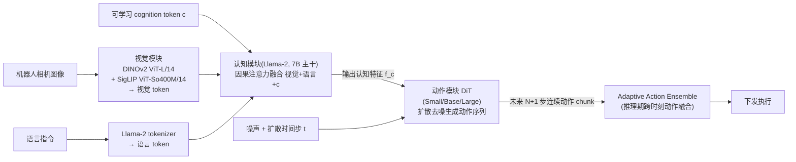
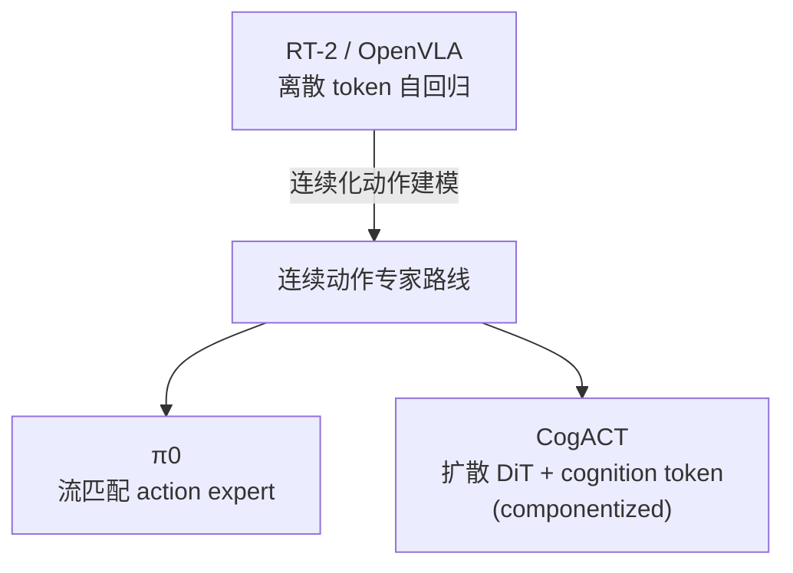

# CogACT 细粒度解读

> **arXiv**: 2411.19650 · 清华大学 / 微软亚洲研究院 · 2024.11 · **路线**:componentized VLA(VLM 认知 + DiT 扩散动作专家)
> [← 返回主报告](../index.md)

## TL;DR
CogACT 的核心主张是:**不要再把动作硬塞回 VLM 的语言头里去预测了**。OpenVLA / RT-2 那一派把动作离散成 token、让 VLM 用"续写文本"的方式吐出动作;CogACT 认为这是一种"角色错配"——VLM 擅长**认知**(理解图像、语言、推理该做什么),却不擅长建模**动作**那种连续、多模态、时间相关的信号。于是它把系统拆成两半:一个**认知模块**(7B 的 VLM,DINOv2+SigLIP 视觉 + Llama-2 语言)负责理解场景与指令,并产出一个 **cognition token**(认知特征);一个**专门的动作模块**(Diffusion Transformer,DiT)以这个 cognition token 为条件,用扩散过程生成未来一段连续动作序列(action chunk)。这种"VLM 出认知、DiT 出动作"的 **componentized(组件化)**设计配合 DiT 良好的 scaling 行为,带来了显著涨点:在 SimplerEnv Google Robot 的 Visual Matching 设定上,CogACT-Base 平均成功率 **74.8%**,放大动作模块到 DiT-Large 的消融值为 **76.7%**(注:坊间横评常引的 82.7% 无任何一手/二手来源支持,应作废);⚠️作者口径下相对同规模(7B)的 OpenVLA 在仿真上高出 **35% 以上**、真机上高出 **55% 以上**,并以 7B 总参数量反超 55B 的 RT-2-X(仿真高 18% 绝对成功率)。它是"VLM 认知 + 扩散动作专家"这一组件化路线的代表作之一。

## 1. 要解决的问题
RT-2 / OpenVLA 奠定的离散 token 范式有一个内在矛盾:**动作本质上不是文本**。把 6-DoF 位姿增量均匀离散成 256 个 bin、再让 VLM 自回归地逐 token"写"出来,会带来三重错配:

1. **连续性丢失**:均匀离散化把连续控制量切成粗格子,精度与平滑度受限(RT-2 局限里已点出的"离散化天花板")。
2. **多模态坍塌**:同一观测下往往存在多条同样合理的动作(比如从左侧或右侧绕过障碍),离散自回归 + 交叉熵倾向于把这种多峰分布"平均"成一个不合理的折中动作。
3. **时间相关性被忽视**:动作序列在时间上高度相关,逐 token 串行生成既慢,又难以一次性建模一整段轨迹。

CogACT 的诊断是:**这些都是"动作建模"的问题,而 VLM 的语言头根本不是为建模连续多模态分布设计的。** 既然 π0 已经证明流匹配 / 扩散式的连续动作专家能更好地拟合动作分布,CogACT 进一步把问题形式化为一个**模块分工**问题:让 VLM 专注于"认知"(理解该做什么),把"动作"这件难事彻底交给一个为之量身定做的扩散模块。要解决的关键工程问题随之变成:**VLM 与动作模块之间用什么接口对接?** ——答案就是 cognition token。

## 2. 方法与架构
CogACT 是一个由三个组件串联的 pipeline:**视觉模块 → 语言/认知模块(产出 cognition token)→ 扩散动作模块(DiT)**。下面逐模块拆解。

### 2.1 视觉与认知模块:沿用一个现成的 7B VLM
CogACT 的认知侧直接**复用一个已有的 VLM**(总参数约 7B,与 OpenVLA 同规模),具体由三块拼成:

- **视觉编码器**:DINOv2 ViT-L/14 + SigLIP ViT-So400M/14 双编码器,把原始图像编码成一组感知 token(perceptual tokens);这正是 OpenVLA 所用的 Prismatic 视觉栈。
- **语言主干**:Llama-2(7B 级)负责融合视觉信息与语言指令、做"该执行什么"的认知推理。

注意:**到这一步为止,CogACT 与 OpenVLA 的前端几乎一致**——同样的 DINOv2+SigLIP+Llama-2。两者分道扬镳的地方在于"VLM 之后接什么"。

### 2.2 cognition token:两个模块之间的接口
这是 CogACT 设计里最关键、也最简洁的一笔。作者**额外引入一个可学习的 cognition token `c`**,把它和视觉 token、语言 token 拼接在一起,一同送入 Llama-2 主干做**因果注意力**。由于因果注意力中 `c` 排在序列末尾,它能"看到"全部视觉与语言上下文,于是经过若干层后,`c` 对应位置的输出特征 `f_c` 就**聚合了"看懂了什么 + 该做什么"的整合信息**。

这个 `f_c`(cognition feature / cognition token)就是 VLM 交给动作模块的**唯一接口**:动作模块不直接看原始图像 token,而是以 `f_c` 为条件去生成动作。这样设计的好处是接口干净——VLM 负责把所有认知压缩进一个特征向量,DiT 只需学"给定这个认知,该输出怎样的动作分布"。与 RT-2/OpenVLA 用语言头直接预测动作 token 相比,这里 **VLM 不再输出动作,只输出"认知"**。

### 2.3 扩散动作模块(DiT):把动作建模交给专家
动作模块是一个 **Diffusion Transformer(DiT)**,做的是标准的条件扩散生成:

- **建模对象**:不是单步动作,而是**一段未来动作序列(action chunk)**。训练时预测 `(a_t, a_{t+1}, …, a_{t+N})`,默认 **N=15**(即一次预测当前 + 未来 15 步,共 16 步动作),整个动作序列连同条件构成长度 17 的 token 上下文。
- **条件化**:DiT 以 cognition token `f_c` 与扩散时间步 `t` 为条件,对带噪动作序列做多步去噪。
- **为什么用扩散**:扩散模型天然擅长建模**连续、多模态**分布——同一认知下可以采样出多条合理动作,而不会被"平均"成一个折中动作;DiT 的 transformer 主干又能很好地建模动作序列内部的**时间相关性**。这正好对症 2.1 节诊断出的离散范式三大错配。
- **采样**:推理时用 **DDIM 10 步**去噪即可生成一个动作 chunk,无需逐 token 串行解码。

**三种动作模块规模(关键的 scaling 实验)**:CogACT 系统地把 DiT 做成三档,验证"放大动作模块就能涨点":

| 动作模块 | 参数量 | 对应发布模型 |
|---|---|---|
| DiT-Small | ~13M | CogACT-Small |
| DiT-Base | ~89M | CogACT-Base |
| DiT-Large | ~308M | CogACT-Large |

注意这三档差异**只在动作模块**,VLM 认知侧(~7B)保持不变。CogACT 的一个重要发现是:在固定 7B VLM 的前提下,**单独把扩散动作模块从 13M → 308M 放大,成功率随之单调提升**——这说明"动作建模本身"是有独立 scaling 收益的维度,而这一点在把动作塞进语言头的离散范式里几乎无法单独优化。

### 2.4 Adaptive Action Ensemble(AAE):推理期的动作融合
因为每个时刻 CogACT 都预测一段未来 chunk,相邻时刻预测的 chunk 会在时间上**重叠**(t 时刻预测了 t…t+15,t+1 时刻又预测了 t+1…t+16……)。传统 action chunking 常用固定权重的时间集成(temporal ensembling)把这些重叠预测平均。CogACT 提出 **Adaptive Action Ensemble**:对要融合的多个历史预测,**按它们与当前预测的余弦相似度自适应加权**:

`â_t = Σ_k w_k^ada · a_{t|o_{t-k}}`,其中 `w_k^ada = exp(α · ⟨a_{t|o_t}, a_{t|o_{t-k}}⟩)`,α=0.1。

直觉:**与当前预测越一致的历史预测,权重越大**;差异大的(可能来自已经过时或属于另一动作模态的预测)被自动压低。这避免了固定平均把两条不同模态的动作"和稀泥"成一个不合理动作,与扩散建模"保留多模态"的初衷一致。AAE 是纯推理期技巧,不增加训练成本。

### 2.5 训练数据与配方
- **数据**:Open X-Embodiment(OXE)的子集,沿用 Octo / OpenVLA 的同一混合(25 个 VLA 数据集,约 0.4M 条轨迹、**22.5M 帧**),排除 Language Table 与 DROID。
- **目标**:动作模块用标准扩散去噪损失训练;VLM 认知侧与动作模块一起端到端训练(cognition token 的表示随之被学出来)。

## 3. 关键数据表
SimplerEnv 是把 RT-1 / Bridge 真机场景搬进仿真、并做视觉对齐(Visual Matching)以提升"仿真↔真机"相关性的评测套件。以下为 **Google Robot · Visual Matching** 设定下的平均成功率(均来自论文 Table 1 口径):

| 模型 | 总参数 | 动作建模 | Google Robot VM 平均成功率 |
|---|---|---|---|
| Octo-Base | ~93M | 扩散(小模型) | ~11.0% |
| OpenVLA | 7B | 离散 token / 自回归 | ~34.3% |
| RT-2-X | 55B | 离散 token / 自回归 | ~46.3% |
| RT-1(Google 专用数据) | — | 离散 token | ~52.4% |
| **CogACT-Base** | 7B + 89M | **VLM 认知 + DiT 扩散** | **74.8%** |
| **CogACT-Large** | 7B + 308M | **VLM 认知 + DiT 扩散** | **76.7%**(Table 7 消融) |

CogACT-Base 各任务拆分(Visual Matching):Pick Coke Can 91.3% / Move Near 85.0% / Open-Close Drawer 71.8% / Open Top Drawer & Place Apple 50.9%(后者长程任务仍是短板)。

> ⚠️ **作者自评口径(需独立核查)**:论文宣称 CogACT"相对同规模(7B)OpenVLA 在仿真高 35% 以上、真机高 55% 以上","以 7B 反超 55B RT-2-X 在仿真高 18% 绝对成功率"。这些是 CogACT 团队自报的对比数字。

> ⚠️ **82.7% 系误传,已作废(本轮对抗核查)**:arXiv v1 Table 1 主结果为 **CogACT-Base(DiT-Base)= 74.8%** VM;论文 Table 7 消融里放大到 **DiT-Large 也只有 76.7%**(DiT-Small 73.3 / Base 74.8 / Large 76.7),**并未达到 82.7%**。独立复现(MemoryVLA、VLA-Cache)对已发布的 CogACT-Large checkpoint 同样报 **74.8%** VM。全网无任何一手/二手来源支持 82.7% 对应任一 CogACT 变体——该数字应作废(主报告早期横评表的 82.7 同此更正)。

真机(作者自评,⚠️):Realman 机械臂总平均 **71.2%** vs OpenVLA 12.1%;Franka 平均 **61.4%** vs OpenVLA 6.8%。

## 4. 与同类对比:三条动作建模路线
CogACT 最值得讲清的是它在动作建模上**与 OpenVLA、π0 的本质差异**:

| 维度 | OpenVLA / RT-2(离散路线) | π0(流匹配 action expert) | **CogACT(本文,扩散 DiT)** |
|---|---|---|---|
| 动作如何产生 | VLM 语言头自回归"写"出离散 token | VLM 后接流匹配 action expert | VLM 出 cognition token → DiT 扩散去噪 |
| 动作表示 | 256-bin 离散整数 | 连续向量 | 连续向量(action chunk) |
| 多模态 | 易坍塌(平均化) | 保留(流匹配) | 保留(扩散采样) |
| VLM 的角色 | 既认知又出动作(职责混合) | 认知 + 提供条件 | **只认知**,产出单一 cognition token 接口 |
| 动作模块可否单独 scale | 几乎不能(动作绑在语言头) | 可(expert) | **可,且系统验证 13M→308M 单调涨点** |
| 接口 | 无显式接口(同一序列) | VLM 表示注入 expert | **显式 cognition token `f_c`** |

**为什么 CogACT 涨点?** 把上面合起来看,涨点来自几个叠加因素:(1)用扩散建模连续多模态动作,直接消除了离散化精度天花板与多模态坍塌(相对 OpenVLA);(2)action chunking 一次预测多步,改善时间一致性与控制频率;(3)cognition token 提供了一个**干净的认知↔动作接口**,让 VLM 专注认知、DiT 专注动作,各自发挥所长;(4)动作模块可独立放大(Base→Large),拿到了离散范式拿不到的 scaling 红利;(5)AAE 在推理期进一步稳住多模态动作的融合。π0 与 CogACT 同属"连续动作专家"大方向,区别主要在生成器选型(流匹配 vs 扩散 DiT)与接口形式(表示注入 vs 显式 cognition token)。

## 5. 局限与争议
- **长程 / 多阶段任务仍弱**:Open Top Drawer & Place Apple 这类长程组合任务成功率仅约 50%,远低于单步抓取——认知-动作的拆分并未自动解决长程规划。
- **对比数字为作者自评**:35% / 55% / 18% 等领先幅度均出自 CogACT 团队自报,跨工作对比口径(数据混合、评测协议)未必完全一致,需谨慎引用(已标 ⚠️)。
- **7B 认知模块仍重**:认知侧延续 OpenVLA 的 7B VLM,推理算力与延迟负担依旧不轻;扩散动作模块虽用 DDIM 10 步,但多步去噪相比单次前向仍有额外开销。
- **cognition token 是单一瓶颈向量**:把全部认知压缩进一个 token 的表示,理论上可能成为信息瓶颈;论文未深入探讨多 cognition token 或更丰富接口的影响。
- **数据仍局限于 OXE 子集**:与同期工作一样以桌面单臂操作为主,对接触丰富、双臂、灵巧操作的覆盖有限。

## 6. 在 VLA 谱系中的位置
CogACT 是"**VLM 认知 + 专用扩散动作模块**"这一组件化(componentized)路线的代表作:它继承了 [[pi0]] 开启的"连续动作专家"大方向(反叛 [[rt2]]/[[openvla]] 的离散自回归),但在两点上给出了清晰且可复制的工程范式——(1)用一个**显式 cognition token** 作为认知模块与动作模块之间的干净接口;(2)用 **DiT** 作动作生成器并系统验证其 **scaling 行为**(动作模块可独立放大涨点)。这两点把"VLM 该不该亲自输出动作"这个问题给出了明确答案:**不该,让它只做认知,动作交给专家**。CogACT 也因此成为后续大量工作(如各类 discrete/continuous diffusion VLA、轨迹集成方法)反复对标的强基线。

## 来源
- 论文:arxiv.org/abs/2411.19650(CogACT: A Foundational Vision-Language-Action Model for Synergizing Cognition and Action in Robotic Manipulation,清华 / 微软亚研,2024.11)
- 全文(HTML):arxiv.org/html/2411.19650v1(Table 1 SimplerEnv 结果、动作模块规模、AAE 公式、数据混合均出自此)
- 项目主页:cogact.github.io ·  代码:github.com/microsoft/CogACT · 模型:huggingface.co/CogACT(CogACT-Small / Base / Large,后者用 DiT-Large)
