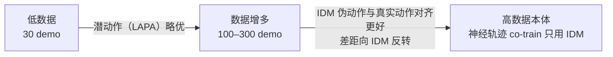

# 具身数据处理深度调研:从原始采集到可训练样本

> 本篇是《VLA 发展深度调研报告》「具身数据处理」专题,聚焦**拿到原始数据之后怎么把它处理成可训练样本**的算法与工程细节。
> [← 返回主报告](../index.md)

> **与[具身数据全景](embodied-data.md)的分工**:全景篇讲**数据从哪来**(数据来源金字塔、真机/人类视频/仿真数据集清单、采集范式与成本、co-training 正迁移结论);本篇讲**怎么处理成可训练样本**(清洗质检的 how、语言/奖励标注流程、动作归一化/分词/分块/retarget 的可操作步骤、观测 token 化、伪标签生成算法、采样配比的具体公式与旋钮、存储格式与 dataloader 机制)。两篇在 RoboMIND 失败质检、AgiBot 人在回路、GR00T 潜动作-IDM、π0 归一化、Re-Mix 等点上**刻意只取互补切面、不重复**:全景篇列为「数据属性/结论」,本篇展开「处理流程的 how」。
>
> **方法**:基于 6 维度网络调研(researched)+ 14 条数字对抗式事实核查(verdicts)综合而成。
> **可信度标注**:凡标 ⚠️ 者为提出方/厂商自评、未经独立第三方复现;低可信(2025–2026 极新预印本/工程博客)标「待核」;经对抗核查更正的以更正值为准并标「✅ 核查确认」。
> **日期**:2026-05-31。领域演进极快,多数一手信源为 2024–2026 预印本/官方页面。

*读图方式:左侧是异构原始轨迹和视频流,中间是清洗、同步、语言/动作对齐与伪标签回填,右侧才是模型能消费的训练样本。*

---

## 摘要

如果说《具身数据全景》回答了"数据从哪来",本篇回答的是一个同样决定 VLA 上限、却更少被系统梳理的问题:**一条原始遥操作轨迹(或一段无标签人类视频),要经过哪些处理步骤,才能变成模型能消化的一个训练 batch?**

主线可概括为一条流水线:**原始采集 → 清洗质检(删技术伪影、留并标注语义失败)→ 标注与语言对齐(挂指令/子任务/奖励)→ 动作处理(归一化 / 分词 / 分块 / 跨本体对齐)与观测处理(token 化 / 掩码 / 增强 / 时间同步)→ 伪标签生成(给无动作数据补动作监督)→ 数据配比采样(决定各源占比)→ 格式化(RLDS/LeRobot/HDF5/Zarr)→ 训练 batch**。

<i>1</i><strong>原始采集</strong>遥操作轨迹 / 视频流 · 多模态异频
→
<a class="pipe__step" data-tone="cyan" href="#二、数据清洗与质量管控"><i>2</i><strong>清洗质检</strong>删技术伪影 · 留标语义失败</a>
→
<a class="pipe__step" data-tone="blue" href="#三、标注与语言对齐"><i>3</i><strong>标注与语言对齐</strong>指令 / 子任务 / 奖励 · 优势</a>
→
<a class="pipe__step pipe__step--core" data-tone="violet" href="#四、动作处理-核心"><i>4</i><strong>动作处理(核心)</strong>归一化 · 分词 · 分块 · retarget</a>
→
<a class="pipe__step" data-tone="amber" href="#五、观测处理"><i>5</i><strong>观测处理</strong>token 化 · 掩码 · 增强 · 同步</a>
→
<a class="pipe__step" data-tone="rose" href="#六、伪标签生成"><i>6</i><strong>伪标签生成</strong>IDM · 潜动作 · 手部关键点</a>
→
<a class="pipe__step" data-tone="emerald" href="#七、数据配比与采样"><i>7</i><strong>配比采样</strong>n^0.43 · DRO/Re-Mix · sim:real</a>
→
<a class="pipe__step" data-tone="cyan" href="#八、数据格式与工具链"><i>8</i><strong>格式化</strong>RLDS / LeRobot / HDF5 / Zarr</a>
→
<i>9</i><strong>训练 batch</strong>shuffle / interleave

点击步骤跳到本页对应章节;伪标签生成(§六)的产物回填动作处理,标注(§三)同时供给动作与观测两路。

贯穿全篇的几条主线判断:

- **清洗 ≠ 删光不完美,而是"分流"**:技术伪影(丢帧/畸变/全零动作)删,语义失败显式标注并隔离用途(负样本/失败反思),二者混淆会污染模仿目标。
- **动作处理是"归一化先于离散化"的固定管线**:异构本体先统一动作表征(维度/量纲),再做分位数归一化(抗离群),再选离散分词或连续生成。分词路线的根本病(高频信号边际信息趋零)催生了 FAST 的 DCT+BPE 频域分词。
- **观测处理随架构范式分化**:VLM-as-policy(RT-2/OpenVLA)倾向单图、无本体、少增强、靠 VLM 先验;action-expert(π0/GR00T/Octo)用显式 state token、多相机掩码、主动增强与 token 压缩。
- **配比从"拍脑袋"走向"可优化"**:π0 的 n^0.43 经验指数 → Re-Mix 的 group DRO 自动学域权重(自评超人工配比 32% ⚠️)。
- **海量定量结论是厂商/单篇预印本自评**:本篇 ⚠️ 极多,引用时务必保留限定。

---

## 二、数据清洗与质量管控

清洗的核心不是"删光不完美",而是**分流**:技术伪影删除,语义失败保留并显式标注隔离。下面拆成质检流水线、质量评分、去重、切分、重标定五块。

### 2.1 多阶段人工质检 + 结构化失败类目(RoboMIND)

RoboMIND 把质检拆成**三步 QA**(✅ 核查确认):

1. **初检(Initial Inspection)**:快速过视频,排除丢帧/卡顿等技术故障;
2. **逐帧细检(Detailed Inspection)**:按**12 类预定义失败模式**(twelve predefined failure modes,如 F1 Inaccurate Positioning 定位不准、F7 Object Detachment 物体脱落;top-5 在论文 Figure 10 可视化;VLA 讨论中有时归并为 9 类)逐帧检查;
3. **过滤与问题登记(Data Filtering and Issue Logging)**:对不合规数据记录具体时间戳与描述,从训练集过滤剔除以保证数据质量。

> ⚠️ **核查更正**:网传"8 类失败标准"**有误**,RoboMIND 论文原文为 **12 类**(`categorize failures based on twelve predefined failure modes`)。三步 QA 与"保留 5k 真实失败示范并标注成因"正确(论文发布约 55k 失败案例覆盖 5k 任务,each accompanied by detailed causes)。但需如实标注:论文正文把失败轨迹描述为**质检中识别、分类、登记后从训练集过滤剔除**;"失败反思/纠错用于策略学习"主要是摘要/项目页的卖点表述,论文**未给出失败数据提升下游策略的对照实验,也无独立第三方复现**该增益。
> 一手:RoboMIND arXiv:2412.13877 · 项目页 x-humanoid-robomind.github.io · 数据集 huggingface.co/datasets/x-humanoid-robomind/RoboMIND

### 2.2 闭环"采-训-部署-评估"人在回路(AgiBot World)

静态质检无法发现"看起来干净但训不出策略"的隐性缺陷;AgiBot World 用下游策略性能作为质量的终极裁判,形成数据飞轮(✅ 核查确认):

- **三阶段**:① 可行性验证(小批采集确定每任务采集标准)→ ② 正式采集(遥操作员本地初验,如核对无丢帧)→ ③ 后处理复核(标注员逐条对照标准核验+补语言标注)。
- **闭环**:采小批 → 训一个策略 → 部署评估数据可用性 → 据结果反向修订采集/后处理协议(如发现动作起始处长停顿,就在后处理中**剔除 idle 帧**)。
- **消融** ⚠️:Wipe Table 任务上 **528 条人工核验数据**比 **482 条未核验数据**完成分高 **+0.18**——"少而精的核验数据"胜过"多而未验";约 **1%** 轨迹保留带失败原因+时间戳的失败演示。

> ⚠️ 0.18 分差与对比规模为厂商真实场景自评,单任务、规模约千条轨迹,**未报告方差/置信区间**,外推性有限。一手:AgiBot World Colosseo arXiv:2503.06669。

### 2.3 质量评分:从代理信号到影响函数

按"评分信号离最终任务有多近"排序,质量越来越直接但成本越来越高:

| 方法 | 信号类型 | 机制 | 代表工作 | 可信度 |
|---|---|---|---|---|
| **分位数裁剪去离群** | 动作分布 | q01/q99 界定区间再分桶,过滤全零动作 | OpenVLA、π0/π0.5、Octo | high(见 §4) |
| **互信息评分 DemInf** | 状态多样性×动作可预测性 | I(s,a)=H(a)−H(a\|s);VAE embedding 上 kNN 估计 MI,贪心选取 | DemInf(DROID 验证) | medium 待核 |
| **影响函数 QoQ** | 对模型性能的影响 | 影响函数算每个 state-action 对的影响,按轨迹聚合排序剔除低影响 | QoQ(sim +23.2%/real +30.0% ⚠️) | medium 待核 |
| **反事实回报 CUPID** | 策略期望回报梯度 | J(πθ) 对示范训练权重的导数,REINFORCE 式估计,无需重训给反事实估计 | CUPID(RoboMimic Transport <33% 数据超官方 DP;真机 +38% ⚠️) | medium 待核 |

**核心逻辑**:高质量示范应"既覆盖多样状态、又在每个状态下动作一致可学"——噪声/犹豫会抬高条件熵 H(a|s) 而被 MI 筛掉;互信息/平滑度是"代理"信号,影响函数则直接对准"这条数据是否让闭环策略更好",能识别"既非明显噪声、又对任务无贡献(冗余)"的示范。

> ⚠️ DemInf/QoQ/CUPID 均为 2025–2026 预印本、作者自评;影响函数估计成本高、对超参敏感,CUPID 需可评估的策略 rollout。**待核**。

### 2.4 去重与冗余剔除

"多样性 >> 数量"已是机器人 scaling 共识(见全景篇 §6.2),去重是把"名义规模"还原成"有效多样性"的关键。三层手段:

| 层级 | 手段 | 机制 | 备注 |
|---|---|---|---|
| 集合/序列级 | MinHash + LSH | 签名碰撞概率=Jaccard 相似度;LSHBloom 用 Bloom filter 替每-band 索引;GPU 加速 | 成熟于 LLM 领域 |
| 帧/画面级 | 感知哈希 pHash | 对 DCT 低频做阈值,Hamming 距离判近重复;双路视频去重可去 95–99% 冗余帧 | 成熟于通用视频领域 |
| 表征级 | VAE/嵌入聚类、多样性核(FAKTUAL) | 无监督聚类去重+跨簇平衡;或签名核熵直接选最大熵子集,模型无关近零开销 | 机器人侧更常用 |

> ⚠️ MinHash/pHash 多源自 LLM/通用视频领域,迁移到"**轨迹去重**"需先定义轨迹/状态相似度;机器人侧目前更常用 VAE 嵌入聚类与多样性核,**直接的轨迹级 MinHash 实践证据较少**,FAKTUAL 为 2026 预印本。**待核**。

### 2.5 轨迹切分与时序对齐

原始遥操作轨迹是长程、含大量空闲与过渡段的连续流,需切成带语言标注的子任务段:

- **语义切分**:RoboMIND/AgiBot 用 VLM(Gemini)按操作序列自动分段并生成各段文本,再人工细化(关键物体、关键动作、操作细节、分段粒度、时序逻辑一致性);RoboMIND 做 10k 帧级语言标注。
- **边界裁剪**:剔除动作起始/结束处的 idle/停顿帧(否则策略学到"起手先停顿"的坏习惯,AgiBot 明确据此修订协议)。
- **多模态对齐**:多相机+深度+本体+触觉异频流按时间戳对齐,短缺口线性插值、长缺口短程预测,丢帧检测在初检阶段拦截。

### 2.6 标定一致性治理与事后重标定(DROID)

众包/在野采集的最大隐患是**标定漂移**——同一数据集内相机外参口径不一,污染依赖 3D/几何的下游训练。DROID 13 机构统一硬件(Franka Panda + 2×ZED2 + ZED Mini 腕相机 + Quest2),每场景用棋盘格标外参;但相机频繁移动导致提供的 extrinsics 不一致、大量场景明显错位。社区/官方于 2025-04 为 **36k(约半数)episodes** 发布改进版自动相机标定——**事后批量重标定**是把已采脏标定"洗干净"而不重采的工程手段。元数据(采集者ID/场景ID/时间戳)入 ROS bag,成功/失败 episode 后置标记。

> ✅ DROID 规模(7.6万轨迹/350h/13 机构)经核查确认(辨析:13 指机构数、18 指机器人复制数,见全景篇 §7.1)。重标定覆盖约半数,**标定不一致的定量影响评估有限**。

### 2.7 为何"保留"失败/低质数据

清洗的目标是**分流**,不是删光:

| 用法 | 系统 | 做法 |
|---|---|---|
| 负样本/失败反思 | RoboMIND | 保留 5k 失败示范并标注成因(⚠️ 增益无对照实验) |
| policy alignment | AgiBot World | 保留约 1% 带失败原因+时间戳的轨迹 |
| 定向纠错 | π*0.6/RECAP | 带成功/失败奖励的 on-policy 经验 + 专家干预纠正一起喂入(见 §3.5) |

> **关键**:技术伪影(丢帧/畸变/全零动作)应**删**,语义失败应**保留并显式标注隔离**,二者混淆会污染模仿目标。

---

## 三、标注与语言对齐

拿到原始动作轨迹后,如何为其挂上可训练的语言/子目标/奖励标签。概念谱系:**hindsight relabeling(2021,人工事后重标奠基)→ DIAL/CAST(VLM 自动化与对抗增强)→ RT-H/π0.5(语言中间抽象层)→ RECAP(奖励/优势/纠正统一进 advantage-conditioning)**。

### 3.1 事后语言重标注(Hindsight Language Relabeling)

对无指令的非结构化 play 数据,事后随机截取时间窗口,把"实际达成了什么"当作"当初的目标指令"回填——任何已发生的行为对于"它达成的目标"都是最优演示。LangLfP/Play-LMP(Lynch & Sermanet, RSS 2021)首创"Hindsight Instruction Pairing",仅 <1% 窗口需人工语言标注,其余靠图像目标 relabel。是 HER(Hindsight Experience Replay)在语言空间的推广。
- 一手:roboticsproceedings.org/rss17/p047.pdf · LUMOS(2025)arXiv:2503.10370

### 3.2 VLM 自动语言重标注与反事实增强

| 方法 | 机制 | 解决的问题 | 可信度 |
|---|---|---|---|
| **DIAL** | ① 小批众包语言标注上对比微调 CLIP;② 用微调 VLM 给大批无标注轨迹的候选指令打分/排序产出新标签;③ 原始+重标数据做 BC。论文对 2,800 条轨迹各配 2 条 hindsight 指令得 5,600 条种子 | 把人工 hindsight 标注自动化、放大到大规模未标轨迹 | high(CoRL,arXiv:2211.11736) |
| **CAST / CounterfactualVLA** | 在决策点用 VLM 生成"本可发生但没执行"的备选指令,再用原子策略为其生成动作标签,造出"同观测、不同指令→不同动作"样本;理论上最大化 I(动作;指令\|观测) | VLA"指令被忽略"(language shortcut):同观测总对应同动作时模型学会无视指令 | medium ⚠️ 待核 |

> ⚠️ CAST 自评 PaliGemma 3B 在 27 条难指令/3 环境达 53% 成功、较 CoNVOI 基线 +19%、导航整体 +27%,**仅在导航域验证,能否迁移操作任务未知**。arXiv:2508.13446。**待核**。

### 3.3 高层语义子任务标注 + 边界框联合监督(π0.5)

π0.5 对含多子任务的数据,人工标注每帧观测对应的语义子任务文本(如对一张乱床标 `pick up the pillow`),关键工程点是**同时标注相关物体的边界框**(✅ 核查确认):

- 原文逐字支持"**边界框预测先于子任务预测**"(`label relevant bounding boxes ... and train π0.5 to predict them before predicting the subtask`);
- 子任务文本与动作是**联合预测**(`jointly predict the subtask labels (as text) as well as the actions (conditioned on the subtask label)`)——"bbox→subtask→action"是对两处独立陈述的合理综合,并非论文单句明示的严格三段时序级联;
- 训练用统一 next-token:文本子任务+框走交叉熵,连续动作走流匹配(后训练阶段联合损失)。

**为何先预测边界框**:相当于强制模型先做视觉定位/空间推理,把语言落到像素再生成动作,提升 OOD 物体的语言理解与泛化。

### 3.4 语言中间抽象层:VI 与 RT-H

| 方法 | 机制 | 监督来源的巧思 |
|---|---|---|
| **π0.5 的 VI(口头指令)** | 专家用户对已训练底层策略做"语言遥操作":实时用自然语言逐步发子任务命令驱动机器人,记录为"好的高层子任务输出"演示 | 在真实执行回路里实时下达语言,产生时序对齐的"状态→下一子任务"监督,教模型**高层决策时机**;VI 约占后训练高层移动操作样本 **~11%**(✅ 核查确认,原文 `about 11%`,且论文称其对强性能 critical) |
| **RT-H 的 language motion** | 在高层任务与低层动作间插入"language motion"层(如 `move arm forward`/`close gripper`);`pick coke can` 分解为 `move arm forward→grasp the can→move the arm up` | language motion 跨任务共享底层运动结构→数据可复用;天然可被人类语言**在线纠正**,把纠正变成廉价监督来源 |

一手:π0.5 arXiv:2504.16054 · RT-H arXiv:2403.01823(rt-hierarchy.github.io)

### 3.5 成功/奖励/优势/干预标注(RECAP)

真机 RL 缺自动奖励函数。π*0.6 / RECAP 把"奖励/优势/纠正"三类标签统一进 advantage-conditioning(✅ 核查确认):

| 标签 | 机制 |
|---|---|
| **成功/失败** | 人类 rater 按多质量指标打分聚合成二值 success;奖励为稀疏终止式 `r_t = 0`(终止且成功)/`−C_fail`(终止且失败)/`−1`(其余每步),等价 steps-to-success,激励更快完成 |
| **优势(核心)** | 训多任务**分布式 value 函数** `p_φ(V\|o_t, ℓ)`,回报离散到 **B=201 个 value bin** 用交叉熵拟合;据 value 变化算优势 A 并二值化为条件 token——`Advantage: positive/negative`,token 位置插在预测子任务 ℓ̂ **之后、动作之前**;每任务阈值 ε_ℓ 设为约 **30% 演示数据为正优势**(微调阶段约 40% rollouts);推理时固定喂 `Advantage: positive` 让策略只执行高优势动作 |
| **专家干预** | 部分 episode 由专家遥操作监控并在出错时介入;对人工纠正期间的动作**强制 `I_t=True`**(标为正优势),假设"专家纠正总是好动作",绕过 value 函数对罕见恢复动作的低估 |

**为何用 advantage-conditioning 而非策略梯度**:把"好/坏动作"都用上而不丢弃失败数据,把优势当额外条件输入(类 Decision-Transformer),训练稳定、可复用模仿学习管线;阈值锚到 30% 正样本保证条件信号平衡。

> ⚠️ B=201、30% 阈值、C_fail、纠正样本占比为作者设计/未全公开;RECAP 自评叠衣吞吐 ~20→~60 次/小时、组装纸箱成功率 ~60%→~95%、意式咖啡 ~40%→>90%,整体"吞吐翻倍以上、失败率减半",**集中于最难任务、无第三方复现**。arXiv:2511.14759 · pi.website/blog/pistar06。

### 3.6 无动作视频的伪动作自动标注

GR00T 对无动作视频两条自动标注路径(潜动作码本 + IDM)产出**动作监督**(而非语言),详见 §6——本节仅指出它与上述技术互补:前者补语言/子目标标签,后者补动作标签。

---

## 四、动作处理(核心)

这是本篇篇幅最重的一节。从原始动作信号到可训练样本的固定管线:**统一动作表征(维度/量纲)→ 归一化(抗离群)→ 分词或连续生成 → 动作分块切分 → 控制频率对齐 → 跨本体 retarget**。

### 4.1 动作空间统一与归一化

**管线顺序固定为:先归一化、后离散化;模型输出反归一化按本体解释。** 异构本体共用一个模型的前提是动作维度与量纲先统一。

| 方法 | 代表工作 | 做法 | 优点 | 缺点/局限 |
|---|---|---|---|---|
| **7-DoF 相对末端 + 粗对齐** | OXE/RT-X | 各数据集异构控制统一映射成 7 维(x,y,z,roll,pitch,yaw,gripper);**只做粗对齐**——不统一坐标系、不强制 absolute/relative/velocity 语义一致 | 能跨多数机械臂迁移的最小公共表示;归一化先于离散化保证 256-bin 跨本体语义一致 | ⚠️ 粗对齐不解决坐标系/语义混杂,是跨数据集负迁移根因之一;7-DoF 无法表达灵巧手多指、双臂、移动底盘 |
| **分位数归一化 + 零填充到最大维** | π0 / π0.5 | 按**每数据集每维 1%/99% 分位数**线性映射到 [-1,1](非 min/max,抗离群);state/action 零填充到最大本体维度 | 对离群值鲁棒(异常大动作不会把整段压扁);[-1,1] 与流匹配/扩散噪声尺度匹配;固定 I/O 形状吃下所有本体 | ⚠️ 零填充引入恒为 0 的"死维"浪费容量;分位裁剪截断真实极值(快速抛掷/猛拉),对动态任务有损 |
| **相对 EEF delta + 非对称旋转表示** | GR00T | 动作=相对当前位姿增量(非绝对目标);**状态端旋转用 6D 表示**(避免欧拉角奇异)、**动作端用轴角**(紧凑平滑);关节/EEF 位置 min-max 归一化;N1.7 为人机共享相对 EEF 空间 | 相对 delta 比绝对目标更易跨本体/场景泛化(不依赖坐标原点);6D 连续无万向锁利于回归 | ⚠️ "相对动作是跨本体关键"及 +40% 类增益为 NVIDIA 自评、无独立消融;状态用 6D/动作用轴角的非对称选择缺充分对照实验 |

> **✅ 核查更正(π0 的 18 维)**:π0 state token 固定 **18 维 = 两条 6-DoF 机械臂(2×6=12)+ 2 个夹爪 + 移动底盘 + 竖直驱动躯干**(数据集中最大本体配置,小本体零填充)。**不要写成"6DoF 臂"**——是 **double-arm**。"可缓存(cacheable)"指块状注意力掩码使 state 块不注意 action token,采样时其 KV 可复用。✅ pi0 quantile normalization 18 dims、q01/q99 与 n^0.43 均经核查确认。一手:π0 arXiv:2410.24164 · pi0.pdf。

**工程落地**:π0/openpi 训练前必须先跑 `compute_norm_stats.py` 生成 `norm_stats.json`(含 q01/q99/std),与 checkpoint 一起存。⚠️ 官方文档警告"极少使用的维度 q01/q99/std 过小会导致归一化后 state/action 爆炸";LeRobot 原生 stats 默认 mean/std,跑 π0 需额外补 quantile 字段。

### 4.2 动作分词与表示:四条路线对照

这是动作处理最分化的一环。核心矛盾:**离散化天然有量化误差与 token 长度爆炸,且对平滑高频信号"边际信息趋零";连续生成需独立动作头、训练栈更复杂。**

| 路线 | 代表工作 | 机制 | 优点 | 缺点/局限 |
|---|---|---|---|---|
| **256-bin 均匀离散** | RT-1、RT-2、OpenVLA | 每维独立把取值范围切 256 个均匀 bin,动作当文本 token 进 VLM 词表做 next-token | 最简单,直接复用 VLM token 机制与自回归栈,无需动作头 | ⚠️ 在高频/灵巧数据上几乎完全失效(相邻时步变化小→token 边际信息趋零)。**辟谣**:RT-2 用的是 256-bin 均匀离散,**并非 DCT+BPE**(那是 FAST) |
| **FAST:DCT 频域 + BPE** | π0-FAST、FAST/FAST+ | ① 1%/99% 分位归一化→[-1,1];② 每维独立 **DCT** 转频域;③ scale-and-round 量化丢高频系数得稀疏矩阵;④ 展平后 **BPE**(默认词表 1024)压成稠密 token | DCT 把强相关时序解相关到少数低频系数,去冗余使自回归 VLA 也能学高频灵巧任务 | ⚠️ 压缩比强依赖频率(见下);推理仍慢(约 750ms/块 vs 流匹配约 100ms) |
| **流匹配/扩散连续生成** | Octo、π0、GR00T、Qwen-VLA | 不离散化,直接在连续空间用流匹配(π0:10 步 Euler 去噪)或扩散去噪一个动作块;动作专家独立于 VLM 主干(π0 约 300M) | 一次出整块平滑高频轨迹,支持分块与灵巧控制;流匹配比多步扩散步数少 | ⚠️ 需独立动作头、训练栈复杂;π0-FAST 论文指其在 ≤50h 小数据上与 FAST 相当,优势主要在大数据高频任务 |
| **ActionVAE:块压成单嵌入** | RynnVLA-001 | VAE encoder 把一个 action chunk 压成单个连续 latent embedding,decoder 重建动作序列;推理时 VLA 主干只输出一个 action embedding 再解码;人类/机器人各训一套 domain-specific VAE | 与自回归视频生成主干 next-token 同构;解决"单步动作视觉变化微小→重复输出卡住";latent 空间带时序平滑 | ⚠️ chunk 步数/latent 维论文**未披露**;阶段切换时人类动作头/VAE 整个丢弃(人手-机械臂运动学差异);"超越 π0/GR00T"为作者自评、评测任务窄 |

> ⚠️ **✅ 核查确认的 FAST 压缩比**(对比朴素 256-bin,1 秒块):BridgeV2(5Hz)**1.75×**、DROID(15Hz)**3.6×**、Table Bussing(20Hz)**5.0×**、T-Shirt Folding(50Hz)**13.2×**——**低频数据收益有限**。π0-FAST 自评比扩散 π0 少 **5× GPU 训练时**、收敛少 **3× 步数**,但推理约 **750ms/块**(自回归,4090)vs 约 **100ms**(流匹配)。均为 PI 自评。一手:FAST arXiv:2501.09747(Table I / §VI-E / §VI-F)· pi.website/research/fast。

### 4.3 动作分块(action chunking)的切分

| 要点 | 内容 |
|---|---|
| **机制** | 把连续 k 步动作打包成一个单元一次预测(而非逐步),把任务有效时域缩短 k 倍 |
| **为何** | 对抗 behavior cloning 的**复合误差**:逐步预测时每个小误差把状态推出训练分布、误差累积爆炸;分块把决策频率降 k 倍并提供更长时序上下文 |
| **时序集成(temporal ensembling)** | 对同一未来时刻,多个重叠 chunk 给预测,按指数衰减权重(近期 chunk 权重高)加权平均,平滑块边界抖动 |
| **工程参数** | chunk 长度(ACT 常用 ~100;π0 H=50 即 50Hz 下 1 秒);重规划频率(π0 每 0.5–0.8 秒重算一次,块间有重叠/丢弃) |
| **代表** | ACT/ALOHA(arXiv:2304.13705)首倡;π0、OpenVLA-OFT、GR00T 及几乎所有现代 VLA |

> ⚠️ chunk 越长越平滑但对环境突变响应越迟钝(reactivity 下降);最优块长/重规划频率任务相关,无通用值。

### 4.4 控制频率对齐与时序重采样

OXE 各子集控制频率 3–50Hz 不一、平均轨迹长度差异大。关键工程约定:**以"物理时长(秒)"而非"步数"为单位切块**——FAST 显式以"1 秒动作块"跨频率训练 tokenizer(5Hz→5 步,50Hz→50 步),π0 在 50Hz 下定义 H=50=1 秒。否则同一 token 数在不同本体上代表不同物理时长,破坏跨频率一致性。下游部署时模型输出频率与机器人控制环频率需匹配,常做插值/重采样。

> ⚠️ "轨迹/episode"与"小时"不同口径不可直接横比(OXE 公认坑);重采样/插值细节多数论文未详述,属工程实现层,文献量化稀少。**confidence medium**。

### 4.5 跨本体 retargeting(人手 → 机械臂/灵巧手)

人类视频是最廉价的动作先验但本体鸿沟最大,retargeting 把人手运动"翻译"成目标本体可执行/可回归的动作:

| 类型 | 机制 | 代表 |
|---|---|---|
| **运动学相近(人手→灵巧手)** | 统一 3D mesh + motion retargeting 把人手关键点→机器人关节角;或基于 eigengrasp 的通用动作空间 + per-hand retargeting | Cross-Embodiment Dexterous Grasping(eigengrasp,⚠️ "80% 跨 4 本体"单论文自评)、ByteDexter/ACE-F |
| **异构(人手→平行夹爪)** | 在中间空间建统一表示;单目/RGB-D 检测 21 手部关键点,解阻尼最小二乘 IK 得关节指令 | EgoMimic |
| **显式手部路径(VLA 数据侧)** | 人类视频经显式手部/关键点路径抽出可回归动作 | EgoDex(3D 手指位姿)、RynnVLA(手腕关键点 VAE) |

> ⚠️ 人手与机械臂运动学差异常大到**动作头需在阶段切换时丢弃**(RynnVLA、EgoMimic 都只迁移视觉-动态先验而非动作头本身);异构夹爪 retarget 信息损失大。属与全景篇 §3.2 衔接但更偏"映射算法/IK"的工程深化。一手:EgoMimic arXiv:2410.24221 · EgoDex arXiv:2505.11709 · RynnVLA arXiv:2509.15212。

---

## 五、观测处理

从原始多模态观测到可训练 token 的流水线。**一条重要分水岭**:VLM-as-policy(RT-2/OpenVLA)倾向单图、无本体、少增强、靠 VLM 先验;action-expert(π0/GR00T/Octo)用显式 state token、多相机掩码、主动增强与 token 压缩。

### 5.1 多视角 RGB token 化 + 早期语言融合

| 模型 | 视觉编码 | token 数 | 语言融合 |
|---|---|---|---|
| **RT-1** | ImageNet 预训练 EfficientNet-B3 | 9×9×512 特征图展平成 **81 token** | 卷积层插 **FiLM 层**(初始化为 identity)做**早期语言融合**——用指令 embedding 调制视觉特征,浅层即提取任务相关特征 |
| **Octo** | 浅层卷积栈切 16×16 patch | 3rd-person 256×256→256 token、wrist 128×128→64 token | 语言融合发生在 transformer 自注意力中 |
| **OpenVLA/π0** | 复用 VLM 视觉塔(SigLIP+DINOv2 / PaliGemma) | patch embedding 与语言 token 拼接 | 无 FiLM,VLM 自注意力内融合 |

**为何早期融合**:解决"同一画面不同指令需关注不同区域",比晚期融合更省 token、更聚焦任务——是 RT-1 涌现泛化的关键设计。

### 5.2 视觉 token 压缩

transformer 注意力对序列长度二次方耗时,视觉 token 是 VLA 上下文的大头:

- **RT-1 TokenLearner**:逐元素注意力模块把 FiLM-EfficientNet 输出的 **81 token 自适应压到 8 token/帧**,带来 **≈2.4× 推理加速**;6 帧历史 × 8 = **48 token** 进 transformer。(✅ 核查确认;原文为精确 **2.4×** 而非 >2.4×,另有独立 1.7× 来自跨帧 token reuse,两者可乘叠加约 4.1×。arXiv:2212.06817)
- **GR00T N1 pixel-shuffle**:Eagle-2 VLM 对 224×224 图做 pixel shuffle(2×2 块折成通道,空间各减半、token 数减 4×),每帧得 **64 个图像 token**(⚠️ 来自厂商白皮书/HF 卡)。

### 5.3 本体感知 proprioception 编码为独立 state token

把机器人关节角/末端位姿作为与图像、语言并列的独立 token:

- **π0/π0.5**:本体状态 q_t 经投影编码为一个**定长可缓存的 state token**,维度固定取最大本体配置 **18 维**(见 §4.1 核查);"可缓存"指块状注意力掩码使 state 块不注意 action token,KV 可复用。
- **GR00T N1**:每本体用一个独立 MLP 把不同维度 state/action 投影到共享 embedding 维度,再与图文 token 交叉注意。
- **反例(分水岭)**:OpenVLA、RT-2 **完全不用 proprioception**,只吃单图(其匹配的 Diffusion Policy 基线也被去掉本体输入以对齐)——是 VLM-as-policy 与 action-expert 路线的一条分界。

**为何**:纯图像无法可靠恢复精确关节构型(遮挡、单目深度歧义),显式 state token 是高精度闭环控制的关键输入。

### 5.4 相机槽位掩码、图像增强、分辨率、历史帧

| 处理 | 做法 | 代表/反例 |
|---|---|---|
| **缺失相机掩码** | 异构本体相机路数不一,统一槽位并标记缺失;Octo 用 block-wise masked attention(缺相机/缺语言对应 token 完全 mask + 零填充通道),π0 对"最多三路"缺失视图直接 mask。mask 而非删 token 保持序列对齐与位置编码一致 | Octo、π0 |
| **图像增强** | Octo 对 3rd-person 做随机裁剪+resize 256×256+颜色抖动;**wrist 相机刻意去掉随机裁剪**(仅 resize 128×128+抖动)——因 wrist 视野紧贴夹爪、裁剪会破坏与手部的几何对应(✅ 三条工程选择来自 Octo Appendix D)。思路源自视觉 RL 的 DrQ/RAD | Octo(增强);反例 OpenVLA/RT-2 少增强靠规模+VLM 先验 |
| **分辨率权衡** | 普遍用偏低固定分辨率(OpenVLA/GR00T 224×224,Octo 256/128);OpenVLA 实测 **224 vs 384 性能无差**而 384 慢 3×(上下文随分辨率二次增长),故选 224 | OpenVLA、GR00T;NaViT 原生分辨率未被主流 VLA 采用 |
| **历史帧窗口** | **短窗口为主,历史常有害**:RT-1 用 6 帧,Octo 仅 2 帧(>1 附加帧增益显著递减),π0/OpenVLA 趋向单帧。原因是模仿学习中喂历史易引发 **copycat/因果混淆**(从历史反推上一步动作照抄,rollout 时分布漂移崩溃);趋势用动作 chunk 替代长历史承载时序 | RT-1(6)/Octo(2)/π0(单帧) |

> ⚠️ "384 无增益"与"历史有害"都是**特定评测集结论**,对细粒度视觉(读数字、插孔)或长程/部分可观测任务未必成立,不可外推。GR00T token 数/分辨率为厂商口径。Octo 三条工程选择需逐条核对 Appendix D / §III-D。

### 5.5 多传感器时间戳同步与重采样

原始采集中相机(MP4)、本体/动作(tabular)、力觉各有独立采样率与时间戳,需对齐成单帧训练样本。LeRobot v3.0 把数据存为 chunked Parquet(逐帧 action/state/timestamp)+ chunked MP4,dataloader 按 timestamp join 并 seek 解码对应视频帧;采集端要求 RGB-D/力觉/本体亚毫秒级同步。进一步有按光流估计执行速度、用单调三次样条插值重采样以归一化每步有效运动量的做法。**毫秒级错位会让视觉观测与"应当对应"的动作标签错配,污染监督信号**(尤其高频精细操作)。

> ⚠️ 同步细节多在数据集/工具文档(LeRobot)与工程博客而非同行评审论文;"亚毫秒同步""光流重采样"为工程经验性描述,阈值因 rig 而异。**confidence medium,待核**。

---

## 六、伪标签生成

把海量无动作标签的人类视频/生成视频"翻译"成可训练动作信号。四条路线在真实系统中常**组合使用且互为替代**——同一份生成视频既可用 IDM 也可用潜动作回收;选择取决于数据量与是否有可成功检查的环境。

| 路线 | 机制 | 优点 | 缺点/局限 |
|---|---|---|---|
| **逆动力学 IDM** | 训 IDM:输入相隔 H 帧的观测对 (o_t, o_{t+H}) 回归动作 a_{t:t+H};滑动窗口逐帧扫完视频产出逐步伪动作。DreamGen 用 diffusion transformer + SigLIP-2、flow-matching 实现 | 直接产出与机器人**同语义/同坐标系**的动作监督,数据多时对齐好、正迁移强 | ⚠️ 伪动作有噪声;低数据(30 demo)时不如潜动作 |
| **潜动作 latent action(VQ-VAE 码本)** | VQ-VAE 吃相邻帧 (x_t, x_{t+H}) 输出离散潜动作 z_t,解码器从 (x_t, z_t) 重建 x_{t+H};完全无监督。下游 VLM 先预测潜动作预训练,再小规模真机数据微调"潜动作→真实动作"映射头 | 可吃互联网级、跨本体、完全无动作标签视频;GR00T 把整批潜动作当独立 'LAPA' 本体并列 co-train | ⚠️ 潜动作是抽象量非物理量,需下游对齐才能执行 |
| **人手关键点 retarget** | 头戴设备(Project Aria/Vision Pro)on-device SLAM 估设备位姿+3D 手部关键点,与机器人末端统一投影到相机中心坐标系。EgoDex 直接构 48 维动作向量(双手 3D 腕位+6D 腕姿+5 指尖)做可回归目标,绕过 IDM/潜动作 | 物理可解释、与机器人末端空间天然同构,本体对齐最好;"1h 人类视频≈1400 条演示"高吞吐 | ⚠️ 依赖高质量追踪硬件;人手-机械臂差异大,动作头需在切换真机时丢弃/重置 |
| **合成数据真值/生成视频回收** | MimicGen 程序化重放(object-centric SE(3) 变换+成功过滤,仿真真值动作);DreamGen 视频世界模型生成视频再用 IDM/潜动作回收伪动作 | MimicGen 是最"干净"的动作监督(仿真真值无标注噪声) | ⚠️ MimicGen 仅限可成功检查的仿真;DreamGen 引入生成幻觉+伪动作噪声新型 gap |

### 6.1 GR00T 的 IDM vs 潜动作消融(重点)

GR00T N1 Figure 9 的消融是这四条路线选择的最佳实证(✅ 核查确认):

- **低数据(30 demo)时潜动作(LAPA)略优**;数据增多(100–300 demo)后 **IDM 伪动作与真实动作对齐更好、差距向 IDM 反转**——故真机本体的神经轨迹 co-train **只用 IDM 动作**(这是 stated 设计决策)。
- 神经轨迹整体增益 **+4.2%/+8.8%/+6.8%**(30/100/300 demo,RoboCasa **仿真**)。
- ⚠️ **核查澄清**:GR-1 真机神经轨迹 co-train 实际在**低数据(10% 演示)**下评估,得 +5.8%(8 任务)——把 GR-1 描述为"高数据"本体**不精确**;IDM 超越 LAPA 的数据规模证据是在 RoboCasa 仿真而非真机上展示的。一手:GR00T N1 arXiv:2503.14734v2 §4.4 / Fig.9。

### 6.2 潜动作码本配置(LAPA)

LAPA 码本 **vocab=8 × seq=4(即 8^4)**,用 NSVQ 防梯度坍塌、对 patch embedding 加 stop-gradient、早期码本替换提利用率,latent 与当前帧用 cross-attention 而非加性嵌入(✅ 核查确认)。微调时**重新初始化(丢弃)潜动作头反而更好**。

> ⚠️ 预训练效率简单 GPU-时比为 21,500/272 ≈ 79×,论文原文表述为 "**30-40× more efficient**"(量级正确,口径为折算/有效计算);真机平均成功率 **50.1% vs OpenVLA 43.9%**(+6.2pt)。其余(8^4 码本、NSVQ、stop-gradient、丢弃重初始化)完全准确。LAPA ICLR 2025,arXiv:2410.11758。

### 6.3 MimicGen 与 DreamGen 的"放大"细节

| 系统 | 流程要点 | 反直觉结论 |
|---|---|---|
| **MimicGen** | ① object-centric 切子任务段;② 新场景观测物体位姿;③ 每段做 SE(3) 变换 `T_WC' = T_WO0 (T_WO0')⁻¹ T_WC` 保持"末端-参考物体"相对位姿不变;④ 末端位姿间线性插值连接;⑤ 开环执行;⑥ 成功检查通过才保留。约 200 人工演示放大到 50K+/18 任务 | **数据生成成功率与训练后智能体表现不必相关**:生成率 8.2%(Factory Gear Assembly D1)的数据集仍训出 76% 智能体成功率(CoRL 2023 同行评审,可信度较高)。arXiv:2310.17596 |
| **DreamGen** | 四阶段:① LoRA 微调视频世界模型(如 WAN2.1)到目标本体;② 给初始帧+指令生成机器人视频;③ IDM/潜动作从生成视频回收伪动作;④ "视频-动作对"(neural trajectory)与真机 1:1 co-train | ⚠️ RoboCasa 上 720→240,000 条(**333×**)仅特定设置成立;生成耗 105,000 L40 GPU 小时;增益为 NVIDIA 自评、human-as-judge 过滤生成视频。arXiv:2505.12705 |

### 6.4 RynnVLA-001 三阶段课程(人手关键点的渐进桥接)

把"无动作视频 → 人手弱监督 → 真机动作"拆成三段课程,逐步缩小人-机鸿沟:

1. **Stage1**:约 1200 万第一视角人类视频(+244K 机器人视频)做自回归 I2V 生成式预训练(学动作条件视觉动态先验);
2. **Stage2**:用 EgoDex 的 Vision Pro 上身关节、仅取手腕关键点(近似末端),多任务联合预测"未来帧+人手轨迹嵌入";轨迹用预训练 ActionVAE 压成连续 chunk 嵌入 + 轻量动作头(单线性层,L1 监督);
3. **Stage3**:换 SO100 机器人双视角观测,**丢弃 Stage2 动作头**、新建轻量动作头,改用机器人专用 ActionVAE 嵌入(L1)+ 保留未来帧预测做正则。

> ⚠️ 三任务真机自评 90.6% vs π0 70.4%、GR00T N1.5 55.6% 为作者自评、任务集窄、基线由作者复现,**未见独立复现**。**待核**。arXiv:2509.15212。

---

## 七、数据配比与采样

决定各数据源占比的处理阶段(数值侧的归一化已在 §4,本节是采样侧)。配比正从"拍脑袋"走向"可优化"。

| 方法 | 类型 | 机制 | 结论 |
|---|---|---|---|
| **n^0.43 子线性重加权** | 手工经验 | π0 按每个 task-robot 组合样本数 n 以权重 **n^0.43**(<1 子线性)重加权,压低过采样组合(如海量叠衣样本)、抬高长尾 | ✅ 核查确认。介于 n^1(原始计数)与 n^0(完全均匀)之间;⚠️ 0.43 是 PI 经验值、**无理论推导、未做敏感性消融**;π0 预训练混合 **9.1% 开源(OXE/Bridge v2/DROID)+ 90.9% 自有**(为采样权重份额,n^0.43 正是把大体量开源数据压到 9.1% 有效份额),配方与该组成强耦合 |
| **balance_weights 旋钮** | 手工 | dlimp 开关:True 时 sample_weight 再乘各数据集帧数(按大小平衡,等权≈每域各遍历一次);False 时权重直接作采样概率(与大小无关) | 明确区分"每域被看到同样多帧"vs"按指定配方采样";⚠️ 同一组权重两模式下含义完全不同,迁移配方极易踩坑 |
| **Re-Mix:group DRO 自动学权重** | 自动优化 | 把 OXE 的 **11 个 RT-X 域**各当一个 domain,分布鲁棒优化最小化"最坏域"超额 BC 损失;每步先对域权重 α 指数梯度上升,再域加权对 θ 梯度下降。关键前处理:各域动作**高斯归一化**(对齐 loss 量级)+ 离散化(连续策略只优化 loss 上界、离群值会扭曲),参考模型 π_ref 用均匀混合训练并早停 | ✅ 核查确认。自评**平均超过均匀权重 38%、超过人工专家配比 32%** ⚠️——证明人工配方非最优;但仅在 RT-X 子集与其评测设置下,DRO 需额外训练参考模型。CoRL 2024,arXiv:2408.14037 |
| **co-training 比例 / sim:real** | 手工/经验 | GR00T 后训练以 **1:1** 混真机与合成神经轨迹;Sim-and-Real Co-Training(MIT)真机稀缺时 **sim 占比约 0.99 往往最优**(详见全景篇 §6.4) | ⚠️ 均为特定设置结论 |

> ⚠️ 与全景篇 §6.4 分工:全景篇讲 co-training **正迁移结论与 Re-Mix 38%/32% 结果**,本节只补 **n^0.43 原文公式、balance_weights 旋钮语义、Re-Mix 的 DRO 更新规则与归一化/离散化前处理**。未能逐字定位 π0.5 各异构源(MM/ME/CE/HL/WD/VI)精确配比与 sim:real(官方未完整披露,全景篇 §7.2 记为开放缺口),**不臆造未公开配方**。

---

## 八、数据格式与工具链

存储格式分两层是行业共识:**低维高频数据用列式/扁平数组,视觉用视频编码或分块压缩**。

| 格式 | 生态 | 结构 | 加载/shuffle 机制 | 坑 |
|---|---|---|---|---|
| **RLDS / TFRecord** | OXE/RT-X、Octo、OpenVLA | dataset→episode→step 两层嵌套;step 含 observation/action/reward/is_first/is_last/language_instruction;落盘 TFRecord 经 TFDS 注册 | tf.data 流式分片并行预取;图像常以 JPEG/PNG bytes 存,解码在 dataloader 端 | ⚠️ 不规定 observation shape/键名,跨数据集仍需 restructure transform 对齐 |
| **dlimp/Octo interleave** | Octo、OpenVLA | — | `make_interleaved_dataset`:① 统计各集 num_transitions;② 各集做轨迹级变换(切窗/截断/动作 chunk);③ `sample_from_datasets` 按权重**帧级交织**;④ shuffle(大 buffer 打散)→帧级变换→batch;线程按采样权重分配 | **帧级交织+大 shuffle buffer** 比轨迹级拼接更彻底打散同 episode 强相关帧;⚠️ buffer 越大越接近全局随机但占内存越高 |
| **LeRobotDataset v2** | LeRobot、SO-100/101、GR00T | 每 episode = data/chunk/episode_xxx.parquet(低维列存)+ videos/.../episode_xxx.mp4(每相机一视频);meta/info.json 存 schema、stats.json 存归一化统计、tasks 存语言→整数索引 | 视频编码可选 libsvtav1(默认,压缩率高)或 h264(快、兼容好) | ⚠️ "一 episode 一文件"在百万级撞文件系统上限(v3 动因);视频随机帧解码有 CPU 开销 |
| **LeRobotDataset v3** | LeRobot v3、大规模数据集 | 多 episode 拼进单个 file_*.parquet/file_*.mp4,靠关系型元数据定位 episode 边界;新增 `StreamingLeRobotDataset` 从 HF Hub 流式读取 | 流式读取无需全量下载(如 L2D 10K episode/500GB);一行 `convert_dataset_v21_to_v30` 迁移 | ⚠️ 流式吞吐受网络限制,shuffle 随机性弱于本地全量;部分下游工具仍假设 v2 布局 |
| **HDF5(ALOHA/ACT)** | ALOHA/Mobile ALOHA、ACT、robomimic | 每 episode 一个 HDF5:/observations/images/{cam_high,...}(480×640×3 uint8)、/observations/qpos(14)、/qvel(14)、/action(14) | 层级 group/dataset 适合"一轨迹多模态多相机",支持按需切片;ACT 50Hz 预测、固定 chunk size 90 | ⚠️ "一 episode 一文件"同样有小文件问题;图像存原始 uint8 体积大;14 维是 ALOHA 专属 |
| **Zarr(Diffusion Policy)** | Diffusion Policy、UMI | 观测/动作是按 timestep 索引的扁平大数组 + episode_ends 数组标记边界,由 ReplayBuffer 读取;N 维数组分块独立压缩(如 chunks=(1,480,640,3)、Blosc lz4 clevel5) | 扁平数组+episode_ends 让"随机采任意时刻固定长度窗口"变成简单切片;小数据集可整体载入 RAM 消除磁盘 IO | ⚠️ 整体载入仅适合小数据集;chunk 大小需权衡随机访问粒度与压缩率 |

**两条专用 transform 链(分离关注点)**:

- **π0/openpi 三段式**:`repack_transforms`(数据集特有键名→规范键,如 `cam_high→observation.images.top`)→ `data_transforms`(机器人相关,如 AlohaInputs/Outputs、DeltaActions↔AbsoluteActions 相对/绝对动作互转)→ `model_transforms`(tokenization 与 padding)。换数据集只改 repack、换本体只改 data、换模型只改 model;norm_stats 在 model_transforms 前应用。
- **GR00T 的 modality.json**:用 start/end 索引把拼接的 state/action 数组切回命名子字段(如 `state.single_arm=[0,5)`、`state.gripper=[5,6)`),归一化模式可选 min_max(默认)/q99/mean_std/binary,关节角可选 sin/cos 编码(维度翻倍)。⚠️ 改 action 的 `delta_indices`(如 16→8)**必须重跑** `gr00t/data/stats.py` 重算,否则维度不匹配 IndexError;同理 openpi 改 action_horizon 后必须重算 stats。

> ⚠️ dlimp/Octo 的 shuffle_buffer_size、线程数等默认值随 config 不同,本节给的是机制而非唯一定值;GR00T transform 类名随 N1→N1.7 演进有变(标 medium);ACT chunk 90/50Hz、ALOHA 14 维、Zarr chunk+Blosc lz4 为本体/实现专属默认配置,不可外推为通用值。

---

## 九、最佳实践清单 + 核查/待核缺口

### 9.1 最佳实践清单(跨各节提炼)

1. **清洗即分流**:技术伪影(丢帧/畸变/全零动作)删除;语义失败保留并显式标注隔离(负样本/奖励),切勿混入正样本污染模仿目标。
2. **归一化先于离散化、用分位数不用 min/max**:q01/q99 抗离群;改 action_horizon/delta_indices 后**必须重算 norm_stats**。
3. **统一动作表征再混合**:先把异构本体统一到公共动作空间(相对 EEF / 7-DoF / 零填充到最大维),否则分位数跨本体无意义。
4. **以"秒"而非"步"为单位切块**,跨控制频率统一(FAST 1 秒块 / π0 H=50)。
5. **动作分块对抗复合误差**,配 temporal ensembling 平滑块边界;块长/重规划频率任务相关。
6. **高频灵巧任务别用朴素 256-bin**:用 FAST(DCT+BPE)或流匹配/扩散连续生成。
7. **观测侧**:wrist 相机不做随机裁剪;短历史窗口/单帧避免 copycat;缺失相机用 mask 而非删 token;低分辨率(224)通常够用。
8. **伪标签按数据量选路线**:低数据用潜动作更稳、高数据用 IDM 对齐更好;有可成功检查环境用 MimicGen 真值。
9. **配比能优化就别拍脑袋**:n^0.43 是起点,Re-Mix 类 DRO 可自动学权重;注意 balance_weights 两模式语义不同。
10. **存储分两层**:低维用 Parquet/HDF5/Zarr 扁平数组,视觉用 MP4 编码或 Zarr 分块压缩;百万级用 v3 多 episode 打包/流式。

### 9.2 核查与待核缺口

| 声明 | 判定 | 精确值 / 说明 |
|---|---|---|
| RoboMIND 8 类失败标准 | **❌ refuted** | 应为 **12 类预定义失败模式**(VLA 讨论中有时归并为 9 类);三步 QA 与 5k 失败示范正确;"失败反思提升策略"无对照实验、无独立复现 |
| π0 state token 18 维=6DoF 臂+... | **❌ refuted** | 应为 **两条 6-DoF 臂(2×6=12)+2 夹爪+移动底盘+竖直躯干**;"可缓存"指块状注意力掩码使 KV 可复用 |
| AgiBot 528 vs 482、+0.18、~1% 失败 | ✅ confirmed | 一致;⚠️ 单任务、规模约千条、无方差报告 |
| π0.5 bbox 先于 subtask、VI ~11% | ✅ confirmed | 逐字支持;subtask 与 action 为联合预测,"bbox→subtask→action"为合理综合 |
| RECAP B=201、30% 阈值、force I_t=True | ✅ confirmed | 一致;微调阶段约 40% rollouts 为正 |
| FAST 压缩比 1.75/3.6/5.0/13.2×、5×训练/3×收敛/750ms | ✅ confirmed | 全部逐项命中;均 PI 自评 ⚠️ |
| π0 q01/q99 归一化、18 维、n^0.43 | ✅ confirmed | 9.1%/90.9% 为采样权重份额;0.43 经验值无理论依据 |
| RT-1 TokenLearner 81→8、2.4× 加速 | ✅ confirmed | 精确 2.4×(非 >2.4×);另有 1.7× 跨帧 reuse 可叠加约 4.1× |
| GR00T IDM vs 潜动作 Fig.9、+4.2/8.8/6.8% | ✅ confirmed | 一致;⚠️ GR-1 实为低数据(10%)评估,"高数据本体"表述不精确;IDM 超 LAPA 证据在仿真 |
| LAPA 8^4 码本、30-40× 高效、+6.2pt | ✅ confirmed | 简单 GPU-时比≈79×,论文口径为 30-40×;丢弃重初始化动作头更好 |
| Re-Mix +38%/+32%(11 RT-X 域) | ✅ confirmed | 作者自评、特定评测设置;需训练参考模型 |
| MimicGen ~200→50K、生成率≠智能体表现 | ✅ confirmed | 8.2% 生成率仍训出 76% 智能体(CoRL 2023,可信度较高) |

**待核(2025–2026 极新预印本 / 工程博客,社区验证不足)**:DemInf/QoQ/CUPID 质量评分增益;CAST +27%/+19%(仅导航域);关键帧/原子段分类(NoTVLA/Keyframe-Chaining/Atomic Action Slicing,定义不统一、不可横比);RynnVLA 90.6%(任务窄、基线作者复现);轨迹级 MinHash/FAKTUAL 多样性核;时间戳同步阈值/光流重采样具体实现;RynnVLA ActionVAE chunk 步数/latent 维(论文未披露)。

**结构性缺口**:① 前沿系统标注协议普遍不透明(π0.5 未公开哪些物体类别获框、标注一致性;RECAP 未公开 C_fail/纠正占比/评分成本;GR00T 七个人类视频源未逐一列名);② 厂商/作者自评占比极高且少独立复现(π0.5 消融、RECAP 全部数字、GR00T 伪标注消融、CAST、RynnVLA);③ 控制频率对齐/重采样实现细节文献量化稀少。

---

## 十、主要信源(论文原文 / 官方一手页面)

**清洗与质检**
- RoboMIND: arxiv.org/abs/2412.13877 · x-humanoid-robomind.github.io
- AgiBot World: arxiv.org/abs/2503.06669 · opendrivelab.com/AgiBot-World
- DROID(重标定): arxiv.org/abs/2403.12945 · droid-dataset.github.io
- DemInf: arxiv.org/abs/2502.08623 · CUPID: arxiv.org/abs/2506.19121

**标注与语言对齐**
- LangLfP/Play-LMP: roboticsproceedings.org/rss17/p047.pdf · LUMOS: arxiv.org/abs/2503.10370
- DIAL: arxiv.org/abs/2211.11736 · CAST/CounterfactualVLA: arxiv.org/abs/2508.13446
- π0.5: arxiv.org/abs/2504.16054(pi.website/download/pi05.pdf)· RT-H: arxiv.org/abs/2403.01823
- π*0.6/RECAP: arxiv.org/abs/2511.14759 · pi.website/blog/pistar06

**动作处理**
- OXE/RT-X: arxiv.org/abs/2310.08864 · ACT/ALOHA: arxiv.org/abs/2304.13705
- π0: arxiv.org/abs/2410.24164(pi0.pdf)· FAST/π0-FAST: arxiv.org/abs/2501.09747(pi.website/research/fast)
- GR00T N1: arxiv.org/abs/2503.14734 · RynnVLA-001: arxiv.org/abs/2509.15212

**观测处理**
- RT-1: arxiv.org/abs/2212.06817 · Octo: arxiv.org/abs/2405.12213 · OpenVLA: arxiv.org/abs/2406.09246
- DrQ/RAD: arxiv.org/abs/2004.14990 · NaViT: arxiv.org/abs/2307.06304

**伪标签生成**
- Genie: arxiv.org/abs/2402.15391 · LAPA: arxiv.org/abs/2410.11758
- EgoMimic: arxiv.org/abs/2410.24221 · EgoDex: arxiv.org/abs/2505.11709
- MimicGen: arxiv.org/abs/2310.17596 · DreamGen: arxiv.org/abs/2505.12705

**配比 / 格式 / 工具链**
- Re-Mix: arxiv.org/abs/2408.14037 · RLDS: arxiv.org/abs/2111.02767 · github.com/google-research/rlds
- Octo dataloader: github.com/octo-models/octo · dlimp: github.com/moojink/dlimp_openvla
- openpi: github.com/Physical-Intelligence/openpi · LeRobot v3: huggingface.co/blog/lerobot-datasets-v3
- Isaac-GR00T: github.com/NVIDIA/Isaac-GR00T · Diffusion Policy: github.com/real-stanford/diffusion_policy

**相关细读(主报告)**:[pi0 归一化/state token](pi0.md) · [pi0-fast FAST 分词](pi0-fast.md) · [rynnvla ActionVAE](rynnvla.md) · [groot-n1 IDM/潜动作](groot-n1.md)

**相关专题**:[具身数据全景](embodied-data.md) · [数据集与基准](benchmarks.md) · [实验机器人本体](robots.md)

---

*本篇为《VLA 发展深度调研报告》「具身数据处理」专题子文档,基于 6 维度网络调研 + 14 条对抗式事实核查综合而成。⚠️ 标记处为提出方/厂商自评数据,非独立第三方复现;「待核」为社区验证不足的极新预印本/工程描述。与[具身数据全景](embodied-data.md)分工:全景讲"数据从哪来",本篇讲"怎么处理成可训练样本"。*
