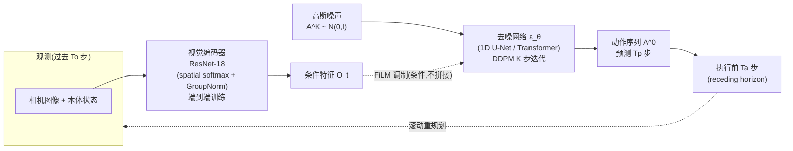

# Diffusion Policy 细粒度解读

> **arXiv**: 2303.04137 · Columbia University / TRI(丰田研究院)/ MIT · 2023(RSS 2023) · **路线**:连续动作生成奠基(条件扩散)
> [← 返回主报告](../index.md)

## TL;DR
Diffusion Policy 把"机器人该执行什么动作"重新表述成一个**条件去噪扩散过程**:不再直接回归出一个动作,而是从高斯噪声出发,在视觉观测的条件下、通过若干步去噪迭代逐步"雕刻"出一段未来动作序列。它的三个关键工程契约是——**(1)预测一整段动作块(action sequence/chunk)并用 receding-horizon(滚动时域)方式执行;(2)把视觉观测当作"条件"而非"待生成对象",经视觉编码器 + FiLM 调制注入去噪网络;(3)用 DDPM 的时序扩散网络(1D 卷积 U-Net 或 minGPT 式 Transformer)建模动作分布**。这套表述天生擅长建模**多峰(multimodal)动作分布**、适配高维动作空间、训练极其稳定。论文在 4 个操作基准、12 个任务上相对此前最优方法取得 **平均 +46.9% 成功率提升**⚠️(作者口径)。它不是 VLA(没有语言大模型主干、没有网络规模预训练),但它确立了"**用扩散/迭代去噪做连续 visuomotor 动作生成**"这一范式,成为后来 Octo、π0、GR00T 的 action head 里"扩散 / 流匹配动作专家"的直接思想源头,与 RT-2 代表的"离散动作 token + 自回归"路线分庭抗礼。

## 1. 要解决的问题
模仿学习(behavior cloning)从人类演示里学操作策略,长期被三个老问题卡住:

- **多峰性(multimodality)**:同一个观测下,人类演示里可能存在多种同样合理的动作(比如绕过障碍物可以从左也可以从右)。传统做法直接回归一个动作(MSE 回归),会把多个合理模式**平均**成一个不合理的中间动作;用高斯/GMM、离散分类、隐变量等显式建模多峰,要么表达力不足,要么训练不稳。
- **高维动作 + 时序一致性**:要预测一整段连续动作(而非单步),输出维度高、还要保证段内时序连贯,普通回归很难兼顾。
- **训练稳定性**:能量模型(如 IBC,Implicit BC)理论上能建模任意分布,但其训练依赖负采样,实践中**不稳定**。

Diffusion Policy 的回答:**借用图像生成里成熟的 DDPM(去噪扩散概率模型)**。扩散模型本就是为"建模复杂、多峰的高维分布"而生,而且训练目标就是一个简单的去噪 MSE,非常稳定。把它从"生成图像"迁移到"生成动作序列",就同时解决了多峰、高维、稳定三件事——这正是 Diffusion Policy 的核心 insight。

## 2. 方法与架构

整体可拆成四个模块:**动作扩散的数学表述 → receding-horizon 动作分块 → 视觉条件注入 → 两种去噪网络主干**。



### 2.1 动作扩散:把"预测动作"变成"逐步去噪"

核心是把策略 π 表示成一个**条件去噪扩散过程**。训练时给真实动作序列 A⁰ 加 K 级高斯噪声得到 Aᴷ;网络 εθ 学习在给定观测条件 Oₜ 下**预测被加进去的噪声**。推理时从纯高斯噪声 Aᴷ ~ N(0, I) 出发,反复执行 K 步去噪(每步等价于一次随机 Langevin dynamics 更新),逐步把噪声"还原"成一段合理的动作序列 A⁰:

```
A^(k-1) = α ( A^k - γ·ε_θ(O_t, A^k, k) ) + N(0, σ²I)
```

- 训练目标就是**最朴素的噪声预测 MSE**(`||ε - ε_θ(...)||²`),这正是它训练稳定的根本原因——不需要 IBC 那样的负采样,也不会像 MSE 直接回归那样把多峰塌成均值。
- **为什么能建模多峰**:从不同的初始噪声出发去噪,会收敛到分布的不同模式,因此天然采样出多种合理动作,而不是平均。
- 实现上用 **DDPM**;为实时,推理可换 **DDIM**:训练 100 步、推理仅 10 步即可,在 GPU 上做到约 **0.1s** 单次推理延迟。⚠️(作者口径)

### 2.2 Receding-Horizon 动作分块:连续路线最被低估的贡献

Diffusion Policy 不预测单步动作,而是**一次预测未来一整段动作序列**,再以滚动时域方式执行。三个时域参数是后续所有"action chunking"工作的母版:

| 记号 | 含义 | 作用 |
|---|---|---|
| **Tₒ**(observation horizon) | 输入的过去观测步数 | 提供足够上下文 |
| **Tₚ**(prediction horizon) | 一次预测的未来动作步数 | 段内时序连贯、保证规划长程一致 |
| **Tₐ**(action execution horizon) | 实际执行的步数(Tₐ ≤ Tₚ) | 执行 Tₐ 步后回到观测、重新预测(滚动重规划) |

这样做同时拿到两个好处:**长时序一致性**(预测一整段,避免单步策略抖动/犹豫)与**对闭环扰动的反应性**(只执行前 Tₐ 步就重规划,不至于盲目跑完整段)。这一"分块预测 + 滚动执行"几乎被后续所有连续动作 VLA(Octo / π0 / GR00T 的 action head)原样继承。

### 2.3 视觉条件:把观测当"条件"而非"待生成对象"

这是 Diffusion Policy 一个看似细节、实则决定性能与速度的设计:

- **视觉编码器**:ResNet-18(替换标准 global pooling 为 **spatial softmax** 保留空间信息,并把 BatchNorm 换成 **GroupNorm** 以适配扩散训练),**与策略端到端联合训练**(消融显示端到端显著优于冻结预训练编码器)。
- **条件注入而非拼接**:编码后的视觉特征作为**条件 Oₜ**,通过 **FiLM(Feature-wise Linear Modulation)** 调制进去噪网络;而**不是**把视觉特征塞进"待去噪"的联合分布里。作者强调,这一选择"**大幅降低计算量、使实时动作推理成为可能**"——因为视觉编码只需在每个去噪循环外算一次,而非每步去噪都重算。

### 2.4 两种去噪网络主干

| 主干 | 结构 | 特点 | 建议 |
|---|---|---|---|
| **CNN-based(默认)** | 1D 时序卷积 U-Net + FiLM 条件 | 开箱即用、几乎不用调参;但在需要**剧烈/急速动作切换**的任务上易过度平滑(over-smoothing) | 新任务**首选** |
| **Transformer-based** | 时序扩散 Transformer(基于 minGPT) | 缓解过度平滑、复杂任务上表现更好;但需要更细致的超参调优 | 复杂/高频任务再上 |

## 3. 关键设计与创新点
- **动作即去噪生成**:把策略表述成条件 DDPM,用迭代去噪生成连续动作——这是与 RT-2"动作即离散 token"截然不同的另一条范式根。
- **天然建模多峰分布**:不同初始噪声 → 不同动作模式,从根上解决 BC 的多峰塌缩问题;实测 **position control 动作空间持续优于 velocity control**(基线多依赖速度控制),作者归因于扩散对多峰的处理与更小的累积误差。
- **receding-horizon 动作分块(Tₒ/Tₚ/Tₐ)**:预测一段、执行一截、滚动重规划,兼顾长时序一致与闭环反应——被后续连续动作 VLA 普遍继承。
- **视觉条件注入(FiLM)而非联合扩散**:把观测当条件,使视觉编码每循环只算一次,换来实时推理。
- **训练稳定**:目标只是去噪 MSE,无需 IBC 式负采样,稳定性远好于能量模型。

## 4. 实验与关键结果

| 指标 | 数值 | 说明 |
|---|---|---|
| 评测规模 | **4 个基准 / 12 个任务** | 含仿真与真机操作 |
| 相对此前 SOTA 的平均提升 | **+46.9% 成功率**⚠️ | 论文标题级头条数字 |
| 实时推理 | DDIM 训练 100 步 / 推理 10 步,GPU 约 **0.1s/次**⚠️ | 使实时闭环可行 |
| 默认主干 | 1D CNN U-Net(FiLM 条件) | Transformer 主干用于复杂任务 |
| 视觉编码器 | ResNet-18(spatial softmax + GroupNorm),端到端训练 | 冻结预训练编码器表现更差 |

> 注:+46.9% 是相对一组基线(LSTM-GMM、IBC、BET 等)在多任务上的**平均**相对提升,属作者自评口径;逐任务数字差异很大,引用时应回到论文 Table 对应任务。

## 5. 局限与争议
- **不是 VLA,没有语义泛化**:Diffusion Policy 本身**没有语言大模型主干、没有网络规模预训练**,语言条件能力弱,无法像 RT-2 那样涌现符号理解/常识泛化。它解决的是"动作怎么生成得好",而非"语义怎么泛化"——这恰恰是后来要把它接到 VLM 上(Octo/π0/GR00T)的动机。
- **多步去噪的推理开销**:即便 DDIM 压到 10 步,相比一次前向回归仍更重;高频接触控制场景下去噪步数与延迟需权衡(后续 π0 改用**流匹配 flow matching** 部分就是为更少步数/更高频)。
- **CNN 主干过度平滑**:默认 1D CNN 在需要急速动作切换的任务上会平滑掉高频细节,需换 Transformer 主干并细调。
- **单任务、窄域**:原论文以单任务专用策略为主,未触及跨任务/跨本体的大规模泛化——这部分由后续把扩散动作头嵌进通用 VLA 的工作补上。

## 6. 在 VLA 谱系中的位置:连续动作路线的"原点"

VLA 的动作生成有两条根本对立的路线,Diffusion Policy 是**连续路线**的源头,与 RT-2(离散 token)对立:

| 维度 | 离散 token 路线([[rt2]] 系) | 连续扩散/流匹配路线(本文系) |
|---|---|---|
| 动作表示 | 离散化成整数 token | 连续向量,迭代去噪生成 |
| 生成方式 | 自回归逐 token 续写 | 从噪声并行去噪出整段动作 |
| 多峰建模 | 靠采样温度,较弱 | 天然多峰 |
| 高频/平滑 | 受离散精度与串行解码限制 | 连续输出、动作分块,更适合高频平滑 |
| 与语义结合 | 复用 VLM 词表,语义强 | 早期无语义,需外接 VLM 条件 |

后续如何把这条根接进 VLA 主线:

- **Octo**:Transformer 主干 + **扩散动作头(diffusion action head)**,直接采用"观测做条件、扩散生成动作块"的 Diffusion Policy 套路,只是把视觉条件换成 Transformer token。
- **[[pi0]](π0)**:把 Diffusion Policy 的连续动作思想升级为**流匹配(flow matching)动作专家**,挂在 VLM(PaliGemma)主干后做高频(50Hz)连续控制;flow matching 可视为扩散的"更直、更少步"变体,直接继承了"条件 + 迭代生成连续动作块"的内核。
- **GR00T**(NVIDIA Isaac GR00T N1):同样采用**扩散/流匹配式 action head**(DiT 类)接在 VLM 主干后,延续 receding-horizon 动作分块。

一句话:**RT-2 把动作当语言,Diffusion Policy 把动作当要去噪生成的连续信号**。前者长在语义泛化、短在动作精度与频率;后者长在多峰/高频/平滑、短在语义。2024–2025 的主流 VLA(π0、GR00T、以及带扩散头的 Octo)本质是"**RT-2 的 VLM 语义主干 + Diffusion Policy 的连续动作头**"的合流,而连续动作头这一半的根,就在这篇 2303.04137。

## 来源
- 论文:arxiv.org/abs/2303.04137(Diffusion Policy: Visuomotor Policy Learning via Action Diffusion;Chi, Xu, Feng, Cousineau, Du, Burchfiel, Tedrake, Song;RSS 2023)
- 项目主页:diffusion-policy.cs.columbia.edu
- 期刊扩展版:IJRR Vol.44 No.10-11(2024/2025),DOI 10.1177/02783649241273668
- 代码:github.com/real-stanford/diffusion_policy
- HTML 全文:arxiv.org/html/2303.04137v5(架构 / FiLM / 时域记号 / 动作空间消融等细节)
