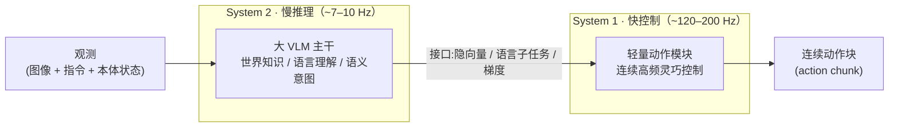
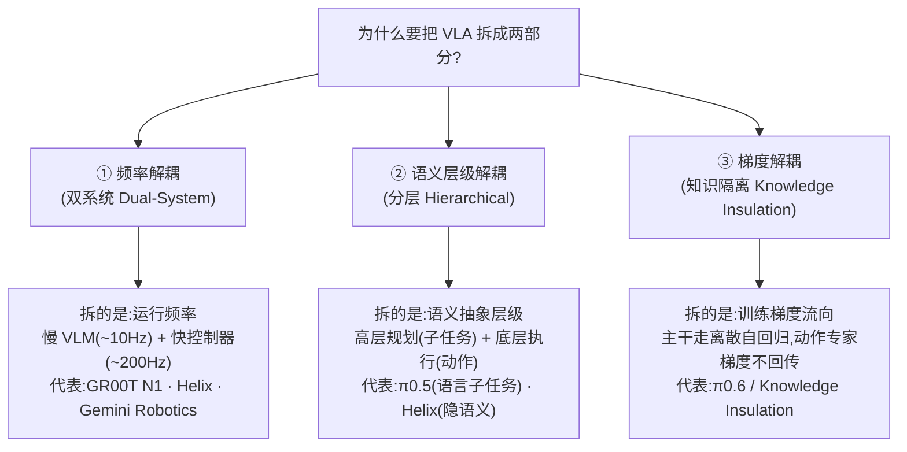

# 双系统 / 分层架构原理专题:频率、层级与梯度三种"解耦"

> [← 返回主报告](../index.md)

这是一篇**横切分析页**:不复述单模型细节,而是把 GR00T N1、Helix、Gemini Robotics、π0/π0.5/π0.6、WALL-OSS 放在同一张桌子上,回答三个常被混为一谈的问题——**为什么要拆成两套?拆的到底是什么(频率 / 语义层级 / 梯度)?哪些模型其实并不算"双系统"?** 各模型的内部机理与数字一律回链对应细读。

---

## ① 为什么需要"双系统":频率解耦动机

把一个 VLA 拆成"慢推理 + 快控制"两套,最根本的驱动力是一个**物理上的频率冲突**:

- **承载世界知识与语言理解的大 VLM 推理慢**:互联网预训练的视觉-语言主干参数动辄数 B,单次前向在 GPU 上只能跑到**十 Hz 量级**(GR00T N1 的 Eagle-2 VLM 在 L40 上约 **~10 Hz**,详见 [groot-n1.md](groot-n1.md);Helix 的 7B System 2 为 **7–9 Hz**,见报告 §2.3)。
- **接触丰富的灵巧操作需要高频闭环**:手指、末端轨迹的实时连续控制通常要**百 Hz 量级**(Helix System 1 为 **200 Hz**,GR00T N1 的 DiT 闭环达 **120 Hz**)。

> ⚠️ 频率数字均来源不同、口径各异(自评为主),见下方对比表逐格标注;主报告 §术语表把这一动机概括为"慢速 VLM 负责理解推理(System 2,~7–10 Hz),快速控制器负责实时连续动作(System 1,~200 Hz)"([glossary.md](glossary.md))。

单一模型若想同时"想得对"(大模型语义)与"动得快"(高频控制),会被最慢的那一环卡住。**双系统的本质,就是让两条对频率要求截然相反的计算路径各跑各的**——慢系统低频更新语义意图,快系统高频消费该意图生成动作,中间用某种接口异步衔接。这是 Kahneman"快/慢思考"在机器人上的工程映射(GR00T N1 明确引用此灵感,见 [groot-n1.md](groot-n1.md) §2)。

注意:这里的"双系统"在文献里有**两个相邻但不等价**的动机——**频率**(本节)与**语义层级**(下文 ③)。很多模型同时具备两者,但二者并非同一回事,这正是混淆的根源。

---

## ② 跨系统对比大表

> 口径说明:频率数字来源各异、几乎全为厂商/作者自评 ⚠️;接口与梯度回传方式取自各自细读对架构的描述。**禁止跨行横比频率**(测试硬件、口径不同)。一手未给定量处标"待核"。

| 模型 | System 2(主干 / 频率) | System 1(控制器 / 频率) | 两者接口 | 梯度是否回传主干 | 异步 / 同步 | 细读 |
|---|---|---|---|---|---|---|
| **GR00T N1** | Eagle-2 VLM(SmolLM2+SigLIP-2),~1.34B;**~10 Hz** ⚠️ | DiT 流匹配动作头,16 步块;闭环 **~120 Hz** ⚠️ | **隐向量**:VLM 视觉-语言 token 经 **cross-attention** 注入 DiT | **回传**(端到端联合训练) | 文中按"双系统"设计但**端到端联合优化**;部署可异步 | [groot-n1.md](groot-n1.md) |
| **Helix** | 7B 开放权重 VLM;**7–9 Hz** ⚠️ | 80M cross-attention encoder-decoder Transformer;**200 Hz** ⚠️ | **隐向量**:S2 隐语义喂给 S1 | 待核(新闻稿未明确训练耦合细节) | 设计上 **S2 慢 / S1 快**,典型异步双频率 | [helix.md](helix.md) |
| **Gemini Robotics** | 云端 backbone(Gemini-ER 蒸馏版);query→resp **<160ms** ⚠️ | 本机 action decoder 小模型;端到端 ~250ms,等效 **50 Hz** ⚠️ | **隐向量**:云端语义输出 → 本机 decoder 解成 action chunk | 待核(主干闭源,训练耦合未公开) | **物理拆分 + 异步**:本机展开 chunk 时异步发起下次云端 query | [gemini-robotics.md](gemini-robotics.md) |
| **π0(动作专家)** | VLM 主干(PaliGemma 系) | 独立 **action expert**(流匹配连续动作块) | **同一 Transformer 内的 MoE / 双权重**:动作 token 走独立专家权重 | **回传**(同一前向、联合训练) | **同步**(单模型一次前向);非频率解耦 → 见 ④ 辨析 | [pi0.md](pi0.md) |
| **π0.5(分层)** | 同一 VLM 主干,高层自回归出**语言子任务** $\hat\ell$ | 同一主干内的 action expert,以 $\hat\ell$ 为条件出 50 步连续块 | **语言子任务**(显式自然语言中介)+ 主干内动作专家权重 | **回传**(单 Transformer,两阶段联合训练) | 高层低频规划 + 底层高频(50 Hz)执行;**语义分层**为主 | [pi05.md](pi05.md) |
| **π0.6(知识隔离)** | Gemma3-4B + SigLIP-400M;离散动作 token + 网络数据训练 | 860M 流匹配动作专家(连续) | 主干内 prefix / 注意力;动作专家 attend 主干激活 | **不回传(stop-gradient)** ← 这是 KI 的定义性特征 | 单模型;**梯度维度**隔离而非频率/部署隔离 → 见 ③ | [pi06.md](pi06.md) |
| **WALL-OSS** | Qwen2.5-VL 主干(论文 3B / 工程约 4B),紧耦合 **MoE** | **同一主干**的 Flow Head(Action FFN);无独立第二网络 | **单一可微前向**(Unified Cross-Level CoT):指令→CoT→子任务→连续动作 | **回传**(Integration Phase 2 解冻联合优化) | **单模型 Uni-CoT**,非双系统 → 见 ④ 反例 | [wall-oss.md](wall-oss.md) |

> 📌 读表提示:同样写着"System 2 / System 1",GR00T N1 与 Helix 是**真·频率解耦的两套网络**;而 π0 的"动作专家"、WALL-OSS 的"Flow Head"其实是**同一主干内的不同权重/输出头**,并不构成独立的慢/快两系统——下文 ④ 专门辨析。

---

## ③ 三种"解耦"方式辨析:频率 vs 层级 vs 梯度

"双系统""分层""知识隔离"在很多二手讨论里被当成同义词,但它们解耦的**对象不同**,完全可以正交叠加。把三者拆清楚是理解这一族架构的关键。

**① 双系统 = 频率解耦。** 关心的是"慢的东西和快的东西不能在同一条流水线上跑"。判据:是否存在**两套以不同频率运行的网络**,慢的产出意图、快的高频消费。GR00T N1(~10 Hz / ~120 Hz)、Helix(7–9 Hz / 200 Hz)、Gemini Robotics(云端 <160ms / 本机 50 Hz)是典型。注意频率解耦**不必然要求语义分层**——理论上慢系统可以只输出一个隐向量,不一定显式拆出"子任务"。

**② 分层 = 语义层级解耦。** 关心的是"先决定做什么(high-level),再决定怎么做(low-level)"。判据:是否存在**显式的语义中介**把长程指令翻译成当前子目标。π0.5 最纯粹——高层用自回归**输出自然语言子任务**(如"pick up the plate"),底层 action expert 只以该子任务为条件([pi05.md](pi05.md))。分层**不必然要求频率/网络分离**:π0.5 的高层与底层其实是**同一个 Transformer 主干**,靠概率分解 $\pi(\mathbf a,\hat\ell\mid\mathbf o,\ell)=\pi(\mathbf a\mid\mathbf o,\hat\ell)\cdot\pi(\hat\ell\mid\mathbf o,\ell)$ 而非两套独立网络实现层级。

**③ 知识隔离 = 梯度解耦。** 关心的是"训练时别让连续控制的梯度污染预训练 VLM 的语义知识"。判据:动作专家的梯度是否**被 stop-gradient 切断、不回传主干**。这是 π0.6 的 Knowledge Insulation 的定义性特征([pi06.md](pi06.md) §3):VLM 主干只用离散动作 token + 网络数据训练,连续流匹配专家的梯度**不回流**。它既不是频率拆分(仍是单模型一次前向),也不是语义分层(可与分层并存),而是纯粹的**训练期梯度治理**。

**三者关系:正交,可叠加。** π0.6 同时具备 ②(承袭 π0.5 的语言子任务分层)与 ③(KI 梯度隔离),但在部署上并非 ① 的"两套不同频率网络"。GR00T N1 具备 ①(频率)且部分具备 ②(VLM 语义→DiT 动作),但**不做 ③**(梯度端到端回传)。一句话对照:

| 解耦方式 | 拆的对象 | 判据 | 典型 |
|---|---|---|---|
| 双系统(频率) | 运行频率 | 两套网络以不同 Hz 运行 | GR00T N1、Helix、Gemini Robotics |
| 分层(层级) | 语义抽象 | 是否有显式高层子目标中介 | π0.5(语言子任务)、π0.6 |
| 知识隔离(梯度) | 训练梯度流向 | 动作专家梯度是否 stop-gradient | π0.6 / KI、π0.7(沿用 KI) |

> π0.5 自己用"两阶段训练(先离散统一→再上流匹配)"在**时间维度**缓解离散/连续冲突;π0.6 的 KI 则用 stop-gradient 在**梯度维度**更彻底地解决——两者动机一致但手段不同([pi06.md](pi06.md) §3.2 对此有明确对照)。

---

## ④ 边界与反例:哪些其实不算"双系统"

横切看下来,"双系统"是个被滥用的标签。两个最该辨析的边界:

### 反例 1:WALL-OSS 是单一 MoE 模型,而非双系统

WALL-OSS **明确反其道而行**:它不拆慢/快两套网络,而是用 **Unified Cross-Level CoT** 把"指令推理 → 子目标分解 → 细粒度动作合成"压进**同一个可微前向、同一个 Qwen2.5-VL 主干**([wall-oss.md](wall-oss.md) §2.2)。

- 它确实有"两个输出头"(LM Head 出离散/CoT/子任务,Flow Head 出连续动作),也确实有 **MoE**(Vision-Language FFN / Action FFN),但 MoE 的多专家是**同一主干内由静态路由按模态分流**,共享同一套 self-attention,**不构成两套以不同频率运行的独立系统**。
- WALL-OSS 细读本身就把这点作为与 GR00T N1 的区别标签:"GR00T N1 走双系统/分层;WALL-OSS 主打单模型 Uni-CoT,把推理、子任务与连续动作压进同一可微前向"([wall-oss.md](wall-oss.md) §6)。
- 所以:**有 MoE ≠ 双系统;有两个输出头 ≠ 双系统**。判据始终是"是否存在两套以不同频率运行、靠接口异步衔接的网络"。

### 反例 2:π0 的"动作专家"算不算双系统?——辨析

π0 把 VLM 主干 + 流匹配 **action expert** 用 MoE / 双权重组织在一起。这常被叫作"双系统",但严格按 ① 的判据,**π0 更接近"单模型双权重",而非频率解耦的双系统**:

- 动作专家是**同一个 Transformer 一次前向**里的一组独立权重,动作 token 走专家权重、图文 token 走主干权重(见 [pi05.md](pi05.md) §2.1.4 对 π0 双流结构的继承描述),**梯度端到端回传**,**不是慢/快两条独立流水线**。
- 它解决的是"连续动作如何与 VLM 共存"(模态/权重隔离),而不是"慢推理与快控制如何异步"(频率)。GR00T N1 细读也专门点名这一区别:"GR00T N1 用简单的 cross-attention 桥接两系统,区别于 π0 把'VLM 主干 + 动作专家'用 MoE 桥接的做法"([groot-n1.md](groot-n1.md) §2.2 ⚠️ 辨析框)。
- **结论**:π0 的动作专家是"双系统"思想的**前身/弱形式**——它把动作模块结构性地分出来(权重隔离 + 动作分块支撑高频块输出),但**没有把它做成一个独立运行、独立频率的 System 1**。把 π0 叫"双系统"是宽泛用法;严格意义上它是"带独立动作专家的单一 VLA"。Gemini Robotics 细读也把 π0 归为"本地 action expert、黑箱、单模型"一类,与自己的"云-端延迟拆分双系统"区分([gemini-robotics.md](gemini-robotics.md) §5)。

> 一句话:**双系统看的是"频率 + 两套网络 + 异步接口"三件套是否齐备**。GR00T N1 / Helix / Gemini Robotics 齐备;π0(动作专家)缺"独立频率/独立网络";WALL-OSS 三件全无(单模型)。

---

## ⑤ 频率数字来源与可信度汇总

所有频率/延迟数字几乎都是**厂商或作者自评 ⚠️**,测试硬件与口径互不相同,**禁止横比**。逐条标注来源如下:

| 数字 | 来源与口径 | 标注 |
|---|---|---|
| GR00T N1 System 2 ~10 Hz | NVIDIA 自评,L40 GPU 上 Eagle-2 VLM([groot-n1.md](groot-n1.md) §2.1) | ⚠️ 自评 |
| GR00T N1 System 1 ~120 Hz / 一块 16 步动作约 63.9ms | NVIDIA 自评,L40 bf16 采样([groot-n1.md](groot-n1.md) §2、图注) | ⚠️ 自评 |
| Helix System 2 7–9 Hz / System 1 200 Hz / 35 DoF | Figure 新闻稿自报,非同行评审(报告 §2.3) | ⚠️ 自评 |
| Gemini Robotics 云端 query→resp <160ms / 端到端 ~250ms / 等效 50 Hz | Google DeepMind 自评([gemini-robotics.md](gemini-robotics.md) §2.2) | ⚠️ 自评 |
| π0.5 底层 50 Hz 下发目标位姿(PD 跟踪) | PI 自评([pi05.md](pi05.md) §2.1.3 / §2.4) | ⚠️ 自评 |
| π0.7 最大推理延迟 ~240ms(社区报最坏 ~127ms,口径不同) | PI 自评 + 二手,口径不一 | ⚠️ 待核 |
| 各模型"System 1 真机持续频率"的独立第三方实测 | 无 | 待核 |

> 通用警示:上述模型(GR00T 系除开放权重外)多为**自评、闭源、缺独立复现**;频率是设计/理想口径,真机端到端持续频率受相机、通信、控制器拖累,普遍**无第三方实测**——引用频率时务必带"⚠️ 自评 / 待核"。

---

## 关联阅读

- 单模型细读:[GR00T N1](groot-n1.md) · [Gemini Robotics](gemini-robotics.md) · [π0](pi0.md) · [π0.5](pi05.md) · [π0.6/π*0.6](pi06.md) · [π0.7](pi07.md) · [WALL-OSS](wall-oss.md)
- 路线之争(离散 token vs 连续流匹配):[主报告 §三](../index.md)
- 术语速查(双系统 / 流匹配 / 动作分块 / co-training):[glossary.md](glossary.md)
- 基准与同口径成绩:[benchmarks.md](benchmarks.md) · 数据侧:[embodied-data.md](embodied-data.md)
