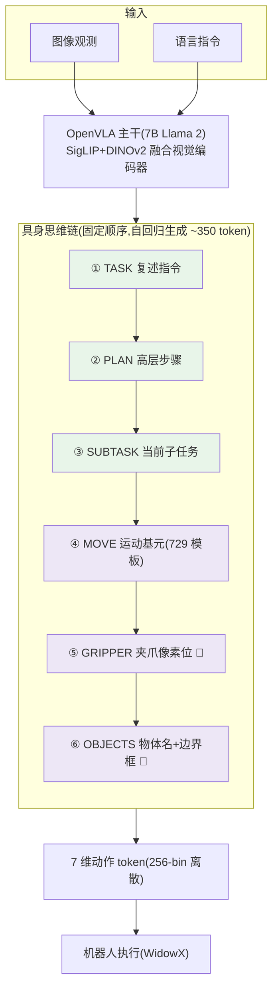
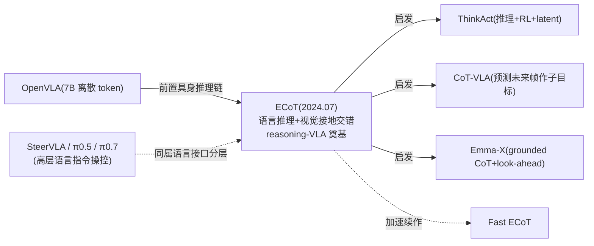

# ECoT:具身思维链,reasoning-VLA 的奠基

> **arXiv**: [2407.08693](https://arxiv.org/abs/2407.08693)(2024.07,CoRL 2024)
> **机构**: UC Berkeley / Stanford / 华沙大学
> **作者**: Michał Zawalski, William Chen, Karl Pertsch, Oier Mees, Chelsea Finn, Sergey Levine
> **路线**: 推理 CoT(在 OpenVLA 离散 token 上前置「具身思维链」)
> **项目主页**: <https://embodied-cot.github.io>

> [← 返回主报告](../index.md)

---

## TL;DR

ECoT(Embodied Chain-of-Thought Reasoning)是 **reasoning-VLA 这条路线的奠基工作**:它把 LLM 圈「先想再答(Chain-of-Thought)」搬进 VLA——让机器人策略在输出动作**之前**,先生成一段**结构化的具身推理链**,再据此出动作。

它建在 [OpenVLA](openvla.md)(7B,Llama 2 主干)之上,核心是一套**固定顺序、语言推理与视觉接地交错**的推理结构:

1. **TASK**(复述指令)→ **2. PLAN**(高层步骤)→ **3. SUBTASK**(当前子任务)→ **4. MOVE**(低层运动基元,如「向左移动」)→ **5. GRIPPER**(夹爪末端的**像素坐标**)→ **6. OBJECTS**(场景物体名 + **边界框像素坐标**)。

前三步是**纯语言**推理,后三步是**视觉接地(visually grounded)**——把推理「钉」在图像的具体像素/框上。模型先自回归吐出这条链(约 **350 个 token/步**,对照 base OpenVLA 的 7 个),最后才输出 7 维动作 token。

关键在于**监督从哪来**:作者设计了一条**无需新采机器人数据**的**合成推理链流水线**,给已有的 Bridge V2 演示「事后加注」——用 Prismatic-7B(场景描述)+ Grounding DINO(物体框)+ 729 个模板化运动基元 + OWLv2+SAM(末端像素位)+ 机器人状态 RANSAC 投影(3D)+ Gemini 1.0(最终拼成推理链),跑了 **7 天**生成全部标注。

⚠️ 战绩(Bridge V2 WidowX 真机,314 trials/策略):**ID 视角 66%、OOD 视角 64%**,绝对成功率**超 OpenVLA +22/+34、超 RT-2-X +19/+16、超 naive 语言 CoT +18/+16**。更妙的是**可解释性带来可纠正性**:在最难任务上,**一次人类自然语言干预**(让 ChatGPT 重写推理链)就能把成功率从 32% 抬升 **+48%**。

一句话:**ECoT = 「把 CoT 引入 VLA」的开山之作——用「语言推理 + 视觉接地(像素位/边界框)」交错的具身思维链前置于动作,靠一条不用新数据的合成标注流水线喂出监督;它不仅涨点(尤其 OOD 泛化),更让 VLA 的决策第一次变得可读、可被人一句话纠正,开启了 ThinkAct / CoT-VLA / Emma-X 等一整条 reasoning-VLA 路线。**

> ⚠️ **可信度提示**:本页定量(Bridge 66%/64%、各 +Δ、纠正 +48%、跨本体 4×/30× 提速)均为**作者自评**(CoRL 2024 同行评审,但真机数字非独立第三方复现)。**GPU 小时 / batch size 一手未给,标待核**;代码/权重的确切发布链接以项目页为准(本页标待核)。Bridge V2 真机评测对评测协议敏感,引用请连同 trials 数与 ID/OOD 口径保留。

---

## 1. 要解决的问题

VLA 把动作当 token 直接生成(如 [RT-2](rt2.md)、[OpenVLA](openvla.md)),但这种「看图→直接吐动作」是**黑箱**的:

1. **不会「想」**:复杂、长程、需要常识推断的任务(「把所有积木按颜色分堆」),直接映射往往失败——模型没有把任务**拆解**、把推理**接地**到具体物体/位置的中间过程。
2. **不可解释、不可纠正**:失败了不知道为什么,人也没法干预——你只能重训。
3. **泛化弱**:面对没见过的视角/物体/背景(OOD),端到端映射容易崩。

LLM 圈早已证明 **Chain-of-Thought(先生成推理步骤再答)** 能大幅提升复杂推理。ECoT 的问题就是:**能否把 CoT 搬进 VLA?** 但机器人有个独特挑战——纯语言推理(「我应该先靠近杯子」)不够,推理必须**接地到物理世界的具体像素与几何**(杯子在画面哪个框、夹爪现在在哪个像素)。ECoT 给出的答案就是**「具身思维链」:语言推理 + 视觉接地交错**。

> 📌 这是站内[预测式 / 推理式 VLA](predictive-vla.md) 谱系里「**显式语言推理**」分支的源头,与 [π0.5](pi05.md)/[π0.7](pi07.md)/[SteerVLA](steervla.md) 的「高层语言指令」一脉相承,但 ECoT 更强调**把推理链本身作为可训练、可读、可纠正的中间产物**。

---

## 2. 方法与架构

> 🟩 绿 = 纯语言推理步骤;🟪 紫 = 视觉接地步骤(钉在像素/边界框上)。

### 2.1 骨干:OpenVLA(不换架构,扩输出空间)

ECoT 直接复用 [OpenVLA](openvla.md):Prismatic VLM(**Llama 2 7B** 主干 + **SigLIP/DINOv2 融合**视觉编码器),动作仍是**每维 256-bin 离散 token**(7 token/步)。ECoT 不改架构,只是把输出序列从「7 个动作 token」**扩展为「推理链 token(~350)+ 7 个动作 token」**——让模型自回归地先吐推理、后吐动作。

### 2.2 具身思维链:语言 + 视觉接地交错

推理链是**固定顺序**的 6 段(见上图)。设计哲学:**从抽象到具体、从语言到像素**——先想「任务是什么、计划怎么走、当前该做哪个子任务」(语言),再落到「该做什么运动基元、夹爪现在在画面哪个像素、相关物体在哪些框里」(视觉接地)。视觉接地步骤强制模型把推理**钉在当前图像**上,这正是它比「naive 语言 CoT」更强的原因。

### 2.3 合成推理链流水线:不采新数据,给旧数据「加注」

ECoT 不需要人去标推理链——它用一套**模型流水线**给已有的 **Bridge V2**(>250 万 transition / 6 万演示)**事后合成**推理链,跑了约 **7 天**:

| 推理链成分 | 由谁生成 |
|---|---|
| 场景/物体描述、最终推理链拼装 | **Prismatic-7B VLM** + **Gemini 1.0** |
| 物体边界框 | **Grounding DINO**(box 置信度 >0.3 / text >0.2) |
| 运动基元(MOVE) | **729 个模板化基元**(实际用到 >0.1% 的有 54 个) |
| 夹爪 2D 像素位 | **OWLv2 + SAM** |
| 3D→2D 投影 | 机器人状态 + **RANSAC** 拟合投影矩阵 |

base ECoT 训练 **80k 步**。这条「VLM/检测器/几何工具事后加注」的思路,与 [数据处理](data-processing.md) 里的伪标签/事后标注一脉相承,也呼应 [SteerVLA](steervla.md) 的「VLM 事后稠密语言标注」。

---

## 3. 关键设计与创新点

1. **首次把 CoT 引入 VLA(reasoning-VLA 奠基)**:在动作前生成结构化推理链,而非黑箱直出。
2. **语言推理 + 视觉接地交错**:推理不止于文字,还钉在像素位/边界框上——消融证明视觉接地是泛化增益的关键(去掉接地步骤,OOD 成功率明显下降)。
3. **无需新数据的合成标注流水线**:用现成 VLM/检测/分割/几何工具给已有演示加注推理链,可规模化、零额外采集。
4. **可解释 → 可纠正**:推理链让失败可读;**一次人类语言干预**(ChatGPT 重写推理链)即把最难任务 +48%。
5. **跨本体迁移 + 训练高效**:推理结构零样本迁移到新机器人(靠 `TASK:` 提示);在 27 数据集 OXE 混合里只用 ~13% ECoT 数据,**20k 步即追平 80k 步**性能(4×/30× 算力缩减)。

---

## 4. 实验与关键结果

> ⚠️ 全部为**作者自评**(CoRL 2024;真机非第三方复现)。Bridge V2 WidowX 真机,314 trials/策略。

### 4.1 Bridge V2 真机主结果(⚠️ 自评)

| 设定 | ECoT | OpenVLA | RT-2-X | Octo | Naive CoT |
|---|---|---|---|---|---|
| **ID 视角** 成功率 | **66%** | 44% | 47% | 21% | 48% |
| **OOD 视角** 成功率 | **64%** | 30% | 48% | 16% | 48% |

- ID:ECoT 绝对超 OpenVLA **+22%**、RT-2-X +19%、Octo +45%、naive 语言 CoT +18%。
- OOD:超 OpenVLA **+34%**、RT-2-X +16%、Octo +48%、naive CoT +16%。**OOD 增益更大**,印证「视觉接地推理利于泛化」。

### 4.2 消融:视觉接地的重要性(OOD,106 trials)

| 变体 | 成功率 |
|---|---|
| **Base ECoT(完整推理链)** | **69%** |
| Frozen Bbox(冻结边界框) | 60% |
| Co-trained | 56% |
| Fine-tuned | 54% |
| OpenVLA(对照) | 29% |

→ 削弱/冻结视觉接地步骤,成功率单调下降,说明**接地步骤是有效成分**,不是装饰。

### 4.3 推理加速 + 人类纠正(⚠️ 自评)

| 项目 | 结果 |
|---|---|
| **推理加速**(3 任务,25 trials) | Naïve 63% → **5-Step 缓存 72%(+24% 速度)** / **Async 65%(+40% 速度)** |
| **交互式纠正**(最难任务) | Base 32% → **一次人类语言干预后 +48% 绝对增益**(ChatGPT 重写推理链) |
| **跨本体**(27-数据集 OXE) | ~13% ECoT 数据,**20k 步追平 80k 步**(4×/30× 算力缩减);零样本迁移新机器人,但 SIMPLER real-to-sim 域差限制表现 |

---

## 5. 在 VLA 谱系中的位置

- **承 [OpenVLA](openvla.md)**:直接以 OpenVLA 为骨干,不改架构,只在输出端前置推理链——可视为「会先想再动的 OpenVLA」。
- **开 reasoning-VLA 一条路**:后续 **ThinkAct**(推理+RL+latent planning)、**CoT-VLA**(预测未来帧作视觉子目标)、**Emma-X**(grounded CoT + look-ahead)、**Fast ECoT**(加速)都以它为源头或对照。
- **与「预测式 VLA」对照([predictive-vla](predictive-vla.md))**:ECoT 是**显式语言推理**(写出推理文字 + 像素接地),而预测式 VLA(VPP/WorldVLA)是**预测未来视觉**再反推动作——两种「中间产物」哲学。
- **与「语言接口分层」呼应([π0.5](pi05.md)/[π0.7](pi07.md)/[SteerVLA](steervla.md))**:都用语言作高层中介,但 ECoT 把推理链放在**同一个模型内部、作为可训练序列**,而非高低层两个模型。

---

## 6. 局限与存疑

1. **推理结构固定**:模型总是按作者定的固定顺序走完全部步骤,缺乏「该不该想、想多少」的灵活性(后续 OneTwoVLA 等自适应推理正是针对此)。
2. **推理慢**:~350 token/步(对照 base OpenVLA 的 7),即便有 5-Step/Async 加速,对高频控制仍是负担。
3. **本体迁移规模有限**:主要在 WidowX(Bridge V2)上验证;更广 OXE 本体的 scaling 尚不充分,SIMPLER real-to-sim 有域差。
4. **co-training 聊天能力不提升控制**:加聊天数据共训对控制性能无可测增益。
5. **可解释 ≠ 万能**:推理可读有助调试,但不是「保证正确」的解法。
6. **复现细节待核**:GPU 小时、batch size 一手未给;代码/权重确切发布链接以项目页为准。

---

## 来源

- 论文:Embodied Chain-of-Thought Reasoning for Vision-and-Language-Action Models. arXiv:2407.08693(CoRL 2024)。<https://arxiv.org/abs/2407.08693>
- 项目主页:<https://embodied-cot.github.io>
- 骨干 OpenVLA:见本站 [OpenVLA 细读](openvla.md)(arXiv:2406.09246)

> 说明:本页定量(Bridge 66%/64%、各 Δ、纠正 +48%、跨本体 4×/30×)为**作者自评**;GPU 小时/batch、代码权重链接一手未确认处标「待核」,不编造。引用请连同自评属性、trials 数与 ID/OOD 口径保留。
