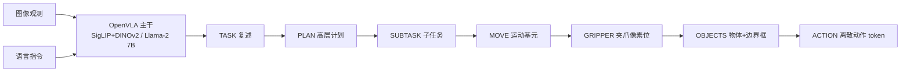

# ECoT:具身思维链推理(Embodied Chain-of-Thought)

> **arXiv**: [2407.08693](https://arxiv.org/abs/2407.08693) | **机构**: UC Berkeley / Stanford / University of Warsaw(⚠️ 据搜索结果) | **时间**: 2024.07(v1;v3 修订于 2025.03)
> **路线**: 新范式 · 推理(动作前先做具身思维链)

> [← 返回主报告](../index.md)

---

## TL;DR

ECoT(Embodied Chain-of-Thought,具身思维链)的核心主张:让视觉-语言-动作模型(VLA)在**输出动作之前,先一步步"想清楚"**。普通大模型的思维链(CoT)是纯语义推理,但机器人策略必须把推理**接地(ground)到当前的视觉观测与机器人状态**——单纯讲"先做什么再做什么"不够。为此 ECoT 训练 VLA 依次生成一条结构化推理链:**复述任务 → 高层计划 → 当前子任务 → 低层运动基元 → 夹爪 2D 像素位置 → 场景物体名称与边界框 → 最终动作**。

ECoT 不改动 [OpenVLA](openvla) 的网络结构(SigLIP+DINOv2 双流视觉编码器 + Llama-2 7B + 离散动作 token),而是改造**训练数据**:作者设计了一条**可扩展的自动标注流水线**,组合多个现成视觉/语言模型在 Bridge V2 数据集上为每条轨迹合成推理链,因此**不需要任何新增机器人数据**。结果:在一组有挑战性的泛化任务上,ECoT 把 OpenVLA 的**绝对成功率提升约 28 个百分点**(⚠️ 自评),并让人类能更容易**读懂策略为何失败、并用自然语言现场纠正**。代价是推理 token 从 OpenVLA 的约 7 个暴涨到约 350 个,控制频率显著下降,需要冻结/异步等加速技巧来缓解。

> ⚠️ **可信度提示**:下文所有数值均来自论文/项目页的**作者自评**(真机评测,WidowX/Bridge 设置),非独立第三方复现。

---

## 1. 问题

VLA 的核心痛点是**泛化**:学到的策略难以推广到训练分布之外。大型互联网预训练的 VLM 作主干(如 RT-2、[OpenVLA](openvla))已显著改善鲁棒性与泛化,但 VLM 在其他领域最令人兴奋的能力——**对复杂问题做迭代式推理**——尚未被真正引入机器人控制。论文要回答的问题是:**能否让策略在动作前先"推理"任务,从而提升表现?**

两个障碍使得"直接套用 CoT"行不通:

1. **训练样本太简单**。标准 VLA 的训练数据(图像+指令→动作)缺乏推理过程的监督,朴素地用 CoT 式提示几乎无效。
2. **纯语义推理不够"具身"**。常规 CoT 只在子任务层面做语义拆解,而机器人策略必须把推理**接地到传感观测与机器人状态**(物体在哪、夹爪在哪、该往哪个方向动),否则推理与动作脱节。

---

## 2. 方法与架构

### 2.1 具身思维链的构成

ECoT 训练模型在预测动作前,**按固定顺序**生成以下推理字段(由高层语义逐步过渡到低层、可视觉接地的具身特征):

| 步骤 | 字段 | 含义 |
|---|---|---|
| 1 | **TASK** | 复述/改写指令,明确目标 |
| 2 | **PLAN** | 完成任务的高层步骤序列 |
| 3 | **SUBTASK** | 当前应执行的子任务 |
| 4 | **MOVE** | 低层运动基元(如"向左移""向上移") |
| 5 | **GRIPPER** | 机器人末端执行器的 **2D 像素位置** |
| 6 | **OBJECTS** | 场景中物体的名称与**边界框坐标** |
| → | **ACTION** | 最终输出的机器人动作 |

直觉:模型先想清楚"任务是什么、整体怎么做、这一步做什么子任务、该用什么动作基元",再把注意力**接地**到"我的夹爪在画面哪个位置、相关物体的框在哪里",最后才落到具体动作。这条链同时充当了**可解释的中间表示**——人可以直接读出策略"以为"自己在做什么。

### 2.2 可扩展的合成数据流水线

ECoT 的关键工程贡献是**自动为大规模机器人数据生成推理链标注**,无需人工标注、也无需新增机器人采集。论文在 **Bridge V2** 上处理了超过 **250 万(2.5M)条 transition**,耗时约 **7 天**。流水线组合多个现成模型(⚠️ 模型/版本据项目页):

- **Prismatic-7B VLM**:生成场景描述;
- **Grounding DINO**:检测物体与边界框(框置信度阈值 >0.3,文本阈值 >0.2);
- **OWLv2 + SAM**:检测末端执行器的 2D 像素位置;
- **Gemini 1.0**:综合上述信息生成最终推理链与运动基元描述;
- **运动基元**:共 **729 个模板**,由机器人本体感知(proprioception)在 **4 步窗口**上推导得到。

### 2.3 主干与动作表示

ECoT **不改动** [OpenVLA](openvla) 的结构,直接在其上做训练:

- **视觉编码器**:SigLIP + DINOv2 双流特征融合;
- **语言主干**:Llama-2 7B;
- **动作表示**:连续动作经**每维 256-bin 离散化**为 token,与推理文本一同由 LLM **自回归**生成。

也就是说,推理链与动作 token 共享同一个自回归解码过程——模型"边想边写",最后写出动作 token。

*示意图(自绘,据论文描述,非原图)*

---

## 3. 关键设计与创新点

1. **"具身"思维链 vs 纯语义 CoT**:推理链显式包含**视觉接地特征**(夹爪像素位、物体边界框),把"想"和"看/动"绑定,这是相对常规 CoT 的核心区别。
2. **零额外机器人数据**:全部推理监督由**自动流水线**从已有数据(Bridge V2)合成,提升来自"更好地利用已有数据",而非采集新数据。
3. **结构即可解释性**:固定顺序的推理字段天然是一份**可读的失败诊断**——能看出模型在计划层、子任务层还是接地层出错。
4. **自然语言可纠错**:由于中间推理外显,人类可在推理层面**介入修正**策略行为(见第 4 节)。
5. **推理与动作同一自回归流**:无需额外规划器模块,推理文本与动作 token 在同一解码过程产生。

---

## 4. 实验与关键结果

> ⚠️ 以下均为**作者自评**(真机,WidowX/Bridge 设置)。论文称在约 **300+ 次真机评测/策略**、**14 个泛化任务**(项目页口径;arXiv HTML 另给 **314 次 trial** 的合计)上评测,涵盖空间关系、分布外(OOD)物体、OOD 指令等类别。

**主结果——绝对成功率(⚠️ 自评):**

| 方法 | In-distribution 视角 | Out-of-distribution 视角 |
|---|---|---|
| **ECoT(本文)** | **66%** | **64%** |
| RT-2-X | 47% | 48% |
| OpenVLA(Bridge) | 44% | 30% |
| Octo | 21% | 16% |

- 摘要级结论:ECoT 在有挑战性的泛化任务上把 OpenVLA 的**绝对成功率提升约 28 个百分点**,且**不使用任何新增机器人训练数据**。
- **人类纠错**:在"最具挑战性"的评测任务上,允许人用自然语言介入纠正可使成功率**再提升 48%**(⚠️ 自评)。

**推理开销与加速(⚠️ 自评):**

- 推理 token 数从 OpenVLA 的约 **7** 增至 ECoT 的约 **350**,显著降低控制频率。
- **5 步冻结(每 5 步才重算完整推理)**:提速约 **+24%**,成功率 **72%**。
- **异步执行(2 个并行策略实例)**:提速约 **+40%**,成功率 **65%**。
- 项目页另提供用 **TensorRT-LLM** 转换/编译/推理 ECoT 的方法,称在策略性能几乎不变的前提下大幅加速(具体数字 待核)。

---

## 5. 局限与争议

作者自陈的主要局限:

1. **推理结构固定、不自适应**:模型**始终按固定顺序执行全部推理步骤**,不会根据任务难易调整推理链结构(简单任务也"想全套")。
2. **数据规模仍有限**:作者预期把 ECoT 训练**扩展到更大子集的 OXE(Open X-Embodiment)**会带来更好的迁移,暗示当前仅 Bridge V2 规模尚不充分。
3. **执行速度仍是瓶颈**:即便有冻结/异步加速,ECoT 对**高频控制任务**仍偏慢(根因是推理 token 暴涨)。
4. **sim2real 域差**:在 SIMPLER 等真转仿(real-to-sim)评测环境中,ECoT **未能带来提升**,作者归因于**域差(domain gap)**。

补充思考(非论文结论):合成推理链的质量上限受流水线中各模型(检测器、Gemini 生成)的误差与噪声制约;"推理是否真因果地改善了动作、还是充当了正则/数据增广"也是该范式的开放争议。

---

## 6. 在 VLA 谱系中的位置

ECoT 不是一个新的网络结构,而是一种**训练范式/推理范式**,直接嫁接在开源 VLA 之上:

- **直接基座**:构建于 [OpenVLA](openvla)(SigLIP+DINOv2 + Llama-2 7B + 离散动作 token),把它当作"会推理"的版本来增强。
- **对比对象**:正面对标闭源 [RT-2](rt2)(及 RT-2-X)所代表的"大 VLM 直接出动作"路线——ECoT 主张在出动作前插入显式具身推理,以小代价换泛化与可解释。
- **与"快慢双系统/分层"路线的关系**:[π0](pi0)、[GR00T N1](groot-n1)、[Gemini Robotics](gemini-robotics) 等通过**架构层面**分离高层语义与低层控制(VLM 规划 + 动作专家/扩散头);ECoT 则在**单一自回归模型内部、用文本推理链**实现"先想后动",是同一动机(让高层认知引导低层动作)下的**另一种实现路径**——以推理 token 为代价,换取无需改结构、且推理过程完全外显可读。

简言之:ECoT 把"思维链推理"这一 LLM 能力**具身化**并落到开源 VLA 上,是"推理增强动作"这一子方向的代表性早期工作。

---

## 来源

- <https://arxiv.org/abs/2407.08693>
- <https://arxiv.org/html/2407.08693v3>
- <https://embodied-cot.github.io/>
- <https://github.com/MichalZawalski/embodied-CoT>
