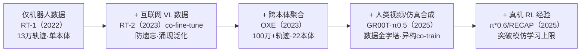
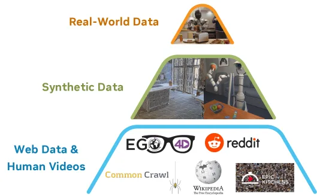
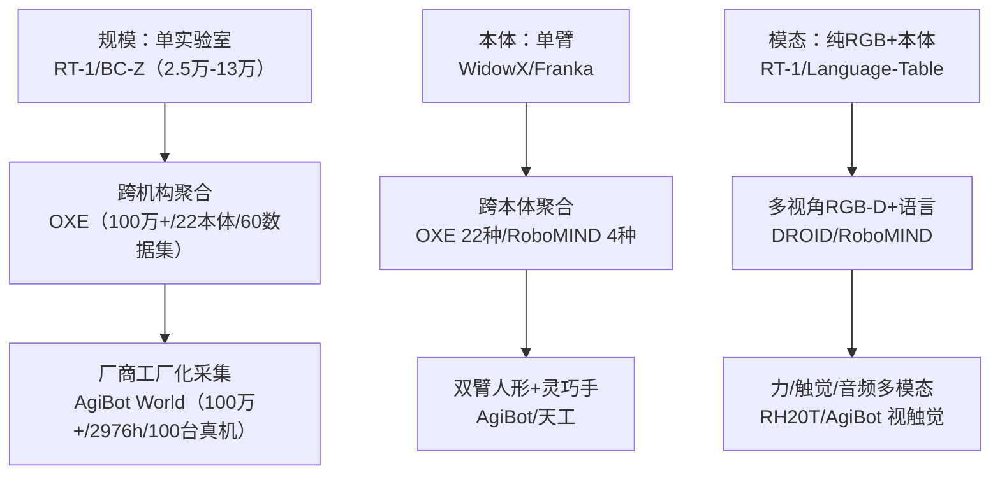
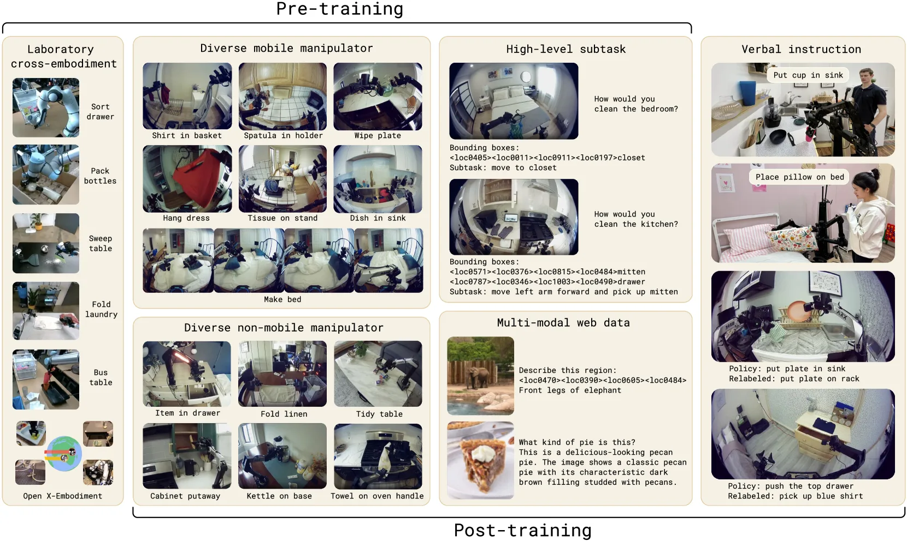
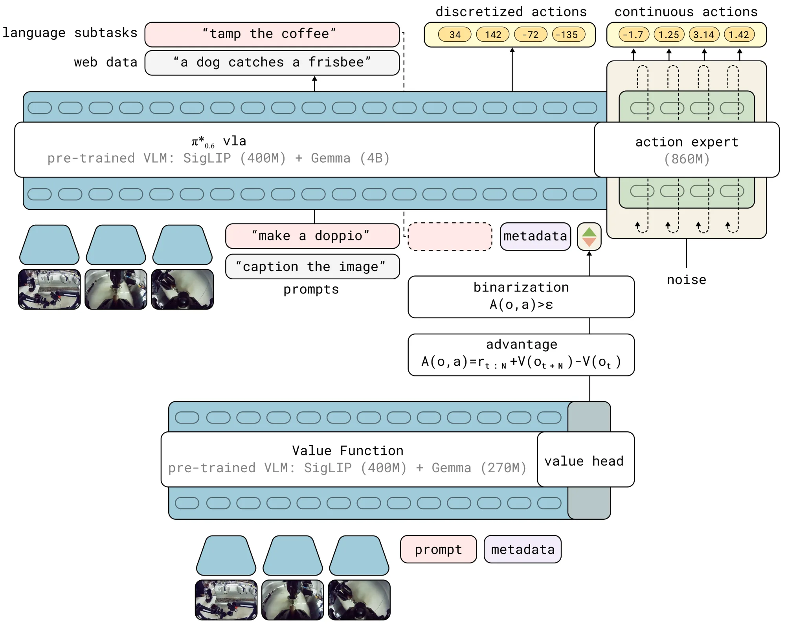

# 具身数据全景梳理:从真机轨迹到数据金字塔

> **定位**:本篇是《VLA 发展深度调研报告》的「具身数据」专题子文档,聚焦 VLA/具身智能的**数据**一侧——数据从哪来、怎么采、怎么配、怎么 scale,而非模型架构本身(架构见主报告第二/三部分)。
> **方法**:基于 12 篇核心论文细读(mined)+ 5 个数据维度网络调研(researched)+ 8 条数字对抗式事实核查(verdicts)综合而成。
> **可信度标注**:凡标 ⚠️ 者为提出方/厂商自评、未经独立第三方复现的数字或结论;经对抗核查确认的数字标注「✅ 核查确认」。
> **日期**:2026-05-30。领域演进极快,多数一手信源为 2024–2026 预印本/官方页面。

---

## 摘要

VLA 的能力上限,很大程度由**数据**而非模型决定。一句话主线:

> **机器人真机数据(精确但稀缺)→ 借互联网视觉-语言数据(语义广度)→ 借人类视频/仿真合成数据(廉价放大)→ 借真机 RL 经验(突破模仿上限)。**

这条主线背后是一个反复出现的根本矛盾:**真机遥操作数据动作精确、与本体严格对齐,但每条轨迹昂贵、采集吞吐低**;而**语义广度与场景多样性所需的规模,真机采集根本喂不饱**。于是整个领域沿着"用精度换可扩展性"的方向,逐层引入更廉价、更广覆盖但动作信号更弱的数据源,再用各种技术手段(潜动作、逆动力学、跨本体归一化、co-training)把它们"翻译"回可执行的机器人动作。**数据金字塔**(NVIDIA GR00T)与**异构协同训练**(π0.5)是这一范式的两个旗舰范例。

四条数据来源各司其职,可一句话概括其分工:**真机撑动作精度,网络撑语义广度,人类视频/仿真撑规模与多样性,RL 经验撑分布外鲁棒性**。

---

## 一、数据来源金字塔:四层全景

主流共识已收敛到「数据金字塔」范式——自底向上,**数据量递减、本体特异性递增、动作信号从无到有、单位成本递增**。下图为 NVIDIA GR00T N1 的经典示意:

| 层级 | 数据源 | 核心作用 | 规模量级 | 动作信号 | 单位成本 | 主要局限 |
|---|---|---|---|---|---|---|
| **顶层** | 真机遥操作 | 精确、与部署本体对齐的可执行动作 | 最小(GR00T 自采人形仅约 88h ⚠️;OXE 聚合 100万+ 轨迹 ✅) | 直接真实动作 | 最高(需机器人+遥操作员+逐条采集) | 量少、采集慢、本体绑定 |
| **中层** | 仿真/合成轨迹 | 批量放大、覆盖反事实场景 | 可放大数十~数百倍(MimicGen ~200→50K;DreamGen 在 RoboCasa 上最高 333× ⚠️) | 仿真真值 / 生成视频+IDM 伪动作 | 中(算力换数据) | sim-to-real gap、生成幻觉、伪动作噪声 |
| **中下层** | 人类视频(第一视角) | 海量语义+动态先验、embodiment-agnostic | 很大(Ego4D 3670h ✅;RynnVLA 约 1200万片段 ✅) | 无动作标签,需潜动作/IDM/手部关键点恢复 | 低(可徒手采集或复用公开视频) | 无动作标签、人-机本体鸿沟、视角差异 |
| **底层** | 网络视觉-语言数据 | 注入互联网级语义常识、防遗忘 | 互联网规模(VQA/caption/grounding) | 无(纯语义先验) | 最低(复用 VLM 预训练语料) | 与具身/空间几何脱节,需弥合分布 gap |

**几个关键判断**:

- **真机数据是少数派**。π0.5 第一训练阶段 ⚠️ 约 **97.6% 样本来自非目标本体**(其他机器人/网络数据),仅 2.4% 是目标移动操作机器人数据;π0 中自有数据约占 90.9%、开源真机约 9.1% ⚠️。这说明"广度从异构来源迁移、精度从少量目标数据获得"已是主流配方。
- **越往下越便宜、越广、动作信号越弱**。底层网络数据几乎零边际成本但完全无动作;人类视频需经三类路径(潜动作 / IDM 伪动作 / 显式手部关键点)才能"翻译"成动作信号(详见第四节)。
- **金字塔不是非此即彼,而是 co-training 混合**。GR00T 在预训练与后训练阶段均跨整座金字塔做协同采样;后训练阶段以 **1:1** 把真机轨迹与合成神经轨迹混合 ⚠️。

---

## 二、主流真机数据集横向对比

真机遥操作数据集是金字塔顶层、也是整个领域的公共底座。下表横向对比 10 个代表性数据集,**所有规模数字均经一手来源核对**(⚠️ 标注厂商自评、✅ 标注本轮对抗核查确认)。

| 数据集 | 年份 | 机构 | 规模 | 本体 | 任务/技能 | 关键模态 | 采集方式 | 开源 |
|---|---|---|---|---|---|---|---|---|
| **RT-1** | 2022 | Google / Everyday Robots | 13万+ episodes,700+ 任务,13台机17个月 | EDR 单臂(7-DoF) | 700+ 指令 | RGB+语言+动作,无深度 | 专用站遥操作 | ✅(已并入 OXE) |
| **BC-Z** | 2022 | Google / Berkeley / Stanford | 25,877 episodes,100 任务 | EDR 单臂 | 100 训练任务+24 未见 | RGB+语言/人类视频条件 | 遥操作+DAgger 干预 | ✅ |
| **Language-Table** | 2022 | Google Research | 近 60万 语言标注轨迹 | 桌面平面推动臂(2D) | 开放词汇推动/重排 | RGB+实时语言+2D 动作 | 实时语言交互遥操作 | ✅ |
| **BridgeData V2** | 2023 | UC Berkeley (RAIL) | **60,096 条轨迹** ✅(50,365 遥操作+9,731 脚本) | WidowX 250 单臂 | 13 技能×24 环境 | RGB-D+语言+本体感知 | VR 遥操作(Quest 2) | ✅ |
| **RH20T** | 2023 | 上海交大(卢策吾组) | 11万+ 操作序列 + 配对人类示范视频 | 多臂(Flexiv/Franka/UR5/Kuka) | 147 任务/42 技能 | RGB-D+**力觉+音频** | 定制遥操作系统 | ✅ |
| **RoboSet** | 2023 | CMU / Meta AI | 28,500 条(9,500 遥操作+19,000 示教回放)⚠️ 网传 98,500 有误 | Franka 单臂(厨房) | 12 技能×38 任务 | 4路RGB+语言+动作 | 遥操作+kinesthetic | ✅(MIT) |
| **DROID** | 2024 | 多机构(18 实验室) | **7.6万条轨迹 / 350h** ✅,564 场景,**13 机构** ✅ | Franka Panda 单臂(统一栈) | 86 任务×125 物体 | 3视角RGB-D+标定+语言 | 分布式众包(3D 鼠标) | ✅ |
| **RoboMIND** | 2024 | 北京人形创新中心 等 | 107k 轨迹,479 任务,含 **5k 失败示范** | 4本体(Franka/UR5e/AgileX双臂/天工人形) | 479 任务×96 物体 | 多视角RGB+本体+语言 | 遥操作 | ✅(HF) |
| **AgiBot World** | 2025 | 智元 AgiBot / 上海AI Lab | **约 100万条轨迹(1,001,552)/ 2976.4h** ✅,100台真机 | 双臂人形+灵巧手+视触觉 | 217 任务/87 技能/106 场景 | 多视角RGB-D+**视触觉**+本体 | VR+动捕遥操作+human-in-loop 质检 | ✅(CC BY-NC-SA) |
| **OXE / RT-X** | 2023 | Google DeepMind 牵头,**21 机构 / 34 实验室** ✅ | **约 100万+ 轨迹** ✅,527 技能,16万 tasks | **22 种本体** ✅(单/双臂/四足) | 527 技能(聚合) | RGB 多视角为主,RLDS/TFRecord | 聚合(池化 60 个已有数据集) | ✅ |

> ⚠️ **读表须知**:
> ① **OXE 是聚合集**——RT-1、BridgeData V2、Language-Table、BC-Z 等均为其子集,统计总量时**勿重复计数**。OXE 常见两种表述:论文摘要 "1M+",社区资料常引约 1.4M。
> ② **"轨迹/episode" 与 "小时" 不同口径不可直接横比**(控制频率 3–10Hz、平均轨迹长度差异大);仅 DROID/AgiBot 给出小时数。
> ③ **可信度分层**:RT-1/BridgeData V2/DROID/RH20T/RoboMIND/BC-Z 均有同行评审(CoRL/RSS/ICRA)背书,数字可信度高;**AgiBot World 规模数字为厂商论文自评**(虽 IROS 2025 Best Paper Finalist,但数据规模真实性与质量分布无第三方审计)。
> ④ **许可证差异大**:RoboSet 为 MIT,厂商数据集(AgiBot/RoboMIND)多附研究用途限制,商用前需逐一核对。

**演进趋势小结**:

两年内单一数据集规模约提升一个数量级(RT-1 13万 → AgiBot 100万),本体从单臂走向人形,模态从纯 RGB 扩展到力/触觉/音频。

---

## 三、人类视频与第一视角数据

人类视频是金字塔中下层、**最廉价的"动态+语义"先验来源**,但天生缺动作标签。本节先看数据集,再看三类"翻译"方法。

### 3.1 代表性数据集

| 数据集 | 年份 | 机构 | 规模 | 性质 | 在 VLA 中的角色 |
|---|---|---|---|---|---|
| **Ego4D** | 2021 | Meta FAIR + 学术联盟 | **3,670 小时** ✅,931 佩戴者,74 地点 | 通用第一视角理解(无动作标签) | 金字塔"人类视频层"典型来源,需经潜动作/IDM 转换 |
| **Ego-Exo4D** | 2023 | Meta FAIR + Project Aria | 1,286 小时,740 佩戴者 | 首个大规模 **ego+exo 同步**多视角 | exo 视角帮助弥合"第一视角→第三视角"观测 gap |
| **EPIC-Kitchens-100** | 2020 | Bristol 等 | 100h,约 9万动作段 | 细粒度厨房手物操作标准基准 | 操作策略视觉预训练/评测 |
| **Something-Something V2** | 2017+ | TwentyBN/Qualcomm | 220,847 短片段,174 动作类 | 细粒度时序手物动作(非头戴) | 操作相关时序表征预训练;LAPA 等潜动作训练源 |
| **EgoDex** | 2025.05 | Apple | **829 小时**,约 33.8万示范,194 任务 | **带 3D 手/手指追踪**的灵巧操作 | 3D 手指位姿即可作可回归动作信号,绕过潜动作 |
| **RynnVLA 预训练集** | 2025.09 | 阿里达摩院 | **约 1200万片段(11.93M)** ✅ | 第一视角人类操作视频 | I2V 生成式预训练,学动作条件视觉动态先验 |

> ⚠️ EgoDex 的 benchmark 指标、RynnVLA "超越 SOTA"、GR00T "+40%"、EgoMimic "+34–228%" 均为作者自评,**未见独立复现**,应与同行评审过的纯数据事实(Ego4D/Ego-Exo4D/EPIC/SSv2)区别看待。
> ⚠️ Something-Something V2 多为手部近景而非严格头戴第一视角,归入"人类操作视频层"时与 Ego4D/EPIC 性质略有差异。

**采集硬件正从"被动录像"转向"带 3D 姿态的具身数据"**:Project Aria 眼镜、Apple Vision Pro 提供 on-device SLAM、眼动、IMU、多相机标定,使第一视角视频天然带可训练的 3D 手/头位姿,直接缩小 human-robot kinematic gap(EgoDex、EgoMimic、Ego-Exo4D 均走此路)。

### 3.2 三类动作信号"翻译"方法

人类视频无动作标签,主流三条转换路径(实际系统常组合使用):

| 方法 | 代表工作 | 机制 | 优点 | 局限 |
|---|---|---|---|---|
| **潜动作 Latent Action** | Genie(DeepMind,>20万h 游戏视频,11B)、LAPA(ICLR 2025)、GR00T 码本 | VQ-VAE 在相邻帧间学离散潜动作码本,再小规模机器人数据微调映射到真实动作 | 完全无监督,可吃互联网级无标签视频 | 潜动作非物理量,需下游对齐 |
| **逆动力学 IDM** | GR00T、DreamGen | 从视频帧推断伪动作(pseudo-action)标注 | 直接产出动作监督 | 伪动作有噪声,低数据时不如潜动作 |
| **显式手部/关键点轨迹** | EgoDex、EgoMimic、RynnVLA 关键点 | 用 SLAM/手部追踪抽 3D 手腕+手指位姿作可回归动作 | 物理可解释,本体对齐好 | 依赖高质量追踪硬件 |

**GR00T 的伪标注消融** ⚠️:低数据时 LAPA(潜动作)略优,数据增多后 IDM 标签与真机动作更对齐、正迁移更强——故 GR-1 等高数据本体在真机神经轨迹 co-train 中**只用 IDM 动作**。

**两个迁移范式范例**:
- **RynnVLA-001**(阿里达摩院):三阶段课程——① 1200万第一视角人类视频做视频生成式预训练(学动态先验)→ ② 带人手关键点标注视频做联合预测(桥接视觉与动作)→ ③ 自采 SO100 机器人数据 VLA 微调。⚠️ 关键取舍:阶段②的动作头因人手与机械臂运动学差异巨大,在阶段③被**整个丢弃**,改用新初始化轻量动作头。三任务真机自评 90.6%,对比 π0 70.4%、GR00T N1.5 55.6% ⚠️(评测任务集窄、基线由作者复现)。
- **GR00T 人类视频层**:七个人类第一视角视频数据集作为金字塔最底层(论文未逐一列名、无统一小时数 ⚠️),经潜动作(视为独立 'LAPA' 本体)或 IDM 恢复动作信号。

---

## 四、仿真与合成数据

仿真/合成是金字塔中层,核心动机是**数据成本**:真机每条轨迹昂贵,合成可放大数十到数百倍。范式正从"程序化仿真轨迹"演进到"视频世界模型生成神经轨迹"。

| 系统 | 类型 | 机构/年份 | 规模/放大 | 同行评审 | 关键事实 |
|---|---|---|---|---|---|
| **MimicGen** | 程序化轨迹放大 | NVIDIA/UT Austin 2023 | 约 200 人工 → 50,000+,18 任务 | ✅ CoRL 2023 | 少量人工演示分段+刚体变换重放;衍生 DexMimicGen(双臂灵巧) |
| **RoboCasa** | 高保真仿真+合成 | UT Austin/NVIDIA 2024 | 1,250 人工演示 + MimicGen 约 10万+ | ✅ CoRL 2024 | robosuite(MuJoCo)+Omniverse 渲染;sim-real co-train 真机已见物体 13.6%→24.4% ⚠️ |
| **ManiSkill3** | GPU 并行仿真 | UCSD/Hao Su 2024 | 最高 **30,000+ FPS**,12 领域 | arXiv | 比同类快 10–1000×、显存少 2–3×(团队自评) |
| **Isaac Sim/Lab** | 仿真+域随机化框架 | NVIDIA 2023–25 | 基础设施(数千并行环境) | arXiv | sim-to-real 与域随机化主力训练框架,非数据集本身 |
| **DreamGen** | 视频世界模型→神经轨迹 | NVIDIA GEAR 2025 | RoboCasa 上最高 **333×** 放大 ⚠️ | arXiv | 4阶段:微调视频模型→生成机器人视频→IDM/潜动作回收伪动作→训策略;已有真机数据时仍 **+8.8%** ⚠️ |
| **Cosmos** | 世界基础模型平台 | NVIDIA 2025–26 | 约 1亿级片段训练,4B–14B 参数 | arXiv | open-weight(CC-BY-4.0);DreamGen 神经轨迹的可选底层世界模型 |

**sim-to-real gap 仍是核心局限**:**接触丰富(contact-rich)**任务的物理仿真误差、视觉域差异最大。主流缓解手段:域随机化(纹理/材质/动力学/控制器增益/观测噪声)、域适应、real-to-sim、sim-real co-training。世界模型路线绕开物理引擎,但引入**生成幻觉 + 伪动作标签误差**这一新型 gap。

> ⚠️ **本主题 NVIDIA 生态高度主导**(RoboCasa/MimicGen/ManiSkill 之外的 GR00T/DreamGen/Cosmos/Isaac 均为 NVIDIA 或合作),大量规模/加速数字为厂商技术报告自评。已同行评审仅 RoboCasa(CoRL)、MimicGen(CoRL)、ManiSkill2(ICLR);其余标 medium。
> ⚠️ DreamGen 的 333× 仅在论文特定设置(RoboCasa 仿真)下成立,非通用结论;GR00T N1.5 的"36 小时生成 vs 3 个月人工采集"为 NVIDIA 营销框架下自评。

---

## 五、采集范式与成本:精度 vs 可扩展性

四大采集范式按"精度 vs 可扩展性"排布,核心权衡是**用精度换可扩展性**:

| 范式 | 代表 | 硬件成本 | 吞吐/质量权衡 | 是否需机器人 | 本体对齐 |
|---|---|---|---|---|---|
| **遥操作** | ALOHA(约 $20k)/ Mobile ALOHA(约 $32k)/ ALOHA 2 | 完整机器人系统 | 高精度,1人1机,单条耗时长 | 是 | 完美(动作空间一致) |
| **手持夹爪** | UMI(约 $370 物料)/ FastUMI | 仅采集设备 | 高吞吐,可 in-the-wild;动态抛掷达人手约 64% 速度(遥操作 15min 内零成功)⚠️ 任务相关 | 否 | 需 retarget |
| **外骨骼** | AirExo(约 $300/臂)/ AirExo-2(约 $600) | 仅采集设备 | 中吞吐;3min 遥操作+大量在野 ≈ 20min 纯遥操作效果 ⚠️ 任务相关 | 否 | 运动学与目标臂一致 |
| **灵巧手 mocap** | DexCap(Rokoko 手套+SLAM+RGB-D) | 研究原型(成本未公开) | 面向多指灵巧手,60Hz 实时,抗遮挡 | 否 | 需 IK retarget |
| **人类视频** | Ego4D / EgoDex | 几乎零(复用或徒手采) | 极高吞吐,无动作标签 | 否 | 人-机鸿沟最大 |
| **数据工厂** | AgiBot World(4000㎡/100台真机) | 重资产 | VR+动捕遥操作+质检流水线,>100万条 | 是 | 完美 |

**几个关键拐点**:
- **UMI 是吞吐/成本拐点**:GoPro+手持夹爪,无需机器人即可便携采集;后续 **FastUMI** 换 RealSense T265 去除对实验室基础设施的依赖,**FastUMI-100K 达 10万条/约 600 小时**,叠衣约 10s vs 遥操作约 50s(约 1/5 时间)⚠️ medium 预印本。
- **外骨骼证明"在野数据可替代部分遥操作"**:AirExo-2(CoRL 2025)显示适配后的在野数据可达与遥操作数据相当性能。
- **两条厂商路线分化**:Galaxea(星海图)走真实世界数据引擎,Galbot(银河通用)以仿真为主——重资产真实采集 vs 仿真优先。⚠️ 厂商宣传,无同行评审,可信度低。

> ⚠️ **成本不在同一口径**:ALOHA 系($20k/$32k)是**完整可自主执行的机器人系统**,UMI/AirExo 物料成本($370/$300–600)仅为**采集设备**(不含执行机器人),比较时勿混淆。"人手 64% 速度""1/5 时间""3min≈20min"均为论文内特定任务实验,不可外推。

---

## 六、数据配比、协同训练与 Scaling

这是数据方法论的核心。几个已被多篇工作验证的结论:

### 6.1 协同训练(co-training)产生显著正迁移

`π0.5` 提供了最系统的消融(✅ 同行评审 RSS,但多以图呈现):

- π0.5 用**六类异构数据**(MM 移动操作 / ME 多环境静态 / CE 跨本体含 OXE / HL 高层子任务 / WD 网络数据 / VI 口头指令)协同训练。
- **消融结论** ⚠️:去掉 CE 或 ME 都显著降低性能,两者都去损害最严重;**去掉 WD(网络数据)对分布内任务影响不显著,但严重损害对未见物体(OOD)的语言理解与泛化**。
- 两阶段配方:① 预训练(α=0,约 280k 步)整个模型当 VLM,文本+边界框+FAST 离散动作 token 统一做 next-token prediction;② 后训练(α=10,约 80k 步)新增 action expert 联合 next-token+流匹配,加入 VI、去掉 CE。

`RT-2` 的 **co-fine-tune** 是这一思想的奠基:把机器人轨迹与互联网 VQA/caption **混入同一批次共同训练**,通过逐步提高机器人数据采样权重平衡配比。⚠️ 消融:仅在机器人数据上微调会**遗忘网络预训练学到的抽象视觉概念**,co-fine-tune 是泛化与涌现能力(符号理解/推理/人物识别)的关键来源。RT-2-X 相对 RT-2 在 emergent skill 泛化上约 +50% ⚠️。

> 📌 **辟谣**:RT-2 **并未**使用 DCT+BPE 动作 tokenization(那是 π0-FAST/FAST tokenizer 的做法),RT-2 只用最朴素的 **256-bin 均匀离散化**。

### 6.2 数据多样性 >> 数据数量

这是机器人模仿学习 scaling law 的最核心结论。**Lu et al. 2024《Data Scaling Laws》**(✅ ICLR 2025)在 4 任务/单臂 Franka 上拟合出幂律:

| 泛化维度 | 幂律拟合 | 相关系数 |
|---|---|---|
| 物体泛化 | Y = 0.537·X^(-0.27) | r = -0.97 |
| 环境泛化 | Y = 0.658·X^(-0.18) | r = -0.96 |
| 环境-物体对 | Y = 0.487·X^(-0.31) | r = -0.98 |

- 泛化性能对**环境数**和**物体数**呈幂律,而每个环境/物体的演示数**超过阈值(约 50 条)后边际收益急剧递减**(16 对约 400 条饱和,32 对约 1600 条饱和)。
- 实证:4 人一下午用 UMI 采集,即在全新环境+未见物体达约 90%(倒水 85%、鼠标摆放 92.5%、叠毛巾 87.5%、拔充电器 90%)。
- ⚠️ 该幂律来自单论文 4 任务/单臂,外推到多本体/人形/长程任务时未必成立,属**任务特定** scaling law。

### 6.3 跨本体归一化是 co-training 的技术前提

异构本体共用一个模型,必须先统一动作空间。常见做法:

| 方法 | 代表 | 具体做法 |
|---|---|---|
| 统一(相对)末端执行器动作空间 | OXE/RT-X | 7D:3 平移+3 旋转+1 夹爪;归一化先于离散化,去归一化按本体解释 |
| 分位数归一化+零填充 | π0 / π0.5 | 按各数据集 1%/99% 分位数归一化到 [-1,1],零填充到最大动作维度(π0=18) |
| 相对末端执行器+具身编解码器 | GR00T | 动作=相对当前位姿增量;状态 6D 旋转、动作轴角;每本体一个 MLP 适配维度 |
| 潜动作统一异构空间 | GR00T / LAPA | VQ-VAE 学潜动作码本统一无动作视频与机器人动作 |

π0 还对各 task-robot 组合按 **n^0.43 重加权**,抑制被过度采样的组合(如高度过采样的叠衣服任务)⚠️。

### 6.4 配比可自动优化、仿真比例可极高

- **Re-Mix**(✅ CoRL 2024,Stanford):用分布鲁棒优化(DRO)学习域权重,在 OXE 上**平均超过均匀权重 38%、超过人工专家配比 32%** ⚠️——证明人工配方并非最优。
- **Sim-and-Real Co-Training**(MIT,medium):真机稀缺时 **sim 占比约 0.99 往往最优**,平均提升 37.9%;每任务仅 10 条真机演示即达 78–87% ⚠️。
- **GR00T 数据 scaling 证据** ⚠️:DexMimicGen 11 小时生成 78 万条(约 6500 小时)仿真轨迹;neural trajectory(DreamGen)把约 88h 真机放大到约 827h(约 **10×**);RoboCasa 30/100/300 演示分别 +4.2%/+8.8%/+6.8%,8 个真实任务平均 +5.8%。真机仅用 10% 数据仍接近全量表现。

### 6.5 第四层:真机 RL 经验(突破模仿上限)

模仿学习的上限是演示分布。`π*0.6 / RECAP`(Physical Intelligence,2025.11)引入第四类数据——**on-policy 自主采集经验**:

- 三类数据进 RECAP 循环:① 人类遥操作示范 + ② on-policy 自主采集(带成功/失败奖励标签)+ ③ 专家遥操作干预纠正。
- **Knowledge Insulation** 是数据/梯度层面配比策略:VLM 主干用"FAST 离散动作 token + 网络图文数据"co-train(next-token prediction),连续动作专家用流匹配训练但**梯度 stop-gradient 不回传主干**——让网络知识与高频连续控制各练各的、互不损害。
- ⚠️ 自评:最难真实任务(叠衣/组装纸箱/做意式咖啡)上 RECAP 让 π*0.6 相对模仿基线**吞吐量翻倍以上(>2×)、失败率约减半(~50%)**,增益集中于最难任务;可用"相对少量数据"定向移除特定失败模式。

---

## 七、核查与缺口

### 7.1 本轮被核查/更正的数字(以 verdicts 为准)

| 声明 | 判定 | 精确值 |
|---|---|---|
| OXE 约 100万轨迹/22 本体/21+ 机构 | ✅ confirmed | 100万+ 轨迹、22 本体、21 机构(数据由 34 实验室 60 个已有数据集汇集) |
| OpenVLA 训练用约 97万(970k)OXE 演示 | ✅ confirmed | 970k 准确;为 OXE 精选子集(OXE 全量 200万+) |
| Octo 训练用约 80万(800k)OXE 轨迹 | ✅ confirmed | 800k 准确;为 OXE 中 25 个子数据集混合,非全集 |
| DROID 约 7.6万轨迹/350h/13 机构/564 场景 | ✅ confirmed | 全部一致;辨析:**13 指机构数,18 指机器人/平台复制数** |
| BridgeData V2 约 6万条轨迹 | ✅ confirmed | 60,096(50,365 遥操作+9,731 脚本);官方主页另列 53,896 子集计数 |
| AgiBot World 约 100万条轨迹级别 | ✅ confirmed | 1,001,552 条 / 2976.4h(厂商论文自评,无第三方审计) |
| RynnVLA 第一阶段约 1200万第一视角视频 | ✅ confirmed | 11.93M(论文取整 12M);另含 244K 机器人视频 |
| Ego4D 约 3670 小时 | ✅ confirmed | 3,670h(标题取整 3000h,IJCV 版标题 3600h,摘要精确值 3670h) |

> 其余易混淆点已在前文标注:RoboSet **官方 28,500 条**(网传 98,500 有误);RoboCasa365/Cosmos World Simulation 等 2026 编号 arXiv 为很新预印本,数字未经长期社区验证。

### 7.2 开放问题与缺口

1. **金字塔底层缺精确量化**:GR00T 七个人类视频数据集未逐一列名、无统一小时数;π0.5 各源(ME/CE/HL/VI)规模厂商均未披露,仅 MM 给约 400h/100 环境。
2. **配比配方多不透明**:π0.6/Qwen-VLA/WALL-OSS 各数据源配比、各阶段步数、RL 细节均未公开;"30% OXE / 20% AgiBot / 50% 人类视频"这类具体配方来自搜索摘要泛化转述,**未定位确切出处,引用需谨慎**。
3. **厂商自评普遍缺独立复现**:GR00T "+40%"、π0.5 全部消融、Qwen-VLA "通才胜专家"、RynnVLA "超越 SOTA" 均为作者自评;社区 SimplerEnv 复现显示 OpenVLA 真机自评与仿真结果存在张力(对评测分布高度敏感)。
4. **世界模型生成数据的误差量化**:生成幻觉 + IDM/潜动作伪动作标签噪声是与经典 sim-to-real 并列的新型 gap,文献量化仍少。
5. **跨本体/人形/长程任务的 scaling law** 是否服从单臂拟合的幂律,尚无定论。
6. **许可证与可商用性**:厂商数据集多附研究用途限制,各 OXE 子集许可证混合,商用前需逐一核对。

---

## 八、主要信源(论文原文 / 官方一手页面)

**真机数据集**
- OXE: arxiv.org/abs/2310.08864 · robotics-transformer-x.github.io
- RT-1: arxiv.org/abs/2212.06817 · BC-Z: arxiv.org/abs/2202.02005
- BridgeData V2: arxiv.org/abs/2308.12952 · rail-berkeley.github.io/bridgedata
- DROID: arxiv.org/abs/2403.12945 · droid-dataset.github.io
- RH20T: arxiv.org/abs/2307.00595 · RoboSet: arxiv.org/abs/2309.01918 · robopen.github.io/roboset
- AgiBot World: arxiv.org/abs/2503.06669 · opendrivelab.com/AgiBot-World
- RoboMIND: arxiv.org/abs/2412.13877 · Language-Table: arxiv.org/abs/2210.06407

**人类视频与第一视角**
- Ego4D: arxiv.org/abs/2110.07058 · Ego-Exo4D: arxiv.org/abs/2311.18259
- EPIC-Kitchens: arxiv.org/abs/1804.02748 · SSv2: arxiv.org/abs/1706.04261
- EgoDex: arxiv.org/abs/2505.11709 · github.com/apple/ml-egodex
- Genie: arxiv.org/abs/2402.15391 · LAPA: arxiv.org/abs/2410.11758 · EgoMimic: arxiv.org/abs/2410.24221
- RynnVLA-001: arxiv.org/abs/2509.15212

**仿真与合成**
- MimicGen: arxiv.org/abs/2310.17596 · RoboCasa: arxiv.org/abs/2406.02523
- ManiSkill2: arxiv.org/abs/2302.04659 · ManiSkill3: arxiv.org/abs/2410.00425
- Isaac Lab: arxiv.org/abs/2511.04831 · DreamGen: arxiv.org/abs/2505.12705
- Cosmos: arxiv.org/abs/2501.03575 · GR00T N1: arxiv.org/abs/2503.14734

**采集范式**
- ALOHA: arxiv.org/abs/2304.13705 · Mobile ALOHA: arxiv.org/abs/2401.02117 · ALOHA 2: arxiv.org/abs/2405.02292
- UMI: arxiv.org/abs/2402.10329 · FastUMI-100K: arxiv.org/html/2510.08022v1
- AirExo: arxiv.org/abs/2309.14975 · AirExo-2: arxiv.org/abs/2503.03081 · DexCap: arxiv.org/abs/2403.07788

**配比/协同训练/Scaling**
- Data Scaling Laws: arxiv.org/abs/2410.18647 · Re-Mix: arxiv.org/abs/2408.14037
- Sim-and-Real Co-Training: arxiv.org/abs/2503.24361
- π0: arxiv.org/abs/2410.24164 · π0.5: arxiv.org/abs/2504.16054 · Knowledge Insulation: arxiv.org/abs/2505.23705 · π*0.6: arxiv.org/abs/2511.14759

---

*本篇为《VLA 发展深度调研报告》「具身数据」专题子文档,基于 12 篇论文细读 + 5 维度网络调研 + 8 条对抗式事实核查综合而成。⚠️ 标记处为提出方/厂商自评数据,非独立第三方复现。*
