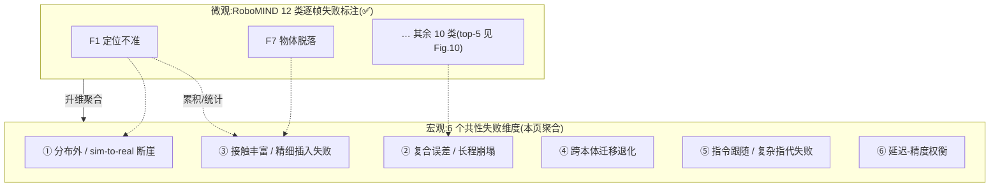

# VLA 共性失败模式与瓶颈专题(失败显微镜)

> [← 返回主报告](../index.md)

这是一页**横切分析页**:它不复述任何单模型的架构细节(那些一律"详见 xx.md"),而是把散落在各篇细读"局限/争议/存疑"节里的失败现象,**升维聚合**成 6 个共性失败维度。每个维度给出:**现象 | 证据(哪个模型、在哪报了什么,带 ⚠️/✅)| 根因 | 现有缓解手段 | 相关细读**。

**读法约定(承本站体例)**:
- ⚠️ = 厂商/作者自评数字;✅ = 经核查或基准维护方统一评测;**待核** = 一手未给定量。
- 本页**只做聚合 + 交叉引用**,所有数字都能在已读源文件中找到出处;源文件没有的,标"待核",不编。

---

## 0. 全局视角:失败的两个观测尺度

VLA 的"失败"可以在两个尺度上观测,本页的核心方法论就是把它们对接起来:

- **微观尺度(逐帧标注)**:[RoboMIND](data-processing.md) 在数据质检阶段定义了 **12 类预定义失败模式**(twelve predefined failure modes,如 **F1 Inaccurate Positioning 定位不准**、**F7 Object Detachment 物体脱落**;top-5 在论文 Figure 10 可视化;VLA 讨论中有时归并为 9 类)。✅ 这是对"一条轨迹具体哪一帧、哪个动作出错"的细粒度登记。
  - ⚠️ 重要澄清(来自 [data-processing.md](data-processing.md)):网传"8 类失败标准"**有误**,原文为 **12 类**;且论文正文把失败轨迹描述为**质检中识别→分类→登记后从训练集过滤剔除**,"失败反思提升下游策略"主要是摘要/项目页卖点,**无对照实验、无第三方复现**。
- **宏观尺度(成功率断崖)**:各模型细读页的"局限"节报告的是**整段任务在某种分布偏移下成功率塌掉多少**——这是微观失败在统计上的累积表现。

> 桥接逻辑:宏观"成功率掉了"几乎总能拆解为微观若干类失败模式的密集发生。例如**接触丰富插入失败(维度③)**在微观上主要表现为 F1 定位不准 + F7 物体脱落;**长程崩塌(维度②)**是单帧小误差(F1 等)沿时间轴累积放大。RoboMIND 的 12 类标注,正是给"为什么这个维度会掉点"提供可登记、可统计的微观词汇表。

---

## 维度① 分布外 / sim-to-real 断崖

**现象**:一旦评测分布偏离训练分布(换背景/光照/杂物/桌高、或从仿真跨到真机),成功率从"接近饱和"断崖式下跌。这是 VLA 最普遍、最被低估的失败。

**证据**:

| 模型/基准 | 报告了什么 | 口径 | 源文件 |
|---|---|---|---|
| RoboTwin 2.0(域随机化前后) | π0:Easy 64.9% → Hard(五轴域随机化)24.6%,**相对掉点 ~62%**;RDT ~59%;DP3 ~93%;DP ~96% | ⚠️ 提出方自评,13 任务抽样均 | [benchmarks.md §6.2](benchmarks.md) |
| RoboTwin CVPR'25 挑战赛 | **仿真冠军 ~98.7% vs 真机最佳仅 26.4/100** —— sim 高分 ≠ 真机可用 | ✅ 核查确认(两者标度不同,差距定性) | [benchmarks.md §6.3](benchmarks.md) |
| OpenVLA | WidowX/Bridge 上社区在 SimplerEnv 复现成功率**几近为零**;"泛化对评测分布高度敏感" | ✅ 社区复现 vs ⚠️ 作者自评的张力 | [openvla.md](openvla.md) |
| π0(SimplerEnv 自评) | 71.4%/68.4% 自评**至今无严格第三方同口径复现**;第三方 WidowX-Bridge 聚合口径仅 ~40.1% | ⚠️ PI 自评 / 待核 | [benchmarks.md §1.5](benchmarks.md) |
| π0.5 | "全新住宅"虽不在训练集,但仍属常见家居分布,与"任意开放世界"有距离;OOD 物体类别语言跟随依赖网络数据 | ⚠️ PI 自评 | [pi05.md §5](pi05.md) |
| Gemini Robotics | 整体真机 zero-shot 约 25%(折裙 zero-shot 为 0%) | ⚠️ 厂商自评 | [gemini-robotics.md §6](gemini-robotics.md) |

**根因**:纯模仿学习只拟合了训练分布的条件动作分布;视觉编码器对背景/光照/纹理的虚假相关(spurious correlation)敏感;仿真渲染与物理与真机存在 gap。主报告把"纯模仿学习、靠堆数据、真机长尾失败难解"列为第 3/4 阶段的共同遗留问题(见 [主报告 §架构演进表](../index.md))。

**现有缓解手段**:
- **域随机化 / 大规模多环境数据**:π0.5 把采集地点从 3 处扩到 104 处(约 100 环境、400 小时),用环境数量规模化逼近"把测试住宅放进训练集"的作弊上界(详见 [pi05.md](pi05.md))。
- **异构 co-training 注入语义广度**:网络多模态数据主要改善**物体层面 OOD 泛化**(π0.5 消融:去掉网络数据→OOD 物体语言跟随显著受损)。
- **3D 显式表征**:RoboTwin 挑战赛冠军方案均强调 3D 表征优于纯 2D VLA(详见 [benchmarks.md §6.3](benchmarks.md))。
- ⚠️ **评测方法论警示**:LIBERO 95%+ 不等于泛化能力;读任何成绩表先看 setting 列(详见 [benchmarks.md §10 灵魂章节](benchmarks.md))。

---

## 维度② 复合误差与长程任务崩塌

**现象**:单步动作的小误差沿时间轴累积放大,导致 10–15 分钟级、多阶段长程任务无法稳定完成;长程任务普遍只能用"任务进度(task progress)"而非二元成功率度量——意味着**部分任务根本没做完**。

**证据**:

| 模型 | 报告了什么 | 口径 | 源文件 |
|---|---|---|---|
| CogACT | 长程组合任务 Open Top Drawer & Place Apple 仅 ~50%,远低于单步抓取(Pick Coke Can 91.3%);"认知-动作拆分并未自动解决长程规划" | ✅ 论文 Table 1 口径(74.8% VM 已核) | [cogact.md §5](cogact.md) |
| π0.5 | 10–15 分钟多阶段任务以 task progress 度量,**离"稳定可用"仍有差距** | ⚠️ PI 自评 | [pi05.md §5](pi05.md) |
| π0.7 | 未见任务/未见本体成功率约 **60–80%**,显著低于已见任务(>90%),"对生产级自主性偏薄" | ⚠️ PI 自评 | [pi07.md §5](pi07.md) |
| WALL-OSS / Wall-OSS-0.5 | 长程任务(Set-Table / Tidy-Bedroom / 17 任务零样本套件)用 task-progress(>80)度量,部分任务未必完全做完 | ⚠️ 厂商自评 | [wall-oss.md §5](wall-oss.md) |
| 移动操作基准 | 长程成功率被"导航失败 × 操作失败"**连乘**拉低 | ⚠️/✅ | [benchmarks.md §6.4](benchmarks.md) |

**微观桥接**:长程崩塌在 RoboMIND 词汇里是**单帧失败(尤以 F1 定位不准为代表)沿链式子任务逐段累积**;每个子任务的小偏差成为下一子任务的劣化初始条件。

**根因**:开环/半开环的动作分块执行缺乏闭环纠错;纯模仿学习未显式建模"从错误中恢复";长程任务需要高层规划与底层控制协调,任一层抖动都会传导。

**现有缓解手段**:
- **动作分块(action chunking)**:一次预测一段未来动作,平滑轨迹、缓解逐步重规划的抖动(OpenVLA-OFT 的 chunking、CogACT 的 16 步 chunk + 自适应动作集成 AAE;详见 [openvla-oft.md](openvla-oft.md)、[cogact.md](cogact.md))。
- **分层高层子任务**:π0.5 用语言子任务作语义中介把长程指令分解为短子任务;Gemini Robotics 1.5 的"先想后做"(详见 [pi05.md](pi05.md)、[gemini-robotics.md §4](gemini-robotics.md))。
- **从经验学习的真机 RL**:π*0.6 的 RECAP 在最难长程任务上"吞吐翻倍、失败率约减半"(⚠️ 自评,增益集中于最难任务;见 [主报告 §前沿](../index.md))。
- **人在环 coaching**:π0.7 未见长程任务纯零样本约 5%,逐步语言 coaching 后升至约 95%(⚠️ 见维度⑤,[pi07.md §3.4](pi07.md))。

---

## 维度③ 接触丰富 / 精细插入失败

**现象**:需要精细力位配合的接触丰富(contact-rich)任务——插入、舀取、对位——是 VLA 的硬骨头,失败常表现为"插入过深""定位差几毫米""物体在夹爪里滑脱"。

**证据**:

| 模型 | 报告了什么 | 口径 | 源文件 |
|---|---|---|---|
| OpenVLA-OFT+ vs π0 | 勺子舀取、脆饼**插入**等高精度任务:带 L1 的 OFT+ 做到 **100%**;而采用扩散的 **π0 因"插入过深(inserting too deep)"失败** | ✅ 论文实验(真机+仿真) | [openvla-oft.md §4](openvla-oft.md) |
| CogACT | 离散化的"精度天花板"是其反叛离散范式的动机之一;接触丰富/双臂/灵巧操作覆盖有限(数据仍局限 OXE 桌面单臂子集) | ⚠️ 作者论证 | [cogact.md §1, §5](cogact.md) |
| Gemini Robotics | Gemini 2.0 在像素级数值预测(bbox/point)上不够,**直接影响精细操作**;fine-grained 精度天花板 | ⚠️ 厂商自评 | [gemini-robotics.md §6](gemini-robotics.md) |
| RoboMIND(微观) | **F1 定位不准、F7 物体脱落** 正是接触/插入失败的逐帧表现 | ✅ 核查 | [data-processing.md §2.1](data-processing.md) |

**微观桥接**:本维度是 RoboMIND 12 类标注**对接最直接**的维度——一次失败的插入在逐帧上就是 F1(定位偏差)叠加 F7(接触瞬间脱落/打滑)。

**根因**:动作离散化的量化误差在毫米级精度上被放大(RT-2/OpenVLA 离散 256-bin 的"离散化天花板",详见 [openvla-oft.md §2.3](openvla-oft.md));纯视觉无力反馈,缺乏接触时刻的闭环力控;多模态动作分布在接触相被"平均"成不可行折中。

**现有缓解手段**:
- **连续动作表示**:去掉 256-bin 离散化,改 L1 回归 / 流匹配 / 扩散直接建模连续动作(OpenVLA-OFT 的 L1、π0/π0.5 的流匹配、CogACT 的 DiT 扩散;详见各页)。
- ⚠️ **重要 hedge**(来自 [openvla-oft.md §5](openvla-oft.md)):"L1 在插入类任务打平/超过扩散"**不能外推为"L1 普遍优于扩散"**——结论限定在该任务与微调设定下;高度多模态分布上扩散仍可能占优。引用时不可越界成"扩散无用"。

---

## 维度④ 跨本体迁移退化

**现象**:在一种机器人本体上训练的策略迁到另一本体时性能退化;真正的零样本跨本体迁移仍是少数声明,且多为厂商自评、依赖目标域少量数据或带引导配置。

**证据**:

| 模型 | 报告了什么 | 口径 | 源文件 |
|---|---|---|---|
| Gemini Robotics(2025.03) | Apollo / Franka 跨本体**都需少量目标域数据**,无 zero-shot cross-embodiment 证据;Franka in-distribution 平均仅 63% | ⚠️ 厂商自评 | [gemini-robotics.md §6, §3](gemini-robotics.md) |
| GR00T N1 | 跨本体靠"相对末端执行器动作空间 + 具身感知编码器"做"尽力而为"的统一;合成数据/潜动作-IDM 标注质量会传导到策略 | ⚠️ NVIDIA 自评 | [groot-n1.md §5, §2.3](groot-n1.md) |
| GR00T N1.5→Unitree G1 | 后训练迁移(1000 条遥操作):熟悉物体 **98.8%**(vs N1 44.0%),新物体 84.2% —— 即**仍需目标本体后训练数据** | ⚠️ NVIDIA 自评 | [groot-n1.md 表2](groot-n1.md) |
| π0.7(最强卖点) | 零样本迁移到从未采数的双臂 UR5e 叠衬衫:success 80% / progress 85.6%。但 ⚠️(a) 是在**带视觉子目标 GC 引导**配置下,非纯端到端零样本;(b) trial 样本量正文未披露,无法做显著性核验 | ⚠️ PI 自评 | [pi07.md §3.2](pi07.md) |

**根因**:不同本体的观测视角、自由度、动作空间、动力学各异;统一动作空间(相对末端位姿)只能"尽力对齐";无动作视频/合成数据的伪标注引入噪声。

**现有缓解手段**:
- **相对末端执行器动作空间 + 每本体 MLP 编码器**(GR00T N1;详见 [groot-n1.md §2.3](groot-n1.md))。
- **跨本体 co-training**:π0.5 消融显示**去掉跨本体数据(ME/CE)→ 大幅退化,两者皆去最严重**——跨本体/多环境数据是泛化支柱(详见 [pi05.md §4](pi05.md))。
- **Motion Transfer**(Gemini Robotics 1.5,2025.09)宣称改善跨本体,但仍是厂商口径、⚠️ 缺公开论文级量化复核(详见 [gemini-robotics.md §4](gemini-robotics.md))。

---

## 维度⑤ 指令跟随 / 复杂指代失败

**现象**:模型忽略语言指令、走视觉捷径;对描述性属性、复杂指代("拿最大的碗""我喝汤会用的物体")、反直觉/打破数据集偏置的指令尤其脆弱;未见长程指令直接命令会失败。

**证据**:

| 模型 | 报告了什么 | 口径 | 源文件 |
|---|---|---|---|
| OpenVLA-OFT(多相机) | 多相机视角带来更多**虚假相关**,模型容易**忽略语言指令**,需 FiLM 把语言注入视觉特征纠正(仅真实 ALOHA 启用) | ✅ 论文设计动机 | [openvla-oft.md §2.5](openvla-oft.md) |
| Gemini Robotics vs 基线 | 语言可操控性 Pick/Pick-and-Place ~94%/~80%,而**基线仅 ~20–30%**;π0 复现版"描述性属性失败",多任务扩散"直接崩" | ⚠️ 厂商自评 | [gemini-robotics.md §3](gemini-robotics.md) |
| π0.7 | 复杂指代指令(Fig.10)、打破数据集偏置(Fig.11,如反向流程)显著更好,且视觉子目标对成功"critical";但逐场景百分比**待核** | ⚠️ PI 自评 | [pi07.md §3.3](pi07.md) |
| π0.7(coaching 依赖) | air fryer 装红薯纯零样本约 **5%**,逐步语言 coaching 后约 **95%**;直接命令未见长程任务**会失败,必须 coaching** | ⚠️ PI 自评(CTOL 报道) | [pi07.md §3.4](pi07.md) |
| π0.5 | 去掉网络数据(WD)→ OOD 物体类别语言跟随显著受损;去口头指令(VI)显著掉点 | ⚠️ PI 自评 | [pi05.md §4](pi05.md) |
| WALL-OSS | 基线 Qwen2.5-VL-3B 物体定位(Object Grounding)仅 **46.1%**,揭示 VLM 的具身空间 grounding 短板(具身 VQA co-train 后→91.6%) | ⚠️ 厂商自评 | [wall-oss.md §1, §4](wall-oss.md) |

**微观桥接**:指令跟随失败常先表现为"看错地方/抓错物体",在逐帧上对应 **F1 定位不准**(grounding 到错误目标)。

**根因**:视觉捷径学习(shortcut learning)——模型靠背景/位置统计而非语言决定动作;VLM 预训练分布缺乏具身空间 grounding(WALL-OSS 诊断的"预训练分布鸿沟");复杂指代需要的语义推理超出动作头能力。

**现有缓解手段**:
- **FiLM 语言调制**(OpenVLA-OFT+,把语言注入视觉特征;详见 [openvla-oft.md §2.5](openvla-oft.md))。
- **具身 VQA co-training**(WALL-OSS:物体定位 46.1%→91.6%;详见 [wall-oss.md](wall-oss.md))。
- **语言子任务 / 视觉子目标作语义中介**(π0.5 高层子任务、π0.7 富上下文条件化与视觉子目标;详见 [pi05.md](pi05.md)、[pi07.md](pi07.md))。
- **不喂本体状态以避免捷径**:原始 OpenVLA 故意不喂 $\mathbf{q}_t$ 以防止对本体状态的捷径依赖(对照取舍见 [openvla-oft.md §2.5](openvla-oft.md))。

---

## 维度⑥ 延迟-精度权衡

**现象**:带来语义泛化的大 VLM 推理慢(秒级/十 Hz 级),而灵巧控制需要高频(50–120 Hz);连续动作的多步去噪、自回归逐 token 解码都是延迟来源。"想得对"与"动得快"天然冲突。

**证据**:

| 模型 | 报告了什么 | 口径 | 源文件 |
|---|---|---|---|
| OpenVLA(原始) | 自回归逐 token 解码:A100 上仅 **4.2 Hz**、单次延迟 ~0.24s,"对高频闭环几乎不可用" | ✅ 论文实测 | [openvla-oft.md §1, §4](openvla-oft.md) |
| OpenVLA-OFT | 并行解码 + 分块把吞吐拉到 **108.8 Hz(~26×)**、延迟降 ~3×;代价是放弃自回归逐步条件化(强时序/多模态轨迹上是否总最优待验证) | ✅ 论文 Table I/II | [openvla-oft.md §4, §5](openvla-oft.md) |
| 扩散/流匹配去噪 | 扩散动作头需 50 步去噪(Cont-Diffusion),是硬开销;GR00T N1 用流匹配但需多步欧拉积分(K=4)——比一次前向仍有额外开销 | ✅/⚠️ | [openvla-oft.md §2.4](openvla-oft.md)、[groot-n1.md §5](groot-n1.md) |
| Gemini Robotics | 云-端拆分把端到端压到 ~250ms / 等效 50Hz,但**结构性依赖云端**,对网络延迟/上游可用性敏感 | ⚠️ 厂商自评 | [gemini-robotics.md §2.2, §6](gemini-robotics.md) |
| CogACT | 7B 认知模块推理算力/延迟仍重;DiT 用 DDIM 10 步,但多步去噪相比单次前向仍有额外开销 | ✅ 论文 | [cogact.md §5](cogact.md) |
| π0.7 | 视觉子目标生成需多张 H100、每张约 1.25s 级延迟(world model 由 14B BAGEL 初始化);最坏推理延迟百毫秒级,更偏实验室/高价值流程 | ⚠️ PI 自评 | [pi07.md §5](pi07.md) |

**根因**:VLM 体量与连续动作生成的迭代采样,与高频闭环控制的实时性目标直接冲突。

**现有缓解手段**:
- **并行解码 + 动作分块**(OpenVLA-OFT:把 D 次串行前向压成 1 次;详见 [openvla-oft.md §2.1–2.2](openvla-oft.md))。
- **双系统/分层解耦**:慢 VLM(System 2,~10Hz)+ 快动作头(System 1,~120Hz),GR00T N1 用交叉注意力桥接(详见 [groot-n1.md](groot-n1.md))。
- **云-端推理拆分 + 异步 chunk**(Gemini Robotics,详见 [gemini-robotics.md §2.2](gemini-robotics.md))。
- **少步采样**:DDIM 10 步(CogACT)、欧拉积分 K=4 步(GR00T N1)、L1 单次回归(OpenVLA-OFT)。
- ⚠️ 主报告把"并行解码/频域分词提速、离散+连续融合"列为第 3 阶段(双系统/分层 + 效率)的主线(见 [主报告 §架构演进表](../index.md))。

---

## 1. 六维 × 缓解手段对照速查

| 维度 | 微观对应(RoboMIND) | 最强证据(口径) | 主缓解路线 |
|---|---|---|---|
| ① 分布外 / sim-to-real | F1 等多类密集发生 | RoboTwin sim 98.7% vs 真机 26.4/100 ✅ | 域随机化 + 多环境/异构数据 + 3D 表征 |
| ② 复合误差 / 长程崩塌 | F1 沿链累积 | CogACT 长程 ~50% vs 单步 91.3% ✅ | 动作分块 + 分层子任务 + 真机 RL + coaching |
| ③ 接触丰富 / 精细插入 | F1 定位不准 + F7 脱落 | π0 "插入过深"失败 vs OFT+ 100% ✅ | 连续动作表示(L1/流匹配/扩散) |
| ④ 跨本体迁移退化 | —(分布层面) | Gemini Apollo/Franka 需目标域数据 ⚠️ | 相对末端动作空间 + 跨本体 co-train |
| ⑤ 指令跟随 / 复杂指代 | F1 grounding 到错目标 | OpenVLA-OFT 多相机忽略语言 ✅ | FiLM + 具身 VQA + 语言子目标 |
| ⑥ 延迟-精度权衡 | —(系统层面) | OpenVLA 4.2Hz→OFT 108.8Hz ✅ | 并行解码 + 双系统 + 云端拆分 + 少步采样 |

---

## 2. 横切观察:三条贯穿全部维度的元问题

1. **纯模仿学习的天花板**:维度 ①②④ 的根因都指向"只拟合训练分布、不会从交互/错误中自我修正"。主报告把这列为第 3/4 阶段共同遗留问题;π*0.6 的真机 RL(RECAP)是当前最明确的攻关方向(⚠️ 自评,增益集中于最难任务;见 [主报告 §前沿](../index.md))。
2. **证据几乎全是厂商自评**:六个维度里跨本体(④)、长程(②)、延迟(⑥)的最响亮声明大多 ⚠️ 厂商自评、无第三方复现;**唯一**带 ✅ 同口径外部锚点的是 RoboTwin 挑战赛(①)、RoboCasa 官方 multitask、OpenVLA-OFT 论文实验(③⑥)。主报告 §6.2 仍把"前沿 VLA 的实时延迟、安全对齐、sim-to-real 量化"列为待补缺口(见 [主报告 §6](../index.md))。
3. **口径陷阱会掩盖失败**:LIBERO 95%+ 不等于泛化;同一模型不同 setting 分数差数十个百分点(如 GR00T N1.5 RoboCasa 30-demo 47.5% vs 300-task multitask 20.0%)。**读"成功率"前必须先读 setting**(详见 [benchmarks.md §10 灵魂章节](benchmarks.md))。

---

## 来源(本页所用关键事实的出处)

本页**不引入任何新数字**,全部聚合自以下已读源文件;每条证据已在对应表格行内标注来源:

- **RoboMIND 12 类失败模式 + 三步 QA + "8 类"证伪**:[data-processing.md §2.1](data-processing.md)
- **分布外/sim-to-real 断崖**(RoboTwin 2.0 域随机化、CVPR'25 挑战赛 sim vs 真机、口径警告):[benchmarks.md §6.2/§6.3/§10](benchmarks.md);OpenVLA 分布敏感:[openvla.md](openvla.md)
- **长程崩塌**:[cogact.md §5](cogact.md)、[pi05.md §5](pi05.md)、[pi07.md §5](pi07.md)、[wall-oss.md §5](wall-oss.md)、[benchmarks.md §6.4](benchmarks.md)
- **接触丰富/插入失败**(π0 插入过深 vs OFT+ 100%):[openvla-oft.md §4](openvla-oft.md);精度天花板:[cogact.md](cogact.md)、[gemini-robotics.md §6](gemini-robotics.md)
- **跨本体退化**:[gemini-robotics.md §6/§4](gemini-robotics.md)、[groot-n1.md §5/表2](groot-n1.md)、[pi07.md §3.2](pi07.md)、[pi05.md §4](pi05.md)
- **指令跟随/复杂指代**:[openvla-oft.md §2.5](openvla-oft.md)、[gemini-robotics.md §3](gemini-robotics.md)、[pi07.md §3.3/§3.4](pi07.md)、[pi05.md §4](pi05.md)、[wall-oss.md §1/§4](wall-oss.md)
- **延迟-精度权衡**:[openvla-oft.md §1/§2/§4/§5](openvla-oft.md)、[groot-n1.md](groot-n1.md)、[gemini-robotics.md §2.2](gemini-robotics.md)、[cogact.md §5](cogact.md)、[pi07.md §5](pi07.md)
- **元问题/遗留缺口**:[主报告 §架构演进表 + §6 核查与局限](../index.md)
