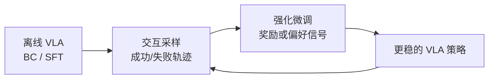

# FORCE:高效 VLA 强化微调的后训练框架

> **arXiv**: [2606.26006](https://arxiv.org/abs/2606.26006)(*FORCE: Efficient VLA Reinforcement Fine-Tuning*) | **时间**: 2026.06 | **路线**: VLA · 在线 RL / 后训练
> [← 返回 VLA 总览](/vla/) · [VLA 在线 RL](/vla/papers/rl-token)

## TL;DR

FORCE 把 VLA 的问题从“先用离线演示学会大概怎么做”推进到“上线后怎样用强化信号继续变强”。它关注的是 **reinforcement fine-tuning** 的效率:如何在真实或仿真交互成本很高的前提下,让 VLA 从失败、成功和奖励中继续更新。

这条线和本站已收录的 [SimpleVLA-RL](simplevla-rl)、[OmniVLA-RL](omnivla-rl)、[π0.6 / π*0.6](pi06) 属同一大主题:模仿学习不是终点,VLA 必须进入后训练和经验学习阶段。

## 问题

纯 BC / SFT 风格的 VLA 容易卡在演示分布里:看起来能复现,但一旦遇到偏移、接触误差或长程任务,错误会滚雪球。RL 可以补这件事,但机器人 RL 有三个硬约束:

- 交互样本贵,不能像游戏环境一样无限 roll out。
- 大模型动作策略更新不稳定,微调过猛会破坏原有知识。
- 成功奖励稀疏,长程任务 credit assignment 难。

FORCE 的价值就在于把“VLA 怎么做 RL 微调”从概念推进到更工程化的训练框架。

## 方法位置

本站归类为 **新范式探索 / 在线 RL 后训练**。它不是一个新的动作编码器,而是把 VLA 的训练阶段往 deployment feedback 推进。

## 谱系位置

- 与 [SimpleVLA-RL](simplevla-rl):同属 RL 后训练,FORCE 更强调高效 fine-tuning 框架。
- 与 [OmniVLA-RL](omnivla-rl):OmniVLA-RL 把 MoT 专家结构与在线 RL 绑定;FORCE 更像可迁移的 RL 微调 recipe。
- 与 [π0.6 / π*0.6](pi06):π 系通过 RECAP 真机经验让策略变强;FORCE 可看作同一趋势下的开放研究版本。

## 局限与待核

- 强化微调的优势高度依赖环境、奖励设计和初始策略质量;跨任务泛化不能只看单一 benchmark。
- 若没有充分安全约束,在线探索可能带来硬件风险。
- 预印本结果均按作者自评处理,需要关注是否开源训练代码、rollout 设置和奖励实现。

## 来源

- arXiv:[2606.26006](https://arxiv.org/abs/2606.26006) *FORCE: Efficient VLA Reinforcement Fine-Tuning*.

