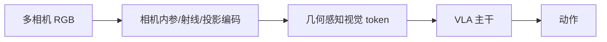

# G³VLA:给多视角 VLA 注入相机几何归纳偏置

> **arXiv**: [2606.24472](https://arxiv.org/abs/2606.24472) | **时间**: 2026.06 | **路线**: VLA · 空间理解 / 多视角几何
> [← 返回 VLA 总览](/vla/) · [SpatialVLA](spatialvla)

## TL;DR

很多多相机 VLA 名义上有多视角,实际仍把每个视角当普通 2D 图片 token 处理。G³VLA 的出发点是:机器人相机不是互联网图片,每个像素背后都有相机内参、射线方向和跨视角投影关系。把这些几何信息显式喂给 VLA,模型才更容易理解 3D 空间和物体位置。

它是 [SpatialVLA](spatialvla) 之后,VLA 空间归纳偏置线上的重要新样本。

## 方法要点

G³VLA 重点加入三类几何机制:

- **intrinsic-conditioned ray embedding**:把相机内参与像素射线编码进视觉 token。
- **projective positional encoding**:让不同视角 token 的位置编码与几何投影关系相关。
- **cross-view fusion**:跨视角融合不只靠注意力自己猜,而是有几何先验引导。

## 谱系位置

- 与 [SpatialVLA](spatialvla):SpatialVLA 强调 3D/空间位置编码;G³VLA 专门打多相机几何。
- 与 [PointACT](pointact):PointACT 直接上 3D 点云专家;G³VLA 仍留在图像 token 路线,但给 token 加相机几何。
- 与 [GR00T N1](groot-n1) / [π0.5](pi05):论文把几何模块接入多种 VLA 骨干,说明它更像可插拔 inductive bias。

## 局限与待核

- 依赖准确相机标定;标定误差可能伤害效果。
- 几何 bias 对强视觉主干的边际收益需要看跨数据集、跨本体复现。
- 作者自评包含多个 benchmark,横向比较需核对各骨干训练预算。

## 来源

- arXiv:[2606.24472](https://arxiv.org/abs/2606.24472).

