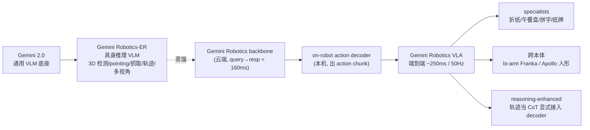
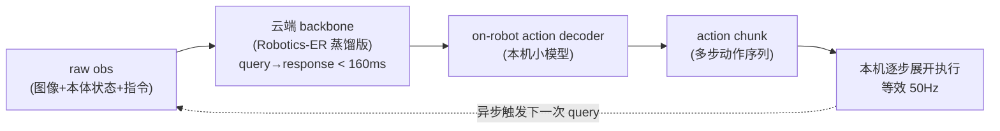

# Gemini Robotics 细粒度解读

> **arXiv**: 2503.20020 · Google DeepMind · 2025.03(后续 Gemini Robotics 1.5 / ER 1.5,2025.09) · **路线**:云端 backbone + 本机 decoder 双系统 VLA
> [← 返回主报告](../index.md)

## TL;DR
Gemini Robotics 把一个前沿通用 VLM(Gemini 2.0)直接改造成机器人基座,但它真正的工程贡献**不是更大的模型,而是一套"云-端推理拆分"的部署架构**:云端跑蒸馏后的 Gemini Robotics backbone(query-to-response 从"秒级"压到 < 160 ms),机器人本机跑一个小型 action decoder,端到端从原始观测到动作 chunk 约 **250 ms**,chunk 内部多步展开后等效控制频率 **50 Hz**——这是 VLA 路线第一次具备和经典 diffusion policy 同台打灵巧操作的延迟本钱。与 VLA 配套的是 **Gemini Robotics-ER**(embodied reasoning VLM),它把 3D 检测、pointing、抓取、轨迹这些"具身推理中间表征"显式拉成一层能力,既能 zero-shot/few-shot 直接控制机器人,又能作为中间信号反过来增强 VLA 的 OOD 泛化。模型在 ALOHA 2 双臂上做折纸、装午餐盒等长时序灵巧任务,并能少量数据迁移到 bi-arm Franka 与 Apptronik Apollo 人形。半年后的 **Gemini Robotics 1.5 / ER 1.5(2025.09)** 进一步把这条线推成"ER 1.5 当大脑做多步规划、调工具、VLA 1.5 边想边做"的 agentic 双模型栈,并强调 Motion Transfer 跨本体迁移。

## 1. 要解决的问题
RT-2 证明了"网络语义知识可迁移到端到端控制",但它留下了两个硬伤:**(1) 推理延迟**——55B PaLI-X 只有 1–3 Hz,必须联网查询多 TPU 云服务,根本撑不起接触丰富的高频灵巧操作;**(2) 离散自回归动作**精度与频率都有天花板。Gemini Robotics 想回答的核心问题是:**怎样既保留前沿 VLM 的世界知识与泛化,又把它压进一个能在真机上做双臂灵巧操作的实时控制回路?**

它给出的不是"换个动作表征"这种局部修补,而是一套系统级答案:

- **延迟层面**:把模型物理上拆成"重而慢的云端语义 backbone"与"轻而快的本机动作 decoder",用蒸馏 + chunk 异步把端到端延迟压到 250 ms / 50 Hz。
- **能力层面**:把"具身推理(embodied reasoning)"单独提炼成一个 VLM(Gemini Robotics-ER),让感知/空间理解/抓取/轨迹这些中间表征显式可用、可评测、可被下游 VLA 复用——而不是像 RT-2 那样把一切都黑箱进自回归 token。

## 2. 方法与架构

### 2.0 整体家族

全家族建立在 **Gemini 2.0** 之上,机器人能力直接吃 Gemini 2.0 的视觉 encoder、语言指令理解与 CoT 推理红利。训练分两阶段:先做机器人专用训练(embodied reasoning + 多样化机器人动作)产出 Robotics-ER 与 Gemini Robotics;再做可选适配阶段产出 specialists、新本体策略与 reasoning 增强变体。

### 2.1 Gemini Robotics-ER:把"具身推理"做成一层显式能力

Robotics-ER 是 **Gemini 2.0 Flash 的机器人增强版**,在一组具身推理任务上做 SFT,本身**不直接出动作**,而是输出一组可被下游消费的中间表征:

- 开放词汇 **2D 物体检测**;
- **2D pointing**(物体部件、自由空间、可供性 affordance);
- **2D 轨迹预测**、**自上而下抓取(top-down grasp)预测**;
- **多视角对应(multi-view correspondence)**;
- 从单目图像得到的**度量 3D bounding box** 检测。

它有两种直接控制机器人的方式,都不需要额外训练动作头:

- **zero-shot code generation**:Gemini 2.0 调用机器人 API(`detect_object`、`get_grasp_pose`、`move_gripper` 等),从图像迭代式重新规划;
- **few-shot ICL**:把 10 条遥操作演示编码成"关键点 + 位姿"文本喂进上下文。

在 ALOHA 2 上,ICL(10 demo)把实机平均成功率从 zero-shot 的 25% 拉到 **65%**。这层能力的意义在于:它把"先感知/推理、后控制"的经典两段式系统压进同一个模型,但保留了中间可解释性(轨迹、抓取点都能可视化)。

### 2.2 Gemini Robotics VLA:云-端延迟拆分(主线)

这是全文最该被记住的设计。VLA 不是把 Robotics-ER 直接接个动作头那么简单,而是做了**物理上的推理拆分**:

- **云端 backbone**:Gemini Robotics-ER 的**蒸馏版**,承载世界知识与语义理解,但被压缩到 query-to-response **< 160 ms**(原始前沿 VLM 是"秒级")。
- **本机 action decoder**:一个跑在机器人计算机上的**小模型**,负责把 backbone 的语义输出解成低层动作。
- **action chunk + 异步**:backbone 一次返回的不是单步动作而是一段 **action chunk**,本机逐步展开执行的同时异步发起下一次 query,从而把"等效控制频率"撑到 **50 Hz**,而端到端 raw obs → action chunk 延迟约 **250 ms**。

正是这个拆分让 VLA 第一次能和 ALOHA Unleashed 风格的 diffusion policy 在灵巧任务上同台竞争。代价是结构性地依赖云端可用性与网络延迟(见局限)。

### 2.3 reasoning-enhanced 变体:把 ER 中间表征接回动作

作者还做了一个关键消融方向:**把 Robotics-ER 的中间产物(尤其是轨迹)显式当成"内部 chain-of-thought"接到 action decoder**。做法是 re-label 动作数据,让模型先预测轨迹再出动作。结果在单步推理 / 语义 / 空间类 OOD 任务上显著超过 vanilla VLA(例如 "matching pile" 0.79 vs 0.29;Bottom Left 100% vs 80%、Same Color 60% vs 27%)。这条线本质上把 "embodied reasoning 中间表征" 从一个并列能力变成了泛化的来源——也是本主线"ER 中间表征"价值的直接证据。

### 2.4 训练数据与基线
- **主数据**:约 **12 个月**的 ALOHA 2 遥操作数据("thousands of hours"),混合网页文档、代码、多模态媒体、ER/VQA 数据。
- **公平性**:所有基线都用同一份多样化混合训练。两个基线是:**π0 复现版**(在同一混合上训,优于公开 π0 release)与一个 **ALOHA Unleashed 风格的多任务 diffusion policy**。

## 3. 关键数据表

### 具身推理 / VLM 基准(⚠️ 厂商自评,2025.02 口径)

| Benchmark | Gemini 2.0 Flash | Gemini 2.0 Pro Exp | GPT-4o | Claude 3.5 Sonnet |
|---|---|---|---|---|
| ERQA(no CoT) | 46.3 | **48.3** | 47.0 | 35.5 |
| ERQA(with CoT) | 50.3 | **54.8** | 50.5 | 45.8 |
| RealworldQA(test) | 71.6 | **74.5** | 71.9 | 61.4 |
| BLINK(val) | 65.0 | **65.2** | 62.3 | 60.2 |

ERQA 是三者里最难的(作者新开源的 400 题多选 embodied reasoning benchmark,28% 多图),Gemini 2.0 Pro Exp + CoT 为 SOTA;CoT 对 Gemini 的增益(+6.5)大于 GPT-4o(+3.5)。

### Pointing / 3D 检测(Gemini Robotics-ER)

| 任务 | Robotics-ER | 对比 |
|---|---|---|
| SUN-RGBD AP@15(3D 检测,开放词表) | **48.3**(SOTA ⚠️) | 2.0 Flash 30.7;ImVoxelNet 43.7(仅 10 类简化集);Implicit3D 24.1;Total3DU 14.3 |
| 2D pointing Paco-LVIS | **71.3** | GPT-4o 16.2;Claude 3.5 12.4;Molmo-72B 47.1 |
| 2D pointing Pixmo-Point | **49.5** | GPT-4o 5.0;Molmo-72B 12.5 |
| 2D pointing Where2Place | 45.0 | Molmo-72B 63.8(此项 Molmo 反超) |

### ALOHA 2 控制(Robotics-ER,zero-shot vs ICL)

| 设置 | 模型 | Sim Avg | Real Avg |
|---|---|---|---|
| Zero-shot | 2.0 Flash | 27 | — |
| Zero-shot | Robotics-ER | **53** | **25** |
| ICL(10 demo) | 2.0 Flash | 51 | — |
| ICL(10 demo) | Robotics-ER | **65** | **65** |

### 通用 VLA 与适配关键数字(⚠️ 多为厂商自评)

| 维度 | 数值 |
|---|---|
| 云端 backbone query→response 延迟 | < 160 ms(从"秒级"压下来) |
| 端到端 raw obs → action chunk 延迟 | ≈ 250 ms |
| 等效控制频率 | 50 Hz |
| 短 horizon 20 任务 zero-shot 成功率 > 80% | 10 / 20 |
| 语言可操控性(Pick / Pick-and-Place) | ~94% / ~80%(基线仅 ~20–30%) |
| 长 horizon 午餐盒打包(specialist) | 100%(>2 分钟) |
| specialists 6 项困难任务平均 | 79% |
| 快速适应(≤ 100 demos) | 8 项中 7 项 > 70% |
| Franka 跨本体 in-distribution 平均 | 63% |
| 语义安全:对抗模式 + 机器人宪法 | baseline ≈33.6% → 约 53–81%(最佳综合 84.3%)⚠️ |
| Bias-inducing pointing 拒答率 | 20% → 96% |

**安全(ASIMOV / 机器人宪法)**:⚠️ **来源辨析(本轮对抗核查更正)**——ASIMOV-Multimodal / ASIMOV-Injury(后者基于 NEISS 真实伤害记录)两个 safety 数据集与"机器人宪法 / constitutional AI"方法,出自**配套的另一篇论文**《Generating Robot Constitutions & Benchmarks for Semantic Safety》(arXiv:2503.08663),**并非** Gemini Robotics 主 VLA 论文(2503.20020)。评测 **semantic action safety**(能否识别"准备人类食物时把沸水倒进垃圾桶"这类不可接受指令)。修正后的数值口径:正常模式 baseline 对齐准确率约 **83.6%**;**对抗 prompt 模式下无宪法 baseline 仅约 33.6%,加入机器人宪法后回升到约 53.4%–81.4%(最佳综合约 84.3%)**;RoboPAIR 提示注入子集 71.4% → 最高 100%。早期流传的"0.28 → 0.76"无法在原文中证实,已弃用。要点不变:**宪法把"被刻意诱导时仍守住安全"的对抗鲁棒性显著救回**,这比平均 accuracy 对实机部署更关键。

### 跨本体取舍(对比基线)

| 比较项 | Gemini Robotics | π0 re-impl | Multi-task diffusion |
|---|---|---|---|
| Backbone | Gemini 2.0(云 + 本机 decoder) | PaliGemma 3B | 无 VLM |
| 20 任务平均 | 显著领先,deformable 尤其强 | 简单任务可比,难任务掉队 | 难任务近 0% |
| 描述性 / 多语言指令 | 鲁棒 | 描述性属性失败 | 直接崩 |
| 从零训练(无多任务预训练) | **全部 0%** | — | — |

最后一行最值得标注:同样架构若不做多样化预训练、直接在 specialist 数据上训,**全部为 0%**——说明多样化预训练(而非模型大小)才是灵巧长时序任务可解的必要条件。

## 4. 后续:Gemini Robotics 1.5 / ER 1.5(2025.09)

2025-09-25,DeepMind 发布 **Gemini Robotics 1.5** 与 **Gemini Robotics-ER 1.5**,把本报告的"双系统"思路推成显式的 **agentic 双模型栈**:

- **ER 1.5 当"高层大脑"**:做多步任务规划与逻辑决策,**原生调用数字工具**(如 Google Search 检索信息、调用第三方用户自定义函数),为每一步给出自然语言指令;在 15 个学术基准(ERQA、Point-Bench、RefSpatial、RoboSpatial-Pointing、Where2Place 等)上号称 SOTA ⚠️,并通过 Gemini API / Google AI Studio 对开发者开放。
- **VLA 1.5 "边想边做(think before acting)"**:执行 ER 1.5 下达的子任务,但会先生成一段**内部推理序列**把复杂任务拆成可执行片段,并能用自然语言解释决策过程(可解释性)。
- **Motion Transfer 跨本体迁移**:强调只在 ALOHA 2 上见过的任务可以**直接迁移到 Apollo 人形和 bi-arm Franka,反之亦然**,无需为每种本体单独 specialize——这正是 2025.03 报告里"跨本体仍需少量目标域数据"局限的直接攻关方向。
- 发布口径:Gemini Robotics 1.5 当前仅对 trusted tester / 部分合作伙伴开放;ER 1.5 已对开发者开放。

可以把 1.5 看成对原报告主线的两点强化:**(1)** 把 ER 从"被 VLA 蒸馏/复用的中间表征"提升为一个能独立规划、调工具的 agent 大脑;**(2)** 把"reasoning-enhanced 变体"里的"轨迹当 CoT"泛化成 VLA 的常态化"先想后做"。

## 5. 与同类对比 / 在 VLA 谱系中的位置

| | RT-2 | π0 系 | Gemini Robotics |
|---|---|---|---|
| 动作表征 | 离散 token 自回归 | flow matching / 扩散连续动作 | 本机 decoder 出 action chunk |
| 部署 | 单模型云端联网,1–5 Hz | 本地 action expert,高频 | **云 backbone + 本机 decoder,250ms / 50Hz** |
| 中间表征 | 黑箱 token | 黑箱 action expert | **显式 embodied reasoning(ER)** |
| 泛化来源 | co-fine-tune 网络数据 | 多样化机器人数据 | Gemini 2.0 红利 + ER 中间表征 + 多样化数据 |

Gemini Robotics 的两条独特主线——**云-端延迟拆分**与**显式 embodied reasoning 中间表征**——在 RT-2(纯离散 token、黑箱、低频)和 π0(连续动作、黑箱、本地)之外开了第三条路:不纠结于"动作怎么 token 化",而是从**系统部署**和**中间表征可复用性**两个维度重新组织 VLA。后续 Physical Intelligence、BitRobot 等的工程跟进印证了"延迟拆分将成为 VLA 默认范式"这一判断。

## 6. 局限与争议
- **结构性依赖云端**:单一 cloud backbone 意味着对网络延迟和上游可用性敏感;250 ms 端到端虽能撑 50 Hz,但相对纯本地策略仍是结构性瓶颈。
- **真机 zero-shot 仍偏低**:整体真实世界 zero-shot 约 25%,折裙 zero-shot 为 0%,必须靠 ICL 或 specialization 拉起。
- **跨本体仍是数据驱动**:2025.03 版 Apollo / Franka 都需少量目标域数据,没有 zero-shot cross-embodiment 证据;1.5 的 Motion Transfer 宣称改善,但仍是厂商口径 ⚠️,缺乏公开论文级别的量化复核。
- **fine-grained 精度天花板**:Gemini 2.0 在长视频空间关系 grounding 和像素级数值预测(bbox / point)上仍不够,直接影响精细操作。
- **安全评测停在 VQA 层**:semantic action safety 主要在文本/VQA 指令层评测,真实操作回路中的实时闭环拒绝尚未在报告中验证。
- **闭源 + 厂商自评**:主干、权重、训练数据均未开源,绝大多数关键数字为内部评测,缺乏独立第三方复核。

## 来源
- 论文:arxiv.org/abs/2503.20020(Gemini Robotics: Bringing AI into the Physical World,Google DeepMind,2025-03-25)
- 全文 HTML:arxiv.org/html/2503.20020v1
- Gemini Robotics 1.5 / ER 1.5 博客:deepmind.google/discover/blog/gemini-robotics-15-brings-ai-agents-into-the-physical-world/(2025-09-25)
- 本地一手梳理:/Users/zhuyun/Knowledge/VLA/geminirobo.md 与 /Users/zhuyun/Knowledge/wiki/entities/papers/gemini-robotics.md
