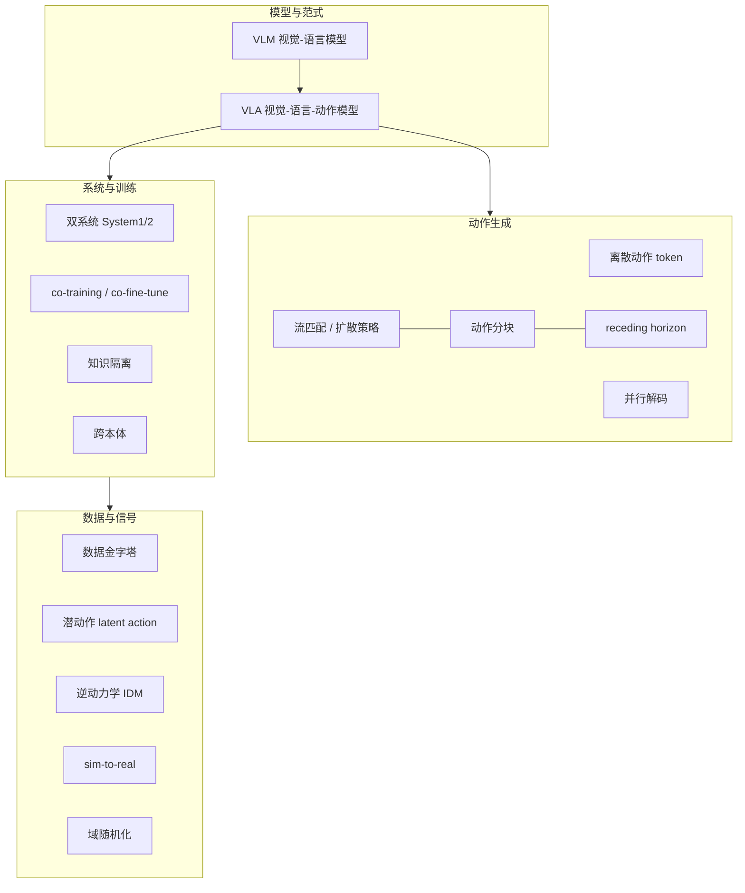

# 具身智能 / VLA 术语速查表

> [← 返回主报告](../index.md)

> **用途**:VLA(视觉-语言-动作)/具身智能高频术语的一句话速查,按主题分组。每条给出术语中英、一句话定义、出处/代表工作,并链到相关细读。
> **可信度标注**:凡标 ⚠️ 者为提出方/厂商自评数据,非同行评审或独立第三方复现,采信时请注意。
> **配套阅读**:[VLA 发展深度调研报告](../index.md) · [具身数据全景梳理](embodied-data.md)

---

## 速览:术语全景图

---

## 一、模型与范式

| 术语(中/英) | 一句话定义 | 出处 / 代表工作 | 细读 |
|---|---|---|---|
| **VLM(视觉-语言模型)** / Vision-Language Model | 在互联网图文上预训练、能理解图像+文本的多模态大模型,是 VLA 的"大脑"主干 | PaLI-X、PaliGemma、Qwen2.5-VL、Eagle、Cosmos-Reason | [主报告 §1](../index.md) |
| **VLA(视觉-语言-动作模型)** / Vision-Language-Action Model | 在 VLM 基础上增加动作输出,直接把视觉+语言指令映射为机器人动作的端到端模型 | RT-2 奠基范式;首篇综述 arXiv:2405.14093 | [RT-2 细读](rt2.md) |
| **行为克隆 / 模仿学习** / Behavior Cloning, Imitation Learning | 用专家演示(状态→动作)做监督学习,是 VLA 主流训练范式;上限受演示分布限制 | RT-1、几乎所有 VLA;突破见 π*0.6 RL | [embodied-data §6.5](embodied-data.md) |
| **涌现泛化** / Emergent Generalization | 借互联网知识 co-train 后,机器人涌现出训练动作集之外的符号理解/推理/物体泛化能力 | RT-2(RT-2-X 较 RT-2 emergent skill 约 +50% ⚠️) | [RT-2 细读](rt2.md) |
| **具身思维链 / ECoT** / Embodied Chain-of-Thought | 让 VLA 在出动作前先显式生成一段中间推理(子任务分解 / 物体定位 / 计划),把 LLM 的"想清楚再答"迁移到机器人控制;是"推理式 VLA"的统称 | ECoT(arXiv:2407.08693);π0.5 高层 FAST 子任务、WALL-OSS"统一跨层级 CoT"、Gemini Robotics 具身推理均属此类实现 | [π0.5 细读](pi05.md) · [WALL-OSS 细读](wall-oss.md) |

---

## 二、动作生成路线

VLA 的核心分歧:动作如何生成。两大主线为**离散自回归 token** vs **连续扩散/流匹配**,正走向融合。

| 术语(中/英) | 一句话定义 | 出处 / 代表工作 | 细读 |
|---|---|---|---|
| **离散动作 token** / Discrete Action Token | 把连续动作量化成离散符号(如 256-bin 均匀分箱),纳入 VLM 词表用自回归预测;简单、复用 token 机制,但精度/频率低、不支持动作分块 | RT-2、原始 OpenVLA(RT-2 仅用朴素 256-bin,**非** DCT+BPE) | [RT-2](rt2.md) · [OpenVLA](openvla.md) |
| **扩散策略** / Diffusion Policy | 用扩散模型从噪声迭代去噪生成连续动作序列,擅长多模态动作分布与灵巧控制 | Octo(transformer 扩散)、Diffusion Policy、3D Diffuser Actor | [Octo 细读](octo.md) |
| **流匹配** / Flow Matching | 学习从噪声到动作的连续速度场(向量场),少步去噪即可生成连续动作块;技术上属"扩散策略"家族,各源用词较松散 | π0、GR00T(DiT 流匹配)、Qwen-VLA(1.15B DiT) | [π0 细读](pi0.md) |
| **动作分块** / Action Chunking | 一次预测未来一段(如 50 步 / ~1 秒)动作序列而非单步,提升时序一致性与高频灵巧控制能力 | π0(一次 50 步、约 10 步去噪 → 50 Hz);ACT 提出 | [π0 细读](pi0.md) |
| **receding horizon(滚动时域 / 后退视界)** | 预测一长段动作块,但只执行前若干步即重新规划,平衡时序一致性与反应性的执行策略 | 动作分块系统的常见执行策略(MPC 思想引入 VLA) | [主报告 §3](../index.md) |
| **并行解码** / Parallel Decoding | 一次性并行生成整个动作块(而非逐 token 自回归),大幅降低延迟、提升动作生成频率 | OpenVLA-OFT(108.8 Hz vs 自回归 4.2 Hz,快 26× ⚠️) | [OpenVLA-OFT 细读](openvla-oft.md) |
| **L1 回归动作头** / L1 Regression Action Head | 用连续 L1 回归直接预测动作(非离散 token、非扩散),作者称效果可比扩散且更快 | OpenVLA-OFT(OFT 配方 = 并行解码+动作分块+连续表示+L1) | [OpenVLA-OFT 细读](openvla-oft.md) |
| **FAST 动作分词** / FAST Action Tokenizer | 用 DCT 频域压缩做动作分词,使自回归离散 VLA 也能支持高频/动作分块 | π0-FAST(arXiv:2501.09747);π0.5/WALL-OSS 高层用 FAST | [π0-FAST 细读](pi0-fast.md) |
| **混合动作生成** / Hybrid Action Generation | 同一模型高层用离散 token(语言子任务)、底层用流匹配连续块,两条路合一 | π0.5、π0.6、WALL-OSS(FAST 分支 + 流匹配分支) | [π0.5 细读](pi05.md) |
| **ActionVAE** | 用 VAE 把一个动作块压成单个连续嵌入再解码,接到视频生成基座上(第三条路) | RynnVLA-001(Chameleon 视频生成基座 + ActionVAE) | [RynnVLA 细读](rynnvla.md) |

---

## 三、系统架构

| 术语(中/英) | 一句话定义 | 出处 / 代表工作 | 细读 |
|---|---|---|---|
| **双系统 / System 1 & System 2** / Dual-System | 慢速 VLM 负责理解推理(System 2,~7–10 Hz),快速控制器负责实时连续动作(System 1,~200 Hz),分层解耦"慢推理"与"快控制" | GR00T N1、Figure Helix(7B S2 + 80M S1 @200Hz) | [GR00T N1 细读](groot-n1.md) |
| **分层 / 两级推理** / Hierarchical Reasoning | 高层生成自然语言子任务(离散),底层把子任务翻译为连续关节动作块 | π0.5(高层 FAST 子任务 + 底层流匹配 50 步块) | [π0.5 细读](pi05.md) |
| **动作专家** / Action Expert | 挂在 VLM 主干旁的独立模块(MoE 风格),专门负责连续动作生成,常梯度隔离 | π0(~300M)、π0.6(~860M) | [π0 细读](pi0.md) |
| **DiT(扩散 Transformer)** / Diffusion Transformer | 用 Transformer 做扩散/流匹配去噪的动作生成骨干,常配 AdaLN 注入条件 | GR00T(N1 16 步 → N1.6 32 层)、Qwen-VLA 1.15B DiT | [GR00T N1 细读](groot-n1.md) |

---

## 四、训练与数据策略

| 术语(中/英) | 一句话定义 | 出处 / 代表工作 | 细读 |
|---|---|---|---|
| **co-fine-tune(协同微调)** | 把机器人轨迹与互联网 VQA/caption 混入**同一批次**共同微调,逐步提高机器人数据采样权重;防止遗忘网络知识 | RT-2 奠基(仅机器人微调会遗忘抽象视觉概念 ⚠️) | [RT-2 细读](rt2.md) · [embodied-data §6.1](embodied-data.md) |
| **co-training(协同训练)** | 跨多源异构数据(真机 / 网络 / 人类视频 / 合成)联合训练以产生正迁移;是数据金字塔的落地方式 | π0.5(六类异构,去 CE/WD 显著掉点 ⚠️)、GR00T | [embodied-data §6.1](embodied-data.md) |
| **知识隔离** / Knowledge Insulation | 训练时主干用 FAST 离散 token + 网络数据 co-train,**连续动作专家梯度 stop-gradient 不回传主干**;让网络知识与高频控制各练各的 | arXiv:2505.23705;π0.6 / π*0.6 采用 | [π0.6 细读](pi06.md) · [embodied-data §6.5](embodied-data.md) |
| **跨本体** / Cross-Embodiment | 用多种机器人(单/双臂、人形)数据训一个模型,关键是统一动作空间(常用相对末端执行器增量) | OXE(22 本体)、GR00T N1.5→Unitree G1(熟悉物体 98.8% ⚠️) | [embodied-data §6.3](embodied-data.md) |
| **动作空间归一化** / Action Normalization | 跨本体共训前先统一动作空间:分位数归一化、零填充到最大维度、相对末端执行器增量等 | π0(1%/99% 分位归一化,零填充到 18 维)、OXE 7D | [embodied-data §6.3](embodied-data.md) |
| **数据 scaling law(数据多样性 > 数量)** | 泛化性能对**环境数/物体数**呈幂律,而每环境/物体演示数超阈值(~50 条)后边际收益急剧递减 | Lu et al. 2024《Data Scaling Laws》(ICLR 2025) | [embodied-data §6.2](embodied-data.md) |
| **RECAP(真机强化学习)** / on-policy RL | 在模仿基础上引入 on-policy 自主采集经验 + 专家干预纠正,突破模仿学习上限 | π*0.6(arXiv:2511.14759;最难任务吞吐翻倍、失败减半 ⚠️) | [π0.6 细读](pi06.md) |

---

## 五、数据来源与信号

| 术语(中/英) | 一句话定义 | 出处 / 代表工作 | 细读 |
|---|---|---|---|
| **数据金字塔** / Data Pyramid | 自底向上:网络 VL 数据 → 人类视频 → 仿真/合成 → 真机遥操作;**数据量递减、本体特异性递增、动作信号从无到有、成本递增** | NVIDIA GR00T N1 | [embodied-data §1](embodied-data.md) |
| **潜动作** / Latent Action | 用 VQ-VAE 在相邻帧间学离散潜动作码本(无监督),再用少量机器人数据映射到真实动作 | Genie、LAPA(ICLR 2025)、GR00T 码本 | [embodied-data §3.2](embodied-data.md) |
| **逆动力学模型 / IDM** / Inverse Dynamics Model | 从视频相邻帧反推产生该转移的伪动作(pseudo-action),给无标签视频打动作监督 | GR00T、DreamGen(低数据时不如潜动作,高数据更对齐) | [embodied-data §3.2](embodied-data.md) |
| **伪动作** / Pseudo-Action | IDM 或潜动作恢复出的、非真实采集的动作标签;有噪声,是新型 gap 来源 | GR00T、DreamGen 神经轨迹 | [embodied-data §3.2](embodied-data.md) |
| **第一视角人类视频** / Egocentric Human Video | 海量、廉价、embodiment-agnostic 的动态+语义先验,但无动作标签,需翻译为动作信号 | Ego4D(3670h ✅)、EPIC-Kitchens、RynnVLA(~1200万片段 ✅) | [embodied-data §3](embodied-data.md) |
| **神经轨迹** / Neural Trajectory | 视频世界模型生成机器人视频 + IDM/潜动作回收伪动作得到的合成轨迹 | DreamGen(RoboCasa 上最高 333× ⚠️)、Cosmos 世界模型 | [embodied-data §4](embodied-data.md) |

---

## 六、仿真与迁移

| 术语(中/英) | 一句话定义 | 出处 / 代表工作 | 细读 |
|---|---|---|---|
| **sim-to-real(仿真到现实)** / Sim-to-Real Gap | 仿真中训练的策略迁移到真机时因物理/视觉差异导致的性能落差;接触丰富任务最严重 | Isaac Sim/Lab、Sim-and-Real Co-Training(MIT) | [embodied-data §4](embodied-data.md) |
| **域随机化** / Domain Randomization | 训练时随机化纹理/材质/动力学/控制器增益/观测噪声,迫使策略学到对域差异鲁棒的特征 | Isaac Sim/Lab 主力手段(Octo-Base 在 Variant Aggregation 下崩溃至 0.006) | [embodied-data §4](embodied-data.md) |
| **程序化轨迹放大** / Procedural Trajectory Augmentation | 把少量人工演示分段 + 刚体变换重放,批量放大轨迹数 | MimicGen(~200 → 50K ✅ CoRL 2023)、DexMimicGen | [embodied-data §4](embodied-data.md) |
| **接触丰富任务** / Contact-Rich Task | 涉及大量物理接触(插入/装配)的操作,仿真物理误差最大、最难迁移 | OpenVLA-OFT+ 插入任务 100% vs π0 插入过深失败 ⚠️ | [OpenVLA-OFT 细读](openvla-oft.md) |

---

## 七、采集范式(精度 vs 可扩展性)

> 核心权衡:**用精度换可扩展性**。详见 [embodied-data §5](embodied-data.md)。

| 术语(中/英) | 一句话定义 | 出处 / 代表工作 |
|---|---|---|
| **遥操作** / Teleoperation | 人远程操控机器人采集动作精确、本体完美对齐的数据;但吞吐低、需机器人 | ALOHA(~$20k)、Mobile ALOHA、AgiBot 数据工厂 |
| **手持夹爪** / Handheld Gripper | GoPro+手持夹爪便携采集,无需机器人,高吞吐但需 retarget | UMI(~$370)、FastUMI-100K(10万条/~600h) |
| **外骨骼** / Exoskeleton | 穿戴式采集设备,运动学与目标臂一致,在野数据可部分替代遥操作 | AirExo(~$300/臂)、AirExo-2(CoRL 2025) |
| **手部 retarget / IK 重定向** / Retargeting | 把人手/采集设备的姿态映射到目标机器人动作空间(逆运动学求解) | UMI、DexCap、RynnVLA(人手与机械臂运动学差异大,阶段③丢弃人手动作头 ⚠️) |

---

## 八、基准与评测

| 术语(中/英) | 一句话定义 | 出处 / 代表工作 |
|---|---|---|
| **SimplerEnv** | 基于 SAPIEN+ManiSkill2 的真机对齐仿真基准,两套件(Google Robot/Fractal、WidowX/Bridge),两协议(Visual Matching / Variant Aggregation) | arXiv:2405.05941 · simpler-env/SimplerEnv |
| **LIBERO** | 130 个语言条件任务,4 套件(Spatial/Object/Goal + Long)分别解耦空间/物体/目标/长程知识迁移 | NeurIPS 2023;OpenVLA-OFT 刷到 97.1% SOTA |
| **CALVIN** | 4 个桌面环境(A/B/C/D)、34 任务,长程链式评测(avg len/5),ABC→D 为最难零样本划分 | arXiv:2112.03227;3D Diffuser Actor avg len 3.27 |
| **avg len(平均链长)** | 长程评测中连续完成的子任务数(满分 5),仅当前成功才进入下一个 | CALVIN LH-MTLC 协议 |

---

## 相关链接

- **主报告**:[VLA(视觉-语言-动作)模型发展深度调研报告](../index.md)
- **数据专题**:[具身数据全景梳理:从真机轨迹到数据金字塔](embodied-data.md)
- **核心论文细读**:[RT-2](rt2.md) · [OpenVLA](openvla.md) · [Octo](octo.md) · [π0](pi0.md) · [π0-FAST](pi0-fast.md) · [OpenVLA-OFT](openvla-oft.md) · [GR00T N1](groot-n1.md) · [π0.5](pi05.md) · [π0.6 / π*0.6](pi06.md) · [WALL-OSS](wall-oss.md) · [Qwen-VLA](qwen-vla.md) · [RynnVLA-001](rynnvla.md)

**关键一手信源(arXiv / 官网)**:

- 首篇 VLA 综述 arxiv.org/abs/2405.14093 · Action Tokenization 综述 arxiv.org/abs/2507.01925
- RT-2 arxiv.org/abs/2307.15818 · OpenVLA arxiv.org/abs/2406.09246 · Octo arxiv.org/abs/2405.12213
- π0 arxiv.org/abs/2410.24164 · π0-FAST / FAST arxiv.org/abs/2501.09747 · OpenVLA-OFT arxiv.org/abs/2502.19645
- GR00T N1 arxiv.org/abs/2503.14734 · π0.5 arxiv.org/abs/2504.16054 · 知识隔离 arxiv.org/abs/2505.23705 · π*0.6 arxiv.org/abs/2511.14759
- 数据金字塔 / GR00T research.nvidia.com/labs/gear · OXE arxiv.org/abs/2310.08864
- 潜动作 Genie arxiv.org/abs/2402.15391 · LAPA arxiv.org/abs/2410.11758 · DreamGen arxiv.org/abs/2505.12705
- Data Scaling Laws arxiv.org/abs/2410.18647 · MimicGen arxiv.org/abs/2310.17596 · RoboCasa arxiv.org/abs/2406.02523

---

*本速查表提炼自《VLA 发展深度调研报告》与《具身数据全景梳理》。⚠️ 标记处为提出方/厂商自评数据,非独立第三方复现。*
