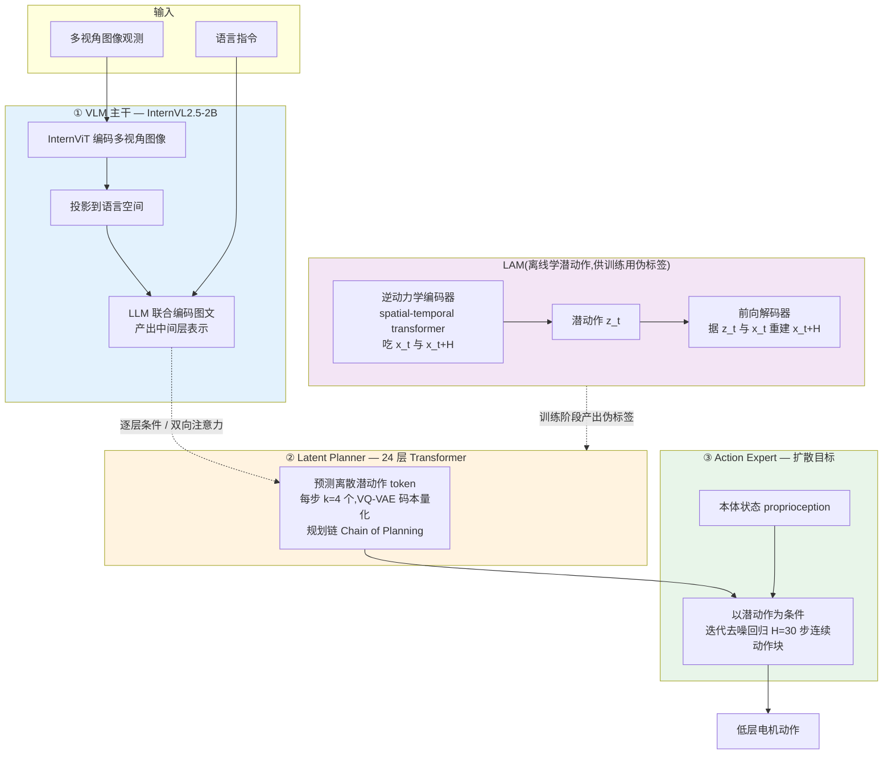

# GO-1 细粒度解读

> **arXiv**: 2503.06669 · 智元 AgiBot / 上海 AI Lab(OpenDriveLab)· 2025.03 · **路线**:潜动作桥接(ViLLA = Vision-Language-Latent-Action),VLM 出潜动作 token → Latent Planner 解码 → 扩散动作专家执行
> [← 返回主报告](../index.md)

---

## TL;DR

GO-1(Genie Operator-1)是智元随 **AgiBot World** 数据集(arXiv:2503.06669)一并发布的通用具身基座策略,其核心主张是把传统 **VLA(Vision-Language-Action)** 升级为 **ViLLA(Vision-Language-**Latent**-Action)**:在"视觉语言"与"低层动作"之间显式插入一层**潜动作(latent action)**作为桥接。架构上是**三段式**:① 一个 **InternVL2.5-2B** 视觉-语言主干(VLM),负责场景理解与指令解析;② 一个 **24 层 Transformer 的 Latent Planner(潜动作规划器)**,读 VLM 的中间层表示,预测一串**离散潜动作 token**(每步 `k=4` 个 token,VQ-VAE 码本量化),作者称之为"规划链(Chain of Planning, CoP)";③ 一个**扩散目标(diffusion objective)的 Action Expert(动作专家)**,以潜动作为条件,迭代去噪回归出 `H=30` 步的连续低层动作块。

ViLLA 的关键创新在于**潜动作既是训练时连接无标签视频与机器人动作的伪标签、又是推理时连接 VLM 与动作专家的架构接口**——后者是 GO-1 区别于 [GR00T N1](groot-n1.md)/LAPA 把潜动作仅当"无动作视频训练技巧"的独有价值点。潜动作由一个独立的 **Latent Action Model(LAM)** 学习:逆动力学编码器吃当前帧与未来帧、输出潜动作,前向解码器据此重建未来帧,从而能在 **Ego4D 人类视频 + 多本体机器人数据**等异构无标签语料上抽取统一的动作表示。训练分**三阶段**:LAM 预训练 → Latent Planner 用 LAM 输出做伪标签训练 → Latent Planner 与 Action Expert 联合训练。

> ⚠️ 注意:GO-1 的全部性能数字(复杂长程任务 >60%、较 RDT 提升 32%、AgiBot World 预训练较 Open X-Embodiment 平均提升 30%)均为**智元论文自评**,**无第三方在统一基准下的独立复现**。数据集规模一律详见 [数据全景](embodied-data.md),本页不复述。

---

## 1. 要解决的问题

GO-1 想同时回答两个相互纠缠的问题:

1. **如何把廉价、海量、无动作标签的数据(人类视频、跨本体机器人轨迹)真正"喂"进一个能驱动真机的策略?** 真机遥操作轨迹动作精确但昂贵稀缺,人类视频规模巨大却没有可执行动作标签,人-机本体之间还隔着自由度/视角/运动学鸿沟(数据矛盾的完整梳理详见 [数据全景](embodied-data.md))。
2. **如何在大 VLM 的"慢语义"与真机控制的"快动作"之间架一座既能跨数据源迁移、又能在推理期复用的桥?** 经典 VLA(如 [RT-2](rt2.md))让动作直接条件于图文输入,中间没有显式的、可被异构数据共享的中间表示;这使得"用人类视频学到的东西"很难干净地传导到动作端。

ViLLA 的答案是:**引入潜动作 token 作为统一中间层**。潜动作既可由无标签视频经逆动力学自监督地"造"出来当伪标签(解决问题 1),又作为 Latent Planner 的输出、Action Expert 的条件,在推理期成为 VLM↔动作专家之间真实存在的数据接口(解决问题 2)。

---

## 2. 方法与架构

*图注:GO-1 的 ViLLA 三段式 + 离线 LAM。蓝色 VLM 出语义中间表示;橙色 Latent Planner 把语义解码成离散潜动作 token("规划链");绿色 Action Expert 以潜动作为条件、用扩散去噪回归连续动作。紫色 LAM 是离线自监督模块,在异构无标签视频上学潜动作表示,训练期为 Latent Planner 提供伪标签——推理期不参与,潜动作改由 Latent Planner 直接预测。*

### 2.1 ① VLM 主干:InternVL2.5-2B(语义理解)

GO-1 选用 **InternVL2.5-2B**(约 20 亿参数级)作为视觉-语言主干,作者称该 2B 规模在其前期机器人实验中已被证明有效。多视角图像观测先由 **InternViT** 编码,再投影到语言空间,与语言指令一起送入 LLM 联合编码,产出供下游消费的中间层表示。这一层承载互联网规模图文预训练带来的开放世界语义与语言理解。

### 2.2 ② Latent Planner:24 层 Transformer 出潜动作 token(桥接核心)

Latent Planner 是 ViLLA 的灵魂,由 **24 层 Transformer** 构成,以**逐层条件(layer-by-layer conditioning)+ 全双向注意力**的方式读取 VLM 主干的中间输出,预测**离散潜动作 token**。其特征:

- **离散 token、码本量化**:潜动作序列 `z_t = [z_t^0, …, z_t^{k-1}]`,每步取 **`k=4`** 个 token,经 **VQ-VAE** 目标量化到一个大小为 `|C|` 的码本(`|C|` 待核)。
- **规划链(Chain of Planning, CoP)**:Latent Planner 据 VLM 中间表示自回归/掩码地产出潜动作 token 序列,作者把这串潜动作视为对"通用动作理解与规划"的显式表达——是介于"语言级语义"与"电机级动作"之间的中间抽象。
- **桥接定位**:与 VLA 让动作直接条件于图文不同,**潜动作 token 才是 VLM 与 Action Expert 之间的真实接口**;VLM 不直接产动作,而是先产语义、由 Planner 翻成潜动作、再由 Expert 翻成电机指令。

### 2.3 ③ Action Expert:扩散目标回归连续动作

Action Expert 与 Latent Planner **共享同构设计、复用与 VLM 同一 Transformer 骨架**,但其任务是把潜动作翻译成可执行的低层动作:

- **扩散目标(diffusion objective)**:对低层动作的**连续分布**建模,以潜动作(及本体状态)为条件,通过**迭代去噪过程**回归出动作序列。
- **动作块**:一次输出 `H=30` 步的连续动作块(action chunk),由超百万条真机示范训练以达成高频灵巧操作。

> ⚠️ 术语辨析:多份一手/二手材料把 Action Expert 描述为"扩散目标 / 迭代去噪",并称 ViLLA 结合了 **VLM + MoE(混合专家)**——即 Latent Planner 与 Action Expert 作为两个"专家"挂在共享骨架上。本页据此把动作头归入**扩散策略家族**;其究竟用 DDPM 式扩散还是流匹配(flow matching)变体,**一手未给足够细节,标"待核"**。

### 2.4 LAM 与三阶段训练:潜动作从何而来

潜动作 token 的语义由一个独立的 **Latent Action Model(LAM)** 离线定义,本质是一个**逆动力学 + 前向动力学**的自编码:

- **编码器(逆动力学)**:一个 **spatial-temporal transformer**,吃当前帧 `x_t` 与未来帧 `x_{t+H}`,输出潜动作 `z_t`。
- **解码器(前向动力学)**:据 `z_t` 与 `x_t` **重建** `x_{t+H}`,以 VQ-VAE 重建损失训练。
- **异构数据来源**:LAM 在互联网规模异构数据上训练,包括 **Ego4D 人类视频**与**多本体机器人数据**,从中抽取跨本体通用的动作表示——这正是"用无标签视频补真机数据"的落点(数据分层与潜动作/IDM 路线对照详见 [数据全景](embodied-data.md))。

**三阶段训练**:

1. **阶段一**:在网络规模视频上**预训练 LAM**,得到潜动作空间;
2. **阶段二**:用 LAM 输出作**伪标签**,训练 **Latent Planner** 学会从 VLM 语义预测潜动作 token;
3. **阶段三**:**Latent Planner 与 Action Expert 联合训练**,打通"语义→潜动作→连续动作"全链路。

---

## 3. 关键设计与创新点

1. **潜动作作为"推理期架构桥接"(本页独有价值点)**:这是 GO-1 区别于同类潜动作工作的核心。在 [GR00T N1](groot-n1.md) 与 **LAPA** 里,潜动作只是**训练技巧**——VQ-VAE 学到的潜动作被当成无动作视频的**伪标签**喂进损失,推理时模型直接出真机动作、潜动作并不在前向链路上(GR00T 甚至把它视作一个独立的 'LAPA' 本体)。而 GO-1 把潜动作**升格为推理期的常驻接口**:Latent Planner 在线预测潜动作 token,Action Expert 在线消费它——潜动作是 VLM↔动作专家之间真实存在的中间表示,而非仅训练期的脚手架。这一升格使"潜动作"从数据增强手段变成了**架构原语**。
2. **"离散 / 连续 / 潜动作"三分法中的第三极**:见第 6 节。GO-1 的动作表示既非 [RT-2](rt2.md) 式离散动作 token,也非 [π0](pi0.md) 式直接流匹配连续动作,而是"**离散潜动作 token(Planner)+ 连续动作(Expert 扩散)**"的两段式——潜动作离散、终端动作连续。
3. **ViLLA 三段式解耦**:VLM(语义)/ Latent Planner(规划)/ Action Expert(执行)职责分明,且 Planner 与 Expert 复用同一 Transformer 骨架(MoE 式专家),兼顾模块化与参数共享。
4. **规划链 CoP**:把"潜动作 token 序列"显式当作一条可解释的动作规划链,介于语言推理与电机动作之间。
5. **数据可扩展性主张**:作者强调 GO-1 随数据量增长呈现可预测的性能 scaling(规模数字详见 [数据全景](embodied-data.md))。

---

## 4. 实验与关键结果

> ⚠️ 以下数字均为**智元 AgiBot 论文自评**,**无第三方在统一基准下的独立复现**;不同条目口径不同,禁止横比。

| 设定 / 对比 | 指标 | GO-1 结果 | 来源 |
|---|---|---|---|
| 复杂长程(long-horizon)真机任务 | 成功率 | **> 60%** | ⚠️ 智元自评(arXiv:2503.06669) |
| 5 个不同复杂度任务,对比当时 SOTA | 平均成功率 | **46% → 78%(+32 个百分点)** | ⚠️ 智元自评 / 官方博文 |
| vs **RDT** 先前方法 | 成功率提升 | **+32%** | ⚠️ 智元自评 |
| AgiBot World 预训练 vs Open X-Embodiment 预训练 | 平均性能提升 | **+30%** | ⚠️ 智元自评 |

> 📌 "46%→78% 提升 32 个百分点"与"较 RDT 提升 32%"在不同材料中均出现且数字巧合,二者是否同一组实验**口径未在一手来源中明确调和,引用需谨慎**。AgiBot World 数据集规模(轨迹数/小时数/任务数)一律详见 [数据全景](embodied-data.md),本页不复述。

---

## 5. 局限与争议

- **全自评、零第三方复现**:所有成绩均来自智元一手论文/博文,缺乏基准维护方或独立团队在统一口径下的复现;"较 RDT 提升 32%""复杂任务 >60%"等承重数字均带 ⚠️。
- **动作头技术细节披露不足**:Action Expert 用"扩散目标 / 迭代去噪"已明确,但 DDPM 扩散 vs 流匹配、码本大小 `|C|`、Latent Planner 解码是自回归还是掩码并行等关键细节,一手材料披露有限,本页相应处标"待核"。
- **潜动作的物理可解释性**:潜动作是自监督学出的抽象量、非物理动作,其与真机动作的对齐质量会逐级传导到 Action Expert;这是潜动作路线的共性风险(见 [数据全景](embodied-data.md))。
- **MoE 桥接的命名与实现**:二手材料称 ViLLA 为"VLM + MoE",但 Planner/Expert 作为"专家"如何路由、是否真正稀疏激活,一手未充分说明。

---

## 6. 在 VLA 谱系中的位置

GO-1 是国产工业界(智元)对"通用具身基座"的旗舰回答,与数据侧的 AgiBot World 构成"数据 + 模型"配套。把它放进站内的**动作表示三分法**,正是本页的定位价值:

| 路线 | 动作表示 | 代表 | 桥接方式 |
|---|---|---|---|
| **离散动作 token** | 把连续动作离散成词表 token,VLM 自回归生成 | [RT-2](rt2.md) | 动作即语言 token,无独立动作头 |
| **连续动作(流匹配/扩散)** | 直接在连续动作空间用流匹配/扩散回归 | [π0](pi0.md)、[GR00T N1](groot-n1.md)、[Diffusion Policy](diffusion-policy.md) | VLM 主干 + 动作专家(MoE / cross-attention)直出连续动作 |
| **潜动作桥接(本页第三极)** | 先出离散**潜动作** token,再由动作专家解成连续动作 | **GO-1(ViLLA)** | 潜动作 token 作为 VLM↔动作专家的**推理期中间接口** |

与 [π0](pi0.md) 的对照尤其清晰:π0 是"VLM 主干 + 流匹配动作专家",VLM 表示直接条件动作专家、中间无离散潜变量;GO-1 在二者之间**插了一层离散潜动作 token**,既作为跨数据源的统一表示、又作为推理期接口。

与 [GR00T N1](groot-n1.md)/LAPA 的对照是 GO-1 最重要的身份标签:**三者都用 VQ-VAE 式逆动力学学潜动作**,但**用途层级不同**——GR00T/LAPA 把潜动作当**无动作视频的伪标签训练技巧**(推理期不出现),GO-1 把潜动作当**推理期架构桥接**(Latent Planner 在线预测、Action Expert 在线消费)。这把"潜动作"从训练期脚手架提升为常驻架构原语,是 GO-1 在谱系中的独有坐标。

相关条目:[RT-2](rt2.md) · [π0](pi0.md) · [GR00T N1](groot-n1.md) · [Diffusion Policy](diffusion-policy.md) · [数据全景](embodied-data.md)

---

## 来源

- 论文摘要页:https://arxiv.org/abs/2503.06669
- 论文 HTML:https://arxiv.org/html/2503.06669v1
- 项目主页:https://opendrivelab.com/AgiBot-World/
- 官方博文(VLA→ViLLA):https://www.globenewswire.com/news-release/2025/03/10/3040128/0/en/AgiBot-GO-1-The-Evolution-of-Generalist-Embodied-Foundation-Model-from-VLA-to-ViLLA.html
- 模型权重:https://huggingface.co/agibot-world/GO-1 · https://huggingface.co/agibot-world/GO-1-Air
- 代码与数据集:https://github.com/OpenDriveLab/agibot-world · https://huggingface.co/agibot-world
- 智元官网:https://www.agibot.com
