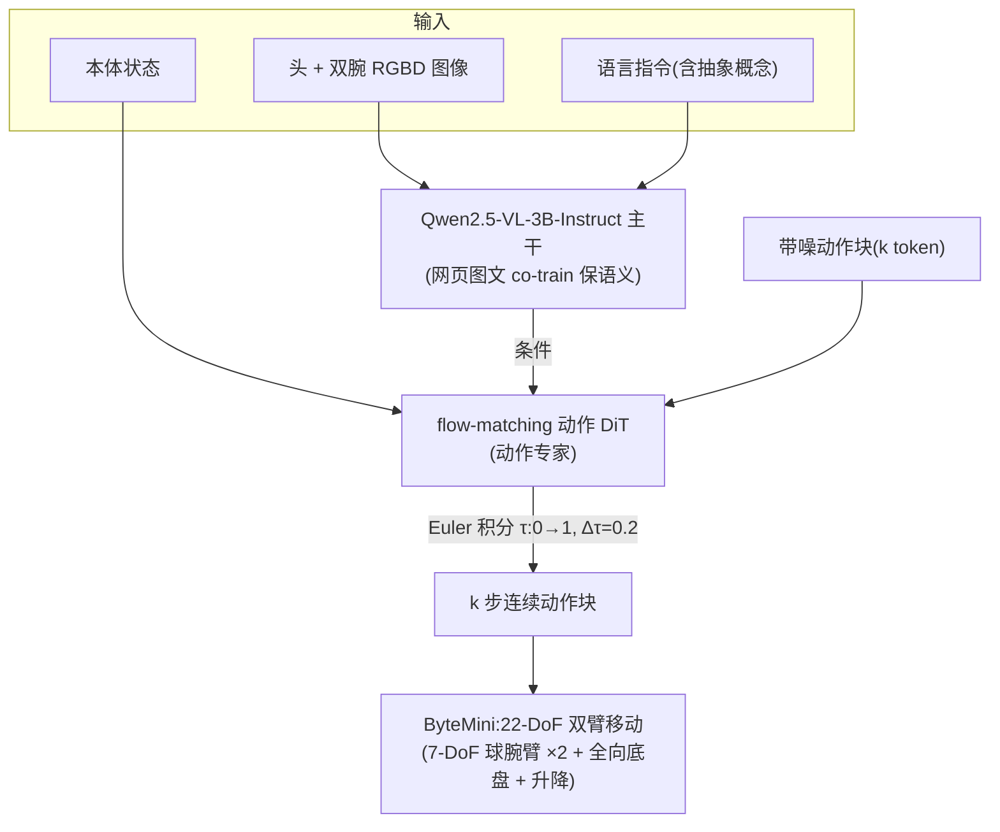

# GR-3 细粒度解读

> **arXiv**: [2507.15493](https://arxiv.org/abs/2507.15493) · 字节跳动 Seed(ByteDance Seed)· 2025.07 · **路线**:VLM 主干 + flow-matching 动作 DiT(主流连续路线),三源数据配方 + 自研双臂移动本体 ByteMini
> [← 返回主报告](../index.md)

---

## TL;DR

GR-3 是字节跳动 Seed 团队的通用机器人基座 VLA,补上了本站此前空白的"**中国大厂 × 主流路线**"一格——站内中国厂商此前只有智元 [GO-1](go-1.md)(ViLLA 潜动作)与阿里 [RynnVLA-001](rynnvla.md)(视频生成第三条路)/ [Qwen-VLA](qwen-vla.md),而字节 Seed 体系是空的。GR-3 走的是和 [π0](pi0.md) 同一条主流路:**VLM 主干 + 独立 flow-matching 动作专家**。

- **架构**:从 **Qwen2.5-VL-3B-Instruct** 初始化,加 **flow-matching 动作 DiT**,共约 **4B 参数**;动作表示为 **k 个 token 的动作块**,推理用 Euler 法从 τ=0 积分到 1(Δτ=0.2,即约 5 步)。**与 [Wall-OSS-0.5](wall-oss-05.md) 同主干(Qwen2.5-VL-3B)**,但训练配方不同。
- **三源训练配方**(论文主打):① **网页图文 VL 数据 co-train**(保住开放世界语义、抽象指令理解);② **VR 设备采集的人类轨迹高效微调**(PICO 4 Ultra,约 450 条/小时,每物体约 10 条人类轨迹);③ **真机遥操作轨迹模仿学习**。三者让模型既泛化到新物体/新环境、理解抽象指令,又能少样本适配新任务。
- **本体 ByteMini**:**22-DoF 双臂移动机器人**,7-DoF 无偏臂 + **球形腕关节**(窄空间灵巧)、全向移动底盘 + 升降、QDD 准直驱动器、头部 + 双腕 RGBD 相机。
- **关键成绩(⚠️ 自评,真机)**:在泛化、长程、双臂可形变(叠衣)任务上超越 π0——如未见指令 pick-and-place **77.1% vs π0 40%**、Table Bussing(指令跟随设定)**97.5% vs 53.8%**、叠衣基础任务 task progress **86.7%**。

> ⚠️ 全部成绩来自字节 Seed **技术报告自评**(真机自有套件),无第三方在统一基准下的独立复现;部分对比数为按设定读出。凡定量标 ⚠️。

---

## 1. 要解决的问题

通用机器人策略要同时满足三件常打架的事,而单一数据源都喂不饱:

1. **泛化到新物体/新环境 + 理解抽象指令**:只靠真机遥操作数据,覆盖面有限、采集昂贵,模型容易过拟合到见过的物体与措辞。→ 需要**网页规模图文知识**注入开放世界语义。
2. **学新任务要省样本**:每个新任务都采几百条真机轨迹不现实。→ 需要一种**比真机遥操作更高效**的数据来源。
3. **双臂、可形变、长程操作**:叠衣、收拾餐桌这类任务接触丰富、时序长,纯模仿难。→ 需要**高质量真机演示 + 合适的本体**。

GR-3 的答案是**三源配方各司其职**:网页 VL 数据管"懂世界",VR 人类轨迹管"高效学新技能"(人戴 VR 遥控/示范,采集速率远高于真机),真机轨迹管"精确执行";再配一台为灵巧双臂操作设计的 ByteMini 本体把能力落地。

---

## 2. 方法与架构

### 2.1 主干与动作头

- **主干**:**Qwen2.5-VL-3B-Instruct**,提供视觉-语言理解与抽象指令 grounding;通过与网页图文数据 co-train 保住开放世界语义(认得新物体、理解"把会漏的东西收起来"这类抽象指令)。
- **动作专家**:**flow-matching 动作 DiT**,以主干表示为条件,对带噪动作块做流匹配去噪;动作表示为 **k 个 token 的动作块**,推理用 Euler 法 τ=0→1、步长 Δτ=0.2(约 5 步积分)。整模型约 **4B 参数**。属"VLM 主干 + 独立连续动作专家"主流形态(同 [π0](pi0.md))。

### 2.2 三源训练配方(核心贡献)

| 数据源 | 作用 | 规模/采集(⚠️ 自评) |
|---|---|---|
| **网页图文 VL 数据** | co-train 保开放世界语义、抽象指令、grounding | 多源混合(image captioning / VQA / grounding),具体规模未详 |
| **VR 人类轨迹** | 高效学新技能(比真机遥操作省) | PICO 4 Ultra 采集,约 **450 条/小时**,每物体约 10 条 |
| **真机遥操作轨迹** | 精确执行的模仿学习 | pick-and-place 约 **35k 条**;Table Bussing 约 **101 小时**;叠衣约 **116 小时** |

> VR 人类轨迹是 GR-3 区别于多数同类的一笔:用 VR 设备让人"示范"动作,采集吞吐远高于真机遥操作,作为真机数据与网页数据之间的桥梁(数据范式对照见 [具身数据全景](embodied-data.md))。

### 2.3 本体 ByteMini

22-DoF 双臂移动机器人:每臂 **7-DoF 无偏设计 + 球形腕关节**(在狭窄空间实现类人灵巧)、全向移动底盘 + 升降机构、**QDD 准直驱动器**(柔顺、抗冲击)、头部与双腕 RGBD 相机。本体规格对照见 [实验机器人本体](robots.md)。

---

## 3. 关键设计与创新点

1. **三源配方的"分工"**:网页 VL(懂世界)+ VR 人类轨迹(高效学新技能)+ 真机(精确执行),把"泛化、少样本、精确"三件事拆给三种数据,而非靠单一真机数据硬堆。
2. **VR 人类轨迹作为高效数据源**:约 450 条/小时的采集速率,显著高于真机遥操作,是其"少样本适配新任务"的关键支点。
3. **主流路线的工业级落地**:Qwen2.5-VL-3B + flow-matching DiT,与 [π0](pi0.md)/[GR00T N1](groot-n1.md) 同族,但配自研 ByteMini 本体做端到端工业级验证。
4. **可形变 + 长程双臂操作**:叠衣、收拾餐桌等接触丰富长程任务上自评领先 π0。

---

## 4. 实验与关键结果

> ⚠️ 全部为字节 Seed 自评(真机自有套件,对比 π0 为作者复现);task progress = 分步完成度,success rate = 完整完成率。

| 任务 / 设定 | 指标 | GR-3 | π0 |
|---|---|---|---|
| Pick-and-Place(未见指令) | 成功率 | **77.1%** | 40% |
| Pick-and-Place(未见物体) | 成功率 | **57.8%** | 40% |
| Table Bussing(指令跟随设定) | 成功率 | **97.5%** | 53.8% |
| 叠衣(基础) | task progress | **86.7%** | ~60%(估) |

核心论点:GR-3 在**对新物体/新环境/抽象指令的泛化**、**长程任务**、**双臂可形变操作**三个维度上超越当时 SOTA 基线 π0(⚠️ 自评)。消融支持三源配方各自的贡献(网页数据↑泛化、VR 人类轨迹↑新技能样本效率)。

---

## 5. 局限与争议

- **全自评、无第三方复现**:所有成绩为字节 Seed 自有真机套件自评,π0 基线为作者复现,跨工作口径未必一致(标 ⚠️)。
- **架构无范式级创新**:GR-3 的新意主要在**数据配方 + 本体工程**,模型形态(Qwen2.5-VL-3B + flow-matching DiT)是主流路线的工程化,而非新范式。
- **VR 人类轨迹的迁移损耗**:人手与机器人本体存在运动学差异,VR 示范到 ByteMini 动作空间的迁移质量、对最终性能的净贡献,缺独立拆解。
- **强绑定自研本体**:能力很大程度依赖 ByteMini(球腕/全向底盘/QDD),跨到其它本体的泛化未充分验证。
- **网页 VL 数据规模未详**:co-train 的关键数据源规模与配比在报告中披露有限,标"待核"。

---

## 6. 在 VLA 谱系中的位置

GR-3 在谱系里的坐标:**主流"VLM 主干 + flow-matching 动作专家"路线的中国大厂工业级旗舰**,与 [π0](pi0.md)(同路线奠基)、[GR00T N1](groot-n1.md)(双系统 DiT)、[Wall-OSS-0.5](wall-oss-05.md)(同为 Qwen2.5-VL-3B 主干,但走梯度桥接 co-training)并列。

- **与 [π0](pi0.md) 对照**:同是 VLM + 流匹配动作专家;GR-3 的差异化在**三源数据配方(尤其 VR 人类轨迹)**与自研本体,而非动作生成机制。
- **与 [Wall-OSS-0.5](wall-oss-05.md) 对照**(都建于 Qwen2.5-VL-3B):Wall-OSS-0.5 的重点是**梯度桥接 co-training**(离散 RVQ 桥塑造主干);GR-3 的重点是**数据来源工程**(网页 + VR 人类 + 真机三源)。两者代表"同主干、不同改进轴"。
- **与中国厂商同行对照**:[GO-1](go-1.md)(智元,ViLLA 潜动作桥接)走潜动作,[RynnVLA-001](rynnvla.md)(阿里,视频生成)走第三条路,GR-3(字节)走主流流匹配——三家恰好分占三条不同技术路线,GR-3 补齐了"中国大厂 × 主流路线"。
- **数据范式**:VR 人类轨迹 + 真机 + 网页的三源混合,是 [具身数据全景](embodied-data.md) 数据金字塔的一个工业级实例。

相关条目:[π0](pi0.md) · [GR00T N1](groot-n1.md) · [Wall-OSS-0.5](wall-oss-05.md) · [GO-1](go-1.md) · [RynnVLA-001](rynnvla.md) · [具身数据全景](embodied-data.md) · [实验机器人本体](robots.md)

---

## 来源

- 论文:arxiv.org/abs/2507.15493(GR-3 Technical Report,ByteDance Seed,2025.07)· HTML 全文 arxiv.org/html/2507.15493v1(Qwen2.5-VL-3B 主干 / 4B / flow-matching DiT / Euler Δτ=0.2 / ByteMini 22-DoF / 三源数据 / vs π0 成绩均出自此)
- 官方:seed.bytedance.com/en/GR3 · 博客 seed.bytedance.com/en/blog(GR-3 released)
- 本站交叉:[π0 细读](pi0.md) · [Wall-OSS-0.5 细读](wall-oss-05.md)(同 Qwen2.5-VL-3B 主干)· [GO-1](go-1.md) / [RynnVLA-001](rynnvla.md)(中国厂商不同路线)
- 说明:本页定量均为字节 Seed 技术报告自评、无第三方统一基准复现;π0 基线为作者复现口径。
