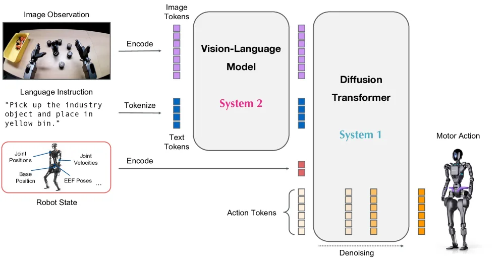
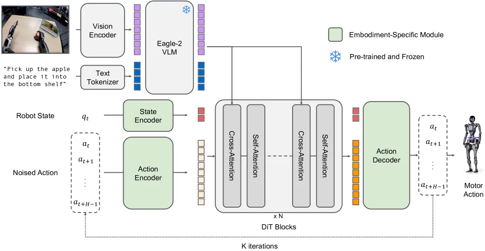

# GR00T N1:面向通用人形机器人的开放基础模型(双系统 VLM + 扩散/流匹配 DiT)

> **GR00T N1: An Open Foundation Model for Generalist Humanoid Robots**
> NVIDIA,2025.03 · arXiv:[2503.14734](https://arxiv.org/abs/2503.14734)
> 路线:连续动作 · 双系统(System 2 VLM + System 1 扩散 Transformer/DiT)· 流匹配(velocity prediction)· 数据金字塔 · 跨本体

> [← 返回主报告](../index.md)

---

## TL;DR

GR00T N1 是 NVIDIA 面向**通用人形机器人**推出的开放(权重、数据、仿真基准均公开)VLA 基础模型,核心是一套**显式双系统(dual-system)架构**:**System 2** 是预训练的视觉-语言模块(VLM,采用 **Eagle-2**),以约 **10 Hz** 慢速运行,负责"看懂环境 + 听懂指令"的语义推理;**System 1** 是一个**扩散 Transformer(Diffusion Transformer,DiT)**,通过**流匹配(flow matching,预测去噪速度场 velocity)**迭代去噪,一次推理输出 **16 步连续电机动作块(action chunk)**,以高达 **120 Hz** 的频率闭环执行实时灵巧控制。两系统**紧耦合、端到端联合训练**:DiT 通过**交叉注意力(cross-attention)**消费 VLM 输出的视觉-语言 token。训练语料组织为"**数据金字塔(data pyramid)**"——底层海量人类视频、中层合成生成数据、顶层稀缺但高价值的真实机器人遥操作轨迹,以缓解机器人真机数据稀缺。跨本体方面采用**相对末端执行器(relative end-effector)动作空间**与"具身感知(embodiment-aware)"的状态/动作编码器,使从单臂机械臂到双臂灵巧手人形机器人、乃至人类视频共享同一策略底座。开放检查点为 **GR00T-N1-2B**(约 2B 参数,其中 VLM 约 1.x B),预训练约耗 **50,000 H100 GPU 小时**。

> ⚠️ 注意:文中绝大多数性能数字为 **NVIDIA 作者自评**,且评测以仿真为主、真机任务集中在 GR-1 人形机器人,缺乏独立第三方在统一基准下的复现。"diffusion transformer"为 NVIDIA 的命名,技术上其动作头是**流匹配**,归入扩散策略(diffusion policy)家族。

---

## 1. 问题:通用人形、数据稀缺、实时性

构建"通用人形机器人基础模型"面临三重张力:

1. **通用人形(generalist humanoid)**:人形机器人本体自由度高(双臂 + 灵巧手 + 全身),任务空间开放,需要一个能听懂自由语言指令、在多样场景下泛化的统一策略,而非每任务一个专用模型。
2. **数据稀缺(data scarcity)**:真实机器人遥操作轨迹昂贵且稀少,远不及互联网图文/视频规模;直接用真机数据训练大模型会严重过拟合、泛化差。如何"用便宜的数据补贵的数据"是关键。
3. **实时性(real-time control)**:灵巧操作需要高频(百 Hz 级)连续电机指令;而带来语义泛化的大 VLM 推理慢(十 Hz 级)。两者频率天然冲突,单一模型难以同时满足"想得对"与"动得快"。

GR00T N1 的回答是:用**双系统**解耦"慢思考(VLM 语义)"与"快执行(DiT 连续动作)",用**数据金字塔**把人类视频与合成数据填补真机数据的空缺,用**相对末端执行器动作空间 + 具身感知编码器**实现跨本体共享。

---

## 2. 方法与架构

*图注:GR00T N1 模型总览(对应论文 Figure 2)。这是一个采用**双系统(dual-system)设计**的 VLA 模型:图像观测与语言指令被转成 token 序列,送入 **Vision-Language Model(VLM)主干**(System 2);VLM 的输出连同机器人本体状态与带噪动作的编码,一起送入 **Diffusion Transformer 模块**(System 1)生成电机动作。两系统均为 Transformer,**紧耦合、端到端联合优化**。公开权重 **GR00T-N1-2B 共约 2.2B 参数**,其中 VLM 约 **1.34B**;在 L40 GPU 上以 bf16 采样一个 16 步动作块约 **63.9 ms**。*

GR00T N1 的方法核心可拆为四块:**System 2(慢语义 VLM,2.1)** → **System 1(快动作 DiT + 流匹配,2.2)** → **两系统桥接与跨本体编码 + 端到端联合训练(2.3)** → **数据金字塔 + 无动作视频的伪标注(2.4)**。其架构灵感来自 Kahneman 的"快/慢思考"双系统认知模型:用慢速 VLM 承载开放语义推理,用高频动作模块承载实时灵巧控制,二者频率解耦但权重端到端共优化。

### 2.1 System 2:视觉-语言推理模块(VLM,~10 Hz)

System 2 是一个在互联网规模数据上预训练的**视觉-语言模型**,论文采用 **NVIDIA Eagle-2**。其内部结构明确:**由 SmolLM2 LLM + SigLIP-2 图像编码器微调而来**,二者在一组广泛的视觉-语言任务上对齐。处理流程:

- **视觉编码**:图像以 **224×224** 分辨率送入 SigLIP-2,再经 **pixel shuffle**(空间到通道的重排,降 token 数)得到**每帧 64 个图像 token 嵌入**。
- **多模态融合**:训练时按 Eagle-2 的对话(chat)格式,把任务文本描述 + (可能多张)图像一并喂给 VLM,由 LLM 组件联合编码图文,产出形如 `(batch × 序列长度 × 隐维)` 的视觉-语言特征 token `ϕ_t`。
- **关键工程选择——取中间层而非末层**:论文发现使用 LLM **中间层**而非最后一层的嵌入,既**加快推理**又**提高下游策略成功率**;GR00T-N1-2B 具体取 **第 12 层** 的表示。
- **运行频率**:在 NVIDIA L40 GPU 上以约 **10 Hz** 运行——慢,但承载大规模预训练带来的世界知识与语言理解,负责"看懂环境是什么、指令要做什么"的语义解释。

### 2.2 System 1:扩散 Transformer 动作模块(DiT + 流匹配,~120 Hz)

*图注:GR00T N1 架构细节(对应论文 Figure 3)。模型在从单臂机械臂到双臂人形灵巧手的多样本体上训练;为应对不同本体的状态/动作维度差异,使用带**具身感知(embodiment-aware)状态/动作编码器**的 DiT 块来嵌入机器人状态与动作。视觉-语言 token 来自 Eagle-2 的潜在嵌入,随后通过**交叉注意力层**馈入 DiT 块。*

System 1 是一个 **DiT(Diffusion Transformer)变体**,记作速度场网络 `V_θ`,本质是带**去噪步条件**的 Transformer——**去噪时间步经 adaptive layer normalization(AdaLN)注入**到每个 block。它把 System 2 的"语义意图"翻译成**实时连续电机动作**。

**输入与编码器**

- **本体状态(proprioception)与动作**:不同本体的状态/动作维度各异,故对每个本体配一个 **MLP(具身感知编码器)**,把状态、动作投影到共享嵌入维度。**Action Encoder MLP 还把扩散时间步与带噪动作向量一起编码**(沿用 π0 的做法)。
- **动作分块(action chunking)**:任意时刻 `t` 模型处理一个动作块 `A_t = [a_t, …, a_{t+H-1}]`,论文取 **H = 16**,即一次推理输出未来 16 步动作。

**网络结构(类 Flamingo 的交替注意力)**

`V_θ` 由**交替的 cross-attention 与 self-attention 块**堆叠而成,结构上类似 **Flamingo** 与 **VIMA**:

- **self-attention 块**:作用于带噪动作 token 嵌入 `A_t^τ` 与状态嵌入 `q_t`,负责动作序列内部的时序建模。
- **cross-attention 块**:对 VLM 输出的视觉-语言 token 嵌入 `ϕ_t` 做**条件(conditioning)**——这是 System 2→System 1 信息流的**关键接口**。
- 最后一层 DiT block 之后,对末尾 `H` 个 token 施加**具身特定的 Action Decoder(又一 MLP)**预测动作。

> ⚠️ 桥接方式辨析:GR00T N1 用**简单的 cross-attention** 把 VLM token 注入 DiT,**不是 MoE / 双权重专家**——这点与 π0 把"VLM 主干 + 动作专家"用混合专家(MoE)桥接的做法不同,务必讲准。

**流匹配训练目标(velocity prediction)**

DiT 用**流匹配(flow matching)**学习动作生成,即扩散的连续变体:

- **加噪**:给定真值动作块 `A_t`、流匹配时间步 `τ∈[0,1]` 与噪声 `ε∼N(0,I)`,带噪动作块为线性插值 `A_t^τ = τ·A_t + (1−τ)·ε`。
- **目标**:`V_θ(ϕ_t, A_t^τ, q_t)` 学习逼近**去噪向量场(velocity)** `ε − A_t`,损失为 `L_fm = E_τ ‖V_θ(·) − (ε − A_t)‖²`。时间步采样用偏置的 **Beta 分布**(`Beta((s−τ)/s; 1.5, 1)`, `s=0.999`,沿用 π0),使训练更集中于高噪声区段。
- **推理(K 步欧拉积分)**:从纯噪声 `A_t^0 ∼ N(0,I)` 出发,用**前向欧拉积分**迭代去噪:`A_t^{τ+1/K} = A_t^τ + (1/K)·V_θ(ϕ_t, A_t^τ, q_t)`。论文发现 **K = 4 步**即可在所有本体上良好工作——去噪步数极少,是其低延迟(63.9 ms/块)、支撑高达 **120 Hz** 闭环控制的关键。
- 相比把动作离散化成 token 再自回归解码(RT-2 / OpenVLA 路线),流匹配直接在连续动作空间建模,天然"一次输出整段平滑轨迹",且仅在轻量 DiT 上迭代少数几步,延迟低、频率高。

> 术语提示:NVIDIA 官方称该模块为 **diffusion transformer**;其训练/采样在数学上是**流匹配(预测速度场 + 欧拉积分)**。两者同属扩散策略家族,本文按论文用法称 DiT,按技术实质标注 flow matching(争议细节见第 5 节)。

### 2.3 桥接、跨本体动作空间与端到端联合训练

**两系统桥接**:如上,System 1 的 cross-attention 块直接读取 System 2 的视觉-语言 token `ϕ_t` 作为条件;同时具身感知的状态编码器把机器人本体状态 `q_t` 编入 self-attention。于是"语义(来自 VLM)+ 本体感知(来自状态编码器)+ 去噪步(来自 AdaLN)"三路条件共同驱动动作生成。

**跨本体:相对末端执行器动作空间**。为让"单臂机械臂、双臂人形灵巧手、乃至人类示范"共享同一策略,GR00T N1 做了"尽力而为"的状态/动作空间统一:

- **动作 = 末端执行器的相对位姿增量**:论文明确"action space is defined by the **relative position and rotation of the end-effector** along with the gripper state",即动作是**相对当前位姿的增量(delta)**而非绝对关节角,使不同本体在同一语义动作上可对齐。
- **旋转表示**:状态侧末端旋转用 **6D 旋转表示**(避免欧拉角奇异/不连续);动作侧末端旋转用 **轴角(axis-angle)** 表示(紧凑平滑)。
- **归一化与排序**:对关节/末端的状态与动作做 **min-max 归一化**统一量纲;状态/动作向量按"末端旋转→末端位置→夹爪开合、左臂→右臂"的**固定顺序**排列。
- 再配合**每本体一个 MLP** 的具身感知编/解码器适配各本体维度差异,实现跨本体联合训练与迁移。

**端到端联合训练**:System 1 与 System 2 均为 Transformer,**紧耦合、端到端联合优化**(而非两段式拼接),以促进"推理"与"驱动"之间的协调。后训练阶段还以 **1:1 采样比** 把真机轨迹与合成神经轨迹 co-train。规模与成本(以原文为准):**GR00T-N1-2B 约 2.2B 参数**(VLM 约 1.34B);训练由 **NVIDIA OSMO** 编排、基于 **Ray** 做容错多节点训练,集群为 **H100 + Quantum-2 InfiniBand(fat-tree)**,单模型最多用 **1024 GPU**,预训练约耗 **50,000 H100 GPU 小时**。

### 2.4 数据金字塔与无动作视频的伪标注

*图注:用于机器人基础模型训练的数据金字塔(对应论文 Figure 1)。自底向上:**数据量递减、本体特异性(embodiment-specificity)递增**。底层是海量、与具体机器人本体无关的**人类视频 / 网络数据**(语义与运动先验最广,但离机器人最远);中层是**合成生成数据**(仿真轨迹 + 视频生成"神经轨迹");顶层是数量最少但与目标本体最贴合的**真实机器人遥操作轨迹**。GR00T N1 在预/后训练阶段都跨整座金字塔做 co-training,按异构混合采样训练 batch。*

数据金字塔把异构语料按规模分层,底层提供广泛视觉/行为先验、顶层确保对真机执行的 grounding:

- **顶层——真实机器人轨迹**:遥操作采集,数量稀少但最贴近部署本体。论文自采的 GR-1 遥操作数据约 **88 小时**(峰顶)。
- **底层——人类视频 / 网络数据**:预训练使用 **七个人类第一视角(egocentric)视频数据集**(外加 VLM 预训练用的网络数据),提供海量、低成本的人类操作运动先验。
- **中层——合成生成数据**,分两路:
  - **仿真轨迹**:用 **DexMimicGen** 从少量人类示范出发,把任务拆成"以物体为中心"的子任务,做示范变换 + 仿真回放,**保持机器人末端与物体的相对位姿**地迁移到新场景,只保留成功轨迹,批量自动扩增。
  - **神经轨迹(neural trajectories)**:把图生视频模型(Cosmos / Wan 等)在自采的 **88 小时** 遥操作数据上微调,再以已有初始帧 + 新语言提示生成 **827 小时** 视频(约 **10×** 扩增),覆盖现实中难采集的反事实场景。生成管线用商用多模态 LLM 先**检测物体**并组合出物理可行的"pick up {object} from {A} to {B}"指令,再用多模态 LLM 做 **judge 过滤 + 重新打字幕**(抽 8 帧判断是否符合指令)。

**无动作视频的伪标注**:人类视频与神经轨迹**没有显式动作标签**,论文用两条互补路径恢复可训练动作信号——

- **潜在动作(latent actions)**:训练一个 **VQ-VAE**,编码器吃当前帧 `x_t` 与未来帧 `x_{t+H}` 输出潜在动作 `z_t`,解码器据 `z_t` 与 `x_t` 重建 `x_{t+H}`;训练后把编码器当**逆动力学模型**用,取**量化前的连续嵌入**作为潜在动作标签,以同一流匹配损失训练,并视为一个独立的 **"LAPA" 本体**。在**所有异构数据上联合训练 VQ-VAE**,使各本体共享同一潜在动作空间——Figure 4 展示了 8 个本体(含人类)在"右臂向左/向右"上检索到一致的潜在动作,体现跨本体对齐。
- **IDM(逆动力学模型)伪标注**:另训一个 IDM,据相邻两帧(同训练动作 horizon)为神经轨迹**逐步反推伪动作**,直接当作真机动作风格的标签。论文消融发现:低数据时 **LAPA** 略优,数据增多后 **IDM** 标签与真机动作更对齐、正迁移更强(故 GR-1 这类高数据本体在真机神经轨迹 co-train 中只用 IDM 动作)。

---

## 3. 关键设计与创新点

1. **显式双系统、单模型端到端联合训练**:把"慢 VLM 语义(System 2,~10 Hz)"与"快 DiT 连续动作(System 1,~120 Hz)"组织进一个可端到端联合训练的网络,既解决频率冲突,又避免两段式拼接的次优——是工业级"VLM + 扩散动作头"双系统的代表作。
2. **交叉注意力桥接(而非 MoE)**:用简单的 cross-attention 把 VLM token 注入 DiT,接口轻量、实现简洁,区别于 π0 的双权重/MoE 桥接。
3. **流匹配 DiT 动作头**:velocity prediction + 欧拉积分,16 步动作块、120 Hz,连续高频灵巧控制。
4. **数据金字塔**:真机 + 人类视频 + 合成(仿真 + 视频生成神经轨迹)的异构混合,系统性缓解机器人数据稀缺;并用潜在动作 / IDM 标注把无动作视频纳入训练。
5. **相对末端执行器动作空间 + 具身感知编码器**:实现机器人与人类共享的跨本体动作表示与联合训练。
6. **全面开放**:GR00T-N1-2B 权重、训练数据与仿真基准均公开,降低社区复现与二次开发门槛。

---

## 4. 实验与关键结果

> ⚠️ 以下为 NVIDIA **作者自评**结果(本文 N1 原论文 + 后续 N1.5 报告),评测以仿真为主、真机集中于 GR-1 人形机器人,**缺独立第三方在统一基准下的复现**。⚠️ 标记处一律为 NVIDIA 自评;每张表均注明口径,跨表口径互不兼容、**禁止横比**。

### 速览表

**表 1 · GR00T 演进:N1.5 vs N1(NVIDIA「GR00T 演进」报告自评)** ⚠️
> 口径:NVIDIA GEAR 在 N1.5 报告中给出的 N1.5 与 N1 对照,各任务设定不同,**仅纵向看代际提升,不可与下方其他表横比**。

| 设定 / 任务 | 指标 | GR00T N1.5 | GR00T N1 | 来源 |
|---|---|---|---|---|
| Language Table(仿真) | 成功率 % | 93.2 | 52.8 | ⚠️ NVIDIA 自评(演进报告) |
| 真实 GR-1(真机) | 成功率 % | 93.3 | 46.6 | ⚠️ NVIDIA 自评(演进报告) |
| RoboCasa 30-demo 低数据档 | 成功率 % | 47.5 | 17.4 | ⚠️ NVIDIA 自评(benchmarks.md 表 B / verdicts ✅ 确认数值) |
| DreamGen(合成数据收益) | 成功率 % | 38.3 | 13.1 | ⚠️ NVIDIA 自评(演进报告) |

> ⚠️ RoboCasa 30-demo 的 47.5 / 17.4 与下方表 3 的 multitask 20.0% **是完全不同实验,不可混用**(同为 N1.5,这里 47.5% / 表 3 为 20.0%)。

**表 2 · N1.5 跨本体迁移到 Unitree G1(后训练,1000 条遥操作)** ⚠️
> 口径:N1.5 后训练迁移到异于预训练本体(GR-1)的 Unitree G1;250K 步 / 1K H100 / batch 16384。

| 设定 | 指标 | GR00T N1.5 | GR00T N1 | 来源 |
|---|---|---|---|---|
| Unitree G1 · 熟悉物体 | 成功率 % | 98.8 | 44.0 | ⚠️ NVIDIA 自评(演进报告) |
| Unitree G1 · 新物体 | 成功率 % | 84.2 | 待核(N1 对照未给) | ⚠️ NVIDIA 自评(演进报告) |

**表 3 · RoboCasa 1.0 官方 multitask(基准维护方统一评测,非厂商自评)** ✅
> 口径:300 任务(65 atomic + 235 composite),100 demos/task,multitask,pretrain scenes。这是与 DP / π0 / π0.5 **严格同口径**的最佳可比表;此处 GR00T 为 **N1.5**(非本文 N1,N1 在此表无条目)。

| 模型 | Avg | Atomic-Seen | Composite-Seen | Composite-Unseen | 来源 |
|---|---|---|---|---|---|
| **GR00T N1.5** | **20.0%** | 43.0% | 9.6% | 4.4% | ✅ RoboCasa 官方文档(benchmarks.md 表 A) |
| π0.5 (openpi) | 16.9% | 39.6% | 7.1% | 1.2% | ✅ RoboCasa 官方文档 |
| π0 (openpi) | 14.8% | 34.6% | 6.1% | 1.1% | ✅ RoboCasa 官方文档 |
| Diffusion Policy | 6.1% | 15.7% | 0.2% | 1.25% | ✅ RoboCasa 官方文档 |

> 📌 同口径排名:GR00T N1.5 > π0.5 > π0 > Diffusion Policy。⚠️ 本文 **N1** 本身无此表条目;N1 原论文用的是 24 任务 / 100 demos 口径(见下要点),与该 300-task multitask 不可横比。

**表 4 · 本文 N1 原论文自评(定性 / 区间,⚠️ 缺精确公开数值)** ⚠️

| 设定 | 结果 | 来源 |
|---|---|---|
| 3 仿真基准 24 任务(100 demos/task) | 平均成功率优于基线(含 Diffusion Policy);GR-1 任务相对基线领先 >17% | ⚠️ NVIDIA 自评(本文 §4 prose,Table 2 / Fig 9–10) |
| GR-1 真机 8 任务 | 击败 Diffusion Policy 基线;仅用 10% 数据仍小幅下降 | ⚠️ NVIDIA 自评(本文 §4 prose,Table 3 / Table 5) |
| RoboCasa 24-task(N1 原论文另一口径) | zero-shot ~42% / post-train ~47% | ⚠️ NVIDIA 自评;⚠️ 与表 1 的 30-demo 17.4% 口径不同、**未在一手来源显式调和,不可互证**(benchmarks.md §4.4) |

下方为要点解读(保留原分析性 prose):

- **仿真(Table 2 / Figure 9–10)**:在三个仿真基准(RoboCasa、DexMimicGen,以及一套贴近真实任务的新桌面操作套件,共 24 个任务)上,每任务用 100 条示范时,GR00T N1 平均成功率优于基线(含 Diffusion Policy);在 GR-1 任务上相对基线领先超过 **17%**。
- **真实世界(Table 3 / Table 5)**:在 GR-1 人形机器人 8 个真机任务上,GR00T N1 击败 Diffusion Policy 基线;即便**仅用 10% 数据**仍表现强劲(相对全量仅小幅下降)。预训练 GR00T-N1-2B 在未见摆放(如把苹果放在双手左侧)下仍能完成双手交接放入篮子(Figure 12),后训练版在放黄瓜/取柠檬等任务上优于卡住或抓取失败的 Diffusion Policy(Figure 13)。
- **预训练成本与规模**:GR00T-N1-2B 约 **2B 参数**(VLM 约 1.x B),预训练约耗 **50,000 H100 GPU 小时**;System 2 在 L40 上约 10 Hz,System 1 单次推理约毫秒级、支撑 120 Hz。
- **数据消融**:合成"神经轨迹"co-training(如 RoboCasa 每任务 3k 条、真机每任务 100 条)对低数据régime 收益明显,佐证数据金字塔的价值。

---

## 5. 局限与争议

- **自评为主、缺独立复现**:核心对比(vs Diffusion Policy)与成功率均由 NVIDIA 在自有平台给出,缺乏第三方统一基准复现。
- **仿真主导**:评测大量依赖仿真基准(RoboCasa / DexMimicGen / 自建套件),真机任务集中在 GR-1 单一人形本体,真实世界覆盖面有限。
- **术语松散**:把流匹配(velocity prediction)动作头统称 "diffusion transformer",虽同属扩散策略家族,但"扩散 vs 流匹配"的精确语义在文中表述较松。
- **合成数据的真实性折扣**:视频生成"神经轨迹"与仿真轨迹存在 sim-to-real / 生成保真度差距;潜在动作/IDM 标注的动作信号质量也会传导到策略。
- **推理需多步去噪**:相比一次前向出动作的离散方案,流匹配需多步欧拉积分,是连续路线的固有(虽已较轻量)开销。

---

## 6. 在 VLA 谱系中的位置

GR00T N1 是**工业级"双系统(VLM + 扩散/流匹配动作头)"的代表作**,与 Figure AI 的 **Helix**、Physical Intelligence 的 **π0.5**([[pi05]],占位)同属"慢语义 System 2 + 快动作 System 1"的**分层(hierarchical)范式**:都主张用预训练 VLM 承载开放语义、用专用高频模块承载连续灵巧控制。相对 π0([[pi0]])的"VLM 主干 + 动作专家(MoE/双权重)",GR00T N1 用**更简单的交叉注意力**桥接两系统,并以**数据金字塔**与**全面开放**为其突出标签;它把"人类视频 + 合成数据补真机数据"这一思路做成系统工程,推动 VLA 从"离散 token 自回归"进一步倒向"连续动作 + 双系统分层"。

### GR00T 演进:N1 → N1.5 → N1.6 → N1.7

- **N1**(本文,2025.03):双系统奠基,Eagle-2 VLM + 16 层级 DiT(流匹配),开放 2B 检查点。
- **N1.5**:**冻结 Eagle VLM**(VLM 不再随动作头一起微调),换来**语言指令跟随能力大涨**与更稳的语义泛化。
- **N1.6**:**DiT 加倍到 32 层**(动作模块容量翻倍),并**改用 Cosmos VLM** 作为 System 2 主干。
- **N1.7**:当前**主力为 3B 规模**模型,延续 N1.6 的强化方向。
- (说明:GR00T 线上**不存在 "N2"** 命名;演进沿 N1.x 小版本推进。)

相关条目占位:[[pi05]] · [[pi0]] · [[helix]] · [[openvla]]

---

## 来源

- 论文 HTML:https://arxiv.org/html/2503.14734v1
  - Figure 2 双系统总览 = `images/groot-n1_arch.webp`
  - Figure 3 架构细节 = `images/groot-n1_arch_detail.webp`
  - Figure 1 数据金字塔 = `images/groot-n1_datapyramid.webp`
- 论文摘要页:https://arxiv.org/abs/2503.14734
- NVIDIA,2025.03(GR00T-N1-2B 权重 / 数据 / 仿真基准开放)
