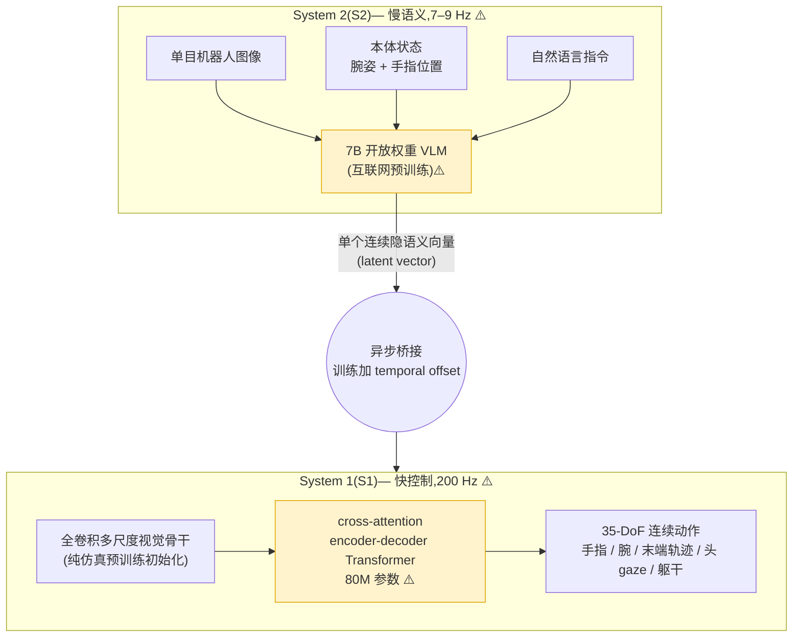

# Helix:用单一权重高速控制人形上半身的双系统 VLA(Figure AI)

> **arXiv**: 无论文(官方新闻页 figure.ai/news/helix) · Figure AI · 2025.02 · **路线**:双系统(System 2 慢语义 VLM + System 1 快连续控制)· **单个连续隐语义向量**桥接 · 频率解耦/异步 · 35-DoF 全上半身连续控制
> [← 返回主报告](../index.md)

---

> ⚠️ **全文事实纪律(本页命脉)**:Helix **没有任何论文、技术报告或公开评测**,所有内容均来自 Figure AI 的两篇官方**新闻稿**([Helix 发布页](https://www.figure.ai/news/helix),2025-02-20;[Scaling Helix 物流页](https://www.figure.ai/news/scaling-helix-logistics))与二手报道。**本页几乎每一个数字都是 Figure 厂商自报、无同行评审、无第三方独立复现**,凡涉定量一律标 ⚠️。后续 **Helix-02 的所有细节均为二手源 / 厂商新闻 + 直播**,可信度更低,单独标注。读本页请把它当作"工程声明 + 营销 demo"而非"学术结果"。

---

## TL;DR

Helix 是 Figure AI 于 **2025 年 2 月** 发布的 VLA 模型,Figure 自称是**首个用单一神经网络权重、以高频连续控制人形机器人整个上半身(35 自由度)的通用 VLA**。它采用一套**显式双系统(System 1 / System 2)架构**,但与 [GR00T N1](groot-n1.md) 的"端到端联合训练 + 交叉注意力桥接"路线在工程取向上不同,Helix 的卖点集中在**频率解耦与异步**这一设计思想上:

- **System 2(S2,慢语义)**:一个**7B 参数、开放权重的互联网预训练 VLM** ⚠️,以 **7–9 Hz** ⚠️ 低速运行,把单目机器人图像 + 本体状态(腕姿、手指位置)+ 自然语言指令,**蒸馏成一个连续隐语义向量(a single continuous latent vector)**,作为"意图"传给 S1。
- **System 1(S1,快控制)**:一个 **80M 参数的交叉注意力 encoder-decoder Transformer** ⚠️,以 **200 Hz** ⚠️ 高频运行,把 S2 的隐向量当作条件,输出 **35-DoF** 连续动作(手指、腕、末端轨迹、头部 gaze、躯干姿态)。视觉走一个**全卷积、多尺度骨干**,在**纯仿真**里预训练初始化。

两系统**异步、不同频率运行**,通过**一个连续隐向量**这一窄接口耦合;训练时人为引入 **S1 与 S2 输入之间的时间偏移(temporal offset)**,以模拟部署时两者的推理延迟差。整套行为只用了 **约 500 小时遥操作数据** ⚠️ 训练(Figure 称不到既往 VLA 数据集规模的 **5%**),并用一个**自动标注 VLM** 为视频片段生成事后(hindsight)语言指令。Figure 还宣称 Helix 是**首个同时驱动两台机器人协作**的 VLA(双机搬运杂货 demo),且**单一权重**即可完成抓取、放置、开抽屉/冰箱、操作上千种训练中未见过的新物体,**无需任务特定微调**。

> ⚠️ 关键落差:**无论文、无公开权重/数据/代码、无独立基准评测、所有成功率/速度均为厂商自评 + 选片 demo**;Helix-02(2026 年的物流升级版)细节进一步只有二手源。详见 §5。

---

## 1. 要解决的问题

Helix 想同时解决的是人形机器人通用控制里几条互相打架的张力(与 [GR00T N1](groot-n1.md)、[Gemini Robotics](gemini-robotics.md) 面对的问题同构):

1. **"想得对"与"动得快"频率冲突**:承载世界知识与语言理解的大 VLM 单次前向只能跑到**十 Hz 量级**(Helix 的 7B S2 为 7–9 Hz ⚠️);而人形上半身、五指灵巧手的接触丰富操作需要**百 Hz 量级**闭环(S1 为 200 Hz ⚠️)。单一模型无法同时满足两者。
2. **高自由度全上半身的统一控制**:人形上半身自由度高(Figure 02 约 35 DoF,双手各 16 DoF,见 [robots](robots.md)),需要一个能**同时协调手指、腕、躯干、头部**的策略,而非每部位/每任务一个控制器。
3. **真机数据稀缺 + 不靠每任务微调泛化**:遥操作轨迹昂贵稀少。Helix 主张用**约 500 小时** ⚠️ 的小数据 + 自动语言标注,训练出能对**上千种未见物体**零样本泛化、且**单一权重跨任务**的策略,而非"采一批数据训一个专用技能"。
4. **上车部署**:模型必须能在机器人**本机的低功耗嵌入式 GPU** 上实时跑,而非依赖云端(对比 [Gemini Robotics](gemini-robotics.md) 的云-端拆分)。

Helix 的回答:**双系统频率解耦**——慢 VLM 产出"意图隐向量",快控制器高频消费;**单一权重 + 小数据 + 自动标注**做泛化;**双嵌入式 GPU 本机推理**做部署。

---

## 2. 方法与架构

*图注:Helix 双系统数据流(据 figure.ai/news/helix 文字描述重建,Figure 未公开正式架构图论文版)。S2 把图像+状态+语言"蒸馏成单个连续隐向量",经异步窄接口喂给 S1;S1 以此为条件高频输出整个上半身的连续动作。**两系统拆在不同的专用处理器上、以不同频率运行**(model-parallel inference)。*

### 2.1 双系统机理:频率解耦 / 异步(本页重点)

Helix 与 GR00T N1、Gemini Robotics 同属"慢 System 2 + 快 System 1"的双系统范式,但理解 Helix 的关键是**它把"频率解耦/异步"当作第一性的设计思想**,而不是把双系统当成单纯的"大脑+小脑"叙事。三个要点:

- **两套独立网络、两个频率**:S2(7B VLM)与 S1(80M Transformer)是**两个分开的网络**,分别以 **7–9 Hz** 与 **200 Hz** 运行 ⚠️。这与本站 [dual-system-architecture](dual-system-architecture.md) 给出的"双系统三件套"判据(两套网络 + 独立频率 + 异步接口)完全吻合;Helix 是典型的**真·频率解耦**,不像 [π0](pi0.md) 的"动作专家"只是同一主干内的另一套权重/输出头。
- **窄接口 = 单个连续隐向量**:S2 不向 S1 输出离散子任务文本(对比 [π0.5](pi05.md) 高层显式解码"拿起盘子"这样的语言子任务),而是把**所有任务相关语义压成一个连续 latent vector**。这意味着 S1 不需要理解语言,只需学会"把这个隐向量翻译成高频动作"——接口窄、带宽低,正好配合 200 Hz 的实时性。
- **异步 + 训练时 temporal offset**:部署时 S2(慢)与 S1(快)天然存在推理延迟差,S1 在两次 S2 更新之间会**复用同一个隐向量连续高频执行**。为让训练分布匹配这种异步,Figure 在训练时**人为在 S1 与 S2 的输入之间插入时间偏移**,模拟部署的延迟错位。这是 Helix 在"频率解耦"上少有的、可被点名的具体训练技巧(虽仍无论文级细节)。

> 📌 一句话机理:**Helix = 慢 VLM 低频产出"一个意图隐向量",快控制器把这个向量当条件、在它过期前用 200 Hz 把整个上半身动作填满,训练时用 temporal offset 把异步缝进数据分布。** 本站此前只有"7B/80M/7–9Hz/200Hz"这些数字,机理(隐向量窄接口 + 异步 offset)在此补齐。

### 2.2 System 2:7B 开放权重 VLM(7–9 Hz)

- **身份**:一个**互联网规模预训练的开放权重 VLM,约 7B 参数** ⚠️。Figure 未公开它具体基于哪个开源模型(新闻稿只说"open-source, open-weight VLM"),**底座型号待核**。
- **输入**:单目机器人图像 + 机器人本体状态(腕姿 wrist pose + 手指位置 finger positions)+ 自然语言指令。
- **输出**:不是动作、也不是子任务文本,而是**一个连续隐语义向量**,编码"此刻该做什么"的全部任务语义。
- **频率**:7–9 Hz ⚠️,慢但承载语言理解与开放世界泛化(认得上千种未见物体靠的是它的预训练知识)。

### 2.3 System 1:80M 交叉注意力 encoder-decoder(200 Hz)

- **身份**:一个 **80M 参数的 cross-attention encoder-decoder Transformer** ⚠️。
- **桥接**:通过**交叉注意力**把 S2 的隐向量作为条件注入——隐向量是"被 attend 的 memory",动作 token 是 query。
- **视觉**:S1 自带一个**全卷积、多尺度视觉骨干**做高频视觉处理,**完全在仿真里预训练**后初始化(再随真机数据端到端训练)。
- **输出与频率**:以 **200 Hz** ⚠️ 输出 **35-DoF** 连续控制——覆盖每根手指、腕、末端轨迹、头部 gaze、躯干姿态。

### 2.4 训练:约 500 小时遥操作 + 自动语言标注 + 端到端

- **数据**:约 **500 小时** ⚠️ 的多机器人、多操作员**遥操作**行为;Figure 称这不到既往 VLA 数据集规模的 **5%** ⚠️。
- **自动标注**:用一个**自动标注 VLM** 看视频片段、生成**事后(hindsight)自然语言指令**("视频里这段在做什么"),省去人工逐条标语言。
- **训练形态**:**完全端到端**,从原始像素 + 文本指令直接映射到连续动作;两系统一起训练,训练时对 S1/S2 输入加 temporal offset(见 §2.1)。
- **部署**:每台机器人用**两块低功耗嵌入式 GPU**,把 S2 与 S1 分到不同处理器上做 **model-parallel 推理**——这正是双系统在硬件上"物理拆开"的体现。硬件本体参数(Figure 02 约 35 DoF、双手 16 DoF 灵巧手)交叉见 [robots](robots.md)。

### 2.5 35-DoF 全上半身连续控制 vs π0 / GR00T 的动作头差异

这是 Helix 区别于其他 VLA 动作输出端的关键一点:

| 维度 | **Helix(S1)** | [π0](pi0.md) / [π0.5](pi05.md) action expert | [GR00T N1](groot-n1.md) DiT(System 1) |
|---|---|---|---|
| 动作生成机制 | **cross-attention encoder-decoder 直接回归连续动作** ⚠️ | **流匹配(flow matching)** 去噪生成连续动作块 | **流匹配 DiT**(velocity 预测)去噪动作块 |
| 是否独立网络/频率 | **是**,80M 独立网络 @ 200Hz | 否,动作专家是**同一主干内的另一套权重** | 是,DiT 是独立模块 @ 120Hz,但**与 VLM 端到端联合训练、交叉注意力桥接** |
| 与上层桥接 | **单个连续隐向量**(窄接口,S1 不读语言) | 共享主干 token / 高层 FAST 离散子任务(π0.5) | VLM token 经**交叉注意力**注入 DiT |
| 控制维度声明 | **35-DoF 全上半身**(手指/腕/末端/头/躯干) | 各平台关节(如 ALOHA 双臂 14-DoF) | 跨本体(单臂到双臂人形),相对末端执行器空间 |
| 去噪迭代成本 | **无**(单次前向回归),利于 200Hz | 有(多步去噪/积分) | 有(多步) |

差异要点:**Helix 的 S1 用"一次前向回归"而非"多步去噪"出动作**,这正是它能宣称 200 Hz 的结构前提——扩散/流匹配头(π0、GR00T)每步动作要多次迭代去噪,频率天花板天然更低(π0.5 为 50 Hz、GR00T 为 120 Hz)。代价是**回归式动作头在多模态动作分布上的表达力理论上弱于扩散头**(易学成"平均动作"),但 Figure 未公开任何对比数据来证伪或证实,**此项待核**。

### 2.6 单一权重驱动双机器人协作的工程含义

Figure 称 Helix 是**首个能同时运行在两台机器人上、用同一套权重驱动它们协作**的 VLA(demo:两台 Figure 机器人协作把杂货放进冰箱,物体为训练中未见过)。其工程含义:

- **权重共享 ≠ 集中控制**:两台机器人各跑一份**相同**的 Helix 权重,各自接收**各自**的图像/状态/同一条语言指令("把杂货收起来"),靠**视觉观察彼此**来隐式协调,而非有一个中央调度器。这把"多机协作"从"显式通信/任务分配系统"压缩成了"同一策略 + 共享语言目标 + 互相看见"。
- **对数据效率的暗示**:若单一权重无需任务微调就能泛化到双机协作与上千新物体,说明 S2 的预训练语义 + S1 的小数据控制确实承载了大部分泛化——但这一论断**仅靠 demo 支撑,无成功率/失败率统计**,见 §5。

---

## 3. 关键设计与创新点

1. **频率解耦做成产品级双系统**(§2.1):7–9 Hz 慢语义 + 200 Hz 快控制,两套独立网络、异步、单隐向量窄接口,且用 **temporal offset** 把异步缝进训练分布。这是 Helix 相对学术双系统(GR00T N1)最"工程化"的地方。
2. **隐向量桥接而非语言子任务桥接**:S2→S1 只传**一个连续 latent**,S1 不需理解语言(对比 [π0.5](pi05.md) 显式解码语言子任务)。接口窄、带宽低,服务于高频。
3. **回归式 S1 换取 200 Hz**(§2.5):用 cross-attention encoder-decoder 单次前向回归动作,避开扩散/流匹配的多步去噪,换来比 π0(50Hz)/GR00T(120Hz)更高的标称频率。
4. **35-DoF 全上半身统一控制**:单一策略同时协调手指/腕/末端/头/躯干,而非分部位控制器。
5. **小数据 + 自动语言标注**:约 500h(<5% of 既往 VLA 数据)+ hindsight VLM 自动标注,降低语言标注成本。
6. **单一权重 + 双机协作 + 本机双 GPU 部署**:无任务微调跨任务/跨物体/跨双机泛化,且全程本机低功耗 GPU。

---

## 4. 实验与关键结果

> ⚠️⚠️ **本节所有数字均为 Figure 厂商自评 / 直播 demo / 二手报道,无同行评审、无独立基准、无公开评测协议**。表中"成绩"应读作"Figure 的宣传声明"。

### 4.1 Helix(2025.02 发布)声明

| 声明项 | 数值 / 描述 | 性质 |
|---|---|---|
| S2 规模 / 频率 | 7B 开放权重 VLM / 7–9 Hz | ⚠️ 厂商自评 |
| S1 规模 / 频率 | 80M cross-attention encoder-decoder / 200 Hz | ⚠️ 厂商自评 |
| 控制维度 | 35-DoF 全上半身 @ 200Hz | ⚠️ 厂商自评 |
| 训练数据 | 约 500h 遥操作(<5% of 既往 VLA 数据集) | ⚠️ 厂商自评 |
| 新物体泛化 | 上千种训练中未见物体、杂乱场景中抓取,无演示 | ⚠️ demo,无成功率 |
| 多机协作 | "首个"同时驱动两台机器人协作的 VLA(双机收纳杂货) | ⚠️ demo,无统计 |
| 任务微调 | 单一权重完成抓取/放置/开抽屉/开冰箱,无任务特定微调 | ⚠️ demo,无统计 |

### 4.2 Helix-02(2026,**全部二手源** ⚠️)

Helix-02 是 Figure 在 2026 年用于物流分拣的升级版,信息主要来自 [Scaling Helix 物流页](https://www.figure.ai/news/scaling-helix-logistics) 与直播/二手报道(techtimes、interestingengineering、humanoidsdaily 等):

| 声明项 | 数值 | 性质 |
|---|---|---|
| 每件包裹处理时间 | 4.05s(初部署约 5.0s,~20% 提速) | ⚠️ 厂商自评/二手 |
| 数据缩放下处理时间 | 6.84s(10h 数据)→ 4.31s(60h 数据) | ⚠️ 厂商自评 |
| 条码识别成功率 | 约 95%(初部署约 70%);60h 数据 94.4% / 10h 数据 88.2% | ⚠️ 厂商自评 |
| 架构新增 | ① 视觉记忆模块(stateful 时序感知)② 本体状态历史 ③ **力反馈**进入观测 ④ transformer decoder head 参数 +50% | ⚠️ 厂商自评/二手 |
| 长时自主运行 demo | 8 小时直播(2026-05)、二手称多日累计十万级包裹 | ⚠️ 直播 + 二手,无审计 |

> ⚠️ **Helix-02 一手细节(参数/频率是否变化)在新闻稿中并未与 Helix 逐项对齐**;"decoder head +50%"是少数明确的架构改动声明。其余长程自主运行的包裹总数等多为社媒/二手转述,**未经独立审计**。

---

## 5. 局限与争议

- **无论文 / 无公开权重 / 无数据 / 无代码 / 无基准**:Helix 只有新闻稿,**完全无法被独立复现或核查**。这与 [GR00T N1](groot-n1.md)(开放 2B 权重 + 仿真基准)、[π0](pi0.md)(有 arXiv 报告)形成鲜明对比——本站把它列为**可信度最低档**之一的原因正在于此。
- **数字全是厂商自评**:7B/80M、7–9Hz/200Hz、35-DoF、500h、各类成功率/速度,**没有任何一项经第三方在统一协议下评测**。
- **demo 选片争议(必须写清)**:Figure 的演示长期被质疑——
  - 短视频可隐藏 reset、人工介入、选择性成功;
  - 2026 年 5 月的 **8 小时 / 多日直播**虽被 Figure(CEO Brett Adcock)强调"**无遥操作,每个动作都来自 Helix-02**",意在用"长时直播比短剪辑更难造假"回应质疑;
  - 但直播中仍出现**机器人疑似"挠头"等动作**被外界解读为遥操作嫌疑;Sunday Robotics CEO Tony Zhao 公开质疑 Figure 的装洗碗机 demo **物体全是塑料**,回避了易碎陶瓷/玻璃,质疑其与真实场景的差距("Dishwasher Wars")。
  - 更宏观地,Figure 的"**autonomy-first / 无遥操作**"路线与 1X(NEO)"**human-in-the-loop / 数据优先**"路线形成行业路线之争,双方都被质疑"selling the dream"。
- **回归式 S1 的动作表达力**:用单次前向回归而非扩散/流匹配,理论上在多模态动作分布上可能表达力偏弱(易回归到均值动作),Figure 无数据回应,**待核**。
- **Helix-02 全为二手**:升级版的关键改动(力反馈、视觉记忆、+50% decoder head)与长程自主声明缺乏一手技术细节与独立审计。
- **底座型号未公开**:S2 的 7B"开放权重 VLM"具体是哪个模型未明,**待核**。

---

## 6. 在 VLA 谱系中的位置

Helix 是**工业界"频率解耦双系统"的代表声明之一**,与 [GR00T N1](groot-n1.md)、[Gemini Robotics](gemini-robotics.md) 同属"慢 System 2 + 快 System 1"的分层/双系统范式(横切分析见 [dual-system-architecture](dual-system-architecture.md))。它的独特标签是:**最窄的桥接接口(单个连续隐向量)+ 回归式高频 S1(200Hz)+ 单一权重双机协作 + 本机双 GPU 部署**;但同时它也是这批前沿模型里**最不透明**的一个。

横向对照(落差点重点在"可核查性"):

| 模型 | 机构 / 公开度 | 双系统形态 | 动作头 | 频率 | 数据 | 可核查性(关键落差) |
|---|---|---|---|---|---|---|
| **Helix** | Figure AI / **无论文、无权重、无数据** | S2 7B VLM + S1 80M;**单隐向量**异步桥接 | **回归式** cross-attn enc-dec | 7–9Hz / **200Hz** ⚠️ | **约 500h 遥操作**(非公开)⚠️ | **最低**:仅新闻稿;demo 选片争议;Helix-02 二手 |
| [GR00T N1](groot-n1.md) | NVIDIA / **开放权重+数据+仿真基准** | S2 Eagle-2 VLM + S1 DiT;**交叉注意力**端到端联合训练 | 流匹配 DiT | ~10Hz / 120Hz ⚠️ | 数据金字塔(人类视频+合成+真机) | 中:有 arXiv + 开放 2B 权重,但评测多为自评/仿真 |
| [π0.5](pi05.md) | Physical Intelligence / 有 arXiv | 单模型内分层:高层 FAST **语言子任务** + 底层流匹配 | 流匹配 action expert | 50Hz ⚠️ | 异构 co-training,真实住宅长程 | 中:有论文,真机长程任务为一手验证目标 |
| [Gemini Robotics](gemini-robotics.md) | Google DeepMind / 有技术报告 | 云端 backbone + 本机 decoder | 本机 action decoder | 端到端 ~250ms / 等效 **50Hz** | ALOHA 2 等 | 中:有报告;依赖云端 |

一句话定位:**Helix 在"频率解耦双系统"的工程叙事上做得最干脆(隐向量 + 回归 200Hz + 双机单权重),但在"能不能被信"这一维度上,它是横向对照里垫底的——没有论文、没有权重、没有公开数据,几乎所有结论都建立在 Figure 自家 demo 之上。** 它更应被读作"一份强有力的工程能力声明 + 营销",而非可复现的科研成果。

---

## 来源

- Figure AI 官方发布页(无论文):**Helix: A Vision-Language-Action Model for Generalist Humanoid Control**,figure.ai/news/helix(2025-02-20)— <https://www.figure.ai/news/helix>
- Figure AI 官方升级页:**Scaling Helix: a New State of the Art in Humanoid Logistics**(Helix-02 物流)— <https://www.figure.ai/news/scaling-helix-logistics>
- Humanoids Daily:Figure 重组为 Helix AI 团队 — <https://www.humanoidsdaily.com/news/figure-ai-reorganizes-to-boost-humanoid-learning-with-new-helix-ai-model>
- Humanoids Daily:Autonomy vs. Teleop,Brett Adcock 回应 F.03 直播质疑 — <https://www.humanoidsdaily.com/news/autonomy-vs-teleop-brett-adcock-defends-figure-03-amidst-smoking-gun-skepticism>
- Humanoids Daily:"Dishwasher Wars",Figure 与 Sunday Robotics 玻璃器皿 demo 之争 — <https://www.humanoidsdaily.com/news/the-dishwasher-wars-figure-fires-back-at-sunday-robotics-with-glassware-demo>
- TechTimes:Helix-02 机器人完成 8 小时自主轮班(二手)— <https://www.techtimes.com/articles/316632/20260514/figure-ais-helix-02-robots-complete-full-8-hour-autonomous-shifts-humanoid-race-intensifies.htm>
- Interesting Engineering:Figure 人形 24 小时自主分拣 28,000 件包裹(二手)— <https://interestingengineering.com/ai-robotics/figure-ai-humanoids-24-hour-autonomous-run>
- 本站交叉引用:[dual-system-architecture](dual-system-architecture.md) · [groot-n1](groot-n1.md) · [pi0](pi0.md) · [pi05](pi05.md) · [gemini-robotics](gemini-robotics.md) · [robots](robots.md) · [glossary](glossary.md)
