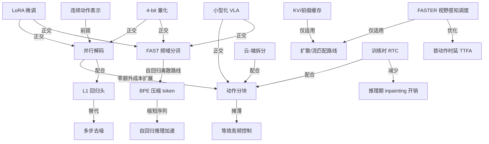
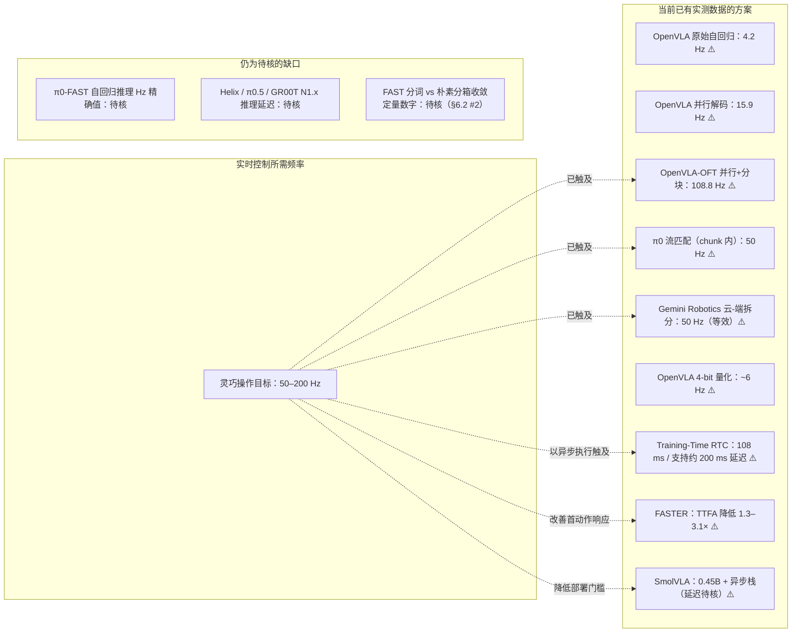

# VLA 推理加速与量化部署

> [← 返回主报告](../index.md)

---

## 一、VLA 为什么慢

VLA 的推理延迟来自三个相互叠加的结构性原因:

**1. 自回归逐 token 生成**
以 OpenVLA 为代表的离散 token 路线把每个动作维度量化成一个离散 token,再由 LLM 逐个串行解码。预测一个 7 维动作需要顺序完成 7 次前向,7B 主干每次都要被完整唤醒。实测结果：OpenVLA(7B Llama 2)在 A100 上动作生成吞吐仅 **4.2 Hz**、单次查询延迟约 **0.24 s**（来源：[OpenVLA-OFT](openvla-oft.md) 原文 Table II）。即便做了 4-bit 量化，裸跑也只有约 **6 Hz**（来源：[OpenVLA](openvla.md) §5.4）。

**2. 大主干的体量**
通用 VLM 主干（Llama 2 7B、Gemma3 4B、PaliGemma 3B 等）承载互联网语义先验，参数量巨大。每次闭环控制都要完整过一遍主干——即便动作空间本身只有 7–18 维，语义理解的开销也是固定的。RT-2 使用 55B PaLI-X，联网查询多 TPU 云服务只能达到 **1–3 Hz**（来源：[Gemini Robotics](gemini-robotics.md) §1）。

**3. 多步去噪的固有开销**
扩散/流匹配路线（π0、GR00T N1 等）以多步迭代采样生成连续动作，每步都需要完整前向。π0 在 RTX 4090 上用 10 步流匹配生成一个动作块约 **100 ms/chunk**（来源：[π0-FAST](pi0-fast.md) 表 B，作者自评 ⚠️）；π0-FAST 切换为自回归离散后，虽去掉了去噪步骤，但需串行解码 30–60 个动作 token，延迟反而升至约 **750 ms/chunk**（同源 ⚠️）。"多步去噪"与"长 token 序列自回归"是两种不同的延迟来源，二者都是实时部署的瓶颈。

这三个原因共同制造了"**实时推理延迟缺口**"——灵巧操作需要 50–200 Hz 的闭环控制频率，而未经优化的 VLA 通常只能做到个位数 Hz，差距达 1–2 个数量级。这正是主报告 §6.2 所列缺口第 5 条的根源所在。

### 先统一四个容易混淆的口径

VLA 论文里常把 "Hz"、"latency"、"real-time" 混着写。做部署判断时，至少要把下面四个量分开：

| 口径 | 问的是什么 | 常见误读 | 部署时怎么用 |
|---|---|---|---|
| **模型查询吞吐**（query Hz） | 模型每秒能响应多少次新观测 | 把 100 Hz 查询吞吐误当作机器人每 10 ms 都重看世界 | 衡量模型服务本身快不快，OpenVLA-OFT 的 108.8 Hz 属于这一类 |
| **端到端响应延迟**（obs → action/chunk） | 从观测送入到动作块可用要多久 | 只看 chunk 内 50 Hz，却忽略新观测更新可能要 100–250 ms | 决定机器人对外界变化的反应慢不慢，Gemini Robotics 的 ≈250 ms、Training-Time RTC 的 108 ms 属于这一类 |
| **chunk 内控制频率** | 动作块一旦生成，底层控制器按多少 Hz 执行动作 | 把 chunk 内 50 Hz 当成模型每 20 ms 推理一次 | 衡量轨迹执行是否平滑；π0 的 50 步 chunk @ 50 Hz 是"执行频率"，不是"重新感知频率" |
| **首动作时延**（TTFA） | 等多久才能派发当前 chunk 的第一个动作 | 只看整块生成耗时，忽略动态任务最需要第一步先出来 | FASTER 这类方法专门优化 TTFA；它提升的是"先动起来"，不是必然提升整块吞吐 |

一个简化的部署约束是：若控制频率为 `f_ctrl`、chunk 长度为 `H`，则 chunk 覆盖时长约为 `H / f_ctrl`。异步 RTC 要想不断流，模型端到端延迟最好落在这个覆盖时长内；但若任务里物体/人/环境变化很快，还要额外压低 **TTFA** 和重新查询周期，否则"执行很平滑"也可能"反应很慢"。

---

## 二、加速手段总表（按层归类）

> 说明：⚠️ = 厂商/作者自评数字，未经独立第三方复现；✅ = 基准维护方统一评测；"待核" = 已核语料中无一手数据。标注"可叠加"/"互斥"见第四节。

### 算法层

| 手段 | 机制（一句话） | 代表工作 | 实测增益 | 细读 |
|---|---|---|---|---|
| **并行解码** | 用双向注意力 + 空动作占位嵌入，把自回归串行生成 D 步改为单次前向同时输出所有维度 | OpenVLA-OFT | 吞吐 4.2 → **15.9 Hz**（仅并行解码，A100）⚠️ | [OpenVLA-OFT](openvla-oft.md) §2.1 |
| **并行解码 + 动作分块** | 并行解码后再插入 K 倍占位槽，单次前向输出 K 步动作块，摊薄主干开销 | OpenVLA-OFT（K=8/25） | 吞吐 4.2 → **108.8 Hz**（约 26×，A100）⚠️ | [OpenVLA-OFT](openvla-oft.md) Table II |
| **减少去噪步数** | 流匹配/扩散推理时用更少的数值积分步（π0 用 10 步欧拉积分而非 DDPM 的数百步 MCMC） | π0（10 步流匹配） | 支撑 50 Hz 高频灵巧控制（chunk 内摊薄）⚠️ | [π0](pi0.md) §2.3 |
| **视野感知采样调度** | 给近未来动作分配更激进的去噪步数，首个动作可单步采样；远期动作保留慢去噪 | FASTER（Horizon-Aware Schedule） | 在 π0.5、X-VLA 上把首动作时延（TTFA）降低约 **1.3–3.1×** ⚠️；不改架构、免训练 | [FASTER](faster.md) |
| **动作分块摊薄推理** | 一次生成 H 步动作序列，执行期间无需重新查询模型，等效控制频率 = H / 推理延迟 | π0（H=50）、OpenVLA-OFT（K=8/25）、π0.7（50 token chunk） | π0：50 步 chunk + 10 步去噪 → 50 Hz ⚠️；π0.7：最大推理延迟约 240 ms + RTC ⚠️ | [π0](pi0.md)、[pi07.md](pi07.md) |
| **L1 回归替代扩散头** | 用单次前向的 MLP 回归连续动作，消除多步去噪的固有开销 | OpenVLA-OFT（L1 vs 50步 Cont-Diffusion） | L1 头比 50 步 DDIM 快且精度持平甚至更优（高精度任务 100% vs 失败）⚠️ | [OpenVLA-OFT](openvla-oft.md) §2.4 |

### 表示层

| 手段 | 机制（一句话） | 代表工作 | 实测增益 | 细读 |
|---|---|---|---|---|
| **FAST 频域分词** | 对动作序列做 DCT 频域变换后量化、再用 BPE 压缩，把高频冗余动作 token 压缩成少量紧凑 token | π0-FAST、FAST+ | 1 秒 chunk 压缩到约 30 token/臂（双臂 ~60），vs 朴素分箱轻易数百；训练收敛约 **5× 更快**（vs 流匹配 π0）⚠️；高频任务（50 Hz T 恤折叠）朴素分箱无法完成、FAST 可完成 ⚠️ | [pi0-fast.md](pi0-fast.md) |
| **连续动作表示（去离散化）** | 去掉 256-bin 离散化层，换成 MLP 直接回归连续值，消除量化误差并使并行解码成立 | OpenVLA-OFT | 联动并行解码，是 26× 吞吐提升的前提条件 ⚠️ | [OpenVLA-OFT](openvla-oft.md) §2.3 |

### 系统层

| 手段 | 机制（一句话） | 代表工作 | 实测增益 | 细读 |
|---|---|---|---|---|
| **KV/前缀缓存** | 图像 + 语言条件的注意力 K/V 只算一次并缓存，多步去噪迭代只重算动作 token 后缀 | π0（推理时缓存图文 + 状态块） | 使 10 步流匹配迭代的实际开销可控，支撑 RTX 4090 上 ~100 ms/chunk ⚠️ | [π0](pi0.md) §2.3 |
| **云-端拆分 + 异步 chunk** | 将重量级 VLM backbone 放云端（query→response < 160 ms），轻量 action decoder 在本机；backbone 一次返回 action chunk，本机逐步展开执行同时异步发起下一次 query | Gemini Robotics | 端到端 raw obs → action chunk ≈ **250 ms**；等效控制频率 **50 Hz** ⚠️ | [gemini-robotics.md](gemini-robotics.md) §2.2 |
| **异步推理栈** | 客户端消费动作队列，服务端并行计算下一段 action chunk，把感知/预测与执行解耦 | SmolVLA / LeRobot | 不给统一硬件延迟；主张固定时间内完成更多任务，收益依赖队列阈值、网络与算力配置 ⚠️ | [smolvla.md](smolvla.md) §2.2 |
| **实时动作分块（RTC）** | 训练时随机模拟 0–12 时间步的推理延迟，使模型在不同延迟下均能输出平滑动作 chunk | π0.7 | 最大推理延迟约 240 ms 下仍可用于实时控制 ⚠️（社区报道最坏约 127 ms，口径待核） | [pi07.md](pi07.md) §2.1 |
| **训练时动作条件化（Training-Time RTC）** | 训练时采样推理延迟，把前一 chunk 已承诺动作作为非噪声 action prefix 输入，只对 postfix 计算损失；推理时不再做 inpainting / VJP 反传 | Training-Time Action Conditioning for Efficient Real-Time Chunking（PI / Levine, arXiv:2512.05964） | H100 远端 5 步去噪：端到端延迟 **108 ms** vs 推理时 RTC **135 ms**；50 Hz 机器人上训练采样 0–10 步延迟，支持最高约 **200 ms** 延迟；仿真高延迟下优于推理时 RTC，真机装箱 / 意式咖啡任务性能与速度基本持平 ⚠️ | 本页第四节 RTC 小节、第五节；[arXiv:2512.05964](https://arxiv.org/abs/2512.05964) |

### 模型体量 / 权重层

| 手段 | 机制（一句话） | 代表工作 | 实测增益 | 细读 |
|---|---|---|---|---|
| **小型化 VLA** | 缩小 VLM 骨干、动作专家与视觉 token 数，直接降低训练/推理硬件门槛 | SmolVLA | 全模型约 **0.45B** 参数、动作专家约 0.1B；目标是单卡可训、消费级 GPU 甚至 CPU 可部署 ⚠️ | [smolvla.md](smolvla.md) |
| **LoRA 微调** | 只训练约 1.4% 的低秩增量参数（rank=32），大幅降低适配新任务的算力门槛 | OpenVLA | LoRA 68.2% vs 全量 69.7%（Franka-Tabletop），单卡 ~60 GB 显存即可完成微调 ⚠️ | [openvla.md](openvla.md) §2.3 |
| **4-bit 量化（int4）** | 将权重压缩到 4-bit 整数，显存减半以上，Ada Lovelace 架构 GPU 上吞吐反而更高 | OpenVLA | Bridge 成功率 71.9%（int4）vs 71.3%（bf16）；显存 7.0 GB vs 15–16.8 GB；RTX 4090 约 **6 Hz** ⚠️ | [openvla.md](openvla.md) §2.3 |
| **蒸馏压缩** | 用知识蒸馏把前沿 VLM backbone 压缩到推理可接受的延迟（Gemini Robotics-ER 蒸馏版 < 160 ms） | Gemini Robotics | backbone query→response 从"秒级"压到 < 160 ms ⚠️ | [gemini-robotics.md](gemini-robotics.md) §2.2 |

---

## 三、部署选型：先看约束再选路线

推理部署不是简单追求"Hz 越高越好"，而是先问清楚三件事：**任务需要多快反应**、**硬件/网络能给多少预算**、**能不能重新训练或微调**。下面是一张实用选型表：

| 你的约束 | 优先考虑 | 为什么 | 主要风险 |
|---|---|---|---|
| 已有 OpenVLA / 自回归离散 VLA，想在微调阶段提速 | **OpenVLA-OFT：连续表示 + 并行解码 + 分块** | 不换主干，直接改动作接口；速度收益最大且有 LIBERO / ALOHA 实测 | 需要改训练接口；离散动作 token 路线会被替换成连续回归 |
| 已有 flow / diffusion VLA，不能重新训练，只想减少首动作等待 | **FASTER / 视野感知采样调度** | 免训练、即插即用，专门压 TTFA；适合动态任务先派发近未来动作 | 只验证 flow-based VLA；提升的是首动作时延，不等于整体 query Hz |
| 已有 flow VLA，可以微调，部署延迟分布相对可预估 | **Training-Time RTC** | 把 chunk 间连续性约束提前学进模型，推理时省掉 inpainting 反传开销 | 延迟分布要训练时覆盖；硬 prefix 不如推理时 soft masking 灵活 |
| 可接受云端 / 边缘服务器，现场网络稳定 | **云-端拆分 + 异步 chunk** | 把重主干放云端，本地只执行动作队列；适合高价值商用场景 | 断网/抖动会直接影响控制；安全兜底要单独设计 |
| 要在消费级硬件、教学或开源复现里跑 | **SmolVLA / 小模型 + 量化 + LoRA** | 降低训练与部署门槛，便于本地迭代 | 小模型不自动等于高频；还要测端到端延迟和任务成功率 |
| 仍坚持自回归离散动作，但要吃高频轨迹 | **FAST / FAST+** | 频域压缩把动作 token 序列变短，改善训练与高频数据学习 | 单 chunk 自回归延迟仍可能高；需与推测解码、量化、kernel 优化等叠加 |
| 长程灵巧任务，需要连续、平滑且不在 chunk 边界抖 | **动作分块 + RTC / Training-Time RTC** | 分块负责平滑轨迹，RTC 负责异步衔接，训练时 RTC 进一步降推理开销 | 平滑不等于反应快；还要监控 TTFA 与重新查询周期 |

**落地检查清单**：

1. 先定目标：控制频率 `f_ctrl`、可接受端到端延迟、最大网络抖动、是否允许云端。
2. 分开测四个指标：query Hz、obs→chunk 延迟、chunk 内执行频率、TTFA。
3. 不只看空跑速度：同一硬件上同时记录成功率、失败模式、轨迹抖动、超时率。
4. 若用 RTC：把真实部署中的延迟分布采出来，再决定训练时 delay 采样范围。
5. 若上真机：任何云端 / 异步方案都要有本地急停、队列耗尽策略、动作过期检查。

---

## 四、可叠加性与互斥关系

### 可叠加的组合

| 组合 | 叠加逻辑 |
|---|---|
| **连续表示 → 并行解码 → 动作分块** | 强依赖链：连续表示让动作可由 MLP 头回归；并行解码使单次前向同时输出所有维度；动作分块在此基础上几乎零额外成本地扩展输出步数。这三者是 OpenVLA-OFT 26× 提速的完整逻辑链 |
| **并行解码 + L1 回归** | 并行解码已消除自回归串行开销，L1 回归进一步消除扩散的多步去噪——两者都作用于"减少前向次数"，正交叠加 |
| **云-端拆分 + 动作分块** | 云端 backbone 一次返回完整 chunk，本机逐步展开执行；chunk 越长，等效控制频率越高，二者天然协同（Gemini Robotics 正是此组合） |
| **KV 缓存 + 减少去噪步数** | 缓存消除图文 token 的重复计算，少步去噪减少动作 token 的前向次数，分别作用于不同 token 集合，正交叠加 |
| **LoRA / 量化 + 任意上述手段** | LoRA 和量化作用于权重存储和微调效率，与算法/表示/系统层手段完全正交，可自由叠加 |
| **FAST + 自回归路线任意优化** | FAST 是分词器层面的改造，只要维持"离散 token → 自回归预测"的接口，可叠加 KV 缓存、量化等工程手段 |
| **FASTER + RTC / 动作分块** | FASTER 优化的是首动作时延，RTC 和动作分块解决的是 chunk 执行期间的连续性与不断流；前者抢第一步，后者稳边界，作用点不同 |
| **训练时 RTC + 异步动作分块** | RTC 解决的是"下一段 chunk 还在推理时，当前机器人不能停下来"的问题；训练时 action conditioning 把原本推理时 inpainting 的连续性约束提前学进模型，因此可与异步 chunk 调度直接叠加 |
| **小型化 VLA + LoRA / 量化 / 异步栈** | 小模型降低基础算力门槛，LoRA 与量化降低适配和显存成本，异步栈再把推理与执行解耦；这是一条偏工程落地的组合 |

### RTC：推理时 inpainting vs 训练时 action prefix conditioning

**RTC（Real-Time Chunking）** 的基本问题是：VLA 一次生成一段动作 chunk，但推理这段 chunk 需要几十到几百毫秒；如果机器人等模型想完再动，就会在 chunk 之间卡顿。RTC 的做法是**异步生成下一段 chunk**：当前 chunk 还在执行时，后台开始算下一段；新 chunk 到达时，它的开头若与上一段已承诺动作不连续，就会产生抖动。

原始 **推理时 RTC** 用 inpainting / pseudoinverse guidance 在采样阶段把前一段已承诺动作作为约束，强行让新 chunk 的前缀对齐。它的好处是灵活，还能用 soft masking 把 prefix 之后的重叠动作也软约束进去；代价是每个去噪步都要额外算一次 vector-Jacobian product（反传），这会把本来要解决的实时延迟又加回来。

**Training-Time Action Conditioning for Efficient Real-Time Chunking**（arXiv:2512.05964）把这个约束搬到训练期：训练时随机采样一个推理延迟 `d`，把同一条 ground-truth action chunk 的前 `d` 步作为**非噪声 action prefix**喂给动作专家；prefix 的 flow timestep 置为 1，只让模型对剩余 postfix 去噪，并且 loss 只算 postfix。这样推理时接口仍然是"输入观测 + 已承诺 prefix + 延迟，输出 postfix"，但不再需要推理时 inpainting，也不需要额外反传。

实验口径（均为作者自评 ⚠️）：

| 场景 | 设置 | 结论 |
|---|---|---|
| Dynamic Kinetix 仿真 | 固定 execution horizon，测试 inference delay 0–4；每个点 2048 rollouts | delay ≥ 2 时，training-time RTC 优于 inference-time RTC，且延迟越大差距越明显；delay 0/1 略弱，作者解释为训练监督分配到 prefix 后，早期动作监督稍少 |
| 真机装箱 / 意式咖啡 | 基于 PI 的 π0.6 VLA，目标任务微调 8000 gradient steps，batch size 512；训练时 delay 在 0–10 间均匀采样 | 50 Hz 机器人上支持最高约 200 ms 延迟；远端 H100、5 步去噪下，training-time RTC 端到端平均 **108 ms**，inference-time RTC **135 ms**；成功率和任务时长基本持平，同时计算更便宜 |

局限也很明确：训练时 RTC 只能处理与采样延迟对应的**硬 prefix**，不像推理时 inpainting 那样能 soft masking 更多重叠动作；并且训练时要提前选好延迟分布，如果部署硬件 / 网络延迟分布变化很大，可能需要重新微调或重新采样训练。

### 互斥或冲突的组合

| 冲突组合 | 原因 |
|---|---|
| **FAST 频域分词 ↔ 并行解码（OpenVLA-OFT 路线）** | FAST 维持"逐 token 自回归"接口（且 DCT 压缩后 token 语义不再是逐步逐维的简单映射）；并行解码需要把动作位置的因果掩码替换为双向注意力，两套机制在动作解码架构上有根本差异，不能直接拼接 |
| **多步去噪 ↔ L1 回归替代** | L1 回归头是对扩散/流匹配的替代，二者在同一位置（动作生成头）互斥。选 L1 则省去多步去噪；选扩散则无法享受 L1 的单次前向优势 |
| **FASTER ↔ 非 flow / L1 回归头** | FASTER 依赖流匹配/扩散采样过程里的时间步调度；如果动作头已经是 L1 单次回归或离散自回归，就没有可重新分配的去噪日程 |
| **自回归动作分块 ↔ 低延迟** | 若在原始自回归框架中强行做动作分块（不加并行解码），token 序列成倍变长，延迟翻 K 倍，与"加速"目标相反。**正是并行解码让分块从"不可用"变成"免费"**（来源：[OpenVLA-OFT](openvla-oft.md) §2.2） |
| **训练时 RTC ↔ 推理时 RTC inpainting** | 二者都在解决 chunk 间连续性，但位置不同：训练时 RTC 用 action prefix conditioning 学会连续性，推理期不再额外反传；推理时 RTC 保留 soft masking 灵活性，但每个去噪步增加 VJP 计算。实际部署时通常二选一，而非同时打开 |
| **云-端拆分 ↔ 离线/边缘部署** | 云-端架构结构性依赖网络可用性，在断网或低延迟网络环境下不可用；本地部署方案（LoRA+量化）和云-端拆分是两种互斥的部署形态 |

---

## 五、对应主报告 §6.2 的"实时推理延迟缺口"

主报告 §6.2 第 5 条明确列出：前沿 VLA 的**实时推理延迟**仍是待补缺口。以下梳理目前各路线填补缺口的进展与剩余空白：

| 方案 | 实测频率/延迟 | 来源 | 是否达到灵巧操作门槛 |
|---|---|---|---|
| OpenVLA 原始自回归（A100） | 4.2 Hz / 0.24 s ⚠️ | openvla-oft.md Table II | 否（差 10× 以上） |
| OpenVLA 4-bit 量化（RTX 4090） | ~6 Hz ⚠️ | openvla.md §2.3 | 否 |
| OpenVLA + 并行解码（A100） | 15.9 Hz ⚠️ | openvla-oft.md Table II | 接近但仍不足 |
| OpenVLA-OFT + 并行解码 + 动作分块（A100） | **108.8 Hz** ⚠️ | openvla-oft.md Table II | 达到（超过 50 Hz 门槛） |
| OpenVLA-OFT + 腕部相机 + 本体状态（A100） | 71.4 Hz / 0.112 s ⚠️ | openvla-oft.md §2.5 | 达到 |
| π0 流匹配（RTX 4090，10 步，chunk=50） | ~100 ms/chunk → **50 Hz**（chunk 内）⚠️ | pi0.md §2.3、pi0-fast.md 表 B | 达到 |
| π0-FAST 自回归（RTX 4090，30–60 token） | ~750 ms/chunk ⚠️ | pi0-fast.md 表 B | 否（单 chunk 延迟高，Hz 精确值**待核**） |
| Gemini Robotics 云-端拆分 | ≈250 ms 端到端 / **50 Hz** 等效 ⚠️ | gemini-robotics.md §2.2 | 达到（依赖网络） |
| π0.7 RTC 动作分块 | 最大延迟约 240 ms ⚠️（待核：社区报道 ~127 ms） | pi07.md §2.1 | 条件达到（视 chunk 长度） |
| Training-Time RTC（PI VLA） | H100 远端 **108 ms**（vs 推理时 RTC 135 ms）；50 Hz 机器人支持约 200 ms 延迟 ⚠️ | arXiv:2512.05964 §V-B | 达到（依赖训练时延迟分布覆盖） |
| FASTER（π0.5 / X-VLA） | 首动作时延（TTFA）降低约 **1.3–3.1×** ⚠️ | faster.md §一 / 来源 | 改善动态响应，但不是完整 query Hz 指标 |
| SmolVLA | 约 **0.45B** 参数 + 异步推理栈，统一端到端延迟待核 ⚠️ | smolvla.md §1 / §2.2 | 降低部署门槛，是否达到门槛要按硬件实测 |

**剩余缺口**（截至本文撰写）：
- π0-FAST 的自回归推理精确 Hz 数（主报告 §6.2 #2 明确标出）
- Helix、π0.5、GR00T N1.6/N1.7 的实时推理延迟（主报告 §6.2 #5）
- FAST 分词 vs 朴素分箱在收敛速率上的逐点定量数字（主报告 §6.2 #2）
- FASTER、SmolVLA 等新路线仍缺统一第三方延迟基准；后续应同时报告 query Hz、obs→chunk 延迟、chunk 内频率与 TTFA，避免把不同口径混成一个"实时"数字

---

## 六、横切小结

VLA 推理加速的核心矛盾是：**大语言模型主干（语义能力的来源）本身就慢，而机器人控制需要快**。目前已被实测验证有效或已形成明确部署方向的路径可以分成五类，分别对应不同取舍：

1. **算法重构（并行解码 + 连续表示 + 动作分块）**：不换主干、只改动作生成接口，26× 提速。代价是放弃自回归逐步条件化，适合离散→连续迁移场景。详见 [OpenVLA-OFT](openvla-oft.md)。

2. **流匹配采样调度（少步去噪 / FASTER）**：不一定改变模型结构，而是减少去噪步数或把近未来动作优先采出来。它最适合优化 TTFA，代价是主要适用于 flow / diffusion VLA，且提升口径不能直接等同于整体吞吐。

3. **系统拆分与实时执行（云-端架构 + 异步 chunk + RTC）**：把慢的主干推到云端或服务端，本机消费动作队列；RTC / Training-Time RTC 让 chunk 之间不断流。代价是依赖网络、队列策略和训练时延迟分布。

4. **表示压缩（FAST 频域分词）**：在保持自回归接口的前提下把 token 序列压缩数倍，让自回归路线也能处理高频动作、训练收敛快 5×。代价是推理仍受自回归序列长度限制（单 chunk 延迟约 750 ms）。详见 [π0-FAST](pi0-fast.md)。

5. **模型体量与权重压缩（SmolVLA / 蒸馏 / LoRA / 量化）**：降低训练、微调和部署硬件门槛，是工程落地最常见的配套层。代价是它们本身通常不改变动作生成的时间结构，所以还要与分块、异步、并行解码或采样调度叠加。

**最高频率已被多条路径突破 50 Hz 门槛**（OpenVLA-OFT 108.8 Hz、π0 chunk 内 50 Hz、Gemini Robotics 等效 50 Hz、Training-Time RTC 在 50 Hz 机器人上覆盖约 200 ms 延迟），FASTER 进一步把 TTFA 降低约 1.3–3.1×，SmolVLA 则把模型体量压到约 0.45B。但这些数字均为作者自评 ⚠️，且在不同硬件/任务/口径下取得，尚无跨团队统一基准的独立复现。

---

## 来源与事实索引

| 关键事实 | 来源文件 | 原文定位 |
|---|---|---|
| OpenVLA 原始自回归 4.2 Hz / 0.24 s | openvla-oft.md | 原文 Table II，§2.1 |
| 并行解码 15.9 Hz；+分块 108.8 Hz（26×） | openvla-oft.md | Table II |
| 腕部相机+本体状态配置下 71.4 Hz / 0.112 s | openvla-oft.md | §2.5 |
| OpenVLA 4-bit 量化 ~6 Hz，显存 7.0 GB | openvla.md | §2.3 / Table 2 |
| LoRA 68.2% vs 全量 69.7%，~1.4% 参数 | openvla.md | Table 1 |
| π0 流匹配 10 步，支撑 50 Hz | pi0.md | §2.3 |
| π0 RTX 4090 约 100 ms/chunk | pi0-fast.md | 表 B |
| π0-FAST RTX 4090 约 750 ms/chunk | pi0-fast.md | 表 B |
| FAST 训练收敛约 5× 更快（vs 扩散版 π0） | pi0-fast.md | Figure 2 标注 |
| FAST token 数约 30/臂/chunk | pi0-fast.md | Table I |
| 高频任务（50 Hz T 恤折叠）朴素分箱无法完成 | pi0-fast.md | §2.1 |
| FASTER 首动作时延（TTFA）降低约 1.3–3.1× | faster.md | §一 / 来源 |
| Gemini Robotics 云端 < 160 ms；端到端 ≈250 ms；50 Hz | gemini-robotics.md | §2.2 |
| RT-2 / RT-2-X 推理 1–3 Hz | gemini-robotics.md | §1 |
| π0.7 RTC 最大延迟约 240 ms | pi07.md | §2.1 |
| SmolVLA 约 0.45B 参数、动作专家约 0.1B、异步推理栈 | smolvla.md | §1 / §2.2 |
| Training-Time RTC 端到端 108 ms vs 推理时 RTC 135 ms；训练采样 0–10 步延迟支持 50 Hz 下约 200 ms | arXiv:2512.05964 | §V-B |
| Training-Time RTC 在仿真高延迟（delay ≥ 2）下优于 inference-time RTC | arXiv:2512.05964 | §V-A |
| 自回归分块不加并行解码会使延迟翻 K 倍 | openvla-oft.md | §2.2 |
| 主报告 §6.2 缺口：Helix/π0.5/GR00T 推理延迟待核 | 主报告(../index.md) | §6.2 #5 |
