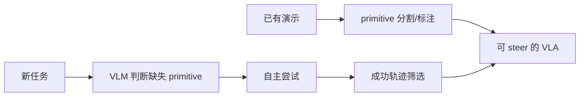

# InSight:可 steer 的 VLA 自主发现缺失 primitive

> **arXiv**: [2606.24884](https://arxiv.org/abs/2606.24884) | **时间**: 2026.06 | **路线**: VLA · steerable policy / 自主技能获取
> [← 返回 VLA 总览](/vla/) · [Steerable Policies](steerable-policies)

## TL;DR

InSight 的问题意识很清楚:VLA 不是只缺更多演示,而是常常缺某些可组合的低层技能 primitive。它先把已有演示切成带标签的 primitive action,训练一个能被这些 primitive steering 的策略;遇到新任务时,再让 VLM 判断缺哪些 primitive,让机器人尝试、筛选成功轨迹并回流训练。

这使它和 [Steerable Policies](steerable-policies) 站在同一方向:低层策略必须“可操控”,高层推理才能真正调度它。

## 方法

InSight 把“技能发现”做成闭环:

1. 从演示中得到 primitive action 标签。
2. 用 primitive 标签训练可 steer 的策略。
3. 新任务中识别现有 primitive 覆盖不到的部分。
4. 自主收集并标注成功数据,把缺口补回数据集。

## 谱系位置

- 与 [Steerable Policies](steerable-policies):两者都把“丰富/细粒度接口”视为关键;InSight 进一步加入自主补技能数据闭环。
- 与 [π0.7](pi07):π0.7 强调可操控通才;InSight 更像研究如何让通才自己发现缺哪类可操控技能。
- 与 [具身数据处理](data-processing):它提供了一种“不是盲目扩数据,而是按 primitive 缺口补数据”的策略。

## 局限与待核

- primitive 的切分质量会决定上层 VLM 判断是否可靠。
- 自主尝试需要安全约束,尤其是真机接触任务。
- 如果新任务需要全新物理技能而非已有 primitive 组合,闭环收敛可能很慢。

## 来源

- arXiv:[2606.24884](https://arxiv.org/abs/2606.24884).

