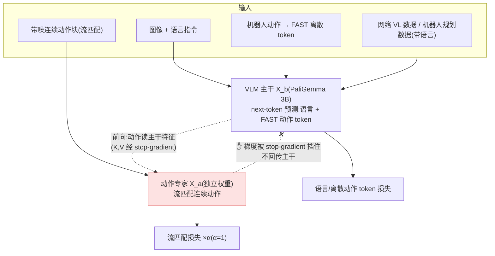

# Knowledge Insulation(知识隔离)细粒度解读

> **arXiv**: [2505.23705](https://arxiv.org/abs/2505.23705) · Physical Intelligence / Google DeepMind(Driess, Springenberg, Ichter, …, Sergey Levine)· 2025.05 · **路线**:VLA 训练配方(梯度隔离 + 离散 token 监督 + co-training),建于 [π0](pi0.md) 之上
> [← 返回主报告](../index.md)

*读图方式:动作专家可以读取主干表征,但连续动作损失的梯度被隔离在专家侧;主干另由 FAST 离散 token 与网络数据维持语义能力。*

---

## TL;DR

Knowledge Insulation(KI,《Knowledge Insulating Vision-Language-Action Models: Train Fast, Run Fast, Generalize Better》)不是一个新模型,而是一套**训练配方**,解决一个反直觉的工程难题:**给预训练 VLM 主干外挂一个连续动作专家(流匹配/扩散),会反过来损害主干的语义知识、拖慢训练**。

它的诊断是:动作专家初始化随机、其梯度回流进 VLM 主干会"污染"预训练学到的视觉-语言表征。KI 的解法是**把两件事分开练**:

1. **梯度隔离(核心)**:用 **stop-gradient** 让动作专家**只读取**主干特征(前向信息照常流动),但**梯度不回传**进主干预训练权重——动作专家随便学,不会反过来破坏主干。
2. **主干用离散 token 监督**:主干同时用 **[FAST](pi0-fast.md) 离散动作 token** 做 next-token 预测来学"动作语义",这给了主干一个**稳定、不依赖随机初始化专家**的训练信号。
3. **网络数据 co-training**:主干联合训练机器人动作数据(FAST 离散)+ 通用图文 VL 数据 + 带语言标注的机器人规划数据,保住开放世界语义、显著改善指令跟随与新物体泛化。

由于梯度被隔离,流匹配损失权重 α 可直接取 **1**(无需小心翼翼地调小)。作者自评:相对 [π0](pi0.md) **训练步数效率约 7.5×** ⚠️(Fig.6b)、推理仍保持 **10 Hz**(对比 [π0-FAST](pi0-fast.md) 自回归约 1.3 Hz / 每秒动作块约 750ms);LIBERO-90 **96.0%** / LIBERO-Spatial **95.6%**(发表时 SOTA)、DROID **0.55±0.09** vs π0 0.49±0.09。这套配方后来成为 [π0.6 / π*0.6](pi06.md) 与 [π0.7](pi07.md) 的标配训练技法。

> ⚠️ 凡标 ⚠️ 者为作者自评/未经第三方独立复现;LIBERO/DROID 为公开基准但成绩由作者自跑;一手未给定量者标"待核"。

---

## 1. 要解决的问题

[π0](pi0.md) 这类"VLM 主干 + 连续动作专家(流匹配)"的架构有个隐藏代价:**两个部件的训练目标与成熟度严重不匹配**。

1. **随机初始化的动作专家会"污染"主干**:VLM 主干是互联网规模预训练的、表征成熟;动作专家是从零初始化的。若让二者端到端联合训练、动作专家的梯度自由回流进主干,**早期大而嘈杂的动作梯度会冲刷掉主干预训练学到的视觉-语言知识**——表现为语言跟随变差、新物体泛化退化、训练变慢。
2. **连续 vs 离散的训练信号之争**:纯用连续流匹配损失训练,主干拿不到"干净"的动作语义监督(信号都经过随机专家);而纯用 [π0-FAST](pi0-fast.md) 式离散自回归 token,推理又慢(自回归逐 token,约 1.3 Hz)。作者想**两者兼得**:训练时用离散 token 给主干稳定监督,推理时用连续专家拿高频。
3. **co-training 的脆弱性**:把网络 VL 数据混进来本可防遗忘,但若梯度未隔离,动作损失与语言损失互相干扰,co-training 收益打折。

KI 的统一答案:**把"主干学什么"与"动作专家学什么"在梯度上解耦**——主干用离散 token + 网络数据稳定地学语义,动作专家用流匹配学控制、但其梯度被挡在主干门外。论文称这把 [π0.5](pi05.md) 的做法**形式化并扩展成一个单阶段统一训练配方**。

---

## 2. 方法与架构

KI 建在 [π0](pi0.md) 架构上(PaliGemma 3B 主干 + 较小的独立动作专家权重),关键改动是**按模态拆分的注意力 + stop-gradient 梯度门控**。

### 2.1 梯度隔离:按模态拆分注意力 + stop-gradient(核心)

KI 把注意力概率分解成三块,并对"动作→主干"方向施加 stop-gradient(`sg`):

- **主干→主干** `Q_b(X_b)·K_b(X_b)ᵀ`:正常梯度(主干照常学)。
- **动作→主干** `Q_a(X_a)·sg(K_b(X_b)ᵀ)`:**键被 stop-gradient**——动作专家能 attend、读取主干特征(前向信息流通),但**回传时这条路梯度为 0**。
- **动作→动作** `Q_a(X_a)·K_a(X_a)ᵀ`:正常梯度(专家内部照常学)。
- 值向量同理:动作专家用到的主干值 `P_ab·sg(V_b(X_b))` 也加 stop-gradient。

一句话:**信息可以从主干流向动作专家,梯度不能从动作专家流回主干**。这就是"insulation(隔离/绝缘)"的字面含义——像给预训练知识包了一层绝缘层,挡住下游随机模块的"梯度噪声"。

### 2.2 主干用 FAST 离散 token 学动作语义

主干不靠动作专家的梯度来"理解动作",而是**自己用 [FAST](pi0-fast.md) 离散动作 token 做 next-token 预测**(FAST = 对动作块做 DCT 频域变换 + 量化 + BPE 压缩)。这给主干一个**稳定、可微、不依赖随机专家**的动作监督信号,让它在训练早期就能学到动作语义,而不必等动作专家收敛。

### 2.3 co-training 与损失

主干联合三类数据训练:① 机器人动作数据(FAST 离散 token);② 通用图文 VL 数据(防遗忘、保泛化);③ 带语言标注的机器人规划数据。总损失 = 语言/离散 token 预测损失 + **α × 流匹配损失**;**因为梯度已隔离,α 可直接设为 1**,无需像朴素做法那样把动作损失权重调小以免破坏主干。消融显示:co-training 网络数据对**新物体泛化贡献最大**(Fig.7)。

---

## 3. 关键设计与创新点

1. **stop-gradient 梯度隔离**(§2.1):用注意力分解 + 选择性 stop-gradient,实现"前向通、反向断"——这是 KI 区别于普通 co-training 的核心一笔,也是 [dual-system-architecture](dual-system-architecture.md) 里"梯度隔离"这一类解耦的代表。
2. **离散监督训主干、连续专家管推理**:训练用 [FAST](pi0-fast.md) 离散 token 给主干稳定信号,推理用流匹配动作专家拿 10 Hz 高频——把 π0-FAST(慢但训练稳)与 π0(快但训练易污染)的优点合一。
3. **单阶段统一配方**:把 [π0.5](pi05.md) 的分阶段思路形式化成**一个训练阶段**内同时跑离散监督 + 连续流匹配 + co-training。
4. **α=1 的解放**:梯度隔离后动作损失权重不再需要精细调参,简化训练。

---

## 4. 实验与关键结果

> ⚠️ 多为作者自评(图表对比);LIBERO/DROID 为公开基准但成绩由作者自跑,非第三方统一复现。

| 维度 | 结果 | 性质 |
|---|---|---|
| 训练效率(vs π0) | 约 **7.5× 训练步数效率**(Fig.6b);训练算力 +~20%,但 wall-clock 因更快收敛被抵消 | ⚠️ 自评 |
| 推理频率 | **10 Hz**(同 π0 流匹配),对比 [π0-FAST](pi0-fast.md) 自回归约 1.3 Hz / 每个 1 秒动作块约 750ms | ⚠️ 自评 |
| LIBERO | **LIBERO-90 96.0%** / **LIBERO-Spatial 95.6%**(发表时 SOTA) | ⚠️ 自评(公开基准自跑) |
| DROID | **0.55±0.09** vs π0 0.49±0.09 | ⚠️ 自评 |
| 指令跟随 | "items in drawer" 等任务显著优于 π0(Fig.4b) | ⚠️ 自评 |
| 新物体泛化 | co-training VL 数据贡献最大(Fig.7) | ⚠️ 自评 |
| 真机 | 多本体(收桌、抽屉、叠衣、移动操作)成功率一致最高 | ⚠️ 自评 |

> **消融要点**:去掉梯度隔离 → 主干知识被动作梯度污染、泛化掉点;去掉离散 token 监督 → 训练变慢;去掉网络数据 co-train → 新物体泛化明显下降。三者共同支撑"train fast / run fast / generalize better"的标题主张(⚠️ 均作者口径)。

---

## 5. 局限与争议

- **全为作者自评**:7.5× 训练效率、各基准成绩、真机成功率均由 PI/DeepMind 自报,无第三方在统一协议下复现;LIBERO/DROID 虽公开但成绩自跑(标 ⚠️)。
- **与 π0.5 的边界**:作者称把 π0.5 的做法"形式化扩展",但 KI 与 π0.5 分阶段训练在最终效果上的净增益拆解,论文外难以独立验证。
- **依赖 FAST 分词质量**:主干的动作语义信号来自 FAST 离散 token,分词器对动作分布的拟合质量会传导到主干学习(FAST 本身的局限见 [π0-FAST 细读](pi0-fast.md))。
- **配方而非模型**:KI 是训练技法,其价值最终体现在采用它的模型([π0.6/π0.7](pi06.md))上;单独评估其贡献需控制变量,论文外少有独立对照。

---

## 6. 在 VLA 谱系中的位置

KI 是 [π0](pi0.md) → [π0.5](pi05.md) → [π0.6/π*0.6](pi06.md) → [π0.7](pi07.md) 这条 Physical Intelligence 主线背后的**训练方法学基石**。在"如何让 VLM 主干与连续动作专家共处"这个问题上,它给出了一个明确答案:**梯度隔离 + 离散监督主干 + 连续专家推理**。

把它放进本站的**三种"解耦"框架**([dual-system-architecture](dual-system-architecture.md)):
- **双系统**解耦的是**运行频率**(慢 VLM + 快控制器,如 [GR00T N1](groot-n1.md)/[Helix](helix.md));
- **分层**解耦的是**语义层级**(高层子任务 + 底层动作,如 [π0.5](pi05.md));
- **知识隔离(本页)**解耦的是**梯度**(主干预训练知识 vs 动作专家学习)——三者正交,可叠加。

[π0.6](pi06.md) 的细读里"知识隔离"作为训练配方被反复引用,[π0.7](pi07.md) 沿用同一配方;本页把这条被反复提及却未单列的方法补成完整细读。术语速览见 [glossary · 知识隔离](glossary.md);它与混合质量数据/co-training 的关系见 [数据处理](data-processing.md)。

相关条目:[π0](pi0.md) · [π0-FAST](pi0-fast.md) · [π0.5](pi05.md) · [π0.6 / π*0.6](pi06.md) · [π0.7](pi07.md) · [双系统架构原理](dual-system-architecture.md)

---

## 来源

- 论文:arxiv.org/abs/2505.23705(Knowledge Insulating Vision-Language-Action Models: Train Fast, Run Fast, Generalize Better;Driess, Springenberg, Ichter, …, Levine,Physical Intelligence / Google DeepMind,2025.05)
- 全文(HTML):arxiv.org/html/2505.23705(注意力分解 + stop-gradient、FAST 离散监督、co-training、LIBERO/DROID 成绩、消融均出自此)
- 官方:pi.website/research/knowledge_insulation
- 本站交叉:[π0 细读](pi0.md) · [π0.6 细读](pi06.md)(知识隔离作训练配方)· [双系统架构原理](dual-system-architecture.md)(梯度隔离一类)
