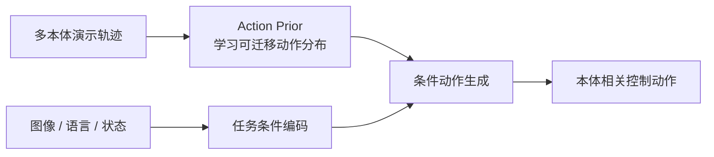

# Learning Action Priors:跨本体动作先验让 VLA 少从零学控制

> **arXiv**: [2606.26095](https://arxiv.org/abs/2606.26095)(*Learning Action Priors for Cross-Embodiment Robot Manipulation*) | **时间**: 2026.06 | **路线**: VLA · 连续动作 / 跨本体 action prior
> [← 返回 VLA 总览](/vla/) · [具身数据处理](/vla/papers/data-processing)

## TL;DR

这篇的核心不是再做一个更大的 VLM,而是把 VLA 里最容易过拟合本体的部分抽出来:动作模块。作者主张先在多本体轨迹上学习一个 **action prior**,让模型掌握“哪些动作序列在机器人操作中像真的”,再把视觉、语言和任务条件接上去生成具体动作。

它适合放在本站的“跨本体动作表示”线:与 [SPACE](space) 直接用笛卡尔状态增量统一动作不同,Learning Action Priors 更像是把动作分布本身先预训练成可迁移先验,再作为 VLA 的低层控制基础。

## 问题

跨本体训练的难点在于:同一句“把杯子拿起来”,不同机械臂、夹爪、控制频率和坐标接口下的 action label 完全不同。直接把这些动作混到一个 VLA 里,模型既要学视觉语义,又要学本体特定的控制分布,数据效率会很差。

这篇把问题拆成两层:

- **动作是否合理**:动作序列本身要符合机器人运动的局部规律。
- **动作是否服务当前任务**:动作还要被当前图像、语言和目标条件约束。

先学第一层,再接第二层,就是 action prior 的意义。

## 方法要点

从谱系上看,它延续了连续动作 VLA 的思想:动作不是离散 token,而是连续控制块或连续轨迹分布。不同点在于,它把“动作先验”作为独立可复用资产,而不是让每个 VLA 任务都从随机初始化的动作头开始学。

## 关键价值

- **跨本体迁移**:action prior 可吸收不同机器人之间共享的运动结构,降低本体切换成本。
- **数据效率**:在下游任务里,视觉语言条件主要负责“做什么/对哪个物体做”,动作先验负责“怎样动才像有效操作”。
- **与 VLA 主干解耦**:这一路线可以服务 OpenVLA-OFT、π0/π0.5 风格的连续动作头,也可与后训练/RL 组合。

## 谱系位置

- 与 [SPACE](space) 对照:SPACE 统一的是动作表示接口;Learning Action Priors 统一的是动作分布先验。
- 与 [π0](pi0)、[π0.5](pi05) 对照:π 系更强调大模型 + flow matching 动作生成;本文强调动作模块可先验化、可迁移。
- 与 [OpenVLA-OFT](openvla-oft) 对照:OFT 把离散动作头替换为并行动作回归;本文进一步问“这个动作头能不能先预训练成跨本体先验”。

## 局限与待核

- 目前仍是预印本,定量结果按作者自评处理。
- action prior 到底学到多少本体无关能力,多少仍是数据集分布记忆,需要更多跨硬件真机验证。
- 若下游本体动力学差异过大,单一先验可能仍需 adapter 或本体条件化。

## 来源

- arXiv:[2606.26095](https://arxiv.org/abs/2606.26095) *Learning Action Priors for Cross-Embodiment Robot Manipulation*.

