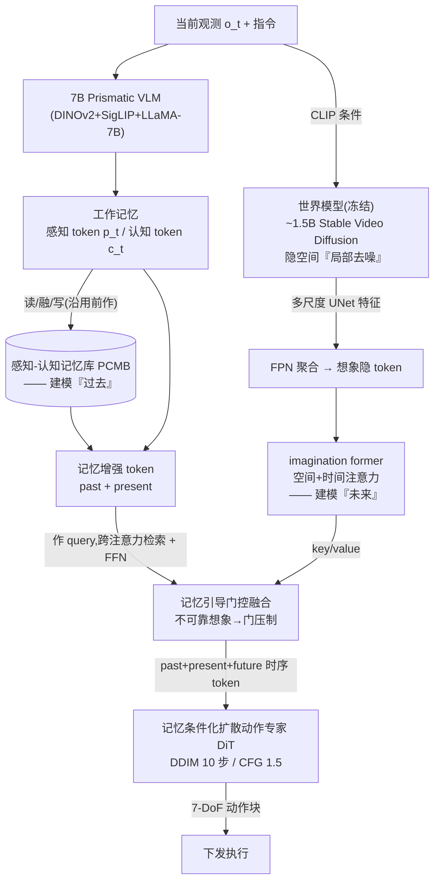

# MemoryVLA++:把「记忆」补上「想象」——过去-当下-未来的全时序 VLA

> **arXiv**: [2606.09827](https://arxiv.org/abs/2606.09827)(v1 2026-06-08,**扩展期刊版 / preprint**,无会议接收标注;前作 MemoryVLA 为 ICLR 2026)
> **机构**: 清华大学黄高组(THU LeapLab)+ 香港大学 MMLab(HKU,罗平)+ Dexmal + StepFun(阶跃星辰)· 作者 Hao Shi, Weiye Li, Bin Xie, Yulin Wang, Renping Zhou, Tiancai Wang, Xiangyu Zhang(张祥雨), Ping Luo(罗平), Gao Huang(黄高)· 项目页 [shihao1895.github.io/MemoryVLA-PP-Web](https://shihao1895.github.io/MemoryVLA-PP-Web)
> **路线**: 记忆增强 / 长程时序 VLA —— **[MemoryVLA](/vla/papers/memoryvla) 的直接续作**;在「感知-认知双记忆库」之上加「世界模型想象」分支,把时序建模从「过去」扩展到「过去-当下-未来」;骨架延续 [CogACT](/vla/papers/cogact) 式 7B Prismatic VLM + 扩散动作专家(DiT)

> [← 返回主报告](../index.md)

---

## TL;DR

[MemoryVLA](/vla/papers/memoryvla)(前作)把主流 VLA「单步/短窗口观测 → 动作」的**马尔可夫假设**这一结构性短板,显式建成一个可读写检索的**感知-认知记忆库(PCMB)**,解决了「**进度只藏在历史里**」的非马尔可夫问题——但它建模的只有「**过去**」。MemoryVLA++ 的诊断更进一步:**有些任务光记住过去还不够,得能「预演未来」**——传送带上的物体下一刻会移到哪、袋子拉链拉到一半接下来该怎么走,这类**想象依赖(imagination-dependent)**的任务,需要模型对「尚未发生的状态」有预期。

它的核心增量(相对前作)只有一句话:**在 PCMB「记忆过去」之外,并联一条「想象未来」的世界模型分支,把策略从 $\pi(o_t,\text{Memory}_{\text{past}})$ 升级为 $\pi(o_t,\text{Memory}_{\text{past}},\text{Imagination}_{\text{future}})$,实现 past-present-future 的全时序建模。** 两件具体武器:

1. **世界模型想象分支(world-model imagination)**:用一个**适配过的 Stable Video Diffusion(~1.5B SVD)**当世界模型,以当前观测 + 指令(CLIP 编码)为条件,在**隐空间做「局部去噪(partial denoising)」**——不生成像素级完整视频,只取 UNet 的**多尺度中间特征**经 **FPN** 聚成想象隐 token,再由「imagination former」(空间+时间注意力)整理成对未来的预期表征。世界模型**单独训练 40k 步后冻结**,policy 训练阶段不动它,以保住预训练的视觉动力学先验。
2. **记忆引导的想象融合(memory-guided integration)**:**记忆增强后的感知 token 作 query,跨注意力检索想象隐 token + FFN,再自适应门控**——当未来预测不可靠时由门把它压下去,避免「错误想象」污染当下决策。这一招直接复用并延续了前作 PCMB 的「门控自适应融合」哲学。

作者自评(⚠️,真机三类任务,均相对 [CogACT](/vla/papers/cogact)):**通用 +9%、长程记忆依赖 +26%、长程想象依赖 +28%**;其中想象依赖档 **MemoryVLA++ 77% vs 前作 MemoryVLA 65%(+12)**——这 12 个点才是「++」相对前作真正多出来的东西。

> ⚠️ **可信度提示**:本文**全部数字均为作者自评**(preprint,无第三方独立复现,数字尚未进入本站 [评测基准全景](/vla/papers/benchmarks) 横评)。**MemoryVLA++ 代码 / 权重 / 数据集均未释放**——官方 GitHub 的 TODO 三项(Code Release / Model Weights / Dataset)全部未打勾,README 注明「will be released in the coming months」;目前开源的只有**前作 MemoryVLA**(已全量释放)。无会议接收标注(前作为 ICLR 2026)。凡标 ⚠️ 者按本站体例处理,一手未给定量者标「待核」。

---

## 1. 要解决的问题

前作 [MemoryVLA](/vla/papers/memoryvla) 已经论证:机器人操作大量是**非马尔可夫**的——「我现在堆到第几个了」「目标被手臂短暂遮挡」「开抽屉 vs 关抽屉」这类信息**只藏在历史里**,单看当前帧无从知道,于是它造了 PCMB 把「过去」显式存下来检索。

MemoryVLA++ 指出,即便把「过去」记全了,还有一类短板**记忆也补不上**:**有些决策依赖的是「未来会怎样」,而不是「过去发生了什么」**。论文把这条新轴叫 **imagination-dependent(想象依赖)**:

1. **动态/移动目标的提前量**:传送带上的物体在「伸手—闭合」这段时间里会继续移动,只靠当前帧 + 历史记忆都不知道该往哪个**未来位置**去抓,需要对物体轨迹有预期。
2. **不可逆多阶段操作的预判**:打包-拉拉链(Bag Pack & Zip)这类任务,当前一步该怎么走取决于「这样走下去几帧后会变成什么样」,需要对自身动作的后果有内部模拟。
3. **遮挡/部分可观下的状态外推**:把记忆(过去)与想象(未来)两端夹住「当下」,比单端记忆更鲁棒。

于是 MemoryVLA++ 的主张是:**时序建模不该只看后视镜(记忆),还要有前挡风玻璃(想象)**——把前作的 past-only 记忆,补成 **past + present + future** 的完整时序回路。

---

## 2. 方法与架构

MemoryVLA++ 延续前作的 **Cognition-Memory-Action** 三段式骨架,**骨架与 token 设计基本不变**,核心是**并联进来的第四块:世界模型想象分支**。

- **骨架(沿用前作 / [CogACT](/vla/papers/cogact))**:7B Prismatic VLM(DINOv2 + SigLIP 视觉 + LLaMA-7B,OXE 上继续预训练;消融另探了 Qwen2.5)编码观测,产出**感知 token**(verbatim 细节)与**认知 token**(semantic gist)两路工作记忆。
- **记忆侧(沿用前作 PCMB)**:感知-认知双记忆库,检索(scaled dot-product attention + 时间步正弦编码)→ 门控自适应融合 → 相邻余弦相似度合并巩固——**这部分相对前作未变**,负责「过去」。
- **动作侧(沿用前作)**:记忆条件化的**扩散动作专家 DiT**(~300M),DDIM **10 步**采样、CFG 尺度 **1.5**,输出 **7-DoF 动作块**(6 连续 + 1 夹爪),含 cognition-attention / perception-attention 两层。

### 2.1 世界模型:为什么用「隐空间局部去噪」而非生成完整视频
直接让世界模型**渲染未来的像素视频**既慢又容易在细节上跑偏。MemoryVLA++ 的取舍是:**只要「对决策有用的未来表征」,不要「好看的未来图像」**。

- **载体**:一个适配到操作数据上的 **~1.5B Stable Video Diffusion** 作世界模型,条件是当前观测 + 指令(CLIP 编码)。
- **局部去噪(partial denoising)**:不跑完整扩散采样,只在隐空间做少量去噪步,取 UNet **多尺度中间特征**——消融显示去噪 **1 步(44.4)≈ 3 步(44.6)> 5 步(43.6)**,即**极少步的「半成品想象」就够用**,印证了「要表征不要成片」的取舍。
- **FPN + imagination former**:多尺度特征经 FPN 聚成想象隐 token,再由 imagination former 用空间+时间注意力整理成连贯的未来预期。

### 2.2 冻结世界模型:保住视觉动力学先验
世界模型**先单独训练 40k 步,policy 训练阶段冻结**。直觉:SVD 预训练得到的「世界怎么演化」的动力学先验很宝贵,跟着 policy 一起微调反而会被任务数据带偏。消融佐证:**冻结(44.4)> 不冻结(42.8),+1.6**。

### 2.3 记忆与想象怎么合流:门控,延续前作哲学
关键设计是**让「记忆(过去)」来引导「想象(未来)」的采信程度**:记忆增强后的感知 token 作 query,对想象隐 token 跨注意力检索 + FFN,再自适应门控——**想象可靠就多采信、预测发散就由门压下去**。这与前作 PCMB「当前观测可靠时多信当下、需要历史时多信记忆」的门控融合是同一套哲学的自然延伸。消融:**记忆引导融合(44.4)> 直接相加(41.2),+3.2**。

### 2.4 相对前作的增量一览(术语沿用前作)
| 维度 | MemoryVLA(前作) | MemoryVLA++(本篇) |
|---|---|---|
| 时序范围 | **过去**(past-only 记忆) | **过去 + 当下 + 未来**(记忆 + 想象) |
| 记忆机制 PCMB | 感知-认知双记忆库(检索/门控/相似度合并) | **不变,沿用** |
| 新增模块 | — | **世界模型想象分支**(冻结 ~1.5B SVD + 隐空间局部去噪 + FPN + imagination former) |
| 融合方式 | 门控融合(当下 vs 记忆) | 同款门控,**扩展为记忆引导地融合想象** |
| 骨架 / 动作专家 | 7B Prismatic VLM + DiT | **不变,沿用** |
| 新覆盖能力 | 长程记忆依赖 | **+ 长程想象依赖(动态目标/不可逆多阶段)** |

---

## 3. 关键设计与创新点

1. **把时序建模从「past-only」补成「past-present-future」**:这是相对前作最本质的一步——前作用记忆解决「忘了过去」,本篇用想象解决「看不到未来」,两端夹住当下。
2. **世界模型当「想象引擎」,但只取表征不取像素**:隐空间局部去噪 + 多尺度特征,极少步即可,工程上把「世界模型」这件重事做轻。
3. **冻结世界模型**:解耦「动力学先验学习」与「策略学习」,避免预训练先验被任务数据冲掉(消融 +1.6)。
4. **记忆引导想象的门控融合**:用过去的可信度去调未来的采信度,直接复用前作 PCMB 门控哲学,把「错误想象」挡在动作之外(消融 +3.2)。
5. **即插于成熟骨架**:PCMB、7B VLM、DiT 全部沿用前作 / [CogACT](/vla/papers/cogact),想象分支是可插拔增量——与前作「记忆模块即插」的工程取向一脉相承。

---

## 4. 实验与关键结果

> ⚠️ **本节全部为作者自评**,preprint 无第三方复现,数字尚未进入本站横评。覆盖范围(作者口径):3 个机器人、5 个仿真基准、3 类真机任务,合计近 200 个任务。SimplerEnv 用 Visual Matching(VM)口径。

### 4.1 仿真基准(对比前作 / CogACT)⚠️
| 基准 | MemoryVLA++ | MemoryVLA(前作) | 主要对照 | ++ 相对前作 |
|---|---|---|---|---|
| **LIBERO**(五套件均值) | **98.4** | 96.5 | CogACT 93.2 | **+1.9** |
| **SimplerEnv·WidowX-Bridge**(VM 均值) | **73.9** | 71.9 | CogACT 57.3 | **+2.0** |
| **Mikasa-Robo**(5 任务均值) | **44.4** | 41.2 | π0(单帧)29.4 / Octo(10 帧)31.6 | **+3.2** |
| **Calvin ABC→D**(平均任务长) | **4.29** | 4.09 | CogACT 3.25 / π0 3.92 | **+0.20** |

- **LIBERO** 分套件(++):Spatial 99.8 / Object 100.0 / Goal 98.2 / Long-10 96.0 / Long-90 97.8。Object 满分、Long 档继续领先,与前作「补长程」的主张一致。
- **SimplerEnv·Bridge** 分任务(++):Spoon on Towel 83.3 / Carrot on Plate 66.7 / Stack Cube 45.8 / Eggplant in Basket 100.0。
- ⚠️ **待核**:本篇 SimplerEnv 仅给出 WidowX-Bridge 四任务,**未见单列 Google Robot / Fractal(VM)表**——前作头条里的 Fractal VM 77.7 在本篇**未复述**,故 ++ 的 Fractal VM **待核**,勿与前作数互推。
- **Mikasa-Robo**(强记忆基准)分任务(++):ShellGameTouch 97 / InterceptMedium 40 / RememberColor3 50 / RememberColor5 19 / RememberColor9 16——RememberColor 越长越难,绝对值仍低,说明强记忆/长程远未饱和。

### 4.2 Libero-Plus(鲁棒性,新基准)⚠️
- **零样本**:73.1 均值(OpenVLA-OFT 67.9,+5.2)。
- **监督微调**:82.7 均值(OpenVLA-OFT 79.6,+3.1)。
- ⚠️ 该基准未见前作对照行,**前作 Libero-Plus 数待核**。

### 4.3 真机三类任务(核心卖点)⚠️
| 类别 | MemoryVLA++ | MemoryVLA(前作) | vs CogACT |
|---|---|---|---|
| 通用操作(6 任务) | —(与前作并列报告) | **85%** | **+9**(CogACT 76) |
| 长程·记忆依赖(6 任务) | —(与前作并列报告) | **83%** | **+26**(CogACT 57) |
| **长程·想象依赖(5 任务,新)** | **77%** | 65% | **++ +28**(CogACT 49)/ 前作 +16 |

- **解读**:通用、记忆依赖两档想象帮不上忙,数与前作并列(85/83,+9/+26);**「++」真正多出来的增量集中在想象依赖档——77% vs 前作 65%,净 +12**。
- 想象依赖任务:Conveyor Pick-Low/Mid/High、Conveyor Scan-Pick、Bag Pack & Zip;**最大涨幅 Bag Pack & Zip +36、Conveyor Scan-Pick +33**(均相对 CogACT)。
- 摘要头条「**+9% / +26% / +28%**」即对应通用 / 记忆依赖 / 想象依赖三档相对 CogACT 的增益。

### 4.4 想象模块消融(Mikasa-Robo,锚点 44.4)⚠️
| 消融轴 | 设置与成绩 | 结论 |
|---|---|---|
| 去噪步数 | 1=44.4 · 3=44.6 · 5=43.6 | **极少步「半成品想象」就够**,不需跑完整生成 |
| 想象时域 | 4=43.4 · 8=43.8 · 16=44.4 | 想象得越远略好,16 步最优 |
| 世界模型 | 不冻结 42.8 · **冻结 44.4** | **冻结 +1.6**,保住动力学先验 |
| 融合方式 | 相加 41.2 · **记忆引导 44.4** | **门控引导 +3.2** > 简单相加 |

---

## 5. 局限与争议

1. **全为自评 + 代码未释放**:所有数字为作者自评,**MemoryVLA++ 代码/权重/数据集均未释放**(官方 GitHub TODO 三项未打勾,「coming months」),无第三方复现、无会议接收——可复核性目前低于已开源的前作。
2. **想象依赖绝对值仍不高**:真机想象依赖 77%、Mikasa-Robo 44.4%、RememberColor9 仅 16%,**强时序任务远未饱和**,世界模型想象的硬上界未知。
3. **多了一个 ~1.5B 世界模型的负担**:在前作 7B VLM + DiT 之上再挂 ~1.5B SVD,虽冻结且只做局部去噪,但参数/显存/推理负担相对前作进一步上升(本篇未给与前作对齐的时延/显存增量,**待核**)。
4. **想象质量受限于世界模型保真度**:门控能压制「明显不可靠」的想象,但若世界模型对某类动力学系统性预测错误,门控未必兜得住——与前作「记忆是隐式向量、难诊断」类似,**想象同样是隐式表征,出错难解释**。
5. **SimplerEnv·Fractal 等口径缺位**:本篇未复述前作头条的 Fractal VM,横向可比性打折(见 §4.1 待核)。
6. **数据仍以桌面单臂为主**:延续前作的桌面单臂口径,双臂/灵巧/接触丰富操作的「想象」需求未覆盖。

---

## 6. 在 VLA 谱系中的位置

MemoryVLA++ 与 [MemoryVLA](/vla/papers/memoryvla) **同属「记忆增强 / 长程时序」这条技术线、归在同一张卡**,是前作的**直接续作(扩展期刊版)**:前作把策略从马尔可夫式 $\pi(o_t)$ 升级为带「过去记忆」的 $\pi(o_t,\text{Memory})$,本篇再补一条「未来想象」分支,升级为 $\pi(o_t,\text{Memory}_{\text{past}},\text{Imagination}_{\text{future}})$,把时序轴补完整。两者共享 [CogACT](/vla/papers/cogact) 式「VLM 认知 + 扩散动作专家(DiT)」组件化骨架与 PCMB 记忆库,**本篇唯一的结构性新增就是世界模型想象分支**。

放进更大的谱系看:相对 [π0](/vla/papers/pi0) / [CogACT](/vla/papers/cogact) 用「更好的动作生成器」解决**动作建模**,MemoryVLA 一系解决正交的**时序/状态建模**问题——而 MemoryVLA++ 进一步把「世界模型 / 预测性建模」这条原本独立的潮流(预测未来再行动)**收编进记忆增强框架**,用「记忆引导想象」把两者门控地缝在一起。它对本站的意义是:前作是横评多个数字的一手来源,而**本篇数字尚未进入横评、代码未开源,暂按 ⚠️ 自评收录**,待释放与第三方复现后再校。

一句话:**MemoryVLA++ 用「冻结世界模型 + 隐空间局部去噪 + 记忆引导门控融合」给前作 [MemoryVLA](/vla/papers/memoryvla) 补上「想象未来」的一端,把记忆增强 VLA 从 past-only 推进到 past-present-future 全时序;自评在想象依赖型真机任务上 77% vs 前作 65%(+12)、三类真机相对 CogACT +9/+26/+28,代价是再挂一个 ~1.5B 世界模型、且为作者自评 + 代码权重均未释放。**

---

## 来源

- 论文:MemoryVLA++: Temporal Modeling via Memory and Imagination in Vision-Language-Action Models. arXiv:**2606.09827**(v1 2026-06-08,扩展期刊版 / preprint,无会议接收标注)。清华黄高组 LeapLab + HKU MMLab + Dexmal + StepFun。<https://arxiv.org/abs/2606.09827> · 全文 <https://arxiv.org/html/2606.09827>(世界模型/想象分支、隐空间局部去噪、FPN+imagination former、记忆引导门控、各基准与消融成绩均出自此)
- 项目页:<https://shihao1895.github.io/MemoryVLA-PP-Web>(机构:THU LeapLab / HKU MMLab / Dexmal / StepFun)
- 代码状态:官方 GitHub <https://github.com/shihao1895/MemoryVLA> —— **MemoryVLA++ 代码/权重/数据集 TODO 三项未打勾,README 注「will be released in the coming months」;当前仅前作 MemoryVLA 已开源**
- 前作 / 同卡:[MemoryVLA 细读](/vla/papers/memoryvla)(前作,最重要——术语、PCMB、骨架均沿用)· 骨架同源 [CogACT](/vla/papers/cogact) · 对照 [π0](/vla/papers/pi0) · 口径参考 [评测基准全景](/vla/papers/benchmarks)

> 说明:第 4 节数字**全部为作者自评**(preprint、无第三方复现、代码权重未释放),按本站 ⚠️/待核 体例处理;SimplerEnv·Fractal(VM)、真机通用/记忆依赖档的 ++ 单列值、与前作对齐的时延/显存增量等一手未给定量项标「待核」。
