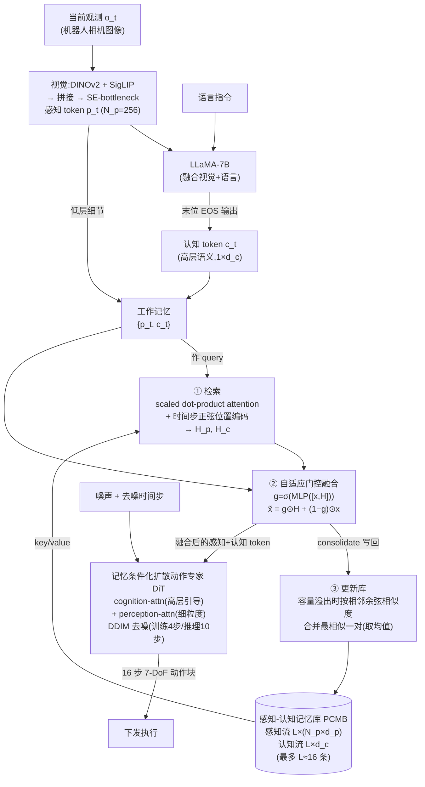

# MemoryVLA 细粒度解读

> **arXiv**: 2508.19236 · 清华大学(黄高组)/ Dexmal / 旷视 MEGVII / 天津大学 / 哈工大 / StepFun · 2025.08(v1;ICLR 2026 接收)· **路线**:记忆增强 VLA —— 感知-认知双记忆库 + 记忆条件化扩散动作专家(Cognition-Memory-Action)
> [← 返回主报告](../index.md)

## TL;DR
MemoryVLA 抓的是当前主流 VLA 一个被普遍忽视的结构性短板:**它们几乎都是"单步/短窗口观测 → 动作"的马尔可夫式映射**,而真实操作任务本质上是**非马尔可夫(non-Markovian)**的——"我刚才已经把第一个杯子放好了"这种历史信息,只看当前一帧根本无从知道。[CogACT](cogact.md) 这类"VLM 认知 + 扩散动作专家"的组件化模型在单步抓放上已经很强,但在长程、强时序依赖任务上仍然弱(CogACT 自己的 Open-Drawer-Place-Apple 长程任务只有 ~50%),根因正是它每一步都"失忆"地重新看当前观测。

MemoryVLA 的解法借自认知科学的双记忆系统:**工作记忆(working memory)缓存当前这一步的感知 + 认知表征用于即时控制,海马系统则把过去经历的"逐字细节(verbatim episodic details)"与"语义要旨(semantic gist)"存为长期记忆**。对应到模型,它在 CogACT 式骨架上增设了一个 **感知-认知记忆库(Perceptual-Cognitive Memory Bank, PCMB)**:VLM 把每一步观测编码成**感知 token**(DINOv2+SigLIP 的低层细节)和**认知 token**(LLaMA 末位输出的高层语义)两路,既作当前的工作记忆,又被 consolidate 进双流记忆库。当前工作记忆用注意力从库里**检索**决策相关条目,**自适应门控融合**进当前 token,再**合并冗余**更新库;最后由一个**记忆条件化的扩散动作专家(DiT)**输出时序感知的动作块。

成绩(✅ 数字与本站 [评测基准全景](benchmarks.md) 已核验口径一致,本文不另起一套数):LIBERO 五套件平均 **96.5%**;SimplerEnv Google Robot(Fractal)Visual Matching **77.7%**、WidowX-Bridge Visual Matching **71.9%**——这两个数正是本站横评表里 MemoryVLA 一栏的来源。⚠️ 作者口径下相对 CogACT 在 Bridge 上 **+14.6**、12 个真机任务平均 **84.0%**(长程任务相对 CogACT **+26**)。

> ⚠️ 凡标 ⚠️ 者为作者自评/未经第三方独立复现;标 ✅ 者为本站对抗核查与基准维护方/复现口径一致;一手未给定量者标"待核"。

## 1. 要解决的问题

主流 VLA(RT-2、OpenVLA、π0、CogACT……)的策略形式几乎都是 $a_t = \pi(o_t)$ 或 $a_t=\pi(o_{t-k:t})$ ——**只吃当前一帧或一个很短的观测窗口**。这等价于一个**马尔可夫假设**:认为"下一步该做什么"只由当前观测决定。但机器人操作任务大量是**非马尔可夫**的:

1. **进度只藏在历史里**:多阶段任务("先把三个方块依次堆好")中,"我现在堆到第几个了"无法从当前帧唯一推断——同一幅"手悬在方块上方"的画面,可能是第一步也可能是第三步,动作却应不同。
2. **遮挡 / 暂时不可见**:目标物被手臂或其他物体短暂遮挡时,只看当前帧会"丢失"它,需要靠记忆补全。
3. **可逆 / 周期性动作的方向消歧**:开抽屉 vs 关抽屉、拧紧 vs 拧松,瞬时画面相似,靠历史才能判断当前处于哪个阶段、该往哪个方向走。

[CogACT](cogact.md) 细读里点出的"长程仍弱"正是这一短板的具体表现:CogACT 用 cognition token 干净地解决了"VLM 认知 ↔ DiT 动作"的接口问题、并拿到了动作模块的 scaling 红利,但它**每一步仍是独立地重看当前观测**,没有跨时刻的状态记忆——所以单步抓放(Pick Coke 91%)很强,而 Open-Top-Drawer-Place-Apple 这类长程组合任务掉到 ~50%。MemoryVLA 的诊断因此是:**问题不在"动作怎么生成",而在"模型没有记忆"**。要补的不是动作专家,而是给整个 perceive→cognize→act 的回路接上一个显式的、可读写检索的时序记忆。

## 2. 方法与架构

MemoryVLA 是一个 **Cognition-Memory-Action** 三段式框架:VLM 把观测编码成感知+认知双 token(工作记忆)→ 双流记忆库做检索/融合/更新 → 记忆条件化扩散动作专家出动作块。骨架沿用 CogACT 同款 7B Prismatic VLM(DINOv2+SigLIP 视觉 + LLaMA-7B,在 OXE 上继续预训练),核心增量是中间那块**感知-认知记忆库**。

### 2.1 双 token:感知 token 与认知 token
这是 MemoryVLA 与 CogACT 在表征上的关键分叉。CogACT 只产出**一个** cognition token 作为认知↔动作的唯一接口;MemoryVLA 则**显式区分并分别存储两类信息**:

- **感知 token `p_t`(verbatim 细节)**:把 DINOv2 与 SigLIP 的视觉特征拼接后,经一个 **SE-bottleneck**(squeeze-excitation 瓶颈)压缩成 256 个 token(N_p=256)。对应海马系统保存的"逐字情节细节"——低层、空间精细。
- **认知 token `c_t`(semantic gist)**:取 LLaMA-7B 处理完视觉特征 + 语言指令后**末位(EOS 位置)**的输出,得到一个紧凑的高层语义向量(1×d_c)。这与 CogACT 的 cognition token 同源。

两者共同构成当前步的**工作记忆**,也是写入记忆库的两条流。"为什么要分两路"在消融里得到验证(见 §4):只留感知或只留认知都明显掉点,二者互补。

### 2.2 感知-认知记忆库(PCMB):读—融—写三件事
PCMB 是双流结构,**感知流**每条 $m_i^p\in\mathbb{R}^{N_p\times d_p}$、**认知流**每条 $m_i^c\in\mathbb{R}^{1\times d_c}$,各保留最多 **L** 条历史(消融显示 **L≈16 最优**)。每一步做三件事:

1. **检索(read)**:把当前工作记忆 token 作 query,对堆叠成张量的记忆库(感知 $\mathbb{R}^{LN_p\times d_p}$、认知 $\mathbb{R}^{L\times d_c}$)做 **scaled dot-product attention**,key/query 上叠加**按 episode 时间步的正弦位置编码**(让模型知道"哪条记忆是多久以前的")。两个 transformer 层分别产出注意力输出 $H_p, H_c$。这一步本质是"从过去经历里检索出对当前决策有用的条目"。
2. **自适应门控融合(fuse)**:对每一流计算一个门 $g_x=\sigma(\text{MLP}(\text{concat}[x, H_x]))$,再逐元素插值 $\tilde{x}=g_x\odot H_x+(1-g_x)\odot x$。直觉:**当前观测可靠时多信当前、需要历史时多信记忆**,由门自适应决定。消融显示用门控比直接相加(addition fusion)高 +4.2。
3. **合并冗余更新(write/consolidate)**:把融合后的表征写回库;当条目数超过容量 L 时,**计算相邻条目间的余弦相似度,把最相似的一对合并(取均值)** $m_{x}^{*}\leftarrow\frac{1}{2}(\tilde{x}_{i^*}+\tilde{x}_{i^*+1})$。这模拟海马的记忆巩固——把高度冗余的相邻经历压成一条,既控住了显存/计算,又优先保留"信息上更独特"的历史。消融显示这种 merge 策略比简单 FIFO 丢弃高 +5.2。

### 2.3 记忆条件化扩散动作专家(DiT)
动作侧沿用 CogACT 式的 **Diffusion Transformer**,做条件扩散去噪生成动作:

- **输出**:一次预测 **16 步 7-DoF 动作块**(action chunk),时序感知。
- **条件化**:DiT 同时吃三路条件——去噪时间步的正弦编码、**认知 token 经 cognition-attention 层提供高层引导**、**感知 token 经 perception-attention 层提供细粒度细节**。注意这里条件已经是经过记忆检索/融合后的 token,所以叫"记忆条件化"。
- **采样**:DDIM,**训练 4 步、推理 10 步**去噪;训练用 MSE 损失。

与 CogACT 相比,动作专家本身的结构思路一脉相承(DiT + DDIM + action chunk),**真正的增量在于送进 DiT 的条件 token 已经融合了时序记忆**,而非只反映当前一帧。

### 2.4 训练数据
按基准分别用对应数据训练(非单一大混合):

- **SimplerEnv-Bridge**:BridgeData v2(~60,000 条轨迹,WidowX)。
- **SimplerEnv-Fractal**:RT-1(~130,000 episodes,Google Robot)。
- **LIBERO**:每任务 50 条演示(130 任务,Franka 仿真)。
- **Mikasa-Robo**:每任务 250 条官方演示(5 任务,Franka)。
- **真机**:自采,每任务 50–300 条演示(Franka + WidowX)。

## 3. 关键设计与创新点

1. **把"非马尔可夫"这件事显式建模成一个可读写检索的记忆库**,而不是靠堆更长的观测窗口或更大的 context。这是与"短窗口 frame-stacking"和 TraceVLA 等"把历史画进图里"路线的本质区别——MemoryVLA 维护的是一个**可巩固、可遗忘、有时间编码**的结构化记忆。
2. **感知/认知双流分离存储**(verbatim 细节 vs 语义要旨),呼应人类双记忆系统;消融证明两路缺一不可。这也是相对 CogACT 单 cognition token 的表征升级。
3. **门控自适应融合**让模型按需在"当前观测"与"历史记忆"之间分配信任度,避免了固定加权把无关历史污染当前决策。
4. **基于相邻余弦相似度的记忆巩固**用极小代价控住记忆库规模:推理时延仅 **+3.6%**(RTX 4090 上 0.194s vs 基线 0.187s)、显存 **+0.8 GB** ——记忆机制几乎"白送"。
5. **即插于成熟骨架**:复用 CogACT 同款 7B Prismatic VLM + DiT,记忆模块是中间的可插拔增量,迁移成本低。

## 4. 实验与关键结果

> 数字口径与本站 [评测基准全景](benchmarks.md) 已核验条目一致;SimplerEnv 用 Visual Matching(VM)口径。

### 4.1 LIBERO(五套件)✅
| 套件 | Spatial | Object | Goal | Long-10 | Long-90 | **平均** |
|---|---|---|---|---|---|---|
| MemoryVLA | 98.4 | 98.4 | 96.4 | **93.4** | 95.6 | **96.5** |

亮点在 **LIBERO-Long(93.4)**——这正是最吃时序/长程的套件,MemoryVLA 在此显著拉开,与"补长程短板"的主张自洽。平均 96.5% 与 OpenVLA-OFT(95.3–97.1)同档、高于 OpenVLA(75.9)。

### 4.2 SimplerEnv(Visual Matching)✅
| 套件 | 模型 | VM 成功率 | 备注 |
|---|---|---|---|
| Google Robot / Fractal | **MemoryVLA** | **77.7** | ✅ 本站横评表来源;高于 CogACT-Base 74.8 |
| WidowX / Bridge | **MemoryVLA** | **71.9** | ✅ 本站横评表来源;⚠️ 作者口径相对 CogACT **+14.6** |

> ✅ **核查注记**:本站横评(见 [benchmarks](benchmarks.md) §一)中 MemoryVLA 的 Google Robot VM **77.7**、WidowX-Bridge VM **71.9** 两个数,其一手来源就是本论文——MemoryVLA 既是被横评对象,也是本站 CogACT=74.8 这一更正的独立复现来源之一(它对已发布 CogACT-Large checkpoint 复现得 74.8% VM,与本站 CogACT 更正互证)。
> ⚠️ 论文摘要另给 Fractal **72.7%** 与 Bridge **71.9%**、LIBERO **96.5%** 三连;其中 72.7% 是 Fractal 的另一聚合口径(VM 77.7 / VA 67.7),引用 Google Robot 还原真机能力时应用 **VM=77.7**。

### 4.3 Mikasa-Robo(强记忆基准)⚠️
5 个 Franka 任务平均 **41.2%**,作者口径相对 π0 **+11.8**。Mikasa-Robo 专门设计来考"必须记住历史才能完成"的任务,MemoryVLA 在此领先与记忆机制的设计意图直接对应(⚠️ 作者自评)。

### 4.4 真机(12 任务)⚠️
- **总平均 84.0%**(Franka + WidowX 两本体)。
- **通用技能 6 任务 ~85%**(相对 CogACT +9);**长程时序依赖 6 任务 ~83%(相对 CogACT +26)**——长程那一档的大幅领先是其核心卖点。
- ⚠️ 真机数为作者自评,无第三方复现;跨本体/任务套件不可与仿真数互推。

### 4.5 消融(SimplerEnv-Bridge,均为作者口径)⚠️
| 改动 | 成功率 | 相对完整模型 |
|---|---|---|
| 完整 MemoryVLA | 71.9 | — |
| 仅感知记忆 | 64.6 | −7.3 |
| 仅认知记忆 | 63.5 | −8.4 |
| 去掉时间步位置编码 | 69.8 | −2.1 |
| 相加融合(替换门控) | 67.7 | −4.2 |
| FIFO 丢弃(替换 merge 巩固) | 66.7 | −5.2 |
| 记忆长度 L=4 或 64 | 67.7 | (vs 最优 L=16) |

消融讲清了几件事:**双流缺一不可**(单流掉 7–8 个点)、**门控 > 相加**、**相似度合并 > FIFO**、**记忆长度有甜点(L≈16)**——太短记不住、太长引入噪声与冗余。

## 5. 局限与争议

- **记忆是隐式向量,非可解释的符号状态**:PCMB 存的是注意力检索出来的特征,而非"已完成步骤=2"这种显式进度变量,出错时难以诊断"它到底记住了什么"。
- **长程能力的硬上界仍未知**:Mikasa-Robo 平均仅 41.2%、真机长程 ~83%,说明强记忆任务远未饱和;L≈16 的记忆窗对"几十步以上"的超长任务是否够用,论文未充分回答。
- **大量领先数为作者自评**:Bridge +14.6、真机长程 +26、Mikasa +11.8 等均出自 MemoryVLA 团队自报对比口径,尚无第三方独立复现(标 ⚠️)。其对 CogACT=74.8 的复现是少数已被本站交叉确认的项。
- **骨架仍重**:延续 7B Prismatic VLM + DiT,虽然记忆模块本身开销极小(+3.6% 时延),但整体算力/延迟负担与 CogACT 同级。
- **数据仍以桌面单臂为主**:Bridge/Fractal/LIBERO/Mikasa 均为单臂桌面口径,双臂、灵巧、接触丰富操作的记忆需求未覆盖。

## 6. 在 VLA 谱系中的位置

MemoryVLA 是"**记忆增强 / 长程时序**"这条技术线的代表作。它与 [CogACT](cogact.md) 同属"VLM 认知 + 扩散动作专家(DiT)"的组件化大家族,可以看作 **CogACT 的"加记忆"升级版**:保留 cognition token + DiT + action chunk 的成熟骨架,针对 CogACT 细读里点明的"**每步失忆、长程仍弱**"短板,显式补上一个感知-认知双记忆库,把策略从马尔可夫式 $\pi(o_t)$ 升级为带时序记忆的 $\pi(o_t, \text{Memory})$。

放进更大的谱系看:相对 [π0](pi0.md) / [CogACT](cogact.md) 用"更好的动作生成器"(流匹配 / 扩散)解决**动作建模**问题,MemoryVLA 解决的是正交的**时序/状态建模**问题——两条改进可叠加。它也与"把历史轨迹画进输入图"的 TraceVLA、"靠超长 context"的路线形成对照:MemoryVLA 主张用**结构化、可巩固、有时间编码的显式记忆库**,而非简单堆历史。对本站而言,它还有一重特殊身份:**它本就是本站横评 SimplerEnv / LIBERO 多个数字(含 CogACT=74.8 更正)的一手数据来源**——既是被评对象,也是评测者。

## 来源
- 论文:arxiv.org/abs/2508.19236(MemoryVLA: Perceptual-Cognitive Memory in Vision-Language-Action Models for Robotic Manipulation;清华黄高组 / Dexmal / 旷视 MEGVII / 天津大学 / 哈工大 / StepFun,2025.08 v1,ICLR 2026 接收)
- 全文(HTML):arxiv.org/html/2508.19236(双 token、PCMB 检索/门控融合/相似度合并公式、DiT 条件化、消融、推理开销、各基准成绩均出自此)
- Hugging Face Papers:huggingface.co/papers/2508.19236(作者机构信息)
- OpenReview:openreview.net/forum?id=54U3XHf7qq(ICLR 2026)
- 本站交叉链接:[CogACT 细读](cogact.md)(骨架同源 + 长程短板)· [π0 细读](pi0.md) · [评测基准全景](benchmarks.md)(MemoryVLA 数字口径核验)
