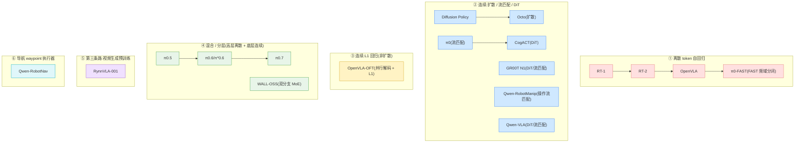

# 全模型规格对比大表

> [← 返回主报告](../index.md)

> **本页用途**:把 26 个代表模型的规格拍平成**一张主对比大表**,让你一页看全"谁用什么主干、动作怎么生成、跑多快、用多少数据、开不开源"。这是一张**横切对照页**,只做规组与交叉引用,**不复述单模型细节**——任何一格想深究,点对应细读。
> **可信度体例**:⚠️ = 提出方/厂商自评数字;✅ = 经核查/基准维护方统一评测;**待核** = 源文件未给出一手定量,**不编造**(尤其许可证与参数量)。
> **三处权威源声明(务必先读)**:① **规格以各模型细读为权威源**(本表的数字均可在对应 `xx.md` 里找到出处);② **成绩(成功率/基准分)一律见 [数据集与基准](benchmarks.md)**,本表不抄成绩;③ **年代序与机构以 [发展时间线](timeline.md) 为准**。

---

## 一、主对比大表(26 模型 × 12 维,按时间排序)

> **动作表示图例**:`离散token` = 离散自回归动作 token;`流匹配` = flow matching 连续动作;`扩散DiT` = Diffusion Transformer 连续动作;`L1` = 连续表示 + L1 回归;`混合` = 高层离散 + 底层连续;`视频生成` = 第三条路(视频生成预训练)。
> **系统形态图例**:`单体` = 单一模型端到端;`双系统` = 慢 VLM 推理(System 2)+ 快控制器执行(System 1)。

| 模型 | 年份 | 机构 | 主干 VLM | 视觉编码器 | 总参数 | 动作表示 | 控制频率 | 训练语料规模 | 单体/双系统 | 开源/许可 | 细读 |
|---|---|---|---|---|---|---|---|---|---|---|---|
| **RT-1** | 2022.12 | Google / Everyday Robots | 无 LLM(EfficientNet-B3 + USE + 8 层 decoder-only Transformer) | EfficientNet-B3(FiLM 语言条件) | ~35M | 离散token(256-bin × 11 维) | ~3 Hz ⚠️ | ~13 万真机 episodes / 700+ 指令 | 单体 | 开源(代码权重公开)/ 具体许可证**待核** | [rt1.md](rt1.md) |
| **Diffusion Policy** | 2023.03 | Columbia / TRI / MIT | 无(非 VLA;无 LLM 主干) | ResNet-18(spatial softmax + GroupNorm,端到端) | 待核 | 扩散(条件 DDPM;默认 1D U-Net,可选 Transformer) | ~0.1s/次推理(DDIM 10 步)⚠️;控制频率视任务**待核** | 4 基准 12 任务(逐任务演示,规模**待核**) | 单体 | 开源(代码公开)/ 具体许可证**待核** | [diffusion-policy.md](diffusion-policy.md) |
| ⭐ **RT-2** | 2023.07 | Google DeepMind | PaLI-X(5B/55B)/ PaLM-E(12B) | 主干 VLM 内置(PaLI-X / PaLM-E 视觉) | 5B / 12B / 55B | 离散token(256-bin × 8 维,文本 token) | 55B≈1–3 Hz;5B≈5 Hz ⚠️(须多 TPU 云端) | 机器人轨迹 + 网络 VL 数据 co-fine-tune(规模**待核**) | 单体 | **闭源**(权重/代码均未公开) | [rt2.md](rt2.md) |
| **Octo** | 2024.05 | UC Berkeley / Stanford / CMU / Google DeepMind 等 | 无大 LLM(t5-base 文本编码器 + ViT 式 Transformer) | 浅层卷积 patch stem(ViT 式) | Octo-Small 27M / Octo-Base 93M | 扩散(条件 DDPM 动作头,动作块) | 扩散多步去噪,实时控制频率**待核** | OXE 约 80 万条(800k)轨迹(25 子集) | 单体 | **完全开源**(权重/代码/数据管线/微调脚本)/ 具体许可证**待核** | [octo.md](octo.md) |
| **OpenVLA** | 2024.06 | Stanford / UC Berkeley / Google DeepMind / TRI / MIT 等 | Llama 2 7B | DINOv2 + SigLIP 双流拼接(224×224) | ~7.5B(0.6B 视觉 + 2 层 MLP + 7B LLM) | 离散token(256-bin 分位数 × 7 维) | ~6 Hz(bf16@RTX4090,裸跑)⚠️ | OXE 约 97 万条(970k)真机演示 | 单体 | **完全开源**(权重/代码/数据混合/LoRA+量化工具链)/ 具体许可证**待核** | [openvla.md](openvla.md) |
| **RDT-1B** | 2024.10 | 清华 TSAIL | 无独立 VLM(SigLIP + T5-XXL 冻结编码器作条件) | SigLIP-so400m(冻结) | ~1.2B(扩散 DiT 主干) | 扩散DiT(纯去噪一体化,动作块 64 步) | 推理 DPM-Solver++ 5 步;RTX4090 等效 ~381 Hz ⚠️ | 46 数据集 / 1M+ 轨迹 / ~21TB 预训练 + 6K+ ALOHA 双臂微调 | 单体(纯扩散一体化) | **MIT 开源**(代码/权重/数据) | [rdt-1b.md](rdt-1b.md) |
| **π0** | 2024.10 | Physical Intelligence | PaliGemma(SigLIP-So400m + Gemma 2B) | SigLIP-So400m(400M) | ~3.3B(~3B 主干 + ~300M 动作专家) | 流匹配(连续,动作块 50 步) | 50 Hz ⚠️(去噪约 10 步) | 自有灵巧操作数据 + 开源 OXE(规模**待核**) | 单体(双流权重,一个 Transformer) | 当时**未完全开源**(后续版本另议)/ 许可证**待核** | [pi0.md](pi0.md) |
| **CogACT** | 2024.11 | 清华大学 / 微软亚洲研究院 | Llama-2(7B 级,Prismatic VLM) | DINOv2 ViT-L/14 + SigLIP ViT-So400M/14 | ~7B(VLM)+ DiT 动作模块(S/B/L 三档) | 扩散DiT(cognition token 条件,动作块 N=15) | DDIM 10 步去噪,实时控制频率**待核** | OXE 子集约 0.4M 轨迹 / 22.5M 帧(25 数据集) | 单体(组件化:VLM 认知 + DiT) | 开源(代码/权重公开)/ 具体许可证**待核** | [cogact.md](cogact.md) |
| **SpatialVLA** | 2025.01 | 上海 AI Lab / 上科大等 | PaliGemma2(~3.5B) | SigLIP + ZoeDepth 单目深度(Ego3D 编码) | ~3.5B | 离散token(自适应动作网格,~8194 空间 token,自回归) | T=4 步动作块;实时频率**待核** | 1.1M 真机轨迹(OXE 子集 + RH20T 重加权) | 单体 | **开源**(代码/权重)/ 许可证**待核** | [spatialvla.md](spatialvla.md) |
| **π0-FAST** | 2025.01 | Physical Intelligence | PaliGemma(同 π0) | SigLIP-So400m(同 π0) | ~3B 级(同 π0 主干，动作头改自回归) | 离散token(FAST = DCT + 量化 + BPE 频域分词) | 自回归高频化(具体 Hz **待核**) | 同 π0 系数据;FAST+ 分词器在 100 万条真机轨迹上训练 | 单体 | FAST+ 分词器开放;π0-FAST 权重开放程度**待核** | [pi0-fast.md](pi0-fast.md) |
| **Helix** | 2025.02 | Figure AI | 7B 开放权重 VLM(型号**待核**) | S1 自带全卷积多尺度骨干(仿真预训练) | 7B(S2)+ 80M(S1) ⚠️ | 回归(S1 cross-attn enc-dec 直出 35-DoF 连续动作) | S2 7–9 Hz / S1 200 Hz ⚠️ | 约 500h 遥操作 ⚠️(称 <5% 既往 VLA 数据) | **双系统**(7B S2 + 80M S1,隐向量异步桥接) | **未开源**(无论文/权重/数据) | [helix.md](helix.md) |
| **OpenVLA-OFT** | 2025.02 | Stanford(OpenVLA 原班) | Llama 2 7B(不动主干) | DINOv2 + SigLIP(同 OpenVLA) | ~7.5B(同 OpenVLA) | L1(并行解码 + 动作分块 + 连续表示 + L1 回归) | 108.8 Hz ⚠️(对比原 OpenVLA 4.2 Hz) | 微调期目标数据集约 500 条演示(LoRA;主干沿用 OpenVLA 预训练) | 单体 | 开源(配方/代码公开)/ 具体许可证**待核** | [openvla-oft.md](openvla-oft.md) |
| **GO-1** | 2025.03 | 智元 AgiBot / 上海 AI Lab | InternVL2.5-2B | InternViT | 待核(VLM 2B + 24 层 Latent Planner + 动作专家) | 潜动作桥接(ViLLA:离散潜动作 token + 扩散动作专家,块 H=30) | 待核 | AgiBot World(规模见数据全景)+ Ego4D 人类视频 | 单体(ViLLA 三段式) | **权重开源**(GO-1 / GO-1-Air)/ 许可证**待核** | [go-1.md](go-1.md) |
| **Gemini Robotics** | 2025.03 | Google DeepMind | Gemini 2.0(云端蒸馏 backbone) | Gemini 2.0 视觉(内置) | 待核(前沿 VLM,未披露) | 连续(本机 action decoder 出动作块) | 端到端 ~250 ms / 等效 50 Hz ⚠️(云 backbone <160 ms) | 待核(机器人专用训练 + 具身推理数据,未披露规模) | 双系统(云 backbone + 本机 decoder) | **闭源** | [gemini-robotics.md](gemini-robotics.md) |
| **GR00T N1** | 2025.03 | NVIDIA | Eagle-2(SmolLM2 + SigLIP-2) | SigLIP-2(224×224,pixel shuffle,64 token/帧) | ~2.2B(VLM ~1.34B + DiT) | 扩散DiT / 流匹配(16 步动作块) | System 2 ~10 Hz;System 1 ~120 Hz ⚠️ | 数据金字塔:人类视频 + 合成(827h 神经轨迹)+ 88h 真机；预训练 ~5 万 H100 时 | 双系统(System 2 VLM + System 1 DiT) | **全面开放**(GR00T-N1-2B 权重/数据/仿真基准)/ 具体许可证**待核** | [groot-n1.md](groot-n1.md) |
| **π0.5** | 2025.04 | Physical Intelligence | 标准 web VLM 初始化(承 π0 系) | 承 π0 系(SigLIP)；具体**待核** | 待核(承 π0 双流，未给确切总数) | 混合(高层 FAST 离散 token + 底层流匹配 50 步) | 50 Hz ⚠️(底层流匹配 10 步去噪) | 约 400 小时移动操作 / 约 100 训练环境 + 6 类异构数据 co-train | 单体(同一 Transformer 两级推理) | **未开源**(数据/权重均闭) | [pi05.md](pi05.md) |
| **GR-3** | 2025.07 | 字节跳动 Seed | Qwen2.5-VL-3B-Instruct | Qwen2.5-VL 内置视觉 | ~4B(主干 + flow-matching DiT) | 流匹配(动作 DiT,k-token 动作块,Euler Δτ=0.2) | 待核(实时控制,具体 Hz 未给) | 三源:网页 VL co-train + VR 人类轨迹(PICO4U,~450/h)+ 真机(pick 35k/bussing 101h/cloth 116h) | 单体(VLM 主干 + 流匹配专家) | 报告/项目页公开,权重开放程度**待核** | [gr-3.md](gr-3.md) |
| **MemoryVLA** | 2025.08 | 清华黄高组 / Dexmal / 旷视等 | 7B Prismatic VLM(DINOv2+SigLIP+LLaMA-7B,OXE 续训) | DINOv2 + SigLIP | ~7B(VLM)+ 记忆库 + DiT 动作头 | 扩散DiT(记忆条件化,16 步动作块) | 推理 ~0.194s/步(记忆开销仅 +3.6%)⚠️ | 各基准对应数据(Bridge/RT-1/LIBERO/Mikasa/自采) | 单体 + 感知-认知记忆库(PCMB) | 开源程度**待核** | [memoryvla.md](memoryvla.md) |
| **WALL-OSS** | 2025.09 | X Square Robot(自变量机器人,机构属推断) | Qwen2.5-VL（紧耦合 MoE,`Qwen2_5_VLMoEForAction`) | Qwen2.5-VL 内置视觉 | ~4B(MoE,BF16) | 混合(LM Head 出 FAST 离散 token + Flow Head 出连续，双分支) | 待核 | 网页图文 + 对话 + 长视频 + 多本体机器人数据 co-train(规模**待核**) | 单体(紧耦合 MoE,静态路由) | **开源**(GitHub `X-Square-Robot/wall-x`，HF `wall-oss-flow`/`wall-oss-fast` 双分支)/ 具体许可证**待核** | [wall-oss.md](wall-oss.md) |
| **RynnVLA-001** | 2025.09 | 阿里达摩院 + 湖畔实验室 | 无 VLM 主干(从文生图 Chameleon 扩展为 I2V 自回归 Transformer) | Chameleon 视觉离散 token(Qwen2-VL-7B 仅作辅助标注) | 7B 级 | 视频生成(主干)+ ActionVAE 连续隐向量(动作头) | 待核(推理只出动作、丢弃未来帧) | 约 1200 万条第一视角人类操作视频(预训练)+ 自采机器人数据 | 单体 | **开源**(GitHub `alibaba-damo-academy/RynnVLA-001`,代码+权重)/ 具体许可证**待核** | [rynnvla.md](rynnvla.md) |
| **π0.6 / π\*0.6** | 2025.11 | Physical Intelligence | Gemma3-4B 初始化 | SigLIP-400M | Gemma3-4B 主干 + 860M 动作专家(总数源未给,~4.9B 系相加估算) | 混合(分层:高层离散自回归 + 底层流匹配;同时支持 FAST 离散) | 待核(承 π0.5 高频流匹配) | 示范 + on-policy 自采 + 专家遥操作干预(RECAP 真机 RL;规模**待核**) | 单体(分层两级 + KI 训练) | **未开源**(数据/权重均闭) | [pi06.md](pi06.md) |
| **Wall-OSS-0.5** | 2026.02 | X Square Robot(自变量机器人) | Qwen2.5-VL-3B-Instruct + MoT 双专家 | Qwen2.5-VL 内置视觉(448px) | ~4B(MoT:VL Expert + Action Expert) | 混合(梯度桥接:离散 RVQ 训练桥 + 连续流匹配部署) | 三视角 224² ~21Hz / 448² ~15Hz(RTX5090,T=10)⚠️ | 1M+ 轨迹/epoch(60% 自采 + 40% 开源 10 子集)+ 90M 多模态(9:1) | 单体(MoT 路由,端到端梯度) | **开源**(GitHub `X-Square-Robot/wall-x`)/ 许可证**待核** | [wall-oss-05.md](wall-oss-05.md) |
| **π0.7** | 2026.04 | Physical Intelligence | Gemma3-4B(承 π0.6) | ~400M 视觉编码器(含于 4B 主干) | ~5B(4B Gemma3 主干 + 860M flow-matching 动作专家) | 混合(分层 + MEM 视频历史 + 视觉子目标;承 π0.6) | RTC,最大推理延迟 ~240 ms ⚠️（社区报 ~127 ms,口径不同,**待核**） | 大量次优/失败/旧模型 rollout 混合质量数据 + 富上下文条件化(规模**待核**) | 单体(分层 + 富上下文条件化) | **未开源**(数据/权重均闭) | [pi07.md](pi07.md) |
| **Qwen-VLA** | 2026.05 | 阿里巴巴 Qwen 团队 | Qwen3.5-4B(稠密) | Qwen3.5-VL 内置视觉 | Qwen3.5-4B 主干 + 1.15B DiT 解码器(总数源未给,~5.2B 系相加估算) | 扩散DiT / 流匹配(统一"动作-轨迹"空间) | 待核(技术报告全文未放出) | 操作轨迹 + VLN 导航 + 轨迹监督 + 辅助 VL 数据(规模**待核**) | 单体(VL 主干 + DiT 双流) | **开放程度待确认**(仓库主要为报告/Demo,权重/许可证未明) | [qwen-vla.md](qwen-vla.md) |
| **Qwen-RobotManip** | 2026.06 | 阿里巴巴 Qwen 团队 | Qwen3.5-4B | Qwen3.5-VL 内置视觉 | 主干 4B + DiT 动作专家(10 blocks,hidden 768;总数待核) | 流匹配 DiT(80 维 canonical state-action,camera-frame EEF delta) | 推理 4 步 Euler;控制频率待核 | 约 38,100h(开源机器人数据 + 人类视频 + human-to-robot 合成;15 平台合成约 24,808h) ⚠️ | 单体(VL backbone + action expert) | 官方 GitHub 公开;权重/许可证待核 | [qwen-robotmanip.md](qwen-robotmanip.md) |
| **Qwen-RobotNav** | 2026.06 | 阿里巴巴 Qwen 团队 | Qwen3-VL(2B/4B/8B 变体) | Qwen3-VL 内置 SigLIP-2 视觉 | 2B/4B/8B + 轻量 4 层 waypoint head | Waypoint 回归(K=8,每点 x/y/theta;task-adaptive observation encoding) | 待核(真实部署有云端/本机延迟对比,未统一为控制 Hz) | 15.6M samples(85% 导航轨迹规划 + 15% VL reasoning) ⚠️ | 分层系统中的导航执行器(上层 planner 可重配置调用) | 官方 GitHub 公开;权重/许可证待核 | [qwen-robotnav.md](qwen-robotnav.md) |

> **关于"成绩"**:上表**刻意不列任何成功率/基准分**。各模型的 LIBERO / SimplerEnv / 真机成功率及其可信度标注,**统一见 [数据集与基准](benchmarks.md)**(那里区分了 ⚠️ 自评与 ✅ 第三方核查)。

---

## 二、如何读这张表

这张表是一台"规格透镜",建议按下面四步读:

1. **先看"动作表示"列,定位路线。** 这是全表最有信息量的一列——它决定了模型的频率上限、精度天花板与工程复杂度。把同色路线的行竖着对比,就能看清同一条路线如何随时间演进(详见下节小结)。
2. **再看"主干 VLM + 视觉编码器",看它"蹭"了多少互联网知识。** 从 RT-1 的"无 LLM、小模型纯模仿",到 RT-2 把动作塞进 PaLI-X/PaLM-E,再到后来清一色 PaliGemma / Llama-2 / Gemma3 / Qwen 系——主干越强,语义泛化通常越好,但推理也越慢、越依赖云端。**注意 RynnVLA 是个例外**:它不走 VLM 主干,而从文生图模型 Chameleon 扩展,代表"第三条路"。
3. **把"总参数 + 控制频率"放一起看权衡。** 参数大 ≠ 跑得快:RT-2-55B 只有 1–3 Hz、必须上云;而双系统(GR00T N1、Gemini Robotics)用"慢 VLM + 快控制器"把这对矛盾拆开——System 2 约 10 Hz 想,System 1 约 50–120 Hz 动。
4. **最后看"开源/许可"决定可用性。** 这是落地与复现的现实约束:Octo / OpenVLA / GR00T N1 / RynnVLA / WALL-OSS 权重公开可二次开发;RT-2、Gemini Robotics、π0.5/π0.6/π0.7 闭源;Qwen-VLA 撰写时开放程度待确认。**凡许可证一手未给,本表一律标"待核"而非臆测。**

> **重要提醒**:凡标 **待核** 的格子,是源细读里**没有给出一手定量/事实**的项(尤其许可证、确切总参数、部分控制频率与语料规模)——请勿把"待核"误读为"为零"或"不存在",更不要拿外部记忆去填。

---

## 三、按"动作表示"分组的小结

把上表按动作生成方式重组,VLA 大致走了**四条路 + 一条另类路**:

- **① 离散 token 自回归(RT-1 → RT-2 → OpenVLA → π0-FAST)。** 把动作当文本 token 自回归吐出。优点是与 VLM 词表无缝、几乎零架构改动;短板是**高频灵巧控制吃力**(逐 token 串行慢、分箱损精度)。π0-FAST 用 DCT 频域分词压缩,补齐了这条路在高频上的短板。这条路后来**多被混合系统吸收为"高层子任务"分支**。

- **② 连续:扩散 / 流匹配 / DiT(Diffusion Policy → Octo;π0 → CogACT;GR00T N1;Qwen-VLA)。** 从高斯噪声迭代去噪生成连续动作块,天生擅长**多峰分布 + 动作分块 + 高频精细控制**。Diffusion Policy 是思想源头,Octo 把它搬进开源大 Transformer,π0 改用流匹配并外挂动作专家,CogACT/GR00T N1/Qwen-VLA 则把动作专家做成 **DiT**。这是**当前前沿主力**,尤其在精细灵巧任务上。

- **③ 连续但不用扩散:L1 回归(OpenVLA-OFT)。** OFT 是一记反例:用**并行解码 + 动作分块 + 连续表示 + 简单 L1 回归**,不靠扩散也能拿到连续控制的速度与精度,正面质疑了"连续动作必须靠扩散"的隐含共识。

- **④ 混合 / 分层(π0.5 → π0.6 → π0.7;WALL-OSS)。** 把"想做什么"(高层离散子任务)与"怎么做"(底层连续动作)拆成两级,**离散与连续合一**。π0 系沿这条线一路演进(π0.5 泛化 → π0.6 真机 RL → π0.7 可操控 + 组合泛化);WALL-OSS 则用紧耦合 MoE 把 FAST 离散分支与流匹配分支并存于同一 Qwen2.5-VL 主干。

- **⑤ 第三条路:视频生成预训练(RynnVLA-001)。** 不在"动作输出形式"上做文章,而在**预训练先验来源**上另起一路:用自回归视频生成(从 Chameleon 扩展的 I2V)在 1200 万人类视频上学"世界如何随操作演变"的动态先验,再迁移到机器人(动作侧用 ActionVAE 连续隐表征)。

- **⑥ 导航 waypoint 执行器(Qwen-RobotNav)。** 它不是机械臂操作 VLA,而是把 VLN / PointNav / ObjNav / Tracking / driving 统一成 waypoint trajectory prediction,并把 observation context 做成推理时可控参数。本站单列这一类,避免把导航模型误塞进 manipulation action head 对比。

> **总体判断**(同主报告与 [时间线](timeline.md)):技术天平整体**倒向连续动作生成**,但领先的混合系统在高层抽象子任务上**仍保留离散 token**——两条路并非互斥,正走向融合。系统形态上,**双系统**(慢 VLM + 快控制器)成为兼顾"想得对"与"动得快"的主流工程答案。详见主报告 [第三部分 · 技术路线之争](../index.md#三技术路线之争离散-token-vs-连续扩散流匹配)。

---

## 四、三处权威源声明(再次明确)

为避免误用本表,重申本站体例下的三条采信规则:

1. **规格以各细读为权威源。** 本表每一格都可在对应 `xx.md` 细读里找到出处;若细读与本表冲突,**以细读为准**。本表为压缩转述,细节(如确切层数、动作维度、训练阶段)请回到细读核对。
2. **成绩见 [benchmarks.md](benchmarks.md)。** 本表不列任何成功率/基准分;所有定量成绩及其 ⚠️/✅ 可信度标注,统一以 [数据集与基准](benchmarks.md) 为准。
3. **年代序见 [timeline.md](timeline.md)。** 本表按 arXiv 首发/官方发布排序,机构与年份口径以 [发展时间线](timeline.md) 为准。

---

*本对比表基于《VLA(视觉-语言-动作)模型发展深度调研报告》及 26 篇模型细读整理。⚠️ 标记处为提出方/厂商自评数据;**待核** 处为一手源未给出、不予编造。*
