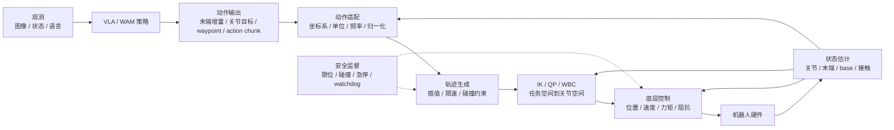

# 运控算法基础:从 VLA 动作到机器人执行

> [← 返回主报告](../index.md)

> **定位**:本页是“具身基础”专题,讲的是 VLA/WAM 策略模型输出动作之后,机器人系统如何把这些动作变成平滑、可行、安全的底层执行命令。它不是某一篇论文细读,而是连接“基础模型”和“真实机器人”的运控层地图。

*读图方式:模型输出只是意图或目标,真正上机前还要经过坐标系、运动学、轨迹、接触力控和安全约束这一层工程翻译。*

---

## 摘要

具身模型常说“输出动作”,但真机里动作通常不会直接进电机。中间还要经过一层运控系统:

> **高层策略决定想做什么,运控算法决定这件事能不能以机器人当前状态、关节限制、碰撞约束、接触力和实时频率真正做出来。**

在 VLA/WAM 语境里,运控层主要解决五类问题:

1. **动作接口对齐**:把模型输出的末端位姿、关节目标、base waypoint、gripper 信号或 action chunk,转成机器人控制器能吃的格式。
2. **运动学可行性**:用 FK/IK、Jacobian、QP 等方法处理坐标系、奇异位形、关节限位和冗余自由度。
3. **轨迹与实时性**:把稀疏目标点或低频动作块插值成高频、平滑、限速限加速度的参考轨迹。
4. **接触与力控**:插入、推拉、擦拭、抓取等任务不能只靠位置跟踪,需要阻抗/导纳/力矩控制处理接触。
5. **安全与约束**:碰撞、速度、力矩、工作空间、姿态、夹爪开合和急停都要在模型之外兜底。

---

## 1. 运控层在系统里的位置

一个容易混淆的点是:**VLA 的 action head 和机器人运控不是同一层东西**。

| 层级 | 典型频率 | 主要职责 | 常见输出 |
|---|---:|---|---|
| 语言/视觉推理层 | 0.5-10 Hz | 理解任务、物体、场景和子目标 | 子任务、目标物体、视觉 grounding |
| 策略动作层 | 5-50 Hz | 根据观测生成下一段动作或目标 | action chunk、EEF delta、joint target、waypoint |
| 运控层 | 50-1000 Hz | 让动作满足运动学、动力学、约束和安全 | 轨迹点、关节速度、力矩、阻抗参数 |
| 驱动/伺服层 | 500-2000 Hz | 电机闭环、电流/力矩/位置伺服 | motor command |

所以,一个模型在论文里“50 Hz 输出动作”,并不意味着它绕过了所有运控。真实系统通常仍需要坐标系转换、动作平滑、限幅、IK、碰撞检查和硬件 watchdog。

---

## 2. 输入输出:运控到底接什么

VLA/WAM 给运控层的输入大致分为六类:

| 模型输出 | 运控侧要做什么 | 常见风险 |
|---|---|---|
| **末端位姿 / 位姿增量** | 转成目标 EEF pose,再经 IK/QP 求关节命令 | 坐标系错、姿态跳变、IK 奇异 |
| **关节位置 / 速度** | 限速、限加速度、插值,再送关节控制器 | 关节限位、速度尖峰、跨本体不通用 |
| **base waypoint / base velocity** | 局部路径规划、轨迹跟踪、避障 | 地图/定位误差、转弯半径、动态障碍 |
| **action chunk** | 作为短时参考轨迹执行,必要时重规划 | open-loop 过长导致误差累积 |
| **gripper 开合** | 映射到夹爪宽度、力度或离散开合 | 夹爪语义不一致、接触检测缺失 |
| **阻抗/力控参数** | 调整刚度、阻尼、目标力或导纳参数 | 参数不稳定、接触力过大 |

对站内 VLA 论文来说,最常见的是前三种:末端增量、关节动作、waypoint。`robot ee cmd`、`joint pos cmd`、`base velocity cmd` 这类字段,本质都是运控接口的一部分。

---

## 3. 核心算法地图

| 算法/模块 | 解决什么 | 在具身模型里的角色 | 适合场景 |
|---|---|---|---|
| **PID / 级联伺服** | 让关节或末端跟踪目标 | 最底层常规闭环,不负责理解任务 | 位置/速度控制、基础夹爪控制 |
| **轨迹生成** | 把目标点变成平滑轨迹 | action chunk 的执行器和插值器 | 限速、限加速度、避免动作尖峰 |
| **正/逆运动学(FK/IK)** | 关节空间与任务空间互转 | 把 EEF 目标转成关节命令 | 单臂、双臂、夹爪到物体 |
| **微分 IK / QP IK** | 在速度层求满足约束的动作 | 加关节限位、姿态、避障、优先级 | 高频视觉伺服、冗余机械臂 |
| **操作空间控制(OSC)** | 直接在末端任务空间控制力/运动 | 让末端动作更贴合任务几何 | 插入、推拉、末端精细操作 |
| **阻抗控制** | 让机器人像弹簧-阻尼系统一样接触环境 | 给学习策略加接触柔顺性 | 抓取、擦拭、装配、人与机器人交互 |
| **导纳控制** | 根据外力改变运动参考 | 外力传感明显时的柔顺控制 | 拖拽示教、协作、接触引导 |
| **MPC** | 滚动优化未来一段控制序列 | 把约束、动力学和预测结合 | 移动底盘、腿式、人形、动态操作 |
| **全身控制(WBC)** | 多任务、多接触、多关节统一求解 | 人形/移动操作的约束求解核心 | 站立、行走、双臂、躯干协同 |
| **状态估计** | 融合编码器、IMU、视觉、力传感 | 给策略和控制器提供可信状态 | 移动机器人、人形、接触丰富任务 |
| **安全监督** | 限位、碰撞、急停、watchdog | 模型之外的最后兜底层 | 所有真机部署 |

这里的关键不是“哪个算法最新”,而是看它在系统里负责哪种约束。VLA 可以学到很强的任务先验,但它通常不会天然保证关节速度、碰撞距离、接触力和电机温度都安全。

---

## 4. 按机器人形态看运控重点

### 4.1 桌面单臂/双臂操作

这类系统最常见于 [RT-1](rt1.md)、[RT-2](rt2.md)、[OpenVLA](openvla.md)、[Octo](octo.md)、[π0](pi0.md)、[Qwen-RobotManip](qwen-robotmanip.md) 等操作模型。

| 重点 | 说明 |
|---|---|
| EEF pose / delta action | 模型常输出末端位姿增量,再经 IK 或控制器落到关节 |
| action chunk | 一次生成多步动作,降低高层推理频率,但要处理执行误差 |
| gripper 语义 | 开/合、宽度、力度、接触检测在不同本体上差异很大 |
| 接触柔顺 | 插入、叠衣、擦拭、抽屉等任务需要阻抗/力控或动作纠偏 |
| 双臂协调 | 两臂之间要避免自碰撞,还要处理相对位姿和共享物体约束 |

### 4.2 移动操作与导航

[Qwen-RobotNav](qwen-robotnav.md)、[SteerVLA](steervla.md) 这类模型往往输出 waypoint、轨迹点或局部目标。它们更像在给 planner/tracker 提供目标,而不是直接控制电机。

| 重点 | 说明 |
|---|---|
| 全局/局部路径规划 | 高层目标要避障、绕行、满足底盘运动学 |
| 轨迹跟踪 | waypoint 需要转成速度指令或底盘控制量 |
| 定位与地图 | navigation 失败常来自状态估计和地图误差,不只是策略错 |
| 底盘-机械臂协调 | 移动底盘的位置会改变机械臂可达空间和操作姿态 |

### 4.3 人形和腿式机器人

人形不是“多加几个关节的机械臂”。它的运控重点在平衡、接触切换和多任务优先级。

| 重点 | 说明 |
|---|---|
| WBC | 同时管脚底接触、质心、躯干、双臂、头部和关节限位 |
| MPC | 常用于质心、步态、接触序列或未来几步控制优化 |
| 接触切换 | 站立、行走、蹲起、拿取都会改变支撑状态 |
| 任务优先级 | 保持平衡通常优先于手部精细任务 |
| 高低层分离 | VLA 给意图/目标,低层 locomotion controller 保证身体可执行 |

这也是为什么 [GR00T N1](groot-n1.md)、[Helix](helix.md) 等系统都强调快慢系统:慢系统负责语义和计划,快系统负责高频身体控制。

---

## 5. VLA/WAM 和运控的四种接法

| 接法 | 形态 | 优点 | 代价 |
|---|---|---|---|
| **端到端动作直出** | 模型直接输出关节/末端动作 | 架构简单,数据驱动强 | 安全和可解释性弱,跨本体难 |
| **动作块 + 执行器** | 模型输出短 horizon action chunk | 推理频率低,动作连续性好 | chunk 太长会 open-loop 漂移 |
| **目标/waypoint + 控制器** | 模型输出目标,运控求轨迹 | 易加约束和安全,工程稳 | 需要手写控制器和接口 |
| **预测/世界模型 + MPC** | 预测未来,滚动选择动作 | 可显式利用未来状态 | 系统复杂,算力和模型误差压力大 |

现在的前沿系统通常不是单选。比如连续扩散/流匹配 VLA 已经把一部分“运动生成”学进模型,但部署时仍会保留动作限幅、重采样、坐标变换、IK/关节控制和安全层。

---

## 6. 最容易踩的坑

| 坑 | 典型表现 | 检查方式 |
|---|---|---|
| 坐标系混乱 | 手往反方向走、旋转轴错、移动底盘目标漂移 | 明确 world/base/camera/EEF/action frame |
| 单位不一致 | cm 当 m、角度当弧度、夹爪宽度归一化错 | 每个 action 维度写清单位和范围 |
| 频率不匹配 | 模型低频、控制高频,动作卡顿或过冲 | 做时间戳、插值和 hold-last-value 策略 |
| 动作限幅太粗 | 策略输出被硬截断,轨迹变形 | 分开限制位置、速度、加速度、jerk |
| IK 不稳定 | 靠近奇异位形时关节乱跳 | 用阻尼最小二乘、QP 约束、姿态权重 |
| 接触缺柔顺 | 插入过深、撞击、夹取后抖动 | 加阻抗/力控或接触状态机 |
| open-loop 过长 | 前几步偏了,后续动作继续错 | 缩短 chunk、提高重规划频率、加反馈 |
| 安全只靠模型 | 分布外场景中撞桌、撞人、拉扯线缆 | 独立安全层,不要把安全完全交给策略 |

如果一个 VLA 真机结果“仿真好、真机差”,优先排查的不一定是模型规模,也可能是动作接口、坐标系、控制频率、夹爪语义或接触控制出了问题。

---

## 7. 建议学习顺序

1. **坐标系与运动学**:world/base/camera/EEF frame、齐次变换、FK、Jacobian。
2. **IK 与约束求解**:解析 IK、数值 IK、微分 IK、QP IK、关节限位。
3. **轨迹生成**:插值、速度/加速度/jerk 限制、时间参数化、action chunk 执行。
4. **底层控制**:位置/速度/力矩控制、PID、级联控制。
5. **接触控制**:阻抗控制、导纳控制、力/位混合控制、接触状态机。
6. **动态系统**:MPC、WBC、locomotion、平衡和多接触。
7. **与学习策略集成**:动作归一化、频率桥接、数据记录、失败回放、安全兜底。

对 VLA/WAM 读者来说,不必一开始就深入电机驱动细节。更高收益的切入点是:**先把动作空间、坐标系、IK、轨迹生成和安全限幅搞清楚**。这些决定了论文里的 action 到底能不能在你的机器人上复现。

---

## 8. 和本站其他专题的关系

- [实验机器人本体](robots.md):回答“动作会落到哪种机器人上”。
- [具身数据处理](data-processing.md):回答“训练数据里的动作如何归一化、分块、重定向和清洗”。
- [具身模型训练全流程](training-pipeline.md):回答“策略模型如何学动作”。
- [推理加速与部署](inference-deployment.md):回答“模型推理如何满足实时约束”。
- [共性失败模式](failure-modes.md):回答“真机失败如何归因”。
- [Qwen-RobotManip](qwen-robotmanip.md):可作为跨本体 state-action 对齐与操作 VLA 的近期案例。

---

## 9. 后续可拆分的子专题

如果后面继续扩展“运控算法”栏目,建议按以下顺序拆页:

| 子专题 | 适合回答的问题 |
|---|---|
| IK / QP IK 专题 | 末端动作如何变关节动作,奇异和限位如何处理 |
| 轨迹生成与 action chunk 执行 | VLA 输出一段动作后,如何平滑、限速和重规划 |
| 阻抗/力控与接触操作 | 为什么插入、擦拭、叠衣不能只靠位置控制 |
| MPC / WBC | 人形、移动操作、多接触任务如何保持可行和稳定 |
| VLA 部署接口规范 | action space、state space、频率、时间戳和安全层如何设计 |

---

## 参考资料

- Modern Robotics: Mechanics, Planning, and Control. <https://modernrobotics.northwestern.edu/>
- Drake: Model-based design and verification for robotics. <https://drake.mit.edu/>
- Pinocchio: rigid body dynamics algorithms. <https://github.com/stack-of-tasks/pinocchio>
- Ruckig: online trajectory generation. <https://ruckig.com/>
- OCS2: optimal control for switched systems. <https://github.com/leggedrobotics/ocs2>
- MuJoCo MPC. <https://github.com/google-deepmind/mujoco_mpc>
