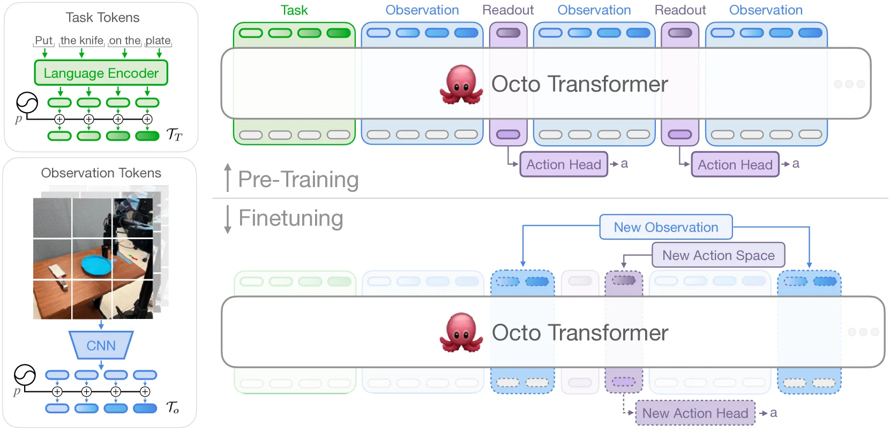

# Octo:开源通用机器人策略

> **arXiv**: [2405.12213](https://arxiv.org/abs/2405.12213) | **机构**: UC Berkeley / Stanford / CMU / Google DeepMind 等 | **时间**: 2024.05
> **路线**: 连续动作(Transformer 主干 + 扩散策略 Diffusion Policy)

> [← 返回主报告](../index.md)

---

## TL;DR

Octo 是一个**完全开源的通用机器人操作策略**,核心是一个**基于 Transformer 的扩散策略(diffusion policy)**。它在当时最大的真实机器人操作数据集 **Open X-Embodiment(OXE)的约 80 万条轨迹**上预训练,采用**模块化、可灵活组装**的架构设计:输入端可接受语言指令或目标图像作为任务说明,输出端可适配不同动作空间。最关键的工程贡献在于其**块式注意力(block-wise attention)+ readout token** 设计,使得在**消费级 GPU 上数小时内**即可微调到新的传感器输入或新的动作空间,而无需改动任何预训练参数。Octo 在 **9 个真实机器人平台、4 个机构**上完成验证,定位为可作为下游任务初始化的"通用策略底座"。

---

## 1. 问题:通用机器人策略缺乏开放、可复用的底座

机器人学习长期受困于"每个机器人、每个任务都要从零训练"的范式。彼时已有 RT-1/RT-2、RT-X 等大型机器人模型展现出跨任务泛化潜力,但它们普遍存在三个痛点:

1. **封闭**:权重、训练代码、数据管线大多不开放,社区无法在其基础上继续研究。
2. **僵化**:模型对输入(只支持固定的相机配置、必须用语言指令)和输出(固定的动作空间/机器人形态)做了硬编码假设,难以适配新机器人、新传感器。
3. **微调成本高**:把一个大模型适配到新平台,往往意味着大规模重训,而非轻量化的"接口替换"。

Octo 想回答的问题是:**能否提供一个开源、模块化、可在普通实验室算力下快速微调的通用机器人策略,使其既能开箱即用控制多种机器人,又能作为初始化高效迁移到全新的机器人配置?**

---

## 2. 方法与架构

*图注:Octo 模型架构。**左侧**:Octo 用预训练语言模型对任务描述(绿色)做 tokenize,用轻量级 CNN 对输入观测(蓝色)做 tokenize。**顶部**:Transformer 主干处理由任务 token 与观测 token 组成的序列,产生 readout token(紫色),再交给输出头生成动作。**底部**:Transformer 的块式注意力(block-wise attention)结构允许在微调阶段灵活增删输入/输出——例如加入新的观测(蓝色虚线)或新的动作空间(紫色虚线),而无需改动任何预训练参数。*

Octo 的核心是一个 transformer 策略 $\pi$,由三部分串联组成:**输入 tokenizer**(把语言指令 $\ell$、目标 $g$、观测序列 $o_1,\dots,o_H$ 转成 token $[\mathcal{T}_l,\mathcal{T}_g,\mathcal{T}_o]$)→ **Transformer 主干**(产生嵌入 $e_l,e_g,e_o = T(\mathcal{T}_l,\mathcal{T}_g,\mathcal{T}_o)$)→ **readout 输出头** $R(e)$(解码出动作 $a$)。下面分三小节展开 tokenization、主干 + 块式注意力、扩散动作头。

### 2.1 输入 tokenization:把异构模态统一成 token 序列

Octo 用**模态专属 tokenizer**把任务定义(语言指令 $\ell$、目标图像 $g$)与观测 $o$(腕部相机、第三人称相机等多路图像流)编码进同一套 token 空间:

- **语言**:文本先做分词,再经一个**预训练 transformer 文本编码器**得到一串语言 embedding token。论文明确用的是 **t5-base(111M 参数)**。
- **图像观测与目标图像**:共用一条视觉路径——先过一个**浅层卷积栈(shallow convolution stack)**作为 patch stem,再切成一串展平的 patch token(ViT 式)。选择浅层 CNN 而非重型 ResNet,使整体算力在普通 GPU 上仍可负担。

得到各模态 token 后,给它们加上**可学习的位置编码** $p$,并按 `[𝒯_T, 𝒯_{o,1}, 𝒯_{o,2}, …]`(任务 token 在前,随后是按时间步排列的观测 token)拼成 transformer 的输入序列。值得注意的是:语言指令与目标图像在训练时会**按样本随机置零**(见 2.3 训练细节),因此同一模型既能用语言指令、也能用目标图像作条件;对于没有语言标注的数据集则一律用目标图像条件。**不存在的观测**(如某数据集没有语言、没有腕部相机)对应的 token 会被**完全 mask 掉**,这正是异构数据能塞进同一序列的关键。

### 2.2 Transformer 主干、块式因果注意力与 readout token

拼好的统一 token 序列送入标准 **Transformer 主干**。两档规模直接对标 ViT:**Octo-Small(27M,骨干尺寸 ≈ ViT-S)**、**Octo-Base(93M,骨干尺寸 ≈ ViT-B)**。时序上,正式训练采用 **2 帧观测历史**(context 窗口为 2)——论文称在初步实验中,超过"再加一帧"之后收益就显著递减,故未用更长历史。

**块式因果注意力(block-wise masked attention)** 是这套模块化设计的结构核心,掩码遵循两条约束:

- **观测 token 只能因果地关注同一时间步及更早的观测 token $\mathcal{T}_{o,0:t}$ 以及任务 token $\mathcal{T}_T$**(绿色),不会"偷看"未来帧。
- 序列中额外插入一组**可学习的 readout token $\mathcal{T}_{R,t}$**(紫色)。某个 readout token **只关注它之前的观测/任务 token,但不被任何观测/任务 token 关注**——即它"只读不写",能被动地读取并加工主干内部表征,却不会反过来影响这些表征。其角色类似 BERT 的 `[CLS]`,是"截至当前观测序列"的紧凑向量摘要。动作头就挂在 readout token 的 embedding 上。

这套块结构带来的直接好处是**模块可插拔**:下游微调要加新任务/新观测/新动作头时,**主干的预训练权重可以整体保留**,只需补上对应的新位置编码、一个轻量新编码器、或新输出头的参数即可。这与 RT-1/GNM 等"标准 transformer 主干 + MLP 头"形成对比——后者一旦改动图像输入路数或任务规格,往往要**重新初始化或重训大块预训练组件**。正是这一点支撑了 Octo 的招牌能力:**在单张消费级 GPU 上数小时内**就能把模型适配到带新传感器(如力/力矩输入)、新动作空间(如关节位置控制)乃至新本体的机器人上,把"适配新机器人"从重训练问题降级为"接口拼装"问题。

### 2.3 扩散动作头与训练目标(核心)

输出头采用**条件去噪扩散(conditional diffusion / DDPM 式)** 来建模连续、多模态的动作分布,而非直接 MSE 回归或离散化动作 token——论文实测扩散头在零样本与微调两种评测下都优于这两类替代方案。它预测的是**动作块(action chunk)**,即一次输出若干个连续未来动作,而非单步动作。

**关键的效率细节**:每次预测动作,**Transformer 主干只前向一次**;多步去噪迭代**完全发生在那个很小的扩散头内部**,不重复跑主干。具体采样过程为:先采高斯噪声 $x^K\sim\mathcal{N}(0,I)$,再用一个学到的去噪网络 $\epsilon_\theta(x^k,e,k)$ 做 **$K$ 步去噪**,每步以"上一步输出 $x^k$、步数索引 $k$、以及 transformer 的 readout 输出 embedding $e$"为条件:

$$x^{k-1}=\alpha\big(x^{k}-\gamma\,\epsilon_\theta(x^{k},e,k)+\mathcal{N}(0,\sigma^{2}I)\big)$$

其中 $\alpha,\gamma,\sigma$ 由噪声调度决定,Octo 用标准的 **cosine 调度**。

**训练目标**采用标准 **DDPM**:对数据集中的真实动作加高斯噪声,训练去噪网络 $\epsilon_\theta(x^k,e,k)$ **预测所加的噪声 $\epsilon$**(即对噪声做 MSE 回归)以重建原动作。微调时沿用同一扩散目标并**更新整个模型**(实测优于冻结部分预训练参数的方案);标准微调配方为:用约 **100 条目标域轨迹**、训练 **50k 步**、cosine 衰减学习率配线性 warmup。

> 路线意义:扩散头能刻画"同一观测下存在多种合理动作"的**多模态分布**,这是 Octo 走"连续动作"路线区别于 RT-2/OpenVLA"离散动作 token + 自回归"路线的核心点。代价是采样需多步去噪迭代(虽然只在小头内部进行),相比一次前向即出动作仍有额外延迟。

### 2.4 训练数据与算力

**数据**:从 Open X-Embodiment(OXE,约 150 万条 episode)中精选 **25 个子数据集**,筛选条件为"含图像观测、采用 delta 末端执行器控制、行为多样",并剔除无图像流、过于重复、分辨率过低或任务过于小众的数据集,最终得到约 **80 万条(800k)轨迹**(RT-X 仅用了更受限的 350k 子集,故 Octo 是当时最大的机器人操作演示数据集)。

**采样加权(经验法则)**:各数据集权重大体**按其样本量**确定,并做两处人工微调——把"更多样"的数据集**权重翻倍**,把"含大量重复 episode"的数据集**下调权重**以免主导混合。预处理上还会**零填充缺失的相机通道**,并**对齐各数据集的夹爪动作空间**(统一为 +1 = 张开、0 = 闭合)。

**训练算力(以原文为准)**:Octo-Base(ViT-B)在 **TPU v4-128 pod** 上以 **batch size 2048 训练 300k 步,约 14 小时**;优化器为 AdamW(weight decay 0.1、梯度裁剪 1.0、inverse-sqrt 学习率调度)。同一模型在**单张 24GB 显存的 NVIDIA A5000** 上微调约需 **5 小时**(可多卡加速)。训练时还使用了 hindsight 目标重标注、常规图像数据增强,以及前述语言/目标图像随机置零。

---

## 3. 关键设计与创新点

1. **完全开源**:权重、训练代码、数据加载管线、微调脚本全部开放,可作为社区研究的公共底座。
2. **模块化、可组合的接口**:输入(语言/目标图像/多相机)与输出(任意动作空间)都做了解耦,而非硬编码到模型结构里。
3. **块式注意力 + readout token**:用注意力掩码的块划分实现"加输入/加输出而不动预训练权重",这是其**数小时微调到新平台**能力的结构性来源。
4. **Transformer + 扩散策略组合**:用大模型做表征、用扩散头建模多模态连续动作分布,代表了 VLA 中"连续动作"路线的早期系统化尝试。
5. **超大规模异构预训练**:在 OXE 约 80 万条轨迹(从 25 个子数据集中按样本量加权采样)上训练,覆盖多种机器人形态与行为。

---

## 4. 实验与关键结果

**预训练数据**:从 Open X-Embodiment 中精选 25 个含图像观测、末端执行器动作且行为多样的数据集,约 **80 万条轨迹**(当时最大的机器人操作数据集),按样本量加权组成每个训练 batch。

**真实机器人验证**:在 **9 个真实机器人设置、跨 4 个机构**上评测,涵盖多样物体交互(WidowX BridgeV2)、长时程任务(Stanford Coffee)、精密操作(Berkeley Peg Insertion)。

- **零样本(zero-shot)**:开箱即可控制预训练数据中出现过的多个机器人;以语言指定任务时,**优于 RT-1-X**(当时最佳的公开通用策略),并与 RT-2-X 表现相近。
- **微调迁移**:在消费级 GPU 上**数小时内**即可微调到新的传感器输入与新的动作空间,作为初始化显著优于从零训练。
- **模型规模**:在 UR5 与 WidowX 任务上,**性能随模型规模增大而提升**。

**仿真基准(供横向对照,数值随评测协议而异)**:

| 基准 | 设置 | Octo 成绩 |
|---|---|---|
| SimplerEnv (VM) | Google Robot | Octo-Base **11.0%** |
| SimplerEnv (VM) | WidowX / Bridge | Octo-Base **17.5%** / Octo-Small **30.0%** |
| SimplerEnv | Variant Aggregation(域随机化聚合) | **0.006**(几乎崩溃) |
| LIBERO | 平均成功率 | **~75.1%** |

> 注:SimplerEnv 的 Visual Matching(VM)成绩偏低,且在 Variant Aggregation(强域随机化/视觉变体聚合)下接近 0,说明 Octo 对视觉域偏移相当敏感;LIBERO 上 ~75% 的均值则相对稳健。不同后续工作复现的具体数字会因评测协议、checkpoint 与动作处理方式而有出入。

---

## 5. 局限与争议

- **扩散推理开销**:扩散动作头需多步去噪迭代,推理延迟高于一次前向即出动作的离散 token 方案,对高频实时控制不友好。
- **域随机化下崩溃**:SimplerEnv 的 Variant Aggregation 成绩约 **0.006**,在强视觉变体/域随机化下几乎失效,暴露其对视觉域偏移的脆弱性——这是"轻量 CNN 视觉编码 + 真机数据为主"路线的代价。
- **单视角/有限感知**:主要依赖单一(或少数)第三人称相机,对需要丰富多视角或本体感知的精密任务支持有限。
- **泛化的边界**:零样本能力主要覆盖预训练分布内的机器人与场景,真正的全新形态仍依赖微调。
- **复现差异**:不同工作报告的仿真数字差异较大,横向比较需谨慎对齐协议。

---

## 6. 在 VLA 谱系中的位置

Octo 是 **VLA "连续动作"路线的早期代表作**。它确立了"**大 Transformer 做表征 + 扩散头建模多模态连续动作**"的范式骨架,并以**完全开源 + 块式注意力的模块化设计**成为社区可复用的底座。

- 与 [[openvla]] 对照:OpenVLA 走"**离散动作 token + 自回归 VLM**"路线,把动作当作语言 token 预测;Octo 则走"**连续动作 + 扩散**"路线。二者代表了 VLA 输出端的两大分支。
- 与 [[pi0]] 对照:π0 进一步把连续动作生成升级为 **流匹配(flow matching)** 动作专家,可视为 Octo 这条"连续动作"路线的后续演进——用更高效的连续生成机制替代多步扩散,缓解推理开销问题。

可以说,Octo 把"通用、开源、可快速适配"三件事在连续动作路线上首次较为完整地组合起来,为后续 π0 等流匹配方案与各类开源 VLA 工作铺平了道路。

---

## 来源

- 论文 HTML:<https://arxiv.org/html/2405.12213v1>
- 论文摘要页:<https://arxiv.org/abs/2405.12213>
- 架构图:`images/octo_arch.webp`(Figure 1,Model architecture)
- 训练数据组成图:`images/octo_dataset.webp`(Figure 2,OXE 25 子数据集加权采样)
