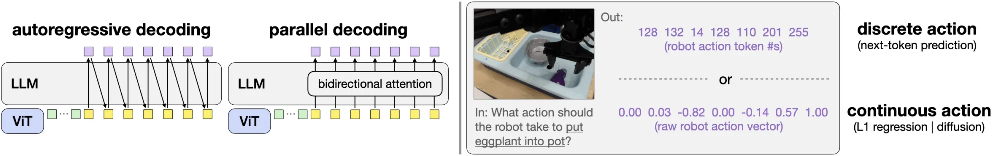

# OpenVLA-OFT:优化微调,把 VLA 的速度与成功率同时拉满

> **arXiv**: [2502.19645](https://arxiv.org/abs/2502.19645) (v2)
> **论文题目**: Fine-Tuning Vision-Language-Action Models: Optimizing Speed and Success
> **机构**: Stanford(OpenVLA 原班作者 Moo Jin Kim 等)
> **时间**: 2025.02(RSS 2025)
> **路线**: 连续动作 —— **并行解码 + 动作分块 + 连续动作表示 + L1 回归**,把原始 OpenVLA 的自回归离散 token 改造成一条连续回归路线

> [← 返回主报告](../index.md)

---

## TL;DR

OpenVLA-OFT 不是一个新的大模型,而是一套**「优化微调配方」(Optimized Fine-Tuning, OFT)**:它在不更换主干(仍是 OpenVLA 的 7B Llama 2 + DINOv2/SigLIP)的前提下,用四个组件把原始 OpenVLA「自回归逐 token 生成离散动作」的范式,整体改造为「**一次前向并行输出一整块连续动作**」。这四件套是:**并行解码(parallel decoding)+ 动作分块(action chunking)+ 连续动作表示 + L1 回归目标**。

效果是双赢:**动作生成吞吐提升约 26 倍(108.8 Hz vs 原始自回归的 4.2 Hz),单次查询延迟降低约 3 倍**;同时在 **LIBERO 仿真基准上把平均成功率从 76.5% 提到 97.1%**,发表时是 SOTA,超过了 π0、MDT、Seer、DiT Policy、Octo、Diffusion Policy 等一众基线。

最值得注意的一点立场:论文用实验质疑了「**做连续动作就必须用扩散/流匹配**」的隐含共识——一个简单的 **L1 回归**动作头,在精度上并不输给扩散头,且更快更省。在勺子舀取、脆饼插入这类高精度任务上,带 L1 的 OpenVLA-OFT+ 做到 100% 成功,而采用扩散策略的 π0 因为插入过深而失败。但作者明确 **hedge**:这不等于「L1 普遍优于扩散」,只是说明在 VLA 微调这个具体场景里,简单回归足够强。

> 命名约定:论文里带 **「+」后缀**(OpenVLA-OFT+)指在 OFT 基础上额外集成了 **FiLM(feature-wise linear modulation)**,用于在语言理解关键的任务上强化语言 grounding,主要用在真实双臂 ALOHA 实验。

---

## 1. 要解决的问题

OpenVLA([[openvla]])作为开源 VLA 的事实标准 baseline,继承了 RT-2 的「动作即语言」范式:把 7 维动作各自量化成离散 token,由 LLM **自回归逐个生成**。这套范式简单通用,但在落地到实时灵巧控制时有两个硬伤:

1. **推理慢**。一个动作要顺序解码 7 个 token,7B 主干逐 token 前向,实时控制频率受限。论文实测原始 OpenVLA 在 A100 上只有 **4.2 Hz** 的动作生成吞吐、单次查询延迟约 **0.24 s**。对需要高频闭环的双臂灵巧操作而言,这个速度几乎不可用。
2. **自回归范式不支持动作分块(action chunking)**。原始 OpenVLA 每步只预测**单个**动作、无观测历史,无法像 ACT/Diffusion Policy 那样一次输出一段未来动作序列。缺了动作分块,既丢了高频连续控制能力,又更容易在长程任务里累积误差、产生抖动。

于是问题被收敛为:**能不能在不动主干、不重新预训练的前提下,只靠改造「微调时的动作生成方式」,就同时把速度和成功率都显著提上去?** OFT 给出的答案是肯定的,而且改造点全部集中在「动作怎么表示、怎么解码、用什么损失」这三件事上。

---

## 2. 方法与架构

> **图注(译自原文 Figure 2)**:VLA 微调的关键设计决策。**左**:自回归解码(autoregressive decoding)逐个顺序生成动作,与并行解码(parallel decoding)的对比——后者利用**双向注意力**,在**单次前向**中一次性生成全部动作。**右**:离散动作 token + 下一 token 预测,与连续动作值 + L1 回归 / 扩散建模目标的对比。原始 OpenVLA 的训练方案 = 自回归解码 + 离散动作 + 下一 token 预测(即左图与右图各自的左半边);OFT 则把它整体切换到右半边。

OFT 的核心观察是:原始 OpenVLA 微调流程里,真正拖累速度与精度的不是主干,而是**「动作怎么解码、怎么表示、用什么损失」**这三件事被绑死在了「自回归 + 离散 token + 下一 token 预测」上。OFT 把这条动作路径拆成四个可独立替换的设计维度——**解码方式、是否分块、动作表示、学习目标**——并各自换成更适合机器人连续控制的选项。下面 2.1–2.4 分别讲清四个组件的机制,2.5 收束它们为何能协同;主干本身(SigLIP+DINOv2 融合视觉 + Llama-2 7B)与预训练**完全不动**,所有改造都发生在「微调阶段的输入输出接口」上,且全程用 **LoRA** 微调(目标数据集仅约 500 条演示,远小于预训练的 1M 量级)。

### 2.1 并行解码(Parallel Decoding):26× 提速的根源

这是速度提升的核心,也是其余三件套得以成立的前提。

原始 OpenVLA 沿用 LLM 的**自回归 + 单向因果注意力**:7 维动作被逐个 token 串行解码,要预测第 *i* 维必须先解出第 *i*−1 维。对动作维度 *D*,生成一个动作需要 ***D* 次串行前向**——7B 主干被反复唤醒 7 次,这正是实测只有 4.2 Hz、延迟 ~0.24 s 的根因。

并行解码把这套串行机制整体换掉,做两处改动:

1. **输入侧**:不再逐步喂入「已生成动作」,而是一次性在解码器输入里放入 *D* 个**空动作占位嵌入(empty action embeddings)**——它们只占位、不携带动作内容,作为「待填槽位」。
2. **注意力侧**:把动作位置的**因果掩码(causal mask)替换为双向注意力(bidirectional attention)**,让这些占位槽位之间、以及与视觉/语言上下文之间可以互相看到。

于是模型在**单次前向**里就把所有占位槽位同时映射成完整动作向量,把动作生成从 ***D* 次串行前向压成 1 次**。去掉的这 *D*−1 次串行 7B 前向,就是吞吐从 4.2 Hz 拉到 ~108.8 Hz(约 **26×**)、延迟降约 3× 的直接来源——它是**算法层面**的改造,而非量化、蒸馏等工程手段。代价是放弃了自回归的逐步条件化(理论上表达力更弱),但作者在多任务实验里**未观察到性能下降**(见第 5 节对此的 hedge)。

### 2.2 动作分块(Action Chunking):与并行解码天然契合

并行解码一旦成立,**动作分块几乎零额外成本**地接了上来。

想一次输出未来 *K* 个时间步的动作,只需在解码器输入里**多插入 (K−1)·D 个空动作占位嵌入**:模型在同一次前向里把 ***K*·*D* 个动作值**一起预测出来。相比逐步重规划,这让吞吐再涨约 *K* 倍而延迟几乎不变(占位槽变多带来的开销远小于多跑一次 7B)。

> ⚠️ 注意对照:若在**原始自回归**框架里硬上分块,代价恰恰相反——需要 *K*·*D* 次串行前向,延迟翻 *K* 倍,对高频机器人不可行。**正是并行解码让分块从「不可用」变成「免费」**,这也是论文强调二者「天然耦合」的原因。

具体配置以原文为准:**LIBERO 用 *K*=8**(对齐 Diffusion Policy 基线),**真实双臂 ALOHA 用 *K*=25**;推理时**执行完整块再重新查询**模型生成下一块,作者发现这种「整块执行」同时提升速度与成功率。分块也让轨迹更平滑、缓解长程任务的误差累积与抖动。

### 2.3 连续动作表示(Continuous Actions):去掉 256-bin 离散化

原始 OpenVLA 把每维动作归一化到 [−1, +1] 后**均匀离散成 256 个 bin**,再当成词表 token 由 softmax 预测。这套「动作即语言」很省事(无需改 VLM 结构),但**离散化本身会丢失细粒度动作信息**,量化误差在高精度操作(插入、舀取)上尤为致命。

OFT 直接回归连续值:**去掉离散输出层,换上一个轻量 MLP 动作头**,把 Llama-2 解码器**最后一层的隐状态直接映射为归一化的连续动作值**(每维一个标量,而非一个 256 类分布)。这样既消除了量化误差,也腾出了离散词表占用,更关键的是——**它让动作头可以用回归损失端到端训练**,从而把 2.4 的 L1 接了进来。注意:连续表示是「表示层」的选择,与 2.4「学习目标」的选择正交——同一个连续表示既可配 L1 回归,也可配扩散。

### 2.4 学习目标:L1 回归 vs 离散 token vs 扩散

在连续表示之上,OFT 系统对比了三种学习目标(对应 Figure 2 右半边),这也是论文最具反共识的一节:

- **离散 token(基线)**:256-bin + softmax + 下一 token 预测,即原始 OpenVLA。
- **L1 回归(OFT 默认)**:动作头是一个 **4 层 MLP(ReLU 激活)**,把解码器末层隐状态映射到连续动作,训练目标为预测值与真值的**平均 L1 距离 |预测 − 真值|**。它**保留并行解码的全部速度收益**(单次前向即出动作),同时直接在连续空间监督,精度更细。
- **扩散(Cont-Diffusion,对照)**:仿 Diffusion Policy,让模型预测前向扩散中加入的噪声,推理时反向去噪还原动作。实现上用 **DDIM 采样器 + 50 个扩散步 + squared-cosine beta schedule**,噪声预测器与 L1 头**同为 4 层 MLP**。表达力潜在更强,但**推理需 50 次去噪前向**——即便配上并行解码,这 50 步仍显著拖慢部署延迟。

结论:**L1 回归在成功率上与扩散基本持平甚至更优,但训练收敛更快、推理也更快**(扩散的多步去噪是硬开销)。在勺子舀取、脆饼插入等高精度任务上,带 L1 的 OpenVLA-OFT+ 做到 100% 成功,而用扩散的 π0 因插入过深失败(详见第 4 节)。

> ⚠️ **作者的明确 hedge**:这**不等于「L1 普遍优于扩散」**。结论限定在「VLA 微调 + 这套任务/设定」下;在高度多模态的动作分布上扩散仍可能占优。论文的主张是「简单回归头已足够强」,而非一个普适定理——引用时不应外推成「扩散无用」。

### 2.5 四者为何协同 + 输入扩展与 FiLM

四个组件不是松散叠加,而是一条**逻辑依赖链**:

> **连续表示(2.3)** 让动作可由 MLP 头回归输出 → **并行解码(2.1)** 让一次前向同时出全部维度 → **动作分块(2.2)** 把「一次前向」的产出从单步扩展为一段未来轨迹(*K*·*D* 个值)→ **L1 回归(2.4)** 提供一个简单稳定、无需多步采样的监督信号。

合在一起,**一次 A100 前向就吐出一整块高精度连续动作**——这才是「又快(26×)又准(LIBERO 76.5%→97.1%)」的来源:速度来自 2.1+2.2 消除的串行前向,精度来自 2.3+2.4 消除的量化误差与更细的连续监督。

**输入输出灵活性(顺带的红利)**:并行解码省下的算力腾出了「带宽」去吃更多输入。OpenVLA-OFT 因此支持**腕部相机图像 + 机器人本体状态(proprioception)**:本体状态经一个 **2 层 MLP(GELU)**投影到语言嵌入空间;加上腕部视角后视觉 patch 数从 256 翻到 512,输入序列显著变长,但吞吐仍保持 **71.4 Hz**、延迟仅 0.112 s——足见并行解码留出的冗余。

> 📎 **关于本体状态 $\mathbf{q}_t$ 的来龙去脉**:这里的"机器人本体状态"就是 $\mathbf{q}_t$——**机器人关节编码器/夹爪传感器直接测得的当前构型向量**(各关节角度 + 夹爪开合等),每个控制步零成本读出,无需视觉或推断。其物理来源、归一化+零填充、投影成 token 的完整链路,见 [π0 细读 · 2.1「本体状态 $\mathbf{q}_t$ 从何而来、如何被处理」](pi0.md#proprioception)。
>
> 值得对照的是**两篇代表的相反取舍**:**原始 OpenVLA 故意不喂** $\mathbf{q}_t$(只用图像+语言),以避免模型对本体状态产生**捷径依赖(shortcut learning)**、靠"外推上一时刻状态"蒙混而忽略视觉;而 **OpenVLA-OFT 在此重新引入** $\mathbf{q}_t$(2 层 MLP 投影)——因为并行解码腾出的算力冗余让它"喂得起"更多输入,且实测对精细操作有益。这与 **π0/π0.5 一贯显式使用本体状态**的路线一致,共同体现了"是否、以及如何喂本体状态"这一 VLA 设计权衡。

**FiLM(仅 OpenVLA-OFT+ 版本)**:带「**+**」后缀的版本额外在视觉主干里集成 **FiLM(Feature-wise Linear Modulation)**以强化语言 grounding。机制是:取**任务描述语言嵌入的平均**,投影出缩放向量 γ 与平移向量 β,对视觉特征 **F** 做仿射调制 **F̂ = (1+γ)⊙F + β**;调制施加在 SigLIP/DINOv2 的**每个 ViT block 内、自注意力之后、前馈层之前**,且**各 block 配独立投影器**。作者只在**真实双臂 ALOHA** 实验里启用 FiLM——因为多相机视角带来更多虚假相关(spurious correlations),模型容易忽略语言指令;FiLM 把语言信号注入视觉特征以纠正这一点。LIBERO 仿真则不需要它。

主干侧重申:**视觉编码器(SigLIP+DINOv2 融合)与 Llama-2 7B 主干、以及预训练权重全部保持不变**,OFT 的全部改造都集中在「解码方式 / 动作表示 / 学习目标 / 输入接口」这层「微调期的输入输出规格」上,这也是它能作为**即插即用配方**被社区直接复用的原因。

---

## 3. 关键设计与创新点

1. **「配方级」而非「模型级」贡献**:不换主干、不重训练,只改动作生成的三件事(表示 / 解码 / 损失),就把同一个 OpenVLA 的速度与成功率同时大幅提升。这种「即插即用的微调改造」对整个 VLA 社区可直接复用。
2. **并行解码 = 速度的杠杆**:用双向注意力 + 空动作占位把自回归改成单次前向,是 26× 吞吐提升的根本来源,而非靠量化/蒸馏等工程手段。
3. **动作分块与并行解码天然耦合**:并行解码使「一次出一段动作」几乎零额外成本,顺势补上了原始 OpenVLA 缺失的 chunking 能力。
4. **连续 + L1:用最简单的头挑战扩散**:在大家默认「连续动作 = 上扩散/流匹配」的氛围里,证明一个 L1 回归头就足以达到甚至超过扩散的精度,且更省算力。
5. **FiLM 增强语言 grounding(OFT+)**:在语言理解决定成败的任务上,用 feature-wise linear modulation 把语言信息注入视觉特征,显著改善语言跟随——这是真实 ALOHA 灵巧任务成功的关键补丁。

---

## 4. 实验与关键结果

**(1) 推理效率(LIBERO,A100,7 维动作,100 次查询平均;原文 Table II)**

| 配置 | 吞吐 (Hz) ↑ | 延迟 (s) ↓ | LIBERO-Long SR (%) |
|---|---|---|---|
| 原始 OpenVLA(自回归离散) | 4.2 | 0.2396 | 53.7 |
| + 并行解码 (PD) | 15.9 | 0.0629 | — |
| + 并行解码 & 动作分块 (PD&AC) | **108.8** | **0.0735** | 86.5 |

→ 吞吐从 4.2 → 108.8 Hz,**约 26× 加速**;延迟从 0.24 → 0.07 s,**约 3× 降低**。同时 LIBERO-Long 成功率 53.7% → 86.5%,**又快又准**。

**(2) LIBERO 任务成功率(四个任务套件平均;原文 Table I)**

| 方法 | LIBERO 平均成功率 (%) |
|---|---|
| OpenVLA(微调,原始自回归离散) | 76.5 |
| OpenVLA + PD&AC | 90.2 |
| **OpenVLA-OFT(完整配方 + 额外输入)** | **97.1(发表时 SOTA)** |

→ 平均从 **76.5% → 97.1%**,超过 π0、MDT、Seer、DiT Policy、Octo、Diffusion Policy 等基线。逐套件来看,原始 OpenVLA 在最难的 LIBERO-Long 上仅 53.7%,而完整 OFT 配方把短板大幅补齐。

**(3) L1 回归 vs 扩散:精度不输,且更快(真实机器人 + 仿真)**

- 在勺子舀取(scoop)、脆饼插入(insertion)等需要高精度的任务上,带 **L1 回归**的 **OpenVLA-OFT+ 达到 100% 成功率**;
- 同类任务上采用**扩散策略**的 **π0 因为「插入过深」(inserting too deep)而失败**;
- 在 LIBERO 上,Cont-L1 与 Cont-Diffusion(50 步去噪)成功率相当,但 L1 路线训练与推理都显著更省。

结论:**在 VLA 微调场景里,简单 L1 回归足以匹配甚至超过扩散动作头**,并带来速度优势。

---

## 5. 局限与争议

1. **「L1 不是普遍更优」——作者自己的 hedge**:论文明确指出,上述结果不能推广为「L1 回归在所有场景都优于扩散/流匹配」。扩散在高度多模态的动作分布上仍可能有优势;OFT 的发现是「在这些任务和这套微调设定下,L1 已足够好」,而非一个普适定理。引用时不应越界成「扩散无用」。
2. **仍然依赖微调**:OFT 是「**怎么微调**」的配方,不改变「需要在目标机器人/任务上拿到演示并微调」这个前提。它不提供零样本跨本体能力,泛化边界仍由底座 OpenVLA 和微调数据决定。
3. **主干与底座的固有短板被继承**:速度问题解决了,但 7B 主干的体量、对评测分布的敏感性等 OpenVLA 本身的问题并未被 OFT 触及。
4. **并行解码的潜在代价**:用双向注意力一次性预测整块动作,放弃了自回归的逐步条件化;在某些强时序依赖、强多模态的轨迹上,这种「一把出完」是否总是最优,仍需更多任务验证。
5. **FiLM 是任务相关补丁**:OFT+ 的语言 grounding 改善依赖 FiLM,主要在语言关键的真实任务上验证,并非对所有任务都必要或都有同等收益。

---

## 6. 在 VLA 谱系中的位置

- **把离散的 OpenVLA 拉到连续侧**:OpenVLA([[openvla]])是离散 token 自回归路线的开源集大成者,其天花板正是「慢 + 不支持分块 + 灵巧控制弱」。OFT 用并行解码 + 连续表示 + 分块 + L1,把同一个底座**整体迁移到连续动作路线**,是离散 → 连续演进中最直接、最低成本的一步——不换模型,只换微调配方。
- **直接挑战「扩散必优」的共识**:连续动作路线的主流叙事(以 π0([[pi0]]) 的流匹配为代表)默认「连续 = 上扩散/流匹配」。OFT 用 L1 回归在多个任务上打平甚至反超扩散,并在插入类高精度任务上让 π0 失败,**给「简单回归头也能做强连续 VLA」提供了有力证据**,是对该共识的一次正面冲击(同时作者克制地不把它绝对化)。
- **承上启下**:向上,它修复了 OpenVLA 的核心缺陷,使开源离散底座焕发第二春;向下,它把「并行解码 + 动作分块 + 连续 + 回归」这套组合沉淀为可复用的 VLA 微调范式,影响了后续大量「快且准」的 VLA 工作。

一句话:**OpenVLA-OFT 是一套「只改微调方式」就让开源 VLA 又快(26×)又准(76.5%→97.1%)的优化配方,它把离散自回归的 OpenVLA 平滑拉进连续动作阵营,并用一个简单的 L1 回归头,正面质疑了「连续动作必须靠扩散」的行业共识。**

---

## 来源

- 论文:Fine-Tuning Vision-Language-Action Models: Optimizing Speed and Success. arXiv:2502.19645 (RSS 2025). <https://arxiv.org/abs/2502.19645>
- HTML 全文:<https://arxiv.org/html/2502.19645v2>
- 项目主页:<https://openvla-oft.github.io>
- 方法图:本仓库 `images/openvla-oft_arch.webp`(原文 Figure 2,源文件 `fig/ar_vs_pr--cont_vs_discr--v2.001.jpeg`,自回归 vs 并行 / 离散 vs 连续 的核心设计对比图)
- 整体框架/演示图(备用):本仓库 `images/openvla-oft_overview.webp`(原文 Figure 1,双臂 ALOHA 上的 OpenVLA-OFT+)

> 说明:本文吞吐/延迟(4.2→108.8 Hz、约 3× 延迟下降)与成功率(76.5%→97.1%、LIBERO-Long 53.7%→86.5%)均取自原文 Table I/II;「L1 不普遍优于扩散」为作者明确表态,引用时请勿外推。
