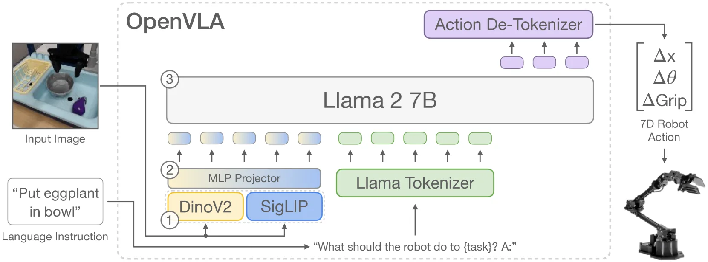

# OpenVLA:开源视觉-语言-动作模型

> **arXiv**: [2406.09246](https://arxiv.org/abs/2406.09246) (v1)
> **机构**: Stanford / UC Berkeley / Google DeepMind / Toyota Research Institute / MIT 等
> **时间**: 2024.06(CoRL 2024)
> **路线**: 离散动作 token(自回归)—— 在视觉-语言模型(VLM)主干上把机器人动作量化为 token 顺序生成

[← 返回主报告](../index.md)

---

## TL;DR

OpenVLA 是一个 **7B 参数的开源 VLA 模型**,把一张图像观测 + 一句语言指令直接映射为 7 维机器人控制动作。它以 **Llama 2 7B** 为语言主干,前接一个 **DINOv2 + SigLIP 双流融合视觉编码器**,在 Open X-Embodiment(OXE)的 **97 万条(970k)真实机器人演示**上训练。其核心定位是**做闭源 RT-2-X 的开源对标**:在 29 个任务、多种机器人本体上,OpenVLA 用 **1/7 的参数量(7B vs 55B)以 16.5% 的绝对成功率超越 RT-2-X**。模型支持 **LoRA 微调**(仅训练约 1.4% 参数)与 **4-bit 量化部署**,显著降低了 VLA 的使用门槛。动作以**离散 token** 表示——7 个动作维度被各自量化后,作为 7 个 token 由 LLM 顺序自回归生成。

> ⚠️ **可信度提示**:文中主要机器人评测为**作者自评**(BridgeData V2 WidowX + Google robot),论文已通过 CoRL 2024 评审,但这些真机数字并非独立第三方复现。后续社区在 SimplerEnv 等仿真基准上的复现显示其在部分设定(尤其 Bridge/WidowX)上表现不佳(见第 5 节)。

---

## 1. 要解决的问题

视觉-语言-动作模型(VLA)把预训练的视觉-语言模型迁移到机器人控制,展现出强泛化与语义理解能力。但在 OpenVLA 之前,这条路线存在两个现实障碍:

1. **闭源、不可复现**。当时最强的通用 VLA——Google 的 **RT-2 / RT-2-X**——是闭源的:既不公开模型权重,也不公开训练与推理代码,研究者无法在其基础上做改进或迁移,生态被锁死。
2. **缺少高效适配与部署的范式**。VLA 动辄数十亿到数百亿参数(RT-2-X 达 55B),如何在消费级硬件上**微调到新机器人/新任务**、如何**低成本推理部署**,缺乏成熟、开放的做法。

OpenVLA 的目标就是给出一个**完全开源**(模型 + 训练代码 + 数据混合配方 + 微调/量化工具链)、**参数更小却性能更强**的通用 VLA,并把高效微调(LoRA)与量化推理作为一等公民,让学术界和工业界都能在普通 GPU 上使用与改造 VLA。

---

## 2. 方法与架构

> **图注(译自原文 Figure 1)**:OpenVLA 模型架构。给定一张图像观测和一句语言指令,模型预测 7 维机器人控制动作。架构由三个关键组件构成:(1) **视觉编码器**——将 DINOv2 与 SigLIP 的特征拼接(concatenate);(2) **投影器(projector)**——把视觉特征映射到语言嵌入空间;(3) **LLM 主干**——一个 Llama 2 7B 参数的大语言模型。

OpenVLA 本质是「把机器人控制建模成一个视觉-语言任务」:输入一张观测图像 + 一句自然语言指令,输出一串代表机器人动作的 token。整体复用 **Prismatic-7B VLM** 作为底座(600M 视觉编码器 + 2 层 MLP 投影器 + 7B Llama 2 主干,共约 7.5B 参数),在其上以「动作即语言」的方式做端到端微调。下面分三层拆解:**(2.1) 视觉-语言主干**、**(2.2) 动作离散化与词表占用**、**(2.3) 训练目标、数据与算力**。

### 2.1 视觉-语言主干:双编码器融合 + MLP 投影 + Llama 2

OpenVLA 沿用 Prismatic VLM 的标准三段式结构(视觉编码器 → 投影器 → LLM 主干),其中视觉前端的设计是 OpenVLA 相对常见单编码器 VLM 的关键差异点:

- **双编码器特征通道拼接(channel-wise concat)**。同一张输入图像的 patch **分别**送入两个预训练编码器:**DINOv2**(自监督训练,强空间/几何结构表征)与 **SigLIP**(图文对比训练,强语义/图文对齐表征)。两路各自输出的特征向量在**通道维拼接**后,再作为图像表征往下传。原文明确指出:相比更常用的 CLIP-only 或 SigLIP-only 编码器,**加入 DINOv2 特征被证明能改善空间推理(spatial reasoning)**,而这对机器人精细控制尤其有用——这正是 OpenVLA 选择融合双流而非单流的核心动机:**SigLIP 负责「这是什么物体、指令指向谁」(语义 grounding),DINOv2 负责「物体在哪、几何关系如何」(空间定位)**,两者互补。原文的消融也佐证了这点:在 BridgeData V2 上,Prismatic(融合 DINOv2+SigLIP)主干比仅做强语义 grounding 的 LLaVA 主干再提升约 10% 绝对成功率,作者将增益归因于融合骨干带来的更强空间推理能力。
- **投影器(Projector)**:一个 **2 层 MLP**,把拼接后的视觉特征投影到 Llama 2 的词嵌入空间,从而让图像特征转化为一组 **「视觉 prompt 前缀 token」**,与文本 token 拼成同一条序列。
- **LLM 主干(Llama 2 7B)**:接收「视觉前缀 token + 语言指令 token」序列,自回归地逐 token 输出动作 token。
- **一个被验证为关键的训练细节**:与多数 VLM「冻结视觉编码器效果更好」的经验相反,OpenVLA 发现**在 VLA 训练中微调(而非冻结)视觉编码器对性能至关重要**,作者推测互联网预训练的视觉骨干未必包含足够细粒度的空间细节来支撑精确控制,需要在机器人数据上进一步适配。此外输入分辨率取 **224×224**(实验发现 384×384 无性能增益却使训练慢 3 倍)。

### 2.2 动作离散化与词表占用技巧

OpenVLA 承自 RT-2 的「动作即语言」范式:把连续动作量化成 token,交给 LLM 当作普通文本顺序生成。但在量化方案上对 RT-2 做了改进:

- **每维 256 个 bin,按分位数(quantile)分箱**。7 维动作(末端执行器 Δ位置 3 + Δ姿态 3 + 夹爪 1)中,每一维**独立**离散化为 256 个 bin,各占一个 token,因此「预测一个动作」= LLM 顺序生成 **7 个动作 token**,再反量化为连续控制量。
- **用 1st–99th 分位数而非 min-max 均匀分箱**。RT-2 用动作的最小/最大值确定分箱区间;OpenVLA 改用训练数据中每维动作的 **第 1 与第 99 分位数**作为区间端点再均匀切分。⚠️ 关键收益:这样能**忽略离群动作**——若用 min-max,个别极端动作会把分箱区间剧烈拉宽,导致绝大多数正常动作被挤进很少的几个 bin、有效分辨率(granularity)被严重压缩;分位数分箱则保住了有效动作范围内的精度。
- **覆盖最少使用的 256 个 token**。Llama tokenizer 仅为微调阶段新引入的 token 预留了 **100 个 "special tokens"**,不足以容纳 256 个动作 token。OpenVLA 沿用 RT-2 的做法,直接**覆盖(overwrite)Llama 词表中最少使用的 256 个 token**(即词表末尾的最后 256 个 token),把它们重新指派为动作 bin token。

### 2.3 训练目标、数据混合与算力

- **训练目标:next-token 交叉熵,仅对动作 token 计算 loss**。动作被处理成 token 序列后,OpenVLA 以标准的下一 token 预测目标训练,但**只在预测出的动作 token 上评估交叉熵损失**(对视觉/指令前缀 token 不计 loss)。
- **数据:OXE 上的 97 万条(970k)真机演示**。以 Open X-Embodiment(撰文时含 70+ 数据集、200 万+ 轨迹)为基础做数据治理,目标是 (1) 跨数据集统一输入/输出空间、(2) 在本体/任务/场景上取得均衡混合。具体策略:**只保留含至少一个第三人称相机、且为单臂末端执行器控制的操作数据集**;混合配比**直接沿用 Octo 的数据混合权重**——按多样性启发式地对**多样性低的数据集降权或剔除、对任务与场景更丰富的数据集升权**。作者还试探性地以 **10% 的保守权重**引入了新加入 OXE 的 **DROID** 数据集,但发现其动作 token 准确率训练全程都偏低(暗示需要更大权重或更大模型才能拟合其多样性),为不拖累最终模型,**在训练的最后 1/3 阶段把 DROID 从混合中移除**。
- **训练规模(原文 §3.5,可核实)**:最终模型在 **64 块 A100 GPU 上训练 14 天**,合计约 **21,500 A100·小时**,**batch size 2048**;固定学习率 **2e-5**(与 Prismatic VLM 预训练同值,且未用 warmup)。与 LLM/VLM 通常只过 1–2 个 epoch 不同,VLA 需要反复多轮迭代直到训练动作 token 准确率超过 95%——**最终训练跑了 27 个 epoch**。
- **高效微调与部署**:
  - **LoRA 微调**:在所有线性层上应用 LoRA(rank=32),**仅训练约 1.4% 的参数(约 97.6M / 7188M)**即可基本匹配全量微调——Franka-Tabletop 上 LoRA 成功率 **68.2%** vs 全量微调 **69.7%**(原文 Table 1),而全量微调需多卡 FSDP 与 160+ GB 显存,LoRA 单卡约 60 GB 即可,使新机器人/新任务适配可在单张数据中心级 GPU 上完成。
  - **量化推理**:bfloat16 加载下推理需 **~15–16.8 GB 显存**,在 RTX 4090 上约 **6 Hz**;进一步用 **4-bit(int4)量化**可把显存降到 **7.0 GB(降低一半以上)**,且 Bridge 成功率 **71.9%** 与 bfloat16 的 **71.3%** 基本持平(原文 Table 2),int4 在 Ada Lovelace 架构 GPU(RTX 4090、H100)上吞吐反而更高(减少显存搬运抵消了量化开销;int8 则因量化算子开销在多数 GPU 上反而更慢)。
  - ⚠️ **推理瓶颈**:由于是**自回归逐 token 解码**,一次动作要顺序生成 7 个 token,加上 7B 主干,实时控制频率受限(裸跑约 6 Hz),这也是后续连续动作/并行解码改造(OpenVLA-OFT、π0 等)的主要切入点。
  > 注:原文 §5.3/§5.4 的 LoRA 与量化实验使用的是一个**略小的变体**——以 Octo 同款的较小 OXE 混合预训练、且视觉前端**只用 SigLIP**(而非融合 DINO+SigLIP);作者指出该简化架构在微调与开箱即用任务上仍有强性能。上述 LoRA/量化数字即来自该变体,与主模型架构略有差异,引用时留意。

---

## 3. 关键设计与创新点

1. **完全开源的强基线**:权重、训练代码、数据混合、微调与量化工具链全部开放,是第一个可复现、可二次开发的高性能通用 VLA,极大推动了后续研究(OpenVLA 几乎成为 VLA 领域的事实标准 baseline)。
2. **融合视觉编码器(DINOv2 + SigLIP)**:用语义流 + 几何流互补,相比单一 CLIP/SigLIP 编码器,在需要空间精度的操作任务上更稳。
3. **参数效率**:7B 参数即超越 55B 的 RT-2-X,证明「更好的数据多样性 + 更合适的模型组件」比单纯堆参数更划算(**7× fewer parameters**)。
4. **LoRA 高效微调**:在新机器人/新任务上,LoRA 仅训练约 **1.4% 的参数**即可逼近全量微调效果,使 VLA 适配可在单张消费级/数据中心 GPU 上完成。
5. **量化推理部署**:**4-bit 量化**在保持性能基本不变的前提下,把显存占用降低一半以上,让 7B VLA 能在更小的 GPU 上跑起来。

---

## 4. 实验与关键结果

### 4.0 结果速览表

> 下列表把全文散落的定量结果归并到一起,**每行标注口径与来源**。⚠️ = 作者/厂商自评或未经独立第三方复现;社区复现行单独标注。原文表号引自 OpenVLA(arXiv:2406.09246)。

**表 1 · 核心对比与高效化(原论文自评数,⚠️)**

| 设定 | 指标 | OpenVLA | 对照 | 口径 / 来源 |
|---|---|---|---|---|
| vs RT-2-X 真机泛化 | 绝对成功率增益 | **+16.5%**(7B) | RT-2-X 55B(基准) | 29 任务 / 多本体,参数量 1/7;作者自评真机 ⚠️(原文摘要 / Table) |
| LoRA vs 全量微调 | Franka-Tabletop 成功率 | 68.2%(LoRA) | 69.7%(全量) | 仅训 ≈1.4% 参数(≈97.6M/7188M,rank=32);原文 Table 1 ⚠️(SigLIP-only 小变体) |
| 4-bit vs bf16 推理 | Bridge 成功率 | 71.9%(int4) | 71.3%(bf16) | 性能基本持平;原文 Table 2 ⚠️(SigLIP-only 小变体) |
| 4-bit vs bf16 推理 | 显存占用 | 7.0 GB(int4) | 15–16.8 GB(bf16) | 显存降一半以上;裸跑 ≈6 Hz @ RTX 4090(原文 §5.4 / Fig 5) |

**表 2 · 社区在 SimplerEnv 仿真上的复现(非原论文数,可信参照)**

| 套件 | 协议 | OpenVLA | 同表对照 | 来源 |
|---|---|---|---|---|
| Google Robot / Fractal | Visual Matching | **34.3%** | Octo-Base 11.0 / RT-1-X 42.4 / RT-2-X 46.3 | benchmarks.md §1.4(MemoryVLA / VOTE / 2409.15250 评测) |
| WidowX / Bridge | Visual Matching | **1.0–4.2%**(近乎归零) | Octo-Base 17.5 / SpatialVLA 42.7 | benchmarks.md §1.4 |
| Google Robot | Variant Aggregation 均值(0–1) | **0.530** | RT-1 0.897 / RT-1-X 0.490 / Octo-Base 0.006 | benchmarks.md §1.4 |

**表 3 · LIBERO 终身学习(社区横评口径,⚠️ 多为自评)**

| 模型 | 平均 | Spatial | Object | Goal | Long-10 | Long-90 | 口径 / 来源 |
|---|---|---|---|---|---|---|---|
| **OpenVLA** | **75.9** | 84.7 | 88.4 | 79.2 | 53.7 | 73.5 | 5 套件均值;4 套件口径 = 76.5;benchmarks.md §2.3 |
| Octo | ~75.1 | 78.9 | 85.7 | 84.6 | 51.1 | – | 对照,同源 |
| π0-FAST | 85.0 | 96.4 | 96.8 | 88.6 | 60.2 | 83.1 | ⚠️ 额外本体感知 + 腕部相机,非同条件 |
| OpenVLA-OFT | 95.3–97.1 | — | — | — | — | — | 发表时 SOTA,见 [[openvla-oft]] |

> 读表须知:① SimplerEnv 的 Google Robot 与 WidowX/Bridge 是**两套独立机器人**,分数不可混算成"SimplerEnv 总分";② LIBERO 平均有 4 套件 / 5 套件两种口径,故 OpenVLA 出现 75.9 与 76.5 两个数;③ 表 1 的 LoRA / 量化数来自一个**仅用 SigLIP、Octo 同款较小 OXE 混合**的简化变体,与融合 DINOv2+SigLIP 的主模型架构略有差异(原文 §5.3/§5.4)。

下面是对各组结果的要点解读:

**(1) 与 RT-2-X 的正面对比(作者自评,真机)**
在 29 个任务、跨多个机器人本体上,OpenVLA(7B)以 **16.5% 的绝对成功率**超越闭源 **RT-2-X(55B)**,而参数量仅为其 **1/7**。这是论文最核心的卖点数字。

**(2) 参数高效微调**
LoRA 微调取得最佳的「性能/算力」折中:**仅训练约 1.4% 的模型参数**即可匹配全量微调的性能(原文 Table 1)。

**(3) 量化推理**
**4-bit 量化**的成功率与 bfloat16 推理基本持平,GPU 显存占用降低一半以上(原文 Table 2);在 RTX 4090 / H100(Ada Lovelace)等 GPU 上吞吐较高(Figure 5)。

**(4) 新机器人适配**
在 7 个 Franka Emika Panda 任务(每任务 10–150 条演示)上,OpenVLA 经微调后可与从零训练的 Diffusion Policy、以及微调后的 Octo 等竞争,显示其作为**可迁移底座**的数据高效性。

**(5) 社区在 SimplerEnv 仿真基准上的复现(可信参照,非原论文数字)**
社区后续在 SimplerEnv 上的复现普遍显示 OpenVLA 在不同设定下分化明显:
- **Google Robot(Visual Matching 设定)**:整体成功率约 **34.3%**,处于可用但不算领先的水平;
- **Bridge / WidowX 设定**:成功率**接近归零**,表现很差。
这与论文自评的真机结论存在张力,提示其泛化对**评测分布**高度敏感(详见第 5 节)。

---

## 5. 局限与争议

1. **WidowX / Bridge 上表现差**:这是 OpenVLA 最被诟病的点。尽管论文在 BridgeData V2 WidowX 真机上给出正面结果,但社区在 SimplerEnv Bridge/WidowX 设定下的复现成功率几近为零,说明其在该本体/分布上的鲁棒性远不如自评数字给人的印象。
2. **自回归 + 离散 token,不支持动作分块(action chunking)**:OpenVLA 每步只预测**单个**相对动作、且无观测历史,一次解码要顺序生成 7 个 token。缺乏动作分块/高频连续控制,使其在需要精细、高频、连续轨迹的**灵巧操作**任务上吃亏(这正是后续 OpenVLA-OFT、π0 等改进的切入点)。
3. **推理慢**:自回归逐 token 解码,加上 7B 主干,实时控制频率受限;虽有量化加速,但相较并行输出动作块的连续路线仍偏慢。
4. **评测独立性**:核心真机对比为**作者自评**。论文通过了 CoRL 2024 评审,但 RT-2-X 闭源使得「同条件公平对比」难以独立核验;不同评测协议下结论可能反转(见第 4(5) 节)。

---

## 6. 在 VLA 谱系中的位置

- **上承 RT-2 / RT-2-X([[rt2]])**:OpenVLA 直接继承 RT-2 的「**把动作离散成 token、用 VLM 自回归生成**」范式,并将其**开源化、小型化、工程化**(LoRA + 量化)。可以理解为「开源版、更高效的 RT-2-X」。
- **作为事实标准 baseline**:开源后迅速成为 VLA 研究的公共底座,大量后续工作以它为对比和改造对象。
- **下启连续动作路线([[openvla-oft]])**:针对其自回归慢、不支持动作分块、灵巧任务弱的缺陷,**OpenVLA-OFT** 把它改造为**并行解码 + 连续动作(L1/扩散头)+ 动作分块**,大幅提升速度与精度,代表了离散→连续的演进。
- **与扩散/流匹配路线([[pi0]])并列对照**:π0 等采用流匹配生成连续动作块,与 OpenVLA 的离散自回归形成两条主要技术路线的对比。

一句话:**OpenVLA 是离散 token 自回归 VLA 路线的开源集大成者与社区起点,既验证了该范式的可行与高效,也暴露了其在连续灵巧控制上的天花板,从而催生了后续的连续动作改造。**

---

## 来源

- 论文:OpenVLA: An Open-Source Vision-Language-Action Model. arXiv:2406.09246 (CoRL 2024). <https://arxiv.org/abs/2406.09246>
- HTML 全文(图 1 架构图来源):<https://arxiv.org/html/2406.09246v1>
- 架构图:本仓库 `images/openvla_arch.webp`(原文 Figure 1,源文件 `x1.png`)
- 项目主页 / 代码:<https://openvla.github.io> · <https://github.com/openvla/openvla>

> 说明:第 4(5) 节中 SimplerEnv(Google Robot ~34.3% / Bridge 近乎归零)为**社区复现**的常见参照数字,非原论文自评结果,用以与作者真机数字形成对照,引用时请以具体复现来源为准。
