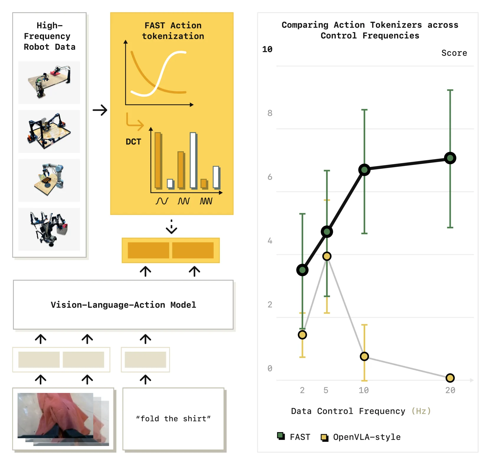
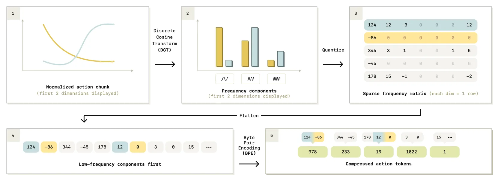

# FAST / π0-FAST：面向 VLA 的高效动作分词

> **FAST: Efficient Action Tokenization for Vision-Language-Action Models**
> Physical Intelligence, 2025.01 · arXiv: [2501.09747](https://arxiv.org/abs/2501.09747)
> 路线：离散动作 token 的高效化（频域压缩分词）

> [← 返回主报告](../index.md)

---

## TL;DR

- **FAST = Frequency-space Action Sequence Tokenization**：一种基于**离散余弦变换（DCT）**的机器人动作分词方法。它先把一段（chunk）连续动作变换到频域，量化后再用 **BPE（字节对编码）** 压缩成紧凑的离散 token 序列。
- **要解决的核心痛点**：以 RT-2 / OpenVLA 为代表的「朴素分词」（naïve tokenization，即对每个动作维度按时间步独立分箱 binning）在**高频、灵巧**任务上彻底失效——token 序列冗长、相邻时间步差异极小，自回归模型「学不动」。
- **关键结论**：FAST 让**自回归离散 token 路线的 VLA 也能做高频灵巧控制**，并显著加快训练收敛。基于它训练的 **π0-FAST** 是把 π0 的流匹配（flow matching）动作头替换为自回归离散 token 预测的版本，性能可比肩扩散版 π0，而**训练快约 5×**（论文 Figure 2 标注）。
- 作者还发布 **FAST+**——一个在 **100 万条真实机器人轨迹**上训练的「通用」动作分词器，可作为黑盒直接套用到多种机器人数据。

> ⚠️ 区分提示：这里用 DCT 做频域压缩分词的是 **FAST（2025）本身**，**不是 RT-2**。RT-2 用的是简单的逐维度 256-bin 分箱，正是 FAST 要替代的「朴素分词」。

---

## 1. 问题：朴素分箱在高频动作上为什么失效

自回归 VLA（RT-2、RT-2-X、OpenVLA 等）把连续动作离散化为 token，再用语言模型式的「下一 token 预测」来生成动作。它们普遍采用**朴素分词**：对动作向量的**每一维**、**每个时间步**独立做分箱（如 256 个 bin），得到一串离散 token。

这套方案在**低频**数据（如 BridgeV2、RT-1）上尚可，但在**高频 / 灵巧**任务上崩溃，原因是：

- **相邻时间步高度相关、变化极小**：采样频率越高，单个时间步内动作的变化量越小。朴素分箱后，大量相邻 token 几乎相同，序列里充满冗余。论文指出，这会让「每个时间步的有效变化量按比例减小」，从而**严重拖慢训练收敛**，使模型难以拟合复杂高频数据集（原文：*"greatly slows down the rate of convergence during training"*）。
- **token 序列过长**：高频 chunk 展开成逐维逐步的 token 后非常长，自回归预测既慢又难学。
- **经验证据**：论文提到 OpenVLA 在低频 BridgeV2 / RT-1 上工作良好，却难以拟合更高频的数据；在本文最高频的两个任务——**Table Bussing（20Hz）**与 **T-Shirt Folding（50Hz）**上，用朴素分词训练的策略**完全无法推进任务**。

作者由此提出「**从第一性原理**」的洞见：机器人动作信号在送入训练前**应当先被压缩**，以去除时间维度上的冗余。

---

## 2. 方法与架构

*图注（对应论文 Figure 2）：左侧——FAST 分词使得可以用「简单的下一 token 预测」训练自回归 Transformer 来做灵巧机器人控制；右侧——相比朴素分词（如 OpenVLA 所用的分箱方案），FAST 把同一段动作压成**短得多**的 token 序列，且随采样频率升高优势愈发明显。*

FAST 的全部方法可拆成三层：**2.1** 先讲清「为什么朴素逐步逐维分箱在高频数据上会塌掉」（动机与第一性原理诊断）；**2.2** 给出 FAST 的核心——基于 DCT 的时序压缩分词流水线（四步：归一化+DCT → 量化 → 展平+BPE → 自回归预测，及其可逆解码）；**2.3** 介绍由此衍生的 **FAST+ 通用分词器** 与 **π0-FAST** 这一自回归 VLA 实例，并把它放回与 π0（流匹配）的同门对照中。

### 2.1 为什么「朴素分箱」在高频灵巧动作上失效

自回归 VLA（RT-2、RT-2-X、OpenVLA 等）的标准做法是**朴素分词（naïve tokenization）**：对一个动作块（action chunk，形状 = 时间步 H × 动作维 D）里**每一个时间步、每一维**单独离散化为 256 个 bin 之一，再把所有时间步、所有维度首尾拼接成 token 序列
`T(a₁:H) = [T₁,₁, …, T₁,D, …, T_H,₁, …, T_H,D]`。

这套方案在低频数据上尚可，但在高频/灵巧数据上几乎学不动，根因是**相邻时间步高度相关**：

- **信息密度极低、自回归陷入平凡解**：采样频率越高，单步内动作变化量越小，相邻时间步的动作几乎相同 → 量化后相邻 token 大量重复。论文的关键观察是，此时「下一 token 预测」目标可以被一个**近乎平凡的映射**（直接复制上一个动作 token）就拿到很低的 loss，模型因此被困在差的局部最优里（*"low token prediction loss can often be achieved with mappings as trivial as simply copying the most recent action token, leaving models in poor local optima"*）。每个 token 的**边际信息量**太小，**严重拖慢收敛**（*"greatly slows down the rate of convergence during training"*）。
- **token 序列又长又冗余**：一个高频 chunk 逐步逐维展开后**轻易就是数百个 token**，自回归预测既慢又难学。
- **合成实验佐证（Figure 3 的玩具例子）**：论文构造了一个「给定 4 个随机点、预测插值三次样条」的合成时序任务，并在**不改变底层信号、仅改变采样率**（每序列 25 → 800 步）下重复训练小型自回归 Transformer。结果是：随采样率升高，朴素分箱的预测误差**单调恶化**；而换成 DCT 压缩后的目标 token，误差在所有采样率上**始终保持很低**。
- **真实证据**：OpenVLA 在低频的 BridgeV2 / RT-1 上工作良好，却难以拟合更高频的 DROID；本文最高频的两个任务——**Table Bussing（20Hz）**与 **T-Shirt Folding（50Hz）**——用朴素分词训练的策略**完全无法推进任务**。

由此得到第一性原理洞见：**机器人动作信号应当在送入训练前先被压缩**，以去除时间维度上的冗余、提高每个 token 的信息密度。压缩的灵感来自语言模型常用的 BPE；但动作是连续信号，需要先用适合连续信号的变换——这就引出了 DCT。

### 2.2 FAST 分词流水线（DCT → 量化 → BPE → 自回归预测）

*图注（对应论文 Figure 4）：FAST 分词流水线。给定一段归一化后的动作 chunk，先用**离散余弦变换（DCT）**把信号转到频域；再**量化** DCT 系数；最后把「按维度展平」的稀疏系数序列用 **BPE** 压缩成最终的动作 token 序列。整条流水线**可逆**，解码即逆过程。*

> ⚠️ 重申：这里用 DCT 做频域压缩分词的是 **FAST（2025）本身**，**不是 RT-2**——RT-2 用的正是被 FAST 替代的逐维 256-bin 朴素分箱。

FAST 是一条**确定性、免学习**的信号处理流水线（DCT + 量化 + BPE，只有 BPE 的词表需要在数据上「训练」几分钟），不需要训练编解码网络。给定一个 **1 秒动作 chunk**（论文各数据集统一用 1 秒），编码四步如下（对应论文 Algorithm 1）：

1. **归一化（分位数归一化）**：先把每个动作维度按训练集的 **1st / 99th 分位数** 线性映射到 `[-1, 1]`。用分位数而非 min/max，是为了对大规模机器人数据中偶发的离群动作鲁棒；归一化同时让不同尺度、跨本体（cross-embodiment）的数据集更易统一分词。

2. **逐维离散余弦变换（DCT）→ 频域**：对 chunk 中**每个动作维度的时间序列单独**做 DCT，得到一个 `|A|×H`（动作维 × 时间步）的 DCT 系数矩阵 `Cⱼⁱ ← DCT(a₁:Hⁱ)`。DCT 把信号表示为不同频率余弦分量之和：**低频系数刻画整体形状，高频系数刻画尖锐跳变**。由于真实机器人轨迹通常平滑，**能量集中在少数低频系数**，大量高频系数接近 0——这正是可压缩性的来源（与 JPEG 压缩图像同理）。

3. **量化 DCT 系数（scale-and-round）**：对系数做「乘以尺度再取整」的量化 `C̄ⱼⁱ ← round(γ · Cⱼⁱ)`。尺度 **γ** 是**控制「有损度 ↔ 压缩率」权衡的唯一旋钮**：γ 越大保真越高、token 越多。量化后**系数矩阵通常高度稀疏**，绝大多数项为 0，每个动作维只剩少数显著系数。单数据集实验中统一用 **γ = 10**。

4. **展平 + BPE 压缩**：要把稀疏矩阵变成紧凑 token，需先**展平**再用 **BPE（字节对编码）** 无损压缩。
   - **展平顺序很关键**：论文比较了「列优先」（先拼所有维度的**最低频**分量，再拼次低频……）与「行优先」（先拼某一维的**全部频率**分量，再换下一维）。FAST 选 **列优先**——因为让自回归模型**先预测刻画整体形状的低频分量**，再逐步细化高频，能带来**更稳定的策略 rollout**。
   - **BPE 的作用**：把展平后的整数序列里**大量重复的 0**「挤掉」，并把跨维度高频共现的系数组合**合并成单 token**，进一步去冗余。选 BPE 而非 Huffman / Lempel-Ziv，是因为它实现高效、且能产出**固定大小词表**，便于直接并入 VLM 已有词表。单数据集实验统一用 **BPE 词表 1024**。

**接入 VLA、自回归预测**：最终得到的紧凑动作 token 加入 VLM 词表，模型用标准「下一 token 预测」自回归生成。**解码是完全可逆的逆过程**：BPE 解码 → 反量化（除以 γ）→ 逆 DCT → 还原成连续动作 chunk，因而解码很快。

**关键直觉**：DCT 把时序上的强相关性「搬运」并集中到少数低频系数上，从而**大幅缩短 token 序列、提高每 token 的信息密度**，使「下一 token 预测」重新变成一个信息丰富、非平凡的学习目标——这正是让自回归 VLA 也能学高频灵巧动作的根本原因。

**几个可核到的量化结论**：
- 流水线**只有两个超参**（量化尺度 γ、BPE 词表大小），且论文称二者都**不敏感**，所有单数据集实验沿用同一组（γ=10、vocab=1024）——与需要逐数据集精调的 VQ/FSQ 学习式分词器形成对比。
- FAST 在各数据集上**稳定地产出每臂约 30 个 token / chunk**（双臂约 60 个，对应论文 Table I），且**几乎与采样频率无关**——说明它逼近的是底层动作信号的真实复杂度，而非被频率「灌水」。高频任务（如 T 恤折叠）上相对朴素分词的压缩收益尤为显著。
- **BPE 消融**：去掉 BPE 后策略性能下降（但仍优于朴素分词）——DCT 已把信息集中到少数 token，但缺了 BPE 就留下大量重复 0-token，既稀释学习信号又因需自回归预测上百个 token 而拖慢推理。
- **与 VQ/FSQ 对照（Figure 12）**：把 FSQ 这类**学习式**量化压缩当作 FAST 的消融基线，FAST 在**高保真精细控制**端 scaling 明显更好，且更简单、无需训练额外网络；仅在低保真/高压缩区间略逊（详见第 5 节局限）。
- **骨干无关性**：把 FAST+ 套到 **OpenVLA**（需改造其代码以接收多图输入、预测 1 秒 chunk）训练高频 T 恤折叠任务，性能显著提升——说明 FAST 不依赖特定骨干，可即插到任意预训练自回归 Transformer。

### 2.3 FAST+ 通用分词器与 π0-FAST

**FAST+ —— 开箱即用的通用动作分词器**：FAST 里唯一需要「学习」的成分是 BPE 词表，逐数据集重训虽快（几分钟）但仍有摩擦。为此论文在一个**约 100 万条 1 秒真实机器人动作 chunk** 的大规模跨本体数据集上训练出 **FAST+**——覆盖单臂、双臂、移动操作机器人，关节空间与末端执行器控制，多种控制频率。训练好后它可作为**黑盒**直接套到任意机器人的 1 秒动作序列上：在多个**训练时完全未见**的机器人数据集（不同形态/动作空间/频率）上，FAST+ 相对朴素分词**普遍把 token 数压缩约 2×**，部分数据集更高（Figure 8），且与逐数据集专门调过的分词器**性能相当**（Figure 6）。使用时建议遵循同一规范：分位数归一化到 `[-1,1]`、每次分词 1 秒 chunk。

**π0-FAST —— 把 π0 改成自回归离散路线**：π0-FAST = 在 **同一套 π0 视觉-语言骨干** 上，把 π0 的**流匹配（flow matching）动作头**替换为**基于 FAST 的自回归离散 token 预测**。两者构成同门的「**连续 vs 离散**」对照实验：

- 它是论文实现的「**第一个**能在大规模 **DROID** 上高效训练、且可 **zero-shot 凭自然语言提示**在未见环境中评测的语言条件通用操作策略」。
- 在灵巧、长程操作任务上可**媲美最强扩散 VLA（扩散版 π0）**，同时**训练快约 5×**（Figure 2 顶部标注 *"training 5x faster"*）。
- 代价主要在**推理**：流匹配 π0 在 NVIDIA 4090 上约 **100ms / chunk**（10 步去噪 + 300M「动作专家」），而 π0-FAST 约 **750ms / chunk**——它需自回归解码 **30–60 个动作 token**，且要跑**完整 2B 参数语言骨干**。论文指出可借助 LLM 社区成熟的加速手段（推测解码、量化、定制 kernel 等）改善，留作未来工作。

---

## 3. 关键设计与创新点

- **「先压缩、再分词」的范式转变**：把问题从「如何离散化单个动作值」重构为「如何压缩一段动作时间序列」，直击高频冗余这一根因。
- **DCT 频域压缩**：利用真实机器人轨迹在频域能量集中的特性，用极少系数表达一段动作，天然适配灵巧/高频场景。
- **BPE 二次压缩**：在量化系数之上再叠加 BPE，把常见动作模式合并为单 token，进一步缩短序列、提升自回归学习效率。
- **单一超参控制权衡**：rounding scale 一个旋钮即可在「重建保真度 ↔ token 数量」间扫描。论文 Figure 12 显示 FAST 在很宽的尺度范围内都表现稳健；相比 VQ/FSQ 等基于学习的分词器，FAST 在**低保真**时略逊，但在**高保真**端**scaling 明显更好**——这正是精细控制最需要的区间。
- **FAST+ 通用分词器**：在 **1M 真实轨迹**上训练，作为黑盒可直接套到多种机器人/数据，无需逐数据集重训分词器。
- **免学习、即插即用**：FAST 本身是确定性的信号处理流水线（DCT+量化+BPE），不需要训练编解码网络，部署简单。

---

## 4. 实验与关键结果（谨慎陈述，仅列已核到的）

### 4.0 速览表

**表 A — LIBERO 成功率（%）** ⚠️ π0-FAST 一行**非严格同条件**：额外使用本体感知（proprioception）+ 腕部相机输入，与仅用单一外部相机的基线不可公平横比。口径：LIBERO 4 套件均值（Spatial/Object/Goal/Long-10），明细见表。

| 模型 | 设定/口径 | 平均 | 明细（Spatial / Object / Goal / Long-10 / Long-90） | 来源 / 标注 |
|---|---|---|---|---|
| π0-FAST | LIBERO 均值；**额外本体感知 + 腕部相机** | **85.0** | 96.4 / 96.8 / 88.6 / 60.2 / 83.1 | benchmarks.md（厂商口径）⚠️ 非严格同条件 |
| OpenVLA | LIBERO 均值（4 套件口径 76.5） | 75.9 | 84.7 / 88.4 / 79.2 / 53.7 / 73.5 | benchmarks.md 对照 ⚠️ |
| Octo | LIBERO 均值 | ~75.1 | 78.9 / 85.7 / 84.6 / 51.1 / – | benchmarks.md 对照 ⚠️ |

> ⚠️ 口径提醒：LIBERO 平均有 **4 套件 vs 5 套件**两种取法（故 OpenVLA 出现 75.9 / 76.5）；且 π0-FAST 的 85.0 用了额外输入，跨论文横比须特别标注。此 85.0 与明细未在本文 v1 HTML 正文逐一核验，以原文/后续版本为准。

**表 B — π0-FAST 关键定量（训练/推理/分词）**

| 指标 | 设定/口径 | 数值 | 来源 / 标注 |
|---|---|---|---|
| 训练收敛加速 | π0-FAST vs 扩散版 π0，同骨干 | **约 5×**（"training 5× faster"） | 本文 prose（论文 Figure 2 标注）⚠️ 作者自评 |
| 长程/灵巧任务性能 | vs 最强扩散 VLA（扩散版 π0） | **可媲美**（无统一数值表） | 本文 prose（Figure 6）⚠️ 作者自评 |
| 推理延迟（扩散版 π0） | NVIDIA 4090，10 步去噪 + 300M 动作专家 | **约 100ms / chunk** | 本文 prose ⚠️ 作者自评 |
| 推理延迟（π0-FAST） | NVIDIA 4090，自回归解码 30–60 token + 2B 骨干 | **约 750ms / chunk** | 本文 prose ⚠️ 作者自评 |
| token 数 / chunk | 1 秒 chunk，单臂 | **约 30**（双臂约 60） | 本文 prose（论文 Table I）⚠️ |
| 通用分词压缩率 | FAST+ 于训练时未见数据集 vs 朴素分词 | **约 2×**（部分更高） | 本文 prose（Figure 8）⚠️ |
| 量化尺度 γ / BPE 词表 | 单数据集统一配置 | γ=10 / vocab=1024 | 本文 prose（Algorithm 1） |
| FAST 分词 vs 朴素/连续在**收敛速率**的逐点数值 | — | **待核** | 已核语料标为缺口（主报告 §gap） |
| π0-FAST 自回归**推理频率（Hz）**精确值 | — | **待核** | 已核语料标为缺口 |
| π0-FAST 在 **CALVIN** avg-len | ABC→D / ABCD→D | **待核（官方无；第三方亦未见）** | benchmarks.md §3.5（PI 两篇论文均未评 CALVIN） |
| π0-FAST 在 **SimplerEnv** 成功率 | Google Robot / WidowX | **待核（本文未列）** | 本文/已核语料均无 π0-FAST 单列值 |

> 说明：表 B 的 5×、~100/750ms、token 数等均为**论文作者自评**，未经独立第三方复现，故标 ⚠️；本解读未逐一核验，以原文为准。「待核」格为已核语料中明确标注的缺口，不编造。

---

基于 arXiv v1 HTML 核到的结论：

- **训练效率**：π0-FAST 在灵巧、长程操作任务上可媲美最强扩散 VLA（扩散版 π0），同时**训练快约 5×**（Figure 2 顶部标注 *"training 5x faster"*）。
- **token 压缩**：论文 Table I 报告，相同 1 秒 chunk 下，FAST 所需 token 数远少于朴素分词，**高频任务（如 T 恤折叠）上压缩收益尤为显著**。
- **高频任务可用性**：在 Table Bussing（20Hz）、T-Shirt Folding（50Hz）上，朴素分词**无法推进任务**，而 FAST 策略能完成（Figure 6 对比不同分词方案的策略性能）。
- **首次驯服 DROID**：FAST **首次**实现了在 DROID 大规模多机器人数据集上的高效 VLA 训练；该策略可 zero-shot 跨环境泛化（Figure 7）。
- **通用分词压缩率**：FAST+ 在多个**训练时未见**的机器人数据集上，压缩率优于朴素分词（Figure 8）。

**关于 LIBERO 上的成绩（需谨慎引用）**：本调研引用到 π0-FAST 在 LIBERO 上**平均约 85.0%** 的说法。⚠️ 该评测**额外使用了本体感知（proprioception）+ 腕部相机输入**，与部分基线**并非严格同条件**，跨论文横向对比时需特别标注。此数字未在本文 v1 HTML 正文中逐一核验，**以原文 / 后续版本为准**。

> 诚实声明：FAST 论文报告的「训练收敛加速倍数」我们核到了 Figure 2 的 **5×** 标注；至于**推理频率、精确成功率表**等更细数字，**本解读未逐一核验，具体以原文为准**。

---

## 5. 局限与争议

- **不是全程最优**：在**低保真 / 高压缩**区间，FAST 的压缩效率不如 VQ/FSQ 等基于学习的分词器（Figure 12）；其优势主要在**高保真精细控制**端。
- **自回归推理成本**：离散自回归逐 token 生成，单步推理通常慢于扩散/流匹配的并行去噪；实际部署需配合动作分块与缓存等工程手段（具体频率数字以原文为准）。
- **DCT 的先验假设**：频域压缩依赖「轨迹平滑、能量集中于低频」的假设；对极不平滑或含强高频结构的动作，压缩收益可能下降。
- **LIBERO 对比口径**：如上，π0-FAST 的 LIBERO 成绩用了额外输入，横向比较存在口径差异。

---

## 6. 在 VLA 谱系中的位置

FAST 可以理解为**离散 token 路线对扩散/流匹配路线的一次「反击」**：

- **对照同门的 π0（流匹配）**：[[pi0]] 用流匹配动作头做连续动作生成；π0-FAST 在**同一骨干**上改用 FAST 离散自回归，证明「离散 token + 自回归」在灵巧高频任务上同样能打，且**训练更快**。两者构成同门的「连续 vs 离散」对照实验。
- **对照 RT-2（朴素分箱）**：[[rt2]] 等早期自回归 VLA 用逐维 256-bin 朴素分词，正是 FAST 诊断并修复的失效来源。FAST 把离散路线从「只能做低频」推进到「也能做高频灵巧」。
- **被 π0.5 复用**：[[pi05]] 把 FAST 用作**高层子任务 / 离散表示的分词器**（高层语义动作的离散化），显示 FAST 已成为该研究线的基础组件之一。
- **更广的意义**：FAST+ 作为通用动作分词器，为「用一套现成 tokenizer 跨数据集训练自回归 VLA」提供了实用基座，降低了离散路线的工程门槛。

相关占位：[[pi0]] · [[pi05]] · [[rt2]]

---

## 来源

- 论文 HTML：<https://arxiv.org/html/2501.09747v1>（Figure 2 / Figure 4 / Figure 6 / Figure 12 及正文）
- 摘要页：<https://arxiv.org/abs/2501.09747>
- 图片（本地）：`images/pi0-fast_arch.webp`（论文 Figure 2 概览）、`images/pi0-fast_method.webp`（论文 Figure 4 分词流水线）

> 本解读基于 arXiv v1 全文 HTML 核对撰写；标注「以原文为准」处为本调研未逐一独立核验的细节数字。
