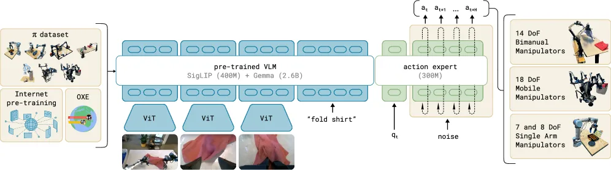

# π0(pi-zero):基于流匹配的视觉-语言-动作流模型

> **π0: A Vision-Language-Action Flow Model for General Robot Control**
> Physical Intelligence,2024.10 · arXiv:[2410.24164](https://arxiv.org/abs/2410.24164)
> 路线:连续动作 · 流匹配(flow matching)· 动作分块(action chunking)· 高频灵巧控制

[← 返回主报告](../index.md)

---

## TL;DR

π0 在预训练视觉-语言模型 **PaliGemma**(SigLIP 400M 视觉编码器 + Gemma 2.6B 语言模型)之上,外挂一个独立的 **~300M 参数"动作专家"(action expert)**,通过**流匹配(flow matching,扩散的一种连续变体)**直接生成**连续动作**,而非像 RT-2 / OpenVLA 那样把动作离散化成类文本 token 再自回归解码。模型一次性输出 **50 步的动作块(action chunk)**,推理时只需约 **10 步去噪积分**,可支撑高达 **50 Hz** 的高频灵巧操作(典型展示任务:叠衣服 laundry folding)。π0 继承 VLM 从互联网大规模预训练得到的语义知识,在作者自报的评测中超越 OpenVLA(7B)与 Octo(93M);论文明确指出自回归离散化方案不支持动作分块,因而在灵巧任务上吃亏——即便缩小版 **π0-small(470M)** 也胜过这两个基线。

> ⚠️ 注意:文中性能对比为**作者自报**结果(非独立第三方复现),数据集与权重当时**未完全开源**。

---

## 1. 问题:高频灵巧控制与"离散化"的天花板

通用机器人控制需要在**开放语义理解**(听懂"把脏盘子收进桶里")与**精细灵巧执行**(50 Hz 级别的连续电机指令、可变形物体操作)之间同时达标。此前主流 VLA(RT-2、OpenVLA)沿用 RT-2 奠定的"**动作即文本 token**"范式:把每个动作维度离散化(分箱)成离散 token,再用自回归方式逐 token 解码。这条路线有两个结构性瓶颈:

1. **频率与延迟受限**:自回归逐 token 串行解码,生成一个完整动作向量需要多次前向;要输出未来若干步的**动作块**,token 序列会成倍变长,难以达到灵巧任务所需的高控制频率。
2. **精度受限**:把连续动作硬性分箱量化,会损失精细操作所需的数值分辨率;且离散表示天然不适配"一次预测一整段平滑轨迹"的**动作分块**思路。

π0 的核心主张正是论文原话所述:先前的 VLA "**用自回归离散化把动作表示成类文本 token,而我们通过流匹配微调 VLM 来产生动作**"——用连续生成模型替换离散自回归头,从而解锁高频、高精度、可分块的灵巧控制。

---

## 2. 方法与架构

*图注:π0 框架总览(对应论文 Figure 3)。左侧为预训练数据混合(自有灵巧操作数据 + 开源 OXE 数据);中间为流匹配 VLA 模型,由一个**较大的 VLM 主干**(权重由 PaliGemma 初始化,承载互联网预训练表征)和一个**较小的动作专家**(处理机器人本体状态与动作)组成;右侧表示训练好的 π0 可控制**多种本体、不同动作空间**的机器人完成多样任务。图像与语言 token 走 VLM 权重,机器人状态/带噪动作 token 走动作专家权重,两条流通过共享注意力交互。*

π0 把"用 VLM 理解世界"与"用流匹配生成连续动作"统一进**单个 Transformer**:同一条注意力序列里既有图文 token,也有机器人状态/带噪动作 token,但二者被路由到**两套不同的权重**。整体可拆成三块来理解——(2.1)双流权重的混合专家结构与块状注意力,(2.2)条件流匹配的训练目标,(2.3)动作分块与多步欧拉积分推理。

### 2.1 双流"专家"结构(VLM 主干 + 动作专家)与块状注意力

π0 实现为**一个 Transformer、两套权重**(two sets of weights / experts):每个 token 按其模态被路由到其中一套权重,两套权重**只在自注意力层里交互**(共享同一注意力,FFN/投影各自独立)。这一设计借鉴 **Transfusion**(单 Transformer、多目标)与 **MoE**:可类比成"按 token 类型路由的两专家 MoE"——第一专家服务图文输入,第二专家服务机器人本体输入/输出。

- **VLM 主干(~3B)**:由 **PaliGemma** 初始化 = SigLIP-So400m 视觉编码器 + Gemma 2B 语言模型。处理**多视角图像**(每台机器人 2~3 路 RGB)与**语言指令**,提供互联网级语义先验。其 Gemma 主干配置为 `{width=2048, depth=18, mlp_dim=16384, num_heads=18, num_kv_heads=1, head_dim=256}`,采用**多查询注意力(MQA)**。
- **动作专家(action expert,~300M)**:一组**从零初始化**的独立、较窄权重,专门处理**机器人本体状态(proprioception)$\mathbf{q}_t$** 与**带噪动作 token $\mathbf{A}_t^\tau$**。为加速"推理时反复前向"的需求,它被刻意缩窄到 `{width=1024, mlp_dim=4096}`;由于两专家仅在自注意力处交汇,`width`/`mlp_dim` 不必与主干一致。两者合计约 **3.3B 参数**。

**输入编码**:图像经视觉编码器、状态 $\mathbf{q}_t$ 经线性层,都被投影到与语言 token 同一嵌入空间(标准 late-fusion 配方);带噪动作 $\mathbf{a}_{t'}^\tau$ 则经一个**融合流时间步 $\tau$ 的 MLP** 映射进嵌入维度,形式为 $W_3\cdot\text{swish}(W_2\cdot\text{concat}(W_1\,\mathbf{a}_{t'}^\tau,\ \phi(\tau)))$,其中 $\phi(\cdot)$ 为正弦位置编码。

#### 本体状态 $\mathbf{q}_t$ 从何而来、如何被处理 {#proprioception}

$\mathbf{q}_t$ **不是模型预测出来的,而是机器人硬件直接测得的观测量**,处理链路如下:

1. **物理来源——关节编码器**:机器人每个关节电机上都装有**编码器(encoder,绝对式/增量式)**,实时输出该关节角度;夹爪有位置/开合传感器。底层控制器以高频读取这些读数,因此 $\mathbf{q}_t$ 在每个控制步**近乎零成本**就能拿到,**无需视觉、无需推断**。这与相机图像 $\mathbf{I}_t$ 形成对照:图像是**外感知(exteroception,看外部)**,$\mathbf{q}_t$ 是**本体感知(proprioception,看自己)**。
2. **具体内容**:一个由各关节角度(如单条 7-DoF 臂 = 7 维)+ 夹爪开合状态拼成的向量;视配置可含关节速度、末端执行器位姿等。π0 把 $\mathbf{q}_t$ 看作"当前机器人构型(configuration)"。
3. **归一化 + 零填充到统一维度**:不同机器人关节数不同,π0 将 $\mathbf{q}_t$(与动作 $\mathbf{a}_t$ 同样)**统一到数据集中最大机器人的维度 = 18**,低维机器人**零填充**——这是异构本体能共用一个模型的前提(详见下文 2.3 的维度直觉)。
4. **线性投影成单个 state token**:归一化后的 $\mathbf{q}_t$ 经一个**线性层**映射到嵌入维度,作为序列里**单独的一个状态 token**($[\mathbf{q}_t]$ 自成一"块",见下文块状注意力),交给动作专家权重处理。
5. **它在前向里的角色**:动作块通过注意力读取 $[\mathbf{q}_t]$,从而知道"当前手臂停在哪"。这对**相对动作空间**尤为关键——当动作是"相对当前位姿的增量(delta)"时,没有当前状态就无从算增量;即便是绝对目标,$\mathbf{q}_t$ 也帮模型对同一"图像+指令"在不同起始姿态下输出正确动作(消歧)。

> ⚠️ **是否该喂本体状态是一个真实的设计争议**:**原始 OpenVLA 故意不输入** $\mathbf{q}_t$(只用图像+语言),因为模型易对本体状态产生**捷径依赖(shortcut learning)**——学会"照上一时刻状态外推"而不真正看图,导致分布漂移、泛化变差;而 **π0 / OpenVLA-OFT 则显式加入** $\mathbf{q}_t$(OFT 专门用一个 MLP 投影本体状态),认为对精细操作的收益大于风险。OFT 如何重新引入本体状态、以及与原始 OpenVLA 的对照,见 [OpenVLA-OFT 细读 · 2.5](openvla-oft.md#_2-5-四者为何协同-输入扩展与-film)。

**块状因果注意力(blockwise causal mask,3 块)**:序列被切成三段——① $[\mathbf{I}_t^1,\dots,\mathbf{I}_t^n,\ \ell_t]$(图文)、② $[\mathbf{q}_t]$(状态)、③ $[\mathbf{a}_t^\tau,\dots,\mathbf{a}_{t+H-1}^\tau]$(带噪动作块)。**块内全双向注意力,块间只能看过去、看不到未来块**。这样设计有三重考量:① 图文块沿用 PaliGemma 预训练分布、不去看后续新模态,降低分布漂移;② 状态 $\mathbf{q}_t$ 单独成块、不参与逐步去噪迭代,其 K/V 可在采样时缓存;③ 动作块在最后,可注意到**全部**前缀(图文+状态),把语义条件吸进动作生成。于是观测 token 走 VLM 权重、动作 token 走动作专家权重,二者在 attention 里交互——既复用 VLM 语义,又给动作生成留出专门、轻量、可高频迭代的通道。

### 2.2 流匹配训练目标(连续动作生成)

π0 用**条件流匹配(conditional flow matching)**直接对条件分布 $p(\mathbf{A}_t\mid\mathbf{o}_t)$ 建模,其中观测 $\mathbf{o}_t=[\mathbf{I}_t^1,\dots,\mathbf{I}_t^n,\ \ell_t,\ \mathbf{q}_t]$,动作块 $\mathbf{A}_t=[\mathbf{a}_t,\dots,\mathbf{a}_{t+H-1}]$。流匹配是扩散的一个连续变体,关键在于学一条从噪声到数据的**概率路径 / 向量场**:

- **加噪(线性-高斯 / 最优传输路径)**:取流时间步 $\tau\in[0,1]$,采样 $\boldsymbol\epsilon\sim\mathcal N(\mathbf 0,\mathbf I)$,按**线性插值**构造带噪动作
  $$\mathbf{A}_t^\tau=\tau\,\mathbf{A}_t+(1-\tau)\,\boldsymbol\epsilon,$$
  对应条件路径 $q(\mathbf{A}_t^\tau\mid\mathbf{A}_t)=\mathcal N(\tau\mathbf{A}_t,(1-\tau)\mathbf I)$。这正是高分辨率图像/视频合成里被验证有效的 **optimal-transport(直线)路径**:$\tau=0$ 为纯噪声、$\tau=1$ 为真实动作。
- **回归目标是速度场 / 向量场**:网络输出 $\mathbf{v}_\theta(\mathbf{A}_t^\tau,\mathbf{o}_t)$ 去匹配**去噪向量场** $\mathbf{u}(\mathbf{A}_t^\tau\mid\mathbf{A}_t)=\boldsymbol\epsilon-\mathbf{A}_t$(即沿路径把噪声推向数据的瞬时速度),损失为二者的 **MSE**:$L=\mathbb E\,\lVert \mathbf{v}_\theta(\mathbf{A}_t^\tau,\mathbf{o}_t)-(\boldsymbol\epsilon-\mathbf{A}_t)\rVert^2$。动作专家内部用**全双向注意力**,使 50 个动作 token 互相可见、联合建模。
- **与标准 DDPM 的差异**:DDPM 学的是逐步去噪的**噪声预测 $\epsilon$**、依赖离散化的前向加噪/反向马尔可夫链与方差调度;流匹配则直接在**连续时间**上回归一个**确定性 ODE 的速度场**,采样即对该 ODE 做数值积分,无需随机反向步,通常用更少步数即可,且天然契合"一次输出整段平滑轨迹"。
- **偏置时间步采样**:训练时 $\tau$ 不取均匀分布,而采自**偏向低 $\tau$(高噪声)的 beta 分布** $p(\tau)=\mathrm{Beta}\!\big(\tfrac{s-\tau}{s};\,1.5,\,1\big)$,并在 $\tau>s$($s=0.999$)处截断不采样(因为只要积分步长 $\delta>1-s$ 就用不到那段,对应论文 Figure 14)。作者论证:与图像合成"给定文本预测均值图像很容易"不同,**给定机器人观测预测均值动作 $\mathbb E[\mathbf{A}_t\mid\mathbf{o}_t]$ 反而更难**(观测对动作的约束远强于文本对图像),因此应把训练算力多投到"接近纯噪声"的困难高噪声区段。

### 2.3 动作分块、维度直觉与多步欧拉积分推理

**动作分块(action chunking)**:π0 一次预测**未来 $H=50$ 步**的动作块,而非单步动作;动作专家把这 50 个动作 token **并行**送入(块内全双向注意力,无自回归)。为统一跨本体,配置向量 $\mathbf{q}_t$ 与动作 $\mathbf{a}_t$ 一律取数据集中**最大机器人的维度 = 18**(容纳两条 6-DoF 臂 + 2 个夹爪 + 移动底盘 + 升降躯干),低维机器人**零填充**、缺失相机槽位**掩码**。维度直觉:一个动作块张量形状约为 **$50\times 18$**(50 步 × 动作维),整段被联合采样,带来:① **高控制频率**——一次生成覆盖多步、摊薄推理开销,支撑最高 **50 Hz** 的灵巧控制;② **时序一致性**——整段联合生成,减少逐步预测的抖动与误差累积,利于可变形物体操作。

**推理(forward Euler 积分)**:从纯高斯噪声 $\mathbf{A}_t^0\sim\mathcal N(\mathbf 0,\mathbf I)$ 出发,沿学到的向量场把 ODE 从 $\tau=0$ 积分到 $\tau=1$,用**前向欧拉**更新 $\mathbf{A}_t^{\tau+\delta}=\mathbf{A}_t^{\tau}+\delta\,\mathbf{v}_\theta(\mathbf{A}_t^\tau,\mathbf{o}_t)$。实验取 **10 步积分**($\delta=0.1$)即得到最终 $50\times 18$ 的动作块。效率关键在于**前缀缓存**:图文与状态 $\mathbf{o}_t$ 的注意力 K/V 只算一次并缓存,10 步迭代里只需重算**动作 token 后缀**那部分前向——再叠加 50 步分块,使整体延迟足以满足实时控制(论文在 RTX 4090 上给出各部分推理耗时;移动机器人为离板 WiFi 推理)。

### 2.4 训练数据与两阶段配方

- **自有灵巧操作数据集($\pi$ dataset)**:覆盖 **7 种机器人配置、68 个任务**,约 **10,000 小时**真机演示(以原文为准)。按时间步计共 **903M timesteps**(106M 单臂 + 797M 双臂)。这里的"task"粒度远粗于以往工作(如 bussing 任务涵盖把各类餐具/垃圾归位),实际行为多样性远超 68 这个数字。
- **开源数据**:占混合的约 **9.1%**,为 **OXE Magic Soup**(OXE 子集,OXE 含 22 种机器人)+ **Bridge v2** + **DROID**,多为 2~10 Hz 低频、1~2 路相机,但覆盖广泛物体与环境。各 task-robot 组合按 $n^{0.43}$ 重加权以抑制过表达组合(如被高度过采样的叠衣服)。
- **两阶段**:**预训练**(主模型 700k 步)用上述大而杂的混合,得到能跟随语言、广泛但不精专的底座;**后训练 / 微调**用高质量、精挑的小到中等数据,把模型适配到叠衣服、收桌等具体下游任务。

### 2.5 π0-small(470M):无 VLM 初始化的轻量对照

为隔离"VLM 预训练"的贡献,作者另设一个**不依赖 VLM 主干**的对照模型 **π0-small(~470M)**,从零训练亦足够表达大数据集。与主模型的差异:① 语言用 **DistilBERT** 编码(无 LLM 主干);② 动作专家以**编码器-解码器式 cross-attention** 读取观测编码器输出,而非主模型的"decoder-only 双专家 MoE";③ 图像用更小的预训练 **R26-S-32(ResNet-ViT 混合)** 编码,且各 ViT **不共享权重**;④ 观测编码 Transformer **不经互联网预训练**;⑤ 动作专家采用 **DiT** 架构、用 **AdaLN-Zero** 注入流时间步 $\tau$(而非 Gemma 架构)。两者仍有共性:都用预训练 ViT、都为观测编码器与动作专家分设权重、都吃同一观测格式、都用 **10 步流匹配**出动作块。实验中 π0-small 虽不及主模型,却仍胜过 OpenVLA 与 Octo——作者据此论证基线的结构性劣势(详见第 4 节)。

---

## 3. 关键设计与创新点

1. **流匹配替代自回归离散化**:把"动作即文本 token + 逐 token 自回归"换成"连续动作 + 流匹配生成",是 π0 区别于 RT-2 / OpenVLA 的根本分水岭。
2. **VLM 主干 + 动作专家的双权重设计**:在保留 PaliGemma 互联网语义先验的同时,为动作生成开辟独立、轻量、可高频的专用通道。
3. **动作分块 + 少步去噪**:50 步动作块 + ~10 步积分,在精度与频率间取得平衡,支撑 50 Hz 灵巧控制。
4. **跨本体联合预训练**:在 7 种机器人配置、68 类任务的自有灵巧数据 + OXE("OXE Magic Soup"子集)混合上预训练,得到可零样本/微调迁移到多本体、多动作空间的通用底座。
5. **偏置时间步采样**:shifted beta 分布强调高噪声区段,提升流匹配训练质量。

---

## 4. 实验与关键结果

> ⚠️ 以下为论文**作者自报**结果,非独立复现。

- **零样本基线对比(Figure 7)**:在叠衬衫、收拾餐桌(易/难)、装购物袋、从烤面包机取吐司等灵巧任务上,π0 显著超越基线 **OpenVLA(7B)** 与 **Octo(93M)**。即便是"算力对齐"(160k 步,与基线更新次数匹配)的 π0 版本也胜过全部基线;完整训练(700k 步)的 π0 大幅领先。
- **π0-small(470M)也赢**:不依赖 VLM 主干的缩小变体仍优于 OpenVLA 与 Octo,作者据此论证:基线落后主要源于**自回归离散化不支持动作分块**这一结构性劣势,而非单纯参数规模差异。
- **语言跟随(Figure 8–9)**:在收拾/摆桌/装袋等需要遵循中间语言子指令的任务上,π0 从人类专家或自主高层 VLM 提供的中间指令中显著获益;π0-small 因语言跟随能力弱,加入高层专家几乎无增益——侧面印证 VLM 主干带来的语义能力。
- **微调与复杂长程任务(Figure 10–13)**:微调到一系列与预训练不同的下游任务(叠毛巾、堆碗、抽屉放物、微波炉、换纸巾卷等);在叠衣服(固定/移动机器人)、收拾真实午餐桌、组装纸盒、装鸡蛋、打包外卖盒等**长时程、多阶段**复杂任务上,完整预训练的 π0 在所有任务上取得超过最高分 50% 的平均表现,通常优于各消融版本,在最难任务上提升尤为明显。

---

## 5. 局限与争议

- **评测为作者自报**:核心对比(vs OpenVLA / Octo)及复杂任务评分均由提出方在自有真实机器人平台上给出,缺乏独立第三方在统一基准下的复现。
- **推理需多步去噪**:相比一次前向即可出动作的方案,流匹配需 ~10 步积分;虽已较轻量,但仍是连续路线相对离散自回归的固有开销。
- **数据闭源**:π0 的自有灵巧操作数据集与训练权重当时未完全公开,复现门槛高,"参数对齐/算力对齐"等结论难被外部验证。
- **基线归因之争**:把基线落后主要归于"离散化不支持动作分块"是一个有力但偏单侧的论断;后续 **OpenVLA-OFT** 等工作表明,给自回归/离散路线加上**并行解码 + 动作分块**后可大幅提速并刷新基准,说明"离散 vs 连续"的差距部分来自工程实现而非范式本身。

---

## 6. 在 VLA 谱系中的位置

π0 是**连续流匹配路线的旗帜性工作**:它把"VLM 语义先验 + 流匹配连续动作 + 动作分块 + 高频灵巧控制"整合成一个可跨本体迁移的通用底座,与 RT-2 / OpenVLA 代表的**离散自回归 token 路线**形成清晰对照。

它直接催生了同门后续:

- **π0-FAST**([[pi0-fast]]):为离散 token 路线引入高效动作 tokenizer(DCT 类压缩),让自回归 VLA 也能高频运行——是对"离散 vs 连续"之争的回应。
- **π0.5**([[pi05]]):在 π0 基础上实现开放世界泛化,采用**混合架构**——高层用离散 token(FAST)、底层用流匹配连续块,把两条路线合二为一。
- 与 **Octo**([[octo]])同属连续扩散/流匹配家族,但 π0 以 VLM 主干带来更强语义能力与跨本体规模。

在主报告的大图景中,π0 处于"技术天平倒向连续动作生成"这一趋势的关键节点,并推动前沿系统走向**慢速 VLM 推理(System 2)+ 快速连续动作控制(System 1)**的双系统/分层范式。

相关条目占位:[[pi0-fast]] · [[pi05]] · [[octo]] · [[openvla]]

---

## 来源

- 论文 HTML:https://arxiv.org/html/2410.24164v1 (Figure 3 框架图 = `images/pi0_arch.webp`)
- 论文摘要页:https://arxiv.org/abs/2410.24164
- Physical Intelligence,2024.10
