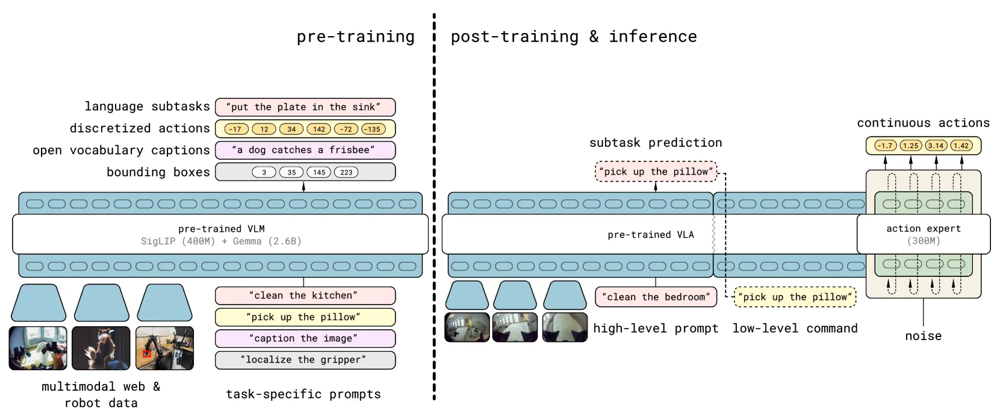

# π0.5(pi-0.5):面向开放世界泛化的视觉-语言-动作模型

> **arXiv**: [2504.16054](https://arxiv.org/abs/2504.16054) (v1)
> **机构**: Physical Intelligence
> **时间**: 2025.04
> **路线**: 混合范式 —— 高层用**自回归离散 token**(FAST tokenizer)预测自然语言子任务,底层用**流匹配(flow matching)action expert** 输出连续关节动作块

[← 返回主报告](../index.md)

---

## TL;DR

π0.5 是 Physical Intelligence 在 **π0** 基础上的扩展,核心目标只有一个词:**开放世界泛化(open-world generalization)**。它的标志性结果是——**首次**让一个端到端学习的机器人,在**训练数据中从未出现过的全新真实住宅**里,完成 **10–15 分钟、多阶段的长程灵巧操作**任务(如打扫整个厨房、整理卧室:收拾餐具、把物品放进抽屉、擦拭洒漏、关橱柜、铺床、把衣物放进洗衣篮等)。

实现这一点的两条主线:

1. **异构数据协同训练(co-training)**:把多机器人移动操作数据、多环境静态机器人数据、π0 原始跨本体数据、多模态网络数据(视觉问答 / 字幕 / 目标检测)、口头分步指令演示、以及带边界框标注的高层语义子任务预测**混在一起**联合训练,让机器人从"语义知识"和"物理技能"两个层面同时获得迁移。
2. **分层两级推理(两条路合一)**:**高层**用自回归离散 token(FAST tokenizer)生成自然语言子任务(如"拿起盘子");**底层**用流匹配 action expert,根据该子任务输出 **50 步(约 1 秒)的连续关节动作块**。

规模化结论:在约 **100 个训练环境**(约 **400 小时**移动操作数据,采集地点从 3 处扩展到 104 处)训练后,π0.5 在 **3 个全新真实住宅**上的表现**逼近**了"直接在测试住宅里采数训练"的基线——即用泛化逼近了"作弊"上界。

> ⚠️ **可信度提示**:本文的真机评测与全部消融均为 **Physical Intelligence 实验室自评**;训练数据与模型权重**未开源**;"全新住宅"虽确实不在训练集中,但其难度边界(室内布局/物体类别仍属常见家居分布)需读者自行斟酌。

---

## 1. 要解决的问题

VLA 已能在受控环境里完成不少操作任务,但真正的家用机器人面对的是**开放世界**:每个家庭的厨房布局、物体外观、橱柜结构、光照背景都不一样。π0.5 要回答三个递进的问题:

1. **开放世界泛化**:能否让机器人在**完全没见过的真实住宅**里干活,而不是只在采过数据的实验室/房间里表现良好?这要求模型对**新物体、新背景、新布局**鲁棒。
2. **长程任务**:打扫厨房不是单个抓取动作,而是一长串**多阶段子任务**(10–15 分钟级别)。模型既要会"高层规划下一步做什么",又要会"底层精细地把它做出来",并且能从错误中恢复、持续推进。
3. **知识从何而来**:机器人演示数据稀缺且昂贵,单靠机器人数据无法覆盖开放世界的语义多样性。**泛化所需的"常识/语义知识"应当从哪些数据源迁移进来?** π0.5 的核心假设是:把网络多模态数据、跨本体机器人数据、高层语义标注等**异构来源协同训练**,才能撑起开放世界的泛化。

π0.5 的定位,是把 π0 从"会做灵巧操作"推进到"**在没见过的家里也会做灵巧操作**"。

---

## 2. 方法与架构

π0.5 在 **π0** 之上扩展:继承"VLM 主干 + 独立 action expert 输出连续动作块"的双流结构,再叠加两项关键设计——**(a) 把离散自回归高层与连续流匹配底层合进同一个 VLA 主干**,实现分层两级推理;**(b) 用两阶段训练配方**,先以纯离散 token 吃下海量异构数据,再上流匹配底层把控制精度补回来。下面分三小节展开:2.1 分层两级推理(单模型内的离散+连续合并),2.2 两阶段训练配方,2.3 co-training 异构数据混合。

> **图注(译自原文 Figure 3,Model overview)**:π0.5 分两阶段训练。**预训练阶段**把所有不同数据源混合,产出一个使用**离散 token** 的初始 VLA;该阶段使用来自多种机器人平台的数据、高层语义动作预测、以及网络数据;其中机器人动作用 **FAST 动作 tokenizer** 表示为离散 token。**后训练阶段**则把模型**专门化**到移动操作的高层与底层推理上,并引入流匹配 action expert 输出连续动作。

### 2.1 分层两级推理:离散高层 + 连续底层,合进同一个模型

#### 2.1.1 概率分解:一个模型,两级条件

π0.5 把"想做什么(高层语义子任务)"和"怎么做(底层关节动作)"拆成两级,但**用同一组参数 θ 的同一个 transformer 主干**同时表达。给定观测 $\mathbf{o}_t = [\mathbf{I}^1_t,\dots,\mathbf{I}^n_t,\mathbf{q}_t]$(所有相机图像 + 机器人本体状态:关节角、夹爪位姿、躯干升降位姿、底座速度)和人类的总体指令 $\ell$(如"put away the dishes"),模型联合分布被分解为:

$$\pi_\theta(\mathbf{a}_{t:t+H},\,\hat{\ell}\mid\mathbf{o}_t,\ell)=\underbrace{\pi_\theta(\mathbf{a}_{t:t+H}\mid\mathbf{o}_t,\hat{\ell})}_{\text{底层:流匹配}}\cdot\underbrace{\pi_\theta(\hat{\ell}\mid\mathbf{o}_t,\ell)}_{\text{高层:自回归}}$$

关键点是**底层动作分布只依赖高层产出的子任务 $\hat{\ell}$,而不直接依赖原始指令 $\ell$**:高层先把"打扫厨房"这种长程指令翻译成一个当前该做的短子任务(如"pick up the plate"),底层再以这个子任务为唯一语义条件去生成动作。$\hat{\ell}$ 既可以是高层子任务,也可以是网络数据里视觉-语言 prompt 的文本答案——同一个文本输出口被复用。

#### 2.1.2 高层(High-Level)—— 自回归离散 token

给定观测 + 总体指令,主干先用**标准自回归 next-token 解码**生成一段自然语言子任务 $\hat{\ell}$(如"拿起盘子""关上橱柜门")。这条路线沿用 π0-FAST 思路:文本(以及预训练里被 **FAST tokenizer** 离散化的动作)都走 LLM 式的离散 token 通道。语言子任务作为人和底层动作之间的**语义中介**:可解释、可被人在线干预、又能直接复用网络数据里学到的常识。值得注意的是,高层标注里还要求模型在吐出子任务**之前先预测相关物体的边界框(bounding box)**,相当于一步"看哪里→做什么"的显式视觉定位,类似语言模型的思维链。

#### 2.1.3 底层(Low-Level)—— 流匹配 action expert

拿到 $\hat{\ell}$ 后,一个**较小的独立 action expert**(参照 π0)以子任务为条件,通过**流匹配(flow matching)**输出 **50 步(约 1 秒)的连续关节动作块 $\mathbf{a}_{t:t+H}$**($H$ 为动作块长度)。流匹配的训练目标是回归向量场:对 $\mathbf{a}^{\tau,\omega}_{t:t+H}=\tau\,\mathbf{a}_{t:t+H}+(1-\tau)\,\omega$($\omega\sim\mathcal N(0,\mathbf I)$,$\tau$ 为流匹配时间索引),预测 $\omega-\mathbf{a}_{t:t+H}$。**推理时高层自回归解码出 $\hat{\ell}$,底层再用 10 步去噪/积分迭代**产出连续动作块,以 **50 Hz** 配合 action chunking 直接下发目标位姿(简单 PD 控制器跟踪,无额外轨迹规划/碰撞检测,全端到端)。用连续流匹配而非离散 token 出动作,避免了纯离散表示在高频灵巧控制上昂贵的自回归解码与精度损失。

#### 2.1.4 单 transformer 内如何把两路串起来

主干是一个能吃**混合 token** 的 transformer:每个输入 $x_i$ 可以是文本 token、图像 patch,或流匹配中动作的中间去噪值(连续向量)。token 类型决定它走哪个编码器和**哪套专家权重**——动作 token 被线性投影进嵌入空间并由**独立的 action expert 权重**处理(与 VLM 主干权重分开,这是 π0 双流结构的继承)。注意力上,图像 patch、文本 prompt、连续动作 token 之间用**双向注意力**(不同于 LLM 的纯因果注意力);本体状态被离散化后作为文本 token 输入。输出端拆成两段:前 $M$ 个是文本 logits(采样得到 $\hat{\ell}$),后 $H$ 个由 action expert 产出、线性映射为连续动作 $\mathbf{a}_{t:t+H}$。**一个关键工程细节**:预训练里 FAST 离散动作 token 与后训练里流匹配的连续动作 token 是两套并存的动作表示,论文**用注意力掩码确保两种动作表示彼此不互相 attend**,从而能在同一模型里共存而不打架。

于是 π0.5 把 VLA 领域的**两条主要技术路线合并到一个模型**:高层吃"语义、可解释、能蹭网络数据"的离散自回归路线,底层吃"高频、连续、灵巧"的流匹配路线。

### 2.2 两阶段训练配方:先离散统一,再上连续

π0.5 的模型权重从一个**标准 web VLM** 初始化,随后分两阶段训练。两阶段共享同一个组合损失(原文 Eq.1):

$$\mathbb{E}_{\mathcal D,\tau,\omega}\Big[\,\underbrace{H\big(x_{1:M},\,f^\ell_\theta(\mathbf{o}_t,\ell)\big)}_{\text{文本/FAST 动作 token 交叉熵}}+\alpha\,\underbrace{\big\|\omega-\mathbf{a}_{t:t+H}-f^a_\theta(\mathbf{a}^{\tau,\omega}_{t:t+H},\mathbf{o}_t,\ell)\big\|^2}_{\text{流匹配损失}}\,\Big]$$

其中第一项是文本与预测 logits(**含 FAST 编码的离散动作 token**)的交叉熵,第二项是 action expert 的流匹配损失,$\alpha$ 是权衡系数。**两阶段的本质区别就是 $\alpha$ 取值不同**:

- **① 预训练阶段(离散统一,$\alpha=0$)**:整个模型当作一个**标准自回归 VLM** 来训,对文本、物体位置(边界框)、**FAST 离散化的动作 token** 一律做 next-token prediction。此时**动作也被映射成文本 token**,于是机器人动作、网络 QA/字幕、高层子任务预测、边界框定位**共用同一个 next-token 目标**——这正是"先借离散统一吃下海量异构数据"的关键:用同一种监督形式把六类异构数据(见 2.3)灌进同一个模型,训练简单、可扩展、稳定。预训练跑约 **280k 梯度步**。动作数据细节:区分目标关节位姿 / 末端执行器位姿(prompt 里加 `<control_mode>joint/end effector<control_mode>` 标记),按每维 1%/99% 分位数归一化到 $[-1,1]$,并对低维本体零填充到统一动作维度。
- **② 后训练 / 专门化阶段(加上流匹配,$\alpha=10.0$)**:在预训练好的离散 VLA 上,**新增一个随机初始化的 action expert**,目标函数仍是 Eq.1 但 $\alpha=10.0$,**联合**做 next-token prediction(保留文本/语义能力)与流匹配(获得连续动作)。再跑约 **80k 步**,把模型**专门化到家庭移动操作**。

**为什么分两阶段?** 论文的逻辑是:离散 token 训练**简单、可扩展、训练快**,适合把多源异构数据(尤其网络数据与跨本体数据)统一吃进来建立"广度知识与语言跟随";但离散表示在实时高频控制上**解码昂贵、精度受限**。于是先用离散把广度打满,再在后训练阶段引入流匹配 action expert 把**底层连续控制的精度与推理效率**补回来。作者发现该流程能带来**稳定的预训练**与**很强的语言跟随能力**。

### 2.3 co-training:六类异构数据各自的作用

> **图注(译自原文 Figure 4)**:π0.5 在以下数据上**预训练**——移动操作机器人数据(**MM**)、多样环境中的非移动机器人数据(**ME**)、实验室条件下采集的跨本体数据(**CE**),以及高层子任务预测(**HL**)和多模态网络数据(**WD**);在**后训练**阶段额外加入口头分步指令(**VI**),并**去掉**实验室跨本体数据(CE),以聚焦于移动操作与多样环境。

co-training 的核心假设:**机器人演示数据稀缺,开放世界泛化所需的语义广度必须从异构来源迁移进来**。π0.5 把以下六类数据用同一种(预训练阶段的)离散 next-token 目标混合训练:

- **多机器人移动操作数据(MM)**:约 **400 小时**移动操作演示,覆盖约 **100 个不同家庭环境**,机器人为双臂 + 移动底座 + 升降躯干平台。这是**最直接对应评测任务**(在全新住宅里打扫整理)的数据切片。
- **多环境静态机器人数据(ME)**:非移动单臂/双臂机器人在**多样家庭环境**采集。这些臂更轻、易搬运,因而能在**更广的家庭**里采到更多样的数据,主要贡献**环境/场景多样性**;但它来自与移动机器人**不同的本体**。
- **跨本体实验室数据(CE)**:实验室桌面环境下、多种机器人类型(单臂/双臂、静态/移动底座)做多任务(收拾桌子、叠衬衫等),含开源 **OXE** 数据集,是 π0 所用数据集的扩展版。贡献**任务/技能多样性**;**后训练阶段被剔除**以聚焦移动操作。
- **高层语义子任务预测(HL)**:把"打扫卧室"等长指令**人工标注**拆成短子任务("整理毯子""捡起枕头"),对 MM/ME/CE 中的多子任务数据训练模型**联合预测子任务文本 + (以子任务为条件的)动作**;并标注当前观测里**相关物体的边界框**,要求模型**先预测边界框再预测子任务**。这一项直接造就了"同一个模型既能当高层策略输出子任务、又能当底层策略执行动作"。
- **多模态网络数据(WD)**:图像字幕(CapsFusion、COCO)、视觉问答(Cambrian-7M、PixMo、VQAv2)、物体定位(并用室内场景/家居物体的边界框数据扩充)。把**互联网级语义常识**注入 VLA,主要影响**物体层面的泛化**。
- **口头分步指令演示(VI, Verbal Instructions)**:**后训练阶段**加入。专家用户用语言"遥操作"——对一个已训练好的底层策略,实时**逐步选择恰当的子任务指令**驱动机器人完成移动操作,等于在示范"好的高层子任务输出长什么样",强化高层规划与语言跟随。

直觉上:**MM/ME/CE 撑"会做各种任务、适应各种环境"的物理技能多样性;WD/HL/VI 撑"理解语义、规划子任务、跟随语言"的语义泛化**。两者协同,端到端模型才能在新家里既"看得懂"又"做得来"。

**消融结论(以原文为准,详见第 4 节)**:**去掉跨本体数据(ME 或 CE)→ 性能大幅退化**,两者皆去时退化最严重,说明跨本体/多环境数据是泛化支柱;**网络数据(WD)主要影响物体层面的泛化**(尤其对训练中未见过物体类别 OOD 的语言跟随),对主任务成功率影响较小。

#### 2.3.1 开放世界泛化机制:为什么语义广度带来对新家的泛化

π0.5 的泛化不是靠"在目标住宅多采数据",而是靠 co-training 的**语义广度 + 环境数量规模化**。约 **100 个训练环境**(约 400 小时移动操作,采集地点从 **3 处扩展到 104 处**)训练后,模型在 **3 个完全没见过的真实住宅**里完成 10–15 分钟长程家务,**逼近**了"把测试住宅也放进训练集"的"作弊"上界。机制上:ME/CE 让模型见过足够多的**布局/家具/物体几何**,WD/HL 让模型把**新物体、新场景**对接到已有语义常识与子任务规划上——于是面对新家具、新布局时,高层能基于语义常识规划出合理子任务,底层能把跨环境学到的技能迁移过去,而不依赖在该住宅采过数据(评测全部在**训练中未出现**的环境进行)。

### 2.4 机器人系统

> 原文 Figure 5:使用两种移动操作平台,每台配 **4 个相机**(前、后、双腕),**两条 6-DoF 机械臂 + 平行夹爪**,一个移动底座(2D 线速度 + 1D 角速度)和一个躯干升降机构(1D 或 2D)。π0.5 同时控制双臂关节与夹爪、底座速度、升降位置,状态/动作空间约 **18–19 DoF**。**高层推理用全部 4 个相机,底层推理用腕部 + 前向相机**;模型以 50 Hz 直接下发目标位姿/底座速度,由简单 PD 控制器跟踪,无轨迹规划或碰撞检测。

---

## 3. 关键设计与创新点

1. **把"离散高层 + 连续底层"合并成单一 VLA**:高层自回归离散 token 负责可解释、可蹭网络常识的语义子任务规划;底层流匹配 action expert 负责高频连续灵巧控制。一个模型同时占住 VLA 的两条技术路线。
2. **异构数据协同训练作为泛化引擎**:不靠"在目标环境多采数据",而靠**把语义类(网络/HL/VI)与物理类(MM/ME/CE)数据混合**,用迁移撑起开放世界泛化。这是 π0.5 与"只用机器人数据"路线最本质的区别。
3. **两阶段训练配方**:预训练先用全量异构数据 + 离散 token 建立通用 VLA;后训练再专门化到移动操作(加入 VI、去掉 CE、接上流匹配底层)。让"广度知识"和"任务专精"分阶段获得。
4. **语言子任务作为语义中介**:高层输出自然语言子任务,既让长程任务可分解、可解释、可干预,又把网络数据的语义直接对接到行为规划上。
5. **面向真实住宅的长程评测**:不在采过数据的房间里刷分,而是搬进**全新真实住宅**做 10–15 分钟级别的多阶段任务,直接把"开放世界泛化"作为第一性的评测目标。

---

## 4. 实验与关键结果

**(1) 全新真实住宅的开放世界泛化(核心结果)**
π0.5 被搬进 **3 个完全没在训练中出现过的真实住宅**(新厨房 / 新卧室,含新物体、新背景、新布局),完成"把物品放进抽屉""把餐具放进水槽""把衣物放进洗衣篮""铺床"等任务。模型一边**预测高层子任务**(原文图中以蓝字标注在每帧下方),一边**输出底层动作**,完成 10–15 分钟的多阶段流程。论文同时用一组**仿真/模拟房间(mock rooms)**做可复现的定量对比,并发现其表现**能代表真实住宅中的表现**(原文 Figure 6/7)。

**(2) 泛化随场景数量的规模化(原文 Figure 8/9)**
随训练**环境数量增加**(地点从 3 扩展到 104,约 100 个训练环境、约 400 小时移动操作数据),四个测试任务("dishes in sink""items in drawer""laundry basket""make bed")的进度持续提升。最关键的对照:论文设了一个**把测试住宅也放进训练集**的"作弊"基线(图中绿色虚线/绿条);**π0.5 在不见任何测试住宅数据的情况下,性能逼近该基线**——即用纯泛化逼近了"在目标环境训练"的上界。语言跟随率与抓取-放置成功率也随训练地点数稳步上升,且对 in-distribution 与 out-of-distribution 物体类别都有改善。

**(3) 协同训练配方消融(原文 Figure 10/11/16)**
- **去掉跨本体数据 → 大幅退化**:无论是去掉多样环境数据(ME)、还是去掉实验室跨本体数据(CE),性能都显著下降;两者皆去时退化最严重。说明**跨本体/多环境数据是泛化的支柱**。
- **网络数据(WD)影响物体泛化**:在主任务成功率上 WD 影响不明显,但在**物体层面的泛化、尤其是 OOD(未见物体类别)的语言跟随**上,WD 贡献显著(Figure 11/16)。
- **高层推理与 VI/WD 的作用(Figure 13)**:完整的"高层 + 底层"双级推理结果最好;即便只用底层("implicit HL"),训练中包含高层子任务样本也有帮助;而**去掉口头指令(VI)或网络数据(WD)会显著掉点**,零样本 prompting 的高层基线则明显更差。

**(4) 与其他 VLA 的对比(原文 Figure 12/15)**
在 mock home 测试环境中,完整 π0.5 **显著优于 π0 与 π0-FAST(+Flow)**;在语言跟随能力上 π0.5 也优于 π0 与 π0-FAST+Flow。这印证了"分层 + 协同训练"相对单一 π0/π0-FAST 的增量价值。

---

## 5. 局限与争议

1. **全为实验室自评**:真机评测、规模化曲线、所有消融均由 Physical Intelligence 自行完成,无独立第三方复现;mock room 与真实住宅的对应关系也由作者给出。
2. **数据与权重闭源**:训练数据(尤其约 400 小时移动操作数据、网络数据混合配方的细节)与模型权重未公开,外界难以复现或在其上做二次研究。
3. **"全新住宅"的难度边界**:住宅确实不在训练集中,但仍属**常见家居分布**(厨房、卧室、常见物体类别),与"任意开放世界"之间仍有距离;泛化声明的强度应结合这一点理解。物体类别的 OOD 范围、布局的极端程度等都会影响结论可迁移性。
4. **依赖大规模异构数据**:其泛化能力建立在约 100 个环境、多源异构数据之上,数据采集成本高;在数据规模受限时方法收益如何尚不清楚(规模化曲线显示性能对环境数量较敏感)。
5. **长程任务仍非 100% 可靠**:10–15 分钟多阶段任务以"任务进度(task progress)"度量,而非纯二元成功率,意味着部分任务并未完全做完——开放世界长程灵巧操作离"稳定可用"仍有差距。

---

## 6. 在 VLA 谱系中的位置

- **承 [[pi0]]**:π0.5 直接在 π0 的"VLM 主干 + 流匹配 action expert 输出连续动作块"之上扩展,把目标从"会灵巧操作"推进到"在没见过的家里也会灵巧操作"。底层连续控制路线一脉相承。
- **承 [[pi0-fast]]**:高层的"自回归离散 token + FAST tokenizer"来自 π0-FAST。π0.5 的创新在于**不把离散与连续二选一,而是分层合并**——离散管语义高层、流匹配管连续底层。
- **把两条路线合并的混合范式**:VLA 长期存在"离散 token 自回归"([[rt2]]、[[openvla]])与"连续流匹配/扩散"([[pi0]])两条主线;π0.5 用**分层架构把两者各取所长地装进一个模型**,代表了一种范式融合。
- **与分层前沿并列**:在"高层语义规划 + 底层连续控制"的分层思路上,π0.5 与 [[groot-n1]]、Figure 的 **Helix** 同属当前 VLA 的分层前沿;不同点在于 π0.5 把重点压在**异构数据协同训练驱动的开放世界泛化**,并以"全新真实住宅长程任务"作为第一性的验证目标。

一句话:**π0.5 是 π0 系列从"灵巧"走向"泛化"的关键一步——它用分层架构(离散高层 + 流匹配底层)统一了 VLA 的两条技术路线,并用异构数据协同训练把开放世界泛化推到了"在全新真实住宅完成长程家务"的高度,代价是高昂的数据需求与尚未开源、尚待第三方验证的自评结论。**

---

## 来源

- 论文:π0.5: a Vision-Language-Action Model with Open-World Generalization. arXiv:2504.16054 (Physical Intelligence, 2025.04). <https://arxiv.org/abs/2504.16054>
- HTML 全文(图 3/4 来源):<https://arxiv.org/html/2504.16054v1>
- 官方博客:<https://www.physicalintelligence.company/blog/pi05>
- 架构图:本仓库 `images/pi05_arch.webp`(原文 Figure 3 Model overview,源文件 `x2.png`)
- 数据混合图:本仓库 `images/pi05_data.webp`(原文 Figure 4 预训练/后训练任务示例,源文件 `x3.png`)

> 说明:第 4–5 节中的全部真机数字、规模化曲线与消融结论均为 **Physical Intelligence 实验室自评**,训练数据与权重未开源,引用时请注明其自评属性。
