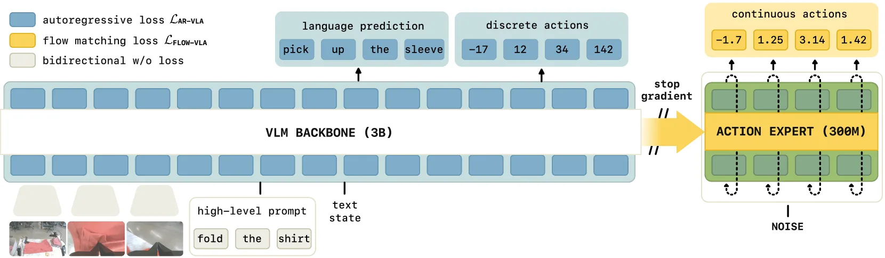

# π0.6 / π*0.6(pi-star-0.6):一个"从经验中学习"的 VLA(Knowledge Insulation + RECAP)

> **arXiv**: [2511.14759](https://arxiv.org/abs/2511.14759) (v1, π*0.6,2025.11) · [2505.23705](https://arxiv.org/abs/2505.23705) (Knowledge Insulation,2025.05)
> **模型卡**: π0.6 基座(Physical Intelligence,2025.11.17)
> **机构**: Physical Intelligence
> **路线**: 分层(高层离散自回归 + 底层流匹配)+ **Knowledge Insulation** 训练 + **RECAP** 真机强化学习(优势条件策略)

> [← 返回主报告](../index.md)

---

## TL;DR

这份文档覆盖 Physical Intelligence(PI)在 π0.5 之后的一条主线,可拆成**三个递进的子主题**:

1. **π0.6(基座)**:PI 最新的**基座 VLA**,沿用 π0.5 的**分层设计**(高层预测子任务 + 底层生成动作),把 VL 主干换成 **Gemma3-4B 初始化**(配 SigLIP-400M 视觉编码器),**动作专家约 860M 参数**,动作块**同时支持流匹配(连续)与离散 token 化(FAST)两种输出**,并用 **Knowledge Insulation** 配方训练。
2. **Knowledge Insulation(知识隔离,KI)**:一种训练配方。核心是**在 VLA 训练时"隔离"预训练 VLM 主干**——主干用 **FAST 离散动作 token + 网络数据 co-train** 来微调,而把连续动作专家(流匹配/扩散)的**梯度 stop-gradient,不回传到 VLM 主干**。论文指出:朴素地给 VLM 直接挂一个连续动作专家,会**同时损害训练速度与预训练知识的迁移**;隔离之后能"训练更快、运行更快、泛化更好"。
3. **π*0.6 与 RECAP(从经验中强化学习)**:以 π0.6 为基座,通过**真机强化学习**改进出 π*0.6(pi-star-0.6),方法名 **RECAP**(RL with Experience and Corrections via Advantage-conditioned Policies,优势条件策略 + 经验与纠正的 RL)。它把**示范数据 + on-policy 自主采集数据 + 专家遥操作干预**三类异构数据融进一个自我改进循环,用**分布式价值函数**估计优势、再以**二值化优势指标**作为条件来"萃取"更优策略。作者自报:在**最难的任务上(真实家庭叠衣服、组装纸箱、做意式浓缩咖啡)吞吐量翻倍以上、失败率约减半**。

一句话:**π0.5 把 VLA 从"灵巧"推到"泛化",π0.6/π*0.6 这条线则把 VLA 从"模仿学习"推进到"从经验中强化学习"——用 KI 让基座既会蹭网络知识又能高频控制,用 RECAP 让策略在真机上自己练、自己纠错、越练越强。**

> ⚠️ **可信度提示**:本文所有真机数字、增益与消融均为 **Physical Intelligence 自评**,非独立第三方复现;增益主要体现在**最难的任务**上;π0.6 / π*0.6 / KI 的训练数据与权重均未开源。原文采用 π*₀.₆ / π₀.₆ 的下标记法(星号表示经 RL 改进的版本)。

---

## 1. 要解决的问题

π0.5 已经证明"分层 + 异构数据协同训练"能带来开放世界泛化(在全新真实住宅里干活),但它本质仍是**模仿学习(imitation learning)**:策略的上限被**人类演示数据的质量**锁死——它学到的是"模仿人类怎么做",而不是"在自己实际会犯的错误上变得更好"。这带来三个无法靠加演示数据解决的问题:

1. **纠正自己真正会犯的错**:演示数据里大多是"成功轨迹",模型部署时遇到的**自己特有的失败模式**(抓空、叠错、咖啡机操作失误)在演示集里往往没有对应的纠正示范。模仿学习只能逼近演示分布,无法针对**自身 on-policy 分布**上的错误做修正。
2. **超过人类遥操作的速度与鲁棒性**:演示来自人类遥操作,模仿学习的天花板就是人类水平。要"练到比示教更快更稳",需要让机器人**自主练习并从结果(成功/失败)中获得反馈**——这正是强化学习(RL)的设定。
3. **把连续动作专家"加"进预训练 VLM 时的两难**:要保留 VLM 的网络级语义知识,又要高频灵巧控制,常见做法是给 VLM 挂一个连续动作专家。但论文(KI)发现:**朴素地这么做会同时拖慢训练、又破坏预训练知识的迁移**——连续动作的梯度会"污染"VLM 主干,既学不快也泛化不好。

于是这条线给出两件对应的工具:**Knowledge Insulation** 解决"如何把连续动作专家接进 VLM 而不损害知识与速度"(问题 3),**RECAP** 解决"如何让 VLA 从自身经验与纠正中强化学习"(问题 1、2)。

---

## 2. π0.6:基座(Base Model)

π0.6 是这条线的**基座 VLA**(官方模型卡,2025.11.17),在架构上**承袭 π0.5 的分层范式**(高层离散自回归预测子任务 + 底层流匹配生成连续动作块),并相对 π0.5 在三处放大/升级:

| 维度 | π0.5 | π0.6 |
|---|---|---|
| VL 主干 | web VLM(PaliGemma 系) | **Gemma3-4B 初始化**(配 **SigLIP-400M** 视觉编码器) |
| 动作专家 | 较小独立 expert | **层数与主干相同、约 860M 参数** |
| 动作输出 | 流匹配(后训练)+ FAST 离散(预训练) | **同时支持流匹配(连续)+ 离散 token 化(FAST)** 两种输出 |
| 训练配方 | 两阶段(离散统一 → 上流匹配) | **Knowledge Insulation** 配方 |
| 预训练数据 | 多源异构(MM/ME/CE/HL/WD/VI) | 在其上**追加多机器人平台数据** |

模型联合分布仍写成与 π0.5 同构的形式:

$$\pi_\theta(\mathbf{a}_{t:t+H},\,\hat{\ell}\mid\mathbf{o}_t,\ell)$$

其中 $\mathbf{o}_t=[\mathbf{X}^1_t,\dots,\mathbf{X}^n_t,\mathbf{q}_t]$ 为多相机图像 + 本体状态,$\ell$ 为总体指令,$\hat\ell$ 为高层产出的子任务/文本。**高层**用自回归离散 token 解码出自然语言子任务(如 "fold the shirt"、"tamp the coffee"),**底层** action expert 以子任务为条件、用流匹配输出连续关节动作块。π*0.6 在此基座上**额外增加"对二值化优势值(binarized advantage)的条件能力"**——这一点是 RECAP 能把价值函数接进策略的关键(见第 4 节)。

---

## 3. Knowledge Insulation(知识隔离):怎么把动作专家接进 VLM 而不损害它

> 来源:*Knowledge Insulation: Co-Training of Action Expert and VLM Backbone for Vision-Language-Action Models*,arXiv:2505.23705(2025.05.29;作者含 Driess、Springenberg、Pertsch、Levine 等)。π0.6 / π*0.6 的训练即采用此配方。

> **图注(译自 KI 论文 Figure 1)**:核心思想是——**VLM 主干**用**离散化动作 token 的 next-token prediction 损失 + 通用 VLM 数据**来训练以学到好的表征(图中黄色"language prediction"自回归损失、以及 "discrete actions" 一行 `-17 35 ... 142`);**动作专家(action expert)**则在**连续动作**上用**流匹配损失**训练(图右绿色 "continuous actions");而**动作专家回传到 VLM 主干的梯度被切断(stop gradient,图中主干与专家之间的 `//` 符号)**。图中蓝色为双向注意力、无损失。这样,连续控制信号不会"污染"预训练 VLM 的语义表征。

### 3.1 朴素接法的问题

要让一个 VLM 同时具备"语义理解 + 高频连续控制",最直接的做法是:保留 VLM 主干,旁挂一个连续动作专家(扩散/流匹配),端到端一起训。KI 论文指出这么做有两个相互纠缠的代价:

- **训练慢**:连续动作的流匹配损失与 VLM 的离散表征"诉求"不一致,梯度互相拉扯,收敛变慢。
- **知识迁移受损**:连续动作专家的梯度回传会**改写 VLM 主干**,使它逐渐遗忘/扭曲来自网络预训练的语义与语言跟随能力——表现为"指令跟随变差、对未见物体泛化变差"。

### 3.2 隔离机制:主干走离散、专家走连续、梯度不互通

KI 的解法是把"主干学什么"和"专家学什么"在**梯度层面**隔离开:

1. **VLM 主干**:只用**离散 token 的 next-token prediction** 来训——既包括通用 VLM 数据(网络图文 QA / caption / 定位),也包括**用 FAST tokenizer 离散化的动作 token**。也就是说主干**仍然"看见"动作**(以离散形式),从而保留对动作语义的感知,但训练目标始终是它最擅长、最稳定的自回归离散目标,网络知识因此被很好地保留。
2. **动作专家**:用**流匹配**在**连续动作**上训练,负责真正高频、灵巧的底层控制。
3. **关键:stop-gradient**。动作专家的梯度**不回传到 VLM 主干**(图中 `//`)。于是连续控制信号无法改写主干表征——主干被"绝缘/隔离"在网络知识的良好状态附近,专家则自由地学连续控制。

直觉:**让 VLM 主干用它最擅长的方式(离散自回归 + 网络数据)保持"博学且会跟随语言",同时把"高频连续控制"这件脏活外包给一个梯度隔离的动作专家**,两者各练各的、互不破坏。论文据此报告该配方能"**训练更快、运行(推理)更快、泛化更好**"。

> 与 π0.5 的关系:π0.5 用**两阶段**(先离散统一吃异构数据,再上流匹配)在**时间维度**上缓解冲突;KI 则用 **stop-gradient** 在**梯度维度**上更彻底地解决——两者动机一致(让离散语义与连续控制共存而不打架),KI 把它做成了 π0.6 的标准训练配方。

---

## 4. π*0.6 与 RECAP:从经验与纠正中强化学习

> 来源:*π*₀.₆: a VLA That Learns From Experience*,arXiv:2511.14759(2025.11.18)。

> **图注(译自原文 Figure 3)**:π*0.6 VLA 与价值函数在 **RECAP** 训练中的交互。**上方**是 π*0.6 VLA(预训练 VLM:**SigLIP-400M + Gemma-4B**),按 **KI 配方**训练——预训练对多源数据做 next-token prediction,**带 stop-gradient 的流匹配动作专家(860M)** 输出连续动作(图右 "continuous actions"),同时也能输出离散动作 token(图中 "discretized actions")。VLA 以一个**二值化优势指标(binarized advantage indicator)**为条件(中部 `binarization A(o,a)>ε`),该指标来自**一个独立的、由更小的预训练 VLM 初始化的价值函数**(下方 **SigLIP-400M + Gemma-270M + value head**)。优势按 $A(o,a)=r_{t:t+N}+V(o_{t+N})-V(o_t)$ 估计。该 on-policy 估计器虽不如经典 off-policy Q 函数最优,但**简单可靠**,且仍能在模仿学习之上带来显著提升。

### 4.1 RECAP 是什么

**RECAP = RL with Experience and Corrections via Advantage-conditioned Policies**(经验与纠正的强化学习 · 优势条件策略)。它先用**离线 RL 预训练**出一个通用 VLA(即 **π*0.6** 基座,能力对应 π0.6 但**增加了"以二值化优势为条件"的能力**),再在下游任务上**迭代地自我改进**。它的特色是把**三类异构数据**统一纳入自我改进循环:

- **示范数据(demonstrations)**:人类遥操作示范,提供初始能力与"好行为"的分布。
- **on-policy 采集数据**:让当前策略**自主执行**任务,采集它**自己真正会产生**的轨迹(含自己特有的失败),并用任务结果(成功/失败)给出**奖励标签**。
- **专家遥操作干预(expert teleoperated interventions / corrections)**:在自主执行过程中,专家对早期迭代中的错误**实时介入纠正**,提供"该怎么把错救回来"的纠错示范。

### 4.2 三步迭代循环

每一轮迭代包含三步(对应原文 Algorithm 1 / RECAP 描述):

1. **数据采集(Experience & Corrections)**:用当前策略自主执行任务,记录轨迹并打上**任务结果奖励标签**;可选地由专家**人工干预**,为早期迭代的错误提供纠正示范。
2. **价值函数训练(Value function training)**:用**到目前为止采集的全部数据**训练一个**大型、多任务、语言条件的分布式价值函数** $V^{\pi_{\text{ref}}}$,它能**检测失败**并**预测到任务完成还需多少步**(原文把价值归一化到 $(-1,0)$,$0$ 表示成功完成)。
3. **优势条件训练(Advantage-conditioned training)**:由价值函数算出**状态-动作优势** $A(o,a)=r_{t:t+N}+V(o_{t+N})-V(o_t)$,经**二值化**($A(o,a)>\varepsilon$)成一个"最优性指标(optimality indicator)",把它**塞进 VLA 的前缀(prefix)作为条件**。推理时只需把该指标置为"最优",就能从含次优数据的混合数据里**萃取出一个更优的策略**。

**为什么用"优势条件"而不是经典 actor-critic?** 论文的论证是:直接拟合 off-policy Q 函数对大模型 + 真机异构数据既不稳定也难扩展;而"训一个价值函数估优势 + 用二值化优势作为策略条件"这套做法**简单、稳定、可靠**,能在**带次优/失败样本**的真实数据上稳定地把策略往"更优"方向拉,且天然兼容 KI 的 prefix-conditioning 结构(优势指标就是 prefix 里的一个额外条件 token)。代价是该 on-policy 优势估计**不如经典 off-policy 估计器最优**——作者把它列为可改进的未来工作。

### 4.3 把模仿学习推进到"从经验学习"

RECAP 的范式意义在于:它让 VLA **不再只是逼近人类演示分布**,而是

- 在**自身 on-policy 分布**上发现并纠正自己真正会犯的错(靠 on-policy 采集 + 干预纠正);
- 用**奖励/价值信号**判断"哪些动作更优",据此**超越演示质量上限**(优势条件萃取);
- 通过**多轮迭代**持续累积经验、反复改进("越练越好")。

这正是把 π 系列从 π0/π0.5 的**模仿学习**,推进到**真机强化学习(从经验与纠正中学习)**的一步。

---

## 5. 关键设计与创新点

1. **基座放大 + 双动作表示**:π0.6 用 Gemma3-4B(+ SigLIP-400M)做主干、860M 动作专家,动作块**同时支持流匹配(连续)与 FAST 离散 token**,在同一模型里覆盖"语义离散"与"高频连续"两条路。
2. **Knowledge Insulation(梯度隔离)**:VLM 主干只走"离散动作 token + 网络数据"的自回归目标,连续动作专家走流匹配且**梯度不回传主干(stop-gradient)**;以此**同时**解决"朴素接连续专家会拖慢训练 + 损害知识迁移"的两难,换来"训练快、推理快、泛化好"。
3. **RECAP 三类异构数据统一进 RL 循环**:示范 + on-policy 采集 + 专家干预纠正,被同一套自我改进流程消化。
4. **分布式、语言条件、多任务价值函数**:由更小的预训练 VLM(Gemma-270M + value head)初始化,预测"到成功还需多少步",既能检测失败又能给出优势。
5. **优势条件策略萃取(advantage-conditioned policy extraction)**:用**二值化优势**作为策略 prefix 条件,从含次优数据的混合数据里萃取更优策略——比经典 off-policy Q 学习更简单稳定,且与 KI 的 prefix-conditioning 天然契合。
6. **真机自我改进作为第一性目标**:在真实家庭场景的最难任务(叠衣服/装纸箱/做浓缩咖啡)上做**多轮迭代**评测,直接以"吞吐量、失败率随迭代如何变化"为验证目标。

---

## 6. 实验与关键结果

> 全部为 Physical Intelligence 自评,非独立复现。

**(1) 核心增益(最难任务)**
在最难的真实任务上(真实家庭**叠多样衣物**、**组装纸箱**、用专业咖啡机**做意式浓缩**),RECAP 让 π*0.6 相对模仿学习基线**吞吐量(throughput)翻倍以上、任务失败率约减半**。这些任务都带有现实变异性(纸箱压平后粘连/弯折、衣物形态多变、咖啡机操作多步)。

**(2) RECAP 带来多少提升 / 多轮迭代效果(原文 Fig.7–10)**
论文分别考察"RECAP 相对基线提升多少""多轮迭代下 π*0.6 如何持续改进",显示性能随迭代轮次提升——即**自我改进循环确实在累积收益**。

**(3) 优势条件萃取 vs 其它方法(原文 Fig.12)**
把 RECAP 的"优势条件策略萃取"与其它策略萃取/RL 方法对比,论证其在大模型 + 真机异构数据下的**简单性与可靠性**优势。

**(4) 少量数据移除特定失败模式(原文 VI-C4 / Fig.13、experiment5)**
RECAP 可以用**相对少量的数据**显著改变策略行为、**定向移除某个失败模式**——体现"针对自身错误做纠正"的数据效率。

**(5) 价值函数可视化(原文 Fig.4)**
多任务价值函数在叠衣等任务上输出可解释的"到成功剩余步数"信号(归一化到 $(-1,0)$),价值上升/震荡分别对应"接近成功/反复犹豫",可用于检测失败。

---

## 7. 局限与争议

1. **全为实验室自评**:吞吐量翻倍、失败率减半、迭代曲线、消融均由 Physical Intelligence 自行完成,无第三方复现。
2. **增益集中在最难任务**:"翻倍/减半"主要出现在最难任务上;在更简单任务上 RECAP 相对模仿学习的边际收益可能小得多,需结合具体任务理解。
3. **数据与权重闭源**:π0.6 / π*0.6 / KI 的训练数据、价值函数、模型权重均未公开,外界难以复现或二次研究。
4. **优势估计并非最优**:论文自承其 on-policy 优势估计器**不如经典 off-policy Q 函数最优**,是有意为稳定性/可扩展性做的取舍,留作未来工作。
5. **真机 RL 的工程门槛**:在真实世界设置奖励反馈、处理来自不同策略的异构数据、为大模型设计可扩展且稳定的 RL,都是论文明确指出的难点;依赖**专家干预**也意味着自我改进并非完全自主、仍需人在环。
6. **"从经验学习"的边界**:增益依赖大量 on-policy 采集与人工纠正,数据/人力成本高;在采集预算受限时收益如何尚不清楚。

---

## 8. 在 VLA 谱系中的位置

- **直接承 [[pi05]](分层范式)**:π0.6 沿用 π0.5 的"高层离散自回归子任务 + 底层流匹配连续动作"分层结构,把主干放大到 Gemma3-4B、动作专家放大到 860M,并把训练配方升级为 Knowledge Insulation。
- **承 [[pi0-fast]](FAST 离散 token)**:KI 让 VLM 主干用 **FAST 离散动作 token** 来"看见动作"并保持自回归训练稳定,正是 π0-FAST 离散动作表示在"知识隔离/高层"语境下的复用。
- **承 [[pi0]](流匹配动作专家)**:底层连续控制仍是 π0 的流匹配 action expert,KI 给它加了对主干的 stop-gradient。
- **范式推进:模仿学习 → 从经验中强化学习**:π0/π0.5 是模仿学习,RECAP 用"价值函数 + 优势条件 + on-policy 经验与纠正"把这条线推进到**真机强化学习**;这是与"只加更多演示数据"路线最本质的区别。
- **与分层 + RL 前沿并列**:在"基座 VLA + 真机 RL 自我改进"方向上,π*0.6 代表 PI 给出的一套具体配方(KI 训基座 + RECAP 做提升)。

一句话:**这条线由三块拼成——π0.6 提供放大后的分层基座,Knowledge Insulation 用梯度隔离让"网络知识"与"高频连续控制"在一个模型里互不损害,RECAP 用优势条件策略 + 三类异构经验数据把 VLA 从"模仿人类"推进到"在真机上从自己的经验与纠正中越练越强";代价是高昂的真机采集/人工纠正成本,以及尚未开源、尚待第三方验证的全套自评结论。**

---

## 来源

- 论文:π*₀.₆: a VLA That Learns From Experience. arXiv:2511.14759 (Physical Intelligence, 2025.11). <https://arxiv.org/abs/2511.14759>
- 论文:Knowledge Insulation: Co-Training of Action Expert and VLM Backbone for VLAs. arXiv:2505.23705 (Physical Intelligence, 2025.05). <https://arxiv.org/abs/2505.23705>
- 模型卡:π0.6 base model (Physical Intelligence, 2025.11.17)。
- 官方博客:<https://www.pi.website/blog/pistar06> · <https://www.physicalintelligence.company/blog/pi06>
- π*0.6 HTML 全文(图来源):<https://arxiv.org/html/2511.14759v1>
- 架构图(知识隔离机制):本仓库 `images/pi06_arch.webp`(KI 论文 arXiv:2505.23705 Figure 1,源文件 `x1.png`;展示主干离散训练、专家流匹配、stop-gradient 梯度隔离)
- RECAP 流程图:本仓库 `images/pi06_recap.webp`(π*0.6 论文 Figure 3,源文件 `figures/model_architecture.png`;展示 π*0.6 VLA × 价值函数 × 二值化优势条件的交互)

> 说明:第 6–7 节中的全部真机数字、迭代曲线与消融结论均为 **Physical Intelligence 实验室自评**,训练数据与权重未开源;增益主要体现在最难任务,引用时请注明其自评属性。
