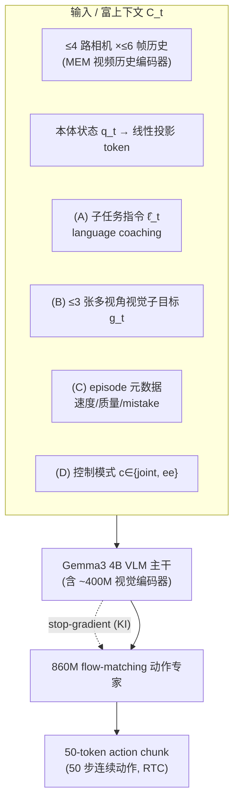
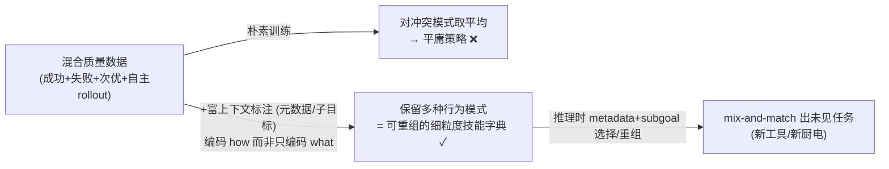
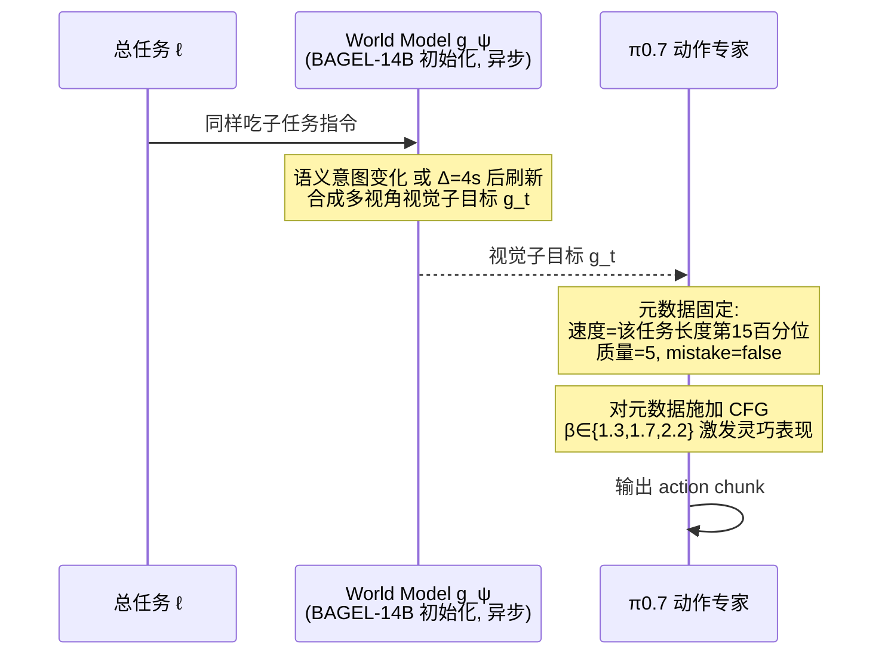
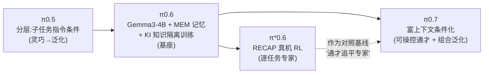

# π0.7 细粒度解读

> **arXiv**: [2604.15483](https://arxiv.org/abs/2604.15483) · Physical Intelligence · 2026.04 · **路线**:可操控通才 + 组合泛化(分层混合,承袭 π0.6)
> [← 返回主报告](../index.md)

---

## TL;DR

π0.7(《π0.7: a Steerable Generalist Robotic Foundation Model with Emergent Capabilities》)是 PI 在 [π0.6 / π*0.6](pi06.md) 之后的 π 主线最新一代。它不追求换骨干、不追求更大参数,而是把赌注押在**"可操控性(steerability)"与"组合泛化(compositional generalization)"**两件事上:

1. **架构上**只是温和升级 —— 约 **5B 参数**(4B Gemma3 VLM 主干含 ~400M 视觉编码器 + **860M flow-matching 动作专家**),相对 π0.6 的主要改动是加入 **MEM 风格的视频历史编码器** 与 **上下文中的视觉子目标图像**,仍沿用 [π0.6](pi06.md) 的 Knowledge Insulation(KI)训练配方。
2. **真正的创新在训练配方与提示框架** —— π0.7 **大量使用次优数据**(失败 episode、含错误的成功、旧版模型自主采集的 rollout),并用一套**四模态"富上下文条件化"**(子任务指令 + 多视角视觉子目标 + episode 策略元数据 + 控制模式)告诉模型"**怎么做(how)**"而不只是"做什么(what)"。dropout 训练让这些条件在推理时可自由组合,从而把已学技能"**重组(remix)**"成未见任务。
3. **最响亮的声明** —— 单个通才 π0.7 **开箱即用**,在叠衣 / 做意式浓缩 / 装纸箱等灵巧长程任务上**匹配、部分超过**经真机 RL 微调的专用 [π*0.6](pi06.md) 专家;并能**零样本跨本体迁移**到一台从没采过数据的双臂 UR5e 上叠衬衫,逼近熟练人类遥操作者首次上手该硬件的零样本水平。

一句话:**[π0.6](pi06.md) 让 VLA "从经验学习",π0.7 则让 VLA "可被操控、能组合"——用富上下文标注把脏数据(失败/次优/自主 rollout)变成"细粒度技能字典",再在推理时由语言/元数据/生成的视觉子目标重组激活,使一个通才模型不靠逐任务 RL 微调就追平专家。**

> ⚠️ **可信度提示**:本文所有量化数字、增益、消融与"匹配人类 / 追平专家"的对比**均为 Physical Intelligence 自评**,基于其自有 benchmark,**无标准化外部基准、无第三方独立复现**;模型发布极新(2026-04),社区尚未充分审视;训练数据与权重未开源。组合泛化被作者本人定位为 **"first signs of(初步迹象)"**,且作者自承"在如此大规模数据下**难以判定任务是否真正 seen/unseen**"。原文用 π₀.₇ 的下标记法。

---

## 1. 要解决的问题

[π*0.6](pi06.md) 已经证明"用真机 RL(RECAP)能把单个任务练到超越人类示教",但那套路径有个昂贵的代价:**每个任务都要单独做真机强化学习微调**,得到一个个专用的 π*0.6 specialist。这条路通向"一任务一专家",而不是"一个通才模型搞定一切"。π0.7 想回答的核心问题是:

1. **能否不做逐任务 RL,就让一个通才模型追平那些专用 RL 专家?** 如果答案是肯定的,RL 专家的"速度与鲁棒性"就能被一个通才直接吸收,免去逐任务真机微调的工程开销。
2. **如何让模型从大量"脏数据"中获益而不被污染?** PI 想大量使用失败 episode、含错误的成功、以及旧模型自己跑出来的次优 rollout。但**朴素训练会对数据集里冲突的策略模式"取平均",产出平庸结果**(原文核心论点)。需要一种机制,让模型既吸收次优数据的覆盖度,又不被其低质量拖累。
3. **如何让模型"组合"已学技能去做没见过的任务?** 类比 LLM 把训练语料里的概念以新方式组合,PI 希望机器人也能用新工具 / 新厨电 mix-and-match 出未见任务,而不是只能复述见过的轨迹。
4. **如何让一个模型"可被操控"?** 部署时希望能用语言"教练(coaching)"、用细粒度子任务、用目标图像去引导模型,在测试时高效适配新任务,而不是黑箱地只接受一句总指令。

π0.7 给出的统一答案是**"富上下文条件化(rich context conditioning)"**:用显式标注告诉模型"怎么做",让它学到的是可重组的细粒度技能,而非对冲突示范取平均的"平均策略"。元数据(metadata)正是消化脏数据的钥匙(见 §3、§4),可操控提示则是组合泛化与跨本体迁移的载体。

---

## 2. 方法与架构

π0.7 = **π0.6-MEM 架构基线** + **四模态富上下文条件化** + **混合质量数据训练** + **推理时的 mix-and-match 算法**。逐块拆解如下。

### 2.1 整体架构(相对 π0.6 的改动)

约 **5B 参数**的 VLA:**4B Gemma3 VLM 主干**(含 ~400M 视觉编码器)初始化,旁挂一个独立的 **860M flow-matching 动作专家**(transformer),用流匹配目标预测连续动作。

- **动作输出**:固定 **50 个动作 token = 50 步 action chunk**;flow-matching 的 timestep 经 **adaptive RMSNorm** 注入动作专家。
- **实时性**:采用 **real-time action chunking(RTC)**,训练时模拟 0–12 timestep 延迟,对应**最大推理延迟约 240ms**(社区报道最坏延迟约 127ms,口径不同,**待核**)。
- **相对 [π0.6](pi06.md) 的关键改动**(原文):"*The major architectural modifications of π0.7 ... include the use of the **history vision encoder from MEM** and **visual subgoal images in the context**.*"
- **输入**:至多 **4 路相机**(前视、两路腕部、可选后视,448×448),每路至多 **6 帧历史**;至多 **3 张子目标图像**;本体感觉状态经线性投影成 token 喂入主干。
- **注意力**:**block-causal masking** —— 观测 token 与子目标 token 各自块内双向注意;goal-image token 可额外注意观测 token。
- **训练配方**:沿用 [π0.6](pi06.md) 的 **Knowledge Insulation** —— VLM 主干用 FAST 离散动作 token 的交叉熵监督;动作专家虽 attend 主干全部激活,但**其梯度不回流进 VLM 主干**(stop-gradient),保护预训练知识不被连续控制信号污染。

### 2.2 可操控提示框架:富上下文 C_t 的四个模态

训练目标可写成在富化上下文 $C_t$ 条件下预测动作块:

$$\max_\theta\ \mathbb{E}_{\mathcal{D}}\big[\log \pi_\theta(\mathbf{a}_{t:t+H}\mid \mathbf{o}_{t-T:t},\,C_t)\big]$$

其中 $C_t$ 由四种模态组成,**训练时各自随机 dropout**,以保证推理时可灵活组合(缺哪个都能跑):

| 模态 | 内容 | 作用 | 训练 dropout |
|---|---|---|---|
| **(A) 子任务指令 ℓ̂_t** | 比总任务更细的语义目标(总任务 "clean the kitchen" → 子任务 "open the fridge door") | language coaching;推理时可由高层策略或人给出、可省略、可随时间变化 | 有子目标时,子任务 30% 被丢 |
| **(B) 视觉子目标 g_t** | 多视角子目标图像:base 视角最易指定环境/物体中心结果,腕部视角最易指定手臂/夹爪结果 | 强化空间 grounding;由 world model 推理时合成(见 §2.4) | 仅加到每 batch **25%** 样本 |
| **(C) episode 元数据(strategy metadata)** | 整体速度(500 步分桶离散化,如 1750–2250 → "2000 steps")、整体质量(1–5,5 最高)、mistake 标签(某动作段是否出错) | **消化脏数据的钥匙**:显式标注"这条轨迹有多好/多快/哪里错了",模型据此不对冲突模式取平均 | 整体 15% 丢、各分量额外 5% 丢 |
| **(D) 控制模式 c** | 文本标识 joint-level 或 end-effector 动作 | 跨本体/跨控制空间统一 | **从不 dropout** |

### 2.3 组合泛化机制:为什么能"重组"出未见任务

这是论文的核心论证(blog 与 paper 一致),也是最该审视的一环:

- **问题**:"*With a diversity of examples that differ in terms of both strategy and task performance, a **naïve training process would lead to a model that averages together different modes** in the dataset and produces suboptimal results.*"——同一任务的多种做法(快/慢、成功/失败)若不加区分地训练,会被平均成平庸策略。
- **解法**:detailed context annotations(尤其元数据与子目标)**显式编码"怎么做(how)"而非只是"做什么(what)"**。于是数据里的多种行为模式被**保留为可区分、可重组的细粒度技能/概念**,而不是被抹平。
- **推理时**:由 metadata + subgoal **选择/激活**想要的模式(见 §2.4),把已学技能重组成新任务。PI 明确类比 LLM"把训练数据里的概念以新方式组合"。

> ⚠️ 这条因果叙事是论文的**核心论证而非可直接量化的事实**。主要支撑是 Fig.18 的 metadata / diversity 消融(见 §3),外部媒体多原样转述、未独立检验竞争性解释(如"大规模检索+重组")。作者本人也只称这是组合泛化的 **"first signs of"**。

### 2.4 推理时如何 mix-and-match(Algorithm 1)

- **视觉子目标由独立的轻量 world model $g_\psi$ 异步生成**:从 **BAGEL(14B mixture-of-transformers)** 初始化,用 flow-matching 损失 + 高质量子任务标签数据训练;受益于网络规模视频/图像编辑预训练,**能为未见任务合成合理的"下一阶段目标画面"**——这是"视觉子目标可泛化到未见任务"的基础。训练采样:0.25 概率采 end-of-segment 图、0.75 概率从未来 0–4 秒均匀采未来帧。
- **元数据固定为"最优"**:速度取该任务 episode 长度第 15 百分位、质量恒为 5、mistake 恒 false ——等于告诉模型"请快、请好、别犯错"。
- **对元数据施加无分类器引导(CFG)**,$\beta\in\{1.3,1.7,2.2\}$,以激发灵巧任务的强表现。

> 关于"用富上下文消化脏数据 + 知识隔离训练"的更系统讨论,见 [具身数据处理](data-processing.md)(RECAP / 知识隔离 / 混合质量数据相关)。

---

## 3. 实验与关键结果

> ⚠️ 全部为 **Physical Intelligence 自评**,基于 PI 自有 benchmark(多为 Figure 6–18),**无外部标准基准、无第三方复现**。逐场景百分比多未在 HTML 正文给出,标"**待核**"。

### 3.1 ⚠️ 通才追平 RL 专家(开箱即用,vs π*0.6)

单个通才 π0.7 **不做逐任务微调**,与每任务真机 RL 微调的 [π*0.6](pi06.md) specialist 对比(归一化 throughput,专家 = 1.0,数值由 Figure 6 柱状图读取,**有读图误差**):

| 任务 | π0.7 success rate | 归一化 throughput(vs π*0.6 专家) |
|---|---|---|
| 叠衣(T恤/短裤) | ~100% | ~1.2× |
| 多样化叠衣(diverse laundry) | ~100% | ~1.6×(blog 另处给约 2.0×,**口径待核**) |
| 做意式浓缩(espresso) | 匹配专家 | ~1.2×(基本持平) |
| 装纸箱(box building) | ~100% | ~1.6–2.0× |

> 措辞收紧(以一手来源为准):arXiv 摘要就 espresso 仅称 **"matches(匹配)"** RL 微调模型;"even stronger / 部分超过"是博客的跨任务总结,**主要体现在多样叠衣与装纸箱的吞吐**,并非每个任务都超过。准确表述应为"**达到 success rate、匹配或部分超过 throughput**"。记忆任务(Fig.8):π0.7 不微调即达到或超过为该任务微调的 π0.6-MEM 专家(无具体百分比,**待核**)。

### 3.2 ⚠️ 零样本跨本体迁移(最强卖点)

把"在原机器人上采集训练数据"的**叠衬衫**任务**零样本迁移到一台从未采过数据的双臂 UR5e**:

| 主体 | task progress | success rate |
|---|---|---|
| **π0.7**(带视觉子目标 GC 配置) | **85.6%** | **80%** |
| 10 名熟练遥操作者(均值 375h 经验,经验前 2%,对其亦为零样本) | 90.9% | 80.6% |
| [π0.6](pi06.md) | 明显低于 π0.7 | — |

- **口径**:success rate 指完整完成的二元成败比例;task progress 指分阶段部分完成度(故 progress > success)。
- **"匹配人类遥操作"的精确含义**:指匹配专家在**该陌生新本体上的零样本**表现(而非其在熟练本体上的表现)。
- ⚠️ 两点保留:(a) 80% / 85.6% 是在**带视觉子目标(GC)引导**配置下取得,并非纯端到端零样本;(b) 计算这些百分比的 **trial 样本量在正文未披露**(置于附录 A-F / Fig.12),故 80% 与 80.6% 的"匹配"无法从公开正文做显著性核验。
- **涌现行为(定性)**:迁移到不同本体时 π0.7 会"发现"适配目标机器人的新策略,如改用单臂 pick-and-place、采用更适合目标机械臂布置的竖直抓取。

### 3.3 可操控性与指令跟随

- **指令跟随(Fig.9)**:14 个未见环境场景(跨 4 个未见厨房 + 2 个未见卧室)、每场景 3–6 条开放指令,π0.7 "全面显著优于 π0.5 / π0.6",达"高绝对成功率"(逐场景百分比**待核**)。
- **复杂指代指令(Fig.10)**:如"拿最大的碗""拿我喝汤会用的物体",π0.7 显著更好,加视觉子目标(GC)进一步提升。
- **打破数据集偏置(Fig.11)**:Reverse Bussing、冰箱→微波炉反向流程等反直觉任务,π0.7 显著改善,且 π0.7(GC)的子目标对成功"**critical**"。

### 3.4 ⚠️ 组合泛化与 language coaching(多为定性)

- **未见长程任务靠 coaching(Fig.15–16)**:典型案例 **air fryer 装/卸红薯** —— 纯零样本提示成功率约 **5%**(CTOL 报道),加入逐步**语言 coaching** 后升至约 **95%**;把 coaching 数据训成高层策略后,π0.7(autonomous, Fig.16)可逼近现场人类 coaching 表现而**无需额外遥操作数据**。
- **未见短程任务(Fig.17)**:法压壶压杆、舀米入电饭煲、擦物、旋转齿轮/台扇等可开箱完成,用语言或生成的视觉目标表现"大致同样强"。
- **作者坦诚**:直接命令未见长程任务(如 "cook a sweet potato")**开箱即用会失败,必须 coaching 或详细语言指令**——媒体"机器人 ChatGPT/GPT-3 时刻"的叙事被一手细节明显回调。

### 3.5 关键消融(支撑组合泛化的主证据,Fig.18 / Fig.7)

- **Fig.18 Left(metadata × 混合质量数据)**:不带 metadata 时,随低质量数据增多性能**下降**;带 metadata 时即便数据集增大、平均质量下降仍**持续提升**——即 metadata 让模型"吸收"次优数据而不被污染。
- **Fig.18 Right(多样性 vs 数量)**:去掉**最具多样性的 20%** 数据 → 未见短程任务性能**大幅下降**;去掉**随机 20%** → 几乎无下降。说明是**多样性(而非单纯数据量)**转化为泛化。
- **Fig.7(元数据 / eval 数据消融)**:去掉 episode metadata 或去掉 eval data 的变体在所有任务上被完整版 outperform,throughput 差距最明显。

---

## 4. 在 VLA 谱系中的位置:π0.5 → π0.6 → π*0.6 → π0.7

- **承 [π0.5](pi05.md)(分层 / 子任务指令)**:π0.5 引入 subtask instruction 条件化(高层子任务 + 底层动作);π0.7 把它扩展成更丰富的"子任务指令 + 视觉子目标"可操控提示。
- **承 [π0.6 / π*0.6](pi06.md)(架构基线 + KI + RL 对照)**:π0.7 直接建在 **π0.6-MEM 架构**上,沿用 **Knowledge Insulation** 训练配方;并把 **π*0.6(RECAP 真机 RL 专家)作为对照基线**,主张"用富上下文条件化的单一通才"追平/超越这些专用 RL 专家——这是 π0.7 最重要的范式声明。
- **承 [π0](pi0.md)(流匹配动作专家)**:底层仍是 π0 的 flow-matching action expert(860M),只是接入了 MEM 视频历史与视觉子目标。
- **路线分叉**:π*0.6 走"**一任务一 RL 专家**",π0.7 走"**一个可操控通才 + 富上下文重组**";后者用训练配方(混合质量数据 + 元数据消化脏数据)替代逐任务真机 RL,降低工程成本。
- **更宏观**:在"基座 VLA + 真机 RL"(π*0.6)与"基座 VLA + 富上下文条件化通才"(π0.7)之间,PI 同时押注两条提升路径;关于数据侧的混合质量数据 / 知识隔离配方,参见 [具身数据处理](data-processing.md)。

---

## 5. 局限与存疑

1. **全为实验室自评、无外部基准**:所有 success rate、throughput、迭代/消融曲线、"匹配人类 / 追平专家"对比均由 PI 自行完成,仅与自家 π0.5 / π0.6 / π*0.6 对比,**无标准化外部 benchmark、无第三方独立复现**。模型 2026-04 才发布,社区尚未充分审视。
2. **组合泛化 vs 检索重组难以区分**:作者自承"在如此大规模数据下**实际上难以判定任务是否真正 seen/unseen**",并把组合泛化定位为 **"first signs of(初步迹象)"**。CTOL 等评论强调:无法排除"大规模检索 + 重组"这一竞争性解释。
3. **"开箱即用"的边界被回调**:头条级的 air fryer 演示纯零样本约 **5%**,需逐步 coaching 才升至约 **95%**;直接命令未见长程任务会失败。一手论文的谨慎措辞(强调 coaching 必要性)与媒体"机器人 GPT-3 时刻"叙事存在明显落差。
4. **未见任务成功率仍偏低**:未见任务 / 未见本体成功率约 **60–80%**,显著低于已见任务(>90%),对生产级自主性偏薄。
5. **数字口径与样本量不透明**:跨本体迁移的 80% / 80.6% 等百分比的 **trial 样本量未在正文披露**;归一化 throughput 由柱状图读取、存读图误差;blog 与 paper 在 diverse laundry throughput(1.6× vs 2.0×)上口径不一,**待核**。
6. **经济性与部署门槛**:视觉子目标生成需多张 H100、每张约 1.25s 级延迟(world model 由 14B BAGEL 初始化);最坏推理延迟达百毫秒级。更偏实验室/高价值流程,非边缘部署。
7. **数据与权重闭源**:训练数据、world model、模型权重均未公开,外界难以复现或二次研究。
8. **依赖人在环 coaching**:最强的未见长程任务能力依赖语言 coaching 或把 coaching 数据再训进高层策略,"开箱组合泛化"并非完全自主。

---

## 来源

- 论文:π0.7: a Steerable Generalist Robotic Foundation Model with Emergent Capabilities. arXiv:2604.15483 (Physical Intelligence, 2026-04 提交,v2 2026-04-24)。<https://arxiv.org/abs/2604.15483> · HTML 全文 <https://arxiv.org/html/2604.15483v1>
- 官方博客:<https://www.pi.website/blog/pi07>
- 官方白皮书 PDF:<https://www.pi.website/download/pi07.pdf>
- 第三方报道(含 caveat):CTOL pi07 review <https://www.ctol.digital/news/physical-intelligence-pi07-review-11b-robotics-ai-model-investors/> · the-decoder "flaws included" <https://the-decoder.com/physical-intelligence-shows-robot-model-with-llm-like-generalization-flaws-included/> · Humanoids Daily <https://www.humanoidsdaily.com/news/physical-intelligence-unveils-0-7-the-rise-of-compositional-generalization-in-robotics> · TechCrunch(2026-04-16)<https://techcrunch.com/2026/04/16/physical-intelligence-a-hot-robotics-startup-says-its-new-robot-brain-can-figure-out-tasks-it-was-never-taught/>

> 说明:第 3 节全部量化数字、消融与对比均为 **Physical Intelligence 自评**,基于自有 benchmark,无外部基准、无第三方复现;组合泛化为作者自定位的"初步迹象";引用时请注明其自评属性与上述口径保留。
