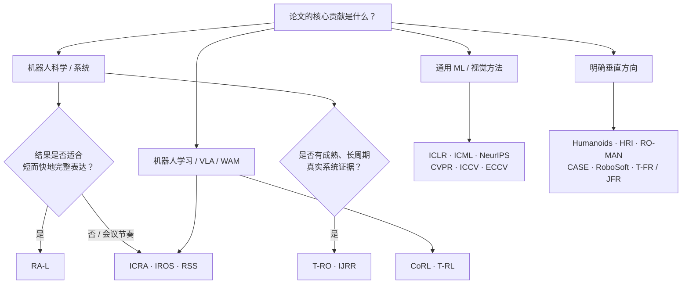

# 机器人学投稿会议与期刊指南

> [← 返回主报告](../index.md)

> **定位**:这是一张“研究贡献 → 投稿 venue”的导航图,不是按影响因子、录用率或民间榜单排出的名次表。机器人论文跨机械、控制、感知、学习、交互与系统部署,**最重要的是论文的核心贡献与 venue scope 对齐**。
>
> **覆盖**:国际英文、正式同行评审、机器人与具身智能作者常用的主要会议和期刊;工作坊、竞赛、国内中文期刊与极细分应用刊只作必要补充,不追求穷举。
>
> **更新时间**:2026-07-28。会议截止日期、页数、匿名和双投政策每届都可能变化;本页只把已公布的当前节点写成日期,投稿前必须再点开当届 CFP / Author Instructions 核对。

---

## 一、先选“贡献社区”,再选 venue

同一套机器人实验可以讲成不同论文,但**不能只靠换叙事跨社区硬投**。先问“评审为什么必须来自这个社区”:

| 论文真正新增了什么 | 优先看的 venue | 评审通常最关心 |
|---|---|---|
| 通用机器人算法 / 完整系统 | ICRA / IROS / RSS / RA-L / T-RO / IJRR | 机器人问题是否真实、系统闭环是否完整、对强基线是否有稳定增益 |
| 机器人学习 / VLA / 策略泛化 | CoRL / T-RL;兼看 ICRA / RSS / RA-L | 是否解决机器人特有约束,真机或可信 sim-to-real 证据是否充分 |
| 通用 ML / RL / 表征学习方法 | ICLR / ICML / NeurIPS | 方法是否对机器学习社区本身有新意,而不只是“在机器人数据上用了现成模型” |
| 视觉感知 / 3D / 生成视频 | CVPR / ICCV / ECCV;兼看机器人主会 | 视觉方法创新与跨数据集证据;机器人只是应用时往往不够 |
| 人形全身运动 / 操作 | Humanoids;兼看 ICRA / IROS / RSS / T-RO | 动力学、全身控制、接触、安全与真机执行 |
| 人机交互 / 社会机器人 | HRI / RO-MAN;兼看 ACM THRI / IJRR | 用户研究设计、伦理审批、统计效力、交互机制与可复现性 |
| 工业自动化 / 制造系统 | CASE / T-ASE / RA-P | 系统吞吐、可靠性、部署约束与真实生产价值 |
| 野外、农业、矿山、海洋、空间 | T-FR / JFR;兼看 ICRA / IROS | 非结构化环境中的长时运行、故障、环境覆盖与现场证据 |
| 软体机器人 / 新结构与材料 | RoboSoft / T-SRO / Science Robotics | 结构—材料—控制耦合、物理机制与硬件验证 |

*这张图是选刊起点,不是排他规则。最终以当届 CFP、已发表论文和你希望对话的研究社区为准。*

---

## 二、机器人学核心综合会议

| 会议 | 最适合的工作 | VLA / WAM 适配 | 投稿提醒 | 官方入口 |
|---|---|---|---|---|
| **ICRA** · IEEE International Conference on Robotics and Automation | 覆盖感知、规划、控制、学习、机构与系统的综合机器人工作 | **高**:操作、导航、人形、具身模型与数据/基准均可,但需把机器人贡献讲实 | IEEE RAS 旗舰会;当届格式与视频窗口必须单独核对 | [ICRA 2027 CFP](https://2027.ieee-icra.org/contribute/call-for-icra-2027-papers-now-accepting-submissions/) |
| **IROS** · IEEE/RSJ International Conference on Intelligent Robots and Systems | 智能机器人系统、算法与应用,范围同样很广 | **高**:适合算法 + 系统验证、操作/导航/多机器人/人形 | 与 ICRA 时间错开,但不要把“时间重叠”误当成允许双投 | [IEEE RAS · IROS](https://www.ieee-ras.org/conferences-workshops/financially-co-sponsored/iros/) |
| **RSS** · Robotics: Science and Systems | 强科学问题、紧凑而完整的系统贡献,单轨社区 | **高**:适合论点集中、证据扎实的机器人学习与系统论文 | 2026 年恢复 8 页上限、双匿名;不接收与其他 archival venue 并行的相同/近似论文 | [RSS CFP](https://roboticsconference.org/information/cfp/) |

IEEE RAS 官方把 **ICRA、CASE、IROS**列为三大 RAS 会议;其中 ICRA / IROS 是机器人作者最通用的两个大入口,RSS 则是跨机器人科学与系统的单轨会议。三者都不是“只要有机器人实验就合适”:问题定义、系统边界、基线和失败分析仍要形成闭环。

### 当前可执行节点

- **ICRA 2027**:论文截止 **2026-09-15 11:59 PST**,录用通知 **2027-01-31**;当届完整稿上限 8 页、双匿名,并明确接受未同时投往其他会议/期刊的 arXiv 预印本。以 [ICRA 2027 CFP](https://2027.ieee-icra.org/contribute/call-for-icra-2027-papers-now-accepting-submissions/) 为准。
- **IROS / RSS 下一届**:截至本页更新日,不要从往年日期外推成正式 deadline;从上表系列官网进入当届页面。

---

## 三、机器人学习与具身智能

### 3.1 机器人学习主场

| 会议 / 期刊 | Scope 关键点 | 什么情况下最匹配 | 边界 |
|---|---|---|---|
| **CoRL** · Conference on Robot Learning | 机器人 × 机器学习,单轨;覆盖模仿学习、RL、基础模型、世界模型、数据与基准 | 学习方法围绕机器人问题展开,并有真机或可信的 sim-to-real 证据 | 官方明确:没有机器人核心的投稿会直接退稿;2026 稿件还必须含 Limitations 小节 |
| **IEEE T-RL** · Transactions on Robot Learning | 面向机器人物理约束的 AI / 学习方法,从感知到控制 | 方法需要更完整推导、更多实验或长篇 journal 叙述;VLA、跨本体、数据、鲁棒与安全都对口 | **2026-03-30 新创刊**,scope 很贴近但发表历史与社区惯例仍在形成,不要直接套用成熟期刊经验 |

CoRL 的 [2026 CFP](https://www.corl.org/contributions/call-for-papers) 明确收录机器人基础模型、视频/潜世界模型、数据生成、基准、模仿学习、RL、规划与安全,同时要求投稿聚焦机器人核心问题。T-RL 的 [Purpose and Mission](https://www.ieee-ras.org/publications/t-rl/)则把“物理系统中的数据稀缺、泛化、学习速度、鲁棒、安全与可靠性”写进期刊范围,是 VLA / WAM 值得持续观察的新入口。

### 3.2 机器学习 / 视觉大会:只有“机器人应用”还不够

| Venue | 适合怎样的具身论文 | 常见错位 |
|---|---|---|
| **ICLR / ICML / NeurIPS** | 新的学习目标、架构、优化、RL、泛化理论、数据/评测方法对广泛 ML 问题也成立 | 只把现成 VLM / diffusion / RL 配方搬到一个机器人任务 |
| **CVPR / ICCV / ECCV** | 3D 感知、视频世界模型、神经渲染、生成式仿真、视觉表征本身有明确创新 | 视觉模块无创新,主要贡献其实是机器人控制或系统集成 |
| **AAAI / IJCAI** | 规划、推理、知识、智能体与多智能体方法具有通用 AI 意义 | 只报告工程系统性能,没有可迁移的 AI 方法或分析 |

[ICLR 2026 CFP](https://iclr.cc/Conferences/2026/CallForPapers)明确把 robotics 列为 ML 应用领域;[ICML 2026 CFP](https://icml.cc/Conferences/2026/CallForPapers)也把 robotics 放在 RL 的 decision / control / planning 范围内。**这表示“允许投”,不表示“机器人实验自动构成 ML 贡献”**。准备这类投稿时,摘要第一段应能在暂时删掉机器人平台名后,仍清楚说明方法对 ML / CV 社区的新知识是什么。

---

## 四、方向型机器人会议

| 会议 | 主要社区 | 适合的稿件 | 官方入口 |
|---|---|---|---|
| **Humanoids** | 人形机器人 | 人形机构、感知、全身控制、学习、HRI、生物力学与认知 | [IEEE RAS · Humanoids](https://www.ieee-ras.org/conferences-workshops/fully-sponsored/) |
| **HRI** · ACM/IEEE HRI | 人机交互、社会机器人、心理/认知/HCI | 用户研究、协作、信任、社会行为、交互设计;涉及人类参与者时要严守伦理审批与报告规范 | [HRI Conference](https://humanrobotinteraction.org/) |
| **RO-MAN** | Robot and Human Interactive Communication | 人机团队、辅助机器人、社会交互、情感与认知 | [RO-MAN 2026 CFP](https://ro-man2026.org/call-for-papers/) |
| **CASE** | 自动化科学与工程 | 制造、物流、自动化系统、生产调度、工业机器人与数字化流程 | [IEEE RAS · CASE](https://www.ieee-ras.org/conferences-workshops/) |
| **RoboSoft** | 软体机器人 | 软材料、柔性机构、可变形感知/驱动、建模与控制 | [RoboSoft 系列](https://softroboticsconference.org/) |
| **WAFR** · Workshop on the Algorithmic Foundations of Robotics | 机器人算法基础 | 运动/任务规划、几何、优化、控制与算法理论;虽名为 Workshop,通常有正式论文集,不能默认当作非 archival workshop | [WAFR](https://wafr.org/) |

方向型会议不是“综合主会的降级替代”。当论文的术语、实验设计与读者都高度集中在某个子领域时,更聚焦的社区常能给出更专业的评审和更有效的交流。

---

## 五、机器人学主要期刊

### 5.1 通用、学习与长篇研究

| 期刊 | 适合什么 | 形态 / 关键差异 | 官方入口 |
|---|---|---|---|
| **IEEE RA-L** · Robotics and Automation Letters | 及时、紧凑的机器人新结果与应用案例 | 全年投稿;常规 6 页、最多加 2 页;可在规定窗口选择一次 RAS 会议展示,但**不是“同一稿同时投期刊和会议”** | [RA-L Author Information](https://www.ieee-ras.org/publications/ra-l/ra-l-information-for-authors/) |
| **IEEE T-RO** · Transactions on Robotics | 成熟、深入、理论与实验闭环完整的机器人研究 | 适合比会议 / Letter 更完整的推导、实验、分析与系统论证;2025 起采用双匿名 | [T-RO Author Information](https://www.ieee-ras.org/publications/t-ro/t-ro-information-for-authors/) |
| **IEEE T-RL** · Transactions on Robot Learning | 机器人学习、基础模型、跨本体、数据、鲁棒、安全与可解释 | 2026 新刊;期待真实硬件实验或足以补充仿真的物理证据 | [T-RL](https://www.ieee-ras.org/publications/t-rl/) |
| **IJRR** · International Journal of Robotics Research | 从应用数学、AI、计算机到机械/电气的高质量综合机器人研究 | 适合长篇、系统性和方法论成熟的工作;接受 preprint | [IJRR Journal / Guidelines](https://journals.sagepub.com/author-instructions/IJR) |
| **Science Robotics** | 对机器人科学或“以机器人推动科学”有广泛影响的工作 | 强调科学重要性、跨学科意义、硬件/系统能力与令人信服的验证,不是常规增量结果的默认入口 | [Science Robotics](https://www.science.org/journal/scirobotics) |
| **Autonomous Robots** | 自主系统的感知、规划、学习、控制与多机器人 | 适合以自主性为主线、完整验证的算法与系统论文 | [Springer · Autonomous Robots](https://link.springer.com/journal/10514) |
| **Robotica** | 理论与真实应用并重的广义机器人 / 自动化 | 覆盖动力学、运动学、规划、感知、软件、遥操作、康复与 AI 等 | [Robotica · About](https://www.cambridge.org/core/journals/robotica/information/about-this-journal) |

### 5.2 现场部署、自动化与工程实践

| 期刊 | 最适合的证据 | 与通用期刊的区别 | 官方入口 |
|---|---|---|---|
| **IEEE T-FR** · Transactions on Field Robotics | 野外、农业、林业、矿山、海洋、空间等非结构化环境中的现场实验 | 重点是长期、复杂环境和真实运行;由 Field Robotics 于 2024 年中转为 IEEE T-FR | [T-FR](https://www.ieee-ras.org/publications/t-fr/) |
| **JFR** · Journal of Field Robotics | 非结构化动态环境中的理论 + 实践,含农业、施工、搜救、核电、海洋、空间等 | 论文应同时具有实践与理论意义;可投 regular、research note、survey、field report | [JFR](https://onlinelibrary.wiley.com/journal/15564967) |
| **IEEE T-ASE** · Transactions on Automation Science and Engineering | 制造、物流、流程、调度、人机协作与自动化系统 | 核心问题是 automation science / engineering,并非所有机器人学习论文都对口 | [T-ASE](https://www.ieee-ras.org/publications/t-ase/) |
| **IEEE RA-P** · Robotics and Automation Practice | 已部署、可复核的算法、代码、数据集、设计与系统集成经验 | 面向 practitioner;强调真实世界可验证改进与工程细节,4+1+1 页短文形态 | [RA-P](https://www.ieee-ras.org/publications/ra-p/) |

### 5.3 交互、触觉、软体与医疗机器人

| 期刊 | 最适合的工作 | 关键边界 | 官方入口 |
|---|---|---|---|
| **ACM THRI** · Transactions on Human-Robot Interaction | 人机协作、社会机器人、信任、交互设计与用户研究 | 交互研究与人类证据是主线,不是只给机器人加一个语言界面 | [HRI Community · Journal](https://humanrobotinteraction.org/journal-introduction/) |
| **IEEE ToH** · Transactions on Haptics | 触觉感知、反馈、遥操作、haptic device、人与机器通过触觉交互 | 需要触觉科学/技术贡献,普通力控或夹爪论文未必对口 | [ToH](https://www.ieee-ras.org/publications/toh/) |
| **IEEE T-SRO** · Transactions on Soft Robotics | 软体机器人方法、材料、机构、感知、驱动、建模与控制 | 所有关键词都必须落到 soft robotics;研究论文为长篇形态,也设 review / tutorial / perspective | [T-SRO Author Information](https://www.ieee-ras.org/publications/t-sro/t-sro-information-for-authors/) |
| **IEEE T-MRB** · Transactions on Medical Robotics and Bionics | 手术、康复、辅助机器人、仿生假肢与人体接口 | 需要支持疾病预防、诊断、治疗或临床/医疗价值;人体/动物研究要核对伦理要求 | [T-MRB](https://www.ieee-ras.org/publications/t-mrb/) |

> **新刊提醒**:T-RL、T-FR、RA-P 都是近年新增或转制的 RAS 出版物,scope 对具身 / 现场 / 工程实践很有价值,但索引、审稿习惯、读者心智与历史声誉会继续变化。选刊时应看**最新已发表文章与编辑团队**,不要只看名称。

---

## 六、VLA / WAM 稿件怎么映射

| 你的论文主张 | 第一轮候选 | 投稿前必须补强 |
|---|---|---|
| 新 VLA 架构 / 动作表示 / 策略学习 | CoRL、T-RL、ICRA、RSS、RA-L | 跨任务/跨本体强基线、真机闭环、推理延迟、失败模式 |
| 通用学习机制,机器人只是关键验证域 | ICLR、ICML、NeurIPS | 非单一机器人设定的普适论点、充分消融、统计稳健性 |
| 视频世界模型 / 生成式仿真器 | CoRL、T-RL、CVPR/ICCV/ECCV、ICRA | 不只报告视觉质量;还要证明对规划、控制、数据生成或策略选择的真实价值 |
| 大规模机器人数据集 / 基准 | CoRL、T-RL、NeurIPS 数据/评测类轨道、IJRR | 数据许可、去重与泄漏、任务覆盖、标注质量、可下载性、基线与长期维护 |
| 人形 VLA / 全身移动操作 | Humanoids、ICRA、IROS、RSS、T-RO | 动力学与接触约束、安全、控制频率、跌倒/失稳分析、真机视频 |
| HRI / 语言交互 / 人机协作策略 | HRI、RO-MAN、CoRL、ToH | 人类参与者伦理审批、研究设计、统计效力与实际交互而非离线问答 |
| 工业或野外具身系统 | CASE、T-ASE、RA-P、T-FR、JFR | 运行时长、故障/恢复、环境覆盖、维护成本与部署约束 |

一个实用判断:**如果把机器人实验删掉,方法贡献仍然完整,优先考虑 ML / CV venue;如果删掉机器人闭环后论文就失去核心问题,优先考虑机器人 / robot learning venue。**

---

## 七、会议、RA-L 与长篇期刊怎么选

| 选择 | 适用状态 | 不适用信号 |
|---|---|---|
| **会议直投** | 结果刚好在当届 deadline 前完整;希望进入当届社区讨论;后续还计划做显著扩展 | 为赶日期牺牲关键真机实验或安全检查 |
| **RA-L** | 稿件短而完整、希望全年滚动投稿并尽快 journal 化;可能需要 RAS 会议展示 | 核心论证无法在 Letter 篇幅内自洽,或需要大量长周期实验 |
| **T-RO / IJRR / T-RL 等长篇期刊** | 方法已成熟,需要更多理论、系统细节、实验和误差分析 | 只有单一增量与少量实验,正文主要靠附录补救 |
| **非 archival workshop** | 早期想法、负结果、社区讨论、寻找合作者 | 把 workshop 接收误写成正式主会论文;或没核对该 workshop 是否实际有 archival proceedings / DOI |

RA-L 官网给出的区分很直接:RA-L 面向“快速、紧凑”的 journal 结果,T-RO / T-ASE 面向更成熟深入的工作;RA-L 录用后可在规定窗口转去一次 RAS 会议**展示**,并没有 conference-specific 的 RA-L 投稿 deadline。具体资格与 270 天转会窗口见 [RA-L 官方说明](https://www.ieee-ras.org/publications/ieee-robotics-and-automation-letters/)。

---

## 八、最容易踩的投稿政策坑

1. **并行双投。** RSS 与 CoRL 都明确禁止把相同或实质近似的稿件同时投给另一个 archival venue;期刊通常也有相同原则。时间线重叠不等于允许双投。
2. **把 arXiv 当成双投,或反过来。** ICRA、RSS、CoRL 通常允许技术报告 / arXiv 预印本,但匿名细节和其他 venue 的规则仍需分别检查。
3. **把所有 workshop 都当成非 archival。** 有的只收摘要、不进正式论文集;有的有 DOI 或正式 proceedings。后者可能影响后续主会投稿,WAFR 就不能只因名字里有 Workshop 而默认“非归档”。
4. **会议论文直接加长后投期刊。** “多两页、再加一个实验”不自动构成实质扩展。逐项查看目标期刊的 overlap / prior publication 规则,并在投稿信里透明说明会议版与新增贡献。
5. **匿名稿暴露身份。** 作者名只是第一层;项目页、仓库、视频水印、致谢、数据路径与自引措辞都可能破坏双匿名。
6. **机器人视频只有宣传、没有证据。** 视频应对应正文主张:完整成功/失败轨迹、实时速度、接触行为、恢复过程和非精选样例,而不只是剪辑 montage。
7. **忽略人类/动物实验审批。** HRI、医疗、康复、可穿戴与用户研究通常需要伦理审查或合规说明;不要等投稿前才补。
8. **只看“级别”,不看最近论文。** 最有效的 scope 检查是连续阅读目标 venue 最近 1–2 届/卷与你最接近的论文,观察它们如何定义问题、设置实验与写局限。

[RSS 2026 CFP](https://roboticsconference.org/information/cfp/)和 [CoRL 2026 Author Instructions](https://www.corl.org/contributions/instruction-for-authors)都公开写明了双投与匿名规则;ICRA 2027 还单列了 arXiv、非归档 workshop、IROS→ICRA transfer 和生成式 AI 披露政策。最终判断以**你投稿那一届 / 那一天的官方规则**为准。

---

## 九、投稿前一页检查表

### Scope

- [ ] 用一句话写出“为什么这篇必须由机器人 / ML / 视觉 / HRI 社区评审”
- [ ] 阅读目标 venue 最近 10–20 篇最相邻工作,而不是只看会议名
- [ ] 关键词、摘要首段和实验主线都对齐同一核心贡献

### Evidence

- [ ] 机器人任务、数据划分、控制频率、动作空间、硬件和成功判据可复核
- [ ] 对比包含当前强基线,训练预算和传感器/相机条件尽量公平
- [ ] 报告均值之外的方差、试验次数、失败类型和负结果
- [ ] 仿真论文解释 transfer 假设;真机论文保留未剪辑或代表性失败视频
- [ ] 数据 / benchmark 论文给出许可、下载、版本、泄漏与维护计划

### Policy

- [ ] 在 deadline 前重新核对页数、时区、匿名、补充材料与视频窗口
- [ ] 所有作者、OpenReview / PaperCept 账号与利益冲突信息已准备
- [ ] 没有与其他 archival venue 并行的相同或实质近似投稿
- [ ] 核对 arXiv、项目页、生成式 AI 披露和伦理审批要求
- [ ] 预留上传与 PDF compliance 时间,不要把 23:59 当成开始提交的时间

---

## 十、官方入口与维护说明

本页优先采用会议、学会与出版社一手页面:

- 会议总入口:[IEEE RAS Conferences & Workshops](https://www.ieee-ras.org/conferences-workshops/) · [RSS CFP](https://roboticsconference.org/information/cfp/) · [CoRL CFP](https://www.corl.org/contributions/call-for-papers)
- RAS 期刊:[RAS Publications](https://www.ieee-ras.org/publications-2/) · [RA-L](https://www.ieee-ras.org/publications/ra-l/) · [T-RO](https://www.ieee-ras.org/publications/t-ro/) · [T-RL](https://www.ieee-ras.org/publications/t-rl/) · [T-FR](https://www.ieee-ras.org/publications/t-fr/) · [RA-P](https://www.ieee-ras.org/publications/ra-p/) · [ToH](https://www.ieee-ras.org/publications/toh/) · [T-SRO](https://www.ieee-ras.org/publications/t-sro/t-sro-information-for-authors/) · [T-MRB](https://www.ieee-ras.org/publications/t-mrb/)
- 其他期刊:[IJRR](https://journals.sagepub.com/home/IJR) · [Science Robotics](https://www.science.org/journal/scirobotics) · [JFR](https://onlinelibrary.wiley.com/journal/15564967) · [Robotica](https://www.cambridge.org/core/journals/robotica)

**维护规则**:只在官方 CFP 已发布时更新精确日期;过期日期移入历史说明或删除,不把“往年通常月份”写成当前 deadline。若发现链接换届失效,优先回到学会的系列总入口,不要依赖第三方 deadline 聚合站。

---

## 关联阅读

- [具身模型训练全流程](training-pipeline.md) — 把方法稿中的训练阶段与证据链补完整
- [数据集与基准全景](benchmarks.md) — 统一评测口径、强基线与数字可信度
- [实验机器人本体](robots.md) — 补齐硬件、动作空间与跨本体背景
- [共性失败模式](failure-modes.md) — 为 Limitations / Failure Analysis 准备结构化证据
- [外部资源导航](resources.md) — 继续追踪论文、基准、代码与研究社区
