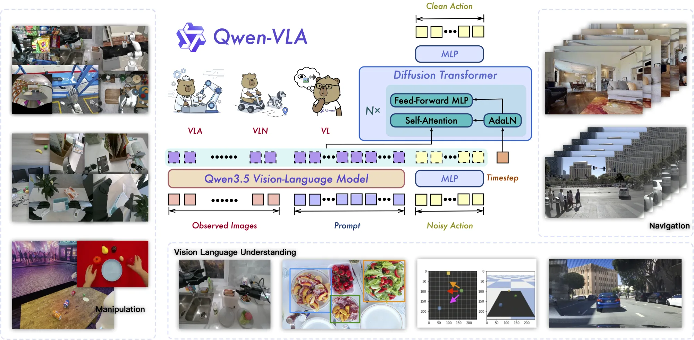

# Qwen-VLA:在一个模型里统一操作、导航与轨迹预测的视觉-语言-动作基座

> **Qwen-VLA: Unifying Vision-Language-Action Modeling across Tasks, Environments, and Robot Embodiments**
> 阿里巴巴 Qwen 团队(作者含 Qwen 负责人 Junyang Lin,以及 Dayiheng Liu、Shuai Bai、Jingren Zhou 等),2026.05 · arXiv:[2605.30280](https://arxiv.org/abs/2605.30280)
> 路线:**统一 VLA 基座** · **Qwen3.5-4B VL 主干 + 1.15B DiT 流匹配(flow-matching)动作解码器** · **操作 / 导航 / 轨迹预测合进一个"动作-轨迹预测"框架** · **embodiment-aware 提示条件**实现跨本体

[← 返回主报告](../index.md)

---

> ⚠️ **强可信度提示(请先读)**:arXiv ID **2605** 对应 **2026 年 5 月**,本论文极新(提交日 2026-05-28),社区尚未充分审视、亦无独立第三方复现。下文的全部基准数字与对比均为 **Qwen 团队自报**;参数拆分(Qwen3.5-4B 主干 + 1.15B DiT 解码器)等细节来自论文摘要、HuggingFace papers 页与官方 GitHub `QwenLM/Qwen-VLA` 的 README/架构图。截至撰写时,技术报告全文(arXiv HTML)尚未放出,部分内部机制只能依据摘要与 README 推断,本文已对此类处标注"细节未公开"。

---

## TL;DR

Qwen-VLA 是阿里 Qwen 团队推出的**统一具身基座模型**。它的核心主张只有一句:**把"操作(manipulation)、导航(navigation)、轨迹预测(trajectory prediction)"这些过去各自为政的具身决策问题,塞进同一个 VLA 模型里**,用一套权重同时干完——而不是为每个任务、每种环境、每类机器人本体各训一个专用模型。

实现这一点的两块拼图:

1. **架构上**:在 **Qwen3.5-4B 视觉-语言主干**之上,接一个 **1.15B 的 DiT(Diffusion Transformer)流匹配动作解码器**,把 Qwen 原有的"感知—理解—推理"能力延伸到**连续动作与轨迹的生成**。VL 主干负责看图、读指令、做空间推理;DiT 解码器以噪声动作为输入、迭代去噪出干净的连续动作块/轨迹。
2. **接口上**:用 **embodiment-aware prompt conditioning(本体感知的提示条件)**——把"当前是哪种机器人、用什么控制约定"写进文本 prompt 里,从而**一套权重服务多平台,换本体只需换 prompt**,不需要为每个机器人配独立的输出头(output head)。

标志性结论(均为作者自报):一个**统一的通才(generalist)** Qwen-VLA,在多个仿真与真机基准上**追平甚至超过**了"为每个基准单独微调的专用模型(specialist)"——作者用这句话把具身智能的叙事从"技能专家"推向"通才执行者(generalist actor)"。代表数字:**LIBERO 97.9%**、**Simpler-WidowX 73.7%**、**RoboTwin-Easy/Hard 86.1%/87.2%**、**R2R 69.0% OSR**、**RxR 59.6% SR**、真机 **ALOHA OOD 平均 76.9%**、**DOMINO 动态操作零样本 26.6%**。

---

## 1. 要解决的问题

具身智能长期被"按任务切片"地研究:操作一个模型、导航一个模型、轨迹预测又一个模型。结果是**能力碎片化**,且**跨任务、跨环境、跨机器人本体的泛化很差**——一个在某机械臂上训得很好的操作策略,换个本体、换个场景就垮。

Qwen-VLA 想回答一个直接的问题:**这些异构的具身决策问题,能不能被统一进单一一个视觉-语言-动作模型里?** 具体拆成三层:

1. **跨任务统一**:操作(抓放、整理)、导航(在房间里走到目标)、轨迹预测(预测一段未来运动)本质是不同的输出形态(关节动作 vs. 路径 vs. 轨迹)。能否用**一个共享的"动作-轨迹预测"框架**把它们都表达出来,让一个模型同时学会?
2. **跨本体统一**:不同机器人自由度、相机配置、控制约定都不同。能否**不为每个平台配专用输出头**,而用一种轻量方式(文本 prompt)告诉模型"现在是谁、怎么控"?
3. **跨环境泛化(OOD)**:真实部署会遇到没见过的场景布局、背景、光照、物体摆放乃至机器人本体变化。统一大规模预训练能否带来对这些**分布外(out-of-distribution)**变化的鲁棒泛化?

Qwen-VLA 的定位,是把 **Qwen 的 VL 建模栈**(感知、理解、推理)作为底座,**向下延伸到连续动作与轨迹的生成**,从而做成一个**统一的具身基座**。

---

## 2. 方法与架构

Qwen-VLA 的结构可以一句话概括:**Qwen3.5-4B VL 主干 + DiT 流匹配动作解码器,外加 embodiment-aware 文本提示,把多任务多本体的数据灌进同一套权重**。下面分三小节:2.1 整体双流架构,2.2 统一的"动作-轨迹预测"框架与本体感知提示,2.3 渐进式训练配方与数据混合。

> **图注(据官方 GitHub `QwenLM/Qwen-VLA` 架构图 `qwenvla_overview.png` 转述)**:图中央是 **Qwen3.5 Vision-Language Model** 主干,左侧输入为 **Observed Images(观测图像)+ Prompt(文本提示)**,右上方是 **Diffusion Transformer(DiT)** 动作解码器——其内部为 $N\times$ 堆叠的 **Self-Attention + AdaLN + Feed-Forward MLP** 模块,以 **Noisy Action(噪声动作)** 与 **Timestep(去噪时间步)** 为输入,经一个 MLP 输出 **Clean Action(干净动作)**。顶部三个机器人卡通分别标注 **VLA / VLN / VL**,示意同一模型覆盖三类能力;下方与右侧分别给出 **Manipulation(操作)、Navigation(导航)、Vision-Language Understanding(视觉语言理解)** 的样例场景,直观表达"一个模型、多任务、多环境、多本体"。

### 2.1 整体架构:VL 主干 + DiT 流匹配解码器(双流)

Qwen-VLA 沿用了当前主流 VLA 的**双流思路**:用一个强 VL 主干做语义理解,用一个独立的连续动作专家做高频控制。具体分工:

- **VL 主干 —— Qwen3.5-4B**:吃观测图像(可多视角)+ 文本 prompt,输出携带场景语义、空间推理与指令理解的表征。这一支继承自 Qwen 的视觉-语言建模栈,负责"看懂场景、读懂指令、想清楚该往哪个方向动"。
- **动作解码器 —— 1.15B DiT 流匹配**:这是把 VL 表征"翻译"成连续动作/轨迹的部分。它是一个 **Diffusion Transformer**,核心模块为 **Self-Attention + AdaLN(自适应层归一化,用去噪时间步 timestep 做条件)+ FFN**,堆叠 $N$ 层。训练/推理采用**流匹配(flow matching)**:从高斯噪声出发,以 VL 主干的表征为条件,迭代去噪,最终产出**干净的连续动作块或轨迹**。

> 与 [[pi0]] 的关系:这正是 π0 系开创的"**VL 主干 + 独立流匹配动作专家输出连续动作块**"范式的延续。区别在于,Qwen-VLA 的动作专家是一个**显式的 DiT(扩散 Transformer)**(与 [[groot-n1]] 的 System 1 同属 DiT + 流匹配家族),且把输出从"操作动作块"扩展到了"动作**与轨迹**"的统一空间(见 2.2)。

> 说明:VL 主干与 DiT 解码器之间**具体如何耦合**(注意力如何交互、表征如何注入 DiT、是否共享/冻结主干、动作分块长度与控制频率等)——这些工程细节在技术报告全文放出前**尚未公开**,本文不臆测。

### 2.2 统一的"动作-轨迹预测"框架 + 本体感知提示

Qwen-VLA 把"统一"落到两个机制上:

**(a) 统一的 action-and-trajectory prediction 框架。** 论文把**操作、导航、第一人称(egocentric)动作建模、轨迹预测**全部 cast 进一个**共享的"动作-轨迹预测"空间**。直觉上:无论是机械臂的关节动作、移动机器人的导航路径,还是一段未来轨迹的预测,都可以表达为"在某个连续空间里、以观测和指令为条件、需要被 DiT 解码器去噪生成的目标序列"。这样一来,**异构任务复用同一个解码器与同一套监督**,而不必为导航单独建一个路径规划头、为操作单独建一个动作头。论文称这带来了**可迁移的视觉定位(visual grounding)、空间推理与连续动作生成**能力在不同任务族之间的共享。

**(b) embodiment-aware prompt conditioning(本体感知的提示条件)。** 为支持多机器人平台,Qwen-VLA **不为每个平台配独立输出头**,而是把"**当前是哪种本体、采用什么控制约定**"写成**机器人专属的文本描述**,作为 prompt 的一部分喂给模型。于是:**一套权重服务所有平台,切换本体只需改一段文本 prompt**。这是 Qwen-VLA 实现"跨本体统一"的关键招式,也是它区别于"每个机器人一个微调模型"路线的核心。

### 2.3 渐进式训练配方与异构数据混合

Qwen-VLA 用一个**渐进式(progressive)训练配方**,在大规模异构具身数据上联合预训练,数据源覆盖:

- **机器人操作轨迹(robotics manipulation trajectories)**:最直接对应操作任务的演示数据。
- **人类第一人称演示(human egocentric demonstrations)**:借人类视角的海量演示补语义与动作先验。
- **合成仿真数据(synthetic simulation data)**:扩充场景与本体多样性。
- **视觉-语言导航数据(vision-and-language navigation data)**:对应 R2R / RxR 等导航能力。
- **以轨迹为中心的监督(trajectory-centric supervision)**:撑起统一框架里的"轨迹预测"一支。
- **辅助视觉-语言数据(auxiliary vision-language data)**:把互联网级的语义常识/视觉理解能力保留在主干里,防止"学了动作忘了语言"。

README 进一步给出了**渐进式配方的阶段划分**(细节为作者描述):**大规模动作预训练(large-scale action pretraining)→ 多模态继续预训练(multimodal continued pretraining)→ 有监督微调(SFT)→ 强化学习(RL)**。作者强调,这套分阶段流程的目的,是**弥合"离散视觉-语言 token"与"连续动作轨迹"之间的鸿沟**——即在保留 VL 主干语义能力的同时,逐步把连续控制精度训上来。

> 这一"先广度语义、后连续控制"的分阶段哲学,与 [[pi0]] / π0.5 的"两阶段配方"思路相通;不同点在于 Qwen-VLA 显式纳入了 **RL 阶段**,并以"统一动作-轨迹空间"作为承接多任务数据的容器。具体的数据配比、各阶段步数与 RL 细节未公开。

---

## 3. 关键设计与创新点

1. **一个模型统一三类具身任务**:操作、导航、轨迹预测被 cast 进同一个"动作-轨迹预测"框架,由同一个 DiT 解码器产出——不再为每类任务建专用头。这是 Qwen-VLA 最核心的卖点。
2. **embodiment-aware 提示条件实现跨本体**:用文本 prompt 描述本体与控制约定,一套权重跨多平台,换本体只换 prompt,无需 per-platform 输出头。这是把"跨本体"做轻的关键工程选择。
3. **Qwen3.5-4B VL 主干 + 1.15B DiT 流匹配解码器**:把 Qwen 成熟的 VL 建模栈作为底座向连续动作延伸,既蹭到强语义/空间推理,又用 DiT + 流匹配拿到高质量连续控制。
4. **渐进式训练配方(预训练→继续预训练→SFT→RL)**:用分阶段流程弥合"离散 VL token ↔ 连续动作轨迹"的鸿沟,并显式引入 RL 阶段。
5. **"通才打败专家"的实证主张**:用一个统一通才模型,在多个基准上追平/超过各自单独微调的专家模型——把叙事从"技能专家"推向"通才执行者"。

---

## 4. 实验与关键结果(⚠️ 全部为作者自报)

> 以下数字来自论文摘要与官方 GitHub README 的基准表,**均为 Qwen 团队自评**,无独立复现。下表区分 **Qwen-VLA-Base**(基座)与 **Qwen-VLA-Instruct**(指令版)。

**(1) 操作与导航(统一通才,一次训练、全平台评测)**

| 模型 | LIBERO | RoboCasa-GR1 | Simpler-WidowX | RoboTwin-Easy | RoboTwin-Hard | R2R OSR | R2R SR | RxR SR |
| :--- | :---: | :---: | :---: | :---: | :---: | :---: | :---: | :---: |
| Qwen-VLA-Base | 90.8 | 40.4 | 64.3 | 64.3 | 66.4 | 61.7 | 53.8 | 55.1 |
| **Qwen-VLA-Instruct** | **97.9** | **56.7** | **73.7** | **86.1** | **87.2** | **69.0** | **57.5** | **59.6** |

作者强调:Qwen-VLA 是**统一策略**,在**所有本体上联合训练一次**,然后**不做任何 per-benchmark 适配**地横跨所有平台评测,**同时**处理操作与导航。

**(2) 分布外(OOD)泛化**

| 模型 | SimplerEnv-OOD SR | DOMINO SR | DOMINO MS |
| :--- | :---: | :---: | :---: |
| Qwen-VLA-Base | 25.3 | 21.1 | 37.4 |
| **Qwen-VLA-Instruct** | **32.0** | **26.6** | **39.5** |

- **SimplerEnv-OOD**:仅在简单 pick-and-place 上微调,却在**未见过的空间与视觉任务**上评测。
- **DOMINO**:对**带运动物体的动态操作**做**零样本**评测(训练中无任何动态数据),取得 26.6% SR。

**(3) 真机 ALOHA 双臂平台(对比 GR00T N1.6 与 π0.5)**

作者把 **GR00T N1.6** 与 **π0.5** 作为**逐任务单独微调的专家模型**,而 **Qwen-VLA 是一个统一处理所有任务/本体/模态的通才**。

In-Domain 平均成功率(%):**Qwen-VLA-aloha(带预训练)83.6**,π0.5 71.6,Qwen-VLA-aloha(无预训练)48.5,GR00T N1.6 28.6。
OOD 平均成功率(%):**Qwen-VLA-aloha(带预训练)显著领先**(README 表头列出 Color/Instance/Position/Background/Instruction 五类扰动;摘要给出 **真机 ALOHA OOD 平均 76.9%**),π0.5 41.5,GR00T N1.6 25.4。

一个值得注意的对照是**预训练的价值**:Qwen-VLA-aloha **有/无预训练**的 In-Domain 平均从 48.5 跃升到 83.6——作者据此论证**大规模具身预训练对真机 OOD 鲁棒性的贡献**。

> ⚠️ 对这些对比的解读须谨慎:GR00T N1.6 / π0.5 在此被当作"专家"基线,但它们的微调设置、数据量、版本由 Qwen 团队选定;"通才打败专家"的强主张需结合"自评 + 对手设置由己方控制"这一点理解。

---

## 5. 局限与争议

1. **极新且全为自评**:arXiv 2605(2026-05)提交不到数日,**无独立第三方复现**;所有基准与对比、规模化/消融结论均为 Qwen 团队自评。引用任何数字时务必注明其自评属性。
2. **技术报告全文尚未公开,内部机制不透明**:撰写时 arXiv HTML 全文未放出。VL 主干与 DiT 解码器的**具体耦合方式、动作分块长度与控制频率、流匹配步数、各训练阶段数据配比与 RL 细节**均未披露,本文据摘要/README 转述,无法核验更深层机制。
3. **"通才胜专家"对照由己方设定**:把 GR00T N1.6 / π0.5 作为专家基线时,其微调配置与版本由作者选择,存在对比口径偏向己方的风险。
4. **统一框架的代价未知**:把操作/导航/轨迹塞进同一空间是否会在**单项任务上相对专用最优有损失**、在何种任务组合下"统一"才真正划算,论文以"追平或超过"概括,细粒度的 trade-off 尚不清晰。
5. **开源程度待确认**:官方仓库目前主要承载技术报告/Blog/Demo 入口与架构图,**模型权重与训练数据的开放程度**(是否、何时、以何许可证发布)在撰写时尚不明朗。

---

## 6. 在 VLA 谱系中的位置

- **承 [[pi0]](VL 主干 + 流匹配动作专家)**:Qwen-VLA 延续了 π0 系"强 VL 主干 + 独立流匹配动作专家输出连续动作"的双流范式,但把动作专家做成**显式 DiT**,并把输出空间从"操作动作块"扩展到统一的"动作-轨迹"。
- **承 [[groot-n1]](DiT 流匹配)**:动作解码器同属 **DiT + 流匹配(velocity/去噪迭代)** 家族,核心模块(Self-Attention + AdaLN + FFN)与 GR00T N1 的 System 1 一脉相承;Qwen-VLA 在真机 ALOHA 上也直接把 GR00T N1.6 列为对比基线。
- **与 [[wall-oss]] 对照(同出阿里 Qwen 生态,但基座与结构不同)**:WALL-OSS 用 **Qwen2.5-VL 的 MoE** 路线;Qwen-VLA 用更新的 **Qwen3.5-4B 稠密主干 + 1.15B DiT 解码器**。二者都站在 Qwen VL 栈上,但**主干代际、是否 MoE、动作头形态**不同,代表了"同一 VL 家族下的不同 VLA 取法"。
- **阿里两条 VLA 路线的对照([[rynnvla]])**:Qwen-VLA 与 **RynnVLA-001** 是阿里体系内**两条不同的 VLA 路线**——前者主打"在一个 VLA 基座里统一操作/导航/轨迹 + 跨本体提示条件",后者是另一套出发点(可在 [[rynnvla]] 中对照其建模路径)。把两者并列,有助于看清阿里在 VLA 上"多线下注"的格局。
- **范式坐标**:在"统一具身基座"这条赛道上,Qwen-VLA 与 GR00T N1(人形通才)、π0.5(开放世界泛化)同属"用一个大模型吃多任务/多本体/多环境"的前沿;其独特卖点是把**导航与轨迹预测**也正式纳入同一个动作-轨迹框架,并以**文本 prompt 切本体**作为跨本体的轻量接口。

一句话:**Qwen-VLA 把阿里 Qwen 的 VL 建模栈向连续动作与轨迹延伸,用"Qwen3.5-4B 主干 + 1.15B DiT 流匹配解码器 + 统一动作-轨迹框架 + 本体感知提示"四件套,试图在单一模型里统一操作、导航与轨迹预测、并跨本体/跨环境泛化——代价是论文极新、全为自评、全文与权重开放度尚待确认。**

---

## 来源

- 论文:Qwen-VLA: Unifying Vision-Language-Action Modeling across Tasks, Environments, and Robot Embodiments. arXiv:2605.30280(阿里巴巴 Qwen 团队,2026.05,提交日 2026-05-28). <https://arxiv.org/abs/2605.30280>
- HuggingFace papers 页:<https://huggingface.co/papers/2605.30280>
- 官方 GitHub:<https://github.com/QwenLM/Qwen-VLA>(README 提供 Introduction、Key Highlights、Benchmarks 表与架构图)
- 架构图:本仓库 `images/qwen-vla_arch.webp`(源文件 `QwenLM/Qwen-VLA` 仓库 `assets/qwenvla_overview.png`,总体架构/能力总览图)

> 说明:第 4 节全部基准数字、第 2 节参数拆分与训练配方均为 **Qwen 团队自评/自述**,arXiv HTML 全文撰写时未放出,权重与数据开放度待确认。引用时请注明其自评属性与"极新、未经第三方审视"的状态。
