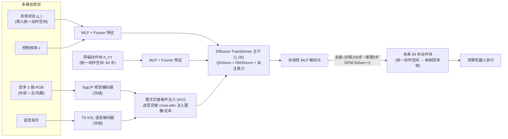
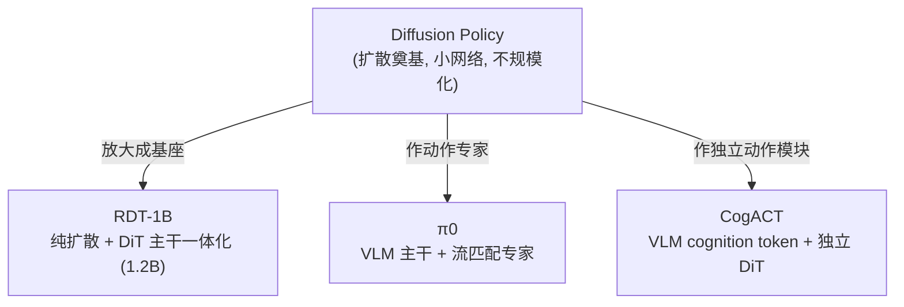

# RDT-1B 细粒度解读

> **arXiv**: 2410.07864 · 清华大学 TSAIL · 2024.10(ICLR 2025) · **路线**:纯扩散去噪 + DiT 主干一体化(双臂操作基础模型)
> [← 返回主报告](../index.md)

## TL;DR
RDT-1B(Robotics Diffusion Transformer)要回答的问题很直接:**[Diffusion Policy](diffusion-policy.md) 证明了"用扩散做连续动作生成"这条路走得通,但它用的是小网络、单一本体、不规模化;那么——能不能把扩散动作生成器本身做成一个"大基座"?** RDT 的答案是把扩散从 Diffusion Policy 那种几千万参数的 1D U-Net,升级到一个 **1.2B 参数的可扩展 Diffusion Transformer(DiT)主干**,并在**史上最大的多机器人数据集合(46 个数据集、1M+ 轨迹、约 21TB)**上预训练,再在自采的 **6K+ 条 ALOHA 双臂轨迹(300+ 任务)**上微调。它的两个承重设计是:(1)一个 **物理可解释的统一动作空间(physically-interpretable unified action space)**,把单臂/双臂、关节/末端执行器、位置/速度、乃至轮式底盘等异构机器人的动作,按"物理含义"对齐填入同一个定长向量(其余维度 padding),从而让高度异构的机器人数据能混进同一个预训练池;(2)针对机器人数据的非线性、高频特性对标准 DiT 做的工程改造(QKNorm、RMSNorm、MLP 解码头、图文交替条件注入 ACI)。给定语言指令 + 至多 3 路 RGB,RDT 一次预测未来 **64 步**动作;推理用 DPM-Solver++ 把训练时的 100 步去噪压到 **5 步**,在 RTX 4090 上达约 381 Hz 平均动作频率。作者自评在双臂真机上较最强基线平均提升 **56%**(⚠️ 自评)。它是国产 VLA 生态里被广泛复用的开源(MIT)扩散基座之一。

## 1. 要解决的问题
双臂(bimanual)灵巧操作是机器人学最难的设定之一,RDT 把它面临的障碍归纳为两层:

1. **数据稀缺 + 异构**:双臂高质量演示数据极少,远不足以从零训练一个泛化的大模型。唯一的出路是借力**其它机器人**(海量单臂数据)做预训练。但不同机器人的动作空间彼此不兼容——有的输出关节角、有的输出末端执行器位姿,有的是绝对位置、有的是速度增量,维度也各不相同。直接把这些动作向量混在一起训练会产生**语义冲突**(同一个数值位在 A 机器人是关节角、在 B 机器人却是夹爪开合)。
2. **动作分布的难度**:机器人动作是**连续、多模态、非线性、高频**的信号。回归式(MSE)策略会把多条合理动作平均成不合理的折中;离散 token 化([RT-2](rt2.md)/[OpenVLA](openvla.md) 路线)又损失精度、且自回归串行解码难以高频输出整段轨迹。

RDT 的诊断与 [Diffusion Policy](diffusion-policy.md) 一脉相承——**扩散模型天生擅长建模连续多模态分布**——但它进一步主张:要做"基础模型",光有扩散表述不够,还得解决两个规模化前提:**(a) 用什么"通用动作接口"把异构机器人数据汇成一个预训练池(→ 统一动作空间);(b) 用什么"可扩展主干"承载这个池子(→ DiT 而非 U-Net)。** 这正是 RDT 区别于 Diffusion Policy 的核心:Diffusion Policy 奠定范式但不讲规模化,RDT 把同一范式**放大成基座**。

## 2. 方法与架构
RDT 是一个**纯扩散去噪 + DiT 主干一体化**的策略:没有独立的大 VLM 主干在"理解",也没有把动作交给一个外挂专家,而是让一个 DiT 主干同时吃下视觉、语言、本体状态与带噪动作,直接对统一动作空间里的动作块做条件去噪。

### 2.1 物理可解释的统一动作空间(本站他页未展开的核心设计)
这是 RDT 最具原创性、也是支撑"异构混合预训练"的关键一笔。

**问题**:π0 处理异构本体的做法是"零填充到数据集中最大机器人的维度",但那个统一向量的各维**没有固定物理含义**(只是把不同机器人的动作向量按出现顺序堆叠后补零)。RDT 认为这不够——它要让统一向量的**每一维都有明确、固定的物理含义**。

**做法**:RDT 设计一个定长的**统一动作向量**,把机器人操作里会出现的**所有主要物理量都预留固定槽位**——例如左/右臂各关节角(joint position)、各关节速度(velocity)、末端执行器位姿(end-effector pose,位置 + 姿态)、夹爪开合状态、乃至轮式底盘的运动量等。映射规则是:**把某台机器人原始动作向量的每个元素,按其物理含义填进统一向量里对应的那个槽位,该机器人没有的物理量对应的槽位则 padding(并用 mask 标记无效)。**(统一向量的确切维度在论文附录 C 给出,具体数值待核;社区与代码实现常引为 128 维。)

**为什么这能让异构机器人混合预训练**:
- **语义对齐**:不同机器人的"同一种物理量"被放进**同一个维度**。模型在维度 k 上学到的"关节角应该怎么变",对所有有该关节的机器人都通用——这就是论文说的"学习可迁移的物理知识(transferable physical knowledge)"。π0 式的顺序堆叠则做不到这种跨本体的维度级共享。
- **兼容性极广**:正因为槽位覆盖了关节/末端、位置/速度、单臂/双臂、甚至轮式运动,RDT 宣称兼容"几乎所有现代移动操作臂"——从单臂到双臂,从关节控制到末端执行器控制,从位置到速度,甚至带轮式底盘。
- **掩码训练**:配合对每个多模态输入按概率**独立随机 mask**的训练技巧,既处理 padding 槽位的无效性,也防止模型过度依赖某单一模态。

> 与 [π0](pi0.md) 的"零填充到统一维度"对照:两者都在解决"异构本体共用一个模型",但 RDT 的统一空间是**物理含义对齐的**(每维固定语义 + padding),π0 是**顺序堆叠对齐的**(填到最大维度)。这是 RDT 在数据规模化上的关键差异化设计。

### 2.2 可扩展的 DiT 主干:从 U-Net 到 1.2B Transformer
RDT 用 **Diffusion Transformer(DiT)** 取代 Diffusion Policy 的 1D 卷积 U-Net,并放大到 **1.2B 参数**(论文称"最大的扩散式机器人操作基础模型")。但作者强调:**标准 DiT 是为图像设计的,直接搬到机器人数据会出问题**,因为机器人动作具有图像没有的非线性与高频特性。于是对 DiT 做了三处针对性改造:

- **QKNorm + RMSNorm**:机器人时间序列里数值幅度跨度大,标准注意力易出现数值不稳定 / token 漂移。RDT 用 **QKNorm**(对 Q、K 归一化)稳住注意力计算,用 **RMSNorm 替换 LayerNorm** 抑制时序上的 token/attention 漂移。
- **非线性 MLP 解码头**:把 DiT 末端的线性解码器换成**非线性 MLP**,以更好逼近"非线性的机器人动作"。
- **图文交替条件注入(Alternating Condition Injection, ACI)**:图像 token 远多于文本 token,若同层一起做 cross-attention,文本信号易被图像淹没。RDT 让相邻层**交替**注入图像与文本 token(这一层只 cross-attend 图像、下一层只 cross-attend 文本),平衡两种模态的影响。

**编码器(均冻结)**:视觉用 **SigLIP**(siglip-so400m-patch14-384),语言用 **T5-XXL**(t5-v1.1-xxl)。本体状态、动作、控制频率等低维输入则各经带 **Fourier 特征**的 MLP 投影。注意:RDT 用 T5-XXL 这种**纯文本编码器**而非生成式 VLM——它要的是文本/图像的**编码表征**作为扩散条件,而不是让一个 VLM 去"推理该做什么"。

### 2.3 扩散训练与推理
- **建模对象**:一次预测未来 **64 步**动作块(Ta=64),在统一动作空间里去噪。
- **去噪**:训练 **100 步**加噪/去噪;推理用 **DPM-Solver++** 加速到约 **5 步**即可生成一个动作块。块频率约 6 Hz,在 RTX 4090 上平均动作频率约 **381 Hz**(即一次出 64 步、滚动执行带来的等效高频)。
- **算力**:预训练用 **48 张 H100 80GB 训练约一个月**(约 1M 迭代);双臂微调约 **3 天**(约 130K 步)。

## 3. 关键设计与创新点
把 RDT 的贡献提炼为四点:

1. **把扩散动作生成器"基座化"**:相对 [Diffusion Policy](diffusion-policy.md) 的小网络 + 单本体 + 不规模化,RDT 用 **1.2B DiT + 1M+ 多机器人预训练**证明了"扩散策略也能像 LLM 那样靠规模与数据吃到泛化红利"。这是它与奠基者 Diffusion Policy 的本质差异。
2. **物理可解释统一动作空间**:见 2.1。让异构机器人(单/双臂、关节/末端、位置/速度、轮式)在**维度级物理对齐**下混合预训练,是支撑数据规模化的接口创新。
3. **面向机器人数据的 DiT 改造**:QKNorm/RMSNorm/MLP 解码/ACI,把图像域的 DiT 改造成能稳定建模高频非线性机器人动作的主干。
4. **双臂落地与开源生态**:自采 6K+ 条、300+ 任务的 ALOHA 双臂数据微调,代码 / 权重 / 数据全部 **MIT 开源**,使其成为国产 VLA 研究里常见的基线与骨干。

### 与 π0、CogACT 的三路架构对照(本节为核心)
RDT 与 [π0](pi0.md)、[CogACT](cogact.md) 同属"连续动作生成"大方向(都反叛离散 token),但**架构形态截然不同**,恰好代表三种不同的"VLM 与动作生成如何耦合":

| 维度 | [π0](pi0.md) | [CogACT](cogact.md) | **RDT-1B(本文)** |
|---|---|---|---|
| 主干形态 | VLM 主干(PaliGemma)+ 外挂流匹配动作专家 | 独立 7B VLM 出 cognition token + 独立 DiT | **单一 DiT 主干一体化**(无独立 VLM) |
| "理解"由谁做 | VLM 主干(生成式) | 7B 生成式 VLM | 冻结的 **SigLIP + T5-XXL 编码器**(非生成式 VLM) |
| 动作生成器 | 流匹配 action expert(~300M) | 扩散 DiT(13M~308M) | **扩散 DiT 主干本身(1.2B)** |
| 连续动作机制 | 流匹配(flow matching) | 扩散去噪 | 扩散去噪(DPM-Solver++) |
| 认知↔动作接口 | 共享自注意力(双流权重) | 显式 cognition token | **无显式接口**:条件直接 cross-attn 注入同一 DiT |
| 异构本体对齐 | 零填充到最大维度 | OXE 子集(桌面单臂为主) | **物理可解释统一动作空间** |
| 主打设定 | 通用 + 灵巧(叠衣) | 桌面单臂(SimplerEnv) | **双臂 bimanual** |

一句话区分:**π0 = "VLM 主干 + 流匹配专家"**;**CogACT = "VLM 出 cognition token + 独立 DiT"**;**RDT = "纯扩散去噪 + DiT 主干一体化"**——RDT 没有一个在"思考"的生成式 VLM,语言/图像只作为冻结编码器产出的**条件**注入扩散主干,动作生成与多模态融合发生在**同一个 DiT** 里。

## 4. 实验与关键结果
真机平台为 **ALOHA 双臂机器人**(3 路相机:外部 + 左腕 + 右腕)。以下成功率均为**作者自评**(⚠️),对照基线含 [ACT](robots.md)、[OpenVLA](openvla.md)(7B)、[Octo](octo.md)(93M),以及 RDT 自身的消融变体(from-scratch / small 166M / 回归式)。

| 任务(考察能力) | RDT-1B | ACT | OpenVLA | Octo |
|---|---|---|---|---|
| Wash Cup(未见物体,zero-shot) | 87.5% | 0–50% | 0% | 0% |
| Pour Water(未见场景) | 62.5% | 12.5–87.5% | 0–50% | 0–50% |
| Pour Water-L/R(指令跟随) | 87.5–100% | — | 0–50% | 0% |
| Handover(5-shot 学新技能) | 100% | 88% | 0% | 100% |
| Fold Shorts(1-shot 学新技能) | 68% | 0–40% | — | — |
| Robot Dog(高灵巧度) | 48% | 32% | 0% | 0% |

> ⚠️ **作者自评核心声明**:论文称 RDT 在一系列高难度任务上较最强基线**平均提升约 56% 成功率**;并宣称具备对未见物体/场景/指令的 **zero-shot 泛化**、**1~5 个演示即可学会新技能**的 few-shot 能力。这些为 RDT 团队自报口径,评测协议未经统一第三方基准维护方复现。

> **待核**:统一动作空间的确切维度(附录 C,社区常引 128 维);各任务"X/Y"区间为不同子设定下的成功率范围,精确每格数值以论文 Table 3 为准。

**消融要点**:论文用 from-scratch(无预训练)、small(166M)、regression(把扩散头换成回归)等变体,论证(a)大规模多机器人预训练、(b)扩散(相对回归)、(c)模型放大 三者都带来增益——这是它"扩散可规模化"主张的内部证据。

## 5. 局限与争议
- **对比数字为作者自评**:56% 提升及各任务成功率均出自 RDT 团队,跨工作对比(数据、协议)未必完全可比,需谨慎引用(已标 ⚠️)。
- **无生成式语言推理**:RDT 用冻结 T5-XXL 仅作文本编码,不像 π0/CogACT 那样有一个可做语义推理的生成式 VLM 主干;对需要复杂语言推理/常识的长程任务,这种"编码器即条件"的方式上限可能受限。
- **预训练数据以单臂为主**:1M+ 轨迹绝大多数是单臂数据,真正的双臂能力主要靠 6K+ 自采微调数据获得;统一动作空间虽对齐了物理量,单臂→双臂的知识迁移到底贡献几何,缺乏被第三方拆解验证。
- **推理算力不轻**:1.2B 主干 + 多步去噪,虽用 DPM-Solver++ 压到 5 步、并报出 381 Hz 等效频率,但部署成本仍高于小型 Diffusion Policy。
- **统一动作空间的稀疏 padding**:为覆盖所有本体而预留大量槽位,单台机器人实际只用其中少数维,其余 padding——这种高稀疏度对训练效率与表示利用率的影响,论文讨论有限。

## 6. 在 VLA 谱系中的位置
RDT-1B 在谱系里的坐标可以这样定位:它是 **[Diffusion Policy](diffusion-policy.md) 这条"连续扩散动作生成"主线的"规模化分支"**——Diffusion Policy 奠定范式(小网络、不讲规模),RDT 把同一去噪范式**放大成 1.2B DiT 基座并配大规模多机器人预训练**。在"如何耦合理解与动作"这一维度上,它与 [π0](pi0.md)(VLM 主干 + 流匹配专家)、[CogACT](cogact.md)(VLM cognition token + 独立 DiT)鼎足为三,代表**第三种架构:纯扩散去噪 + DiT 主干一体化**——没有在"思考"的生成式 VLM,多模态只作条件注入同一扩散主干。它的**物理可解释统一动作空间**是本站其它页都没展开的接口创新,为异构机器人(尤其单/双臂)混合预训练提供了维度级物理对齐的范式。凭借 MIT 全开源与对双臂 ALOHA 的良好支持,RDT 成为国产 VLA 研究里被反复复用的**基线与骨干**(后续不少工作以其为动作生成主干或对照对象),相关数据生态可参见[数据全景](embodied-data.md)。

## 来源
- 论文:arxiv.org/abs/2410.07864(RDT-1B: a Diffusion Foundation Model for Bimanual Manipulation,清华 TSAIL,2024.10,ICLR 2025)
- 全文(HTML):arxiv.org/html/2410.07864v1(DiT 改造 QKNorm/RMSNorm/MLP 解码/ACI、统一动作空间映射规则、训练/推理步数、数据规模均出自此)
- ICLR 2025 会议版 PDF:proceedings.iclr.cc/paper_files/paper/2025/file/49f80e4d2471ad4f2edf4f5f1ab62339-Paper-Conference.pdf
- OpenReview:openreview.net/forum?id=yAzN4tz7oI
- 项目主页:rdt-robotics.github.io/rdt-robotics/
- 模型 / 代码 / 数据(MIT):huggingface.co/robotics-diffusion-transformer/rdt-1b · github.com/thu-ml/RoboticsDiffusionTransformer(SigLIP-so400m-patch14-384 视觉 + T5-v1.1-xxl 语言、chunk_size=64、46 数据集、1M+ 轨迹、约 21TB 均见此)
