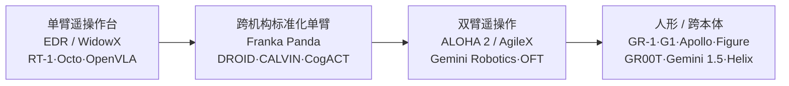
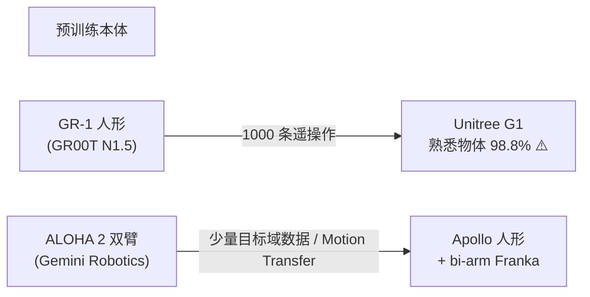

# 实验机器人本体梳理:VLA 实验都跑在哪些机器人上

> [← 返回主报告](../index.md)

> **定位**:本篇是《VLA 发展深度调研报告》的「实验机器人本体」专题子文档,聚焦 VLA 实验**跑在哪些机器人硬件上**——平台形态、自由度、谁在用、如何跨本体迁移,而非数据(见 [具身数据](embodied-data.md))或基准(见 [数据集与基准](benchmarks.md))。
> **方法**:基于语料关联(谁用了哪个本体)+ 厂商规格调研(specs)综合而成,规格以官方 datasheet 为主。
> **可信度标注**:凡标 ⚠️ 者为厂商/提出方自评、未经独立第三方复现的数字或结论;低可信度规格标「待核」。
> **日期**:2026-05-30。领域演进极快,人形规格多有版本差异。

---

## 摘要

VLA 论文里的"成功率"必须绑定到具体本体才有意义——同一个模型在 WidowX 上 70% 和在双臂 ALOHA 上 70% 完全不是一回事。一句话主线:

> **实验本体沿着「单臂遥操作台(EDR/WidowX)→ 跨机构标准化单臂(Franka/DROID)→ 双臂遥操作(ALOHA 系)→ 人形/跨本体(GR-1/G1/Apollo)」逐级演进,门槛是动作空间能否统一。**

早期 VLA(RT-1、Octo、OpenVLA)几乎都绑定单一单臂遥操作台,本体即数据源即评测台;随着 OXE 把 22 种本体池化,以及 π0/GR00T 用统一动作空间容纳多配置,实验本体从"一台机器跑到底"走向"一个模型跨多本体"。**人形机器人是当前最前沿、也最难独立复现的实验本体**(GR00T→Unitree G1、Gemini Robotics→Apollo)。

---

## 一、主对照大表(核心)

下表覆盖语料里出现的全部实验本体。**关联模型**=语料中明确用该本体训练或评测的 VLA;**关联数据集**=该本体产出的代表数据集。规格中 ⚠️ 为厂商自报、低可信项标「待核」。

| 平台 | 厂商 | 形态 | 自由度(DoF) | 末端 | 真机/仿真 | 关联模型 | 关联数据集 |
|---|---|---|---|---|---|---|---|
| **Everyday Robots (EDR)** | Everyday Robots (Alphabet X) | 移动操作单臂 | 臂 7 + 移动底盘(RT-1 11 维动作) | 两指平行夹爪 | both | RT-1, RT-2, RT-2-X, RT-1-X, OpenVLA(评测), CogACT(SimplerEnv) | RT-1 数据集(13万), OXE, SimplerEnv Google Robot/Fractal |
| **WidowX 250 (S)** | Trossen Robotics (Interbotix) | 桌面平面臂 | 6 DoF(9 舵机) | 两指平行夹爪 | both | Octo, OpenVLA(评测), π0(预训练), CogACT, RT-1-X, SpatialVLA, VOTE, MemoryVLA | BridgeData V2(60,096), OXE, SimplerEnv Bridge/WidowX |
| **Franka Emika Panda** | Franka Robotics | 单臂协作 | 7 DoF | 两指平行夹爪(Franka Hand) | both | OpenVLA(微调), CogACT, Gemini Robotics, Gemini 1.5, Data Scaling Laws | DROID(7.6万/350h), RoboSet, CALVIN, RoboMIND, OXE |
| **ALOHA / ALOHA 2** | Stanford / Trossen / Google DeepMind | 双臂遥操作台 | 每臂 6 DoF(2 主 2 从) | 两指平行夹爪×2 | real | Gemini Robotics, Gemini 1.5, OpenVLA-OFT/OFT+, Qwen-VLA | Gemini 约 12 月 ALOHA 2 遥操作数据 ⚠️ |
| **UR5 / UR5e** | Universal Robots | 单臂协作 | 6 DoF | 法兰位(可装夹爪/吸盘) | real | RH20T 平台之一(语料中作多臂数据集本体) | RH20T, OXE 子集 |
| **KUKA LBR iiwa** | KUKA | 单臂协作 | 7 DoF | 法兰位(装夹爪) | real | RT-1(异构数据吸收实验) | Kuka bin-picking 数据(混入 RT-1) |
| **Flexiv Rizon** | Flexiv(非夕) | 单臂力控自适应 | 7 DoF | 法兰位(4s 带 6 轴力矩传感器) | real | RH20T 平台之一 | RH20T |
| **Realman 机械臂** | Realman(睿尔曼) | 单臂 | 待核(规格未独立调研) | 平行夹爪(待核) | real | CogACT(真机自评), OpenVLA(对照基线) | — |
| **Cobot Magic** | AgileX(松灵) | 双臂移动操作 | 4×6-DoF PiPER 臂 + 移动底盘 | 两指平行夹爪×2 | real | (Mobile ALOHA 复刻平台,RoboMIND 含 AgileX 双臂) | RoboMIND(含 AgileX 双臂) |
| **LeRobot SO-100/101** | TheRobotStudio / LeRobot 生态 | 桌面平面臂(低成本) | SO-100: 5 DoF;SO-101: 6 DoF | 两指平行夹爪(舵机) | real | RynnVLA-001, π0(对照), GR00T N1.5(对照) | RynnVLA 自采 SO100 三任务集 |
| **Unitree G1** | Unitree(宇树) | 人形 | 23(标准)~ 43 DoF(EDU) | 简易夹持 / 7-DoF 力控灵巧手(EDU) | real | GR00T N1.5(跨本体迁移目标) | 1000 条 G1 遥操作数据 |
| **Fourier GR-1** | Fourier(傅利叶) | 人形 | 约 40–54 DoF;手 11 DoF | 多指灵巧手(11 DoF) | both | GR00T N1(真机主力), GR00T N1.5(预训练本体) | GR00T 自采 GR-1 约 88h, DexMimicGen, DreamGen(→827h) |
| **天工 Tiangong** | 北京人形创新中心(X-Humanoid) | 人形(开源母平台) | 初代约 28;1.2 MAX 42;3.0 为 43 DoF | 可二次开发(灵巧手/夹爪) | real | (RoboMIND 含天工人形) | RoboMIND(含天工) |
| **AgiBot 远征 A2** | AgiBot(智元) | 双臂人形(部分轮式) | A2/Ultra 40+;Max 67;Lite 23 DoF | 灵巧手(称 19 DoF)+ 7-DoF 力位混合臂 | real | (AgiBot World 数据平台;语料未列具体直训 VLA) | AgiBot World(约 100万/2976.4h/100 台) |
| **Apptronik Apollo** | Apptronik | 人形 | 约 71 DoF | 夹持/灵巧手 | real | Gemini Robotics, Gemini 1.5(Motion Transfer) | — |
| **Figure 01/02 (Helix)** | Figure AI | 人形上半身 | Figure 02 约 35 DoF;双手 16 DoF | 五指灵巧手(16 DoF) | real | Helix, Helix-02 | —(约 500h 遥操作 ⚠️,非公开数据集) |
| **π Physical Intelligence 平台** | Physical Intelligence | 7 种机器人配置(单臂/双臂/移动操作) | 统一零填充到 18 维(双 6-DoF 臂+2 夹爪+底盘+升降躯干) | 平行夹爪等 | real | π0, π0-FAST, π0.5, π0.6/π*0.6, Knowledge Insulation | π 自有数据集(7 配置/68 任务/约 1 万 h/903M timesteps) |
| **X Square 多本体平台** | X Square Robot(自变量) | 多本体机器人 | 待核 | 灵巧操作(egocentric+腕部相机) | real | WALL-OSS, Wall-OSS-0.5 | 自采动作 + 开源动作 + 多模态 VQA |
| **RoboCasa 厨房仿真本体** | UT Austin / NVIDIA | 仿真厨房本体 | 仿真(robosuite/MuJoCo + Omniverse) | 仿真夹爪 | sim | GR00T N1/N1.5/N1.6/N1.7, π0, π0.5, Diffusion Policy, BC-Transformer | RoboCasa 1.0 multitask, MimicGen, DreamGen |

> ⚠️ **读表须知**:
> ① **DoF 口径不统一**:人形整机 DoF 含腿/颈/腰,与操作相关的臂+手 DoF 往往只是其中一部分;同一型号不同版本(如 G1 标准版 vs EDU)差异巨大。
> ② **"真机/仿真"列**:both 指该本体既有真机也被做成仿真套件(EDR→Fractal、WidowX→Bridge、Franka→CALVIN、GR-1→RoboCasa)。
> ③ **关联模型列出的是"用过"而非"专属"**:多数本体被多个模型当作公共评测台;Realman/X Square 规格语料未深调,标待核。

---

## 二、按形态分组

### 2.1 单臂(VLA 的"标准考场")

单臂是 VLA 实验的最大公约数,几乎所有早期工作都在单臂上立标杆。

| 平台 | 代表角色 | 谁在用 | 要点 |
|---|---|---|---|
| **EDR(Google Robot/Fractal)** | RT 系列御用,OXE 核心来源 | RT-1/2/X、OpenVLA/CogACT(经 SimplerEnv) | 13 台机 17 个月采 13 万 episodes/700+ 指令;**项目已关停**,真机不可复现,只剩 SimplerEnv Fractal 仿真套件 |
| **WidowX 250** | BridgeData V2 平台 | Octo、OpenVLA、π0(预训练)、SpatialVLA、MemoryVLA | VR(Quest 2)遥操作;论文自评与社区 SimplerEnv 复现张力极大(下文) |
| **Franka Panda** | 学术界事实标准研究臂 | OpenVLA(7 任务微调)、CogACT、Gemini、Data Scaling Laws | 7-DoF + 力矩传感;DROID/CALVIN/RoboSet 均用它;**最常被当跨本体迁移落点** |
| **UR5e / KUKA iiwa / Flexiv Rizon** | 工业/力控基线 | RH20T(多臂数据集),RT-1(Kuka 异构吸收实验) | 多用于数据集采集而非单一模型评测;RT-1 混入 Kuka bin-picking 数据后成功率 22%→39%(约 +17pp),证明架构可吸收异构形态 |
| **SO-100/101** | 超低成本开源臂 | RynnVLA-001、π0/GR00T N1.5(对照) | leader–follower 采数据;入门门槛极低;评测面窄、SR 仍低,均作者自评 |
| **Realman** | CogACT 真机对照之一 | CogACT、OpenVLA(基线) | 规格待核;CogACT 自评总平均 71.2% vs OpenVLA 12.1% ⚠️ |

**跨本体迁移要点(单臂)**:OpenVLA 在 7 个 Franka 任务上 LoRA 微调即可与 Diffusion Policy/Octo 竞争(Franka-Tabletop LoRA 68.2% vs 全量 69.7% ⚠️);CogACT 真机 Franka 平均 61.4% vs OpenVLA 6.8% ⚠️。**单臂之间迁移主要靠统一的相对末端执行器动作空间**(7D:3 平移+3 旋转+1 夹爪)。

> 📌 **WidowX 自评 vs 复现的张力**:OpenVLA 论文在 BridgeData V2 WidowX 真机自评正面,但社区 SimplerEnv Bridge/WidowX 复现近乎归零(1.0–4.2% ⚠️)。SimplerEnv WidowX VM 下:π0-Beta 68.4、MemoryVLA 71.9、Octo-Base 17.5。说明**同一本体在不同评测分布下结果可天差地别**,引用单臂成功率必须连分布一起看。

### 2.2 双臂(灵巧长时序任务的主战场)

双臂遥操作是高精度、低吞吐的代表范式,既是采集平台也是评测本体。

| 平台 | 配置 | 谁在用 | 要点 |
|---|---|---|---|
| **ALOHA / ALOHA 2** | leader–follower:WidowX-250 主 + ViperX-300 从,每臂 6 DoF | Gemini Robotics(主数据)、Gemini 1.5、OpenVLA-OFT+、Qwen-VLA | Gemini 约 12 月 ALOHA 2 遥操作(折纸、装午餐盒等);ALOHA 2(DeepMind)改进夹爪/刚性 |
| **Mobile ALOHA / Cobot Magic** | ALOHA + AgileX Tracer 移动底盘 / AgileX 商用复刻 | RoboMIND(含 AgileX 双臂) | 加移动底盘后从桌面走向移动操作 |
| **bi-arm Franka** | 两台 Franka Panda,共 14 DoF | Gemini Robotics、Gemini 1.5 | Gemini 把 ALOHA 2 学到的任务以少量数据迁到 bi-arm Franka(in-distribution 平均 63% ⚠️) |

**跨本体迁移要点(双臂)**:OpenVLA-OFT+ 在真实双臂 ALOHA 用动作分块 K=25 + FiLM 强化语言 grounding;Qwen-VLA 真机 ALOHA 双臂带预训练 In-Domain 平均 83.6%、OOD 76.9%(对比 π0.5 与 GR00T N1.6,均自评 ⚠️)。Gemini 1.5 的 Motion Transfer 宣称 ALOHA 2 ↔ bi-arm Franka ↔ Apollo 可互迁(厂商口径)。

### 2.3 人形(当前最前沿、最难复现)

人形是 VLA 实验本体演进的当前终点,也是跨本体迁移叙事的主战场。

| 平台 | 厂商 | DoF | 谁在用 | 要点 |
|---|---|---|---|---|
| **Fourier GR-1** | 傅利叶 | 约 40–54;手 11 | GR00T N1(真机主力)、N1.5(预训练本体) | 8 个真机任务击败 Diffusion Policy,仅 10% 数据仍强;自采约 88h 为数据金字塔顶层 |
| **Unitree G1** | 宇树 | 23~43 | GR00T N1.5(迁移目标) | 跨本体迁移**标志案例**(下文专题);低价量产,研究热门 |
| **天工 Tiangong** | 北京人形创新中心 | 28~43 | RoboMIND(含天工) | 全球首个纯电驱可奔跑人形;开源母平台 |
| **AgiBot 远征 A2** | 智元 | 23~67 | AgiBot World 数据平台 | 双臂人形+灵巧手+视触觉;4000㎡ 数据工厂;语料未列直训 VLA |
| **Apptronik Apollo** | Apptronik | 约 71 | Gemini Robotics、Gemini 1.5 | 面向工厂/物流;Gemini 跨本体迁移落点之一 |
| **Figure 01/02 (Helix)** | Figure AI | 约 35;双手 16 | Helix、Helix-02 | System 1 控制整个上半身,35 DoF @ 200Hz ⚠️;厂商称首个驱动两台协作机器人的 VLA(新闻稿) |

**跨本体迁移要点(人形)**:人形 DoF 高、本体差异大,迁移成败取决于**动作空间是否本体无关**。GR00T 用相对末端执行器动作空间 + 具身感知编码器,使 N1.5 能从 GR-1 预训练本体迁到结构不同的 G1(详见第三节)。

### 2.4 桌面/特制本体

| 平台 | 性质 | 谁在用 | 要点 |
|---|---|---|---|
| **Language-Table** | 桌面 2D 平面推动臂 | Language-Table 数据集 / RT-X 系 | 实时语言交互遥操作,近 60 万语言标注轨迹;开放词汇推动/重排 |
| **SO-100/101** | 低成本桌面臂 | RynnVLA、π0/GR00T 对照 | 见 2.1;相机消融极敏感:遮前置相机成功率 80%→0% ⚠️ |
| **RoboCasa 厨房仿真本体** | 纯仿真 | GR00T 全系、π0/π0.5、Diffusion Policy、BC-Transformer | 四种评测口径互不兼容**禁横比**(详见 [基准](benchmarks.md)) |

---

## 三、跨本体迁移专题

跨本体迁移是"一个模型跑多种机器人"的核心证据,但绝大多数为厂商自评。

### 3.1 GR00T N1.5 → Unitree G1(被反复引用的代表案例)

- 后训练迁移到 **Unitree G1**(异于预训练本体 GR-1),**仅用 1000 条遥操作**,熟悉物体成功率 **98.8% ⚠️**(vs N1 44.0%)、新物体 84.2%。
- 训练规模:250K 步 / 1K H100 / batch 16384。
- N1.5 语言跟随真实 GR-1 93.3% vs 46.6% ⚠️。
- **机制**:依赖相对末端执行器动作空间 + 具身感知编码器,使异构本体共享同一动作语义。
- 该案例是主报告引用"跨本体迁移已有实证"的招牌,但仍为 NVIDIA 自评,无第三方真机复现。

### 3.2 Gemini Robotics → Apollo / bi-arm Franka

- **2025.03 Gemini Robotics**:在 ALOHA 2 上训练,用**少量目标域数据**把策略迁移到 Apptronik Apollo 人形与 bi-arm Franka(in-distribution 平均 63% ⚠️)。此版仍是数据驱动,**无 zero-shot 跨本体证据**。
- **2025.09 Gemini Robotics 1.5**:用 **Motion Transfer** 宣称只在 ALOHA 2 上见过的任务可直接迁到 Apollo 与 bi-arm Franka(反之亦然),无需为每种本体单独 specialize——**厂商口径**,未见独立验证。

### 3.3 π0 的 7 配置:用统一动作空间容纳多本体

- π0 自有数据覆盖 **7 种机器人配置、68 个任务、约 1 万小时**(903M timesteps:106M 单臂 + 797M 双臂)。
- **统一方法**:动作/状态统一**零填充到最大本体维度=18**(容纳两条 6-DoF 臂 + 2 夹爪 + 移动底盘 + 升降躯干)+ 按各数据集 1%/99% **分位数归一化**到 [-1,1]。
- π0.5 升级为双臂 + 移动底座 + 升降躯干的移动操作平台(每台 4 相机、约 18–19 DoF),在全新真实住宅做 10–15 分钟长程家务。
- **要点**:π0 不靠显式跨本体迁移机制,而靠"零填充 + 分位数归一化"让一个动作头吞下所有配置。

### 3.4 为什么"相对末端执行器动作空间"是跨本体关键

不同本体的关节数、连杆长度、底座完全不同,但**末端执行器在笛卡尔空间的相对增量(Δposition + Δrotation + gripper)是本体无关的**。因此:

- OXE/RT-X 用 7D 相对末端动作统一 22 种本体;
- GR00T 用相对当前位姿增量 + 每本体一个 MLP 适配维度;
- π0 用零填充 + 分位数归一化抹平维度差。

这套归一化是 co-training 的技术前提,详见 [具身数据 §6.3](embodied-data.md) 与 [数据集与基准](benchmarks.md)。

---

## 四、易混淆点辨析与核查清单

### 4.1 易混淆点

| 混淆对 | 辨析 |
|---|---|
| **Fourier GR-1 机器人** vs **CALVIN 的 'GR-1' 模型** | 前者是傅利叶的人形**硬件**(GR00T 预训练本体);后者是 CALVIN 基准上的同名**生成式方法**(ICLR 2024,ABCD→D avg-len 4.21)。**同名不同物,完全无关**。 |
| **ALOHA 既是采集平台也是评测本体** | ALOHA/ALOHA 2 既用于遥操作采数据(Gemini 约 12 月数据),又被当真机评测台(OpenVLA-OFT+、Qwen-VLA)。引用时需分清是"数据来源"还是"评测落点"。 |
| **EDR ≠ Fractal ≠ Google Robot** 是同一物的不同名 | 真机叫 Everyday Robots,数据集叫 Fractal,SimplerEnv 仿真套件叫 Google Robot,**指代同一机队**。 |
| **G1 标准版 vs EDU 版** | 23 DoF 简易夹持 vs 43 DoF + 7-DoF 力控灵巧手,操作能力差异极大,引用 DoF 须标版本。 |
| **bi-arm Franka ≠ ALOHA** | 都是双臂,但 bi-arm Franka 是两台 7-DoF 工业协作臂(共 14 DoF),ALOHA 是 6-DoF leader–follower 低成本台,刚性/精度/成本完全不同。 |
| **CogACT 的 Franka 自评 ≠ OpenVLA 官方 Franka 结果** | CogACT 论文里 OpenVLA 6.8% 是 CogACT 作者复现的对照基线,非 OpenVLA 官方数字。 |

### 4.2 核查/待核清单

| 项 | 状态 | 说明 |
|---|---|---|
| GR00T N1.5 → G1 熟悉物体 98.8% | ⚠️ 厂商自评 | NVIDIA 技术报告,无第三方真机复现 |
| Gemini 1.5 Motion Transfer 互迁 | ⚠️ 厂商口径 | 无独立验证;2025.03 版无 zero-shot 证据 |
| Figure Helix 35 DoF @ 200Hz、首个双机协作 VLA | ⚠️ 新闻稿 | 非同行评审;Helix-02 细节二手源,待一手确认 |
| Realman 机械臂规格 | 待核 | 语料未独立调研 DoF/末端,仅知 CogACT 真机平台之一 |
| X Square 多本体平台规格 | 待核 | Wall-OSS-0.5 17 任务零样本 task-progress >80 均厂商自评 |
| AgiBot World 100万轨迹/100 台真机 | ⚠️ 厂商自评 | IROS 2025 Best Paper Finalist,但无第三方审计 |
| 各人形整机 DoF | 部分待核 | 版本差异大(天工 28~43、A2 23~67),引用须标版本 |
| EDR 真机 | 已关停 | 项目并入 DeepMind 后关停,真机不可复现 |

---

## 五、主要信源(官方一手页面 / 论文)

**单臂**
- EDR/RT-1: research.google/blog/rt-1-robotics-transformer · x.company/projects/everyday-robots
- WidowX 250: trossenrobotics.com/widowx-250 · BridgeData V2: arxiv.org/abs/2308.12952
- Franka Panda: generationrobots.com/media/panda-franka-emika-datasheet.pdf · DROID: arxiv.org/abs/2403.12945
- UR5e: universal-robots.com(ur5e datasheet) · KUKA iiwa: kuka.com/lbr-iiwa · Flexiv Rizon: flexiv.com/products/rizon
- SO-ARM100: huggingface.co/docs/lerobot/en/so100 · github.com/TheRobotStudio/SO-ARM100

**双臂**
- ALOHA: arxiv.org/abs/2304.13705 · Mobile ALOHA: arxiv.org/abs/2401.02117 · ALOHA 2: arxiv.org/abs/2405.02292
- Cobot Magic (AgileX): scengrobotics.com/robots/detail/cobot-magic
- Gemini Robotics: deepmind.google/discover/blog/gemini-robotics-brings-ai-into-the-physical-world

**人形**
- Unitree G1: unitree.com/g1 · Fourier GR-1: therobotreport.com(fourier gr-1) · humanoids.wiki/w/GR-1
- 天工 Tiangong: x-humanoid.com/bt.html · AgiBot A2: agibot.com/product/169
- Apptronik Apollo: apptronik.com/apollo · Figure Helix: figure.ai/news/helix-02

**跨本体 / 模型**
- GR00T N1: arxiv.org/abs/2503.14734 · π0: arxiv.org/abs/2410.24164 · π0.5: arxiv.org/abs/2504.16054
- OpenVLA: arxiv.org/abs/2406.09246 · CogACT(SimplerEnv 对照) · RynnVLA-001: arxiv.org/abs/2509.15212

---

*本篇为《VLA 发展深度调研报告》「实验机器人本体」专题子文档,基于语料关联 + 厂商规格调研综合而成。⚠️ 标记处为厂商/提出方自评,「待核」处规格未独立调研。互链:[具身数据](embodied-data.md) · [数据集与基准](benchmarks.md)。*
