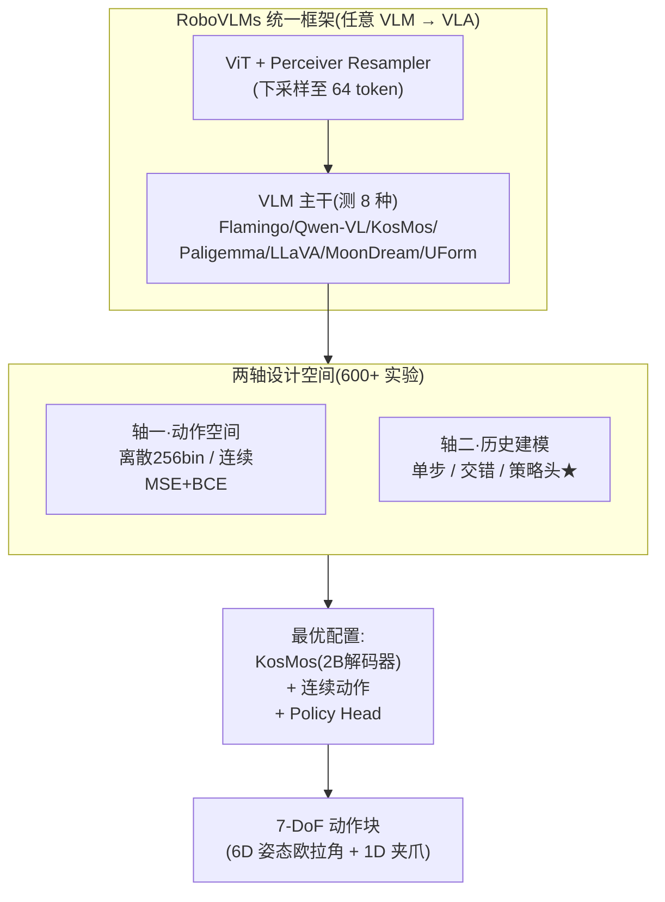
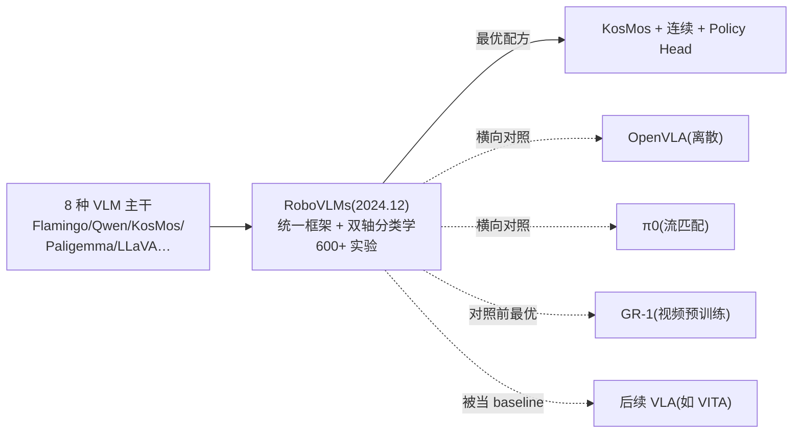

# RoboVLMs:把任意 VLM 变成 VLA 的系统性实证

> **arXiv**: [2412.14058](https://arxiv.org/abs/2412.14058)(2024.12,**Nature Machine Intelligence** 收录)
> **机构**: 字节跳动 Research / 清华大学 等
> **作者**: Xinghang Li, Peiyan Li, Long Qian, Minghuan Liu, Dong Wang, Jirong Liu, Bingyi Kang, Xiao Ma, Xinlong Wang, Di Guo, Tao Kong, Hanbo Zhang, Huaping Liu
> **路线**: 统一框架 + 系统性实证(不是单点模型,而是「建 VLA 的方法论」)
> **项目 / 代码 / 权重**: <https://robovlms.github.io> · <https://github.com/Robot-VLAs/RoboVLMs> · <https://huggingface.co/robovlms/RoboVLMs>

> [← 返回主报告](../index.md)

---

## TL;DR

RoboVLMs 不是又一个 VLA 模型,而是一项**发表在 Nature Machine Intelligence 上的系统性实证研究**,回答一个被反复追问却少有人系统验证的问题:**「把视觉-语言模型(VLM)变成 VLA,到底哪些设计选择最重要?」**

它提出一个**统一框架**(把任意 VLM 转成 VLA,最小化手工设计)+ 一套**双轴分类学**,然后用 **600+ 实验**横扫各种组合:

- **轴一 · 动作空间**:离散 token(256-bin)vs 连续(MSE+BCE)。
- **轴二 · 历史建模**:One-Step(单步)vs Interleaved(交错历史)vs **Policy Head(独立策略头)**。
- **主干**:测了 **8 种 VLM**——Flamingo(OpenFlamingo 3B/4B/9B)、Qwen-VL(9B)、MoonDream(3B)、UForm(1.3B)、**KosMos(2B)**、Paligemma(3B)、LLaVA。

⚠️ 核心结论:**KosMos(2B,解码器架构)+ 连续动作 + 独立策略头(Policy Head)** 的组合最优。**Policy Head** 是其关键设计:VLM 只输出单步表征,再由一个**独立的历史聚合模块**(RNN/Transformer/Diffusion 任选)融合过去 H 步的 `[LRN]` token,预测动作块——既保住 VLM 原生的视觉-语言融合能力,又比「交错历史」更省内存/FLOPs。

战绩(⚠️ 自评,CALVIN):**ABCD→D 平均长度 4.49**(超当时最优 VLA [GR-1](../wam/papers/gr-1.md) 的 4.21);**ABC→D 零样本泛化** 5 任务连续成功率 **70.4%**(超 GR-1 的 40.1,即 **+30.3%**)。数据效率上,KosMos 在 0.1× 数据下仍达平均长度 2.52(Flamingo 3B 仅 0.13)。

一句话:**RoboVLMs = 「建 VLA 的对照实验大全」——用统一框架 + 双轴分类学跑 600+ 实验,实证出「KosMos 解码器主干 + 连续动作 + 独立策略头」是当时最优配方,并厘清主干选择、动作空间、历史建模、跨本体预训练各自的贡献;它不是一个模型,而是一份被后续工作反复当 baseline 与设计指南的方法论,登上了 Nature Machine Intelligence。**

> ⚠️ **可信度提示**:本页定量(CALVIN 4.49/70.4%、SimplerEnv 52%/38%、数据效率曲线)为**作者自评**(Nature MI 同行评审,但非独立第三方复现)。SimplerEnv 逐任务值、真机精确百分比以论文附录/图为准(正文未全列,标待核)。一个作者自述的重要保留:**跨本体 OXE 预训练的增益不一致**——在 CALVIN 全量数据下增益有限,仅在低资源/零样本场景显著。训练 GPU 小时一手未给(待核)。

---

## 1. 要解决的问题

到 2024 年底,VLA 已百花齐放——不同工作用不同 VLM 主干、不同动作头、不同数据策略,各报各的 SOTA。但**缺乏系统的对照**:

1. **主干选择凭感觉**:有人用 Llama,有人用 PaliGemma,有人用 Flamingo——到底哪种 VLM 架构(编码器-解码器 vs 纯解码器)、多大参数最适合做 VLA?没有横向对照。
2. **动作头与历史建模混在一起**:离散 vs 连续、要不要建模历史、历史怎么融合——这些设计的**独立贡献**没被拆开测过。
3. **跨本体预训练(OXE)是否真有用?** 大家默认「预训练好」,但缺乏可控对照。

RoboVLMs 的目标就是用**统一框架 + 大规模可控实验**回答「**building VLAs,什么最重要**」,给整个领域一份可复用的设计指南和强 baseline。

> 📌 这是站内少有的**横切方法论**类细读(类似 [全模型规格对比](models-spec.md) 的精神但更实证),与单点模型细读互补;它系统对照了本站收录的多种主干(Flamingo/Qwen/PaliGemma 系)与动作头(离散/连续/扩散)选择。

---

## 2. 方法与架构

### 2.1 统一框架:任意 VLM → VLA

核心是**最小化手工设计**——给定任意 VLM,框架自动接上动作头、历史模块,转成 VLA。视觉侧用 **ViT + Perceiver Resampler**(下采样到 64 token,对 LLaVA/Qwen-VL 这类提升显著)。这样才能在**同一套代码**里公平对照 8 种主干 × 4 种结构。

### 2.2 双轴分类学

- **动作空间**:① One-Step Discrete(每维 256-bin,交叉熵)② One-Step Continuous(前 6 维姿态 MSE + 夹爪 BCE,预测 `[LRN]` token 后接 MLP)。
- **历史建模**:① 单步 ② Interleaved-Continuous(交错历史)③ **Policy-Head-Continuous(最优)**。

### 2.3 关键设计:Policy Head(独立策略头)

最优结构。**VLM 只输出单步表征**,然后一个**独立的策略头**(可选 RNN / Transformer / Diffusion)去融合**历史窗口 H 步**的 `[LRN]` token,预测**动作块(长度 L)**。好处:
- **保住 VLM 原生的视觉-语言融合**(不破坏预训练能力);
- 比「把历史交错进 VLM 上下文」**更省内存/FLOPs**,性能反而更好。

动作表示:**7-DoF**(6D 夹爪姿态欧拉角 + 1D 开合)。最优配置主干为 **KosMos(2B,解码器架构)**。

### 2.4 三种数据策略(对照跨本体预训练)

- **Pre-train**(域内 + 跨本体一起)、**Finetune**(仅域内)、**Post-train**(OXE 预训练后域内微调)。
- 数据:CALVIN(34 任务 ~24K 演示)、SimplerEnv、Real Robot(74K 轨迹 ~100 任务)、OXE。
- 配置:全局 batch 128,4×8 A100,CALVIN 最多 5 epoch,学习率网格搜索。

---

## 3. 关键设计与创新点

1. **统一框架**:把任意 VLM 转成 VLA,最小化手工设计,支持主干/动作头/数据策略自由组合——这是能做公平对照的前提。
2. **双轴分类学 + 600+ 实证**:把「动作空间 × 历史建模」拆成可控两轴,系统验证最优 = KosMos + 连续 + 策略头。
3. **Policy Head 设计**:VLM 出单步表征 + 独立历史聚合模块预测动作块,保住 VL 融合能力,且比交错式更省算力。
4. **跨本体数据策略的实证结论**:Post-train(OXE 预训练 + 域内微调)在 SimplerEnv 和低资源/零样本场景显著提升,但 **CALVIN 全量数据下增益有限**——纠正了「预训练总是更好」的想当然。
5. **涌现自我纠错**:真机里观察到模型在训练未覆盖场景下自主重定位(如重新够烤箱把手),展示泛化潜力。

---

## 4. 实验与关键结果

> ⚠️ 全部为**作者自评**(Nature MI;非第三方复现)。SimplerEnv 逐任务、真机精确百分比以附录/图为准。

### 4.1 CALVIN ABCD→D(⚠️ 自评)

| 模型 | 1 任务 | 2 | 3 | 4 | 5 | **平均长度** |
|---|---|---|---|---|---|---|
| RT-1 | — | — | — | — | — | 2.45 |
| HULC | — | — | — | — | — | 3.06 |
| GR-1(前最优 VLA) | 94.9 | 89.6 | 84.4 | 78.9 | 73.1 | 4.21 |
| **KosMos P.H.(RoboVLMs)** | **96.7** | **93.0** | **89.9** | **86.5** | **82.6** | **4.49** |

### 4.2 CALVIN ABC→D 零样本泛化(⚠️ 自评,仅训 ABC、迁移到 D)

| 模型 | 1 任务 | 5 任务 | 平均长度 |
|---|---|---|---|
| GR-1 | 85.4 | 40.1 | 3.06 |
| **KosMos P.H.** | **98.0** | **70.4** | **4.25** |

→ 单任务 **+12.6%**、5 任务 **+30.3%**——**零样本泛化增益尤其大**。

### 4.3 SimplerEnv & 数据效率(⚠️ 自评)

| 项目 | 结果 |
|---|---|
| **SimplerEnv**(跨本体后训练) | Google Robot **52%** / Bridge **38%**(均为最高;域内微调无 OXE 为 48%/31%) |
| **CALVIN 数据效率**(0.1×/1×/5×) | KosMos P.H. = **2.52 / 4.49 / 4.51**;Flamingo P.H. 3B = 0.13 / 4.09 / 4.21(**KosMos 低数据退化最慢**) |
| **少样本跨本体**(10 traj/task) | OXE 预训练后单任务 **+17.2%**、平均任务数 +0.25 |

→ Real Robot Benchmark(74K 轨迹)上 KosMos P.H. 在所有设置(Simple / Unseen Background / Unseen Object)均最优(精确百分比以 Fig.7 为准,**待核**)。

---

## 5. 在 VLA 谱系中的位置

- **横切对照,非单点模型**:它把本站收录的多条路线([OpenVLA](openvla.md) 离散、[π0](pi0.md) 流匹配、[GR-1](../wam/papers/gr-1.md) 视频预训练)放进**同一框架公平对照**,是「方法论」而非「又一个 SOTA」。
- **常被当 baseline / 设计指南**:发表于 Nature MI,后续 VLA 工作(如 VITA)以它为对照;对「该选什么主干/动作头」是权威参考。
- **与 [全模型规格对比](models-spec.md) 互补**:本站规格表是「谁用了什么」,RoboVLMs 是「为什么这么选更好」的实证支撑。
- **Policy Head 思想**:VLM 出表征 + 独立动作/历史模块,与 [CogACT](cogact.md)(VLM 出认知 token + DiT 动作专家)、[GR00T N1](groot-n1.md)(双系统)的「解耦」哲学相通。

---

## 6. 局限与存疑

1. **VLM 主干覆盖仍不足**:8 种主干不足以彻底揭示「VLM 组件(视觉编码器/LLM/预训练数据)↔ VLA 性能」的深层关系,需更大规模研究。
2. **架构组合未完全实现**:部分「动作空间 × 历史建模」组合(如离散动作 + 交错/策略头)因注意力掩码/架构约束未实现。
3. **跨本体预训练增益不一致**:OXE 预训练在 CALVIN 全量数据下未持续显著提升,仅低资源/零样本有效——作者自述的重要保留。
4. **sim-to-real 鸿沟**:真机虽最优,但绝对成功率未达生产级。
5. **算力成本高**:600+ 实验需 4×8 A100,限制了更大规模消融。
6. **复现细节待核**:训练 GPU 小时、SimplerEnv 逐任务值、真机精确百分比一手未在正文全列。

---

## 来源

- 论文:Towards Generalist Robot Policies: What Matters in Building Vision-Language-Action Models(RoboVLMs). arXiv:2412.14058(Nature Machine Intelligence)。<https://arxiv.org/abs/2412.14058>
- 项目主页:<https://robovlms.github.io>
- 代码:<https://github.com/Robot-VLAs/RoboVLMs> · 权重:<https://huggingface.co/robovlms/RoboVLMs>
- 对照前最优 GR-1:见本站 [GR-1 细读](../wam/papers/gr-1.md)(arXiv:2312.13139)

> 说明:本页定量(CALVIN 4.49/70.4%、SimplerEnv 52%/38%、数据效率曲线)为**作者自评**;SimplerEnv 逐任务、真机精确百分比一手未在正文全列处标「待核」;跨本体预训练增益不一致为作者自述保留。引用请连同自评属性与上述口径保留。
