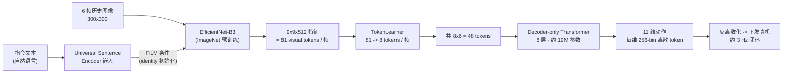

# RT-1 细粒度解读

> **arXiv**: 2212.06817 · Google / Everyday Robots · 2022.12 · **路线**:大规模模仿学习前史(离散 256-bin)
> [← 返回主报告](../index.md)

## TL;DR
RT-1(Robotics Transformer 1)要回答的问题很朴素:**在机器人控制里,能不能像 NLP/CV 那样靠"大模型 + 大数据"换来泛化?** 它用一条端到端的纯模仿学习流水线给出了肯定回答——**EfficientNet-B3(经 FiLM 用语言指令做条件)抽取视觉特征 → TokenLearner 把每帧压成 8 个 token → 一个仅 35M 参数的 decoder-only Transformer 自回归吐出离散动作 token**,每个动作维度被均匀离散成 **256 个 bin**。训练数据是 **13 万条 episodes、覆盖 700+ 条指令、由 13 台 Everyday Robots 移动机械臂在约 17 个月里采集**的真实演示。它在见过的任务上达到 ⚠️**97% 成功率**,并在未见任务、干扰物、新背景上明显优于此前基线;更关键的是它表现出强大的**异构数据吸收能力**(能把仿真数据、甚至另一种形态的 Kuka 机器人数据混进来而不掉点)。RT-1 本身**还不是 VLA**(它没有大语言模型主干、不做开放语义推理),但它确立的"离散 256-bin 动作 token + Transformer 策略"范式直接被 **RT-2 继承**,其数据集也成为 **Open X-Embodiment(OXE)** 的核心来源——是整条离散 token VLA 路线的"史前奠基石"。

## 1. 要解决的问题
在 RT-1 之前,机器人学习长期被一个矛盾卡住:**想要泛化就需要大规模、多样的数据;但单任务、窄数据训练出来的策略一旦换物体/换场景/换指令就崩**。视觉和语言领域早已证明,把**大容量模型**喂给**大规模、多样、任务无关(task-agnostic)的数据**能换来惊人的泛化与涌现能力——但在真实机器人上,这条路当时还没有被走通,核心障碍有二:

1. **数据从哪来、怎么吸收**:真实机器人数据昂贵且异构(不同任务、不同物体、甚至不同机器人形态、还有仿真数据)。需要一个模型架构能把这些**杂糅的数据统统吸收进来而不互相伤害**。
2. **如何在保证泛化的同时满足实时性**:机器人是闭环系统,策略必须**足够快**(论文目标是 100ms 级、约 3 Hz)才能真机闭环运行。大模型天然慢,这是直接冲突。

RT-1 的答案不是引入外部知识(那是后来 RT-2 的事),而是**先把"规模化模仿学习"这件事本身做扎实**:设计一个能高效吸收大规模多样数据、又能实时推理的 Transformer 架构,用纯模仿学习证明"架构 + 规模"足以换来此前看不到的泛化。

## 2. 方法与架构
RT-1 是一条**纯端到端、纯模仿学习**的流水线:输入是「一段历史图像 + 一句自然语言指令」,输出是「下一步的离散动作 token」,中间没有任何显式的规划、状态估计或子目标分解。下面按数据流逐模块拆开。

### 2.1 动作空间:11 个维度,每维 256-bin
RT-1 的动作是 **11 维离散向量**,每个维度都被**均匀离散化(uniform discretization)成 256 个 bin**,模型为每一维预测一个 0–255 的整数序号:

| 分组 | 维度 | 含义 |
|---|---|---|
| 机械臂(arm) | 7 维 | 末端执行器的 `x / y / z` 平移 + `roll / pitch / yaw` 旋转 + 夹爪开合 |
| 底盘(base) | 3 维 | 移动底盘的 `x / y / yaw`(RT-1 跑在**移动**机械臂上,所以多了底盘) |
| 模式切换 | 1 维(离散) | 在「控制手臂 / 控制底盘 / 终止 episode」三种模式间切换 |

> 注意:这和 RT-2 的 8 维动作空间**不同**——RT-2 砍掉了底盘维度只留 7-DoF 手臂 + 终止。但二者共享同一个核心思想:**6-DoF 位姿增量 + 夹爪 + 离散命令**,且都做 256-bin 均匀离散。RT-1 正是这套离散动作表示的**原点**。

### 2.2 视觉主干:EfficientNet-B3 + FiLM 语言条件
- **图像编码**:输入是 **6 帧历史图像**(300×300),逐帧过一个 **ImageNet 预训练的 EfficientNet-B3**,输出 **9×9×512** 的空间特征图,展平即 **81 个 visual token / 帧**。
- **语言如何"早期注入"视觉**:指令先经 **Universal Sentence Encoder(USE)** 编成一个嵌入向量,再通过插在 EfficientNet 内部的 **FiLM 层**对视觉特征做逐通道的 scale/shift 调制。也就是说**语言不是后期拼接,而是从一开始就参与塑造"应该关注图像哪些区域"**——这让模型直接提取**与当前任务相关**的视觉特征。
- **FiLM 的工程细节(关键)**:把 FiLM 层直接塞进预训练 CNN 会破坏其预训练权重。RT-1 的做法是把 FiLM 中产生 scale/shift 的全连接层**初始化为零(identity 初始化)**,使训练初期 FiLM 等价于恒等映射,从而**完整保留 EfficientNet 的 ImageNet 预训练知识**,再在训练中平滑地学会语言调制。
- 这部分(EfficientNet-B3 + FiLM)约 **16M 参数**。

### 2.3 TokenLearner:把每帧 81 token 压到 8 token
直接把 81×6 = 486 个 token 喂给 Transformer 既慢又冗余。RT-1 在视觉特征后接一个 **TokenLearner** 模块,用学习到的注意力把每帧 **81 个 token 软选择/压缩成 8 个最有信息量的 token**。
- 效果:每帧只剩 8 token,**6 帧共 48 个 token**进入 Transformer。
- 收益:论文报告 TokenLearner 带来约 **2.4× 的推理加速**;再叠加"对重叠时间窗内已算过的 token 做复用(token reuse)"又有约 **1.7×** 加速。二者合力,才让一个 Transformer 策略能跑到实时所需的频率。

### 2.4 Transformer 策略与动作生成
- **主干**:一个 **decoder-only Transformer**,**8 个自注意力层**,约 **19M 参数**。它对 48 个 token 做注意力,自回归地输出动作 token。
- **动作 token 化**:11 个动作维度,每维输出一个 256 路 softmax(对应 256 个 bin),整网用标准的**离散动作分类(交叉熵)** 损失训练——本质是把控制问题转成了"在 256 个离散桶里分类"的序列预测。
- **整网规模**:全模型约 **35M 参数**(16M 视觉 + 19M Transformer),在大模型语境下属于**非常小**的模型;它的"大"体现在**数据规模**而非参数量。
- **实时推理**:目标延迟预算约 **100ms**,实测可在 **约 3 Hz** 频率上做真机闭环控制。注意——RT-1 的"快"(3 Hz、桌面级算力可跑)恰恰是后来 RT-2-55B(1–3 Hz、必须上云端多 TPU)所失去的;这是"小模型纯模仿"对"大 VLM"的一处代价权衡。

### 2.5 训练数据:13 万 episodes / 700+ 任务 / 17 个月
- 数据由 **13 台 Everyday Robots(EDR)移动机械臂**采集,历时约 **17 个月**,累计 **~13 万条 episodes**,覆盖 **700+ 条指令(技能)**(拿取、放置、开抽屉、把物体立起来、推倒等)。
- 全部为**人类遥操作演示**(模仿学习,无强化学习)。这套数据后来成为 **Open X-Embodiment** 数据集的核心组成部分之一。

## 3. 关键设计与创新点
- **"架构 + 规模"换泛化**:首次在真实机器人上系统验证了"大容量模型 + 大规模多样模仿数据"能带来跨任务/物体/场景的泛化,把 NLP/CV 的 scaling 直觉搬到了控制。
- **离散 256-bin 动作 token + Transformer**:确立了把连续控制转写成"离散 token 分类/序列预测"的范式——这是 **RT-2、OpenVLA 等离散 token VLA 路线的直接祖先**。
- **FiLM 早期语言条件 + identity 初始化**:让语言从视觉编码阶段就介入,同时不破坏 ImageNet 预训练,是"指令相关视觉特征"的关键。
- **TokenLearner + token 复用换实时性**:用 token 压缩把大模型策略压进 3 Hz 的实时预算,解决了"大模型 vs 闭环实时"的硬冲突。
- **异构数据吸收能力**:证明同一架构能把仿真数据、甚至**不同形态机器人(Kuka)** 的数据混进训练而不掉点,反而提升——这是"规模化数据集"路线的可行性证据。

## 4. 实验与关键结果

| 指标 | RT-1 数值 | 备注 |
|---|---|---|
| 见过任务成功率 | ⚠️ **97%**(744 条训练指令) | 厂商自评,训练分布内 |
| 未见任务泛化 | ⚠️ **~76%** | 优于当时基线(Gato / BC-Z 等) |
| 干扰物(distractor)鲁棒性 | ⚠️ **~83%** | 场景中加入未见干扰物 |
| 新背景鲁棒性 | ⚠️ **~59%** | 新厨房/新背景 |
| 仿真数据吸收 | 仿真物体真机成功率 **+64%** | 混入仿真数据后对该类物体的提升 |
| 跨形态数据吸收(Kuka bin-picking) | **22% → 39%** | 混入 Kuka 数据后 EDR 在 bin-picking 上的成功率提升(约 +17 个百分点) |
| 模型参数 | **~35M**(16M 视觉 + 19M Transformer) | 小模型 |
| 推理频率 | **~3 Hz**(~100ms 预算) | TokenLearner ~2.4× + token 复用 ~1.7× 加速 |
| 每帧 token | 81 → **8**(TokenLearner 后) | 6 帧共 **48** token 入 Transformer |

> ⚠️ 上表中成功率类数字均为论文/厂商自评口径,评测在受控的厨房式真机环境与 Everyday Robots 平台上进行,直接迁移到其他硬件/场景的数值不应被默认沿用。

## 5. 与同类工作对比
| 方法 | 主干 | 动作表示 | 语义/泛化来源 | 是否 VLA |
|---|---|---|---|---|
| **RT-1**(本文) | EfficientNet + 35M Transformer | 11 维 × 256-bin 离散 token | **仅来自机器人数据规模**(无 LLM 知识) | 否(VLA 前史) |
| Gato / BC-Z(同期基线) | Transformer / CNN | 多种 | 多任务模仿 | 否 |
| [[rt2]](RT-2) | PaLI-X / PaLM-E(5B–55B VLM) | 8 维 × 256-bin 离散 token | **网络规模 VLM 知识 + co-fine-tune** | 是 |
| [[openvla]](OpenVLA) | 开源 7B VLM | 离散 token | 开源 VLM 知识 | 是 |

**RT-1 与 RT-2 的关键分界**:RT-1 的泛化**全部来自机器人数据本身的规模与多样性**——它没有大语言模型主干,学不到"把香蕉放到数字 2 旁边"这类需要开放世界语义/符号推理的指令。RT-2 把视觉主干换成网络规模预训练的 VLM,并让动作与 VQA 数据**联合微调(co-fine-tune)**,才把网络语义知识注入控制、涌现出符号理解与推理。可以说 **RT-1 提供了"动作 token 化 + Transformer 策略"的骨架,RT-2 给这副骨架接上了 VLM 的"大脑"。**

## 6. 局限与争议
- **没有开放语义/推理能力**:RT-1 不含 LLM/VLM 主干,泛化局限于训练数据覆盖的物体与技能组合,无法理解训练分布外的抽象语义指令——这正是 RT-2 要补的短板。
- **256-bin 离散化精度天花板**:均匀离散化对每个动作维做粗粒度量化,理论上限制了动作精度与平滑度;这也是后续连续动作路线([[pi0]] 的 flow matching / 扩散)试图突破的点。
- **3 Hz + 移动底盘但仍是桌面级操作**:任务以厨房式抓放/开抽屉为主,对接触丰富、长程灵巧操作覆盖有限;3 Hz 也不足以做高频接触控制。
- **闭源且强依赖特定硬件**:模型与 Everyday Robots 平台、专有数据强绑定,社区难以直接复现(EDR 项目后来也已关停)。
- **纯模仿学习的固有上限**:无在线纠错/RL,误差会沿轨迹累积;泛化完全由演示数据的覆盖度决定,长尾场景仍易失效。

## 7. 在 VLA 谱系中的位置
RT-1 是离散 token VLA 路线的**史前奠基石**:它本身**还不是 VLA**(没有大模型语义),但它一次性确立了后续整条路线的三个核心约定——**(1) 把连续动作离散成 256-bin token;(2) 用 Transformer 自回归输出动作;(3) 靠大规模多样的真机演示数据换泛化**。

- **承上启下到 [[rt2]]**:RT-2 几乎原样继承了 RT-1 的动作离散化方案(从 11 维缩到 8 维,仍是 256-bin),把 RT-1 的小视觉主干替换为网络规模 VLM,从"规模化模仿"升级为"网络知识迁移"。RT-1 是 RT-2 的**直接前身**。
- **数据层面喂养 [[OXE]](Open X-Embodiment)**:RT-1 的 13 万 episodes 是 OXE 跨形态大数据集的核心来源之一,而 OXE 又支撑了 OpenVLA、RT-X 等一大批后续工作。

一句话:**RT-1 用 35M 的小模型 + 13 万真机演示,证明了"架构 + 规模"在机器人上同样奏效,并铸好了离散动作 token 这副骨架——VLA 时代的故事正是从把 VLM 大脑接到这副骨架上开始的。**

## 来源
- 论文:arxiv.org/abs/2212.06817(RT-1: Robotics Transformer for Real-World Control at Scale,Brohan et al., Google / Everyday Robots, 2022.12)
- 全文 HTML:ar5iv.labs.arxiv.org/html/2212.06817
- 项目主页:robotics-transformer1.github.io
- Google Research 博客:research.google/blog/rt-1-robotics-transformer-for-real-world-control-at-scale/
