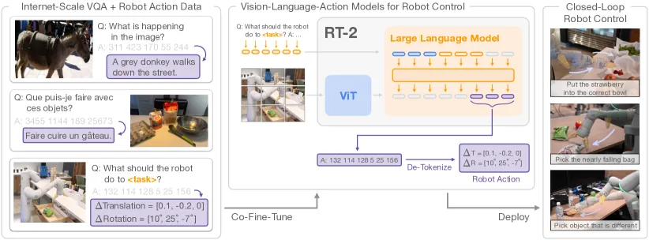
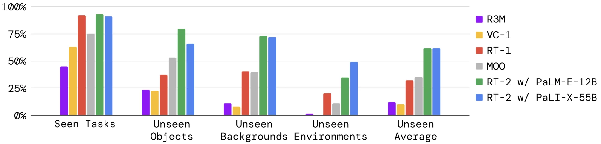

# RT-2 细粒度解读

> **arXiv**: 2307.15818 · Google DeepMind · 2023.07 · **路线**:离散动作 token(自回归)
> [← 返回主报告](../index.md)

## TL;DR
RT-2 把机器人动作直接表达成文本 token,从而把"控制"变成了 VLM 的一种"语言生成"任务:同一个视觉-语言模型既能回答 VQA,又能输出末端执行器的动作。作者在网络规模的视觉-语言数据(VQA、图文等)与机器人轨迹数据上对 PaLI-X(5B/55B)与 PaLM-E(12B)做**联合微调(co-fine-tune)**,得到 Vision-Language-Action(VLA)模型。其核心贡献是证明了"网络知识可以迁移到低层机器人控制":RT-2 在未见过的物体、背景、环境上的泛化能力相比 RT-1 约有 2 倍提升,并涌现出符号理解、初步推理、人物识别等单靠机器人数据学不到的能力。它是把大规模 VLM 范式引入端到端机器人控制的奠基性工作之一。

## 1. 要解决的问题
机器人模仿学习长期受困于**泛化瓶颈**:策略只能在训练分布内的物体、场景、指令上工作,遇到新物体或新语义概念就失效。根本原因是机器人轨迹数据相对互联网数据极其稀缺且昂贵,无法覆盖开放世界的语义多样性。

与此同时,视觉-语言模型(VLM)已经在网络规模数据上学到了海量的物体、概念、关系与常识知识。一个自然的问题是:**能否把 VLM 在网络上学到的语义知识直接注入端到端的机器人控制,而不只是当作一个外挂的高层规划器?** RT-2 给出的答案是:让 VLM 本身直接输出低层动作,把动作当成"另一种语言",这样网络预训练带来的泛化与语义理解就能顺着同一个模型一路传导到控制层。

## 2. 方法与架构

*图注(对应论文 Figure 1):RT-2 总览。机器人动作被表示为"另一种语言",可被转写成文本 token,与互联网规模的视觉-语言数据一起训练;推理时再把生成的文本 token 反量化(de-tokenize)为机器人动作,实现闭环控制。由此 VLM 的主干和预训练知识被直接用于学习机器人策略,把其泛化与语义理解迁移过来。*

RT-2 的全部"魔法"集中在一个朴素却关键的工程契约上:**把机器人动作改写成一段普通的文本字符串**,这样视觉-语言模型(VLM)就不需要任何结构改动,既能继续做 VQA、又能在被问"该执行什么动作"时直接续写出动作。下面按 *动作空间与离散化 → 主干复用词表 → co-fine-tune 训练 → 推理与部署* 四层逐一拆开。

### 2.1 动作空间与离散化:把一个动作写成 8 个整数

RT-2 直接沿用 **RT-1(Brohan et al., 2022)的动作空间**,共 8 个维度:

| 维度 | 含义 | 类型 |
|---|---|---|
| `terminate` | 是否结束当前 episode(由策略自行触发,表示任务成功完成) | 离散命令 |
| `Δpos_x / Δpos_y / Δpos_z` | 末端执行器(end-effector)的 3 维平移增量 | 连续 |
| `Δrot_x / Δrot_y / Δrot_z` | 末端执行器的 3 维旋转增量(roll/pitch/yaw) | 连续 |
| `gripper_extension` | 夹爪开合程度 | 连续 |

也就是 **6-DoF 位姿增量 + 夹爪 + 终止标志**。除终止维度外,所有 **7 个连续维度各自被均匀离散化(uniform discretization)为 256 个 bin**,每维取 bin 的序号(ordinal,即 0–255 的整数)作为该维取值。于是一个完整动作 = **8 个整数**,作者把它们按固定顺序用**空格**拼接成一个字符串作为微调目标:

```
"terminate Δpos_x Δpos_y Δpos_z Δrot_x Δrot_y Δrot_z gripper_extension"
→ 例如 "1 128 91 241 5 101 127"
```

> ⚠️ **辟谣(高频误传)**:网上常说"RT-2 用 DCT + BPE 对动作做压缩 token 化"——这是**错误**的。RT-2 用的就是上面这种**最朴素的 256-bin 均匀离散化**,一动作恰好 8 个整数 token,既没有 DCT 频域变换,也没有对动作再跑一遍 BPE 合并。**DCT 压缩 token 化是后续 π0-FAST(FAST tokenizer)的做法**,与 RT-2 无关;混淆二者会严重误读 RT-2 的设计。

### 2.2 两种主干如何复用既有词表

把动作写成"整数串"之后,还要解决一个落地问题:这些整数怎么变成模型真正能生成的 **token**?RT-2 的回答是**尽量不改架构、直接借用 VLM 词表里已有的 token**,但两个主干借法不同:

- **RT-2-PaLI-X(5B / 55B)**:PaLI-X 的 tokenizer 本来就为 **1000 以内的每个整数保留了独立 token**。所以 0–255 的 bin 序号**天然有对应的整数 token**,作者**直接把动作 bin 映射到这些现成整数 token** 即可,无需任何额外处理。
- **RT-2-PaLM-E(12B)**:PaLM-E 的 tokenizer **没有**这种"每个整数一个 token"的便利表示。作者的做法是**挑出词表中使用频率最低的 256 个 token,覆写(overwrite)它们来充当 256 个动作 token**。作者指出,这种"用已有符号去承载新含义"的训练本质上是一种 **symbol tuning**,在 VLM 上已被验证可行。

无论哪种主干,整套动作词表都只占 **256 个 token**(对应 256 个 bin),不引入新的可训练嵌入层规模膨胀,这也是"几乎零架构改动"的关键。

### 2.3 co-fine-tune 训练配方与目标

**输入/输出格式**:输入 = 机器人相机图像 + 文本任务描述,统一封装成标准 **VQA 格式**——`"Q: what action should the robot take to [task instruction]? A:"`;输出 = 上面那串"数字/低频 token 组成的动作字符串"。

**co-fine-tune(共同微调,而非两阶段)**:这是 RT-2 训练配方里最被强调的技术细节。作者**不是**"先在网络数据上预训练、再单独在机器人数据上微调",而是把**机器人轨迹数据**与 **VLM 原始的网络规模视觉-语言数据**(VQA、captioning 等)**混进同一批次共同微调**。理由:只在机器人数据上微调会让模型遗忘网络预训练学到的抽象视觉概念;共同训练则让策略在微调期间**同时接触"网络抽象概念"和"低层机器人动作"**,从而保留泛化能力。实现上,作者通过**逐步提高机器人数据集的采样权重**来平衡每个 batch 中机器人数据与网络数据的比例(消融显示这种 co-fine-tune 显著优于纯机器人数据微调)。

**训练目标**:就是标准的**下一 token 交叉熵**——把动作当成普通文本"续写"出来,沿用 VLM 原生的自回归语言建模损失,**只在动作 token 段上计算 loss**(网络 VQA 样本则照常对自然语言答案算 loss)。正因为目标函数与普通 VLM 完全一致,动作生成才能无缝复用预训练带来的语义能力。

**输出约束(Output Constraint)**:RT-2 与普通 VLM 的一个重要区别是,面对机器人任务时它**必须只输出合法的动作 token**(才能下发到真机执行)。为此,作者在解码时做了**词表约束**:当 prompt 是机器人动作任务时,**只从合法动作 token 中采样**;而当处理普通视觉-语言任务时,仍允许输出完整自然语言词表。

### 2.4 推理流程与实时部署

**推理数据流(闭环)**:
1. 拼接当前图像 + 指令为 VQA prompt;
2. VLM **自回归**逐 token 解出动作字符串;
3. 解析回 **8 个整数**;
4. 对 7 个连续维**反离散化(de-tokenize)** 回 256-bin 对应的连续动作值,终止维取离散命令;
5. 下发给机器人执行 → 回到第 1 步,形成闭环控制。

**实时部署瓶颈**:这是 RT-2 已知最大代价。论文称 RT-2 是当时"用于直接闭环机器人控制的最大模型,规模超出以往一个数量级以上",**无法直接跑在桌面机或车载 GPU 上**。作者改为把模型部署在**多 TPU 云服务**上、机器人**通过网络远程查询**(还能用同一服务并发服务多台机器人)。实测推理频率:**RT-2-PaLI-X-55B 约 1–3 Hz**,**5B 版本约 5 Hz**——这一频率上限直接限制了它做高频、接触丰富控制的能力。

> 小结:三个主干规模为 **RT-2-PaLI-X(5B / 55B)** 与 **RT-2-PaLM-E(12B)**;评测主要在 **7-DoF 移动机械臂**上进行,动作空间即 2.1 节所述。

## 3. 关键设计与创新点
- **动作即语言**:把低层连续控制改写成离散文本 token 的自回归生成,使单一 VLM 无需结构改动即可同时做 VQA 和控制——这是 RT-2 最核心的范式贡献。
- **co-fine-tune 而非两阶段**:网络数据与机器人数据联合训练,显著缓解了"微调遗忘网络知识"的问题,是泛化与涌现能力的关键来源。
- **复用 VLM 既有词表**:PaLI-X 直接借用已有整数 token,PaLM-E 通过覆盖低频 token(symbol tuning)接入动作词表,几乎不改动模型架构。
- **端到端单模型**:网络语义知识一路传导到低层动作,而非把 VLM 仅当作高层规划器,后端再接一个独立的低层策略。
- **可扩展性验证**:同时给出 5B / 12B / 55B 多个规模,系统研究了模型规模、数据混合等设计选择对性能的影响。
- **涌现能力**:仅靠"动作即语言 + 联合训练"就涌现出符号理解、初步语义推理、人物识别等机器人数据中不存在的能力;配合 chain-of-thought 还能做多阶段语义推理。

## 4. 实验与关键结果

**速览表(先看口径,再看数值)**。RT-2 原论文只给"相对倍数 + 质性涌现",未公开逐类绝对百分比;故下表 4-1 为论文自报的**相对提升口径**,绝对数仅在后续 SimplerEnv 横评里出现(表 4-2)。

**表 4-1:RT-2 各泛化维度相对基线的提升(论文自报口径,⚠️ 作者自评)**

| 评测维度 | 设定 | 指标 | RT-2 相对表现 | 来源 |
|---|---|---|---|---|
| 已见训练任务 | in-distribution | 成功率 | 与各基线相近(无显著优势) | 本文 §4 prose ⚠️ |
| 未见物体/背景/环境 | 泛化(unseen) | 成功率 | 约为次优两基线(RT-1、MOO)的 **~2×** | 本文 §4 prose ⚠️ |
| 未见物体/背景/环境 | 泛化(unseen) | 成功率 | 约为其余基线的 **~6×** | 本文 §4 prose ⚠️ |
| 全类别综合 | 整体平均 | 成功率 | 最佳 RT-2-PaLI-X 比次优基线 RT-1 高 **>3×** | 本文 §4 prose ⚠️ |
| 符号理解 / 推理 / 人物识别 | 涌现能力 | 质性 | 仅 RT-2 具备(机器人数据中不存在) | 质性 / Figure(本文 §3、§4)|

> ⚠️ 口径说明:以上倍数均为 RT-2 原论文(Google DeepMind, 2023)自评、未经独立第三方复现;"~2× / ~6× / >3×"为论文文字结论,论文未在正文公开逐类绝对成功率(更细数字见论文 Figure 4 / 附录 Table,本文未复述未核实的具体百分比)。

**表 4-2:RT-2-X 在 SimplerEnv 上的基准定位(第三方横评口径,⚠️)**

| 模型 | 设定 | 指标 | 数值 | 来源 |
|---|---|---|---|---|
| RT-2-X | SimplerEnv · Google Robot · Visual Matching | 成功率 % | **46.3**(3 任务子集 60.5) | benchmarks.md / 主报告横评表 ⚠️ |
| RT-1-X | SimplerEnv · Google Robot · Visual Matching | 成功率 % | 42.4(3 任务子集 49.4) | benchmarks.md ⚠️(对照) |
| RT-1(真实策略) | SimplerEnv · Google Robot · Visual Matching | 成功率 % | 85.7 | benchmarks.md ⚠️(对照上界) |
| OpenVLA(7B 开源对标) | 29 任务 / 多本体真机 | 绝对成功率提升 | 以 1/7 参数 **+16.5%(绝对)超越 55B RT-2-X** | 主报告 §(OpenVLA)⚠️ |

> ⚠️ 口径说明:① SimplerEnv 为 **real-to-sim 仿真代理**评测,**Visual Matching** 口径用于还原真机成功率;Google Robot 有 3 任务子集 vs 4 任务平均两种口径,故同一模型出现两个数(RT-2-X 46.3 vs 60.5)。② RT-2-X 是 RT-2 在 Open X-Embodiment 多本体数据上的扩展版本,**与原论文 RT-2-PaLI-X/PaLM-E 不是同一评测**,此表仅用于在后续基准中给 RT-2 谱系一个定位。③ 多为提出方/评测方自评,非独立复现。④ OpenVLA 的 +16.5% 为另一套真机 29 任务口径,非 SimplerEnv,不可与上面三行混算。

要点解读如下。

评测约使用 6,000 条评估轨迹,核心结论:

- **整体泛化**:在已见训练任务上各方法相近;但在**未见物体 / 未见背景 / 未见环境**的泛化评测上,两个 RT-2 实例都明显领先——相比次优的两个基线(RT-1、MOO)约 **2 倍**提升,相比其他基线约 **6 倍**。
- **综合成功率**:在所有类别上 VLA 模型显著优于基线,其中最好的 **RT-2-PaLI-X 的平均成功率比次优基线 RT-1 高 3 倍以上**(数值见表 4-1)。
- **涌现能力(三类)**:作者将 RT-2 的涌现能力分为三类——**符号理解(symbol understanding)、推理(reasoning)、人物识别(human recognition)**。例子包括:把香蕉移到"2"这个数字旁、移到"二加一之和"旁、移到"三乘二的答案"旁、移到"最小的数字"旁;把杯子移到 Google / Android 标志旁等。这些指令要求模型把图像中的符号/逻辑与机器人动作关联起来,而机器人训练数据里并不包含这类语义。
- **两个主干的差异**:整体上 PaLI-X 基的模型在推理和人物识别上平均更强;而较小的 **PaLM-E 基模型在涉及数学推理的任务上反而更占优**,作者将其归因于两者预训练数据/配方的差异。
- **推理频率**:55B-PaLI-X 约 1–3 Hz,5B 约 5 Hz(见上)。

(注:更细的逐类数字见论文正文 Figure 4 与附录 Table 3 等;本文不复述未直接核实的具体百分比。)


*图注(对应论文 Figure 4):RT-2 两个实例与各基线在"已见训练任务"以及"未见物体/背景/环境"泛化评测上的整体成功率对比。*

## 5. 局限与争议
- **推理延迟与算力**:55B 模型仅 1–3 Hz,需部署在多 TPU 云服务上联网查询,难以做高频实时闭环或上车端侧;作者将量化、蒸馏列为未来方向。
- **闭源**:PaLI-X、PaLM-E 主干及模型权重均未开源,社区难以复现——这正是后续 OpenVLA 强调"开源、可在单卡微调"的动机。
- **离散化精度天花板**:256-bin 均匀量化对每个动作维度做粗粒度离散,理论上限制了动作精度/平滑度;这也是后续连续动作路线(扩散/流匹配)与更高效 token 化(DCT 压缩)试图突破的点。
- **动作表达受限于自回归**:逐 token 串行生成动作既慢又难以表达高频、多模态的连续控制分布。
- **评测以单臂桌面操作为主**:任务多为抓取/移动类,对接触丰富、长程灵巧操作的覆盖有限。

## 6. 在 VLA 谱系中的位置
RT-2 奠定了 **"VLM 主干 + 动作离散成 token + 自回归输出 + 与网络数据联合训练"** 这一整套范式,正式提出了 VLA(Vision-Language-Action)的概念,并首次有力地证明了网络语义知识可迁移到端到端低层控制。

- [[openvla]] 基本**继承**了 RT-2 的离散动作 token + 自回归范式,但把闭源主干换成开源的 Prismatic/Llama 系 VLM(7B),并提供可在消费级显卡上 LoRA 微调的开源实现,主打"开放与可复现",可视为 RT-2 思路的开源化与平民化。
- [[pi0]] 则在动作建模上**反叛**了离散自回归路线:改用 flow matching / 扩散式的连续动作专家(action expert),追求高频、平滑、多模态的连续控制,以突破 RT-2 离散化的精度与频率天花板;π0-FAST 等进一步用 DCT 压缩做高效动作 token 化(注意这才是 DCT,RT-2 并未使用)。

可以说,RT-2 是离散 token VLA 的"原点",后续工作大体沿着"开源化"(OpenVLA)与"连续动作化"(π0 系)两条线对它继承或修正。

## 来源
- 论文:arxiv.org/abs/2307.15818(RT-2: Vision-Language-Action Models Transfer Web Knowledge to Robotic Control,Google DeepMind, 2023)
- 全文与图片:ar5iv.org/abs/2307.15818(arXiv HTML 镜像,Figure 1 / Figure 4 即本文配图)
