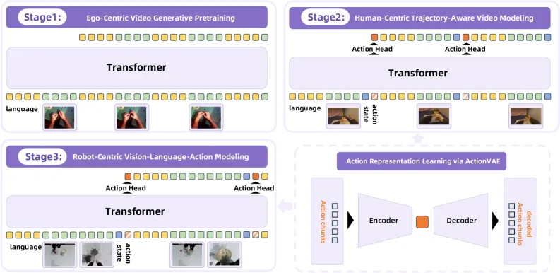
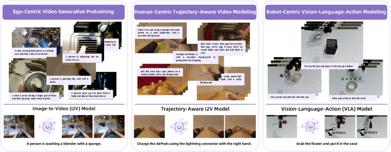

# RynnVLA-001:用人类示范视频生成预训练驱动机器人操作的 VLA

> **arXiv**: [2509.15212](https://arxiv.org/abs/2509.15212) (v1)
> **机构**: 阿里巴巴达摩院(DAMO Academy, Alibaba Group)+ 湖畔实验室(Hupan Lab)
> **时间**: 2025.09(ICRA 2026 接收)
> **路线**: 第三条路 —— **自回归视频生成基座**(从文生图模型 Chameleon 扩展为图生视频 I2V)+ **ActionVAE 连续动作压缩**;把 **next-frame(下一帧)与 next-action(下一动作)统一在单个 autoregressive transformer** 里,核心是把**人类示范技能迁移到机器人**

> [← 返回主报告](../index.md)

---

## TL;DR

RynnVLA-001 是阿里达摩院 + 湖畔实验室提出的一个 **7B 级** 视觉-语言-动作模型,它最与众不同的地方在于**主干来源**:它**不是**当下主流的 Qwen2.5-VL / PaliGemma 这类 VLM + 动作专家路线,而是把一个**自回归(AR)文生图模型 Chameleon 扩展成图生视频(Image-to-Video, I2V)模型**,先在**约 1200 万条第一视角(ego-centric)人类操作视频**上做**生成式预训练**(预测未来帧),再一步步把"会预测人类操作未来"的能力**迁移到机器人控制**上。

它的核心主张是:**视频生成预训练学到的"世界如何随操作演变"的先验,是比纯 VLM 预训练更好的 VLA 初始化**。围绕这一点有三个标志性设计:

1. **三阶段渐进训练**:① 第一视角视频生成式预训练(1200 万视频,纯预测未来帧)→ ② 人类轨迹建模(human-centric, trajectory-aware,在视频里**联合预测未来帧 + 人手关键点轨迹**,把"看"和"动"接起来)→ ③ 机器人 VLA(换上机器人数据、用 ActionVAE 输出动作)。一条**从人类示范到机器人控制**的迁移链。
2. **next-frame + next-action 统一在单个 transformer**:同一个自回归主干既能预测下一帧画面、又能预测下一步动作。**注意:这种"统一"主要发生在训练阶段**——推理时为了效率,**丢弃未来视觉 token 的生成,只输出动作嵌入**,把"预测未来帧"当作一个正则化/表征学习的辅助任务而非推理必需品。
3. **ActionVAE**:用一个变分自编码器(VAE)把**每个动作块(action chunk)压成一个紧凑的连续隐向量(latent embedding)**,再解码回一段连贯的低层动作序列。它把 VLA 的输出空间从"逐步预测高维动作"压缩成"预测一个紧凑隐向量",降低输出复杂度并保证动作的平滑与时序连贯。

报告成绩:在三项真机任务上平均成功率 **90.6%**,优于 π0 的 **70.4%** 与 GR00T N1.5 的 **55.6%**;权重与代码开源([GitHub: alibaba-damo-academy/RynnVLA-001](https://github.com/alibaba-damo-academy/RynnVLA-001))。

> ⚠️ **可信度提示**:第 4 节中全部真机数字(90.6% / 70.4% / 55.6% 等)均为**作者团队自评**,在自采的 LeRobot SO100 三任务数据集上、对 π0 / GR00T N1.5 用相同机器人数据微调后比较得到,**非独立第三方复现**。其优势声明应结合"评测任务集较窄、由作者设定"这一点来理解。

---

## 1. 要解决的问题

机器人操作数据稀缺且昂贵,是 VLA 的根本瓶颈。主流做法是借 **VLM 预训练**(Qwen-VL、PaliGemma 等)把互联网图文常识注入 VLA。RynnVLA-001 提出了一条不同的思路,围绕三个问题:

1. **更好的预训练先验从哪来?** 静态图文(VLM)教会模型"这是什么",却很少教"操作之后世界会怎么变"。RynnVLA-001 的核心假设是:**人类操作视频里蕴含的"未来如何演变"的动态先验,对操作类任务是更对口的初始化**——预测未来帧本质上就是在学习一个隐式的、以动作为条件的世界模型。
2. **人类示范如何迁移到机器人?** 人类操作视频海量易得,但人手运动学与机器人机械臂差异巨大,不能直接拿来当动作监督。需要一个**桥梁**:既要利用人类视频的视觉动态先验,又要跨越"人手→机械臂"的本体鸿沟。RynnVLA-001 用**人手关键点轨迹**作为中间表征,在第二阶段把"预测帧"渐进过渡到"预测轨迹/动作"。
3. **怎样统一"预测未来"与"预测动作",又不牺牲推理效率?** 既有的"先生成未来子目标图、再据此预测动作"的方法,推理时要真的生成图像,昂贵且慢。RynnVLA-001 选择**把未来帧预测仅作为训练期的辅助目标**,推理时直接丢弃,只输出动作,兼顾"生成式先验的好处"与"实时控制的效率"。

定位:RynnVLA-001 把 VLA 的预训练范式从"VLM 图文常识"换成"**视频生成式动态先验**",并配套设计了从人类到机器人的三阶段迁移链与 ActionVAE 动作表征。

---

## 2. 方法与架构

RynnVLA-001 的主干是一个**自回归 Transformer**,由文生图模型 **Chameleon** 扩展而来去做 I2V(图生视频)。整个方法是一条**三阶段渐进训练链**(见图 2),外加一个独立训练的 **ActionVAE** 作为动作表征模块。下面分:2.1 自回归视频生成主干,2.2 三阶段训练,2.3 ActionVAE,2.4 推理时的关键取舍,2.5 机器人系统与数据。

> **图注(译自原文 Figure 2,Model architecture and training stages)**:训练分三个阶段。**(1) 第一视角视频生成式预训练**:训练一个基于 transformer 的图生视频(I2V)模型做未来帧预测。**(2) 人类轨迹建模**:在 I2V 模型上扩展出**动作(轨迹)预测头**,同时引入视觉与状态嵌入(图中蓝色块)。**(3) 机器人 VLA 建模**:把预训练权重迁移到机器人数据上,模型据此学习"视觉 + 语言 + 状态 → 机器人动作"的映射。

### 2.1 自回归视频生成主干:从 Chameleon 扩展到 I2V

主干刻意选择了**自回归 Transformer** 而非扩散模型。论文坦言:由于"基于 AR 的视频生成框架"可用资源有限,他们**扩展了一个强大的 AR 图像生成模型 Chameleon** 来执行 I2V 任务——即把"文本 → 图像"的 AR 生成,扩展为"初始帧 + 文本指令 → 未来若干帧"的 AR 生成。这样,视觉被离散化为 token,与文本 token 一起走统一的 next-token 自回归通道,这正是后续能把"next-frame"与"next-action"统一进同一个 transformer 的结构基础。

值得强调的是路线上的几处区分:

- **Qwen2-VL 在这里只是辅助标注工具**,不是主干。对每条筛选后的视频,作者用 **Qwen2-VL-7B** 生成**简短的文本描述**(刻意保持短,以贴近机器人学习里常见的自然语言指令,如"put the bottle in the box""open the drawer"),这些文本描述只是用作 I2V 的语言条件 / 指令标注,并不参与构成动作主干。
- **与"视频预测只当预训练、推理不用"的前作(如 GR-2、VPP)同源但更进一步**:RynnVLA-001 把视频生成预训练做得更彻底(自回归主干 + 1200 万 ego 视频 + 人手轨迹桥接),并在第三阶段把它真正转成动作策略。

### 2.2 三阶段渐进训练:从人类视频到机器人控制

> **图注(译自原文 Figure 1,Training data pipeline)**:框架使用三类训练数据。**(1) 第一视角视频生成式预训练**:用数百万条第一视角人类操作视频做未来帧预测。**(2) 人类轨迹建模**:用带**人手关键点标注**的视频训练,实现**帧 + 轨迹的联合预测**。**(3) 机器人 VLA 建模**:用配有语言指令的机器人数据集,学习"从视觉观测到机器人动作"的映射。

- **① 第一视角视频生成式预训练(Ego-Centric Video Generative Pretraining)**:在**约 1200 万条第一视角人类操作视频**上训练 I2V 模型,任务是**给定初始帧 + 语言指令,自回归预测未来帧**(可视化分析里展示的是预测未来 **7 帧**)。这一步让模型学到"以操作为条件、画面如何演变"的视觉动态先验。这些视频经过专门的 **Ego-Centric 视频数据筛选流水线**(原文第 4 节)挑选出真正含第一视角人类操作的片段。
- **② 人类轨迹建模(Human-Centric Trajectory-Aware Video Modeling)**:在第一阶段 I2V 模型上**扩展出动作(轨迹)预测头**,在带**人手关键点标注**的视频上训练,要求模型**联合预测未来帧 + 未来人手关键点轨迹**,并引入视觉与状态嵌入(图 2 蓝色块)。这一步是关键桥梁:它把"预测画面"与"预测动作"显式接起来,让模型从"看人操作"过渡到"预测人怎么动"。
- **③ 机器人 VLA 建模(Robot-Centric Vision-Language-Action Modeling)**:把前两阶段的预训练权重**迁移到自采机器人数据**上,模型在 RGB 观测 + 语言指令条件下预测**动作块(action chunks)而非单步动作**,动作经 **ActionVAE** 表征。一个关键改动在动作头:**由于人手轨迹与机器人机械臂运动学差异巨大,第二阶段预训练好的动作头被丢弃**,改为一个**新初始化的轻量动作头(单层线性层)**来预测机器人动作嵌入。输入序列被刻意构造成与真实部署场景一致(沿用相同的占位符结构)。

三阶段的内在逻辑:**人类视频(广、动态先验)→ 人手轨迹(桥接视觉与动作)→ 机器人数据(落地为可执行动作)**,核心是把**人类示范里的操作技能逐级迁移到机器人**。

### 2.3 ActionVAE:把动作块压成一个紧凑连续隐向量

为提升动作表征质量,论文提出 **ActionVAE**——一个变分自编码器,**把一段动作序列(action chunk)编码成紧凑的连续隐向量(latent embedding),再解码回一段连贯的低层动作序列**。它的作用有二:

1. **降低 VLA 输出空间复杂度**:VLA 主干不必逐维、逐步去回归高维动作,而只需预测**一个紧凑隐向量**,由 ActionVAE 解码器负责把它展开成完整的多步动作块。
2. **保证动作的平滑与时序连贯**:由 VAE 解码器统一生成整段动作,天然比逐步自回归更平滑、更连贯。

这与 VLA 领域处理动作表征的其他思路形成对照:离散化 tokenizer(如 FAST)效率高但**离散化常带来精度损失**;VQ-VLA 用 VQVAE 把动作块离散化以改善精度;还有一类直接接**连续动作策略头**(扩散 / 流匹配)。ActionVAE 属于"**连续隐表征**"一路——用连续隐向量而非离散 token 承载动作块,既压缩了输出空间又保留连续精度。

### 2.4 推理:统一是训练期的,推理期只出动作

> **一个核心取舍**:训练时主干"统一"了 next-frame 与 next-action;但**推理时,模型在闭环控制循环中,每一步接收语言指令 + 当前 RGB 观测 + 当前机器人状态,只预测动作嵌入,丢弃未来视觉 token 的生成**。论文明确指出:**预测未来帧主要是一个有价值的辅助/正则化任务(用于表征学习),而非推理时的直接组件**。这样既享受了视频生成预训练带来的动态先验,又避免了推理时真的去生成图像所带来的昂贵开销,保证实时闭环控制效率。

### 2.5 机器人系统与数据

- **机器人平台**:**LeRobot SO100** 机械臂,数据为人类遥操作(teleoperation)采集的专家示范。
- **相机配置**:前置相机(front camera)+ 腕部相机(wrist camera)双相机。论文专门做了相机功能分析(图 5/6):**前置相机负责粗定位**——遮住前置相机、仅留腕部相机时,若目标在腕部相机初始视野内仍可完成,否则成功率从 80%(4/5)掉到 0%;**前置相机还提供关键的 3D 投影信息**用于精确操作(把前置相机抬高、改变投影几何会导致插笔任务失败),说明模型对特定相机配置/3D 几何有依赖。
- **评测任务(图 3)**:三项桌面操作 —— ①抓放绿色方块、②抓放草莓、③抓笔放入笔筒;每项含**单目标 / 多目标 / 带干扰物的指令跟随**三种设置。

---

## 3. 关键设计与创新点

1. **视频生成式预训练作为 VLA 的"第三条路"**:不走"VLM 图文常识 + 动作专家"主流,而是用**自回归视频生成(I2V)在 1200 万人类操作视频上预训练**,学到以动作为条件的视觉动态先验,作为更对口操作任务的初始化。
2. **从人类到机器人的三阶段迁移链**:视频生成 → 人手轨迹联合预测 → 机器人动作,用**人手关键点轨迹**作中间表征跨越"人手→机械臂"的本体鸿沟,把人类示范技能迁移到机器人。
3. **next-frame 与 next-action 统一在单一自回归 transformer**:训练期统一两类预测共享主干;推理期**只出动作、丢弃未来帧生成**,把"预测未来"降格为正则化辅助任务,兼顾先验收益与实时效率。
4. **ActionVAE 连续隐动作表征**:把动作块压成一个紧凑连续隐向量再解码,降低输出空间复杂度、保证动作平滑连贯,区别于 FAST(离散精度损失)与 VQ-VLA(离散量化)。
5. **从 Chameleon 扩展自回归 I2V**:在缺少成熟 AR 视频框架的情况下,直接把 AR 文生图模型扩展成 I2V,使视觉与文本(乃至动作)能共享统一 next-token 通道。

---

## 4. 实验与关键结果

> ⚠️ 以下数字均为**作者自评**,在自采 LeRobot SO100 三任务数据集上、将 π0 与 GR00T N1.5 用**相同机器人数据微调**后比较得到,无独立第三方复现。

**(1) 与 SoTA 的对比(原文 Table 2,三任务平均成功率)**

| 模型 | 抓放绿块 | 抓放草莓 | 抓笔入筒 | **三任务平均** |
|---|---|---|---|---|
| GR00T N1.5 | 65.0 | 53.3 | 48.3 | **55.6** |
| π0 (Pi0) | 75.6 | 71.1 | 64.4 | **70.4** |
| **RynnVLA-001 (Ours)** | 90.0 | 91.7 | 90.0 | **90.6** |

RynnVLA-001 在三项任务上**全面高于** GR00T N1.5 与 π0,平均成功率 90.6% vs 70.4% vs 55.6%。每项评测含单目标 / 多目标 / 带干扰物指令跟随三种设置。

**(2) 预训练有效性**
为验证 RynnVLA-001 预训练权重的价值,作者在**相同机器人操作数据**上分别微调 RynnVLA-001、GR00T N1.5、π0,RynnVLA-001 一致取得更高成功率,论文据此论证"**视频生成式预训练框架提供了比基线更有效的 VLA 初始化**"。

**(3) 关于更严格的 SR@1 指标**
在更严苛的 SR@1(一次成功)指标上,RynnVLA-001 与 π0 表现**相当**;三个模型的 SR@1 都偏低,作者承认"操作精度仍有很大提升空间",意味着当前优势更多体现在整体/多次尝试成功率上,而非一次成型的精度。

**(4) 视频预训练可视化与相机分析(图 4/5/6)**
- 视频预训练模型给定输入图 + 文本 prompt 能预测后续 7 帧,生成**合理运动**且与输入帧保持一致性,佐证其学到了操作动态先验。
- 前置相机消融(见 2.5):前置相机对**粗定位**与**3D 精确操作**都关键,揭示模型对相机配置/3D 几何的依赖。

---

## 5. 局限与争议

1. **全为作者自评、评测面窄**:所有真机数字来自作者团队在**自采的三项桌面任务**上的评测,任务集由作者设定、范围较窄(抓放方块/草莓、插笔),无独立第三方复现;对 π0 / GR00T N1.5 的"相同数据微调"复现是否充分调参也由作者把握。优势声明的强度需结合这些来理解。
2. **一次成功率(SR@1)仍低**:三个模型 SR@1 都偏低,RynnVLA-001 在该指标上仅与 π0 相当,说明"高平均成功率"部分依赖多次尝试,**单次精确操作仍是短板**。
3. **对相机配置/3D 几何敏感**:消融显示模型严重依赖前置相机做粗定位与 3D 投影信息,改变相机位置即可使任务失败,泛化鲁棒性存疑。
4. **"统一"主要在训练期、推理期被简化**:next-frame + next-action 的统一在推理时退化为"只出动作",未来帧生成被丢弃。这是务实的效率取舍,但也意味着"统一世界模型 + 策略"的完整形态并未在部署中真正运行。
5. **人类→机器人迁移的边界未充分探讨**:第二阶段动作头在第三阶段被**整个丢弃**、换成新初始化线性层,说明人手轨迹与机器人动作的鸿沟仍需靠机器人数据重新学;视频先验究竟迁移了多少、迁移到何种程度,缺乏更细的解耦分析。

---

## 6. 在 VLA 谱系中的位置

- **与 [[qwen-vla]] 同属阿里,路线却迥异**:同为阿里体系的 VLA,但 RynnVLA-001 **不用 Qwen2.5-VL 主干**(Qwen2-VL 在此仅作辅助文本标注工具),而是另起炉灶用**自回归视频生成模型 Chameleon** 扩展为基座。一家两路,代表了"VLM 路线"与"视频生成路线"的并行探索。
- **以 [[pi0]] 与 [[groot-n1]] 为对比基线**:论文直接拿 π0 与 GR00T N1.5 在相同机器人数据上对照,主张视频生成预训练是比它们(VLM/扩散基座 + 动作专家)更有效的初始化。这构成 RynnVLA-001 与主流"VLM + 动作专家"范式最直接的正面比较。
- **与 [[octo]] 同含生成式思想,但取向不同**:Octo 把扩散式生成思想用于**动作生成头**;RynnVLA-001 则把生成式思想用在**预训练目标(视频未来帧生成)**上,动作侧反而用 ActionVAE 的连续隐表征。两者都"生成",但生成的对象与目的不同。
- **VLA 的第三条路线**:VLA 长期有两条主线 —— "离散 token 自回归"([[rt2]]、[[openvla]])与"连续流匹配/扩散动作专家"([[pi0]]、[[groot-n1]])。RynnVLA-001 提出的"**视频生成式预训练 → 动作**"(用人类操作视频学动态先验,再迁移到机器人),可视为有别于上述两者的**第三条路**:它的差异不在动作输出形式,而在**预训练先验从何而来**。

一句话:**RynnVLA-001 用"自回归视频生成预训练(从 Chameleon 扩展的 I2V)+ 人手轨迹桥接 + ActionVAE 连续动作表征"的三阶段迁移链,把 VLA 的预训练范式从"VLM 图文常识"换成"人类操作视频的动态先验",并自评在三项真机任务上以 90.6% 的平均成功率超过 π0(70.4%)与 GR00T N1.5(55.6%);代价是评测面较窄、SR@1 仍低、结论尚待第三方验证,但它为 VLA 提供了一条区别于主流 VLM 主干的、值得关注的"第三条路"。**

---

## 来源

- 论文:RynnVLA-001: Using Human Demonstrations to Improve Robot Manipulation. arXiv:2509.15212 (DAMO Academy, Alibaba Group + Hupan Lab, 2025.09;ICRA 2026 接收). <https://arxiv.org/abs/2509.15212>
- HTML 全文(图 1/2 来源):<https://arxiv.org/html/2509.15212v1>
- 代码与权重(开源):<https://github.com/alibaba-damo-academy/RynnVLA-001>
- 架构图:本仓库 `images/rynnvla_arch.webp`(原文 Figure 2 模型架构与三阶段训练,源文件 `x2.png`)
- 数据流水线图:本仓库 `images/rynnvla_pipeline.webp`(原文 Figure 1 三类训练数据/训练数据流水线,源文件 `x1.png`)

> 说明:第 4–5 节中的全部真机数字与对比结论均为**作者团队自评**(自采 LeRobot SO100 三任务数据集),非独立第三方复现,引用时请注明其自评属性。
