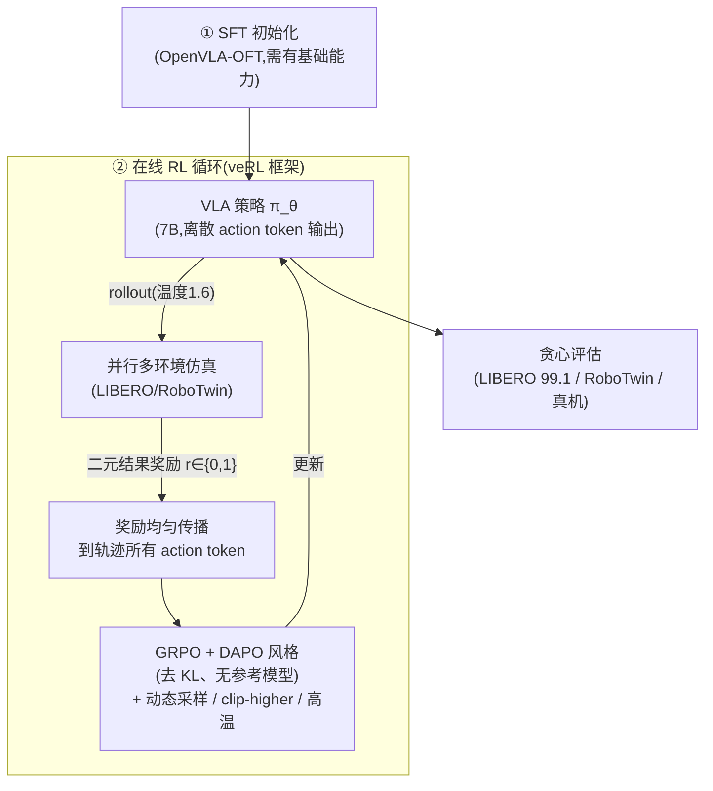
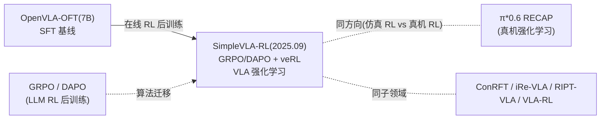

# SimpleVLA-RL:给 VLA 做在线强化学习后训练

> **arXiv**: [2509.09674](https://arxiv.org/abs/2509.09674)(2025.09,ICLR 2026)
> **机构**: 清华大学 / 上海 AI Lab / 北京大学(PRIME-RL 团队)
> **作者**: Haozhan Li, Yuxin Zuo, Jiale Yu, … Jiangmiao Pang, Shanghang Zhang, Yu Wang, Yao Mu, Bowen Zhou, Ning Ding(21 人)
> **路线**: VLA 专用在线 RL 后训练(作用于 [OpenVLA-OFT](openvla-oft.md))
> **代码**: <https://github.com/PRIME-RL/SimpleVLA-RL>

> [← 返回主报告](../index.md)

---

## TL;DR

SimpleVLA-RL 是**本站首篇「VLA 在线强化学习(RL)后训练」**专题:它不造新模型,而是给已有的 VLA(主要是 [OpenVLA-OFT](openvla-oft.md))加一套**端到端在线 RL 框架**,在仿真环境里让策略自己 rollout、用**结果奖励**学习,显著超过纯模仿学习(SFT)的天花板。

把 LLM 圈成熟的 **GRPO**(Group Relative Policy Optimization)搬到 VLA,关键改造:

1. **VLA 专用的 RL 框架**(基于 **veRL**):集成「交互式轨迹采样 + 并行多环境渲染 + 训练-推理-渲染一体化」,解决 VLA 比 LLM 多出的「要和仿真环境交互」这一环。
2. **结果奖励 + 均匀传播**:只给**二元结果奖励**(成功=1,失败=0),再均匀分配到这条轨迹的**所有 action token**——无需稠密 reward 设计。RL 算法用 GRPO + **DAPO 风格修改**(去掉 KL 正则、无参考模型)。
3. **三项探索增强**:动态采样(剔除全成功/全失败组)、clip-higher(ε 上界放宽到 0.28)、高采样温度(1.6)——带来一致的 10–15% 提升。
4. **离散 action token 输出**:把 OpenVLA-OFT 官方的 MLP 连续回归(L1)改回**离散 token + 交叉熵**,因为「与 PPO 类 RL 算法最兼容」。

⚠️ 战绩:**LIBERO 平均 99.1**(Spatial/Object/Goal/Long = 99.4/99.1/99.2/98.5),超 OpenVLA-OFT 基线 +8.1、超 π0 的 94.2;**RoboTwin1.0 +30.6、RoboTwin2.0 +30.5**;真机 sim2real +21.0。最亮眼的是**数据效率**:**单条演示(One-Traj)SFT 后再 RL**,把 LIBERO-Long 从 17.3% 抬到 **91.7%**、平均达 96.9%(逼近用完整数据 SFT 的 91.0)。训练时还**涌现出「Pushcut」行为**——策略发现了演示数据里不存在的「推一下」捷径,类似 DeepSeek-R1 的「Aha Moment」。

一句话:**SimpleVLA-RL = 「把 GRPO 搬进 VLA」的简洁配方——用 veRL 搭起 VLA 专用的在线 RL(交互采样+并行渲染),只靠二元结果奖励 + 三项探索增强,就把 OpenVLA-OFT 在 LIBERO/RoboTwin/真机上大幅推高,并展现「一条演示即可拉起」的极端数据效率与自发涌现的捷径行为;它给本站补上了完全缺失的「VLA 强化学习后训练」主线。**

> ⚠️ **可信度提示**:本页全部定量(LIBERO 99.1、各 +Δ、单轨迹 91.7、真机 38.5 等)为**作者自评**(ICLR 2026,代码开源但无第三方独立复现)。论文**未评测 SimplerEnv 与 CALVIN**(不予补造)。一个重要边界:**零能力基模型下 RL 完全失效**——0-traj SFT 的模型保持 0%(无成功轨迹可采样),即 RL 增益**强依赖 SFT 初始能力**。训练墙钟时长一手未给(标待核)。

---

## 1. 要解决的问题

VLA 主流靠**模仿学习(SFT / 行为克隆)**:喂演示、学映射。但 SFT 有天花板:

1. **受演示质量与覆盖约束**:学不到演示里没有的更优策略,泛化与鲁棒性有限。
2. **数据昂贵**:真机演示采集成本高,想靠堆数据涨点不可持续。
3. **LLM 的 RL 后训练(RLHF/GRPO)已被证明能突破 SFT 天花板**,但搬到 VLA 有独特障碍:VLA 要**和环境交互** rollout(不像 LLM 只生成文本),工程上需要「采样-渲染-训练」一体化;且动作表示、奖励设计、探索都需重新适配。

SimpleVLA-RL 的问题就是:**能否用一套简洁、通用的在线 RL 配方,把现成 VLA(OpenVLA-OFT)在仿真里自我提升到远超其 SFT 基线?** 并且——**在演示极少(甚至一条)时,RL 能否补上数据缺口?**

> 📌 这与 [π0.6 / π*0.6](pi06.md) 的 RECAP 真机 RL 是同一大方向(「从经验中学习」,见 [知识隔离](knowledge-insulation.md) 与 [数据处理](data-processing.md)),但 SimpleVLA-RL 走**仿真在线 RL + 开源通用框架**,作用于开源的 OpenVLA-OFT,可复现性更高。

---

## 2. 方法与架构

### 2.1 两阶段:先 SFT 后 RL

- **阶段一 SFT**:用演示初始化(LIBERO 500 demos/suite、RoboTwin1.0 50/task、RoboTwin2.0 1000/task)。**SFT 必须给出基础能力**——这是 RL 能起作用的前提(见 §6 失效模式)。
- **阶段二 在线 RL**:在对应仿真场景(500/100/1000 场景)里让策略自己 rollout、按结果奖励更新。

### 2.2 RL 算法:GRPO + DAPO 风格

- **GRPO**:同一初始状态采样多条轨迹(sampling_count=8),用**组内相对优势**更新,无需价值网络。
- **DAPO 风格修改**:**去掉 KL 正则、无参考模型**——更适合 VLA 这种远离语言先验的任务。
- **奖励**:**二元结果奖励**(成功 1 / 失败 0),**均匀传播**到整条轨迹的所有 action token——极简,无需手工稠密 reward。
- **关键超参**:lr=5e-6,train_batch=64,mini_batch=128,**ε_low=0.2 / ε_high=0.28(clip-higher)**,**温度=1.6**,最大交互步 LIBERO=512 / RoboTwin=200–800。

### 2.3 三项探索增强(+10–15%)

1. **动态采样(dynamic sampling)**:剔除「全成功」或「全失败」的组(它们梯度为零、无学习信号)。
2. **clip-higher**:PPO 裁剪上界从 0.2 放宽到 **0.28**,鼓励探索。
3. **高采样温度 1.6**:rollout 时更高随机性以探索,评估时贪心。

### 2.4 动作表示:改回离散 token

OpenVLA-OFT 官方用 **MLP 连续动作回归(L1 loss)**;SimpleVLA-RL 改回 **256 个离散 action token + 交叉熵**——因为「token 分布解码与 PPO 类 RL 算法最兼容」(RL 需要明确的动作概率分布)。保留 OFT 的**并行解码与动作分块**(LIBERO chunk=8,RoboTwin=25)。硬件:**8×A800 80GB 全参数训练**。

---

## 3. 关键设计与创新点

1. **VLA 专用在线 RL 框架(基于 veRL)**:把「交互式轨迹采样 + 并行多环境渲染 + 训练-推理-渲染」一体化,解决 VLA 比 LLM 多出的环境交互环节。
2. **极简奖励 + GRPO/DAPO**:只用二元结果奖励均匀传播,去 KL/无参考模型,无需稠密 reward 工程。
3. **三项探索增强**:动态采样 / clip-higher / 高温,稳定带来 10–15% 提升。
4. **极端数据效率**:单条演示 SFT + RL,把 LIBERO-Long 从 17.3 抬到 91.7,平均 96.9 逼近完整数据 SFT。
5. **涌现「Pushcut」**:RL 自发发现演示中不存在的推动式捷径(类 DeepSeek-R1「Aha Moment」),证明 RL 在探索出新策略,而非只是拟合。

---

## 4. 实验与关键结果

> ⚠️ 全部为**作者自评**(ICLR 2026;代码开源,无第三方复现)。每基准测 3 次,rollout 随机采样、评估贪心。

### 4.1 LIBERO(⚠️ 自评)

| 模型 | Spatial | Object | Goal | Long | **平均** |
|---|---|---|---|---|---|
| OpenVLA-OFT(基线) | 91.6 | 95.3 | 90.6 | 86.5 | 91.0 |
| π0 | 96.8 | 98.8 | 95.8 | 85.2 | 94.2 |
| UniVLA | 96.5 | 96.8 | 95.6 | 92.0 | 95.2 |
| **SimpleVLA-RL** | **99.4** | **99.1** | **99.2** | **98.5** | **99.1** |

→ 平均 **+8.1** vs OpenVLA-OFT 基线,超 π0(94.2)。50 held-out 场景/任务。

### 4.2 RoboTwin & 真机(⚠️ 自评)

| 基准 | SimpleVLA-RL | 基线对照 | 增益 |
|---|---|---|---|
| **RoboTwin1.0**(平均) | **92.6** | OpenVLA-OFT 67.2 / DP3 64.7 | **+30.6** |
| **RoboTwin2.0**(12 任务整体) | **68.8** | OpenVLA-OFT 38.3 / π0 49.2 / RDT 33.3 | **+30.5** |
| **真机 sim2real**(4 任务平均) | **38.5** | OpenVLA-OFT 17.5 / RDT 23.5 | **+21.0** |

### 4.3 数据效率:单轨迹的威力(⚠️ 自评,核心卖点)

| 设定 | 基线(纯 SFT) | SFT + RL | 增益 |
|---|---|---|---|
| **One-Traj**(单演示)SFT+RL 平均 | 48.9 | **96.9** | **+48.0** |
| 其中 LIBERO-Long(单演示) | 17.3 | **91.7** | +74.4 |
| **Full-Traj**(完整)SFT+RL 平均 | 91.0 | 99.1 | +8.1 |

→ **演示越少,RL 增益越大**——单条演示就能把模型从「几乎不会」拉到「接近满分」。

### 4.4 失效模式:能力阈值(⚠️ 自评,重要边界)

| SFT 数据量(RoboTwin2.0 平均) | RL 前 → RL 后 |
|---|---|
| **0-traj**(零能力) | **0 → 0**(完全失效) |
| 100-traj | 7.3 → 25.4(+18.1) |
| 1000-traj | 28.2 → 50.4(+22.2) |

→ **零能力基模型下 RL 完全失效**:结果奖励下采不到任何成功轨迹,就没有学习信号。**RL 增益强依赖 SFT 初始能力**,存在能力阈值。

---

## 5. 在 VLA 谱系中的位置

- **作用于 [OpenVLA-OFT](openvla-oft.md)**:把开源 SFT 基线作起点,RL 后训练大幅推高——「会用 RL 自我提升的 OpenVLA-OFT」。
- **从 LLM 借 GRPO/DAPO**:把语言模型 RL 后训练的成熟算法迁到 VLA,改造动作表示与环境交互。
- **与 [π*0.6 RECAP](pi06.md) 同方向、不同路径**:都「从经验中学习」,但 π*0.6 是**真机 RL**(逐任务专家),SimpleVLA-RL 是**仿真在线 RL + 开源通用框架**,可复现性更高。
- **VLA-RL 子领域的开源锚点**:与 ConRFT、iRe-VLA、RIPT-VLA、VLA-RL 同属「VLA 强化微调」这一新兴方向;SimpleVLA-RL 热度最高(~1.7k★)、直接挂在已收录的 OpenVLA-OFT 上,适合作本站该子线的入口。

---

## 6. 局限与存疑

1. **零能力基模型下完全失效**:0-traj SFT 保持 0%,因结果奖励下无成功轨迹可采样——RL 不是「凭空学会」,需 SFT 给出可探索的基础能力。
2. **存在能力阈值**:初始成功率极低时 RL 增益边际(如 pick dual bottles 在 100-traj SFT 下仅 1.2%→4.3%)。
3. **强依赖 SFT 起点**:更强的 SFT 初始化 → 更大的 RL 提升,需要合理的 SFT 初始化预算。
4. **未测 SimplerEnv / CALVIN**:论文未涉及这两个常用基准,跨基准可比性受限(不予补造)。
5. **真机规模有限**:4 任务 × 50 trials,sim2real gap 仍在(如 Place Empty Cup 仅 10%)。
6. **训练成本/时长待核**:8×A800 全参数训练,墙钟时长一手未给。

---

## 来源

- 论文:SimpleVLA-RL. arXiv:2509.09674(ICLR 2026)。<https://arxiv.org/abs/2509.09674>
- 代码:<https://github.com/PRIME-RL/SimpleVLA-RL>
- 基座 OpenVLA-OFT:见本站 [OpenVLA-OFT 细读](openvla-oft.md)(arXiv:2502.19645)

> 说明:本页定量(LIBERO 99.1、各 Δ、单轨迹 91.7、真机 38.5)为**作者自评**,基于 LIBERO/RoboTwin/真机,无第三方复现;论文未评测 SimplerEnv/CALVIN;训练时长等一手未给处标「待核」。引用请连同自评属性与「RL 增益依赖 SFT 初始能力」这一边界保留。
