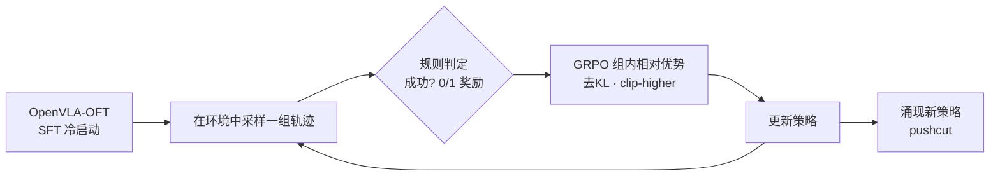

# SimpleVLA-RL:用在线强化学习训练 VLA

> **arXiv**: [2509.09674](https://arxiv.org/abs/2509.09674) | **机构**: 清华大学、上海人工智能实验室、北京大学等(PRIME-RL,作者自报） | **时间**: 2025.09(ICLR 2026 接收）
> **路线**: 新范式 · 在线强化学习(仿真/真机 RL 微调 VLA）

> [← 返回主报告](../index.md)

---

## TL;DR

SimpleVLA-RL 提出一个"简单但有效"的在线 RL 框架,直接把大语言推理模型里那套 **结果级 0/1 奖励 + GRPO** 搬到 VLA 上:不需要额外的奖励模型、不需要价值网络蒸馏,只用仿真器天然给出的"任务成功/失败"信号在线 rollout 并更新策略。作者把它套在 [OpenVLA-OFT](openvla-oft) 上,在 LIBERO、RoboTwin、真机上都拿到大幅提升,并把工程瓶颈(轨迹采样、并行渲染、loss 计算)做了 VLA 专门优化。两个最值得记住的发现:① **数据效率极高**——每个任务只给 1 条示范做冷启动 SFT,再 RL,就能逼近用满数据 SFT 的水平;② RL 过程中策略会"发明"示范里没有的解法(作者称 **pushcut**)。

> ⚠️ 本页数值均来自论文 Table(作者自评/单一团队复现),非第三方独立验证;不同来源对个别数字略有出入,以 arXiv v1 正文表格为准。

---

## 1. 问题:模仿学习的 VLA 缺乏从经验自我提升

当前主流 VLA(如 [OpenVLA](openvla)、[π0](pi0)、[GR00T N1](groot-n1))靠"大规模预训练 + 监督微调(SFT)"驱动,但 SFT 范式有两个结构性短板:

1. **数据昂贵且稀缺**:SFT 要 scale,就得堆海量人工遥操作轨迹,采集成本极高;
2. **分布漂移下泛化差**:SFT 本质是模仿示范分布,遇到示范没覆盖的状态就容易崩,且无法"从自己的失败里学习"。

论文借鉴大推理模型(Large Reasoning Models)的经验提出核心追问:**既然 RL 能显著增强 LLM 的逐步推理,它能不能同样增强 VLA 的"逐步动作规划"(long-horizon step-by-step action planning)?** SimpleVLA-RL 就是对这个问题的正面回答——让 VLA 通过与(仿真/真实)环境交互、用稀疏的成功信号在线提升,而不是只会模仿。

---

## 2. 方法与架构

### 2.1 总体范式:结果级奖励的在线 RL

整体是一个标准的"采样—评估—更新"在线 RL 闭环,但刻意做到极简:

- **奖励**:只用 **outcome-level 0/1 规则奖励**(成功=1,失败=0),直接从仿真环境的成功判定里读出,不训练任何奖励模型;
- **优化器**:采用 **GRPO**(Group Relative Policy Optimization)——对同一任务采样一组轨迹,用组内相对优势(normalized advantage)做 PPO 式裁剪更新,从而省掉单独的 value/critic 网络;
- **策略**:基座为 **OpenVLA-OFT**(自回归式 VLA,语言主干为 LLaMA2-7B),动作以 token 形式自回归生成,天然契合 GRPO 这类为自回归序列设计的 RL 算法。

### 2.2 VLA 专属的工程优化与稳定化技巧

把 LLM 的 RL 直接搬到 VLA 会遇到轨迹长、需要环境渲染、动作 token loss 特殊等问题。论文在 veRL 基础上做了 VLA 定制:

- **VLA 专属轨迹采样 + 可扩展并行 + 多环境并行渲染**,缓解机器人 rollout 的吞吐瓶颈;
- **优化的 loss 计算**,适配动作 token 序列;
- **训练稳定化**:**去掉 KL 散度正则**(不向 SFT 策略硬拉),并采用 **非对称裁剪**(clip-higher,ε_low=0.2、ε_high=0.28)以鼓励探索、防止熵过快坍缩。

*示意图(自绘,据论文描述,非原图)*

---

## 3. 关键设计与创新点

- **极简奖励**:抛弃复杂的过程奖励/奖励模型,只用环境自带的 0/1 结果信号,降低工程与调参负担,即"Simple"之名由来。
- **GRPO 上 VLA**:把为推理 LLM 验证过的 GRPO 范式系统迁移到自回归 VLA 的长程动作生成。
- **探索增强**:去 KL + clip-higher 显式鼓励策略跳出示范分布,是 RoboTwin 大幅提升与 pushcut 现象的关键。
- **超高数据效率(冷启动假设)**:RL 的作用是"把基座本就具备的微弱能力放大",因此只要有极少示范把基座"点亮",RL 就能补上其余,大幅减少人工轨迹需求。
- **pushcut 现象**:RL 后策略会发现示范中从未出现的解法。例如"移动罐子"任务,示范是"抓取—移动—放置",而 RL 学到直接"把罐子推到目标位"的捷径(push-driven shortcut)——证明 RL 带来的是探索式的能力扩展,而非单纯拟合。

---

## 4. 实验与关键结果

> 数值来自论文表格,⚠️ 自评 / 单团队复现 / 待第三方核验。"w/ ours"= 在该基座上施加 SimpleVLA-RL 后。

**LIBERO(基座 OpenVLA-OFT,自回归)**

| 设置 | LIBERO-Long | 说明 |
|---|---|---|
| OpenVLA-OFT(SFT 基线) | 86.5 | — |
| **+ SimpleVLA-RL** | **98.5** | Δ **+12.0**,LIBERO 总均值 91 → **99.1** |
| [π0](pi0)(对照) | 85.2 | 论文 Table 给出 |

**单条轨迹冷启动(One-Trajectory SFT,每任务仅 1 条示范)**

| 设置 | LIBERO-Long | LIBERO 均值 |
|---|---|---|
| 1-traj SFT 基线 | 17.3 | 48.9 |
| **+ SimpleVLA-RL** | **91.7**(Δ +74.4) | **96.9** |

→ 仅用 1 条示范冷启动 + RL,即可逼近满数据 SFT(均值约 99.1)的水平,是论文最有冲击力的数据效率证据。

**RoboTwin 1.0 / 2.0(双臂操作)**

| 基准 | OpenVLA-OFT | + SimpleVLA-RL | 对照 |
|---|---|---|---|
| RoboTwin 1.0 | 39.8 | **70.4**(Δ +30.6) | — |
| RoboTwin 2.0 | 38.3 | **68.8**(Δ +30.5) | π0 49.2 / [RDT](rdt-1b) 33.3 |

**真机(4 任务,各 50 次试验)**:OpenVLA-OFT(SFT)**17.5** → **+ SimpleVLA-RL 38.5**(Δ +21,作者称约相对 +120%),对照 RDT 23.5。

要点:RL 在仿真长程任务与真机上都带来稳定增益;在 RoboTwin 2.0 与真机上超过 π0、RDT 等强基线;探索增强(去 KL + clip-higher)对 RoboTwin 这类需要跳出示范的任务尤为关键。

---

## 5. 局限与争议

- **RL 不能无中生有**:论文明确指出,若基座对任务的初始成功率约为 0%,RL 几乎得不到任何正奖励信号,提升也≈0——**基座先验是决定 RL 是否奏效的关键因素**。这意味着 SimpleVLA-RL 是"放大器"而非"冷启动器",仍依赖一定质量的 SFT 基座。
- **奖励信号来源受限**:0/1 结果奖励高度依赖环境(尤其仿真)能可靠判定"成功"。真实世界里成功判定本身就难,稀疏奖励在更长程、更开放任务上的可扩展性待核。
- **基座与算法耦合**:主体实验绑定 OpenVLA-OFT 这类自回归 VLA,GRPO 也天然适配 token 序列;对 [π0](pi0)/π0.5 等扩散式 VLA 的适配在代码 roadmap 中,论文正文证据较少(⚠️ 待核)。
- **数值为自评**:全部结果出自单一团队,尚缺第三方独立复现;不同二手来源对个别数字(如 LIBERO-Long 终值 97.6 vs 98.5)有小幅出入,以 arXiv v1 表格为准。

---

## 6. 在 VLA 谱系中的位置

SimpleVLA-RL 不是新的 VLA 基座,而是一条 **训练范式支线**:在"大规模预训练 → SFT"之后补上"**在线 RL 自我提升**"。它与 [OpenVLA-OFT](openvla-oft) 是"算法↔基座"关系——后者提供高效自回归 VLA 与高吞吐推理,前者让其继续从经验变强;相对 [OpenVLA](openvla) 的纯模仿,它把"从失败中学习、发现新策略(pushcut)"带进 VLA。

与同期偏重数据/架构的工作(扩散式 [RDT](rdt-1b)、大基座 [GR00T N1](groot-n1)、流匹配 [π0](pi0))相比,它走"**用 RL 换数据**"路线:把昂贵的人工轨迹需求换成廉价的环境交互与稀疏奖励,呼应 2025 年"把 LLM 的推理 RL 经验迁移到具身智能"的趋势,是 VLA 从"模仿"迈向"试错自提升"的代表性一步。

---

## 来源

- <https://arxiv.org/abs/2509.09674>
- <https://github.com/PRIME-RL/SimpleVLA-RL>
