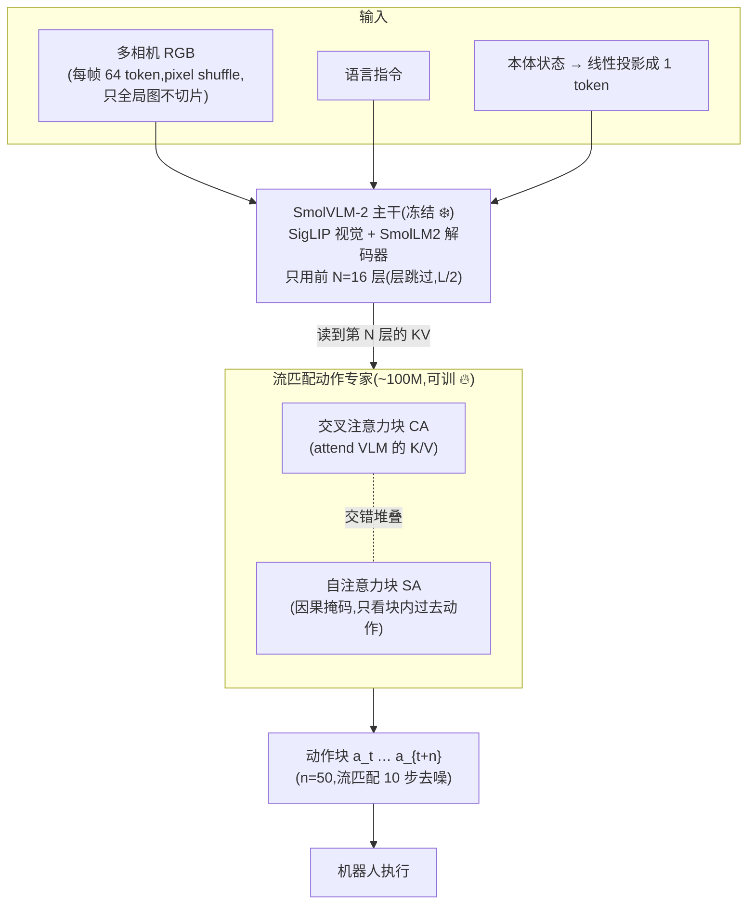
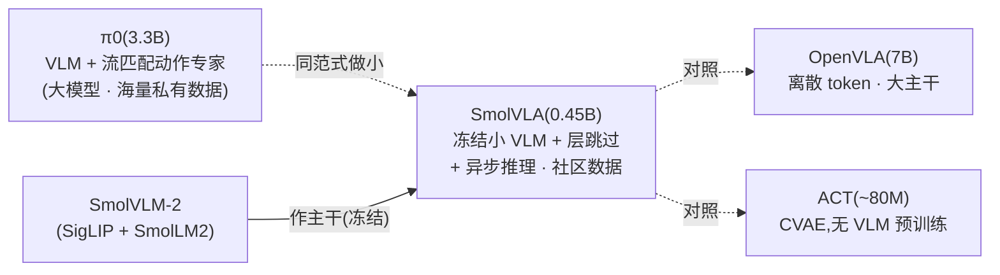

# SmolVLA:把 VLA 做小、做便宜、做开源

> **arXiv**: [2506.01844](https://arxiv.org/abs/2506.01844)(v1 2025-06-02,cs.LG / cs.RO,24 页)
> **机构**: Hugging Face(LeRobot 团队)/ Sorbonne 等
> **作者**: Mustafa Shukor, Dana Aubakirova, Francesco Capuano, Pepijn Kooijmans, Steven Palma, Adil Zouitine, Michel Aractingi, Caroline Pascal, Martino Russi, Andres Marafioti, Simon Alibert, Matthieu Cord, Thomas Wolf, Remi Cadene(14 人)
> **路线**: 连续流匹配(小型化 / 可负担)—— 冻结小 VLM + 轻量流匹配动作专家
> **项目 / 代码**: <https://github.com/huggingface/lerobot>(Apache-2.0)· <https://huggingface.co/blog/smolvla>

> [← 返回主报告](../index.md)

---

## TL;DR

SmolVLA 是 **Hugging Face / LeRobot 团队**做的一个**小、便宜、全开源**的 VLA:主力模型**仅 ~0.45B 参数**(对照 [π0](pi0.md) 的 3.3B、[OpenVLA](openvla.md) 的 7B),却在 LIBERO 等基准上**追平甚至超过大它 10× 的模型**——主打「可负担、可复现、人人能跑」。

它的三个核心抓手:

1. **小主干 + 冻结 VLM,只训动作专家**:视觉-语言主干用 **SmolVLM-2**(SigLIP 视觉 + SmolLM2 解码器),**全程冻结**;只训练一个 **~100M 的流匹配动作专家**。每帧视觉只取 **64 个 token**(pixel shuffle、不切片、只用全局图),状态投影成 1 个 token。
2. **层跳过(layer skipping)砍一半计算**:动作专家不读 VLM 的全部 L 层,只读到 **第 N=L/2 层**(实现里**只用前 16 层 LLM**),「等于把 LLM 与动作专家的计算量减半」。
3. **异步推理栈(asynchronous inference)**:把**感知 + 动作预测**与**动作执行**解耦——`RobotClient`(低功耗本体)把观测发给 `PolicyServer`(可在远端 GPU),在动作队列还没消费完时就**提前预测下一块并重叠拼接**,消除空闲卡顿,实测任务完成**快约 30%**。

数据侧也走「平民路线」:**不靠海量私有数据**,而是从 **481 个 Hugging Face 社区数据集**筛出 **22.9K 条 episode / 10.6M 帧**(作者称「比 SOTA 至少小一个数量级」),并用 **Qwen2.5-VL-3B-Instruct 自动清洗/补全**噪声指令。整个项目约 **30k GPU·小时**,主力模型在 **4 卡**(声称单卡可训)上 bfloat16 + `torch.compile` 训练。

⚠️ 战绩:**LIBERO 平均 87.3%**(0.45B,无 VLA 预训练)—— 追平 **π0(3.3B)的 86.0**、超 **OpenVLA(7B)的 76.5** 与 **Octo 的 75.1**;真机 SO-100 多任务 **78.3%**(π0 61.7 / ACT 48.3);且相比 π0 **训练快约 40%、显存少 6×**。

一句话:**SmolVLA = 「把 π0 那套(VLM + 流匹配动作专家)做小到 0.45B」+ 「冻结 VLM/层跳过/64 token 三连砍计算」+ 「异步推理解耦执行」+ 「只吃 2 万条社区数据」—— 证明了一个能在单 GPU 训练、消费级 GPU 甚至 CPU 部署的小 VLA,可以追平大它 10× 的模型,且代码/权重/数据全开源。**

> ⚠️ **可信度提示**:本页定量(LIBERO 87.3、真机 78.3、快 40%/省 6× 等)为**作者自评**,来自论文(arXiv:2506.01844)报告表;LIBERO/Meta-World 虽是标准基准,但这些数字未经独立第三方在同口径下复现,采信请注意。模型与代码已全开源(LeRobot),社区采用度高,但论文本身为预印本。原文存在**内部数字不一致**:Table 1 标题写「~10M episodes」而表体为「22.9K episodes / 10.6M frames」——本页采信 **22.9K episode / 10.6M 帧**(与正文「比 SOTA 小一个数量级」一致),并就地标注。

---

## 1. 要解决的问题

VLA 这条路线越做越强,但也越做越**重、越贵、越难复现**:

1. **参数动辄数十亿**:[π0](pi0.md) 3.3B、[OpenVLA](openvla.md) 7B、[RT-2](rt2.md) 最大 55B——训练要多卡集群,推理要数据中心 GPU,普通实验室/爱好者**玩不起**。
2. **数据私有、海量**:头部 VLA 靠**自建的数千小时遥操作数据**(π0 约 1 万小时跨本体)或 OXE 百万级轨迹,**社区采集的廉价平台数据**(如 3D 打印臂 SO-100)基本被忽视。
3. **闭源 / 难复现**:很多前沿 VLA 权重/数据不公开,无法在其上二次开发。

SmolVLA 的目标就是反过来——**做一个小到能在单张 GPU 上训练、能在消费级 GPU 甚至 CPU 上部署的 VLA**,只用**社区公开数据**训练,并把**代码、权重、数据全部开源**(Apache-2.0,集成进 LeRobot),让 VLA 真正「平民化」。其核心主张是:**在精心设计下,0.45B 的小模型可以追平大它 10× 的 VLA。**

> 📌 这是站内**最小**、最强调「可负担性 + 开源复现」的 VLA,与同走流匹配路线但偏重灵巧/规模的 [π0](pi0.md) 形成「大 vs 小」的鲜明对照;数据哲学上则与「自建海量私有数据」相反,走**社区众包**路线。

---

## 2. 方法与架构

> ⚠️ 下图依据论文 HTML 全文(arXiv:2506.01844v1)Figure 1 与正文描述绘制;维度为示意,关键数字见正文标注。

### 2.1 视觉-语言主干:小、冻结、省 token

- **主干 = SmolVLM-2**(Marafioti et al. 2025):**SigLIP 视觉编码器 + SmolLM2 语言解码器**,本身就是为「小而高效」设计的多模态模型家族。
- **每帧只取 64 个视觉 token**:通过 **pixel shuffle** 压缩,**不做图像切片(no tiling)**、**只用全局图**——大幅减少 token 数,换取推理速度。
- **状态投影成单 token**:本体感觉状态经线性层变成 1 个 token,与视觉、语言 token 拼成同一序列喂入 VLM。
- **VLM 全程冻结**:训练时**只训动作专家**,VLM 不动——这是它能「单 GPU 训练」的关键之一。

### 2.2 层跳过(layer skipping):砍掉一半 LLM

动作专家**不读 VLM 的全部 L 层输出**,只读到**第 N 层**,作者取 **N = L/2** 作为速度/性能折中,称其「**等效把 LLM 与动作专家的计算量减半**」。实现里**只用前 16 层 LLM**。消融(见 §4)显示:**取前 N 层**比「每隔一层跳一次」或「直接换更小的 VLM」都更好。

### 2.3 动作专家:交错 CA/SA 的流匹配 Transformer

- **条件流匹配(Conditional Flow Matching)Transformer**,承 [π0](pi0.md) 的流匹配思路(τ 从 Beta 分布采样,训练目标为向量场 $u=\epsilon - A_t$,推理固定 **10 步**)。
- **交错的交叉注意力(CA)与自注意力(SA)块**:每个 block **要么 CA 要么 SA**(不是二合一)。**CA 块**让动作 token 去 attend VLM 的 K/V;**SA 块**用**因果掩码**,让动作 token 只看动作块内的「过去」。消融显示 **CA+SA 交错(85.5)> 纯 CA(79.0)> 纯 SA(74.5)**。
- **窄一点的隐藏维**:动作专家隐藏维取 **0.75×d**(d 为 VLM 隐藏维)。
- **动作分块**:一次输出 **n=50** 步动作块。

### 2.4 异步推理栈(asynchronous inference)

这是 SmolVLA 工程上的亮点,把「想」和「做」解耦:

- **RobotClient ↔ PolicyServer**:低功耗机器人客户端把观测发给策略服务端(**可在远端 GPU**),收回一个动作块。
- **重叠预测**:在动作队列**还没消费完**时就触发下一块预测,再把重叠的块**聚合(aggregate)**,避免「执行完才开始算下一步」的空闲卡顿。
- **队列阈值 g∈[0,1]** 调节行为:`g=0` 顺序执行(有空隙)、`g=0.7` 均衡异步、`g=1` 最大反应性(最吃算力)。**当 g ≥ (E[ℓ_s]/Δt)/n 时可避免空队列**(30fps 下 Δt=33ms)。
- **去重**:关节空间相似度滤波丢弃近重复观测(阈值 ε);队列空时强制处理。
- 效果:任务完成时间从同步的 13.75s → 异步 9.70s,**约快 30%**(成功率略降:78.3→73.3,见 §4)。

### 2.5 训练:只吃社区数据 + VLM 自动清洗标注

- **数据**:从 **481 个 Hugging Face 社区数据集**按本体/episode 数/质量/帧覆盖筛选,得 **22.9K episode / 10.6M 帧**(⚠️ Table 1 标题误作「~10M episodes」,本页采信 22.9K episode)。
- **指令清洗**:用 **Qwen2.5-VL-3B-Instruct** 自动生成/清洗噪声任务标注;相机统一归一化为 `OBS_IMAGE_1/2/3`(顶/腕/侧优先级)。
- **训练配置**:LeRobot(PyTorch)框架;预训练 **20 万步、全局 batch 256**;100 步 warmup,cosine LR 1e-4→2.5e-6,AdamW(β₁=0.9, β₂=0.95);图像 512×512;主力 **450M 参数**(其中 ~100M 动作专家);bfloat16 + `torch.compile`;**4 GPU**(声称单卡可训),全项目约 **30k GPU·小时**。
---

## 3. 关键设计与创新点

1. **极致小型化(0.45B)却追平 10× 大模型**:用「冻结小 VLM + 轻量流匹配动作专家」把 VLA 压到 sub-0.5B,LIBERO 平均 87.3% 追平 π0(3.3B)、超 OpenVLA(7B)。证明**精心设计 > 单纯堆参数**。
2. **三连砍计算**:① VLM 冻结(只训动作专家)② 层跳过(只用前 16 层 LLM,计算减半)③ 每帧 64 视觉 token(pixel shuffle、不切片)——三者叠加让小模型能单 GPU 训、CPU 部署。
3. **交错 CA/SA 动作专家**:CA 接 VLM 知识、SA(因果)建模动作块内时序,消融证明交错优于纯 CA 或纯 SA。
4. **异步推理栈**:把感知/预测与执行解耦,Client-Server 架构 + 重叠预测 + 队列阈值 g,消除空闲卡顿,任务完成快约 30%,且天然支持「弱本体 + 远端 GPU」部署。
5. **社区数据驱动 + 全开源**:只用 481 个社区数据集筛出的 2.29 万条 episode(比 SOTA 小一个数量级),VLM 自动清洗标注;代码/权重/数据全部 Apache 开源、集成进 LeRobot——可负担性 + 可复现性是一等公民。

---

## 4. 实验与关键结果

> ⚠️ 全部为**作者自评**(论文报告表);LIBERO/Meta-World 为标准仿真基准但未经独立第三方同口径复现,真机为作者自建。原文标注 **SimplerEnv 未在本文出现**(只有 LIBERO 与 Meta-World 仿真)。

### 4.1 结果速览表

**表 1 · LIBERO 平均成功率(⚠️ 自评,Table 2)**

| 模型 | VLA 预训练 | 平均 SR | 口径 / 备注 |
|---|---|---|---|
| Diffusion Policy | 否 | 72.4 | 对照 |
| Octo(0.09B) | 是 | 75.1 | 对照 |
| OpenVLA(7B) | 是 | 76.5 | 对照(大 15×) |
| π0(Paligemma-3B,无预训练) | 否 | 71.8 | 对照 |
| π0(3.3B) | 是 | **86.0** | 强对照(大 7×) |
| **SmolVLA(0.24B)** | 否 | **82.75** | — |
| **SmolVLA(0.45B,主力)** | 否 | **87.3** | Spatial 90 / Object 96 / Goal 92 / Long 71 |
| **SmolVLA(2.25B)** | 否 | **88.75** | 放大版 |

**表 2 · Meta-World 平均成功率(⚠️ 自评,Table 2)**

| 模型 | 平均 SR |
|---|---|
| Diffusion Policy | 10.5 |
| TinyVLA | 31.6 |
| π0(3.5B-Paligemma,无预训练) | 50.5 |
| π0(3.5B,预训练) | 47.9 |
| **SmolVLA(0.45B)** | **57.3** |
| **SmolVLA(2.25B)** | **68.24** |

**表 3 · 真机 SO-100 多任务(⚠️ 自评,Table 3)**

| 模型 | 平均 SR | 明细(Pick-Place / Stacking / Sorting) |
|---|---|---|
| ACT(单任务,~80M) | 48.3 | — |
| π0(3.5B,多任务) | 61.7 | — |
| **SmolVLA(0.45B,多任务)** | **78.3** | 75 / 90 / 70 |

**表 4 · 真机 SO-101 Pick-Place-Lego 泛化(⚠️ 自评,Table 4)**

| 模型 | 分布内 | 分布外(OOD) |
|---|---|---|
| ACT | 70 | 40 |
| **SmolVLA(0.45B)** | **90** | **50** |

### 4.2 要点解读

- **小模型追平大模型**:0.45B 的 LIBERO 87.3% **追平 π0(3.3B)的 86.0、超 OpenVLA(7B)的 76.5**;放大到 2.25B 进一步到 88.75。核心卖点成立。
- **训练更省**:相比 π0,**训练快约 40%、显存少 6×**——可负担性的硬证据。
- **预训练 + 多任务的增益(Table 5,SO-100)**:单任务无预训练 40 → 多任务 51.7 → **多任务 + 社区数据预训练 78.3**。说明**社区数据预训练贡献巨大**(+26.6pp)。
- **同步 vs 异步(Figure 5)**:成功率 78.3(同步)vs 73.3(异步)略降,但**任务完成时间 13.75s → 9.70s(约快 30%）**,固定时间内完成方块数近翻倍(9→19)。异步用「微小成功率代价」换「大幅吞吐」。

### 4.3 关键消融(均 LIBERO 平均 SR)

| 消融维度 | 结论 | 数字 |
|---|---|---|
| 注意力类型(Table 6) | **CA+SA 交错最优** | CA 79.0 / SA 74.5 / **CA+SA 85.5** |
| 动作 token 掩码(Table 7) | **因果优于双向** | 双向 67.5 / **因果 74.5** |
| VLM 层跳过(Table 8) | **取前 N 层** 优于隔层跳/换小 VLM | N=16→78.5、N=32→80.3;隔层 75.5;VLM-256M 75.8 |
| 动作专家宽度(Table 9) | 适中最好 | ×1.0→82.3 / ×0.75→77.5 / ×0.5→80.3 / ×0.25→73.8 |
| 训练目标(Table 10) | **流匹配 > L1 回归** | 流匹配 80.25 / L1 75.25 |
| 状态放置(Table 11) | **喂进 VLM(prefix）最好** | Prefix+CA 80.3(最优) |
| 动作块大小 n(Table 12) | **10–50 之间最佳** | n=10→84.0 / 50→80.3 / 100→74.5 |
| 动作执行步数(Table 13) | **更勤更新观测更好** | 1步→80.3 / 10→82.8 / 50→51.8 |

---

## 5. 在 VLA 谱系中的位置

- **承 [π0](pi0.md) 的流匹配范式,做「小型化」改写**:同样是「VLM 主干 + 流匹配动作专家 + 动作分块」,但 SmolVLA 把主干换成冻结的小 SmolVLM-2、加层跳过/64 token 砍计算、动作专家只 ~100M——是 **π0 的「平民版 / 小型版」**。
- **与 [OpenVLA](openvla.md) 对照(离散 vs 连续 + 大 vs 小)**:OpenVLA 7B 离散 token 自回归;SmolVLA 0.45B 连续流匹配,以 1/15 参数反超 LIBERO。
- **与 ACT / TinyVLA 对照**:ACT(~80M,无 VLM 预训练)是更小但能力弱的基线;SmolVLA 在相近「轻量」诉求下引入 VLM 知识与社区数据预训练,真机多任务 78.3 远超 ACT 48.3。
- **数据哲学的另一极**:头部 VLA 靠自建海量私有数据(π0 约 1 万小时、OpenVLA OXE 97 万条),SmolVLA 走**社区众包 + 自动清洗**(2.29 万条),证明「小数据 + 好设计」也能打。
- **与本站「推理加速/部署」主线呼应**:层跳过、64 token、异步推理是典型的**系统级 + 表示级加速**手段,见 [推理加速与量化部署](inference-deployment.md);其「弱本体 + 远端 GPU」的 Client-Server 异步与 [Gemini Robotics](gemini-robotics.md) 的云-端延迟解耦思路相通,但 SmolVLA 完全开源、面向低成本臂。

---

## 6. 局限与存疑

1. **全为作者自评、预印本**:LIBERO/Meta-World/真机数字均自评,未见独立第三方同口径复现(尽管代码/权重/数据已开源,复现门槛低)。
2. **单本体预训练**:社区数据预训练**主要是 SO-100 单一本体**,跨本体泛化能力存疑;作者自列为局限。
3. **数据规模仍小**:~2.29 万条轨迹(对照 OpenVLA 约 100 万),sub-0.5B 规模;短程任务为主,**长程/灵巧任务**未充分验证。
4. **VLM 主干非为机器人优化**:SmolVLM-2 主要在 **OCR/文档**类任务上预训练,**未做多模态 + 机器人联合训练**,语义先验未必最契合操作。
5. **仅模仿学习**:没有强化学习/从经验学习成分,能力上限受演示数据约束。
6. **异步以成功率换吞吐**:异步推理任务完成快约 30%,但成功率略降(78.3→73.3);g 阈值需按场景调。
7. **原文数字不一致**:Table 1 episode 数标注矛盾(~10M vs 22.9K),引用时需以正文「比 SOTA 小一个数量级」为准、采信 22.9K episode / 10.6M 帧。

---

## 来源

- 论文:SmolVLA: A Vision-Language-Action Model for Affordable and Efficient Robotics. arXiv:2506.01844(v1 2025-06-02,cs.LG / cs.RO,24 页)。<https://arxiv.org/abs/2506.01844>
- HTML 全文(架构图 / 全部表格数据来源):<https://arxiv.org/html/2506.01844v1>
- 代码 / 权重 / 数据(全开源,Apache-2.0,集成进 LeRobot):<https://github.com/huggingface/lerobot>
- 官方博客:<https://huggingface.co/blog/smolvla>
- VLM 主干 SmolVLM-2:arXiv:2504.05299

> 说明:本页定量(LIBERO 87.3 / 真机 78.3 / 快 40%·省 6× 等)为**作者自评**,基于论文报告表;LIBERO/Meta-World 为标准基准但未见独立第三方同口径复现。原文 episode 数标注存在不一致(~10M vs 22.9K),本页采信 22.9K episode / 10.6M 帧并就地标注。引用时请连同自评属性与上述口径保留。
