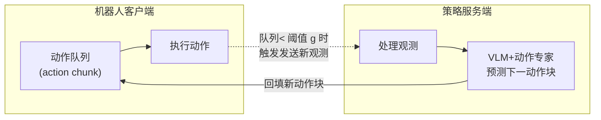

# SmolVLA:小而高效的开源社区驱动 VLA

> **arXiv**: [2506.01844](https://arxiv.org/abs/2506.01844) | **机构**: Hugging Face | **时间**: 2025.06
> **路线**: 连续动作(小型高效 · 开源 · 社区数据 · 异步推理)

> [← 返回主报告](../index.md)

---

## TL;DR

- **SmolVLA** 是 Hugging Face / LeRobot 团队推出的一个**小型、高效、社区驱动**的视觉-语言-动作(VLA)模型,核心卖点是把训练与推理成本**大幅压低**:全模型约 **4.5 亿(0.45B)参数**,其中约 **1 亿**用于动作专家,目标是**单张 GPU 即可训练**,并能部署到**消费级 GPU 甚至 CPU** 上。
- 与多数动辄数十亿参数、依赖学术/工业私有数据的 VLA 不同,SmolVLA **只用从 Hugging Face 收集的社区数据集**训练(主要来自廉价的 SO-100/SO-101 类机械臂),规模"至少比同类小一个数量级"。⚠️ 论文称其性能可媲美**大约 10× 于其体量**的 VLA。
- 架构上以紧凑的视觉-语言模型 **SmolVLM-2** 为骨干,接一个基于**条件流匹配(conditional flow matching)** 的动作专家;并通过**只用骨干前 L/2 层**、**交错的交叉注意力 + 因果自注意力**、**每帧限制 64 个视觉 token** 等手段进一步降本。
- 为提升实时响应,提出**异步推理栈(asynchronous inference)**:把"感知+动作预测"与"动作执行"解耦,客户端在消费动作队列的同时,服务端异步计算下一段动作块(action chunk),从而在固定时间内完成更多任务。
- 全部**代码、预训练权重与训练数据均开源**(基于 LeRobot)。

> ⚠️ 口径提醒:本页除架构/数据等事实外,凡涉及"与某模型可比/更优""快 N×""省 N× 显存"等多为**论文作者自评**,标 ⚠️;本解读未独立复现,精确数值以原文为准。

---

## 1. 问题

VLA 的主流思路是:在大规模多模态数据上预训练的视觉-语言模型(VLM)已编码丰富的视觉与语言知识,直接把它**改造**为能"用自然语言驱动感知与控制"的策略,优于从零训机器人策略。但论文指出当前 VLA 存在三个痛点:

1. **体量过大、成本过高**:现有 VLA 常达**数十亿参数**,训练昂贵、真实部署受限(难以在消费级硬件上跑)。
2. **数据来源偏窄**:多依赖**学术与工业**数据集,却忽视了正在快速增长的**社区数据**——来自廉价机器人平台(如 SO-100 这类低成本机械臂)、由社区采集并公开的轨迹。
3. **推理响应不足**:同步式"感知→预测→执行"串行流程会浪费等待时间,限制了控制频率。

SmolVLA 的目标即:在**严格的算力/数据预算**下,造一个人人可训、可部署的 VLA,同时保持有竞争力的性能。

---

## 2. 方法与架构

SmolVLA = **紧凑 VLM 骨干(SmolVLM-2)** + **流匹配动作专家** + **异步推理栈**。整体仍是"VLM 编码观测与指令 → 动作专家生成连续动作块"的双模块范式,但每一处都为"降本"做了取舍。

### 2.1 紧凑骨干与降本设计

- **骨干 SmolVLM-2**:用 **SigLIP** 编码视觉特征,送入 **SmolLM2** 语言解码器。输入为多路相机图像 + 语言指令 + 机器人本体状态(state)。
- **只用前 L/2 层**:动作专家只读取骨干**前 N = L/2 层**(即前 16 层 LLM)的特征,而非跑完整个语言模型——直接**砍掉约一半**的 LLM 与动作专家计算量。消融显示"取前 L/2 层"优于把 VLM 整体缩小。
- **视觉 token 削减**:每帧仅保留 **64 个视觉 token**,通过对全局图像做 pixel-shuffle 实现;推理时**不做图像切片(tiling)**,进一步省算力。
- **动作专家(action expert)**:基于**条件流匹配**(而非扩散)的 Transformer,隐藏维约为骨干的 **0.75×d**,一次生成长度 **n = 50** 的动作块;部署时流匹配固定 **10 步**采样。
- **交错注意力**:动作专家采用**交叉注意力(CA)与因果自注意力(SA)交替**的层结构(而非每层都用),并对动作 token 使用**因果**注意力——两者均由消融支持。
- **状态注入**:把机器人本体状态作为**前缀(prefix)送入 VLM**,优于把它接到动作专家一侧。

### 2.2 社区数据与异步推理

**训练数据**:从 Hugging Face 收集 **481 个社区数据集**,合计约 **2.29 万条 episode、1060 万帧**(论文称比其他 SOTA 至少小一个数量级)。数据治理包括:
- 用 VLM(**Qwen2.5-VL-3B-Instruct**)为缺失/噪声的任务描述**自动重标注**指令文本;
- **人工归一化相机视角**到标准命名(OBS_IMAGE_1/2/3),统一多源数据。
- 训练框架为 **LeRobot**(PyTorch);训练 **20 万步**、batch 256、图像 resize 到 512×512。

**异步推理栈(asynchronous inference)**:把动作执行与观测处理**解耦**(对比同步串行)。

*示意图(自绘,据论文描述,非原图)*

要点:客户端持续消费动作队列并执行;当队列长度低于阈值 **g ∈ [0,1]** 时,触发把新观测发给服务端;服务端**异步**算出下一动作块回填队列。期间还用**关节空间的观测相似度过滤**避免重复处理近乎相同的观测。由此实现非阻塞、更高控制率。

---

## 3. 关键设计与创新点

- **极致小型化的 VLA 配方**:0.45B 总参数、单卡可训、消费级 GPU/CPU 可部署——把 VLA 的硬件门槛拉到"业余/社区"可及。
- **"只用半个骨干 + 削视觉 token + 紧凑专家"** 的组合降本,且每一项都有消融支撑(见 §4)。
- **社区数据驱动**:首次明确把**廉价平台社区数据**作为主要训练源,并给出 VLM 自动重标注 + 视角归一化的数据治理流程。
- **流匹配动作专家**:在小模型上,流匹配优于直接回归(消融)。
- **异步推理栈**:工程层面把感知/预测与执行解耦,提升真实任务吞吐与响应,与模型本身解耦、可单独使用。
- **完全开源**:代码、权重、数据全开放(LeRobot 生态),强调可复现与社区可扩展。

---

## 4. 实验与关键结果

> ⚠️ 下列数值均为论文自报(simulated + real-world benchmark);本解读未独立复现,**精确口径以原文为准**。基线(π0、OpenVLA、ACT 等)的参数量与评测条件未必与 SmolVLA 严格同条件,跨模型横比需谨慎。

**表 A — LIBERO 成功率(%)** ⚠️ 自评

| 模型(参数量) | Spatial | Object | Goal | Long | 平均 |
|---|---|---|---|---|---|
| SmolVLA (0.45B) | 90 | 96 | 92 | 71 | **87.3** |
| [OpenVLA](openvla) (7B) | 84.7 | 88.4 | 79.2 | 53.7 | 76.5 |
| [π0](pi0) (~3.3B, 机器人预训练) | — | — | — | — | 86.0 |

**表 B — Meta-World 成功率(%)** ⚠️ 自评

| 模型 | Easy | Medium | Hard | Very Hard | 平均 |
|---|---|---|---|---|---|
| SmolVLA (0.45B) | 82.5 | 41.8 | 45.0 | 60.0 | **57.3** |
| [π0](pi0) (~3.5B) | 71.8 | 48.2 | 41.7 | 30.0 | 47.9 |

**表 C — 真实世界 SO-100 多任务成功率(%)** ⚠️ 自评

| 模型 | Pick-Place | Stacking | Sorting | 平均 |
|---|---|---|---|---|
| SmolVLA (0.45B) | 75 | 90 | 70 | **78.3** |
| [π0](pi0) (~3.5B) | 100 | 40 | 45 | 61.7 |
| ACT | 70 | 50 | 25 | 48.3 |

- **真实世界 SO-101 泛化(Pick-Place-Lego)**:SmolVLA 在分布内 **90%**、分布外 **50%**;ACT 为 70% / 40%。⚠️ 自评
- **异步 vs 同步(真实任务)**:平均完成时间从同步 **13.75s(±2.42)** 降到异步 **9.70s(±2.95)**,约**快 30%**;固定时间内异步完成 **19** 个 pick-place 循环 vs 同步 **9** 个。⚠️ 自评
- **训练效率**:论文称相比 π0 **训练快约 40%、显存少约 6×**。⚠️ 自评

**关键消融(LIBERO,均值%)** ⚠️ 自评:
- 交错 CA+SA(**85.5**) > 仅 CA(79) > 仅 SA(74.5);
- 动作用因果注意力(74.5) > 双向(67.5);
- 取前 N=L/2 层(80.3,优于整体缩小 VLM);
- 流匹配(80.25) > 直接回归(75.25);
- 状态作前缀入 VLM(80.3) > 接动作专家(73.3);
- 动作块 n 取 10–50 较优(n=1 仅 50,n=100 为 74.5);
- 每 1 步更新观测(80.3) ≫ 每 50 步更新(51.8)。

---

## 5. 局限与争议

- **绝对性能仍受体量限制**:在 Meta-World 等更难任务上整体成功率不高(平均 ~57%),长程任务(LIBERO-Long 71%)与短程仍有差距;小模型的能力上限是固有取舍。
- **基线横比口径**:与 π0 / OpenVLA / ACT 的对比中,参数量、输入相机数、预训练数据等并非严格同条件;且 π0 在 SO-100 的 Pick-Place 反而 100%(SmolVLA 75%),说明并非全面占优。⚠️
- **数据局限**:社区数据以低成本单/双臂(SO-100/101)为主,本体与任务多样性受限,向更复杂/灵巧/移动操作平台的迁移性**待核**。
- **自评为主**:核心结论多为作者自报、未见独立第三方大规模复现;"10× 更小却可比"的表述需以具体任务口径理解。⚠️
- **异步栈依赖工程**:收益取决于队列阈值 g、网络/算力配置等,实际部署需调参。

---

## 6. 在 VLA 谱系中的位置

SmolVLA 可视为 VLA 路线在"**小型化 + 平民化 + 开源社区数据**"方向上的一次系统性尝试:

- **与 [π0](pi0) 的对照**:同属"VLM 骨干 + 流匹配动作专家"的连续动作范式,但 SmolVLA 把骨干换成更小的 SmolVLM-2、只用半数层,并以**社区数据**替代私有大数据,主打"小而够用";论文也以 π0 为主要对照基线。
- **相对 [OpenVLA](openvla) / [OpenVLA-OFT](openvla-oft)**:OpenVLA(7B)代表"大骨干 + 离散动作 token"的开源路线;SmolVLA 以约 1/15 的参数量在 LIBERO 上自报更高均值,体现"高效优先"的取向。
- **与 [Octo](octo) 等早期通才**:同样强调开源与跨数据训练,但 SmolVLA 用现代 VLM 骨干 + 流匹配,并把重心放在**消费级硬件可部署**与**异步实时推理**。
- **更广意义**:与 [GR00T-N1](groot-n1)、[π0-FAST](pi0-fast)、[CogACT](cogact) 等代表的"做大做强"主线相对,SmolVLA 提供了一条"**做小做开**"的互补路径,降低 VLA 的训练与复现门槛。

相关:[π0](pi0) · [OpenVLA](openvla) · [OpenVLA-OFT](openvla-oft) · [Octo](octo) · [GR00T-N1](groot-n1) · [π0-FAST](pi0-fast)

---

## 来源

- <https://arxiv.org/abs/2506.01844>
- 项目/代码:LeRobot(Hugging Face),开源代码、预训练权重与训练数据(论文声明全部发布)

> 本解读基于 arXiv 摘要页与 HTML 全文核对撰写;凡标 ⚠️ 处为论文作者自评、未逐一独立复现,标"待核"处为已核语料中明确的缺口,均不编造。
