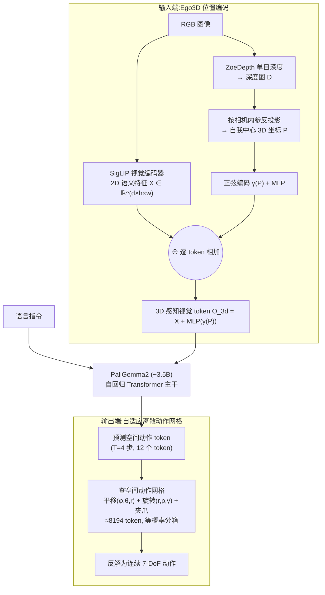

# SpatialVLA 细粒度解读(3D/空间 VLA 专题)

> **arXiv**: [2501.15830](https://arxiv.org/abs/2501.15830) · 上海AI Lab / 上海科技大学 / 复旦 / 上海交大 等 · 2025.01(RSS 2025) · **路线**:2D VLA + **3D 空间表征注入**(Ego3D 位置编码)+ **自适应离散动作网格**,PaliGemma2 自回归主干、跨本体策略
> [← 返回主报告](../index.md)

> ⚠️ **重名消歧**:本文讲的 SpatialVLA 是**机器人策略模型**(arXiv:2501.15830,spatialvla.github.io)。请勿与同名的**空间推理 VQA 基准 / 视觉空间智能评测**(若干无关工作亦用过 "Spatial VLA / SpatialVLM" 等近似名号)混淆——后者不输出机器人动作。

---

## TL;DR

SpatialVLA 的核心论点是:**主流 2D VLA(以 [OpenVLA](openvla.md)、[π0](pi0.md) 为代表)只吃 RGB 像素,缺少显式的 3D / 深度感知,因而在"把物体放到桌面上某个 3D 位置""适应不同相机视角与桌面高度"这类**空间任务上吃亏**。它给出两件配套武器:

1. **Ego3D 位置编码(Ego3D Position Encoding)**——用单目深度估计(ZoeDepth)把每个像素反投影成**以相机为原点(egocentric)的 3D 坐标**,经正弦编码 + MLP 后**逐 token 加到 SigLIP 视觉特征上**,让 VLM 的视觉 token 自带 3D 空间上下文,且因为是**自我中心坐标系而无需逐机器人标定相机外参**。
2. **自适应离散动作网格(Adaptive Action Grids)**——把 7 维末端动作(平移 + 旋转 + 夹爪)拆开,平移转成**极坐标 (φ, θ, r)**,然后按数据分布拟合高斯、用**等概率分箱**(每箱概率 1/M)切成网格,得到一套**空间动作 token**(论文配置约 **8194 个 token**:平移 4096 + 旋转 ~4096 + 夹爪 2)加进词表,用自回归方式预测。等概率分箱让动作分辨率随数据密度自适应,且网格是"空间可迁移"的,便于跨本体复用。

主干为 **PaliGemma2(约 3.5B)**,在 **1.1M 条真机轨迹**(OXE 子集 + RH20T 重加权混合)上预训练,每步预测 T=4 未来动作(12 个空间 token)。作者自评:SimplerEnv(Google Robot 视觉匹配)零样本 **71.9%**、LIBERO 四套件均值 **78.1%**,均高于 OpenVLA / Octo / RT-2-X 等基线(⚠️ 多为论文自评,详见 §4)。

> ⚠️ **事实纪律提醒**:本页几乎所有定量数字为**论文/作者自评**(SimplerEnv 与 LIBERO 虽是社区公开基准,但此处成绩是 SpatialVLA 团队自己跑的,非独立第三方复现),统一标 ⚠️。

---

## 1. 要解决的问题:为什么 2D VLA 不够

VLA 谱系从 [RT-2](rt2.md) 奠定"动作即文本 token"开始,到 [OpenVLA](openvla.md)(离散自回归)、[π0](pi0.md)(连续流匹配)都共享一个**输入侧的隐含假设:把世界压成几路 2D RGB 图像**,再让 VLM 直接学"像素 → 动作"的映射。SpatialVLA 指出这条主线在**空间维度上有结构性短板**:

1. **缺显式深度 / 3D 几何**:RGB 像素本身不含尺度与深度。模型要从 2D 纹理"猜"出物体到底多远、桌面多高、抓取点的 3D 坐标在哪——在训练分布内能蒙对,一旦**相机视角、桌面高度、物体摆位**偏离训练分布,空间定位就崩。这正是 3D/空间 VLA 这一支的共同出发点(对照工作 3D-VLA、PointVLA,见 §6)。
2. **动作表征与空间不解耦**:OpenVLA 式做法是把每个动作维度**均匀分箱**成 256 个离散 bin。均匀分箱不看数据分布——动作分布密集处分辨率不足、稀疏处浪费 token;且 x/y/z 三个笛卡尔维度被独立离散,没有"方向 vs 距离"的空间结构,跨本体迁移时网格语义对不齐。
3. **跨本体的空间对齐难**:不同机器人相机外参、工作空间尺度各异,2D 像素 + 笛卡尔动作很难形成"一套可跨机器人复用的空间动作词汇"。

SpatialVLA 的主张:**在输入端注入 3D(Ego3D 编码),在输出端用数据自适应、空间结构化的动作网格**——两端都补上"空间"这一缺失维度。

---

## 2. 方法与架构

*图注:SpatialVLA 在标准"VLM 自回归 VLA"骨架(对照 [OpenVLA](openvla.md))的两端各打一个补丁——左侧 Ego3D 把深度反投影出的 3D 坐标加到视觉 token 上;右侧把动作离散成数据自适应的空间网格 token。主干本身仍是 PaliGemma2 的下一个 token 预测。*

### 2.1 Ego3D 位置编码(输入端注入 3D)

- **深度来源**:用 **ZoeDepth**(单目深度估计器)从 RGB 估计稠密深度图 D——**不依赖额外深度相机**,纯靠现成 RGB 即可。
- **反投影到自我中心 3D**:用相机内参把每个像素 (u,v,深度) 反投影成相机坐标系下的 3D 点 P。关键在于用**自我中心(egocentric)坐标系**而非世界坐标系——因此**无需逐机器人标定相机-机器人外参**,这是它声称"跨本体友好"的一个支点。
- **与语义特征融合**:SigLIP 输出 2D 语义特征 X;3D 坐标 P 经正弦编码 γ(·) 再过 MLP,**逐 token 加回**视觉特征:**O_3d = X + MLP(γ(P))**。这样进入 LLM 的每个视觉 token 都同时携带"是什么(语义)"与"在哪(3D 位置)"。

### 2.2 自适应离散动作网格(输出端)

- **拆维 + 极坐标**:7 维末端动作 {x,y,z,roll,pitch,yaw,grip} 拆成**平移 / 旋转 / 夹爪**三组;平移从笛卡尔 (x,y,z) 转成**极坐标 (φ 方位角, θ 俯仰角, r 距离)**,把"方向"与"距离"解耦——空间语义更清晰、更易跨本体对齐。
- **高斯等概率分箱**:每个动作变量先归一化到 [-1,1] 跨数据集,再拟合高斯分布,把连续区间切成 **M 个等概率(各 1/M)区间**。等概率意味着**动作分布密集处网格更细、稀疏处更粗**——分辨率随数据自适应,这是相对 OpenVLA"均匀 256 bin"的核心改进。
- **token 数**:论文配置约 **8194 个空间动作 token**(平移 M_trans≈4096、旋转 M_rot≈4096、夹爪 2),作为**可学习嵌入 E_a** 加入词表;每步预测 T=4 个未来动作(共 12 个空间 token),自回归 + 交叉熵训练。
- **后训练迁移**:迁到新机器人时,新动作网格的嵌入用**三线性插值**从预训练 token 初始化,保留已学到的空间动作先验(消融见 §4)。

### 2.3 主干与训练

- **主干**:**PaliGemma2(约 3.5B)**,即 SigLIP 视觉 + Gemma2 语言,沿用"图文 token + 自回归"的 VLA 配方(与 [OpenVLA](openvla.md) 同属离散自回归家族,而非 [π0](pi0.md) 的连续流匹配)。**语言嵌入冻结**以保住视觉-语言对齐,空间动作嵌入可训练。
- **预训练数据**:**1.1M 条真机轨迹**,来自 **Open X-Embodiment(OXE)子集 + RH20T**,并按真机表现重调混合权重(数据全景见 [具身数据](embodied-data.md))。

---

## 3. 关键设计与创新点

1. **两端补"空间",而非换骨架**:不动 VLM 主干的"图文 token + 自回归"范式,只在**输入端(Ego3D)**和**输出端(动作网格)**各打补丁——工程上轻、易接到现成 PaliGemma2 上。这与 PointVLA"冻结主干、模块化注入"的轻量哲学一脉相承,但注入位置不同(SpatialVLA 在视觉特征上加 3D 位置编码,PointVLA 注入点云特征;见 §6)。
2. **自我中心 3D → 免外参标定**:Ego3D 用相机自我坐标系,绕开"每台机器人都要标定相机外参"的工程痛点,是其跨本体卖点的关键。
3. **数据自适应的空间动作词汇**:高斯等概率分箱 + 极坐标解耦,把动作离散化从"均匀盲分"升级为"按数据密度 + 空间结构分"。消融显示:相对线性 256-bin 分箱,自适应网格带来显著提升(⚠️ 自评,见 §4)。
4. **纯 RGB 拿 3D**:用 ZoeDepth 从单目 RGB 估深度,不强依赖深度相机/点云传感器——降低了"3D VLA 必须有 3D 硬件"的门槛(代价是深度估计误差会传导,见 §5)。

---

## 4. 实验与关键结果

> ⚠️ **以下数字均为论文自评**。SimplerEnv、LIBERO 虽为社区公开基准,但成绩是 SpatialVLA 团队自跑;未见独立第三方在统一协议下复现,故全标 ⚠️。基准本身的口径见 [基准与评测](benchmarks.md)。

**SimplerEnv — Google Robot(成功率)** ⚠️

| 模型 | 视觉匹配 (zero-shot) | 变体聚合 (fine-tuned) |
|---|---|---|
| **SpatialVLA** | **71.9%** | **75.1%** |
| RT-2-X | 60.7% | 64.3% |
| RoboVLM | 56.3% | 51.3% |
| π0(闭源对照) | 70.1% | — |

**SimplerEnv — WidowX / Bridge(总体成功率)** ⚠️

| 模型 | zero-shot | fine-tuned |
|---|---|---|
| **SpatialVLA** | **34.4%** | **42.7%** |
| RoboVLM | 13.5% | 31.3% |
| Octo-Small | 30.0% | — |
| OpenVLA | 1.0% | — |

**LIBERO 四套件(成功率)** ⚠️

| 套件 | SpatialVLA | OpenVLA | Octo |
|---|---|---|---|
| LIBERO-Spatial | **88.2%** | 84.7% | 78.9% |
| LIBERO-Object | **89.9%** | 88.4% | 85.7% |
| LIBERO-Goal | 78.6% | 79.2% | **84.6%** |
| LIBERO-Long | **55.5%** | 53.7% | 51.1% |
| **均值** | **78.1%** | 76.5% | 75.1% |

> 注:LIBERO 上 SpatialVLA 仅微弱领先 OpenVLA(78.1% vs 76.5%),且在 Goal 套件落后 Octo——它的优势更多体现在**空间相关**(Spatial / Long)套件与 SimplerEnv 的空间泛化场景,而非全面碾压。

**真机(自评,⚠️)**

- WidowX 零样本:跨 7 类任务套件(共 77 次 rollout)平均成功率最高,在未见背景/姿态、运动扰动、按颜色指令抓取上优于 Octo / RT-1-X / OpenVLA。
- Franka 微调:指令跟随 71% vs Diffusion Policy 26%([Diffusion Policy](diffusion-policy.md));多任务 57%(自评最佳);Franka 空间提示任务约 73%(官网口径)。

**关键消融(自评,⚠️)**

- **去掉 Ego3D 位置编码**:相关任务从 81.6% 跌到 ~68.9–70.3%——3D 注入是承重模块。
- **自适应网格 vs 线性 256-bin**:自适应分箱带来显著增益(论文报 +36.5% 量级)。
- **网格分辨率 8194 vs 1026**:高分辨率在特定任务上 +31.2% 量级。
- **后训练空间嵌入自适应**:LIBERO 上 +4.6%~+5.4%;小数据集上 LoRA 优于全参微调。

---

## 5. 局限与争议

- **数字几乎全为自评**:核心成绩缺独立第三方在统一协议下的复现;SimplerEnv/LIBERO 自跑结果与他人复现常有口径差异(标 ⚠️)。
- **依赖单目深度估计的质量**:Ego3D 的 3D 坐标来自 ZoeDepth 单目估深,**深度误差会直接传导**到位置编码;在反光、透明、低纹理或域外场景,估深退化可能拖累空间感知——这是"纯 RGB 拿 3D"的代价。
- **LIBERO 优势有限**:在 LIBERO 上仅微弱领先 OpenVLA,甚至在 Goal 套件不及 Octo,说明 Ego3D + 动作网格的收益**高度集中在空间/泛化场景**,并非通用提升。
- **离散自回归的固有约束**:沿用 PaliGemma2 自回归出 token,推理需逐 token 解码,动作连续性与高频灵巧度不及 [π0](pi0.md) 的连续流匹配路线;T=4 的动作块也较短。
- **"自适应网格"超参敏感**:分箱数 M、高斯拟合、极坐标划分等需按数据分布调,迁到分布迥异的新本体时网格语义对齐仍是开放问题。

---

## 6. 在 VLA 谱系中的位置:三种把 3D 注入 VLA 的范式

3D/空间 VLA 这一支的共识是"2D 不够"(§1),但**怎么把 3D 塞进 VLA** 分化出三条互不相同的范式。下面按"注入位置/方式"对照,避免合成大杂烩:

| | **SpatialVLA**(本文) | **3D-VLA** | **PointVLA** |
|---|---|---|---|
| arXiv / 时间 | 2501.15830 · 2025.01 | [2403.09631](https://arxiv.org/abs/2403.09631) · 2024.03(ICML 2024) | [2503.07511](https://arxiv.org/abs/2503.07511) · 2025.03 |
| 机构 | 上海AI Lab 等 | UMass Amherst / MIT 等 | 见来源(DexVLA 相关团队) |
| **3D 注入方式** | **输入端位置编码**:单目深度反投影出自我中心 3D 坐标,加到 SigLIP 视觉 token | **以 3D 为中心的世界模型**:构建 3D-LLM 主干 + 交互 token,并对齐扩散模型生成目标图像/点云 | **后置点云注入**:冻结已训好的 2D VLA 动作专家,用轻量模块把**点云特征**注入"低贡献"块 |
| 3D 信号 | RGB→单目深度(ZoeDepth) | 3D 场景表征 + 生成式预测 | 真实**点云**(需点云传感器) |
| 动作 | 自适应离散动作网格(自回归) | 经扩散世界模型规划 + 动作 | 沿用底座动作专家(如 DexVLA/π0 式) |
| 一句话定位 | **改输入+输出两端**的策略模型 | **生成式 3D 世界模型**,重推理/规划 | **不重训**地给现成 VLA 补 3D 的插件 |

- **SpatialVLA = 两端补丁的纯策略模型**:不改 VLM 范式,在视觉特征上加 3D 位置编码 + 把动作离散成空间网格;3D 来自单目估深,无需 3D 硬件。
- **3D-VLA = 以 3D 为中心的生成式世界模型**:把 3D 感知-推理-动作用一个**生成式世界模型**串起来——在 3D-LLM 上引入交互 token,并对齐一组**具身扩散模型**来预测**目标图像与点云**(想象未来状态),再据此规划动作。它强调的是**动力学/世界建模与多模态生成**,定位偏"推理+规划"而非高频控制,是三者中"3D 介入最深"的一支。
- **PointVLA = 给 2D VLA 打 3D 补丁**:动机是"重训 VLA 加 3D 太贵、丢掉 2D 预训练又浪费",于是**冻结原 2D VLA 的动作专家**,通过**skip-block 分析**找出对 2D 任务"贡献最低"的若干块,只往这些块里注入**点云特征**,把对预训练表征的扰动降到最小。卖点:20 条示例做 4 任务的少样本多任务、真实物体 vs 照片辨别、桌面高度自适应。

**与本站 2D 主线的关系**:SpatialVLA 直接对标 [OpenVLA](openvla.md)(同为离散自回归 + PaliGemma 系主干)与 [π0](pi0.md)(连续流匹配),在 SimplerEnv 空间泛化场景上自评领先(§4,⚠️);PointVLA 则把 [π0](pi0.md)/DexVLA 式连续动作专家当作可插拔底座。三者共同把 VLA 的输入从"几路 RGB"推向"带 3D 几何的观测",是对 2D 主线的**正交增强**而非替代。相关条目:[OpenVLA](openvla.md) · [π0](pi0.md) · [Diffusion Policy](diffusion-policy.md) · [GR00T N1](groot-n1.md) · [具身数据](embodied-data.md) · [基准与评测](benchmarks.md)。

---

## 来源

- SpatialVLA 论文摘要页:https://arxiv.org/abs/2501.15830
- SpatialVLA 论文 HTML(方法/实验细节):https://arxiv.org/html/2501.15830
- 项目主页(机构、链接、开源状态):https://spatialvla.github.io/
- 代码:https://github.com/SpatialVLA/SpatialVLA
- 权重(HuggingFace,IPEC-COMMUNITY):https://huggingface.co/collections/IPEC-COMMUNITY/foundation-vision-language-action-model-6795eb96a9c661f90236acbb
- 对照 1 — 3D-VLA(ICML 2024):https://arxiv.org/abs/2403.09631 · 代码 https://github.com/UMass-Embodied-AGI/3D-VLA
- 对照 2 — PointVLA:https://arxiv.org/abs/2503.07511
- 机构与发表:上海AI Lab / 上海科技大学 / 复旦 / 上海交大等,RSS 2025;代码与权重已开源。
